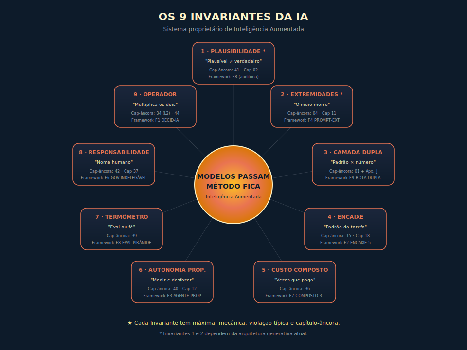

# Os Nove Invariantes da Inteligência Artificial

---

> *"O modelo da semana passada já está obsoleto. Os invariantes que decidem se ele funciona, não."*

---

## A QUESTÃO DE FUNDO

Toda obra técnica em campo que muda rápido tem o mesmo problema básico, que é envelhecer antes do leitor terminar de digerir. O livro impresso no primeiro semestre cobre o modelo lançado em fevereiro, fica obsoleto em agosto, e em janeiro do ano seguinte serve mais como peça de museu que como ferramenta de trabalho. A maioria dos autores enfrenta esse problema correndo atrás da fronteira, com edições que tentam alcançar o lançamento da semana. O resultado é literatura cansada, que perde a relevância junto com o release que documentava.

Há uma estratégia mais antiga, e que funcionou em outros campos por décadas, que é não correr atrás do que muda, mas mapear o que não muda. Os livros canônicos de engenharia, de arquitetura de software, de matemática aplicada, de gestão estratégica, ganharam longevidade exatamente porque separaram o padrão durável do número volátil. Quem aprendia os princípios escapava da obsolescência, e quem aprendia apenas a ferramenta da década pagava a conta da próxima.

Esta obra adota essa estratégia em uma decisão deliberada. Em vez de tentar acompanhar cada modelo, cada preço, cada benchmark, ela identifica os invariantes que decidem se um sistema de IA funciona, independentemente da rodada de lançamentos do trimestre. Esses invariantes estão nomeados aqui como os **nove invariantes da inteligência artificial** — o mesmo nome que dá título ao livro —, e formam a espinha dorsal de tudo que vem depois.

Cada invariante atende a quatro critérios. Primeiro, descreve uma propriedade que permanece estável por anos, não por meses. Segundo, tem mecânica explicável, com causa identificável que justifica por que existe. Terceiro, tem uma violação típica, ou seja, uma forma errada de operar que aparece repetidamente no mercado quando a regra é ignorada. Quarto, tem um capítulo onde se aprofunda com exemplos e exercícios.

Quem dominar esse sistema sai capaz de tomar decisões de adoção, de arquitetura, de operação e de governança que continuam corretas mesmo quando os modelos por trás mudarem. É a fundação que separa quem opera IA com critério de quem reage ao último anúncio.

---

## A NAVEGAÇÃO COMO ANALOGIA

A comparação com a navegação comercial marítima é precisa: o barco mudou de madeira para aço, o combustível de vento para nuclear, a rota conforme economias subiram e desceram — e ainda assim navegar continua sendo a mesma disciplina. A leitura de mares, a aritmética de combustível por carga, o reconhecimento de quando recuar antes de tempestade: quem aprende a navegação sobrevive a qualquer barco; quem aprende apenas a operar um barco específico perde a competência junto com o casco. Os invariantes da IA jogam o mesmo papel: o modelo muda, o fornecedor muda, o preço muda — a separação entre plausível e verdadeiro não muda, a regra de atenção nas extremidades não muda, a proporcionalidade entre autonomia e observabilidade não muda. Navegar é a disciplina invariante. Operar IA é a navegação desta década.

---

## OS NOVE INVARIANTES

Cada um dos nove segue a mesma estrutura interna: uma regra que cabe em uma frase, uma mecânica que explica por que a regra vale, uma violação típica que aparece repetidamente no mercado quando ela é ignorada, um exemplo curto e a indicação do capítulo onde o tema é aprofundado. A intenção é que, ao final desta seção, o leitor consiga citar qualquer um dos nove pelo nome, recitar a regra, descrever a mecânica em até três frases, e reconhecer a violação típica quando ela aparecer em uma reunião.

### Invariante 1 — Plausibilidade

> *"O modelo entrega o plausível, não o verdadeiro — e os dois coincidem, até a hora em que não."*

Um modelo de linguagem moderno é, em sua essência funcional, um motor de plausibilidade estatística. Ele aprende, durante o treinamento, qual sequência de tokens é mais provável dado um contexto, e na inferência produz a continuação que melhor se ajusta a esse padrão. Em domínios estáveis e bem representados no corpus de treino, o plausível e o verdadeiro coincidem com alta frequência. Em domínios novos, em fatos específicos, em números precisos, em referências jurídicas ou em diagnósticos clínicos, o plausível e o verdadeiro divergem, e a divergência custa caro porque a saída plausível inspira confiança injustificada. A calibração da confiança não é tarefa do modelo, é tarefa do operador, e deve ser proporcional ao custo do erro.

A violação típica é aceitar um número jurídico, financeiro ou clínico gerado pelo modelo porque soou certo e a estrutura do texto pareceu apropriada, sem verificar contra fonte autoritativa. O advogado que submeteu jurisprudências inventadas em Nova York em 2023, e que virou referência mundial sobre os riscos do uso ingênuo, é o caso canônico do invariante.

### Invariante 2 — Extremidades

> *"O meio do contexto é onde a informação vai morrer."*

Modelos transformer atuais alocam atenção com viés conhecido para o início e o fim da janela de contexto, fenômeno documentado em *Lost in the Middle* (Liu et al., 2023) e reproduzido em laboratórios independentes desde então. A causa combina propriedades do softmax em contextos longos, do encoding posicional, e do treinamento desproporcionalmente exposto a textos onde informação crítica costuma estar nas pontas. O resultado prático é que, em prompts longos, a informação enterrada no meio da janela tende a receber peso menor que mereceria, com queda mensurável de recall conforme a posição se afasta das extremidades. Densidade de relevância, ou seja, quanta informação útil por token, vence volume bruto.

A violação típica é enterrar a regra mais importante de um sistema no parágrafo quarenta de um prompt gigante, esperando que o modelo a respeite com a mesma força que respeitaria se estivesse logo no início ou logo antes da pergunta. O resultado costuma ser regressão silenciosa quando o prompt cresce e a regra começa a ser ignorada sem ninguém perceber.

### Invariante 3 — Camada Dupla

> *"Decore o padrão, consulte o número."*

Toda obra técnica sobre IA mistura, sem perceber, dois tipos de conteúdo radicalmente diferentes em meia-vida. O padrão dura anos — o que é um token, como funciona atenção, por que RAG existe, quando agente faz sentido, por que governança importa. O número muda em meses — qual modelo lidera tal benchmark, quanto custa cada milhão de tokens, qual a janela de contexto da versão mais recente. Misturar os dois na mesma página garante que o livro envelheça junto com o número, ainda que o padrão continue impecável. A camada dupla separa: padrão na cabeça do operador, número na documentação datada do fornecedor.

A violação típica é memorizar que tal modelo lidera um benchmark com tal percentual, como se fosse fato durável, em vez de aprender o padrão de força relativa do fornecedor naquele eixo. Quando a próxima versão sair, a memória vira passivo.

### Invariante 4 — Encaixe

> *"Escolha pelo padrão da tarefa, nunca pela versão da moda."*

A escolha de modelo deve ser função do padrão da tarefa — código, matemática, contexto longo, multimodal, custo crítico — não da liderança da semana em benchmark agregado. Cada família de modelo frontier tem força relativa em eixos diferentes, e essa força tende a se manter por gerações porque é resultado de escolhas de treinamento, dataset, alinhamento e infraestrutura que não viram de um release para outro. Migrar o stack inteiro para o lançamento mais recente sem teste cego na própria carga é trocar problema conhecido por problema desconhecido.

A violação típica é trocar todo o pipeline para o modelo que liderou o benchmark da semana, porque subiu três pontos em uma métrica agregada, sem ter rodado um único teste na carga real da empresa. Em três meses, descobre-se que o eixo que importava — custo, latência, contexto longo, ou qualquer outro — era exatamente o ponto fraco da nova escolha.

### Invariante 5 — Custo Composto

> *"Trivial é o preço do token; o que quebra o orçamento é quantas vezes você o paga."*

O custo de IA em produção segue uma multiplicação com efeito composto, não uma soma simples. O componente que mais escala não é o preço por token, que é o termo trivial e o único que aparece na primeira conversa sobre orçamento. O componente que escala é o produto do número de chamadas — multiplicado por número de usuários, por sessão, por loop de agente — com redundância — chamadas que poderiam ter sido eliminadas, recachedas ou agrupadas — e tier — uso do modelo premium para tarefas que o modelo menor cobriria com qualidade equivalente. As alavancas reais são arquiteturais — caching de prefixo estável, roteamento entre tiers, redução de loops desnecessários, circuit breakers — não textuais.

A violação típica é otimizar o tamanho do prompt enquanto um loop de agente dispara quarenta chamadas redundantes ao modelo premium. O esforço se concentra no termo trivial, e a fatura continua subindo porque o termo composto não foi tocado.

### Invariante 6 — Autonomia Proporcional

> *"Só dê ao agente a autonomia que você consegue medir e desfazer."*

Autonomia sem observabilidade é passivo, não ativo. O nível de delegação a um agente deve ser função direta de duas capacidades operacionais — a de rastrear o que o agente fez, com tracing por span, com versionamento de prompt e tool, com auditoria de input e output, e a de reverter o que o agente fez, com rollback testado, com estado anterior em hot standby, com kill switch funcional. Quando essas capacidades existem, o agente pode ser promovido a níveis maiores de autonomia, com gates explícitos de promoção. Quando não existem, qualquer autonomia maior que a de copiloto com confirmação é risco acumulado que vence em incidente, não em ROI.

A violação típica é soltar agente com permissão de escrita em produção, sem tracing, sem rollback testado, sem kill switch por tool. O agente funciona em noventa e nove por cento dos casos por sorte do treinamento e do mercado, e no um por cento restante derruba sistema, perde dados ou queima reputação sem que ninguém consiga reconstruir o que aconteceu.

### Invariante 7 — Termômetro

> *"IA sem eval é fé, não engenharia."*

Nenhum sistema de IA deve entrar em produção sem capacidade explícita de detectar regressão antes que ela chegue ao usuário. A avaliação é o que separa engenharia de fé, e tem três camadas canônicas — base determinística (smoke tests, validação de schema, exact match), meio com golden set e LLM-as-judge calibrado, topo com revisão humana especialista em release crítico —, complementadas por adversarial e segurança transversais. Sem golden set, prompt é opinião documentada; mudança no prompt é torcida, não decisão; melhoria percebida é viés do testador, não fato. A avaliação é a infraestrutura cognitiva que transforma operação de IA em disciplina engenheirável.

A violação típica é trocar o prompt em produção porque ficou melhor, sem dataset que prove que não piorou em outro lugar. O efeito é frequente — regressão silenciosa por subgrupo, em que a métrica agregada parece estável e a qualidade caiu para uma classe inteira de casos que ninguém estava medindo.

### Invariante 8 — Responsabilidade Indelegável

> *"A IA executa; a responsabilidade tem sempre um nome humano."*

Toda saída de IA em produção que afeta cliente, balanço, compliance ou direito de terceiros precisa de dono identificável, de controle de acesso, de trilha de auditoria, e de caminho de reversão. A frase "foi a IA que decidiu" não é justificativa juridicamente sustentável em nenhum dos regimes regulatórios que importam — LGPD, AI Act, NIST AI RMF, ISO/IEC 42001 —, e tampouco se sustenta institucionalmente quando o evento vira crise pública. Governança real fecha o triângulo política, processo e prática, e tem nome humano na cadeira de cada decisão consequente. Não delegável quer dizer não delegável.

A violação típica é "foi a IA que decidiu" como desculpa para uma decisão que ninguém assume. Costuma aparecer em incidente de viés algorítmico em RH, em negação automatizada de cobertura em seguros, em conteúdo gerado que viola direito autoral, em qualquer caso em que o sistema falhou e a pergunta "quem é o responsável?" é respondida com silêncio.

### Invariante 9 — Operador

> *"A IA multiplica competência e incompetência pelo mesmo fator."*

A IA não cria competência; ela amplifica a que existe. A mecânica é direta: o modelo produz saída plausível para a instrução recebida, com igual fluência para instrução precisa e instrução vaga. O operador competente fornece instrução precisa, critério de aceitação explícito e capacidade de rejeitar a saída inadequada — e o modelo responde com qualidade proporcional à instrução. O operador sem critério fornece instrução vaga, aceita qualquer saída plausível, e o modelo responde com a mesma fluência, porém com qualidade proporcional à instrução vaga. A amplificação é bidirecional porque o modelo não distingue boa instrução de má instrução por sinalização explícita — responde com mesma confiança a ambas. Daí o nome do livro, *Inteligência Aumentada*: o ativo não é o modelo, é a inteligência humana que o opera. A IA é alavanca; quem decide para onde alavancar é o operador.

A violação típica é esperar que a IA cubra a falta de critério de quem a opera, com a tese implícita de que o modelo entende o que o operador quer dizer. O modelo entrega o plausível para a instrução recebida, não o que o operador queria mas não soube pedir. O resultado é decepção repetida que costuma ser atribuída à ferramenta, quando a causa real é a operação.

---

## UMA RESSALVA HONESTA

Os nove invariantes não são previsão. São sistematização de padrões observáveis. Os invariantes 1 e 2 — Plausibilidade e Extremidades — dependem da arquitetura generativa atual, baseada em transformers (a arquitetura computacional que sustenta os modelos de IA generativa de hoje — explicada no Capítulo 1), e precisarão de revisão quando essa arquitetura for substituída. Os outros sete são invariantes de prática e julgamento, e tendem a permanecer válidos enquanto a função da IA for amplificar trabalho humano. Essa ressalva está aqui registrada, e o leitor que sair daqui carregando os nove invariantes como dogma está ignorando a regra mais importante de todas: ler o que muda contra o que permanece exige humildade epistêmica.

---

## DIAGRAMAS

---

## EXEMPLO MEMORÁVEL — O BANCO SOLAR E O CUSTO DO MÉTODO AUSENTE

> ⚠️ **Cenário ilustrativo** — composto a partir de padrões observados em fintechs brasileiras durante a corrida da IA generativa entre 2024 e 2026. Números são realistas, não identificam empresa específica.

Em meados de 2024, uma fintech brasileira de cerca de quatrocentos colaboradores, chamemos "Banco Solar", percebeu que o mercado tinha mudado. Concorrentes começaram a usar modelos generativos em atendimento e em onboarding, e a diretoria tomou a decisão sensata de acompanhar. O time de tecnologia escolheu o modelo premium do fornecedor proprietário disponível naquele momento, integrou em três pontos do produto, e em poucas semanas tinha caso de sucesso para apresentar ao conselho.

Quatro meses depois, a fronteira mudou. Um novo modelo de outro fornecedor liderou o benchmark mais comentado da semana com algumas casas decimais à frente. A diretoria, lendo o relatório do CIO, decidiu migrar. O argumento técnico foi "o novo lidera o benchmark, vamos ganhar qualidade". O argumento estratégico foi "não podemos ficar para trás". A migração consumiu seis semanas de engenharia, três de validação, duas de comunicação ao usuário. Em produção, a qualidade percebida pelos atendentes caiu, porque o modelo novo era melhor em raciocínio matemático e pior em escrita executiva, e o caso de uso do Banco Solar era escrita executiva. O custo subiu, porque o pricing premium estava em uma escala diferente. O NPS caiu seis pontos em três meses.

A diretoria interpretou o resultado como "modelo errado" e migrou pela terceira vez, agora para um terceiro fornecedor. Mesma história. Sete meses, três migrações, duas linhas de custo subindo, um NPS caindo. No fim do ano, o CTO foi substituído. A causa real do problema não era nenhum dos três modelos. A causa era a ausência de método.

O Banco Solar nunca aplicou o invariante do encaixe, porque escolheu por moda em vez de por padrão de tarefa. Nunca aplicou o invariante do termômetro, porque migrou sem golden set que mostrasse, em sua própria carga, qual modelo era melhor para o que. Nunca aplicou o invariante do custo composto, porque foi atrás do preço por token sem olhar a multiplicação por chamadas e tier. Nunca aplicou o invariante da responsabilidade indelegável, porque cada migração foi descrita como decisão técnica sem dono nominal que respondesse pelo resultado.

A lição estrutural não está na escolha de modelo, está na ausência do filtro que cada escolha precisaria passar. Modelos passam, método fica. Sem invariantes, toda migração é remorso documentado. Com invariantes, a primeira escolha é mais lenta, as próximas viram exercício, e o ciclo de remorso fica para os concorrentes.

> 🎯 **PARA EXECUTIVOS**
> A questão "qual modelo escolhemos?" é menos importante do que "qual método nos protege da próxima migração inevitável?". Diretorias que internalizam essa diferença trocam três migrações erradas por uma boa, e ganham margem de tempo para aplicar os ganhos reais da IA em vez de gastar trimestres reagindo a benchmark.

---

## QUANDO USAR E QUANDO EVITAR OS INVARIANTES

Os invariantes funcionam como filtro de decisão sempre que houver uma adoção de IA em iniciativa nova, uma escolha ou migração de modelo ou fornecedor, uma refatoração de arquitetura que envolva agentes, RAG, memória ou MCP, uma definição de orçamento de IA ou revisão de gasto recorrente, uma construção ou revisão de política de governança, uma avaliação de proposta de fornecedor externo ou de consultoria, ou uma apresentação executiva sobre IA à diretoria ou conselho.

O que precisa ser evitado é o uso como mantra desconectado de números reais. Os invariantes são filtro de decisão e modelo mental de prática, não substituem dados, avaliações, auditorias e revisão técnica. Quem invoca o invariante do termômetro sem ter golden set para mostrar está praticando exatamente a fé que o invariante combate. O sistema só funciona se cada invariante é amarrado a um número real e a uma prática real.

---

## VANTAGENS E LIMITAÇÕES

| Vantagem | Limitação |
|----------|-----------|
| Estabilidade conceitual em campo que muda toda semana | Invariantes 1 e 2 dependem da arquitetura generativa atual; arquiteturas futuras podem mudar a mecânica |
| Vocabulário citável que vira norma de decisão | Sistema novo; precisa de tempo para "pegar" como referência |
| Capacidade de auditar decisão pelo invariante violado | Em mãos erradas, vira filtro burocrático em vez de modelo mental |
| Costura narrativa que conecta toda a obra | Não substitui leitura técnica dos capítulos onde cada tema é aprofundado |
| Permite ensino acelerado em formato de workshop ou curso | Demanda disciplina do operador para aplicar nos dois lados — decisão e revisão |

---

## SÍNTESE EXECUTIVA

| # | Invariante | Regra |
|---|-----------|-------|
| 1 | **Plausibilidade** | O modelo entrega o plausível, não o verdadeiro |
| 2 | **Extremidades** | O meio do contexto é onde a informação vai morrer |
| 3 | **Camada Dupla** | Decore o padrão, consulte o número |
| 4 | **Encaixe** | Escolha pelo padrão da tarefa, nunca pela versão da moda |
| 5 | **Custo Composto** | Trivial é o preço do token; o que quebra é quantas vezes você o paga |
| 6 | **Autonomia Proporcional** | Só dê ao agente a autonomia que você consegue medir e desfazer |
| 7 | **Termômetro** | IA sem eval é fé, não engenharia |
| 8 | **Responsabilidade Indelegável** | A IA executa; a responsabilidade tem sempre um nome humano |
| 9 | **Operador** | A IA multiplica competência e incompetência pelo mesmo fator |

---

## AUTOAVALIAÇÃO

| # | Critério | Você consegue? |
|---|----------|----------------|
| 1 | **Clareza** — Recitar os nove invariantes em ordem, com a regra de pelo menos cinco, em até quatro minutos, sem consultar | ☐ |
| 2 | **Profundidade** — Defender em mesa técnica por que os invariantes 1 e 2 dependem da arquitetura atual e os outros sete não | ☐ |
| 3 | **Aplicação** — Identificar, agora, qual invariante é o ponto mais frágil do seu time atual, e o que faria nos próximos catorze dias | ☐ |
| 4 | **Conexão** — Apontar, para cada invariante, o capítulo onde ele é aprofundado, sem consultar o sumário | ☐ |
| 5 | **Reconhecimento** — Identificar, em uma proposta técnica de fornecedor, qual invariante está sendo respeitado e qual ignorado | ☐ |

---

## EXERCÍCIOS

**Diagnóstico do time.** Para cada um dos nove invariantes, escreva em uma linha a violação típica que aparece no seu time hoje. Identifique os três mais críticos. Combine com seu par de gestão um plano de remediação em trinta, sessenta e noventa dias.

**Auditoria de decisões.** Selecione três decisões recentes de IA na sua organização — escolha de modelo, adoção de MCP, decisão de avaliação, decisão de fine-tuning, política de uso. Para cada uma, classifique qual invariante foi respeitado e qual foi violado. Descreva o que teria mudado se cada decisão tivesse passado pelo filtro completo dos nove.

**Versão de bolso para o time.** Reduza cada invariante a uma frase de no máximo doze palavras adaptada à linguagem da sua empresa. Distribua a versão de bolso para o time direto. Em trinta dias, observe se a linguagem entrou nas reuniões.

> *Exemplo de versão de bolso:* Invariante 1 (Plausibilidade) → "O modelo soa certo, mas pode estar errado — confira antes de entregar." Invariante 7 (Termômetro) → "Sem golden set no repositório, a mudança no prompt é torcida." A transformação é de linguagem técnica para linguagem operacional da empresa — o invariante não muda, a formulação encaixa na cultura do time.

**Caça às frases de violação.** Liste, da última semana, três frases ouvidas em sua organização que correspondem a violações típicas listadas neste capítulo. Para cada uma, descreva o que responderia citando o invariante violado.

---

## REFERÊNCIAS PRINCIPAIS

Os nove invariantes são proposta original desta obra, sintetizando padrões observados em literatura técnica, em práticas operacionais e em incidentes documentados. As referências secundárias que mais influenciaram a formulação seguem abaixo.

Sobre a separação plausível e verdadeiro:
- Bender, E.; Gebru, T. et al. *On the Dangers of Stochastic Parrots* (2021).
- Bommasani, R. et al. *On the Opportunities and Risks of Foundation Models* (Stanford CRFM, 2021).
- Bai, Y. et al. *Constitutional AI: Harmlessness from AI Feedback* (Anthropic, 2022).

Sobre atenção e extremidades:
- Vaswani, A. et al. *Attention Is All You Need* (2017).
- Liu, N. F. et al. *Lost in the Middle: How Language Models Use Long Contexts* (2023).

Sobre o padrão durável e o número volátil:
- Karpathy, A. *Software 2.0 / Software 3.0* (palestras públicas, 2017–2024).
- Russell, S.; Norvig, P. *Artificial Intelligence: A Modern Approach* (4ª ed., 2020).

Sobre custo composto:
- Documentação técnica de prompt caching dos principais fornecedores comerciais.
- a16z. *The Emerging Architectures for LLM Applications* (Bornstein & Radovanovic, 2023).

Sobre autonomia proporcional e governança:
- Beyer, B. et al. *Site Reliability Engineering* (Google, 2016).
- NIST. *AI Risk Management Framework (AI RMF 1.0)* (2023).
- Anthropic. *Responsible Scaling Policy* (2023, 2024).

Sobre avaliações:
- Liang, P. et al. *HELM: Holistic Evaluation of Language Models* (Stanford CRFM, 2022–).
- Zheng, L. et al. *Judging LLM-as-a-Judge* (2023).
- Narayanan, A. & Kapoor, S. *Evaluating LLMs is a minefield* (Princeton, 2023).

Sobre o operador como multiplicador:
- Drucker, P. *The Effective Executive* (1966) — argumento central de que executividade é questão de método, não de talento inato; a ponte para IA é direta: assim como Drucker mostra que o executivo eficaz define o que quer antes de agir, o operador de IA eficaz define instrução precisa e critério de aceitação antes de enviar o prompt.
- Engelbart, D. *Augmenting Human Intellect* (1962) — fonte conceitual da expressão "inteligência aumentada"; Engelbart argumenta que ferramenta amplifica o raciocínio humano na proporção da habilidade do operador, tese que antecipa exatamente a mecânica bidirecional do Invariante 9.

---

> *"Modelos passam. Método fica."*
