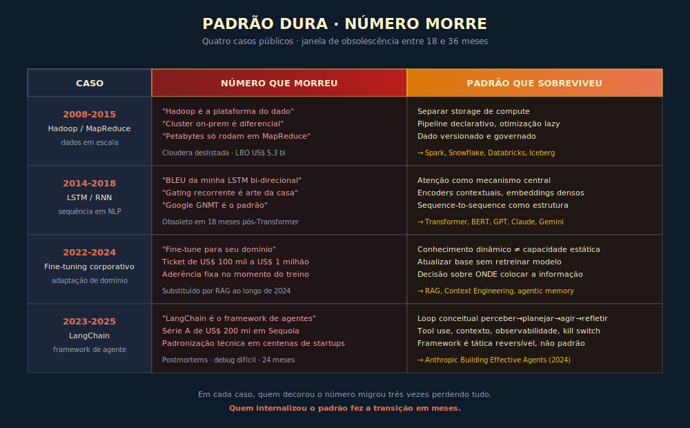

# Por Que Padrão Dura e Número Morre

---

> *"Todo número que parece sólido hoje foi, em algum ponto da década passada, a aposta que custou carreira de quem confundiu liderança de release com regra de longo prazo."*

---

---

## ABERTURA

A conta de quem persegue o número e ignora o padrão não chega no mês do release, chega no segundo ano depois dele, quando a versão que parecia consagrada virou plataforma morta, o contrato de fornecedor virou prisão de plataforma, o time inteiro decorou um vocabulário que ninguém mais usa, e a próxima rodada de migração custa três vezes a primeira porque a anterior consumiu a paciência da diretoria. O custo do número confundido com padrão não é caro porque o número é errado, é caro porque o número não foi feito para durar, e quem o tratou como durável pagou o seguro de uma promessa que ninguém assinou.

Este capítulo demonstra essa diferença, com casos públicos verificáveis dos últimos quinze anos de tecnologia de dados e IA, e mostra por que o método que separa as duas camadas é a defesa mais barata contra a obsolescência involuntária. A tese é simples e a evidência histórica é redundante: todas as vezes em que um número virou ortodoxia, ele morreu em uma janela curta, e todas as vezes em que um padrão foi destilado da prática, ele sobreviveu à mudança de fornecedor, de arquitetura e de geração de modelo. A diferença entre as duas trajetórias é o que separa um operador que envelhece como referência de um operador que envelhece como cautionary tale.

---

## P.1 — O PROBLEMA EPISTÊMICO EM IA

O ritmo de release no campo de IA generativa tem uma característica que diferencia esta disciplina de quase qualquer outra área técnica que um executivo já tenha enfrentado, que é a velocidade com que a fronteira muda de mão. Entre 2022 e 2026, o cenário de modelos de fronteira passou por pelo menos seis ciclos completos de liderança em benchmark agregado, com Anthropic, OpenAI, Google DeepMind e laboratórios menores se revezando na primeira posição de SWE-bench Verified, GPQA Diamond, MMLU Pro e dezenas de outras métricas comparativas que foram inventadas, popularizadas e abandonadas em janelas de dezoito a vinte e quatro meses, de acordo com o histórico público mantido por agregadores como Papers With Code e LMSYS Chatbot Arena. O ritmo dissolve a memória profissional porque, antes que o operador termine de internalizar a primeira versão das boas práticas, a segunda versão já invalidou metade das premissas que sustentavam a primeira, e o ciclo recomeça.

A consequência operacional para o executivo é menos óbvia do que parece. O CTO que tenta acompanhar a fronteira por consumo direto de notícias técnicas, em vez de por consumo estruturado de padrão, gasta um terço da semana lendo material que envelhece em três meses, e perde a capacidade de distinguir entre o que precisa ser lembrado para a próxima decisão e o que pode ser esquecido sem custo. A tomada de decisão executiva degrada porque o filtro mental do decisor está saturado de informação que não serve mais, e o sinal de longo prazo, ou seja, o padrão que ajuda a decidir corretamente em mais de uma geração de modelo, é abafado pelo ruído de release.

A Camada Dupla, terceiro dos Nove Princípios, é a resposta institucional a esse problema. Em vez de tratar todo conteúdo técnico como se tivesse a mesma meia-vida, o operador separa explicitamente o que dura — princípio, padrão arquitetural, mecânica de trade-off, fundação conceitual — do que muda — versão, preço, benchmark, janela de contexto, capacidade nova de produto. O padrão entra na cabeça do operador para revisão pessoal periódica, com cadência longa medida em meses ou trimestres. O número entra no Apêndice J para consulta sob demanda, antes de cada decisão executiva relevante. O resultado é que a decisão executiva passa a ser informada pelas duas camadas separadamente, com cada uma puxada da fonte certa, e a memória profissional para de envelhecer junto com o release.

A escolha por essa arquitetura cognitiva não é estética. É consequência direta de uma observação empírica robusta, repetida em ciclos diferentes da história recente da tecnologia de dados, que está documentada nos próximos casos. Em cada um deles, uma geração inteira de operadores confundiu número com padrão e pagou a conta da confusão em projeto cancelado, time desmotivado e dois anos de atraso competitivo. Os exemplos são selecionados porque envolvem empresas de capital aberto ou laboratórios com produção pública verificável, e porque a janela de obsolescência foi curta o bastante para ainda ser memória viva de quem trabalha com IA hoje.

---

## P.2 — CASO HISTÓRICO 1: A MORTE DA REGRA "MAPREDUCE É O PADRÃO"

Em outubro de 2003, o Google publicou o artigo *The Google File System*, e em dezembro de 2004 publicou *MapReduce: Simplified Data Processing on Large Clusters*, ambos assinados por engenheiros da casa, incluindo Jeffrey Dean e Sanjay Ghemawat. Os dois artigos descreviam o modelo de computação distribuída que sustentava a indexação da web no Google e, ao serem publicados, viraram o que muitos consideraram a referência canônica para processar volume grande de dados. A reação do mercado foi a esperada: Doug Cutting e Mike Cafarella iniciaram em 2005 o projeto que viraria Hadoop, e a Apache Software Foundation o assumiu como projeto de topo em 2008, conforme cronologia pública mantida pela própria Apache. Em poucos anos, Hadoop virou o nome que CIO mencionava em conselho quando perguntado sobre estratégia de dados, e o número que aparecia em apresentação executiva era o tamanho do cluster em terabytes, a quantidade de nós, a taxa de adoção em Fortune 500.

Entre 2010 e 2013, uma onda de empresas brasileiras e globais investiu fortemente em clusters Hadoop on-premises, porque o número parecia incontestável. O volume de dados crescia, o custo por terabyte em commodity hardware caía, e a literatura corporativa de fornecedores como Cloudera, Hortonworks e MapR tratava Hadoop como o sistema operacional do futuro do dado. Bancos, telecoms e varejistas que adotaram Hadoop nesse período publicaram cases em conferências como Strata, com métricas detalhadas de petabytes armazenados e jobs processados por dia. O número estava lá, era real, e a decisão de adoção parecia conservadora.

A virada veio mais cedo do que quase ninguém previu. Em 2010, Matei Zaharia e colegas da UC Berkeley publicaram o artigo seminal sobre Resilient Distributed Datasets, base do Apache Spark, e em 2014 o Spark virou projeto top-level Apache. O Spark resolvia o ponto cego do MapReduce — a serialização constante para disco entre etapas — mantendo computação em memória quando possível, e em cargas iterativas, comuns em machine learning, entregava ordens de magnitude de melhoria em latência, conforme benchmarks publicados em artigos como *Spark: Cluster Computing with Working Sets* (Zaharia et al., HotCloud 2010). Em paralelo, a Amazon Web Services lançou em 2012 o Redshift, e o Google lançou em 2010 o BigQuery, dois sistemas que ofereciam processamento de dado em escala sem cluster próprio, com modelo serverless e separação física entre storage e compute. Em 2013 a Cloudera reconheceu publicamente a tendência ao integrar Spark como cidadão de primeira classe em sua distribuição, e a partir de 2015 o discurso de fornecedor virou massivamente cloud-first.

Quem decorou o número — "Hadoop é a plataforma do dado em escala", "Fortune 500 está adotando Hadoop em massa", "petabytes só rodam em MapReduce" — pagou a conta entre 2015 e 2019, com migração penosa para cloud-native, contratos de suporte de licença Hortonworks ou Cloudera que viraram passivo, e timelines de modernização que consumiram dois e três anos de capacidade do time de dados. Em 2019, a Cloudera e a Hortonworks anunciaram fusão, sinal claro de consolidação defensiva em um mercado que estava migrando para Snowflake, Databricks e arquiteturas lakehouse. Em 2021, a Cloudera foi tirada da bolsa em um leveraged buyout de US$ 5,3 bilhões, conforme comunicado oficial à SEC. A Yahoo!, que financiou a maior parte da evolução inicial do Hadoop e tinha um dos maiores clusters do mundo, terminou a década com uma fração da relevância que tinha em 2010, e por motivos que vão além do Hadoop mas que incluem a dificuldade de modernizar uma plataforma estruturada em torno de uma premissa que envelheceu.

A lição estrutural não é que Hadoop foi ruim. Hadoop resolveu problemas reais por uma janela de aproximadamente uma década, e seu legado em conceitos como sistema de arquivos distribuído resiliente continua presente em tudo que veio depois. A lição é que o número que parecia mais durável da década — adoção de Hadoop em corporação grande — virou prisão de plataforma para quem decorou esse número em vez do padrão. **O padrão que durou era outro, e é o padrão que sobreviveu a três gerações de tecnologia: separar storage de compute, descrever pipeline de forma declarativa em vez de imperativa, deixar otimização ser lazy e responsabilidade do planejador, tratar o dado como bem versionado e governado em vez de bem fluido em job ad hoc.** Esse padrão estava no MapReduce em forma germinal, no Spark em forma madura, e está em Snowflake, Databricks, BigQuery, Iceberg e Delta Lake em forma cloud-native. Quem internalizou o padrão migrou três vezes de plataforma sem perder método. Quem decorou o número migrou três vezes perdendo tudo.

---

## P.3 — CASO HISTÓRICO 2: A MORTE DA REGRA "RNN/LSTM É O PADRÃO PARA SEQUÊNCIA"

Em meados da década de 2010, a arquitetura padrão para qualquer problema envolvendo sequência — tradução automática, modelagem de linguagem, reconhecimento de fala, análise de sentimento — era recorrente. Long Short-Term Memory, proposta originalmente por Sepp Hochreiter e Jürgen Schmidhuber em 1997, viveu seu período de glória entre 2014 e 2017, quando ganhou tração massiva em PNL graças a artigos como *Sequence to Sequence Learning with Neural Networks* (Sutskever, Vinyals e Le, NeurIPS 2014), que aplicou encoder-decoder com LSTM a tradução, e ao trabalho do Bahdanau, Cho e Bengio sobre alinhamento por atenção em tradução neural, publicado em 2015. O Google anunciou em 2016 a substituição do seu sistema de tradução por uma arquitetura baseada em LSTMs profundas com atenção, conhecida como GNMT, e publicou métricas demonstrando redução de cerca de sessenta por cento em erros de tradução em pares de idiomas selecionados, conforme paper *Google's Neural Machine Translation System* (Wu et al., 2016). O número estava em todos os relatórios técnicos de equipes corporativas de PNL, com acurácias detalhadas de BLEU, e a profundidade da literatura publicada sobre LSTMs entre 2014 e 2017 era avassaladora.

Equipes corporativas que precisavam construir capacidade interna em PNL entre 2015 e 2017 fizeram uma escolha aparentemente óbvia, que foi investir em domínio profundo de arquiteturas recorrentes, com toda a infraestrutura de treinamento que isso exigia. Empresas de tradução automática, de assistente de voz, de classificação de documento jurídico, de análise de risco em chat, contrataram pesquisadores especializados em LSTM, montaram pipelines de treinamento de meses, publicaram em conferências do setor sobre as variantes que tinham implementado — Bi-LSTM, LSTM com atenção, ConvLSTM, e uma dezena de outras combinações. Faculdades de engenharia incluíram capítulos detalhados sobre RNN, GRU e LSTM em seus programas de mestrado em IA. O conhecimento era denso, técnico, e parecia durável.

Em junho de 2017, oito pesquisadores do Google publicaram *Attention Is All You Need*, paper que introduziu o Transformer e demonstrou que uma arquitetura baseada inteiramente em mecanismo de atenção, sem qualquer recorrência, superava o estado da arte em tradução automática com fração do tempo de treinamento. O paper foi recebido inicialmente como uma alternativa interessante para tradução, e em pouco mais de doze meses se mostrou o início de uma ruptura completa. O BERT, publicado pelo Google AI Language em outubro de 2018, demonstrou que Transformers pré-treinados em corpus massivo entregavam ganhos significativos em uma bateria inteira de benchmarks de PNL, e o GPT-2, da OpenAI, publicado em fevereiro de 2019, mostrou capacidade de geração que tornava obsoleta praticamente toda a infraestrutura LSTM construída na década anterior. O Google substituiu o sistema GNMT internamente por arquiteturas baseadas em Transformer ao longo de 2017 e 2018, e por volta de 2020 a infraestrutura RNN/LSTM tinha sido abandonada como ponto de partida para sistema novo em qualquer laboratório de fronteira.

Equipes que tinham investido pesado entre 2015 e 2017 em domínio profundo de LSTM ficaram com competência específica que perdeu valor de mercado em dezoito meses. Pesquisadores que tinham construído carreira sobre variantes recorrentes precisaram, entre 2018 e 2020, recomeçar com Transformers, e parte significativa da literatura publicada nessa janela perdeu relevância como ponto de partida para sistema novo. O número — BLEU de tal LSTM, profundidade da arquitetura recorrente publicada por tal laboratório — durou menos de dois anos como referência durável.

A lição estrutural está no que sobreviveu à ruptura. **O padrão que durou foi a noção de atenção como mecanismo central, encoders contextuais que produzem representação rica de cada token em função de seu contexto, embeddings densos que capturam similaridade semântica em espaço vetorial, e tarefas formuladas como sequence-to-sequence com estrutura encoder-decoder.** Esses padrões estavam presentes em forma incompleta no trabalho com LSTM e atenção entre 2014 e 2016, e foram radicalizados pelo Transformer. Quem havia internalizado o padrão — atenção, contexto, embedding denso, sequence-to-sequence — fez a transição para Transformer em meses, porque o vocabulário conceitual era o mesmo e só a implementação mudou. Quem havia decorado o número, com toda a sua engenharia específica de gating recorrente, perdeu dois anos antes de voltar a operar na fronteira.

---

## P.4 — CASO HISTÓRICO 3: A MORTE DA REGRA "FINE-TUNING CUSTOMIZADO É O CAMINHO CORPORATIVO"

Entre o lançamento do GPT-3 pela OpenAI em junho de 2020 e o início de 2023, o discurso corporativo sobre como adotar modelos de linguagem em produção convergiu rapidamente para uma resposta que parecia tecnicamente óbvia: fine-tuning customizado de modelos sobre o domínio da empresa. A lógica parecia incontestável, com modelos genéricos faltando vocabulário específico da indústria, exemplos da base de conhecimento interna, tom da marca, formato de saída padronizado, e fine-tuning permitindo adaptar pesos do modelo a esses padrões. A OpenAI lançou em 2021 o produto de fine-tuning para versões do GPT-3, e em 2022 e início de 2023, fornecedores de consultoria especializada começaram a oferecer projetos de fine-tuning corporativo com ticket de seis dígitos em dólares ou mais, conforme tabelas de preços de boutiques de IA publicadas em material comercial da época. *(Faixas de preço datadas de 2022-2023 disponíveis no Apêndice J — número típico da época que não pertence ao corpo por ser exatamente o tipo de dado que o próprio capítulo argumenta envelhecer.)*

Departamentos de inovação de bancos, seguradoras, escritórios de advocacia, empresas de saúde e varejistas se moveram para projetos de fine-tuning entre 2022 e meados de 2023. O número que justificava o investimento era qualidade de saída em domínio fechado, medida por avaliações internas que mostravam que o modelo customizado entregava aderência terminológica e formato superior ao modelo base. O CIO assinava o projeto, a consultoria construía o dataset de fine-tuning, o modelo era treinado, métricas de qualidade eram apresentadas em sala de diretoria, e o resultado parecia justificar o ticket.

A inflexão veio de duas direções simultâneas. A primeira foi a maturação de RAG, arquitetura em que o modelo, sem alteração de pesos, consulta uma base de conhecimento vetorial no momento da inferência, formulada inicialmente em paper como *Retrieval-Augmented Generation for Knowledge-Intensive NLP Tasks* (Lewis et al., NeurIPS 2020) e popularizada em produção por bibliotecas como LangChain e LlamaIndex entre 2022 e 2023. A segunda foi a melhoria contínua dos modelos base, com GPT-4 em março de 2023, Claude 2 em julho de 2023, e a sequência de versões subsequentes da Anthropic, OpenAI e Google que reduziram drasticamente o gap de qualidade entre modelo genérico bem-instruído e modelo fine-tuned em domínio. Resultados de benchmark publicados pelas próprias empresas, somados a estudos independentes em settings corporativos, começaram a mostrar que RAG sobre modelo base entregava aderência ao domínio comparável a fine-tuning, com custo de operação significativamente menor e, sobretudo, com capacidade de atualizar a base de conhecimento sem retreinar o modelo.

Para o executivo corporativo, a diferença era prática. O fine-tuning entregava aderência fixa no momento do treinamento, e qualquer atualização exigia novo ciclo de treinamento custoso. RAG entregava aderência dinâmica, com a base de conhecimento atualizada de forma contínua, sem mexer no modelo. O custo total de propriedade caía em ordem de magnitude, e a qualidade percebida, em casos de uso corporativo típicos, era equivalente ou superior. Por volta do final de 2023 e início de 2024, a recomendação consensual em conferências como Microsoft Build, AWS re:Invent e Google Cloud Next tinha mudado de "fine-tune para seu domínio" para "comece com RAG, considere fine-tuning apenas quando RAG comprovadamente não basta", e a Anthropic, em sua documentação técnica pública, passou a recomendar explicitamente engenharia de prompt, depois RAG, depois fine-tuning, como hierarquia de adoção.

Empresas que tinham fechado contratos de fine-tuning de seis dígitos em 2022 e início de 2023 ficaram com sistemas que entregavam aproximadamente oitenta por cento do valor que RAG entregaria por aproximadamente cinco por cento do custo, e com a complicação adicional de que o modelo customizado era difícil de atualizar conforme a base de conhecimento mudava. Vários desses projetos foram silenciosamente substituídos por arquiteturas RAG ao longo de 2024, com o investimento original tratado como sunk cost.

A lição estrutural não está em condenar fine-tuning, que continua válido em nichos específicos como adaptação de tom de marca em escala, adequação a regulação que exige saída determinística em formato específico, ou redução de latência em casos de uso onde o prompt longo de RAG é proibitivo. A lição é que o número — qualidade de fine-tune em benchmark interno — era atraente e durou pouco, enquanto o padrão — separar conhecimento dinâmico, que pertence a uma base de dados atualizável, de capacidade generativa estática, que pertence a um modelo treinado — durou e vai durar. **Esse padrão é independente da arquitetura do modelo, do fornecedor, da geração da tecnologia, porque opera no nível da decisão sobre onde colocar cada tipo de informação no sistema, e essa decisão envelhece bem, ao contrário do contrato de fine-tuning que envelhece em meses.**

---

## P.5 — CASO HISTÓRICO 4: A MORTE DA REGRA "AGENT FRAMEWORK X É VENCEDOR"

Entre outubro de 2022 e meados de 2023, o LangChain virou o framework de orquestração de LLM mais comentado do mercado, com adoção massiva refletida em estrelas no GitHub, em palestras de conferência, em materiais de bootcamp, e em decisões de stack de centenas de startups. O LangChain capitalizou em uma janela em que a API de modelos de linguagem ainda não tinha amadurecido o suficiente para suportar facilmente os padrões de prompt chaining, retrieval, ferramentas e memória que aplicações reais exigiam, e ofereceu abstrações em Python e TypeScript que cobriam essa lacuna. O hype foi acompanhado por captação de investimento robusta, com a empresa LangChain Inc. tendo levantado rodada Série A liderada por Sequoia em fevereiro de 2024, conforme cobertura da TechCrunch e do Reuters da época. (Avaliação de rodada citada na imprensa — número datado disponível no Apêndice J, tipicamente volátil à medida que o mercado reavalia.)

A virada começou silenciosamente em 2024. Times maduros, especialmente em empresas que tinham passado pelos primeiros incidentes de produção com sistemas agentes construídos sobre LangChain, começaram a publicar postmortems indicando dificuldade de debug, abstrações que ocultavam o que estava efetivamente sendo enviado ao modelo, dependência transitiva pesada, e tendência da biblioteca a mudar API em janelas curtas. Posts técnicos de equipes de engenharia em empresas como Octomind, conhecidos no setor por terem publicado em 2024 um documento bem circulado sobre por que abandonaram o LangChain após dezoito meses de uso em produção, articularam o argumento de que, à medida que os modelos amadureciam e suas APIs nativas passaram a oferecer ferramentas de tool use, streaming, structured output e gerenciamento de contexto, o valor de uma camada de abstração genérica caía, enquanto seu custo em complexidade subia.

Em paralelo, alternativas mais leves e diretas ganharam tração, como o LangGraph, lançado pelo próprio time do LangChain como evolução; o LlamaIndex, originalmente focado em RAG e expandido para agentes; frameworks proprietários de fornecedor, como o Anthropic publicou em 2024 e 2025 sob a forma de SDKs e padrões oficiais de tool use; e, no extremo simples, equipes que voltaram a usar a API HTTP nua dos fornecedores com uma fina camada própria, argumentando que essa abordagem entregava controle total com custo de manutenção menor que a alternativa de framework grande. Vale declarar: a Anthropic, cujos modelos são referenciados ao longo desta obra, foi um dos participantes desse movimento de recomendação direta — publicou em dezembro de 2024 o artigo *Building Effective Agents*, que defendeu explicitamente que a maioria dos casos de uso de agente é melhor servida por composições simples de patterns conhecidos do que por adoção de framework agentic genérico. Recomendação análoga foi feita no mesmo período por AWS (arquitetura de agentes no re:Invent 2024) e Google (ADK — Agent Development Kit, 2025). A análise aqui é sobre o padrão do ciclo de hype de frameworks de orquestração — não sobre a superioridade de qualquer fornecedor específico.

O ciclo do LangChain de líder consensual a alternativa controversa demorou aproximadamente vinte e quatro meses, e o resultado prático para o executivo é que toda empresa que tinha padronizado em LangChain como "o framework de agentes" entre 2023 e meados de 2024 enfrentou uma escolha desagradável em 2025: manter a aposta com o custo de complexidade reconhecido, ou migrar com o custo de retrabalho. Nenhuma das duas opções é confortável, e ambas refletem o custo de ter tratado um framework como padrão durável.

A lição estrutural é direta. **Framework de agente é número, com meia-vida de doze a vinte e quatro meses, sujeito ao ciclo de hype, captação, amadurecimento e desencanto que se repete em todo nicho de tooling. O padrão durável é o loop conceitual que qualquer agente implementa — perceber o estado relevante, planejar a próxima ação, agir através de uma ferramenta ou de uma escolha, observar o resultado, refletir sobre o que aprendeu e atualizar o plano —, junto com os componentes invariantes que qualquer arquitetura de agente exige, como tool use bem definido, gerenciamento de contexto, observabilidade por span, controle de loop, kill switch.** Esses componentes existem antes do LangChain, vão existir depois dele, e são implementáveis em qualquer framework, ou em nenhum. Quem internalizou o padrão escolhe ferramenta como decisão tática reversível. Quem decorou o framework como padrão paga o custo da próxima migração inevitável.

---

## P.6 — POR QUE O PADRÃO DURA

O padrão é, por definição, uma abstração sobre a operação. Ele descreve a forma da decisão, do trade-off, da estrutura, independentemente do detalhe de implementação que materializa essa forma em um produto específico. A separação entre storage e compute é padrão porque descreve uma propriedade arquitetural — onde os dados moram em relação a onde a computação acontece — que existe em MapReduce de forma rudimentar, em Spark de forma mais clara, e em arquiteturas lakehouse de forma plena, e continuará existindo na próxima geração de plataforma de dados qualquer que seja seu nome comercial. A atenção é padrão porque descreve um mecanismo cognitivo do modelo — alocar peso de processamento para partes do contexto em função de relevância — que sobrevive a qualquer ajuste de implementação porque resolve um problema estrutural que qualquer arquitetura generativa precisa resolver.

Padrões sobrevivem a mudança de fornecedor, de framework e de geração de modelo porque operam no nível da decisão e do trade-off, não no nível do produto. Eles não competem com release, eles emolduram o release. A escolha por princípio em vez de por moda, princípio quatro dos Nove, é exatamente essa decisão metodológica de operar no nível durável em vez de no nível volátil. Quando o operador internaliza a propriedade abstrata, ele consegue avaliar o produto novo no momento em que aparece, classificá-lo em relação aos trade-offs que conhece, e decidir com critério estável, em vez de reagir ao número da semana.

O padrão também dura porque sua taxa de inovação é diferente. A literatura científica de fundação técnica, em campos como sistemas distribuídos, teoria da informação, otimização, álgebra linear aplicada, evolui em escala de décadas, e os princípios derivados dessa literatura mudam pouco em janelas que parecem longas no calendário de release de fornecedor mas são curtas na história da disciplina. O operador que ancora seu vocabulário conceitual nessas fundações herda parte da estabilidade delas, em vez de surfar a turbulência da camada de produto.

---

## P.7 — POR QUE O NÚMERO MORRE

O número, ao contrário, é amarrado a contexto temporal. Toda métrica de benchmark é resultado de uma medição com uma metodologia, um dataset, uma versão de modelo, em uma data, com um pipeline de avaliação que tem suas próprias escolhas técnicas. Toda métrica de preço é função de uma estratégia comercial do fornecedor em um trimestre, sujeita a revisão a qualquer momento quando a competição força ajuste. Toda especificação técnica — janela de contexto, latência, capacidade de input multimodal — é função da versão atualmente disponível, e a próxima versão tem alta probabilidade de revisar a especificação.

Sem data e fonte explícitas, qualquer número técnico vira folclore. O executivo que ouviu em conferência que "tal modelo lidera o benchmark com tantos por cento" e levou essa frase para reunião interna sem a data, sem o nome exato do benchmark, sem a versão exata do modelo e sem a fonte, está repassando uma afirmação que não pode ser verificada e que muito provavelmente não vale mais. Com data e fonte, o número vira referência efêmera, ou seja, uma medição localizada em tempo que serve para a decisão atual mas não pretende durar. A diferença entre folclore e referência efêmera é tudo, porque uma trava decisão futura em premissa errada, outra orienta decisão presente com premissa verificável.

Essa é a razão pela qual o número vive no Apêndice J e não no corpo do livro. O Apêndice J é a trilha do número da Rota Dupla, com cada linha datada, com fonte primária por linha, mantida como instrumento vivo no repositório acompanhante sem cadência fixa anunciada, conforme F9. O corpo do livro é a trilha do padrão, sem datas, sem versões, sem preços, com revisão pessoal de leitura medida em anos. Misturar as duas é o erro que faz a literatura técnica em campo dinâmico envelhecer junto com o release que documentava, e a separação explícita é a defesa de método contra esse envelhecimento.

---

## P.8 — IMPLICAÇÃO EXECUTIVA

A implicação para a carreira de um CTO ou Head de Tecnologia é direta e quantificável em termos de juros compostos. O executivo que decora número paga juros compostos em obsolescência, porque cada número decorado vira premissa em decisões subsequentes, e quando o número morre, todas as decisões dependentes dele precisam ser revisitadas em cascata. O CTO que decorou "modelo X lidera em código" baseia sua escolha de stack de copiloto in-product nessa premissa, baseia sua negociação comercial nessa premissa, baseia o treinamento do time nessa premissa, e quando a premissa morre seis meses depois, todas as decisões a jusante precisam ser revistas, com custo de switching que escala não-linearmente com a profundidade da integração.

O executivo que decora padrão e consulta número paga juros simples em tempo de consulta. Ele gasta dez minutos antes da decisão para checar no Apêndice J o número corrente, valida que a premissa de produto continua válida, e toma a decisão com a moldura conceitual que já estava na cabeça. Quando o número muda, a decisão é refeita em outros dez minutos de consulta, sem que a moldura precise ser reconstruída, porque a moldura é o padrão, e o padrão não mudou. A diferença em uma carreira de cinco a dez anos é dramática, porque o primeiro executivo está em ciclo perpétuo de remorso documentado e migração, e o segundo está em ciclo de decisão estável com revisão periódica.

A vantagem da Rota Dupla escala com o nível de senioridade. Para o engenheiro júnior, decorar número é tentador porque dá sensação de domínio técnico rápido. Para o gerente intermediário, o número entra em apresentação executiva e parece justificar a decisão. Para o CTO, o número decorado vira passivo institucional, e o padrão internalizado vira o ativo mais durável da carreira, porque é o que continua relevante quando o CTO troca de empresa, quando a empresa troca de fornecedor, quando o fornecedor troca de roadmap. O capital intelectual de um executivo que opera com camada dupla é portável; o de um executivo que opera sem ela é específico ao release.

Há uma consequência secundária menos óbvia. O CTO que decorou padrão consegue formar time. Quando ele explica uma decisão de stack a um engenheiro júnior, ele explica o padrão que sustenta a decisão, e o engenheiro herda capacidade de raciocínio aplicável a próximas decisões. Quando ele explica um número, ele transmite informação com data de validade, e o engenheiro precisa atualizar o conhecimento na próxima rodada de release. A multiplicação de competência através de equipe, princípio nove dos Nove, depende crucialmente de o que está sendo multiplicado ser padrão durável, porque número volátil não multiplica, ele se dissipa.

---

## P.8.5 — NOTA EDITORIAL AO LEITOR ANTES DOS PRINCÍPIOS

Os Nove Princípios que vêm a seguir não são confirmação do que você acabou de ler, são o sistema operacional que sustenta esta intuição em casos onde a história ainda não terminou. Este capítulo manifesto entrega vocabulário convincente para almoço, conselho técnico e conversa entre pares, e isso já é mais do que a maioria dos operadores carrega quando enfrenta uma decisão de IA. Os Princípios, em contraste, entregam método para a próxima decisão, com mecânica, exemplo memorável, framework operacional, anti-padrão e exercício. Quem fica só neste capítulo sai armado de tese; quem segue para os princípios sai armado de prática. A obra foi desenhada para que as duas trilhas se reforcem, jamais para que a primeira substitua a segunda.

A leitura linear é a recomendada para o primeiro contato com a obra, e cada princípio adiante carrega a intuição construída aqui sob forma operacionalizada. O método de revisão sugerido é o inverso: voltar a este capítulo a cada doze meses como termômetro de internalização, e voltar aos princípios sempre que uma decisão concreta exigir o framework correspondente. Quem usar o livro dessa forma extrai juros compostos sobre o conhecimento; quem ler apenas o manifesto e deixar os princípios na estante recebe a intuição sem a alavanca que ela merece.

---

## P.9 — CONVITE AO LIVRO

A partir daqui, o leitor entra na sequência dos Nove Princípios em forma de capítulos com profundidade técnica, exemplos memoráveis, frameworks proprietários derivados, exercícios de aplicação e conexões cruzadas. O Capítulo 1 abre com a fundação sobre o que é IA na arquitetura generativa atual. O Apêndice J permanece como portal vivo do número — versões, preços, benchmarks, atualizados sem cadência fixa mas com fonte e data por linha.

A recomendação é simples: padrão no corpo do livro, número no Apêndice J. Quem opera com essa separação ganha proteção contra a obsolescência que destruiu carreiras no ciclo do Hadoop, do LSTM, do fine-tuning e do LangChain — e vai ganhar no próximo ciclo, qualquer que seja seu nome.

---

## QUADRO DE SÍNTESE — O QUE MANTENHO NA CABEÇA × O QUE CONSULTO NO APÊNDICE J

| Domínio | Padrão (cabeça do operador) | Número (Apêndice J) |
|---------|-----------------------------|---------------------|
| **Modelos** | Famílias de fornecedor têm forças relativas estáveis por gerações; escolha por eixo de tarefa; teste cego em carga real | Versão corrente, posição em benchmark da rodada, preço por milhão de tokens, janela de contexto |
| **Arquitetura de dados** | Separar storage de compute; pipeline declarativo; otimização lazy; dado versionado e governado | Qual plataforma cloud-native lidera em determinado nicho hoje; preço por terabyte |
| **PNL e geração** | Atenção, encoders contextuais, embeddings densos, sequence-to-sequence; modelos pré-treinados como ponto de partida | Família de modelo aberto vencedora na semana; tamanhos disponíveis; throughput corrente |
| **Adoção corporativa** | Hierarquia engenharia de prompt → RAG → fine-tuning; conhecimento dinâmico fora do modelo, capacidade generativa dentro | Custo corrente de fine-tuning por fornecedor; ferramentas de RAG em ascensão |
| **Agentes** | Loop perceber-planejar-agir-observar-refletir; tool use bem definido; observabilidade por span; controle de loop; kill switch | Framework agentic com tração corrente; SDK oficial de fornecedor da rodada |
| **Custo** | Custo composto = chamadas × redundância × tier; alavancas arquiteturais batem otimização textual | Preço por token por modelo; preço de cache; preço de batch |
| **Governança** | Responsabilidade indelegável com nome humano; trilha de auditoria; caminho de reversão; gates de promoção de autonomia | Versão atual de LGPD, AI Act, NIST AI RMF; obrigações específicas por setor |
| **Avaliação** | Três camadas: determinística, golden set + LLM-judge, humano especialista; adversarial transversal | Ferramentas de eval com tração; benchmarks dominantes da rodada |
| **Operador** | IA multiplica competência e incompetência pelo mesmo fator; método precede ferramenta | Cursos, certificações e comunidades correntes |

---

## P.10 — CONEXÕES

- 🔗 **Manifesto dos Nove Princípios** → L1-C00M-manifesto-invariantes.md
- 🔗 **Capítulo 1 — O que é IA na arquitetura generativa atual** → próximo capítulo
- 🔗 **F9 — Rota Dupla de Adoção** → L1-F9-rota-dupla.md
- 🔗 **Apêndice J — Trilha do Número** → portal vivo do número
- 🔗 **Princípio 3 — Camada Dupla** → seção do Manifesto
- 🔗 **Princípio 4 — Encaixe** → seção do Manifesto

---

## P.11 — Autoavaliação

| # | Critério | Você consegue? |
|---|----------|----------------|
| 1 | **Clareza** — Explicar a um par de diretoria, em até três minutos, por que padrão dura e número morre, usando pelo menos um dos quatro casos históricos como evidência | ☐ |
| 2 | **Profundidade** — Defender, em discussão técnica com um arquiteto sênior, por que a separação entre storage e compute, a noção de atenção, a hierarquia prompt→RAG→fine-tuning e o loop perceber-planejar-agir-observar-refletir são padrões duráveis e não modas | ☐ |
| 3 | **Aplicação** — Listar, em uma página, o que você mantém na cabeça e o que delega ao Apêndice J para cada decisão de IA aberta na sua organização hoje | ☐ |
| 4 | **Conexão** — Articular como este capítulo se conecta ao Manifesto, ao F9 e ao princípio 3, e por que ele é pré-requisito para o Capítulo 1 | ☐ |
| 5 | **Curiosidade ativa** — Está com vontade de entrar no Capítulo 1 já operando com a moldura padrão × número instalada na cabeça | ☐ |

---

> *"Modelo passa, framework passa, benchmark passa. Padrão fica, e quem o decora envelhece como referência em vez de como aviso."*
