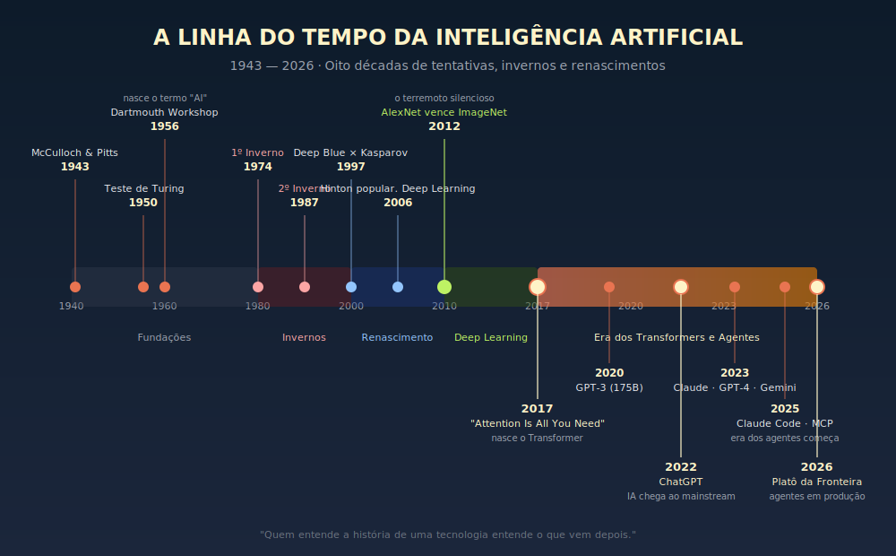
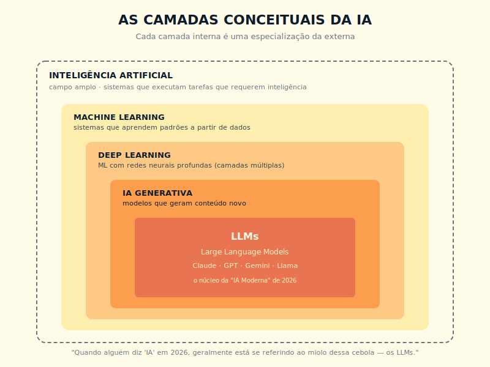
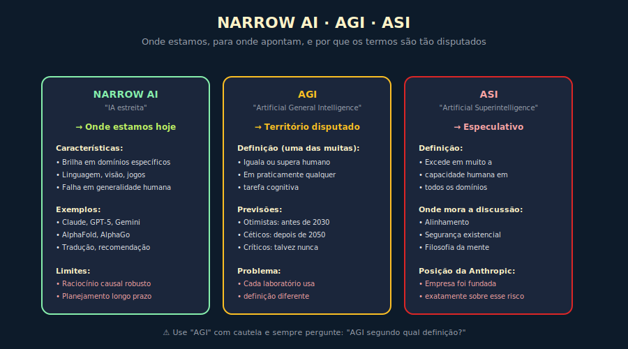

# 1. O Que É Inteligência Artificial

---

> *"A questão de saber se uma máquina pode pensar é tão relevante quanto a questão de saber se um submarino pode nadar."*
> — Edsger W. Dijkstra, "The Threats to Computing Science" (EWD898), 1984

---
## 1.1 O Conceito Intuitivo

Antes de qualquer definição técnica, vale começar com uma cena cotidiana. Você está dirigindo no trânsito de uma terça-feira qualquer, o sinal fica verde, e sem nenhum pensamento consciente o seu pé pressiona o acelerador. Um pedestre surge na sua periferia visual, e novamente sem pensar o seu pé migra para o freio. O carro à sua frente brecou bruscamente, e suas mãos giram o volante para a esquerda enquanto seu corpo se inclina para acompanhar a manobra. Uma buzina soa em algum lugar atrás de você, e sua cabeça vira instintivamente para identificar a origem, calculando em milissegundos se a situação merece preocupação ou pode ser ignorada.

Foram quatro decisões em três segundos, nenhuma delas conscientemente raciocinada, todas elas envolvendo percepção do ambiente, predição do que vai acontecer em seguida, ação motora coordenada e correção contínua com base no feedback recebido. Isso é inteligência. Não é apenas raciocínio lógico, não é apenas memória declarativa, não é apenas acúmulo de conhecimento factual. É a capacidade de perceber um ambiente, processar a informação relevante para o contexto, decidir uma ação adequada e ajustar com base no resultado, tudo isso em ciclos contínuos, frequentemente sem deliberação consciente.

Inteligência Artificial é, no fundo, a tentativa de construir sistemas computacionais que façam algo análogo a esses ciclos. Não necessariamente igual ao cérebro humano em sua mecânica interna, não necessariamente acompanhada de consciência ou experiência subjetiva, mas funcionalmente capazes de perceber, processar, decidir e ajustar em domínios cada vez mais amplos do mundo. Quem entender isso já parte na frente da maioria dos profissionais de tecnologia.

---

## 1.2 Analogia: O Aprendiz e o Veterano

Para tornar concreto o tipo de inteligência que estamos falando, imagine dois mecânicos trabalhando lado a lado em uma mesma oficina, com perfis radicalmente diferentes.

O primeiro mecânico é veterano, com trinta anos de oficina nas costas. Quando você chega descrevendo um problema, ele ouve com atenção, faz duas ou três perguntas certeiras, dá uma escutada no motor por alguns segundos e diz com confiança, "é a bomba d'água, vai dar uns 800 reais". Ele acerta em cerca de 95% das vezes, mas se você perguntar como ele sabia, ele encolhe os ombros e responde, "você ouve oficina por trinta anos, você aprende a reconhecer o som". O conhecimento dele é tácito, distribuído por neurônios pelo cérebro inteiro, e não consegue ser facilmente verbalizado em regras explícitas, mesmo que ele tentasse.

O segundo é aprendiz, recém-formado em curso técnico, com manual atualizado na mochila. Quando você descreve o mesmo problema, ele consulta o computador de diagnóstico, lista possibilidades em ordem de probabilidade, segue um checklist estruturado e em meia hora chega a uma conclusão. Ele acerta em cerca de 70% das vezes, abaixo do veterano, mas se você perguntar como chegou lá, ele te explica em detalhes, passo a passo, com referências ao manual técnico que justificam cada decisão.

Os dois são inteligentes, mas inteligentes de formas profundamente diferentes, e a história da IA, ao longo das últimas sete décadas, foi marcada pela oscilação entre essas duas filosofias. A IA simbólica, que dominou as décadas iniciais, é o aprendiz dessa analogia, baseada em regras explícitas codificadas por engenheiros, lógica formal e conhecimento legível. A IA conexionista, que ressurgiu nos anos 2010 e domina o cenário moderno, é o veterano da oficina, baseada em padrões aprendidos pela exposição massiva a dados, frequentemente acertando mais que regras explícitas conseguiriam, mas com a dificuldade característica de explicar por que acertou.

A IA moderna, aquela que você usa quando conversa com ChatGPT, Claude ou Gemini, é descendente direta da segunda escola, e por isso herda tanto suas virtudes quanto suas limitações. Acerta com frequência impressionante, mas a explicação de como acerta continua sendo uma das fronteiras mais ativas da pesquisa científica, no campo chamado de interpretabilidade.

---

## 1.3 Explicação Técnica

Estabelecida a intuição, vale agora construir uma definição operacional em camadas, porque cada camada esclarece um aspecto que as anteriores deixaram em aberto.

### Camada 1 — Definição clássica

Inteligência Artificial é o campo da ciência da computação dedicado a construir sistemas computacionais capazes de executar tarefas que, quando executadas por humanos, são consideradas indicadores de inteligência. A definição é deliberadamente ampla, e inclui atividades como reconhecer um rosto em uma foto, traduzir um texto de um idioma para outro, diagnosticar uma doença a partir de exames clínicos, jogar xadrez no nível de um grande mestre, conversar de forma coerente sobre filosofia, dirigir um carro com segurança, compor uma sinfonia agradável, descobrir um novo medicamento a partir de dados moleculares.

Note que a definição não exige que o sistema seja consciente, que tenha emoções, que tenha intenções próprias, ou que execute as tarefas da mesma forma como humanos fazem. Exige apenas que produza o tipo de resultado que associamos a comportamento inteligente em humanos. Essa escolha pragmática foi proposta por Alan Turing em 1950 com o famoso Teste de Turing, e desloca a discussão filosófica sobre "máquinas podem pensar?" para uma discussão funcional sobre "máquinas conseguem produzir comportamento indistinguível do nosso?". Filosoficamente discutível, pragmaticamente brilhante, e ainda hoje a base do que chamamos de IA.

### Camada 2 — As famílias e especializações da IA

A IA, do ponto de vista técnico, se organiza em duas grandes famílias históricas e em especializações que emergem delas, todas coexistindo em vez de se substituírem.

A IA simbólica dominou as décadas de 1950 a 1980, sendo baseada em regras lógicas explícitas, sistemas especialistas codificados por engenheiros do conhecimento, e algoritmos de busca em árvores de possibilidades. Quando alguém te explica a regra "se A e B, então C", está operando dentro do paradigma simbólico, e ele continua relevante em muitas aplicações que exigem explicabilidade rigorosa.

O Machine Learning, em sua forma moderna, ganhou tração a partir dos anos 1990 e explodiu nos 2010. Em vez de programar regras, você expõe um sistema a exemplos rotulados e deixa que ele aprenda padrões estatísticos. Engloba desde modelos simples como regressão linear até as redes neurais profundas que dominaram a última década, que recebem o nome especial de Deep Learning quando têm muitas camadas.

A IA Generativa não é uma terceira família histórica independente, mas uma aplicação especialmente poderosa do Deep Learning: sistemas que, em vez de apenas classificar ou prever, geram conteúdo novo — texto, imagem, código, áudio. É uma especialização dentro da segunda família, e a mais visível hoje. Quando alguém diz "IA" em uma conversa cotidiana de 2026, frequentemente está se referindo, sem saber, a um modelo generativo específico, construído sobre a arquitetura Transformer publicada em 2017.

Vale insistir que essas famílias não competem entre si, elas se combinam. Muitos sistemas modernos sofisticados usam regras simbólicas para tráfego e segurança, machine learning para reconhecimento visual, e modelos generativos para planejamento e comunicação, tudo na mesma arquitetura.

### Camada 3 — A IA Moderna (2017 em diante)

Quando você ouve a expressão "IA moderna" hoje, em 2026, ela quase sempre se refere a sistemas baseados em uma arquitetura específica chamada Transformer, publicada pela Google em 2017 no paper *"Attention Is All You Need"*. Essa arquitetura desbloqueou uma classe de modelos chamados LLMs, sigla em inglês para Large Language Models, ou Grandes Modelos de Linguagem em português. E são esses modelos que estão por trás de praticamente toda a revolução que você está vivendo, do ChatGPT ao Claude, do Gemini ao Llama, dos assistentes de código aos agentes corporativos.

> 💡 **INSIGHT**
> A "IA Moderna" não é uma única tecnologia genérica, é uma arquitetura específica, o Transformer, que quando escalada com bilhões de parâmetros e treinada em trilhões de tokens de texto, passa a exibir comportamentos que parecem inteligência geral em domínios linguísticos. Sem o Transformer, a IA de 2026 seria substancialmente diferente, e provavelmente bem menos impressionante.

O Transformer é a peça arquitetural que separa a IA de 2016 da IA de 2026, e aprender sobre ele é prioridade conceitual para qualquer profissional sério.

---

## 1.4 Linha do Tempo Completa

Toda história importante tem capítulos, e a história da IA tem cerca de oito que valem conhecer com profundidade, porque entender a história da disciplina é o que nos protege de cair em modismos que já fracassaram antes.

> 📊 **Diagrama 1.1 — A Linha do Tempo Completa**
>
> 
>
> *De 1943 a 2026, oito décadas, dois invernos, e a era dos agentes.*

### 1.4.1 As Fundações (1943–1956)

A IA não nasceu de uma única descoberta, ela emergiu de uma convergência de campos que aconteceu em um intervalo de pouco mais de uma década. Em 1943, dois pesquisadores chamados Warren McCulloch, neurocientista, e Walter Pitts, lógico matemático, publicaram um paper provando que redes de neurônios artificiais simples podiam computar qualquer função lógica, em princípio. Era apenas papel e álgebra, sem qualquer implementação prática, mas estabeleceu a possibilidade conceitual de que pensamento poderia ser modelado por circuitos formais.

Sete anos depois, em 1950, o matemático britânico Alan Turing publicou *"Computing Machinery and Intelligence"*, propondo o Teste de Turing que mencionei antes. Em 1956, John McCarthy, Marvin Minsky, Claude Shannon e Nathaniel Rochester organizaram a Dartmouth Workshop, conferência onde o termo *"Artificial Intelligence"* foi cunhado oficialmente. O documento de proposta original dizia, com otimismo memorável que vale citar, "uma tentativa será feita para descobrir como fazer com que máquinas usem linguagem, formem abstrações e conceitos, resolvam tipos de problemas hoje reservados aos humanos, e melhorem a si mesmas". Eles achavam que duas décadas de trabalho resolveriam o problema, e a história mostrou que estavam apenas sete décadas otimistas demais.

### 1.4.2 O Otimismo Inicial (1956–1973)

As duas décadas seguintes foram marcadas por uma euforia justificada pelos primeiros sucessos, mas que em retrospecto exagerou bastante o que estava sendo conquistado. Em 1957, Frank Rosenblatt apresentou o Perceptron, a primeira implementação prática de uma rede neural artificial, e o *New York Times* chegou a publicar uma matéria afirmando que a Marinha americana havia construído "o embrião de um computador que poderá andar, falar, ver, escrever e reproduzir-se". Em 1966, Joseph Weizenbaum criou o ELIZA, um chatbot que simulava um psicoterapeuta rogeriano, e descobriu com surpresa que as pessoas atribuíam compreensão profunda ao programa, mesmo sabendo que ele apenas reformulava as frases do usuário em perguntas. Sistemas como o SHRDLU, criado por Terry Winograd em 1970, manipulavam blocos virtuais com base em comandos em linguagem natural e pareciam compreender o mundo.

As promessas, entretanto, excederam a entrega real, e em 1969 Marvin Minsky e Seymour Papert publicaram o livro *Perceptrons*, demonstrando matematicamente que perceptrons de camada única não podiam resolver problemas simples como o XOR. O livro contribuiu significativamente para o clima de ceticismo — juntamente com cortes orçamentários que tinham causas independentes, como a revisão de expectativas dos principais financiadores públicos de pesquisa — e é hoje lembrado como símbolo do período. A historiografia mais recente aponta que o impacto do livro foi real, mas foi um fator entre outros; redes multicamadas, apontadas pelos próprios autores como alternativa, simplesmente não tiveram financiamento para ser exploradas.

### 1.4.3 O Primeiro Inverno (1974–1980)

⚠️ **ALERTA HISTÓRICO**: O termo "Inverno da IA" não é metáfora gratuita, é uma das maiores lições do campo, sobre como excesso de promessa seguido de queda brutal de financiamento pode matar tecnologias com mérito real.

Em 1973, o matemático britânico Sir James Lighthill escreveu um relatório encomendado pelo governo do Reino Unido criticando duramente a IA, e concluiu que o campo não tinha entregue resultados práticos compatíveis com o investimento recebido. O governo britânico cortou financiamento, a DARPA americana reduziu drasticamente investimentos em paralelo, e o efeito cascata foi devastador. Laboratórios fecharam, pesquisadores migraram para outras áreas, e o termo "IA" virou tabu acadêmico a ponto de pesquisadores rotularem suas pesquisas como "informática" ou "sistemas inteligentes", qualquer coisa exceto inteligência artificial.

> 🎯 **PARA EXECUTIVOS**
> Os invernos da IA ensinam algo crítico sobre adoção de tecnologia, que vale internalizar como reflexo profissional. Hype excessivo é o maior inimigo de tecnologias promissoras, porque quando expectativas inflam acima da capacidade real, a queda que vem depois mata o ecossistema inteiro, mesmo quando a tecnologia tem mérito real e independente. É algo a se observar atentamente em 2026, em conversas internas sobre IA na sua organização.

### 1.4.4 Os Sistemas Especialistas (1980–1987)

Um breve renascimento veio nos anos 1980 com os sistemas especialistas, que eram softwares codificando conhecimento de domínio em regras lógicas explícitas extraídas de especialistas humanos. O mais famoso, chamado MYCIN, diagnosticava infecções bacterianas e recomendava antibióticos com qualidade que rivalizava com médicos da época. Outros sistemas surgiram para configurar mainframes (o XCON da DEC economizou até US$ 40 milhões por ano para a empresa, segundo estudos da época documentados em McDermott, 1982, e citados em Russell & Norvig, *Artificial Intelligence: A Modern Approach*), análise de crédito bancário, exploração geológica para petróleo.

Por alguns anos a IA virou negócio sério, com empresas como Symbolics e LISP Machines vendendo computadores especializados em hardware dedicado, e o Japão lançando o ambicioso projeto Fifth Generation Computer com bilhões investidos. Mas em 1987 o mercado de máquinas LISP colapsou, o hardware especializado virou obsoleto frente aos PCs de propósito geral que ficavam mais baratos a cada ano, e os sistemas especialistas mostraram limites práticos sérios. Eram caros de manter, frágeis quando o domínio mudava, e exigiam exércitos de "engenheiros de conhecimento" para extrair regras de especialistas humanos que frequentemente não conseguiam verbalizar o que faziam por intuição. Veio então o segundo inverno da IA.

### 1.4.5 O Renascimento Silencioso (1990–2011)

Os anos 1990 e 2000 foram, paradoxalmente, períodos de avanço técnico real, mas sem alarde público. Em 1997 o Deep Blue da IBM derrotou o campeão mundial de xadrez Garry Kasparov, e a imprensa cobriu, ainda que a vitória fosse mais de força bruta computacional do que de inteligência elegante, já que o Deep Blue avaliava 200 milhões de posições por segundo em hardware especializado. Entre 2005 e 2007, a DARPA Grand Challenge mostrou os primeiros carros autônomos completando percursos em deserto americano. Em 2006, Geoffrey Hinton da Universidade de Toronto publicou trabalhos pioneiros em Deep Learning, e o campo, antes morto na percepção pública, começou a ressurgir sob nome novo. Em 2009, a pesquisadora Fei-Fei Li lançou o ImageNet, dataset com 14 milhões de imagens classificadas, e a competição anual de reconhecimento de imagem viraria o palco onde a virada aconteceria.

Nesse período de duas décadas, três condições convergiram silenciosamente para criar o ambiente em que a próxima explosão aconteceria. A primeira foi dados em escala massiva, possibilitados pela internet crescendo e digitalizando tudo. A segunda foi compute em escala acessível, graças às GPUs da NVIDIA originalmente desenvolvidas para games e que se mostraram ideais para o tipo de cálculo paralelo que redes neurais exigem. A terceira foi refinamento algorítmico, com Hinton, Yann LeCun, Yoshua Bengio e outros pesquisando técnicas de treinamento mais eficazes. A massa crítica estava se acumulando, e faltava apenas a centelha.

### 1.4.6 A Centelha (2012)

Em 2012, na competição anual do ImageNet, uma rede neural chamada AlexNet, desenvolvida por Alex Krizhevsky, Ilya Sutskever e Geoffrey Hinton, venceu com uma vantagem esmagadora sobre os concorrentes. Reduziu a taxa de erro de classificação de imagens de cerca de 26%, que era o estado da arte anterior usando técnicas clássicas de visão computacional, para 15,3%, em um único salto, em uma única competição. Foi um terremoto silencioso na comunidade científica, e os efeitos se propagariam pela década inteira que viria a seguir.

A AlexNet provou três coisas simultaneamente, e cada uma teria implicações duradouras. Primeiro, Deep Learning funcionava em problemas de escala real, não apenas em demonstrações acadêmicas com datasets de brinquedo. Segundo, GPUs eram a infraestrutura natural para treinar redes neurais, e essa percepção transformaria a NVIDIA na empresa mais valiosa do planeta em pouco mais de uma década. Terceiro, datasets gigantescos mudavam tudo, e a equação vencedora não era apenas algoritmo, era a combinação sinérgica de algoritmo, dados e compute, com o conjunto cruzando um limiar crítico depois de décadas abaixo dele.

Depois de 2012, praticamente toda pesquisa séria em visão computacional, processamento de linguagem natural e robótica migrou para deep learning, e a IA simbólica clássica não morreu, mas virou nicho acadêmico restrito a aplicações específicas onde explicabilidade rigorosa era inegociável.

> 💡 **INSIGHT**
> A AlexNet é um exemplo perfeito do efeito limiar em adoção de tecnologia, fenômeno que vale entender porque ele se repete em outras áreas. Por décadas, redes neurais foram consideradas inviáveis na prática, não porque o conceito estava errado, mas porque dados, compute e algoritmos estavam abaixo de um limiar crítico de viabilidade. Quando os três cruzaram esse limiar simultaneamente em 2012, a tecnologia explodiu de uma vez só, e quem estava de olho colheu vantagem desproporcional. Vale prestar atenção em quais tecnologias hoje, em 2026, estão em situação similar — dados, compute e algoritmos acumulando-se abaixo de um limiar que ainda não foi cruzado.

### 1.4.7 A Era dos Transformers (2017–2022)

Cinco anos após a AlexNet, outro paper mudaria tudo de novo. Em junho de 2017, oito pesquisadores da Google publicaram *"Attention Is All You Need"*, com um título que soava como provocação acadêmica mas era na verdade uma proposta arquitetural radical. O paper apresentou o Transformer, arquitetura de rede neural que processava sequências de texto de forma totalmente nova, olhando para toda a sequência simultaneamente em vez de processar palavra por palavra como faziam as redes recorrentes anteriores. O mecanismo central era chamado de atenção, que é tratado em profundidade no Capítulo 2.

A nova arquitetura era mais paralela em sua execução, treinava substancialmente mais rápido, escalava melhor com aumento de dados e compute, e crucialmente melhorava de forma previsível à medida que ficava maior. Essa última propriedade, conhecida como "scaling laws", deu à indústria um roteiro de evolução, ou seja, se você fizer o modelo dez vezes maior, ele fica X% melhor de forma previsível, então vale a pena investir.

O que veio a seguir aconteceu em ritmo acelerado. Em 2018, a OpenAI lançou o GPT-1 com 117 milhões de parâmetros, e a Google lançou o BERT, ambos baseados em Transformers. Em 2019, GPT-2 com 1,5 bilhão de parâmetros, com a OpenAI adotando publicação faseada por preocupações com uso malicioso — a primeira vez que um laboratório de IA adiou deliberadamente a publicação completa de um modelo, o que rendeu cobertura ampla da imprensa especializada. Em 2020, GPT-3 com 175 bilhões de parâmetros, e pela primeira vez na história um modelo de linguagem produziu texto difícil de distinguir do humano em vários contextos, levando desenvolvedores a começar a construir produtos sobre a API. Em novembro de 2022, a OpenAI lançou o ChatGPT, interface conversacional pública sobre o GPT-3.5, e o resultado foi o fenômeno cultural mais rápido da história da tecnologia, com 1 milhão de usuários em cinco dias e 100 milhões em dois meses. A IA deixou de ser tema de laboratório e virou pauta de jornal, de reunião executiva, de jantar de família.

### 1.4.8 A Era dos Modelos Frontier (2023–2024)

Após o ChatGPT, a corrida competitiva explodiu, e cada laboratório frontier passou a lançar modelos cada vez mais capazes em ciclos cada vez mais curtos. Em março de 2023, a Anthropic, fundada por ex-pesquisadores da OpenAI, incluindo Dario e Daniela Amodei, lançou publicamente o Claude, primeiro modelo comercial competitivo construído sobre Constitutional AI — abordagem de segurança publicada pela empresa em dezembro de 2022 (Bai et al., arxiv:2212.08073) e tratada em profundidade no Capítulo 23. Ainda em março de 2023, a OpenAI lançou o GPT-4, primeiro modelo a aparentar raciocínio robusto em múltiplos domínios, passando testes de admissão profissional como advocacia, medicina e MBA com performance no topo da distribuição humana. Em dezembro de 2023 a Google lançou o Gemini, primeira família multimodal nativa, com texto, imagem, vídeo e áudio treinados juntos desde o começo.

Em 2024 a Anthropic lançou a família Claude 3, com os modelos Opus, Sonnet e Haiku em escala decrescente de capacidade e custo, e em outubro anunciou Computer Use, capacidade de o modelo interagir diretamente com um computador como um humano faz, clicando, digitando, navegando. Em maio de 2024 a OpenAI lançou o GPT-4o, modelo unificado para texto, áudio e imagem em tempo real, capaz de conversas com voz humanizada de baixa latência.

### 1.4.9 A Era dos Agentes

Algo fundamental mudou na natureza das aplicações em meados desta década, e essa mudança merece nome próprio. Até pouco antes, IA era predominantemente conversacional, ou seja, o usuário mandava uma mensagem e o modelo respondia, com a unidade de interação sendo a resposta individual. A IA passou então a se tornar agêntica, com o usuário descrevendo um objetivo e o modelo executando uma sequência de ações, lendo documentos, chamando ferramentas, navegando na web, escrevendo código, validando resultados, até cumprir o objetivo de ponta a ponta. A unidade de interação passou a ser a tarefa cumprida, não mais a mensagem trocada.

Os marcos arquiteturais do período se organizam em alguns eixos. O surgimento de agentes de codificação em qualidade profissional operando diretamente no terminal, o que mudou o vocabulário do desenvolvimento de software. A consolidação do MCP, sigla para Model Context Protocol, como padrão aberto para conectar modelos a ferramentas e dados, mudando o jeito de construir integrações em sistemas de IA, padrão tratado em profundidade no Capítulo 13. O salto sucessivo de capacidade dos modelos premium em benchmarks de engenharia de software, marcando aproximação à competência de engenheiros sêniors em muitos cenários. E a chegada de agentes autônomos à produção em empresas reais, com peças como Skills, subagentes e workflows tornando-se centrais no ecossistema corporativo.

> 💡 **INSIGHT**
> A diferença entre chatbot e agente não é apenas técnica, ela é filosófica em sentido importante. Um chatbot é uma ferramenta passiva que responde a estímulo, um agente é um colaborador ativo que executa para atingir objetivo. A maior parte da disrupção econômica da IA, daqui para frente, virá dessa transição estrutural, não de melhorias incrementais em capacidade conversacional.

### 1.4.10 O Platô da Fronteira

Em meados de 2026, observadores da indústria começaram a notar um fenômeno que analistas chamam de "platô da fronteira" — a convergência dos melhores modelos do mundo em capacidade bruta. Esse platô pode ser temporário: um único modelo disruptivo é suficiente para desfazê-lo. Mas o que ele revela sobre onde o valor migrou é mais durável do que a observação em si. As famílias premium dos três grandes laboratórios proprietários, somadas aos melhores open-weights, passaram a rondar a mesma faixa de capacidade quando submetidas a benchmarks rigorosos, com diferenças que antes eram gritantes ficando, em média, marginais. A indústria começou a falar em "platô da fronteira", não no sentido de estagnação ou fim de evolução, mas no sentido de que a corrida por capacidade pura de modelo deu lugar a uma corrida por integração, agência, contexto e ecossistema em volta do modelo.

Isso não significa que a IA parou de evoluir, significa que a evolução mudou de eixo competitivo. O que separa um produto vencedor de um perdedor não é mais ter o "modelo mais inteligente do mercado", é ter a melhor arquitetura ao redor do modelo, com integrações certas, memória bem desenhada, ferramentas adequadas, workflows otimizados, distribuição inteligente. Esse contexto importa para o leitor porque define onde está o valor a ser construído nos próximos anos.

| Antes (2020–2024) | Agora (em diante) |
|-------------------|-------------------|
| Modelo bruto era o diferencial competitivo | Arquitetura ao redor do modelo é o diferencial |
| "Qual o melhor modelo?" | "Qual a melhor combinação modelo + dados + ferramentas + memória?" |
| Engenharia de prompt era central | Context engineering é central |
| Foco em chatbots | Foco em agentes |

---

## 1.5 O Mapa Conceitual da IA

Para fixar visualmente o que vimos até aqui, observe como os conceitos se aninham em camadas que vão do mais amplo ao mais específico.

> 📊 **Diagrama 1.2 — As Camadas Conceituais da IA**
>
> 
>
> *Cada camada interna é uma especialização da externa, e os LLMs são o núcleo da "IA Moderna" de 2026.*

Quando alguém diz "IA" em 2026, geralmente está se referindo aos LLMs, ou seja, ao miolo dessa cebola conceitual. Mas saber que existem camadas externas é o que separa quem entende do que apenas usa, e é o que permite discutir IA com precisão em contextos profissionais.

---

## 1.6 AGI e ASI: O Que São e Por Que Importam

Você vai ouvir, ao longo deste livro e em qualquer conversa séria sobre IA nos próximos anos, dois termos que precisam de definição clara para não virarem ruído conceitual em discussões importantes.

O primeiro é AGI, sigla em inglês para Artificial General Intelligence, ou Inteligência Artificial Geral em português. Refere-se a um sistema de IA que iguala ou supera capacidade humana em praticamente qualquer tarefa cognitiva, não em um domínio específico mas de forma genuinamente geral. Hoje, em 2026, sistemas como Claude e GPT são considerados "IA estreita" ou narrow AI, sendo extremamente capazes em tarefas linguísticas e cognitivas envolvendo texto, mas ainda longe da generalidade humana em aspectos importantes, como raciocínio causal robusto, planejamento de longo prazo, aprendizado eficiente com pouquíssimos exemplos, e aplicação ao mundo físico em corpo robótico. A questão de quando a AGI chega divide especialistas profundamente, com otimistas como os líderes dos principais laboratórios frontier acreditando em prazo de menos de uma década, céticos como Yann LeCun defendendo prazos muito maiores, e críticos como Gary Marcus argumentando que o próprio objetivo é irrealista.

> ⚠️ **ALERTA**
> "AGI" é hoje um dos termos mais carregados e disputados da indústria, e cada laboratório usa uma definição ligeiramente diferente, geralmente otimizada para acomodar suas próprias capacidades. Use o termo com cautela em discussões profissionais, e sempre pergunte ao interlocutor, "AGI segundo qual definição?", antes de seguir a conversa.

O segundo termo é ASI, sigla para Artificial Superintelligence, ou Superinteligência Artificial. Refere-se a um sistema que excede em muito a capacidade humana em todos os domínios cognitivos relevantes, e que portanto seria qualitativamente diferente, não apenas quantitativamente superior. ASI é hoje território de especulação, mas existe um corpo crescente de pesquisa séria sobre alinhamento, ou seja, como garantir que uma ASI tenha objetivos compatíveis com o bem-estar humano, e sobre segurança, ou seja, como evitar consequências catastróficas se algo der errado nesse processo. O tema é tratado de novo nos Capítulos 19 e 23.

> 📊 **Diagrama 1.3 — Narrow AI, AGI e ASI**
>
> 
>
> *Onde estamos hoje, para onde a discussão aponta, e por que os termos são tão disputados.*

---

## 1.7 Um Exemplo Real: Decisão Executiva Sobre IA

Para encerrar com algo concreto que torna os conceitos imediatamente aplicáveis, considere a seguinte situação real, que é composta de casos reais que acompanhei e que se repete em variações por toda parte. Uma empresa de seguros com 800 funcionários está em conflito interno sobre estratégia de IA, com três executivos defendendo direções diferentes. O CFO quer investir em "AI" sem especificar o quê. O CTO quer comprar uma plataforma de "AGI" sem clareza de definição. O diretor de operações acha que basta usar ChatGPT corporativo. Cada um defende uma direção diferente, com base em argumentos que parecem convincentes individualmente, e a diretoria não tem critério técnico para julgar qual faz mais sentido.

Após uma única reunião usando os conceitos deste capítulo como vocabulário comum, a conversa mudou de natureza. O CFO, quando pressionado a especificar, percebeu que queria investir em automação inteligente em três processos onde dados são abundantes e a tarefa é repetitiva, ou seja, estava descrevendo machine learning aplicado em casos bem definidos. O CTO, quando pressionado a definir, percebeu que queria substituir analistas júnior por agentes que executem fluxos completos, ou seja, estava descrevendo agentes baseados em LLMs com integração via MCP, sem usar essas palavras. O diretor de operações, quando pressionado, percebeu que queria simplesmente produtividade individual no dia a dia, ou seja, estava descrevendo uso de assistentes conversacionais como ChatGPT, Claude ou Gemini no fluxo de trabalho.

Três decisões diferentes, três investimentos diferentes em escala e cronograma, três stakeholders diferentes para liderar cada uma. Antes do vocabulário comum, parecia um único debate confuso. Depois do vocabulário comum, virou três debates separados, cada um com decisão clara, cada um com retorno mensurável, cada um com responsável definido. A diretoria aprovou os três em paralelo, e em doze meses os três entregaram resultado positivo, sem competir por orçamento ou atenção.

> 🎯 **PARA EXECUTIVOS**
> O retorno do investimento em entender IA não vem de você programar redes neurais, e essa é uma das observações mais subestimadas em ambiente corporativo. O retorno vem da sua capacidade de separar conversas que estão sendo confundidas por falta de vocabulário preciso. Em qualquer reunião sobre IA, vocabulário preciso é vantagem competitiva direta, porque ele dissolve falsas controvérsias e revela decisões claras onde antes existia ruído.

---

## 1.8 Conexões

Este capítulo é a fundação sobre a qual o livro inteiro se constrói. Ele conversa especialmente com o Capítulo 2, sobre como modelos funcionam por dentro e o mecanismo de atenção, com os Capítulos 3 e 4, sobre tokens e janela de contexto, e com os Capítulos 12, 19 e 23, sobre agentes, segurança e alinhamento.

---

## 1.9 Resumo Executivo

| Conceito | Síntese |
|----------|---------|
| **IA** | Campo dedicado a construir sistemas capazes de executar tarefas que requerem inteligência humana |
| **IA Simbólica** | Regras explícitas, lógica formal, forte em explicabilidade, fraca em escala |
| **Machine Learning** | Sistemas que aprendem padrões a partir de dados, inclui ML clássico e Deep Learning |
| **Deep Learning** | Subárea do ML com redes neurais profundas, dominante desde 2012 |
| **IA Generativa** | Sistemas que geram conteúdo novo, como texto, imagem ou código, subárea do Deep Learning |
| **LLMs** | Grandes modelos de linguagem baseados em Transformers, núcleo da IA moderna |
| **Transformer** | Arquitetura publicada em 2017, base de todos os LLMs modernos |
| **Inverno da IA** | Períodos de colapso de financiamento após hype excessivo, aconteceu em 1974 e 1987 |
| **Agente de IA** | Sistema que executa sequências de ações para cumprir objetivos, foco de 2025 em diante |
| **AGI** | Inteligência geral artificial, hoje território disputado e indefinido |
| **ASI** | Superinteligência artificial, hoje território especulativo |

---

## 1.10 Checklist do Capítulo

Marque o que você já consegue fazer:

- [ ] Explicar IA em três níveis ajustáveis, sendo eles leigo, gestor e técnico
- [ ] Distinguir IA simbólica de IA conexionista, com exemplos de cada
- [ ] Listar os principais marcos históricos da IA em ordem cronológica
- [ ] Explicar por que os invernos da IA aconteceram, e o que eles ensinam para 2026
- [ ] Diferenciar Machine Learning, Deep Learning, IA Generativa e LLMs
- [ ] Reconhecer a importância arquitetural do Transformer (2017)
- [ ] Distinguir narrow AI, AGI e ASI sem cair em definições ambíguas
- [ ] Identificar o que separa um chatbot de um agente
- [ ] Explicar o conceito de "platô da fronteira" em 2026

Se você marcou menos de sete, vale reler o capítulo antes de avançar, porque os próximos pressupõem essa base.

---

## 1.11 Perguntas de Revisão

Responda mentalmente, sem consultar o texto, e use suas respostas como termômetro de absorção:

1. Por que o Teste de Turing é considerado mais pragmático que filosófico?
2. Quais foram as três condições que convergiram para tornar o Deep Learning viável em 2012?
3. O que aconteceria com a IA hoje se a publicação do Transformer em 2017 não tivesse acontecido?
4. Por que sistemas especialistas dos anos 1980 falharam em escala, e que lições isso traz para hoje?
5. Em que sentido AGI é um termo "disputado", e como você lidaria com isso em uma reunião técnica?
6. Como você explicaria a diferença entre chatbot e agente para um diretor financeiro em três frases?
7. Por que o "platô da fronteira" de 2026 muda o eixo competitivo da indústria de IA?
8. Qual a diferença entre narrow AI e AGI, em uma única frase precisa?

---

## 1.12 Exercícios Práticos

### Exercício 1 — Tradução de Jargão
Pegue um post recente de LinkedIn de um executivo de tecnologia falando sobre IA, e identifique cada termo técnico utilizado, classificando se o autor está se referindo a Machine Learning clássico, Deep Learning, IA Generativa, LLM ou Agente. Quando o autor usa "AI" genericamente, qual seria o termo preciso para o que ele descreve?

### Exercício 2 — Linha do Tempo Pessoal
Escreva, em um parágrafo de no máximo dez linhas, sua linha do tempo pessoal com IA. Quando você ouviu falar pela primeira vez? Quando usou pela primeira vez? Qual foi o ponto de virada na sua percepção? Esse exercício vai ancorar seu aprendizado nos próximos capítulos de forma surpreendente.

### Exercício 3 — Diagnóstico Organizacional
Em sua empresa, ou em uma empresa que você acompanha de perto, liste três conversas atuais sobre IA. Para cada uma, identifique se estão falando de Machine Learning, IA Generativa ou Agentes, e se as pessoas envolvidas estão usando o vocabulário correto. Aponte onde há confusão conceitual real.

### Exercício 4 — Antecipação Histórica
Se você fosse Marvin Minsky em 1969, escrevendo o livro *Perceptrons*, que ressalva você incluiria para evitar o Inverno da IA que veio depois? O que isso te ensina sobre como comunicar tecnologias promissoras hoje, em 2026, sem cair na mesma armadilha?

---

## 1.13 Projeto do Capítulo

**Construa seu Mapa da IA em uma página.**

Em uma folha A4 física, ou em uma ferramenta digital de sua escolha, desenhe um diagrama hierárquico parecido com o da Seção 1.5, mas adaptado à sua organização ou à sua área de atuação específica. Identifique três coisas com clareza, primeiro, onde sua empresa já usa cada camada (IA simbólica, ML clássico, Deep Learning, IA Generativa, Agentes), segundo, onde não usa mas deveria usar dado o contexto competitivo, e terceiro, onde usa mas não deveria, com possíveis casos de sobreuso ou de ferramenta errada para o problema. Esse mapa será sua referência ao longo do livro, e vai virar sua bússola de decisões. Volte a ele depois de cada Parte completada, atualizando conforme seu entendimento se aprofunda.

---

## 1.14 Referências Principais

📚 **Livros**

- Russell, S. & Norvig, P. *Artificial Intelligence: A Modern Approach*. Referência clássica do campo.
- Mitchell, M. *Artificial Intelligence: A Guide for Thinking Humans*. 2019.
- Christian, B. *The Alignment Problem*. 2020.

📚 **Papers seminais**

- Turing, A. *"Computing Machinery and Intelligence"*. Mind, 1950.
- McCulloch, W. & Pitts, W. *"A Logical Calculus of the Ideas Immanent in Nervous Activity"*. 1943.
- Krizhevsky, A., Sutskever, I., Hinton, G. *"ImageNet Classification with Deep Convolutional Neural Networks"* (AlexNet). 2012.
- Vaswani et al. *"Attention Is All You Need"*. 2017. → arxiv.org/abs/1706.03762

📚 **Recursos online**

- [History of artificial intelligence — Wikipedia](https://en.wikipedia.org/wiki/History_of_artificial_intelligence)
- [Anthropic — News](https://www.anthropic.com/news)
- [Anthropic Models Overview — Documentação oficial](https://docs.anthropic.com/en/docs/about-claude/models)

---

## 1.15 Autoavaliação

Antes de virar a página, autoavalie com honestidade. Se algum critério falhar, o problema é meu, não seu, e vale voltar às seções correspondentes.

| # | Critério | Você consegue? |
|---|----------|----------------|
| 1 | **Clareza** — Explicar, em 90 segundos, o que é IA para um filho de 12 anos, sem usar jargão técnico | ☐ |
| 2 | **Profundidade** — Defender, em uma reunião com seniores, a diferença entre IA simbólica, Deep Learning e LLMs | ☐ |
| 3 | **Aplicação** — Olhar para uma proposta de "AI" na sua empresa e dizer com precisão, isto é ML clássico, isto é IA generativa, isto é um agente | ☐ |
| 4 | **Conexão** — Articular como este capítulo se conecta com os Capítulos 2 (modelos), 12 (agentes) e 19 e 23 (segurança e alinhamento) | ☐ |
| 5 | **Curiosidade** — Está com vontade real de saber como, afinal, esses modelos funcionam por dentro, e está com pressa de virar a página | ☐ |

---

> *"Quem entende a história de uma tecnologia entende o que vem depois. Quem só conhece o estado da arte fica preso ao presente."*
