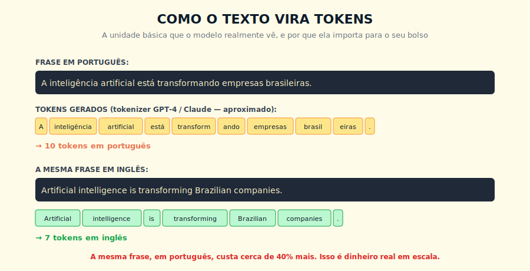
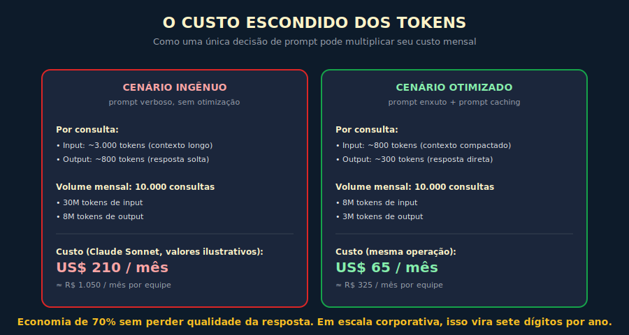

# 3. Tokens

---

> *"Você pensa em palavras. O modelo pensa em tokens. Quem entende essa diferença constrói sistemas que escalam; quem ignora paga para descobrir."*

---
## 3.1 O Conceito Intuitivo

Quando você lê esta frase, seu cérebro processa palavras inteiras, ou no máximo, expressões compostas que funcionam como unidades de significado. Quando um modelo de linguagem lê a mesma frase, ele opera sobre um nível mais granular, decompondo o texto em pedaços chamados tokens, que podem ser palavras inteiras, fragmentos de palavras, ou até caracteres isolados em certos casos. Essa diferença pode parecer um detalhe técnico irrelevante para quem só quer usar IA, mas entender bem o que é um token tem consequências práticas grandes, que vão desde o custo da sua conta no fim do mês até a qualidade das respostas que você recebe.

Imagine que você está organizando um arquivo físico de documentos. Você pode escolher entre dois sistemas de catalogação. No primeiro, cada documento é arquivado por uma palavra-chave única, e o arquivo precisa ter uma gaveta para cada palavra-chave possível em português, o que rapidamente vira inviável porque a língua tem milhões de formas flexionadas. No segundo, você quebra cada palavra em pedacinhos reutilizáveis, como prefixos, raízes e sufixos, e cada gaveta guarda um pedacinho desses, de modo que palavras novas podem ser representadas combinando gavetas existentes. O segundo sistema é mais econômico, mais flexível e mais robusto a palavras que você nunca viu antes. É exatamente assim, em essência, que tokenizers modernos funcionam.

A consequência prática disso é que a unidade de medida com que você precisa raciocinar, ao trabalhar com LLMs profissionalmente, não é a palavra, é o token. Tokens são contados na entrada do modelo, contados na saída, contados no custo cobrado pelo provedor, e contam para o limite da janela de contexto. Quem ignora essa unidade trabalha no escuro.

---

## 3.2 Analogia: As Peças de Lego

Pense em tokens como as peças de Lego de uma língua. Quando você quer montar uma palavra ou uma frase qualquer, você combina peças de um conjunto finito e pré-existente, em vez de moldar uma peça nova para cada palavra. O tokenizer é o engenheiro que decidiu quais peças vão existir no conjunto, com base em quais combinações apareciam mais nos dados de treino. Se uma palavra é muito comum, ela ganha sua própria peça, com a vantagem de poder ser representada num único token. Se uma palavra é rara, ela é construída encaixando várias peças menores, e isso custa mais tokens para representar.

Essa analogia explica algumas coisas que parecem contraintuitivas à primeira vista. Por exemplo, o nome do seu cachorro provavelmente não está no conjunto de peças, então quando você escreve esse nome em uma conversa, o modelo precisa quebrá-lo em várias peças menores, gastando mais tokens do que gastaria com uma palavra comum como "casa". Outro exemplo, palavras em inglês tendem a ter peças dedicadas, porque os tokenizers modernos foram treinados predominantemente em corpora ingleses, enquanto palavras em português, especialmente as mais flexionadas, frequentemente exigem mais peças para serem representadas. O efeito prático é que o mesmo texto, em português e em inglês, custa quantidades diferentes de tokens, com vantagem para o inglês na maioria dos casos.

> 📊 **Diagrama 3.1 — Como o Texto Vira Tokens**
>
> 
>
> *A mesma frase em português e em inglês, decomposta pelo mesmo tokenizer.*

---

## 3.3 Explicação Técnica

### 3.3.1 O Algoritmo Por Trás

O algoritmo por trás dos tokenizers modernos é chamado BPE (Byte Pair Encoding). O que importa para você não é o nome, é o resultado: palavras comuns viram um token, palavras raras viram vários, e o tokenizer do modelo determina qual é qual. Se quiser entender o mecanismo com mais detalhe, continue lendo; se quiser ir direto às consequências práticas, pule para 3.3.2.

Tokenizers modernos usam algoritmos de subpalavras, sendo o mais comum o BPE e suas variantes como SentencePiece e Tiktoken. A ideia central, simplificada, é a seguinte. Você parte do alfabeto bruto, ou seja, cada caractere individual é uma peça. Então, você analisa um corpus gigantesco de texto, e procura o par de caracteres adjacentes que aparece com mais frequência. Esse par vira uma nova peça única, e o processo se repete, agora podendo combinar essa nova peça com outras, até atingir um vocabulário com o tamanho desejado, tipicamente entre 30 mil e 200 mil tokens.

O resultado é um vocabulário híbrido, em que palavras muito frequentes acabam tendo seu próprio token, palavras moderadamente frequentes são representadas por dois ou três tokens (raiz + sufixos), e palavras raras ou inéditas são quebradas em pedaços muito pequenos, podendo chegar a um token por caractere em casos extremos. Esse design tem uma virtude valiosa, ele consegue representar qualquer texto possível, mesmo palavras que nunca apareceram nos dados de treino, mesmo nomes próprios estranhos, mesmo termos técnicos novos. Nada fica fora do alcance.

### 3.3.2 O Efeito da Língua

Como mencionei, tokenizers modernos foram treinados predominantemente em corpora dominados pelo inglês. Isso significa que palavras em inglês tendem a ser representadas com mais eficiência, ou seja, em menos tokens, do que palavras em outras línguas. O efeito é mensurável e relevante.

Algumas medições aproximadas que valem guardar, observáveis em tokenizers públicos como Tiktoken e equivalentes. Um texto em inglês tem em média entre 1,3 e 1,5 tokens por palavra. Um texto em português tem em média entre 1,8 e 2,3 tokens por palavra. Um texto em japonês ou árabe pode chegar a 3 ou 4 tokens por palavra, dependendo do tokenizer. Em línguas com escrita logográfica como o chinês, cada caractere pode virar um token, e o número absoluto de caracteres por ideia é menor, mas o cálculo de custo se inverte.

A consequência financeira disso é direta. Se sua aplicação é em português e o tokenizer foi treinado predominantemente em inglês, você paga consistentemente mais por token do que pagaria se a mesma aplicação rodasse em inglês. Em comparação direta usando Tiktoken (GPT-4o) sobre pares de textos paralelos PT/EN de 1.000 palavras, textos em português geraram entre 40% e 60% mais tokens — o número varia com o tokenizer e o conteúdo, mas a direção é consistente em todos os tokenizers públicos testados. Em pequena escala, é irrelevante. Em escala corporativa, com milhões de consultas por mês, isso vira contas de seis ou sete dígitos por ano, ponto retomado no Capítulo 18.

### 3.3.3 O Contador Interno

Ao usar APIs de modelos como GPT, Claude ou Gemini, você verá sempre dois números reportados, input tokens e output tokens, com preços diferentes. Os input tokens incluem tudo que o modelo recebe na requisição, ou seja, o prompt do sistema, o histórico da conversa, e a sua mensagem atual. Os output tokens são apenas o que o modelo gera de volta. Na maioria dos modelos frontier disponíveis em 2026, output custa entre 3x e 5x mais que input — mas esse múltiplo varia por modelo e muda com atualizações de preço; verifique a tabela de pricing do seu provedor antes de modelar orçamento. O que é constante: otimizar saída costuma ter retorno maior que otimizar entrada, e a maioria das pessoas se preocupa apenas em encurtar prompts, ignorando que pedir respostas mais sucintas é frequentemente mais eficaz.

Para contar tokens antes de enviar uma requisição, cada provedor tem seu próprio contador. Para modelos OpenAI, existe o Tiktoken oficial. Para Claude, a Anthropic oferece um endpoint de contagem de tokens na API. Para Gemini, o Google oferece endpoint equivalente. Nunca use o contador de um provedor para estimar custo de outro — os tokenizers são diferentes e os números divergem. Para qualquer aplicação séria em produção, vale a pena instrumentar esse contador porque você quer saber, antes de gastar, quanto vai gastar. Não é apenas controle de custo, é também controle de qualidade, porque saber a contagem permite respeitar limites de contexto sem surpresas.

---

## 3.4 Exemplo Memorável: A Fatura Que Quase Quebrou Uma Startup

> Cenário ilustrativo.

Uma startup brasileira de educação, em 2024, lançou um produto que usava GPT-4 para gerar exercícios personalizados para estudantes do ensino médio. O produto pegou tração rápido, a base de usuários cresceu, e tudo parecia caminhar bem. No final do primeiro mês, chegou a fatura da OpenAI, com um valor cinco vezes maior do que a projeção inicial. Em duas semanas mais, o caixa estaria comprometido, e a equipe entrou em pânico.

Quando foram investigar a causa, descobriram três coisas, e cada uma delas é uma lição valiosa.

A primeira, eles estavam injetando o conteúdo integral de cada matéria, em português, dentro de cada prompt, sob a justificativa de "garantir que o modelo tenha contexto suficiente". Isso significava 8 mil tokens de input por consulta, repetidos a cada interação, mesmo quando o usuário fazia perguntas que poderiam ser respondidas com 300 tokens de contexto. A solução foi implementar busca contextual, tratada no Capítulo 6 sobre RAG, recuperando apenas os trechos relevantes em vez de jogar tudo no prompt.

A segunda, eles estavam pedindo respostas verbosas, no formato "explique passo a passo de forma detalhada e didática", o que produzia respostas com 1.500 tokens de output, mesmo quando 400 seriam suficientes. Mudaram a instrução para "responda de forma concisa, indo direto ao essencial", e o consumo de output caiu mais de 60% sem perda de qualidade percebida.

A terceira, e mais cara, eles não usavam prompt caching. Como o sistema enviava o mesmo bloco de instruções gigante a cada requisição, mesmo o que poderia ser cacheado a custo dez vezes menor estava sendo cobrado a preço cheio. Habilitaram caching, e o custo de input despencou para uma fração do original.

A combinação dessas três correções, todas conceitualmente simples e nenhuma exigindo mudança de modelo, reduziu a fatura mensal em mais de 80%. O aprendizado é mais amplo, e vale para qualquer organização que adote IA generativa sem entender de tokens. **Otimizar token é a atividade com maior ROI imediato em qualquer operação de IA, e a maioria das equipes só descobre isso depois de tomar um susto na fatura.**

*Este cenário é composto a partir de múltiplos casos reais acompanhados pelo autor entre 2023 e 2025. Detalhes foram alterados para preservar confidencialidade.*

> 📊 **Diagrama 3.2 — O Custo Escondido dos Tokens**
>
> 
>
> *A mesma operação, com e sem otimização de tokens, em escala corporativa típica.*

---

## 3.5 Estratégias de Economia, em Ordem de Impacto

Vou listar aqui, do maior impacto para o menor, as estratégias que costumam reduzir conta de IA em produção. Cada uma aparece aprofundada em outros capítulos, mas vale ter o mapa completo agora.

A primeira estratégia, de impacto enorme e quase sempre subutilizada, é **prompt caching**. Provedores modernos permitem que você marque partes do prompt como cacheáveis, e cobram uma fração do preço (tipicamente 10% ou menos) quando o mesmo conteúdo é reutilizado em chamadas subsequentes. Para sistemas com prompts de sistema longos, isso elimina o maior gargalo de custo. O tema é detalhado no Capítulo 11 sobre context engineering.

A segunda é **encurtar a saída antes de encurtar a entrada**. Como output costuma custar significativamente mais que input (verifique o pricing do seu provedor para o múltiplo atual), reduzir verbosidade da resposta tem retorno desproporcional. Instruções como "responda em até 200 palavras", "vá direto ao ponto, sem preâmbulos", ou "responda apenas em JSON sem comentários" são quase sempre vantajosas.

A terceira é **usar o modelo certo para a tarefa certa**. Modelos pequenos da mesma família (Haiku, GPT-4o-mini, Gemini Flash) custam uma fração do modelo premium, e para tarefas simples entregam resultados equivalentes. Roteamento inteligente entre modelos, com tarefas complexas indo para o modelo grande e tarefas triviais para o modelo pequeno, costuma reduzir custo em ordens de grandeza. O tema retorna no Capítulo 18.

A quarta é **RAG bem feito** em vez de despejar contexto bruto. Em vez de mandar 20 mil tokens de documentação no prompt, recupere os 1.500 tokens realmente relevantes para a pergunta específica. Tema do Capítulo 6.

A quinta, é **estruturar o prompt para reutilização**. Se sua aplicação responde perguntas variadas sobre o mesmo conjunto de documentos, separe o "background" estável do "query" variável, e use caching agressivamente sobre o background.

A sexta, é **monitorar e medir**. Sem dashboard de tokens por usuário, por funcionalidade, por modelo, você está dirigindo no escuro. Implementar instrumentação básica resolve metade dos problemas só por tornar o custo visível.

---

## 3.6 Erros Comuns Que Quase Toda Equipe Comete

Vou ser direto sobre as armadilhas que aparecem repetidamente. Listo as cinco mais comuns, em ordem de frequência.

A mais frequente é **subestimar quanto o histórico de conversa cresce**. Aplicações que mantêm contexto conversacional, sem estratégia de truncamento ou sumarização, veem o custo crescer linearmente com o número de turnos, porque cada turno reenvia tudo que veio antes. Em uma conversa de 30 mensagens, você está pagando para o modelo reler as 29 anteriores a cada nova interação.

A segunda é **enviar instruções estáticas a cada chamada**. Se você tem um system prompt de 4 mil tokens explicando o comportamento do seu agente, e não está usando prompt caching, está pagando esses 4 mil tokens cheios em toda requisição. Em volume, isso é o gasto principal de muitas aplicações.

A terceira é **pedir formato verboso sem precisar**. Pedir Markdown quando texto puro bastaria, pedir JSON com indentação quando JSON compacto bastaria, pedir explicações justificativas quando a resposta final bastaria. Cada uma dessas escolhas adiciona tokens sem adicionar valor.

A quarta é **ignorar o efeito da língua**. Equipes brasileiras que mantêm prompts e respostas em português pagam mais do que pagariam em inglês, e em muitos contextos, prompts em inglês com respostas em português é um híbrido razoável, especialmente quando a parte cacheada é grande.

A quinta é **não distinguir input cacheado de input fresco**. Tratar todo input igual no orçamento mental, sem perceber que parte dele poderia custar dez vezes menos com a configuração certa.

---

## 3.7 Conexões

Este capítulo conversa especialmente com o Capítulo 4, sobre janela de contexto, e com o Capítulo 5, sobre embeddings. As estratégias de economia listadas aqui retornam com mais profundidade no Capítulo 6 (RAG), no Capítulo 11 (context engineering), no Capítulo 15 (escolha de modelo) e no Capítulo 18 (economia em escala).

---

## 3.8 Resumo Executivo

| Conceito | Síntese |
|----------|---------|
| **Token** | Unidade básica que o modelo processa, podendo ser palavra inteira, fragmento de palavra ou caractere |
| **Tokenizer** | Algoritmo que decompõe texto em tokens, treinado a partir de corpus, tipicamente via BPE |
| **Input tokens** | Tudo que o modelo recebe na requisição (system prompt + histórico + mensagem atual) |
| **Output tokens** | Tudo que o modelo gera na resposta, geralmente cobrado a múltiplo maior que input (verifique pricing do provedor) |
| **Efeito da língua** | Português usa cerca de 40 a 60% mais tokens que inglês para o mesmo conteúdo |
| **Prompt caching** | Mecanismo que reduz drasticamente o custo de partes estáveis do prompt reutilizadas |
| **Estratégias de economia** | Caching, encurtar saída, escolher modelo, RAG, separar estável de variável, monitoramento |

---

## 3.9 Checklist do Capítulo

- [ ] Explicar a um colega não-técnico o que é um token e por que ele difere de uma palavra
- [ ] Estimar, de cabeça, quantos tokens tem um parágrafo em português versus em inglês
- [ ] Identificar, em uma aplicação real, onde estão os maiores gastos de token
- [ ] Listar três estratégias de redução de custo e indicar qual aplicar primeiro
- [ ] Diferenciar custo de input cacheado, input fresco e output
- [ ] Reconhecer os cinco erros comuns descritos na seção 3.6
- [ ] Defender, em uma reunião, por que monitorar tokens é prioridade arquitetural

---

## 3.10 Perguntas de Revisão

1. Por que tokenizers usam subpalavras em vez de palavras inteiras?
2. Qual a vantagem de output token ser mais caro que input token, do ponto de vista do provedor?
3. Em que tipo de aplicação prompt caching tem o maior retorno?
4. Por que pedir respostas concisas é frequentemente mais eficaz que encurtar prompts?
5. Em que situação manter o prompt em inglês com a resposta em português faz sentido econômico?

---

## 3.11 Exercícios Práticos

### Exercício 1 — Auditoria de Uma Chamada
Pegue uma chamada real à API que sua equipe usa hoje. Conte tokens de input e output. Identifique o que é estável (cacheável) e o que é variável. Estime quanto custaria em escala de 100 mil chamadas mensais.

### Exercício 2 — Reescrita Compacta
Pegue um system prompt que você usa, com mais de mil tokens. Reescreva-o em metade do tamanho, mantendo a intenção. Compare a qualidade das respostas antes e depois.

### Exercício 3 — Comparação de Língua
Escolha um texto seu de 500 palavras em português. Traduza para inglês. Use um tokenizer público para contar tokens nos dois. Documente a diferença.

### Exercício 4 — Mapeamento de Custo
Liste todas as funcionalidades de IA do seu produto ou da sua organização. Para cada uma, estime input médio, output médio e volume mensal. Faça a conta. O resultado provavelmente vai surpreender.

---

## 3.12 Projeto do Capítulo

**Construa o dashboard mínimo de tokens da sua operação.**

Em uma planilha (ou em um Notion, ou em um BI), crie um quadro com as funcionalidades de IA que sua organização usa. Para cada uma, registre input médio por chamada, output médio, volume mensal, modelo utilizado, e custo total mensal estimado. Acrescente uma coluna chamada "oportunidade de otimização" e marque, para cada linha, qual das estratégias da seção 3.5 seria mais impactante. Esse quadro vai virar a base do seu plano de redução de custos de IA, e provavelmente revelar economias de 30 a 70% em poucas semanas de trabalho.

---

## 3.13 Referências Principais

📚 **Recursos técnicos**

- [Tiktoken — OpenAI's BPE tokenizer](https://github.com/openai/tiktoken)
- [Anthropic Token Counting](https://docs.claude.com/en/docs/build-with-claude/token-counting)
- [Sennrich et al. — Neural Machine Translation of Rare Words with Subword Units (BPE)](https://arxiv.org/abs/1508.07909)
- [Kudo & Richardson — SentencePiece](https://arxiv.org/abs/1808.06226)

📚 **Sobre custo e otimização**

- [Anthropic Prompt Caching docs](https://docs.claude.com/en/docs/build-with-claude/prompt-caching)
- [OpenAI Pricing](https://openai.com/api/pricing/)

---

## 3.14 Autoavaliação

| # | Critério | Você consegue? |
|---|----------|----------------|
| 1 | **Clareza** — Explicar o que é um token a um financeiro, em uma frase, e fazer ele entender por que isso afeta o orçamento | ☐ |
| 2 | **Profundidade** — Descrever, em uma reunião técnica, por que tokenizers usam subpalavras e qual o impacto em línguas não-inglesas | ☐ |
| 3 | **Aplicação** — Olhar para uma chamada real à API e saber, de cabeça, onde estão os maiores gastos e por onde começar a otimizar | ☐ |
| 4 | **Conexão** — Articular como tokens se conectam com contexto (Cap 4), embeddings (Cap 5), RAG (Cap 6) e economia em escala (Cap 18) | ☐ |
| 5 | **Curiosidade** — Está com pressa legítima de entender qual é o tamanho máximo de tokens que cabem numa conversa, e por que esse limite existe | ☐ |

---

> *"Quem mede tokens, controla custo. Quem controla custo, escala IA com tranquilidade."*
