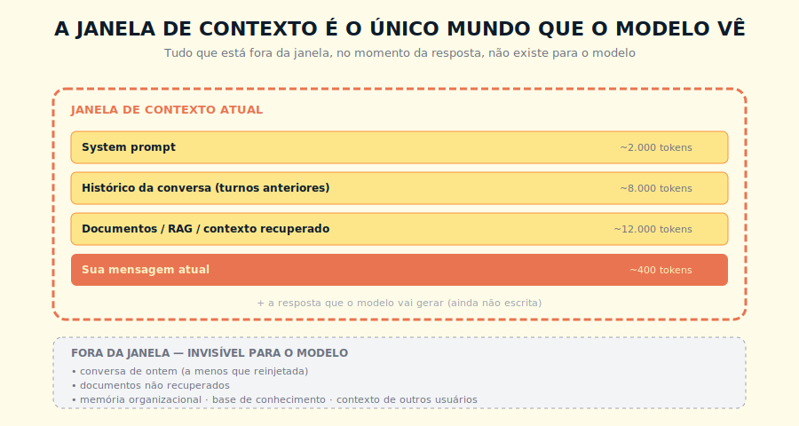
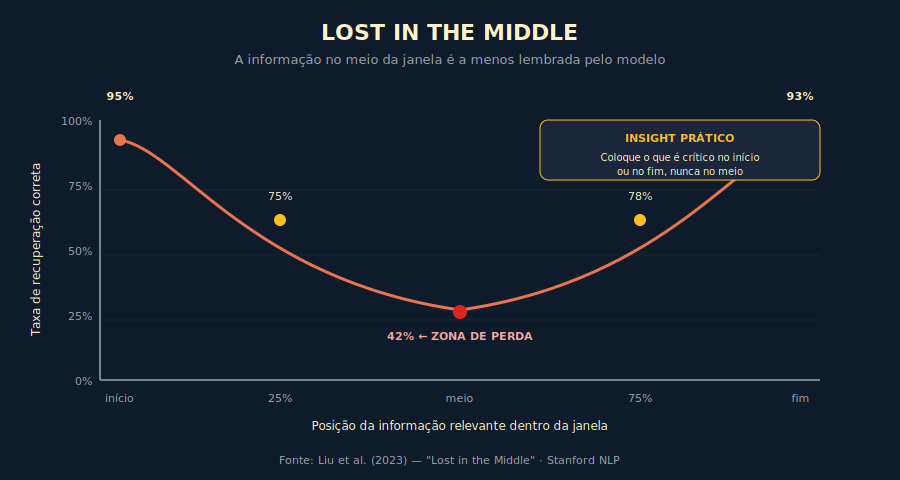

# 4. Janela de Contexto

---

> *"Tudo que está fora da janela, no instante da resposta, simplesmente não existe para o modelo. Saber disso muda como você arquiteta soluções."*

---
## 4.1 O Conceito Intuitivo

Imagine que você está conversando com alguém em uma sala, e essa pessoa tem uma característica peculiar, ela só consegue manter na cabeça as últimas vinte mil palavras que ouviu. Tudo que foi dito antes disso simplesmente sai da memória ativa dela, como se nunca tivesse acontecido. Para que a conversa siga coerente, você precisa lembrá-la, de tempos em tempos, do que foi combinado nos primeiros minutos, ou ela vai responder como se aquilo não existisse.

Essa é, em essência, a realidade da janela de contexto em um LLM. O modelo não tem memória persistente entre conversas, e dentro de uma única conversa, só consegue raciocinar sobre o que está dentro de um determinado teto de tokens. Tudo que ultrapassa esse teto, ou que nunca foi colocado dentro dele, é invisível. A janela de contexto é o único mundo que o modelo enxerga no momento em que precisa produzir uma resposta.

Essa limitação tem consequências profundas para qualquer aplicação séria de IA. Você precisa decidir, ativamente, o que colocar dentro da janela, e essa decisão envolve trade-offs reais entre completude, relevância, custo e qualidade da resposta. Quem não pensa nisso conscientemente acaba com sistemas que funcionam em demonstração e falham em produção, ou que funcionam em produção, mas pagam dez vezes mais do que precisariam.

---

## 4.2 Analogia: A Mesa do Escritório

Pense na janela de contexto como a mesa de trabalho de um analista que está te ajudando a resolver um problema. Tudo que está em cima da mesa, naquele momento, está disponível para consulta direta. Tudo que está em arquivos, em gavetas, em outras salas, na nuvem da empresa, fora da mesa, exige que alguém vá buscar e traga até a superfície. Quando o problema é simples, basta o que está na mesa. Quando o problema é complexo, você precisa ativamente decidir o que tirar da mesa para abrir espaço, e o que trazer dos arquivos para apoiar a análise.

Essa metáfora explica vários comportamentos práticos que aparecem em sistemas de IA. Por exemplo, quando você conversa com um LLM e a conversa fica longa demais, em algum momento o sistema vai começar a esquecer o que foi dito no início, simplesmente porque aquele conteúdo já não cabe mais na mesa. Quando você adiciona uma base de conhecimento gigante a um workspace ou projeto, o modelo não tem acesso a tudo de uma vez, ele precisa que alguma camada de recuperação selecione os pedaços relevantes e os ponha em cima da mesa para aquela pergunta específica. Quando você reclama que "o modelo esqueceu o que combinamos no começo", o problema raramente é falha do modelo, é arquitetural, alguém precisava ter trazido essa informação de volta para a mesa.

> 📊 **Diagrama 4.1 — A Janela de Contexto e o Que Fica de Fora**
>
> 
>
> *O modelo só enxerga o que está dentro da moldura. O resto é mundo escuro.*

---

## 4.3 Explicação Técnica

### 4.3.1 Como o Limite Funciona, em Números

Cada modelo tem um limite máximo de tokens que aceita por consulta, somando entrada e saída. Em 2026, modelos premium tipicamente suportam entre 200 mil e dois milhões de tokens — uma faixa que cresce a cada geração. Consulte a documentação oficial do seu provedor para o número atual, porque esses limites mudam trimestralmente e qualquer lista de valores aqui publicada envelhece antes do livro. O que não muda é a ordem de grandeza: 200 mil tokens equivalem aproximadamente a um livro de 350 a 400 páginas em português; um milhão de tokens equivale a uma biblioteca de pesquisa razoável.

Em teoria, dá para jogar muita coisa no contexto e deixar o modelo trabalhar. Na prática, como veremos a seguir, esse "em teoria" esconde armadilhas que custam caro quando ignoradas.

### 4.3.2 O Custo do Contexto Longo

A primeira armadilha é que o custo computacional da atenção padrão, mecanismo central do Transformer, cresce de forma quadrática em relação ao tamanho do contexto — um problema que levou a toda uma área de pesquisa em eficiência. Técnicas modernas como Flash Attention (Dao et al., 2022), atenção esparsa e sliding window reduzem esse crescimento na prática, mas o princípio econômico permanece: contexto longo é mais caro do que contexto curto, e essa diferença é relevante para decisões de orçamento. Em termos práticos, dobrar o contexto pode multiplicar o custo por algo entre três e quatro em implementações reais, dependendo do provedor e da otimização usada. Para 200 mil tokens, isso significa que cada consulta é significativamente mais cara, mais lenta, e exige mais memória de GPU do que uma consulta com 10 mil tokens. Em uma aplicação de produção que faz milhões de chamadas por mês, a diferença entre operar com contexto enxuto e contexto cheio pode chegar a uma ordem de grandeza no orçamento.

### 4.3.3 Lost in the Middle, o Fenômeno Que Pega Todo Mundo Desprevenido

A segunda armadilha, mais sutil e mais grave, é um fenômeno descoberto e batizado por pesquisadores de Stanford e Berkeley em 2023, chamado *Lost in the Middle*. O que eles observaram, e que diversas pesquisas confirmaram desde então, é que modelos de linguagem têm taxa de recuperação altíssima para informação no início e no fim da janela de contexto, e uma queda significativa de performance para informação que está no meio.

Em termos práticos, se você colocar uma instrução crítica no token de número 1.000, dentro de uma janela de 200 mil, o modelo vai prestar atenção nela na maioria dos casos. Se você colocar essa mesma instrução no token de número 100 mil, no meio da janela, a taxa de recuperação cai significativamente — em configurações com janelas acima de 32 mil tokens e informação posicionada após o primeiro terço da janela, segundo Liu et al. (2023), a queda pode chegar a menos de 50%, com variação relevante por modelo e por tarefa. O mesmo vale para documentos relevantes em sistemas RAG, posicionados no meio da pilha de evidências, eles tendem a ser sub-utilizados pelo modelo.

> 📊 **Diagrama 4.2 — O Efeito Lost in the Middle**
>
> 
>
> *A taxa de recuperação correta segue uma curva em U, com perda real na zona central.*

A explicação técnica para esse fenômeno tem várias hipóteses, sendo a mais aceita a de que o treinamento dos modelos tende a priorizar exemplos em que informações relevantes aparecem nas extremidades, e que mecanismos como atenção posicional acabam reforçando esse viés. Independente da causa exata, o efeito é mensurável, e tem implicações arquiteturais imediatas.

### 4.3.4 As Três Zonas da Janela

Vale a pena pensar na janela de contexto como tendo três zonas funcionais, cada uma com regras próprias.

A primeira é a **zona de abertura**, os primeiros tokens da janela, onde o modelo presta máxima atenção. É onde devem ir as instruções de sistema, as regras de comportamento, o tom desejado, as restrições críticas. Coisas que você quer que o modelo lembre o tempo todo durante a resposta.

A segunda é a **zona central**, o meio da janela, onde a atenção do modelo dilui. É a zona perigosa, em que informações importantes podem passar despercebidas. Use essa zona para conteúdo de apoio, exemplos auxiliares, contexto histórico, coisas que adicionam valor se forem usadas, mas que não são críticas se forem ignoradas.

A terceira é a **zona de fechamento**, os últimos tokens antes da geração da resposta, onde o modelo volta a prestar atenção máxima. É onde deve estar a pergunta atual, o último turno da conversa, instruções de formato da resposta. O modelo vai ancorar a geração em quem está logo antes dele.

Essa heurística simples, "crítico no começo ou no fim, contexto no meio", resolve a maioria dos problemas que aparecem em produção quando janelas longas são usadas sem cuidado.

---

## 4.4 Exemplo Memorável: O Relatório Que Não Foi Lido

> Cenário ilustrativo, composto a partir de casos recorrentes.

Considere uma operação de análise financeira que ilustra de forma cristalina o fenômeno Lost in the Middle. Uma gestora de recursos montou um sistema usando um LLM frontier para apoiar analistas na leitura de relatórios de due diligence de M&A — documentos densos, frequentemente com oitenta a cento e vinte páginas de demonstrações financeiras, notas explicativas, análise de mercado e avaliação de passivos contingentes. A ideia era simples: o analista carregava o relatório inteiro no prompt, junto com instruções de revisão, e o modelo retornava um resumo estruturado apontando riscos financeiros, inconsistências e alertas para aprofundamento.

O sistema funcionou de forma brilhante por semanas, e a equipe estava convencida de ter encontrado um ganho de produtividade enorme. Até que, em uma análise particularmente sensível, o modelo deixou de sinalizar um passivo contingente relevante que estava posicionado exatamente no meio do relatório, em torno da página sessenta de cem. A nota era clara, quantificada e teria sido marcada por qualquer analista competente em leitura linear. O modelo simplesmente não a destacou.

Quando investigaram a falha, descobriram que o problema não era da capacidade do modelo, era da posição da informação. Repetindo o teste com o mesmo relatório, mas movendo aquela nota para o início ou para o final, o modelo a identificava corretamente em quase 100% das execuções. No meio, a taxa caía para algo em torno de 60%. Em uma operação que dependia de precisão, esses 40% de falha eram inaceitáveis.

A solução que adotaram foi arquitetural, não substituição de modelo. Em vez de jogar o relatório inteiro no prompt, passaram a fazer um pré-processamento que segmentava o documento em blocos de mais ou menos cinco mil tokens, com sobreposição entre blocos, e rodavam a análise em cada bloco separadamente, depois consolidando os achados. O custo subiu um pouco, porque eram mais chamadas, mas a confiabilidade subiu para níveis aceitáveis em produção. Era a aplicação direta do princípio de que contexto longo, ainda que tecnicamente suportado, não é a melhor estratégia para tarefas onde cada parte do conteúdo precisa receber atenção uniforme.

> 💡 **INSIGHT**
> Janelas grandes são uma fantástica conquista técnica, mas elas resolvem um problema diferente do que muita gente pensa. Elas permitem que mais informação seja considerada, mas não garantem que cada pedaço seja considerado com a mesma profundidade. Para tarefas que exigem leitura uniforme, você precisa de arquiteturas de chunking, não apenas de janelas grandes.

---

## 4.5 Long Context Versus RAG

Uma decisão arquitetural recorrente em qualquer aplicação séria de IA é a escolha entre confiar em contexto longo, jogando muita informação no prompt, ou usar uma camada de recuperação como RAG, tema do Capítulo 6, trazendo apenas o que é relevante para cada consulta. Cada abordagem tem suas situações ideais, e a escolha errada custa caro.

**Long context faz sentido** quando o conteúdo total a ser considerado é razoavelmente compacto (digamos, abaixo de 100 mil tokens), quando a tarefa exige raciocínio sobre o todo simultaneamente (como sumarização de um documento inteiro), quando o conteúdo muda pouco entre consultas (permitindo prompt caching), e quando o custo por consulta não é o gargalo principal. Em qualquer cenário em que o custo de implementar e manter um sistema RAG supera o ganho, vale a simplicidade do contexto longo.

**RAG faz sentido** quando a base de conhecimento é grande demais para caber em qualquer janela (centenas de milhares de documentos, por exemplo), quando consultas são diversas e cada uma exige um subconjunto diferente de informação, quando o custo por consulta importa em escala, quando você quer manter a base de conhecimento atualizada sem retreinar nada, e quando rastrear origem das respostas (citações) é importante para auditoria.

Na prática, a maioria das soluções maduras combina as duas, usando contexto longo para o que é estável e RAG para o que é variável e específico de cada consulta. Essa combinação aparece detalhada nos próximos capítulos.

---

## 4.6 Context Engineering, a Nova Disciplina

À medida que ficou claro que o tamanho da janela sozinho não resolve, surgiu uma disciplina nova chamada Context Engineering — termo popularizado em 2025, notavelmente por Andrej Karpathy, para descrever a evolução da engenharia de prompt para o design consciente de tudo que entra em cada chamada ao modelo. Essa disciplina é a evolução natural da engenharia de prompt, e ocupa todo o Capítulo 11. Vale antecipar aqui os princípios principais.

O primeiro princípio é **priorizar atenção**, posicionando o crítico nas extremidades da janela, deixando o secundário no meio, e descartando o irrelevante.

O segundo é **hierarquizar informação**, separando claramente system prompt (regras estáveis), background (conhecimento contextual), e query (a pergunta específica), e tratando cada camada com estratégia própria.

O terceiro é **comprimir agressivamente**, reescrevendo conteúdo verboso em formato compacto, removendo redundâncias, eliminando boilerplate que não agrega à resposta.

O quarto é **usar memória externa**, transferindo para sistemas de RAG, banco vetorial, ou estruturas de memória persistente, tudo que não precisa estar in-line no contexto.

O quinto é **medir e iterar**, instrumentando o sistema para entender quais partes do contexto efetivamente influenciam a saída, e cortando o que não importa.

Quem domina essa disciplina constrói sistemas que entregam mais qualidade gastando menos. Quem ignora ela constrói sistemas que parecem funcionar até a fatura chegar, ou até o primeiro caso de Lost in the Middle no ambiente errado.

---

## 4.7 Conexões

Este capítulo conversa especialmente com o Capítulo 3, sobre tokens, com os Capítulos 6 e 7, sobre RAG e memória externa, e com o Capítulo 11, sobre context engineering em profundidade. As consequências econômicas retornam no Capítulo 18, e a abstração de contexto persistente em produtos como Claude Projects é tratada no Livro 2.

---

## 4.8 Resumo Executivo

| Conceito | Síntese |
|----------|---------|
| **Janela de contexto** | O conjunto total de tokens que o modelo considera em uma única consulta |
| **Limite típico (2026)** | Entre 200 mil e 2 milhões de tokens nos modelos premium — consulte o provedor para o dado atual |
| **Custo do contexto longo** | A atenção padrão cresce quadraticamente; otimizações modernas reduzem isso, mas dobrar contexto ainda pode multiplicar o custo por três ou quatro na prática |
| **Lost in the Middle** | Informação no meio da janela tem taxa de recuperação menor que no início ou fim |
| **Três zonas** | Abertura (atenção alta), centro (atenção baixa), fechamento (atenção alta) |
| **Long context vs RAG** | Contexto longo é simples mas caro, RAG é complexo mas escalável |
| **Context Engineering** | Disciplina de desenhar conscientemente o que vai dentro do contexto |

---

## 4.9 Checklist do Capítulo

- [ ] Estimar, de cabeça, quanto cabe em uma janela de 200 mil tokens em termos de páginas de texto
- [ ] Explicar Lost in the Middle a um colega não-técnico, usando uma analogia própria
- [ ] Posicionar instruções críticas nas extremidades de prompts longos, intuitivamente
- [ ] Decidir, para um problema concreto, entre long context puro e RAG
- [ ] Reconhecer quando uma falha de resposta é arquitetural (posicionamento) e não capacidade do modelo
- [ ] Listar os cinco princípios de Context Engineering

---

## 4.10 Perguntas de Revisão

1. Por que o custo da atenção padrão cresce de forma quadrática, e que otimizações modernas atenuam esse efeito na prática?
2. Em que tipo de tarefa Lost in the Middle é mais perigoso, e por quê?
3. Quando você escolheria long context puro em vez de RAG, mesmo tendo capacidade técnica para os dois?
4. Por que separar system prompt, background e query é mais que estética?
5. Em uma conversa longa que está perdendo coerência, qual é a primeira coisa a investigar?

---

## 4.11 Exercícios Práticos

### Exercício 1 — Teste de Posicionamento
Pegue um documento de mais ou menos 50 páginas. Coloque uma frase peculiar (digamos, "o código secreto é AZ-3914") em três posições diferentes, no início, no meio e no fim. Para cada versão, pergunte ao modelo "qual o código secreto mencionado neste documento?". Documente as taxas de acerto.

### Exercício 2 — Auditoria de Prompts Longos
Pegue um prompt longo que sua equipe usa hoje, com mais de 5 mil tokens. Mapeie onde estão as instruções críticas. Se estiverem no meio, reorganize, e teste a diferença em qualidade de resposta.

### Exercício 3 — Decisão Arquitetural
Para um caso de uso concreto da sua organização, escreva um documento de meia página defendendo a escolha entre long context puro e RAG. Liste os trade-offs explicitamente.

### Exercício 4 — Visualização da Janela
Desenhe, à mão ou em ferramenta digital, a janela de contexto de uma das suas aplicações de IA atuais. Identifique, com cores ou rótulos, quanto de cada zona está sendo ocupado por quê.

---

## 4.12 Projeto do Capítulo

**Reorganize uma aplicação real seguindo as três zonas.**

Escolha uma aplicação de IA que sua organização opera hoje, ou uma que você usa pessoalmente em volume razoável. Refatore o prompt seguindo o princípio das três zonas. Coloque instruções críticas e regras de comportamento na abertura. Coloque contexto de apoio e exemplos no centro. Coloque a query atual e instruções de formato no fechamento. Meça o efeito em qualidade e em custo de tokens, ao longo de pelo menos uma semana de uso real.

Esse exercício pequeno costuma render uma das melhorias de qualidade mais visíveis em qualquer sistema de IA, e prepara o terreno para o Capítulo 11.

---

## 4.13 Referências Principais

📚 **Papers fundamentais**

- Liu et al. *"Lost in the Middle: How Language Models Use Long Contexts"*. 2023. → arxiv.org/abs/2307.03172
- Beltagy et al. *"Longformer: The Long-Document Transformer"*. 2020.
- Press et al. *"Train Short, Test Long: Attention with Linear Biases (ALiBi)"*. 2021.

📚 **Documentação**

- [Anthropic — Long context tips](https://docs.claude.com/en/docs/build-with-claude/long-context-tips)
- [Anthropic — Prompt caching](https://docs.claude.com/en/docs/build-with-claude/prompt-caching)

---

## 4.14 Autoavaliação

| # | Critério | Você consegue? |
|---|----------|----------------|
| 1 | **Clareza** — Explicar o que é janela de contexto a alguém leigo, em menos de dois minutos, usando uma analogia | ☐ |
| 2 | **Profundidade** — Defender, em conversa técnica, por que long context não substitui RAG em todos os cenários | ☐ |
| 3 | **Aplicação** — Olhar para um prompt longo real e dizer onde estão os pontos de risco de Lost in the Middle | ☐ |
| 4 | **Conexão** — Articular como contexto se conecta com tokens (Cap 3), RAG (Cap 6), memória (Cap 7) e context engineering (Cap 11) | ☐ |
| 5 | **Curiosidade** — Está com pressa de entender como o modelo representa significado por dentro, e descobrir os tais embeddings | ☐ |

---

> *"Contexto não é depósito, é palco. O que você coloca no centro tende a desaparecer no espetáculo."*
