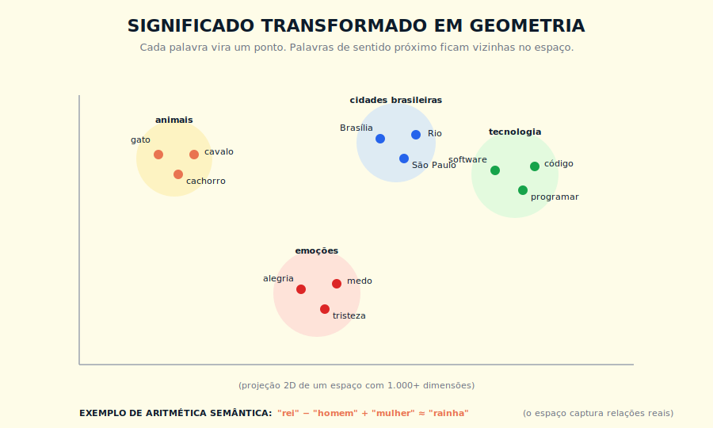
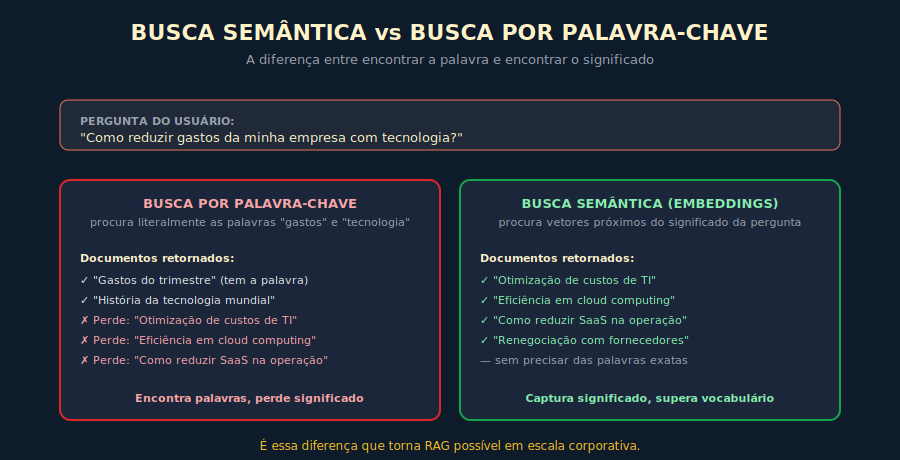

# 5. Embeddings

---

> *"Embeddings transformam significado em geometria. Quando você entende isso, metade dos sistemas de IA que pareciam mágica começam a fazer sentido."*

---
## 5.1 O Conceito Intuitivo

A discussão sobre LLMs até aqui foi sobre como modelos processam tokens e produzem texto. Mas existe um conceito intermediário, sutilíssimo, que é o que permite que esse processamento funcione, e que ao mesmo tempo serve de fundação para outra família inteira de aplicações de IA, da busca semântica ao RAG. Esse conceito é o embedding, e entender bem o que ele é vai pagar dividendos em quase todos os capítulos seguintes.

A ideia central é que palavras, frases, parágrafos e até documentos inteiros podem ser representados como pontos em um espaço matemático de muitas dimensões, e que esse espaço tem uma propriedade extraordinária, coisas que significam algo parecido ficam próximas, coisas que significam algo diferente ficam distantes. Em outras palavras, o significado, conceito tradicionalmente abstrato e difícil de formalizar, é convertido em geometria, e geometria é algo que computadores manipulam com facilidade.

Quando uma máquina precisa saber se duas frases falam de coisas relacionadas, ela não precisa entender as frases no sentido humano. Basta calcular a distância entre os pontos que representam essas frases no espaço. Frases sobre o mesmo tema ocupam regiões próximas, frases sobre temas diferentes ocupam regiões distantes, e essa propriedade, descoberta e refinada ao longo das últimas duas décadas, é o que torna possível uma quantidade impressionante de aplicações que parecem mágica a quem desconhece o mecanismo.

---

## 5.2 Analogia: O Mapa das Ideias

Imagine que alguém te entregasse um mapa peculiar. Em vez de cidades, esse mapa mostra ideias. Em vez de quilômetros, ele mostra distâncias de significado. Conceitos parecidos aparecem em bairros próximos, conceitos diferentes em continentes diferentes. Quando você quer encontrar tudo que tem a ver com "redução de custos em tecnologia", você não precisa fazer uma lista exaustiva de sinônimos, nem se preocupar com vocabulário específico, basta ir até a coordenada correspondente nesse mapa, e olhar o que está em volta. O bairro pode incluir "otimização de TI", "eficiência em cloud", "renegociação de licenças de software", "modernização de stack", todos próximos uns dos outros, todos relacionados à ideia central, mesmo sem compartilhar nenhuma palavra-chave em comum.

Esse mapa, no mundo da IA, é o espaço de embeddings. As coordenadas no mapa são os vetores numéricos que representam cada ideia. A distância entre dois pontos, calculada por fórmulas matemáticas como similaridade do cosseno, mede o quão próximas duas ideias estão no plano do significado. Quando você consulta esse mapa programaticamente, busca documentos por significado em vez de por palavras, e essa diferença, sutil na descrição, é gigantesca na prática.

> 📊 **Diagrama 5.1 — Significado Transformado em Geometria**
>
> 
>
> *Palavras de sentido próximo ocupam regiões próximas em um espaço de alta dimensão.*

---

## 5.3 Explicação Técnica

### 5.3.1 O Que é um Embedding, em Números

Tecnicamente, um embedding é um vetor de números reais, tipicamente com 384, 768, 1.536, 3.072 ou até mais dimensões, dependendo do modelo que o produz. Cada dimensão captura algum aspecto do significado, embora nem sempre seja claro qual aspecto cada dimensão representa, e essa opacidade é uma das características da abordagem, o significado emerge da combinação de todas as dimensões, não de cada uma isoladamente.

Quando você converte a palavra "gato" em embedding usando um modelo moderno de embedding — como os modelos atuais da OpenAI ou da Voyage AI (verifique a documentação do provedor para o modelo recomendado no momento) — o resultado é algo como uma sequência de 1.536 números, em uma faixa típica entre menos um e mais um, que coletivamente posicionam "gato" em um lugar específico do espaço. Esse lugar terá vizinhos como "cachorro", "felino", "pet", "animal doméstico". Estará distante de vizinhos como "software", "guerra", "matemática", "filosofia". O modelo aprendeu essas relações durante seu próprio treinamento, em geral usando objetivos como predizer palavras a partir do contexto ou aproximar embeddings de textos co-ocorrentes.

### 5.3.2 Como o Significado Emerge

A intuição que ajuda a entender por que isso funciona vem de uma observação clássica em linguística, associada ao linguista britânico John Rupert Firth: contexto define significado. Em termos práticos para NLP, palavras que aparecem em contextos parecidos tendem a ter significados parecidos. Palavras que aparecem em contextos parecidos tendem a ter significados parecidos. "Médico" e "doutor" aparecem em frases muito similares, então o modelo aprende a posicioná-los próximos. "Médico" e "ferrovia" raramente compartilham contexto, então o modelo os afasta.

Estendendo essa intuição para frases e parágrafos inteiros, o que os modelos de embedding modernos fazem é encontrar uma representação numérica em que textos com semântica similar produzam vetores próximos, e textos com semântica diferente produzam vetores distantes. Esses modelos são treinados em pares de textos rotulados como similares ou dissimilares, e ajustam seus pesos até que essa propriedade se estabilize em larga escala.

### 5.3.3 A Medida da Distância

A operação fundamental que se faz sobre embeddings é calcular distância ou similaridade entre dois vetores. As fórmulas mais comuns são as seguintes.

Para medir distância entre embeddings, a métrica mais comum é a **similaridade do cosseno** — pense nela como o ângulo entre dois ponteiros no mapa. Quanto menor o ângulo, mais parecidos os significados. Valores próximos de um indicam semântica próxima; valores próximos de zero indicam semântica diferente. Essa é a métrica que aparece na maioria das implementações de busca semântica.

Existem alternativas — **distância euclidiana** (distância geométrica clássica) e **produto interno** (operação mais rápida, equivalente ao cosseno quando os vetores estão normalizados) — mas a escolha entre elas raramente é decisiva na prática. O que importa é que qualquer banco vetorial moderno implementa as três; você só precisa escolher quando a documentação perguntar.

### 5.3.4 Modelos de Embedding Versus LLMs

Vale uma distinção importante, modelos de embedding não são a mesma coisa que LLMs, ainda que sejam parentes próximos. Um LLM é especializado em gerar texto, e tem uma arquitetura Transformer que culmina em uma cabeça de predição de tokens. Um modelo de embedding é especializado em representar texto como vetor, e tem uma arquitetura semelhante mas com saída diferente, um vetor de tamanho fixo que comprime todo o significado do texto de entrada.

Em muitas aplicações modernas, os dois trabalham juntos. O embedding é usado para encontrar a informação relevante (recuperação), e o LLM é usado para raciocinar sobre essa informação e produzir uma resposta (geração). Esse é, em essência, o padrão arquitetural RAG, tratado em profundidade no Capítulo 6.

---

## 5.4 Exemplo Memorável: A Busca Que Entende Intenção

> Cenário ilustrativo, composto a partir de casos recorrentes.

Um cenário que torna concreta a diferença entre busca por palavra-chave e busca semântica. Uma operadora de telecomunicações brasileira tinha um portal interno de conhecimento, com milhares de documentos sobre procedimentos operacionais, manuais técnicos, políticas internas, materiais de treinamento. O portal usava busca baseada em palavras-chave, padrão Elasticsearch convencional, e enfrentava um problema crônico, os técnicos de campo não encontravam o que precisavam.

O problema não era falta de conteúdo. O problema era de vocabulário. O técnico digitava "antena não conecta" no campo de busca, e o sistema retornava uma lista de documentos cheia de coisas tangenciais, simplesmente porque o documento certo, intitulado "procedimento de troubleshooting para falha de uplink em estação rádio base", não continha nenhuma das palavras exatas que o técnico tinha usado. O documento certo existia, estava indexado, mas era invisível para a busca porque a busca não entendia que "antena não conecta" e "falha de uplink em ERB" descreviam o mesmo problema com vocabulários diferentes.

Quando a equipe implementou uma camada de busca semântica usando embeddings, a transformação foi dramática. O mesmo "antena não conecta" passou a recuperar não apenas o documento certo no topo da lista, como também outros documentos correlatos sobre troubleshooting de RF, problemas em handover, manutenção preventiva, todos relevantes ao contexto, todos invisíveis para a busca anterior. A taxa de resolução de problemas em primeira chamada subiu significativamente — em implantações similares documentadas na literatura, melhorias dessa métrica costumam variar entre 20% e 40%, dependendo da maturidade da base de conhecimento anterior — e o uso do portal saltou.

A lição operacional vai além desse caso específico. Em qualquer organização com base de conhecimento minimamente diversa, busca semântica entrega valor imediato que busca por palavra-chave não consegue replicar. O custo de implementação despencou nos últimos anos, com APIs de embedding cobrando frações de centavo por mil tokens, e bancos vetoriais como Pinecone, Qdrant e ChromaDB ficando triviais de operar. A barreira técnica de entrada despencou — APIs de embedding e bancos vetoriais ficaram acessíveis a qualquer equipe de desenvolvimento. A barreira que permanece não é de acesso à tecnologia, mas de qualidade da implementação: chunking bem-feito, avaliação contínua de relevância e manutenção do índice são onde a maioria dos projetos sofre. Organizações que entendem isso chegam ao mercado em semanas; as que ignoram passam meses descobrindo na prática.

> 📊 **Diagrama 5.2 — A Diferença na Prática**
>
> 
>
> *Mesma pergunta, duas formas de buscar, resultados profundamente diferentes.*

---

## 5.5 Aplicações Práticas

Embeddings são fundação de muitas aplicações modernas. Vou listar as principais, cada uma com sua lógica essencial.

A primeira é **busca semântica**, como vimos no exemplo acima. Você indexa documentos transformando cada um em embedding, e quando vem uma consulta, transforma a consulta em embedding também e busca os vetores mais próximos. É a base de todo RAG.

A segunda é **agrupamento (clustering)**, descobrir grupos naturais de itens em grandes coleções. Você calcula embeddings de tudo, e roda algoritmos como k-means ou HDBSCAN sobre os vetores para identificar grupos. Útil para análise de feedback de clientes, organização de tickets de suporte, descoberta de tópicos em documentos.

A terceira é **detecção de duplicatas e similaridade**, encontrar itens parecidos mesmo quando o texto não é idêntico. Útil em sistemas que precisam identificar mensagens repetidas, plágio sutil, perguntas equivalentes em fóruns de suporte.

A quarta é **classificação por proximidade**, classificar um novo item comparando seu embedding com embeddings de exemplos rotulados. É uma forma simples e efetiva de classificação que não exige treinar um modelo dedicado.

A quinta é **detecção de anomalia**, identificar itens que estão longe demais de qualquer cluster conhecido. Útil em segurança, monitoramento, controle de qualidade.

A sexta é **recomendação**, encontrar itens similares a outros que o usuário gostou. Embeddings funcionam bem como camada de similaridade semântica, e em cenários com poucos dados de comportamento são frequentemente a melhor primeira abordagem. Em sistemas maduros, tipicamente se combinam com sinais de comportamento (filtragem colaborativa) para melhor precisão.

Essas seis aplicações cobrem provavelmente 80% dos casos em que embeddings entregam valor de negócio. Vale conhecer todas, ainda que sua organização use só uma ou duas hoje.

---

## 5.6 Limitações e Armadilhas

Como toda tecnologia poderosa, embeddings têm limitações que vale conhecer antes de adotá-los de forma ingênua.

A primeira é que **embeddings refletem o viés dos dados de treino**. Se o modelo foi treinado predominantemente em inglês, ele pode posicionar de forma menos precisa textos em português, especialmente em domínios técnicos. Modelos multilíngues como voyage-multilingual ou text-embedding-3 mitigam isso, mas não eliminam.

A segunda é que **textos muito longos perdem precisão**. Modelos de embedding tipicamente foram treinados em textos curtos, parágrafos ou frases. Quando você embedda um documento de cinco páginas, a representação resultante tende a ser uma média semântica que perde detalhes. A solução é chunking, dividir textos longos em pedaços menores antes de embedding, tema do Capítulo 6.

A terceira é que **similaridade não é equivalência**. Dois textos podem ter embeddings próximos sem necessariamente dizer a mesma coisa. Confiar cegamente em proximidade vetorial sem validação adicional pode levar a sistemas que recuperam coisas tangenciais e parecem certos.

A quarta é que **dimensionalidade tem custo**. Vetores de 3.072 dimensões dão melhor qualidade que vetores de 384, mas custam mais para armazenar e para buscar. Em escala, essa diferença importa.

A quinta é que **embeddings ficam obsoletos**. Se o modelo de embedding muda, todos os vetores armazenados anteriormente ficam incompatíveis com novas consultas. Trocar de modelo é trabalhoso, e exige reembedding completo da base.

---

## 5.7 Conexões

Este capítulo conversa especialmente com o Capítulo 6, sobre RAG, e com o Capítulo 7, sobre memória semântica. Os blocos conceituais vêm do Capítulo 3, sobre tokens, e os desdobramentos arquiteturais aparecem no Capítulo 14, sobre AI Engineering, e no Livro 2, sobre produtos comerciais que usam busca semântica por trás.

---

## 5.8 Resumo Executivo

| Conceito | Síntese |
|----------|---------|
| **Embedding** | Vetor numérico que representa texto em um espaço de muitas dimensões |
| **Similaridade do cosseno** | Métrica mais comum para medir proximidade semântica entre dois vetores |
| **Espaço vetorial** | Mapa multidimensional onde significado vira distância |
| **Modelo de embedding** | Diferente de LLM, especializado em produzir vetores em vez de texto |
| **Aplicações principais** | Busca semântica, clustering, classificação, deduplicação, recomendação |
| **Banco vetorial** | Infraestrutura especializada para armazenar e buscar embeddings em escala |
| **Limitações** | Viés, perda em textos longos, dependência de modelo, obsolescência ao trocar |

---

## 5.9 Checklist do Capítulo

- [ ] Explicar o que é embedding para alguém leigo, usando a analogia do mapa
- [ ] Distinguir busca por palavra-chave de busca semântica e dar um exemplo prático
- [ ] Listar pelo menos três aplicações reais de embeddings na sua organização ou no mercado
- [ ] Reconhecer a diferença entre LLM e modelo de embedding
- [ ] Identificar quando chunking é necessário e por quê
- [ ] Listar três métricas de distância e quando cada uma é preferível
- [ ] Defender, em uma reunião, por que migrar de busca textual para semântica gera ROI

---

## 5.10 Perguntas de Revisão

1. Por que palavras com significado parecido ficam próximas no espaço de embeddings, do ponto de vista do treinamento?
2. Em que tipo de tarefa similaridade do cosseno é preferível à distância euclidiana?
3. Por que chunking de documentos longos melhora a qualidade da busca semântica?
4. Que tipo de erro um sistema baseado em embeddings comete que um humano não cometeria?
5. Por que trocar de modelo de embedding é tão caro operacionalmente?

---

## 5.11 Exercícios Práticos

### Exercício 1 — Visualização do Espaço
Use uma ferramenta de visualização de embeddings em 3D disponível no momento — ferramentas como o Embedding Projector do TensorFlow ou equivalentes (verifique o material suplementar em [URL do site do livro] para a lista atualizada). Explore visualmente os agrupamentos. Identifique três clusters interessantes.

### Exercício 2 — Comparação Prática
Escolha cinco frases sobre o mesmo tema, escritas com vocabulários diferentes. Calcule embeddings de cada uma via API do seu provedor de preferência (verifique documentação do provedor para o modelo de embedding atual recomendado). Compare similaridades entre pares. Onde a similaridade é alta? Onde é baixa? Por quê?

### Exercício 3 — Diagnóstico de Busca
Avalie a busca interna de uma ferramenta que sua organização usa hoje (intranet, base de conhecimento, sistema de tickets). Identifique pelo menos três casos em que vocabulário diferente levaria a falha. Estime o impacto operacional.

### Exercício 4 — Custos de Embedding
Estime, para a base de documentos da sua organização, quanto custaria embedding inicial completo, e quanto custaria embedding incremental mensal. Use preços públicos de provedores como OpenAI ou Voyage.

---

## 5.12 Projeto do Capítulo

**Construa um protótipo mínimo de busca semântica.**

Pegue um conjunto pequeno de documentos, vinte a cinquenta arquivos texto sobre temas variados da sua organização. Embedda cada um usando um modelo público de embedding do provedor de sua escolha (verifique a documentação do provedor para o modelo atual recomendado). Armazene os vetores em uma base vetorial simples (ChromaDB local ou Qdrant em modo embarcado). Construa uma interface mínima que recebe uma consulta, embedda a consulta, busca os top-5 documentos mais próximos, e retorna. Teste com perguntas em vocabulário variado. Documente onde a busca acerta surpreendentemente, e onde falha de formas instrutivas. Esse exercício pequeno é a melhor preparação possível para o Capítulo 6.

---

## 5.13 Referências Principais

📚 **Papers**

- Mikolov et al. *"Efficient Estimation of Word Representations in Vector Space"* (Word2Vec). 2013.
- Devlin et al. *"BERT: Pre-training of Deep Bidirectional Transformers"*. 2018.
- Reimers & Gurevych. *"Sentence-BERT"*. 2019.

📚 **Documentação e ferramentas**

- [OpenAI Embeddings docs](https://platform.openai.com/docs/guides/embeddings)
- [Voyage AI](https://www.voyageai.com/)
- [ChromaDB](https://www.trychroma.com/)
- [Pinecone](https://www.pinecone.io/)
- [Qdrant](https://qdrant.tech/)

---

## 5.14 Autoavaliação

| # | Critério | Você consegue? |
|---|----------|----------------|
| 1 | **Clareza** — Explicar embedding para alguém leigo em 90 segundos, usando uma analogia visual | ☐ |
| 2 | **Profundidade** — Descrever o papel de embeddings dentro de uma arquitetura RAG, antes mesmo de ler o Cap 6 | ☐ |
| 3 | **Aplicação** — Identificar, na sua organização, ao menos dois lugares onde busca semântica entregaria valor imediato | ☐ |
| 4 | **Conexão** — Articular como embeddings se conectam com tokens (Cap 3), contexto (Cap 4), RAG (Cap 6), memória (Cap 7) | ☐ |
| 5 | **Curiosidade** — Está com vontade de aprender como, exatamente, RAG combina embeddings com LLMs para produzir respostas grounded | ☐ |

---

> *"Quando você consegue medir o significado como mede distância, abre-se uma classe inteira de problemas que antes só humanos resolviam."*
