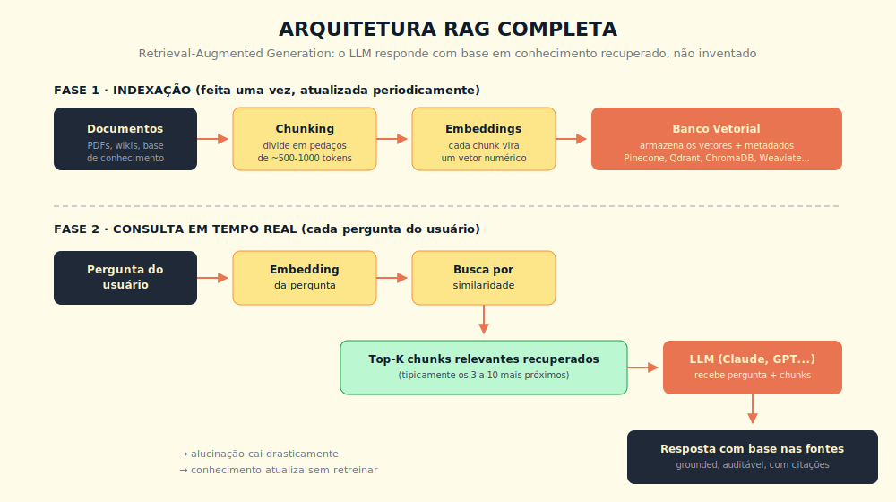
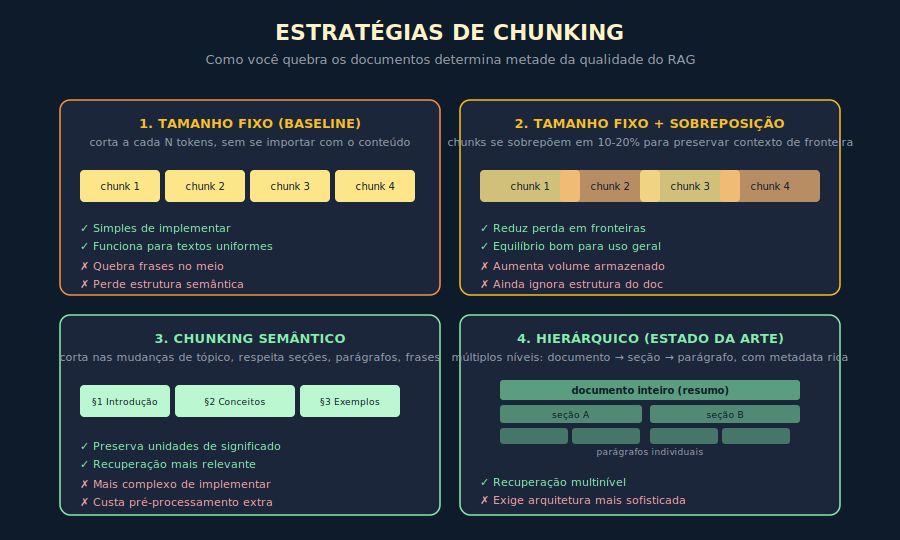

# 6. RAG — Retrieval Augmented Generation

---

> *"O LLM não precisa saber tudo. Precisa saber buscar o que importa, no momento em que importa, e responder com base no que encontrou."*

---
## 6.1 O Conceito Intuitivo

Existe um problema fundamental com modelos de linguagem que vimos no Capítulo 2 e que merece ser nomeado com precisão. Esses modelos sabem coisas, mas sabem coisas até a data em que foram treinados, e mesmo dentro desse universo, não sabem nada sobre os seus documentos, os seus clientes, os seus contratos, a sua base de conhecimento corporativa, nada que seja específico ao contexto da sua organização. Quando você pede a um LLM para responder sobre "a política de férias da minha empresa", o modelo, sem acesso a essa política, ou inventa algo plausível (alucinação), ou recusa por falta de informação, ou produz uma resposta genérica baseada no que sabe sobre políticas de férias em geral. Nenhum desses resultados é satisfatório quando a aplicação precisa servir a um caso real.

RAG, sigla em inglês para Retrieval-Augmented Generation, é a arquitetura que resolve esse problema da forma mais elegante que a indústria encontrou até agora. A ideia central é separar dois trabalhos que antes pareciam estar juntos. O conhecimento específico do seu domínio fica em uma base de dados externa, fora do modelo, e é consultado dinamicamente conforme a necessidade. O modelo, por sua vez, não tenta saber tudo, ele recebe a pergunta do usuário junto com os trechos relevantes recuperados da base, e usa esse material para construir uma resposta grounded, ou seja, ancorada em informação verificável.

Quando você entende essa separação, percebe que ela resolve simultaneamente vários problemas. A alucinação cai drasticamente, porque o modelo passa a responder a partir de material concreto em vez de seu "treino fossilizado". A atualização de conhecimento fica trivial, basta adicionar ou modificar documentos na base, sem retreinar nada. A rastreabilidade aparece naturalmente, porque cada resposta pode citar as fontes que a alimentaram. E o custo computacional fica controlável, porque você só envia ao modelo o pequeno subconjunto de documentos que importa para cada pergunta, em vez de uma janela de contexto inteira cheia.

---

## 6.2 Analogia: O Consultor Com Acesso à Biblioteca

Pense em RAG como o seguinte arranjo profissional. Imagine um consultor experiente, sênior, com vasto conhecimento geral, mas que nunca trabalhou com a sua empresa antes. Você precisa que ele responda perguntas específicas sobre o seu negócio, suas políticas, seus contratos. Em vez de tentar treinar esse consultor exaustivamente sobre cada detalhe da sua organização, processo que levaria meses e seria caro, você adota um arranjo diferente. Cada vez que você faz uma pergunta a ele, um assistente vai à sua biblioteca corporativa, encontra os três ou quatro documentos mais relevantes para aquela pergunta específica, e entrega esses documentos ao consultor antes de ele responder. O consultor lê o material, combina com seu conhecimento geral, e produz uma resposta informada por ambos.

Esse arranjo tem virtudes que valem destacar. O consultor não precisa memorizar a biblioteca inteira, ele só precisa saber raciocinar bem com o material que recebe. A biblioteca pode crescer, mudar, ser atualizada, e o consultor automaticamente responde com base na versão atual, sem precisar de retreinamento. Diferentes perguntas recuperam diferentes documentos, sem que o consultor precise sobrecarregar a memória dele. E quando alguém audita a resposta, o consultor consegue mostrar exatamente quais documentos embasaram cada afirmação.

É exatamente esse o arranjo do RAG. O LLM é o consultor, a base vetorial é a biblioteca, o sistema de recuperação é o assistente. Quem domina essa arquitetura constrói aplicações de IA corporativa que entregam valor real em vez de gerar respostas genéricas.

> 📊 **Diagrama 6.1 — Arquitetura RAG Completa**
>
> 
>
> *Indexação acontece uma vez. A consulta acontece a cada interação do usuário.*

---

## 6.3 Explicação Técnica

A arquitetura RAG se divide em duas fases distintas, que operam em momentos diferentes e exigem cuidados diferentes.

### 6.3.1 Fase 1, Indexação

A indexação é o trabalho preparatório, que acontece antes de qualquer consulta do usuário. O objetivo é converter a sua base de conhecimento em um formato pesquisável por significado.

O primeiro passo é a **ingestão**, ou seja, ler todos os documentos que vão alimentar o sistema. Isso inclui PDFs, páginas de wiki, planilhas, documentação técnica, transcrições de reuniões, qualquer fonte textual relevante. Cada formato exige um parser específico, e a qualidade dessa extração afeta tudo que vem depois. Documentos com tabelas, imagens, fórmulas, exigem cuidado adicional.

O segundo passo é o **chunking**, dividir cada documento em pedaços menores, tipicamente entre 300 e 1.500 tokens cada um. Essa decisão é mais crítica do que parece. Chunks muito pequenos perdem contexto, chunks muito grandes ficam imprecisos no embedding, e a granularidade certa depende do tipo de conteúdo. As estratégias de chunking aparecem detalhadas na próxima seção.

O terceiro passo é **gerar embeddings** de cada chunk, usando um modelo dedicado como text-embedding-3 da OpenAI, voyage-3 da Voyage AI, ou alternativas open source como BGE. O resultado é um vetor numérico para cada chunk, representando seu significado em espaço multidimensional, como visto no Capítulo 5.

O quarto passo é **armazenar** esses vetores em um banco especializado, chamado banco vetorial. O mercado tem pelo menos meia dúzia de opções maduras, e a decisão entre elas raramente é técnica — é operacional: você precisa de SaaS gerenciado ou hospedagem própria? Qual o volume esperado de vetores? Há requisitos de filtro por metadados estruturados? Latência de consulta é crítica? Orçamento de operação é restrito? Essas perguntas, não os nomes dos produtos, devem guiar a escolha — e o mercado de bancos vetoriais evolui rápido o suficiente para que qualquer lista de nomes aqui publicada envelheça antes do livro. Junto aos vetores, é boa prática armazenar metadados ricos sobre cada chunk, como documento de origem, seção, data, tags, qualquer informação que possa ser útil para filtragem posterior.

### 6.3.2 Fase 2, Consulta

A consulta é o que acontece a cada vez que um usuário faz uma pergunta ao sistema.

O primeiro passo é receber a pergunta e **gerar o embedding dela**, usando o mesmo modelo que foi usado para indexar a base. Isso é importante, embeddings só são comparáveis dentro do mesmo modelo, misturar modelos diferentes não funciona.

O segundo passo é **buscar os vizinhos mais próximos** no banco vetorial, ou seja, os chunks cujos embeddings têm maior similaridade com o embedding da pergunta. Tipicamente se retorna entre três e dez chunks, parâmetro frequentemente chamado de top-k. Esse top-k tem trade-offs reais, valores baixos podem perder informação relevante, valores altos sobrecarregam o contexto e diluem a atenção do modelo.

O terceiro passo, opcional mas frequentemente útil, é **reranking**, refinar a ordem dos chunks recuperados usando um modelo dedicado, mais preciso (e mais caro) que a busca vetorial simples. Modelos como Cohere Rerank ou cross-encoders especializados costumam melhorar significativamente a relevância dos top resultados.

O quarto passo é **construir o prompt** que vai ao LLM, combinando a pergunta original do usuário com os chunks recuperados, em um formato que deixe claro para o modelo o que é pergunta, o que é contexto, e o que é instrução. A engenharia desse prompt é parte importante da qualidade final do sistema.

O quinto passo é **chamar o LLM** com esse prompt, receber a resposta gerada, e retornar ao usuário, idealmente com indicação das fontes que embasaram cada parte da resposta.

Medir qualidade de RAG exige olhar para dois pontos distintos: a recuperação (os chunks certos estão sendo encontrados?) e a geração (a resposta é fiel ao que foi recuperado?). **Precision@K** mede se os chunks retornados são relevantes — se você pede os cinco mais próximos, quantos de fato ajudam a responder a pergunta. **Faithfulness** mede se o LLM respondeu a partir do que foi recuperado ou se inventou informação além do contexto. Frameworks como RAGAS combinam essas e outras métricas em pipelines semi-automatizados de avaliação, e são o ponto de partida para times que operam RAG em produção com algum rigor. A pergunta de revisão 5 deste capítulo retorna justamente a esse ponto — mas agora você tem o vocabulário para respondê-la.

---

## 6.4 Chunking, a Decisão Que Faz ou Quebra o Sistema

A qualidade de um sistema RAG depende, em proporção que muita gente subestima, da estratégia de chunking. Chunks ruins produzem recuperação ruim, e nenhum LLM, por mais sofisticado, consegue compensar isso completamente. As quatro estratégias principais, em ordem crescente de sofisticação:

A primeira é **chunking de tamanho fixo**, simplesmente cortar o documento a cada N tokens (por exemplo, a cada 500). É a abordagem mais simples, fácil de implementar, e serve como linha de base. O problema é que cortes acontecem sem respeitar fronteiras semânticas, frases são quebradas no meio, ideias são partidas entre dois chunks, e a qualidade resultante é apenas razoável.

A segunda é **chunking de tamanho fixo com sobreposição**, em que cada chunk se sobrepõe ao anterior em alguma percentagem (tipicamente 10 a 20%). Isso atenua a perda nas fronteiras, porque informação crítica que estaria no limite entre chunks aparece em ambos. Custa um pouco mais em armazenamento, mas a melhoria de qualidade compensa em quase todos os casos.

A terceira é **chunking semântico**, em que você usa pistas estruturais do documento (seções, parágrafos, frases) para fazer cortes naturais. Em documentação técnica bem estruturada, cortar por seção ou por subseção produz chunks que correspondem a unidades de significado coerentes. A implementação fica mais complexa porque cada tipo de documento pode exigir parser próprio, mas a qualidade da recuperação melhora visivelmente.

A quarta, mais sofisticada e estado da arte em 2026, é **chunking hierárquico** ou multi-nível, em que o documento é indexado em múltiplas granularidades simultaneamente. Você cria embeddings tanto para o documento inteiro (versão resumida) quanto para suas seções, parágrafos e frases. Na consulta, busca primeiro nos níveis mais altos para identificar contexto geral, depois nos níveis mais baixos para detalhe. Isso permite recuperação fina sem perder contexto, e é a abordagem usada em sistemas RAG corporativos modernos.

> 📊 **Diagrama 6.2 — Estratégias de Chunking**
>
> 
>
> *A decisão de como quebrar documentos determina metade da qualidade do sistema.*

---

## 6.5 Exemplo Memorável: O Help Desk Que Aprendeu a Ajudar

> Cenário ilustrativo.

Uma empresa brasileira de software B2B operava um centro de atendimento ao cliente com cerca de oitenta atendentes humanos e tempo médio de resolução de vinte e dois minutos por chamado. A maior parte do tempo era gasta procurando informação espalhada em manuais técnicos, fóruns internos, base de erros conhecidos, e tickets antigos. A direção queria reduzir esse tempo para abaixo de dez minutos, mas tinha consciência de que treinar um modelo personalizado seria caro e arriscado.

A solução escolhida foi RAG. A equipe consolidou toda a base de conhecimento técnico, cerca de quarenta mil documentos entre manuais, FAQs, tickets resolvidos e notas técnicas, em um sistema RAG bem implementado. Usaram embeddings em português via um modelo de embedding com suporte multilingual, chunking semântico respeitando a estrutura de cada tipo de documento, reranking para melhorar precisão, e um LLM frontier como modelo gerador. O sistema foi entregue aos atendentes como uma ferramenta auxiliar, integrada ao painel deles, em que digitavam a descrição do problema do cliente e recebiam uma resposta sugerida com citações para as fontes.

Em três meses, o tempo médio de resolução caiu para sete minutos — uma redução substancial, melhor que a meta original. Mas o que surpreendeu a equipe não foi apenas o ganho de eficiência, foram dois efeitos secundários inesperados.

O primeiro foi que a qualidade técnica das respostas melhorou, não piorou, mesmo com atendentes júnior. Como o sistema RAG entregava sugestões fundamentadas em documentação correta, atendentes recém-contratados conseguiam, em poucas semanas, responder com precisão de seniores. O onboarding caiu de meses para semanas.

O segundo, ainda mais valioso, foi que o próprio uso do sistema mapeou as lacunas da base de conhecimento. Quando o RAG falhava em encontrar resposta boa, ou quando atendentes editavam manualmente a sugestão antes de enviar ao cliente, esses eventos viravam métricas. A equipe de documentação passou a usar esses sinais para identificar onde a base precisava de novos artigos ou onde os existentes estavam desatualizados, num ciclo de melhoria contínua que antes era invisível.

A lição é dura, mas valiosa, RAG não é apenas uma técnica de IA, é uma camada de inteligência organizacional. Quando bem implementada, ela não só responde melhor, ela também revela onde sua organização está perdendo conhecimento ou onde os processos são frágeis.

> 🎯 **PARA EXECUTIVOS**
> Sistemas RAG corporativos têm payback típico entre três e nove meses, dependendo do volume de operação. O risco principal não é técnico, é de qualidade dos dados de origem. Investir na higienização da base de conhecimento antes de implementar RAG costuma duplicar o retorno.

---

## 6.6 Quando RAG é a Arquitetura Certa

Antes de listar casos, vale nomear o critério. RAG entrega valor consistente quando três condições se encontram: há conhecimento proprietário que o modelo genérico não tem, esse conhecimento muda com frequência suficiente para tornar fine-tuning impraticável, e a rastreabilidade da resposta tem valor real para quem usa. Onde essas três condições se somam, RAG é quase sempre a arquitetura certa.

Os exemplos abaixo ilustram cada um desses três critérios em combinação:

**Atendimento ao cliente** — conhecimento proprietário (manuais, políticas, histórico de tickets), atualização frequente (novos produtos, novos procedimentos), rastreabilidade exigida (o atendente precisa citar a fonte para escalar). Caso do capítulo anterior.

**Suporte interno de TI e RH** — funcionários consultam políticas e procedimentos que mudam com regulamentos e reorganizações, e respostas imprecisas geram risco jurídico ou operacional. Todos os três critérios presentes.

**Assistência jurídica** — jurisprudência é conhecimento proprietário (curado por especialistas internos), atualiza-se com novas decisões, e citação de fonte é requisito profissional. RAG sobre bases jurídicas estruturadas é uma das aplicações de maior retorno documentado.

**Vendas e pré-vendas** — comparações com concorrentes, scripts validados, casos de uso internos são todos proprietários, mudam com o mercado, e a capacidade de mostrar fonte ao cliente é vantagem competitiva.

**Conformidade e auditoria** — regulação muda, é proprietária no sentido de que cada setor tem sua versão interpretada, e citação precisa é requisito legal. Nenhuma outra arquitetura entrega esse conjunto de forma tão limpa.

**Engenharia de software** — documentação técnica e arquitetura interna são conhecimento proprietário por definição, mudam a cada sprint, e rastreabilidade (saber de qual commit veio qual decisão) é central para times maduros. Ferramentas como Cursor e Claude Code já incorporam RAG sobre código nativamente.

Onde os três critérios não estão todos presentes, vale revisar a decisão. Conhecimento público estável raramente justifica RAG em vez de fine-tuning ou engenharia de prompt.

---

## 6.7 Limitações e Quando Não Usar

RAG não é solução universal. Vale ter clareza sobre quando ele falha ou é desnecessário.

A primeira situação em que RAG decepciona é quando **a base de conhecimento é pobre ou desorganizada**. Lixo entra, lixo sai. Se a documentação interna da sua empresa é desatualizada, contraditória, incompleta, RAG vai recuperar lixo com eficiência, e o LLM vai gerar respostas convincentes baseadas em lixo. A pré-condição para RAG entregar valor é ter conteúdo de qualidade para alimentar.

A segunda situação é quando **a tarefa exige raciocínio sobre o documento inteiro**, não recuperação de trechos. Sumarização de um contrato longo, análise comparativa de várias propostas, identificação de inconsistências entre documentos, são tarefas em que cortar em chunks pode atrapalhar. Para esses casos, contexto longo ou abordagens híbridas funcionam melhor.

A terceira é quando **a pergunta exige conhecimento que está apenas no LLM**, não em sua base. RAG não substitui o conhecimento geral do modelo, ele complementa. Para perguntas que dependem de conhecimento geral, forçar uso de RAG pode até prejudicar.

A quarta é quando **a frequência de atualização é altíssima e a latência é crítica**. RAG tem latência adicional de busca, e em sistemas que precisam responder em milissegundos com dados que mudam a cada segundo, pode não ser a arquitetura certa.

A quinta é quando **o volume não justifica**. Para bases pequenas (menos de algumas centenas de documentos), simplesmente colocar tudo no contexto pode ser mais simples e dar resultado equivalente, sem a complexidade operacional do RAG.

---

## 6.8 Conexões

Este capítulo conversa especialmente com o Capítulo 5, sobre embeddings, com o Capítulo 4, sobre janela de contexto como alternativa, e com o Capítulo 7, sobre memória externa em agentes. Os desdobramentos arquiteturais retornam no Capítulo 14, sobre AI Engineering em produção, e no Capítulo 19, sobre segurança em RAG corporativo.

---

## 6.9 Resumo Executivo

| Conceito | Síntese |
|----------|---------|
| **RAG** | Arquitetura que combina recuperação de documentos com geração por LLM |
| **Fase de indexação** | Ingestão + chunking + embeddings + armazenamento em banco vetorial |
| **Fase de consulta** | Embedding da pergunta + busca + reranking opcional + geração |
| **Chunking** | Como dividir documentos. Estratégias vão de tamanho fixo até hierárquico |
| **Top-k** | Quantos chunks são recuperados por consulta. Trade-off entre relevância e ruído |
| **Reranking** | Refinamento da ordem dos chunks recuperados, usando modelo dedicado |
| **Quando usar** | Quando há base de conhecimento estruturada e respostas precisam de fonte verificável |
| **Quando evitar** | Base pobre, tarefa exige raciocínio sobre todo o doc, latência crítica, volume pequeno |

---

## 6.10 Checklist do Capítulo

- [ ] Explicar RAG para um diretor, usando a analogia do consultor com biblioteca
- [ ] Diferenciar fase de indexação de fase de consulta, com exemplos próprios
- [ ] Escolher entre quatro estratégias de chunking para um tipo de documento
- [ ] Identificar os critérios operacionais para escolher um banco vetorial (hospedagem, volume, filtros, latência, orçamento)
- [ ] Reconhecer quando uma falha de resposta é problema de RAG (chunking, retrieval) e não do LLM
- [ ] Identificar casos em que RAG não é a arquitetura certa
- [ ] Defender ROI de um projeto RAG diante de stakeholders céticos

---

## 6.11 Perguntas de Revisão

1. Por que chunking semântico costuma superar tamanho fixo, mesmo custando mais para implementar?
2. Em que situação reranking compensa o custo adicional?
3. Por que misturar modelos de embedding diferentes na mesma base é problemático?
4. Qual a diferença entre RAG e fine-tuning, e quando você escolheria cada um?
5. Como você mediria a qualidade de um sistema RAG em produção?

---

## 6.12 Exercícios Práticos

### Exercício 1 — Mapeamento de Oportunidades
Liste cinco processos da sua organização em que respostas dependem de consultar documentação interna. Para cada um, estime: volume mensal de consultas, tempo médio gasto, complexidade da base. Identifique o melhor candidato para piloto de RAG.

### Exercício 2 — Auditoria de Base
Pegue a base de conhecimento atual da sua empresa. Avalie qualidade: atualidade, completude, consistência interna, formato. Documente as três maiores fragilidades. Sem corrigir isso, RAG vai amplificar problemas.

### Exercício 3 — Comparação de Estratégias
Em um documento técnico de sua escolha (manual, PDF, wiki), aplique três estratégias diferentes de chunking. Compare manualmente quais geram chunks mais coerentes. Discuta com pelo menos um colega.

### Exercício 4 — Estimativa de Custo
Para um sistema RAG hipotético sobre dez mil documentos, com mil consultas mensais, estime custos de embedding inicial, armazenamento vetorial, embedding incremental, busca, e geração. Use preços públicos.

---

## 6.13 Projeto do Capítulo

**Implemente um RAG mínimo viável para um caso real.**

Escolha um caso pequeno mas concreto, por exemplo, perguntas frequentes do RH, dúvidas técnicas sobre um produto, jurisprudência de um setor específico. Reúna entre vinte e cem documentos relevantes. Use uma stack simples (ChromaDB local + provedor de embeddings + LLM frontier). Construa interface mínima onde alguém faz pergunta e recebe resposta com citações. Coloque em uso real por uma semana. Documente: o que funcionou, o que falhou, qual o principal aprendizado. Esse projeto vai render mais conhecimento prático que dez horas de teoria.

---

## 6.14 Referências Principais

📚 **Papers fundamentais**

- Lewis et al. *"Retrieval-Augmented Generation for Knowledge-Intensive NLP Tasks"*. NeurIPS, 2020. → arxiv.org/abs/2005.11401
- Karpukhin et al. *"Dense Passage Retrieval"*. 2020.
- Borgeaud et al. *"Improving language models by retrieving from trillions of tokens"* (RETRO). 2022.

📚 **Documentação e frameworks**

- [LlamaIndex](https://www.llamaindex.ai/)
- [LangChain](https://www.langchain.com/)
- [Anthropic Contextual Retrieval](https://www.anthropic.com/news/contextual-retrieval)
- [Pinecone Learning Center](https://www.pinecone.io/learn/)
- [Qdrant docs](https://qdrant.tech/documentation/)

---

## 6.15 Autoavaliação

| # | Critério | Você consegue? |
|---|----------|----------------|
| 1 | **Clareza** — Explicar RAG para um leigo em 90 segundos, usando uma analogia, e fazer ele entender por que vale a pena | ☐ |
| 2 | **Profundidade** — Defender, em discussão técnica, escolhas de chunking, top-k e reranking para um caso concreto | ☐ |
| 3 | **Aplicação** — Identificar, na sua organização, três processos onde RAG renderia ROI claro nos próximos seis meses | ☐ |
| 4 | **Conexão** — Articular como RAG se conecta com tokens (Cap 3), contexto (Cap 4), embeddings (Cap 5), memória (Cap 7) | ☐ |
| 5 | **Curiosidade** — Está com vontade de entender como agentes usam memória persistente para manter continuidade entre conversas | ☐ |

---

> *"RAG não é só uma técnica. É uma camada de inteligência organizacional que revela onde sua empresa está perdendo conhecimento."*
