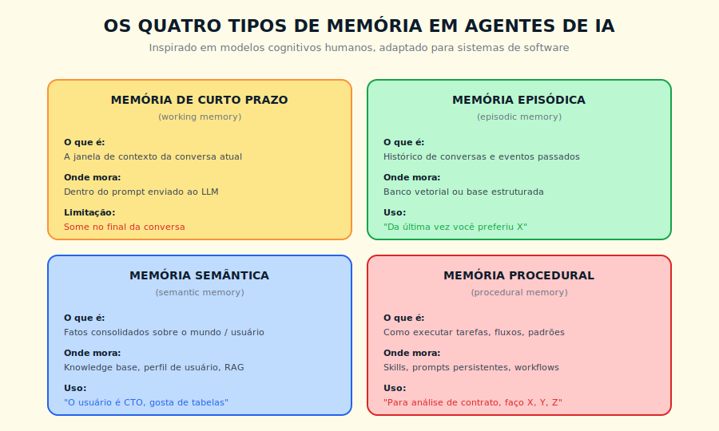

# 7. Memória em IA

---

> *"O LLM não lembra. O sistema em volta dele é que lembra. Quem confunde os dois nunca constrói um agente decente."*

---
## 7.1 O Conceito Intuitivo

Uma das frustrações mais comuns para quem começa a usar IA em volume é a sensação de que o modelo é como o personagem do filme *Memento*, capaz de raciocinar com competência impressionante dentro de uma conversa, mas sem nenhuma lembrança do que foi dito ontem, ou na semana passada, ou em qualquer interação anterior. Você explica para um assistente de IA o tom de voz da sua empresa em uma segunda-feira, e na quinta-feira começa do zero. Você ensina uma convenção específica, e dois dias depois o sistema esqueceu. Isso não é falha pontual, é como esses sistemas funcionam por padrão.

A boa notícia é que existe uma camada de arquitetura, separada do modelo em si, que pode dar a esses sistemas algo equivalente à memória. Essa camada não vive dentro dos pesos do modelo, vive em volta dele, em bancos de dados, sistemas de recuperação, estruturas de perfil de usuário, repositórios de habilidades aprendidas. Quando bem desenhada, ela transforma a experiência, de "um estranho competente toda vez" para "um colaborador que evolui com você".

Entender como essa memória externa funciona é o que separa quem usa IA como ferramenta pontual de quem constrói agentes profissionais.

---

## 7.2 Analogia: O Escritório Que Lembra Por Você

Pense no seguinte arranjo. Você contrata um assistente pessoal extremamente capaz, mas com uma característica peculiar, ele tem amnésia retrógrada profunda, e a cada manhã chega ao trabalho sem lembrar nada do que aconteceu antes. Você tem duas opções para tornar essa contratação viável.

A primeira opção é reexplicar tudo todo dia, cada manhã, o que vai consumir horas e nunca vai funcionar. A segunda opção, mais inteligente, é montar um sistema ao redor desse assistente. Você cria um caderno de regras, atualizado conforme você vai descobrindo preferências dele. Um arquivo de correspondência, em que cada e-mail importante fica organizado e pode ser consultado quando ele precisa lembrar de algo. Um perfil seu, escrito de forma estruturada, descrevendo seu jeito, seus hábitos, suas prioridades. Um manual de procedimentos para tarefas recorrentes, que ele pode consultar quando precisa repetir um processo.

Toda manhã, antes de começar a trabalhar, esse assistente passa por uma rotina rápida de leitura, atualiza o que precisa, e parte para o dia. A amnésia continua existindo dentro da cabeça dele, mas o sistema em volta carrega a memória, e o resultado funcional é o de alguém que conhece você há anos.

É exatamente essa a abordagem que sistemas modernos de IA usam para superar a ausência nativa de memória. O LLM continua sem memória persistente, mas a arquitetura em volta dele, com bancos de dados, recuperação semântica, perfis de usuário e skills persistentes, recria a continuidade. Quem domina essas peças cria agentes que parecem lembrar, mesmo que tecnicamente não lembrem.

> 📊 **Diagrama 7.1 — Os Quatro Tipos de Memória**
>
> 
>
> *Adaptação dos modelos cognitivos clássicos para sistemas de software.*

---

## 7.3 Explicação Técnica

A ciência cognitiva, ao longo de décadas, classificou a memória humana em diferentes tipos, cada um com características próprias. Sistemas modernos de IA tomaram emprestados esses conceitos e os adaptaram para arquitetura de software, e a separação resultante é didaticamente clara.

### 7.3.1 Memória de Curto Prazo

Também chamada de memória de trabalho, ou working memory, é o que está ativo na "consciência" do agente naquele momento. Em um LLM, isso corresponde ao conteúdo da janela de contexto, tema do Capítulo 4. Tudo que está no prompt naquela interação específica, instruções, histórico imediato, documentos recuperados, está na memória de curto prazo.

A característica definidora desse tipo de memória é que ela desaparece ao final da conversa, ou quando a janela de contexto se esgota. Em sistemas naïve, essa é a única memória disponível, e por isso "o modelo esquece tudo quando reinicio a conversa". Em sistemas bem arquitetados, a memória de curto prazo é apenas a primeira de várias camadas, recarregada dinamicamente a partir das outras quando necessário.

### 7.3.2 Memória Episódica

Refere-se ao histórico de eventos passados, especificamente conversas, interações, decisões tomadas anteriormente. Em humanos, é o que te permite lembrar do almoço de ontem, ou de uma discussão da semana passada, com detalhes contextuais.

Em sistemas de IA, memória episódica costuma ser implementada como um banco vetorial específico para conversas anteriores — usando a mesma técnica de busca semântica descrita no Capítulo 6 sobre RAG. Cada turno relevante de cada conversa anterior é embeddado e armazenado, junto com metadados como data, usuário envolvido, tópico identificado. Quando uma nova conversa começa, o sistema pode buscar por similaridade semântica contra esse banco, recuperando episódios relacionados que ajudam o agente a manter continuidade. "Da última vez que conversamos sobre este projeto, você decidiu por X. Quer manter essa decisão?"

A implementação dessa camada tem trade-offs reais. Armazenar tudo é caro e gera ruído. Resumir conversas antigas em formas compactas é mais econômico, mas perde detalhes. Decidir o que vale guardar e o que pode ser descartado é uma das decisões de arquitetura mais sutis em sistemas de agentes.

**Atenção para quem implementa em contexto corporativo:** memória episódica que armazena histórico de interações com identificação de usuário é dado pessoal sob a LGPD. Isso implica base legal para tratamento, prazo de retenção definido, e processo de exclusão sob demanda do titular. Sistemas implantados sem essa política correm risco legal antes de qualquer risco técnico — e o impacto é proporcional ao volume de usuários atendidos.

### 7.3.3 Memória Semântica

Refere-se a fatos consolidados sobre o mundo, sobre o usuário, sobre o domínio. Em humanos, é o conhecimento factual, "Brasília é a capital do Brasil", "minha chefe se chama Ana", "esse cliente prefere relatórios em PDF". Não é episódica porque não está atrelada a um evento específico, é destilada e atemporal.

Em sistemas de IA, memória semântica costuma viver em estruturas explícitas, como perfis de usuário com campos como nome, papel, preferências, restrições conhecidas, e em bases de conhecimento corporativas tratadas no Capítulo 6 sobre RAG. A diferença entre memória semântica e memória episódica é que a semântica é o resultado destilado, enquanto a episódica é o material bruto. Em agentes maduros, ambas coexistem e se alimentam mutuamente.

Um agente bem desenhado, ao final de cada interação relevante, executa um processo de consolidação, em que extrai fatos da conversa atual e atualiza a memória semântica. "O usuário disse que prefere receber resumos no formato bullet point, vou registrar isso no perfil dele". Essa consolidação faz com que, com o tempo, o sistema vá ganhando inteligência sobre o usuário sem precisar de reaprendizagem explícita.

Na prática, consolidação é frequentemente implementada como uma chamada adicional ao LLM ao final de cada sessão relevante, com um prompt que pede ao modelo para extrair fatos estruturados da conversa — nome, preferências, decisões tomadas, restrições identificadas — e compará-los com o perfil existente. O maior risco é consolidar como preferência permanente algo que o usuário disse de passagem ou em contexto específico, o que exige mecanismo de confiança por fonte ou revisão periódica do perfil gerado. Sem esse cuidado, a memória semântica degrada ao invés de melhorar com o tempo.

### 7.3.4 Memória Procedural

Refere-se a como fazer coisas. Em humanos, é a memória que codifica habilidades motoras (andar de bicicleta) e cognitivas (resolver equações). É frequentemente implícita, no sentido em que você sabe fazer sem precisar verbalizar o processo passo a passo.

Em termos operacionais, memória procedural em sistemas de IA se materializa hoje em três formas: **system prompts que encapsulam fluxos de trabalho definidos** ("para análise de contratos, sempre siga estas cinco etapas..."); **ferramentas especializadas que agentes invocam** para tarefas específicas (calculadoras, validadores, APIs de domínio); e **workflows orquestrados** que definem sequências de ações para processos recorrentes, encapsulados como skills que podem ser reutilizados sem o usuário precisar lembrar das etapas.

O sinal de falha de memória procedural é característico: o agente sabe o que quer fazer mas não sabe como — gera passos genéricos em vez de seguir o protocolo definido, ou omite etapas obrigatórias em processos que deveriam ser invariáveis. Quando isso acontece, o diagnóstico correto é que a memória procedural está ausente ou mal especificada, não que o modelo é incapaz da tarefa.

O Livro 2 detalha produtos comerciais que materializam memória procedural com maturidade — mas os princípios acima são suficientes para construir implementações funcionais desde já.

> 📊 **Diagrama 7.2 — Arquitetura de Memória em Agentes Modernos**
>
> 
>
> *Quatro fontes de memória externa alimentam dinamicamente um LLM que, sozinho, não lembra de nada.*

---

## 7.4 Exemplo Memorável: O Assistente Que Aprendeu a Falar Como o CEO

> Cenário ilustrativo, composto a partir de casos recorrentes.

Uma empresa brasileira de médio porte queria que seu time executivo usasse IA para redigir comunicados internos, mas tinha uma exigência específica, os textos precisavam soar como o CEO, que tinha estilo muito particular, frases enxutas, vocabulário próprio, certos termos técnicos que evitava, certas expressões que repetia. Quando experimentaram simplesmente pedir a um LLM frontier que escrevesse "como um CEO experiente", o resultado era genérico, e cada vez que tentavam corrigir, perdiam o aprendizado na próxima sessão.

A solução que adotaram foi montar uma arquitetura de memória em três camadas.

Primeiro, criaram uma **memória semântica** explícita do estilo do CEO. Um documento estruturado, escrito após análise de mais de cem comunicados anteriores assinados por ele, descrevendo seu padrão de cadência, seus termos preferidos, seus tabus de vocabulário, suas preferências de formato. Esse documento era injetado em todo system prompt das conversas relevantes.

Segundo, montaram uma **memória episódica** sobre as interações de revisão. Cada vez que alguém do time executivo gerava um texto, refinava com o assistente, e finalizava o resultado aprovado, esse evento era armazenado em um banco vetorial, com a versão final marcada como exemplo de alta qualidade. Em conversas futuras, esse banco era consultado para recuperar exemplos similares ao tipo de comunicado em produção.

Terceiro, codificaram uma **memória procedural** na forma de uma skill personalizada, com um fluxo definido. Receber a intenção do comunicado, propor uma estrutura, gerar primeira versão, comparar com exemplos similares da memória episódica, refinar com base em divergências detectadas, apresentar versão final para revisão humana. Esse fluxo, encapsulado em skill, podia ser invocado pelos usuários sem precisarem lembrar das etapas.

O resultado, após algumas semanas de operação, era que a qualidade dos comunicados ficou indistinguível dos escritos pelo próprio CEO em testes cegos. Mais interessante, a memória do sistema continuou refinando sozinha, com cada nova interação alimentando os dois bancos. O CEO comentou, em uma reunião, que sentia que o sistema "tinha aprendido a pensar como ele", o que tecnicamente é impreciso, mas funcionalmente capturava o que estava acontecendo. **O LLM continuava sem memória dentro de si. Mas a arquitetura em volta dele era um arquiteto cognitivo competente.**

---

## 7.5 O Futuro da Memória em Agentes

A pesquisa em memória de agentes é um dos campos mais ativos da IA em 2026. Algumas direções que valem acompanhar.

A primeira é **memória continuamente consolidada**, em que o agente, em background, processa conversas antigas para destilar aprendizados, descartar redundância e reorganizar conhecimento. Funciona de forma análoga ao papel do sono em humanos, sem o qual a memória de longo prazo não se forma de maneira saudável.

A segunda é **memória diferenciável por papel**, em que diferentes tipos de informação são tratados de formas diferentes, com políticas explícitas de retenção, esquecimento, e prioridade. Não tudo merece ser lembrado, e a habilidade de esquecer o irrelevante é tão importante quanto a habilidade de lembrar o crucial.

A terceira é **memória colaborativa**, em que múltiplos agentes compartilham camadas de memória entre si, formando uma espécie de inteligência coletiva organizacional. O que um agente aprende, outros podem usar, sob políticas de governança apropriadas.

A quarta é **memória persistente nativa em modelos**, abordagem alternativa em que parte da memória é incorporada nos próprios pesos do modelo via técnicas como continual learning. Mais especulativa, com desafios técnicos sérios, e atrai pesquisa séria nos principais laboratórios de frontier. A maior barreira técnica para essa abordagem é o catastrophic forgetting — novos aprendizados tendem a sobrescrever conhecimento anterior nos pesos. Resolver isso de forma estável é um dos problemas em aberto mais difíceis da área, e quem planeja arquitetura hoje não deve contar com essa solução como premissa.

Independente de qual dessas direções predominar, a tendência é clara, agentes do futuro vão depender menos de janelas gigantescas de contexto e mais de arquiteturas inteligentes de memória externa que carregam dinamicamente o que importa.

---

## 7.6 Conexões

Este capítulo conversa especialmente com o Capítulo 4, sobre janela de contexto, com o Capítulo 5, sobre embeddings, e com o Capítulo 6, sobre RAG como fundação para memória semântica. Os desdobramentos arquiteturais aparecem no Capítulo 12, sobre agentes, e no Livro 2, sobre produtos comerciais que materializam cada camada de memória.

---

## 7.7 Resumo Executivo

| Conceito | Síntese |
|----------|---------|
| **Memória de curto prazo** | Conteúdo da janela de contexto, ativo durante a conversa |
| **Memória episódica** | Histórico de conversas e eventos, recuperado por busca semântica |
| **Memória semântica** | Fatos consolidados sobre usuário e domínio, em perfis e bases de conhecimento |
| **Memória procedural** | Como fazer tarefas, codificada em skills, workflows, padrões |
| **Consolidação** | Processo de destilar memória episódica em memória semântica ao longo do tempo |
| **Continuidade aparente** | LLM não lembra, a arquitetura em volta dele é que cria a sensação de continuidade |

---

## 7.8 Checklist do Capítulo

- [ ] Distinguir os quatro tipos de memória, com exemplos próprios
- [ ] Explicar por que o LLM em si não tem memória, e como o sistema em volta resolve isso
- [ ] Identificar, em uma aplicação de IA real, quais tipos de memória estão presentes
- [ ] Reconhecer quando ausência de memória é a causa de falha de uma aplicação
- [ ] Desenhar, em alto nível, uma arquitetura de memória para um caso da sua organização
- [ ] Conectar memória episódica a embeddings e RAG

---

## 7.9 Perguntas de Revisão

1. Por que separar memória episódica de semântica, do ponto de vista de arquitetura?
2. Em que situação consolidação automatizada agrega mais que prejudica?
3. Por que armazenar tudo costuma ser pior que armazenar seletivamente?
4. Como produtos comerciais implementam, na prática, memória semântica persistente?
5. Por que esquecer pode ser uma feature, não bug?

---

## 7.10 Exercícios Práticos

### Exercício 1 — Inventário de Memória
Pegue um sistema de IA que você usa em volume. Identifique quais dos quatro tipos de memória estão presentes, e quais estão ausentes. O que falta para a experiência ser mais contínua?

### Exercício 2 — Esboço de Arquitetura
Desenhe a arquitetura de memória ideal para um caso da sua organização. Indique onde mora cada tipo, como são alimentados, como são consultados.

### Exercício 3 — Política de Esquecimento
Para um sistema hipotético com memória episódica crescente, escreva uma política de retenção. O que merece ser guardado para sempre? O que pode ser resumido? O que pode ser descartado? Justifique.

### Exercício 4 — Consolidação
Pegue uma conversa real longa que você teve com um modelo. Destile, em uma página, os fatos consolidados que valeriam ser guardados em memória semântica. Esse exercício revela o que faz diferença a longo prazo.

---

## 7.11 Projeto do Capítulo

**Construa um perfil de memória semântica persistente para um caso real.**

Escolha um domínio em que você interage com IA repetidamente. Pode ser revisão de textos seus, suporte para uma área de trabalho recorrente, ou assistência em um projeto contínuo. Construa um documento estruturado com seu perfil, preferências, restrições, contexto domínio-específico. Use esse documento como prefixo persistente em conversas pela próxima semana, ajustando conforme descobrir lacunas. Documente o ganho perceptível em qualidade. Esse exercício, simples na aparência, é a porta de entrada para arquiteturas de memória mais sofisticadas.

---

## 7.12 Referências Principais

📚 **Papers**

- Park et al. *"Generative Agents: Interactive Simulacra of Human Behavior"*. 2023. → arxiv.org/abs/2304.03442
- Zhong et al. *"MemoryBank: Enhancing Large Language Models with Long-Term Memory"*. 2023.
- Mialon et al. *"Augmented Language Models: a Survey"*. 2023.

📚 **Recursos**

- [Anthropic — Documentação de funcionalidades de memória em Claude](https://docs.anthropic.com)
- [MemGPT — Memory for LLMs](https://memgpt.ai/)
- [Mem0 — Memory layer for AI](https://mem0.ai/)

---

## 7.13 Autoavaliação

| # | Critério | Você consegue? |
|---|----------|----------------|
| 1 | **Clareza** — Explicar para um leigo por que LLMs "esquecem" e como sistemas modernos resolvem isso, em 90 segundos | ☐ |
| 2 | **Profundidade** — Defender, em discussão técnica, a separação dos quatro tipos de memória e onde cada um vive | ☐ |
| 3 | **Aplicação** — Olhar para uma aplicação real e diagnosticar quais memórias estão presentes e quais faltam | ☐ |
| 4 | **Conexão** — Articular como memória se conecta com contexto (Cap 4), embeddings (Cap 5), RAG (Cap 6), agentes (Cap 12) | ☐ |
| 5 | **Curiosidade** — Está com vontade de entender quando vale a pena modificar o próprio modelo (fine-tuning) versus toda essa arquitetura externa | ☐ |

---

> *"Memória boa em agentes não vem do modelo, vem da arquitetura. Quem confunde isso constrói brinquedos. Quem entende, constrói ferramentas."*
