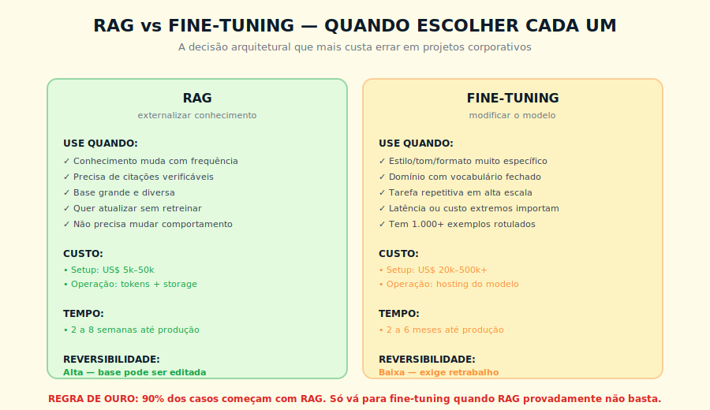
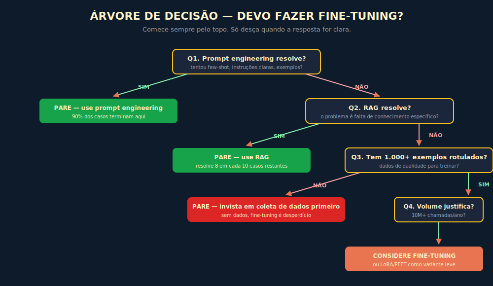

# 8. Fine-Tuning

---

> *"Fine-tuning é uma ferramenta poderosa que resolve problemas reais. Também é a ferramenta que organizações imaturas mais usam de forma errada, gastando muito para resolver nada."*

---
## 8.1 O Conceito Intuitivo

Quando uma organização decide adotar IA com seriedade, em algum momento alguém vai sugerir, com brilho nos olhos, que "vamos treinar nosso próprio modelo, com nossos dados". A ideia soa atraente, ter um modelo que sabe especificamente da sua empresa, que fala exatamente do seu jeito, que aprendeu seus processos. A realidade prática dessa decisão, no entanto, costuma decepcionar quem não entende o que está em jogo. Em muitos casos, o resultado é gastar entre cinquenta mil e meio milhão de dólares em um projeto que entrega ganhos marginais sobre o que engenharia de prompt e RAG já entregavam, ou pior, entrega resultados inferiores aos modelos genéricos atualizados.

Fine-tuning é o nome técnico para o processo de continuar treinando um modelo pré-existente em dados adicionais, ajustando seus pesos para que ele se torne mais especializado em alguma tarefa ou domínio. Diferente do treinamento completo de um modelo do zero, que custa centenas de milhões e exige recursos de hyperscaler, fine-tuning trabalha com modelos prontos como Llama, Mistral, Gemma, ou variantes proprietárias que alguns provedores oferecem, e os refina com seus próprios dados.

A pergunta importante, então, não é "fine-tuning vale a pena?". É "vale a pena para o meu problema específico, dado o que outras alternativas mais baratas já entregariam?". Esse é o capítulo que te ajuda a responder com método em vez de entusiasmo.

---

## 8.2 Analogia: O Curso de Especialização

Pense em fine-tuning como um curso de especialização para um profissional já formado. Um médico clínico geral, com formação sólida, pode fazer uma residência em cardiologia, que vai refinar seu conhecimento e moldar sua prática para esse domínio específico. Esse curso não substitui a formação básica, ele se constrói sobre ela. E vem com características próprias, exige tempo, custa dinheiro, foca em um domínio em detrimento de outros, e gera um profissional mais especializado mas potencialmente menos versátil.

A analogia ilumina pontos importantes. Primeiro, fine-tuning faz sentido quando a especialização realmente importa para o caso de uso, não como exercício de prestígio. Segundo, fine-tuning bem-feito exige dados de qualidade, da mesma forma que uma residência exige casos clínicos diversificados e bem documentados. Terceiro, o custo precisa ser justificado pelo retorno operacional, não pela ideia romântica de "ter nosso próprio modelo". Quarto, e mais importante, antes de mandar o médico para a especialização, vale verificar se o problema que você quer resolver não pode ser respondido por um clínico geral consultando um cardiologista pontualmente, que é o equivalente, em IA, a usar RAG para trazer conhecimento de domínio sem mexer no modelo.

---

## 8.3 Explicação Técnica

### 8.3.1 Como Funciona, em Alto Nível

Tecnicamente, fine-tuning continua o processo de treinamento tratado no Capítulo 2, mas com algumas diferenças importantes. Em vez de partir de pesos aleatórios, parte de pesos já treinados, ou seja, de um modelo que já sabe linguagem geral. Em vez de trilhões de exemplos genéricos, usa milhares ou dezenas de milhares de exemplos curados para o domínio alvo. Em vez de meses de compute em superclusters, demora horas ou dias em hardware mais modesto. E em vez de produzir um modelo de uso geral, produz um modelo especializado em um nicho.

O processo, simplificado, é o seguinte. Você prepara um conjunto de dados rotulados, tipicamente em formato de pares pergunta-resposta ou prompt-completação, exemplos do tipo de saída que você quer que o modelo aprenda a produzir. Esses dados precisam ser de alta qualidade, porque tudo que estiver errado, contraditório, ou inconsistente vai ser absorvido pelo modelo. Esse conjunto, idealmente entre mil e cem mil exemplos, é então usado para continuar o treinamento do modelo base, com técnicas que ajustam os pesos sem destruir o conhecimento geral pré-existente.

Existem variantes mais leves desse processo, como LoRA (Low-Rank Adaptation) e suas evoluções, que ajustam apenas pequenas matrizes adicionais em vez do modelo inteiro. Essas variantes são muito mais baratas, mais rápidas, e em muitos casos entregam 80% do benefício do fine-tuning completo por 10% do custo. Vale conhecê-las antes de decidir por abordagens mais pesadas.

### 8.3.2 Quando Faz Sentido

Vou ser específico, porque ouvir "depende" não ajuda ninguém. Fine-tuning faz sentido principalmente em quatro cenários, e fora deles costuma ser desperdício.

O primeiro cenário é **estilo, tom ou formato muito específico**, em que você quer que o modelo sempre responda de uma forma particular que engenharia de prompt não consegue forçar consistentemente. Pode ser o tom de voz de uma marca, o formato exato de um relatório financeiro, a estrutura de um documento jurídico. Quando você tem milhares de exemplos do estilo desejado, e o estilo é estável, fine-tuning entrega consistência que prompts não conseguem.

O segundo cenário é **domínio com vocabulário fechado e técnico**, em que o modelo precisa operar com terminologia muito específica que não está bem representada nos dados de treino originais. Áreas como medicina molecular, direito tributário avançado, engenharia aeronáutica, jurisprudência internacional, podem se beneficiar de fine-tuning sobre corpora especializados, especialmente quando a precisão terminológica é crítica.

O terceiro cenário é **tarefa repetitiva em altíssima escala**, em que o custo de operação importa muito. Se você processa dez ou cem milhões de chamadas por mês fazendo a mesma tarefa estruturada (classificar e-mails, extrair dados de formulários, traduzir entre dois idiomas específicos), um modelo menor fine-tunado para essa tarefa pode rodar mais barato e mais rápido que um modelo frontier comercial, gerando economia substancial em escala.

O quarto cenário é **latência ou privacidade extremas**, em que rodar localmente é requisito. Quando você precisa de respostas em milissegundos, ou quando dados não podem sair da sua infraestrutura, modelos open source fine-tunados para o caso específico se tornam uma boa opção, porque permitem hospedagem própria com qualidade aceitável.

Fora desses quatro cenários, a chance de fine-tuning ser a melhor alternativa diminui rapidamente, e em muitos casos é puro desperdício de orçamento.

> 📊 **Diagrama 8.1 — RAG versus Fine-Tuning**
>
> 
>
> *A decisão arquitetural que mais custa errar em projetos corporativos.*

### 8.3.3 Quando Não Faz Sentido

Listo agora os anti-padrões mais comuns que vejo em campo.

**Conhecimento volátil.** Se o conteúdo que você quer "ensinar" ao modelo muda toda semana, fine-tuning é a escolha errada, porque cada atualização exige novo ciclo de treino. RAG, que consulta uma base atualizável, é radicalmente superior.

**Dados insuficientes ou ruins.** Fine-tuning bem-feito exige milhares de exemplos de alta qualidade. Se você tem cinquenta exemplos, ou se os exemplos são inconsistentes entre si, vai produzir um modelo que aprende as inconsistências e amplifica.

**Resolver problema que engenharia de prompt já resolve.** Antes de pensar em fine-tuning, vale exaurir o que prompts bem desenhados conseguem. Em muitos casos, few-shot prompting com cinco a dez exemplos no contexto entrega o que fine-tuning entregaria, sem o custo nem o lock-in.

**Volume baixo.** Se você faz mil consultas por mês, o overhead operacional de manter um modelo próprio supera qualquer economia possível.

**Querer "ter um modelo da empresa" como vaidade.** É surpreendentemente comum, e quase sempre desastroso. Modelo é meio, não fim. Se ele não resolve problema concreto, é despesa.

**Ignorar overfitting.** O risco técnico mais comum em projetos com dados insuficientes é o modelo memorizar os exemplos de treino sem generalizar o padrão subjacente. Em projetos com menos de mil exemplos, ou com exemplos repetitivos, o modelo aprende os casos específicos em vez da regra — e performa bem no conjunto de treino e mal em produção. O sinal de overfitting é exatamente esse: qualidade alta nos exemplos que você usou para treinar, qualidade baixa em casos novos. Mitigações incluem diversidade nos dados de treino, regularização, e early stopping. Um modelo que performa "perfeito" no treino e razoável nos testes está quase certamente sofrendo de overfitting.

---

## 8.4 A Hierarquia das Soluções

Vale uma sistemática clara sobre a ordem em que se deve considerar alternativas, antes de chegar em fine-tuning. Pense nisso como uma escada, em que cada degrau é mais caro e mais comprometedor que o anterior, e você só sobe quando o degrau inferior provadamente não basta.

Provar que um degrau não basta exige experimento, não intuição. Para cada degrau, defina uma métrica de sucesso antes de começar — taxa de acerto em amostra representativa, tempo médio de revisão, taxa de aprovação sem edição. Execute em casos reais, compare com o baseline atual, itere por pelo menos duas semanas antes de concluir. Se a métrica não for atingida após iteração razoável, o próximo degrau está justificado. Sem esse critério, a hierarquia vira preferência subjetiva: qualquer pessoa num meeting pode dizer "já tentamos prompt e não funcionou" sem que haja dado que sustente a afirmação.

O primeiro degrau é **engenharia de prompt bem feito**. Instruções claras, exemplos few-shot, estrutura de prompt cuidadosa. Cobre uma fatia surpreendente dos problemas que organizações imputam ao "modelo não saber".

O segundo degrau é **RAG**. Quando o problema é falta de conhecimento específico, RAG injeta esse conhecimento dinamicamente sem mexer no modelo. O Capítulo 6 mostrou que isso resolve a maioria dos casos corporativos de "modelo não conhece nossa empresa".

O terceiro degrau é **tool use e function calling**. Quando o problema exige executar ações específicas (consultar API, calcular preço exato, acessar banco de dados), conectar o modelo a ferramentas externas resolve melhor que fine-tuning, porque preserva precisão computacional e atualidade de dados.

O quarto degrau é **agentes com memória**. Quando o problema é continuidade entre interações, arquiteturas como as do Capítulo 7 entregam a sensação de "modelo que aprende" sem precisar ajustar pesos.

O quinto degrau, finalmente, é **fine-tuning leve via LoRA**. Mais barato, reversível, e entregando boa parte do ganho de fine-tuning completo. Para muitos casos em que fine-tuning faz sentido, LoRA é o suficiente.

O sexto degrau é **fine-tuning completo**, com toda a complexidade operacional, custo e lock-in que implica. Só vale quando os cinco anteriores foram insuficientes e há justificativa de negócio robusta.

> 📊 **Diagrama 8.2 — Árvore de Decisão**
>
> 
>
> *Suba a escada com cuidado. Nove em cada dez casos não precisam chegar até o topo.*

---

## 8.5 Exemplo Memorável: A Seguradora Que Não Precisava Fazer Fine-Tuning

> Cenário ilustrativo, composto a partir de casos recorrentes.

Uma seguradora de grande porte contratou uma consultoria de IA para "treinar um modelo proprietário" para automatizar análise de sinistros. O escopo inicial era usar um modelo fine-tunado em três anos de histórico de análises feitas por analistas humanos. O orçamento aprovado era de cerca de US$ 400 mil, prazo de seis meses, e uma expectativa de redução de 60% no tempo de análise.

A consultoria, antes de aceitar o trabalho como proposto, fez uma coisa simples mas incomum, sugeriu um piloto de duas semanas para testar uma hipótese alternativa, resolver o problema sem fine-tuning, usando apenas um LLM frontier com engenharia de prompt bem desenhado e RAG sobre o histórico de sinistros. Se isso entregasse pelo menos 80% do ganho prometido, o cliente economizaria a maior parte do orçamento e teria solução mais flexível.

Em duas semanas, com investimento de cerca de US$ 25 mil, o piloto entregou redução de 71% no tempo de análise, com qualidade igual ou superior à dos analistas humanos em testes cegos. A combinação que funcionou foi simples, um system prompt detalhado descrevendo os critérios de análise da seguradora, exemplos few-shot de análises bem feitas, e uma camada RAG que recuperava sinistros similares do histórico para servir de referência. Nenhum modelo proprietário foi treinado. Nenhum dado precisou sair da infraestrutura da empresa, porque a consultoria hospedou o modelo via Bedrock com VPC isolado.

Quando a seguradora viu o resultado, a discussão interna virou ao avesso. Em vez de "será que o fine-tuning vai mesmo entregar?", virou "por que íamos fazer fine-tuning?". O projeto original foi cancelado, a solução baseada em engenharia de prompt e RAG foi escalada, e o orçamento economizado virou três outros projetos de IA pelo setor.

A lição não é que fine-tuning é ruim, é que **a maioria das organizações pula etapas mais simples e mais baratas porque a ideia de "ter um modelo próprio" tem apelo emocional desproporcional à utilidade técnica real**. Quem domina a hierarquia das soluções economiza muito dinheiro e entrega resultado mais rápido.

> 🎯 **PARA EXECUTIVOS**
> Antes de aprovar qualquer projeto de fine-tuning na sua organização, exija dos proponentes que demonstrem que engenharia de prompt, RAG, tool use e agentes com memória foram tentados primeiro e não bastaram. Em mais da metade dos casos, essa exigência simples vai matar projetos que iam consumir centenas de milhares de dólares sem retorno claro.

---

## 8.6 Custos Reais

Vale estruturar os custos por categoria, porque conversa abstrata nunca convence — mas valores fixos envelhecem: custos de GPU caem historicamente 30 a 40% ao ano, e qualquer número citado aqui pode estar desatualizado quando você ler. O que não muda são os drivers de custo em cada categoria.

**Coleta e curadoria de dados** é o item que mais gente subestima, e onde 80% dos projetos de fine-tuning naufragam. O driver é qualidade e cobertura: dado inconsistente ou insuficiente amplifica problemas em vez de resolver. Estime em horas de trabalho especializado, não em produção automática.

**Compute para o treinamento** varia por dois fatores determinantes: tamanho do modelo (um modelo de 7B é tipicamente 10x mais barato de treinar que um de 70B) e volume de dados de treino. Use as calculadoras públicas de provedores como AWS, GCP e Replicate para preços de GPU no momento da avaliação.

**Validação e ajuste** — testes A/B, métricas de qualidade, ajuste de hiperparâmetros — é trabalho de engenharia que costuma ser subestimado no planejamento. Sem ele, o modelo treinado pode não entregar o comportamento esperado em casos reais.

**Hospedagem do modelo treinado**, em produção, é custo recorrente que muda conforme volume e latência exigida. Para modelos próprios, é tipicamente mais caro que consumir um modelo via API de provedor compartilhado.

**Manutenção e retreinamento periódico** para incorporar novos dados é item recorrente que muita gente ignora no planejamento inicial e descobre na conta do segundo ano.

Para LoRA ou variantes leves, todos esses custos caem significativamente, mas continuam existindo.

Compare isso com RAG bem implementado, em que o principal custo de setup é engenharia de indexação e o custo de operação é tokens e armazenamento vetorial. A diferença estrutural não é marginal.

---

## 8.7 Conexões

Este capítulo conversa especialmente com o Capítulo 6, sobre RAG como alternativa principal, com o Capítulo 7, sobre memória como alternativa para continuidade, e com o Capítulo 9, sobre engenharia de prompt como primeiro degrau da hierarquia. Os desdobramentos retornam no Capítulo 12, sobre tool use em agentes, e no Capítulo 16, sobre modelos open source disponíveis para fine-tuning.

---

## 8.8 Resumo Executivo

| Conceito | Síntese |
|----------|---------|
| **Fine-tuning** | Continuar o treinamento de um modelo existente em dados específicos |
| **LoRA / PEFT** | Variantes leves que ajustam pequenas matrizes em vez do modelo inteiro |
| **Quando faz sentido** | Estilo fixo, vocabulário fechado, altíssima escala, latência crítica |
| **Quando não faz sentido** | Conhecimento volátil, dados ruins, baixo volume, ego organizacional |
| **Hierarquia das soluções** | Prompt → RAG → Tools → Agentes → LoRA → Fine-tuning completo |
| **Custo típico** | Varia por tamanho do modelo, volume de dados e preços vigentes de GPU; LoRA reduz significativamente em relação ao fine-tuning completo |
| **Tempo até produção** | 2 a 6 meses, contra 2 a 8 semanas de RAG |

---

## 8.9 Checklist do Capítulo

- [ ] Distinguir fine-tuning completo de LoRA e suas variantes
- [ ] Listar os quatro cenários em que fine-tuning faz sentido
- [ ] Identificar os anti-padrões que tornam fine-tuning desperdício
- [ ] Aplicar a hierarquia das soluções em um problema real
- [ ] Estimar, em alto nível, custo de um projeto de fine-tuning
- [ ] Defender, em uma reunião executiva, por que começar por RAG antes
- [ ] Reconhecer quando "fine-tuning" é vaidade disfarçada de estratégia

---

## 8.10 Perguntas de Revisão

1. Por que LoRA frequentemente entrega 80% do ganho por 10% do custo?
2. Em que situação RAG é estruturalmente superior a fine-tuning, independente de orçamento?
3. Por que dados ruins amplificam problemas em fine-tuning, mais que em engenharia de prompt?
4. Como você estruturaria uma decisão entre fine-tuning e RAG, sem cair em viés organizacional?
5. Por que volume é determinante para justificar fine-tuning em escala?

---

## 8.11 Exercícios Práticos

### Exercício 1 — Diagnóstico de Projeto
Identifique, na sua organização ou em projetos públicos que conhece, um caso em que fine-tuning foi adotado. Avalie criticamente, ele passaria nos quatro critérios da seção 8.3.2? RAG resolveria? Estime o gasto.

### Exercício 2 — Caminho Alternativo
Para um problema concreto em que alguém na sua organização cogita fine-tuning, escreva uma proposta de duas semanas explorando alternativas mais leves primeiro. Liste hipóteses testáveis.

### Exercício 3 — Avaliação de Dados
Para um caso real, avalie a qualidade dos dados que seriam usados em fine-tuning. Eles são consistentes? Cobertura adequada? Quantos exemplos? Que vieses carregam?

### Exercício 4 — Análise de Custo
Calcule, com números públicos de provedores como AWS, GCP, Anthropic e OpenAI, o custo total estimado de um projeto de fine-tuning hipotético versus a alternativa em RAG, para o mesmo problema. Compare TCO em três anos.

---

## 8.12 Projeto do Capítulo

**Documento de decisão arquitetural para um caso real.**

Escolha um caso real em sua organização (ou um caso público que você conhece bem) em que se discute, ou se discutirá, a adoção de fine-tuning. Escreva um documento estruturado, com no máximo cinco páginas, contendo: descrição do problema, alternativas avaliadas em ordem da hierarquia (prompt, RAG, tools, agentes, LoRA, fine-tuning), critérios de decisão, recomendação final, plano de validação em piloto curto. Esse documento, se bem feito, vai te servir como template para todas as decisões similares dos próximos anos, e em muitos casos vai prevenir investimentos questionáveis.

---

## 8.13 Referências Principais

📚 **Papers**

- Howard & Ruder. *"Universal Language Model Fine-tuning"* (ULMFiT). 2018.
- Hu et al. *"LoRA: Low-Rank Adaptation of Large Language Models"*. 2021. → arxiv.org/abs/2106.09685
- Dettmers et al. *"QLoRA: Efficient Finetuning of Quantized LLMs"*. 2023.

📚 **Documentação**

- [OpenAI Fine-tuning guide](https://platform.openai.com/docs/guides/fine-tuning)
- [Hugging Face PEFT](https://huggingface.co/docs/peft)
- Anthropic — Documentação sobre quando usar engenharia de prompt versus fine-tuning (consulte docs.anthropic.com para a versão atual)

---

## 8.14 Autoavaliação

| # | Critério | Você consegue? |
|---|----------|----------------|
| 1 | **Clareza** — Explicar fine-tuning para um diretor financeiro em 90 segundos, e fazer ele entender quando vale e quando não vale | ☐ |
| 2 | **Profundidade** — Defender, em discussão técnica, a hierarquia das soluções e por que fine-tuning é o último degrau | ☐ |
| 3 | **Aplicação** — Olhar para uma proposta de fine-tuning real e validar criticamente se ela passaria nos critérios | ☐ |
| 4 | **Conexão** — Articular como fine-tuning se conecta com RAG (Cap 6), agentes (Cap 12), open source (Cap 16) e escolha de modelo (Cap 15) | ☐ |
| 5 | **Curiosidade** — Está com vontade de entrar na próxima Parte e dominar engenharia de prompt, agora que viu a fundação técnica completa | ☐ |

---

> *"Fine-tuning faz sentido quando todas as outras opções foram exauridas. Em 90% dos casos corporativos, engenharia de prompt e RAG já entregam o que importa."*
