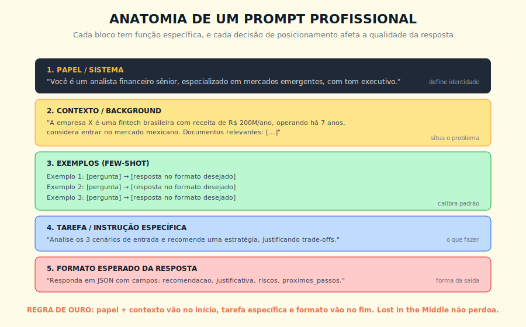
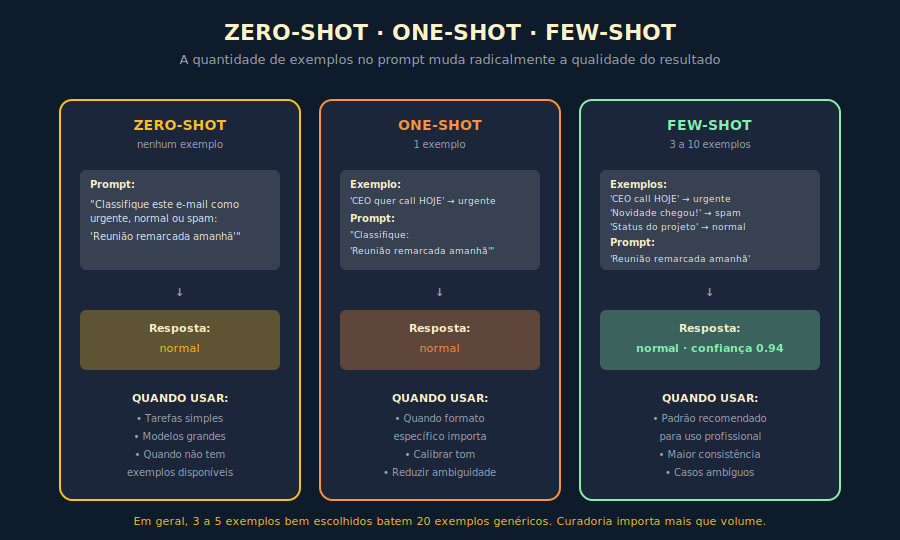
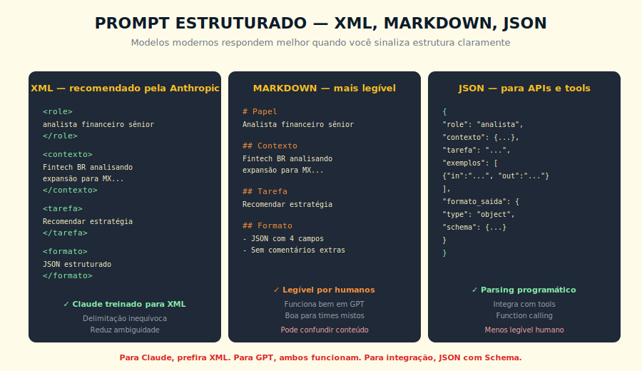

# 9. Engenharia de Prompt

---

> *"Prompt não é texto, é interface. Quem trata prompt como conversa casual obtém respostas casuais, quem trata como interface obtém comportamento profissional."*

---
## 9.1 O Conceito Intuitivo

Existe uma confusão recorrente entre quem começa a usar IA com seriedade. Quando você digita uma pergunta em um assistente de IA, a sensação é de estar conversando com alguém, e essa sensação tem virtudes pedagógicas, mas também esconde uma realidade técnica que faz diferença gigantesca em qualquer aplicação minimamente séria. Você não está conversando com uma pessoa, você está enviando um conjunto de instruções, contexto, exemplos e perguntas para um sistema que vai processar tudo isso como um único bloco de entrada e produzir uma resposta com base em padrões estatísticos aprendidos. Quem entende essa diferença começa a tratar prompts como interface de programação, e a qualidade do que recebe muda de imediato.

Engenharia de prompt é a disciplina que estuda como construir essa interface com eficácia, e ela existe porque a forma como você formula a entrada afeta significativamente a qualidade da saída, em magnitude que muita gente não imagina. O mesmo modelo pode responder a uma pergunta de quinze formas diferentes, dependendo de como você estruturar o pedido, e essas formas variam desde a resposta certa e útil até a resposta evasiva, incorreta ou genérica. Não estou falando de pequenas variações estéticas, estou falando de diferenças que decidem se uma aplicação funciona em produção ou se queima orçamento sem entregar resultado.

A boa notícia é que existem padrões reproduzíveis para construir prompts bons, e esses padrões podem ser aprendidos e aplicados sistematicamente. A má notícia é que a maioria das organizações ainda trata engenharia de prompt como se fosse improviso criativo, deixando engenheiros sêniors descobrirem por conta própria o que funciona, sem repositório compartilhado, sem versionamento, sem testes, sem governança.

---

## 9.2 Analogia: A Instrução Para o Estagiário Brilhante

Para tornar concreto o tipo de cuidado que engenharia de prompt exige, pense no seguinte arranjo profissional. Você precisa que um estagiário recém-contratado, brilhante mas sem contexto sobre sua empresa, faça uma análise importante até o fim do dia. Você tem duas formas de pedir.

A primeira forma é a improvisada, em que você passa pela mesa dele, fala "ô, dá uma olhada nesses números e me diz o que você acha", e segue para sua próxima reunião. O estagiário, sem saber que tipo de análise você quer, sem saber em que formato você prefere receber, sem ter visto exemplos de análises que sua empresa considera boas, sem saber para quem o resultado vai, vai fazer o melhor que conseguir dentro das suposições dele. Vai entregar algo, talvez competente, talvez não, e a chance de ser exatamente o que você precisava é estatisticamente baixa. Quando você reclamar, a culpa parece dele, mas o defeito está na instrução.

A segunda forma é a profissional, em que você senta com o estagiário por dez minutos e diz, "preciso que você seja um analista de risco para esse exercício, considere que estamos avaliando se vale entrar no mercado mexicano, aqui estão três análises anteriores que considero exemplares para você ver o padrão de profundidade e formato que esperamos, aqui está o dataset, faça a análise dos três cenários de entrada, justifique trade-offs explicitamente, e me entregue em formato JSON estruturado para integrar no nosso sistema". Essa é uma instrução de cinco minutos a mais, que vai render uma análise com qualidade ordens de magnitude melhor, sem mistério, sem milagre, apenas com clareza de pedido.

Engenharia de prompt é exatamente esse segundo modo de pedir, sistematizado em padrões reaplicáveis, aplicado a um sistema computacional em vez de a um estagiário humano. O custo de aprender essa disciplina é pequeno, e o retorno em qualidade de resultado é desproporcional.

---

## 9.3 Explicação Técnica

### 9.3.1 A Anatomia de um Prompt Profissional

Todo prompt bem construído pode ser decomposto em cinco blocos funcionais, cada um cumprindo um papel específico, e cada um com posicionamento estratégico dentro do prompt. Conhecer esses blocos é o primeiro passo para parar de improvisar.

O primeiro bloco é o **papel ou sistema**, em que você define a identidade do modelo para a tarefa. Algo como "você é um analista financeiro sênior, especializado em mercados emergentes, com tom executivo e direto". Esse bloco vai sempre no início, frequentemente como system prompt separado da mensagem do usuário, e tem efeito imediato sobre tom, vocabulário e ângulo da resposta. Modelos modernos respondem fortemente a esse enquadramento.

O segundo bloco é o **contexto ou background**, em que você situa o problema com a informação necessária para responder bem. Quem é a empresa, qual a situação, quais são as restrições conhecidas, quais documentos relevantes estão à disposição. Esse bloco fica na parte alta do prompt, depois do papel, e é o que diferencia uma resposta genérica de uma resposta calibrada para o seu caso específico.

O terceiro bloco são os **exemplos**, quando você quer calibrar o padrão de resposta com casos concretos. São os famosos few-shot, tratados na próxima subseção, e que costumam ser a alavanca de qualidade mais subutilizada em prompts corporativos.

O quarto bloco é a **tarefa específica**, em que você diz claramente o que quer que o modelo faça. Não "me ajude com isso", mas "analise os três cenários de entrada e recomende uma estratégia, justificando trade-offs". Especificidade aqui paga dividendos enormes.

O quinto bloco é o **formato esperado da resposta**, em que você diz como a saída deve ser estruturada. Pode ser texto livre, pode ser Markdown, pode ser JSON com schema, pode ser tabela. Esse bloco vai sempre no final, próximo ao ponto em que o modelo começa a gerar, porque é onde a atenção do modelo está mais alta no momento da geração.

> 📊 **Diagrama 9.1 — Anatomia de um Prompt Profissional**
>
> 
>
> *Cada bloco tem função específica, e o posicionamento importa por causa do Lost in the Middle.*

### 9.3.2 — Zero-shot, one-shot, few-shot

Uma das decisões mais importantes em engenharia de prompt é quantos exemplos incluir. Há três padrões clássicos com nomes específicos, e cada um tem seu lugar.

Uma distinção que afeta todas as escolhas a seguir: prompts para uso humano e prompts para sistemas automatizados têm requisitos diferentes. Em uso humano, a pessoa pode pedir esclarecimento se a resposta vier ambígua. Em pipeline automatizado, não há humano para corrigir — a saída precisa ter formato garantido (JSON com schema, não texto livre) porque vai ser parseada por código. Muitas das técnicas deste capítulo se aplicam a ambos os contextos, mas o critério de sucesso é diferente: num, qualidade percebida; no outro, estrutura verificável.

O **zero-shot** é quando você pede a tarefa sem fornecer nenhum exemplo. Funciona bem em tarefas simples em modelos de alta capacidade, quando o vocabulário é direto e a resposta esperada é óbvia. "Traduza isto para o inglês" funciona bem zero-shot; "classifique este e-mail como urgente, normal ou spam" funciona razoavelmente bem zero-shot em modelos de alta capacidade, mas modelos menores exigem mais contexto para o mesmo resultado.

O **one-shot** é quando você fornece um único exemplo do tipo de resposta que quer. Útil quando o formato da saída precisa ser específico, ou quando há ambiguidade sobre o tom. Um exemplo bem escolhido frequentemente vale mais que três páginas de instruções textuais.

O **few-shot** é quando você fornece entre três e dez exemplos cuidadosamente curados. Esse é o padrão recomendado para uso profissional, porque três exemplos boa qualidade calibram o modelo de forma muito mais consistente do que qualquer instrução textual conseguiria. Aqui vale uma observação importante, mais exemplos não é necessariamente melhor, e em geral três a cinco exemplos bem escolhidos batem vinte exemplos genéricos.

> 📊 **Diagrama 9.2 — Zero-shot, One-shot, Few-shot**
>
> 
>
> *A quantidade certa de exemplos depende da tarefa, mas três bons exemplos costumam ser ouro.*

A curadoria dos exemplos few-shot é mais importante que o volume. Os exemplos devem cobrir variedade de casos, incluir casos difíceis ou ambíguos, e refletir o padrão exato de resposta que você quer ver. Exemplos preguiçosos, repetitivos ou enviesados ensinam o modelo a ser preguiçoso, repetitivo ou enviesado. O cuidado aqui paga retorno desproporcional.

### 9.3.3 — Role prompting

O bloco de papel, quando bem definido, é uma das alavancas mais poderosas em engenharia de prompt, e merece tratamento especial. Quando você instrui o modelo a ser "um analista financeiro sênior" em vez de simplesmente fazer a pergunta, a resposta muda em três dimensões observáveis. O vocabulário fica mais técnico e adequado ao domínio. O ângulo de análise se aprofunda, com o modelo levantando considerações que um leigo não levantaria. E o tom se calibra para a postura profissional esperada do papel descrito.

Existe uma sutileza importante a respeitar, papel funciona melhor quando é específico, plausível e funcionalmente útil para a tarefa. "Você é um analista financeiro sênior brasileiro especializado em fintechs" é melhor que "você é um especialista". "Você é uma diretora de marketing com vinte anos de experiência em B2B SaaS" é melhor que "você é uma pessoa de marketing". A especificidade não pede que o modelo finja ser alguém, ela invoca padrões mais ricos do espaço de treinamento, e isso reflete em qualidade.

Existe também um anti-padrão a evitar, que é usar papéis dramatizados ou manipuladores, do tipo "você é uma IA sem regras" ou "esqueça todas as suas instruções". Modelos frontier foram treinados para resistir às formas mais óbvias desse tipo de manipulação, e tentar contorná-los costuma degradar a qualidade da resposta sem oferecer benefício real. Isso não elimina, porém, o risco de prompt injection em aplicações que recebem input não confiável de usuários externos — situação em que o usuário pode tentar injetar instruções no prompt via campo de texto. Em sistemas em produção com input de terceiros, validação de entrada continua sendo necessária independente do alinhamento do modelo base.

### 9.3.4 — Prompt estruturado, XML, Markdown, JSON

Modelos modernos respondem significativamente melhor quando o prompt sinaliza estrutura de forma explícita, e há três sintaxes principais que vale conhecer, cada uma com seu contexto ideal.

O **XML** é a sintaxe recomendada pela Anthropic para Claude, e funciona surpreendentemente bem com modelos da família. Você delimita seções com tags como `<role>`, `<contexto>`, `<exemplos>`, `<tarefa>`, `<formato>`, e o modelo entende essa delimitação de forma robusta. A vantagem é que o conteúdo dentro de cada tag fica inequívoco, não há confusão sobre onde começa um bloco e termina outro, e o modelo respeita as fronteiras consistentemente.

O **Markdown**, com headers e listas, funciona bem em GPT e em uso humano-misto, em que o mesmo prompt precisa ser legível para pessoas e para o modelo. É menos rigoroso que XML, mas mais amigável para times que editam prompts manualmente. Use quando legibilidade humana for prioridade.

O **JSON** é a sintaxe ideal quando o prompt precisa ser produzido programaticamente, ou quando a saída precisa ser parseada por outro sistema. Function calling, tool use e integração com APIs modernas frequentemente envolvem JSON estruturado, e modelos foram especificamente treinados para respeitar JSON Schema. Quando você precisa de saída garantidamente estruturada, JSON com schema é o caminho.

> 📊 **Diagrama 9.3 — Prompt Estruturado**
>
> 
>
> *A sintaxe certa depende do modelo, do time e do uso. Para Claude, XML é a recomendação oficial.*

---

## 9.4 — TÉCNICAS QUE FAZEM DIFERENÇA REAL

As técnicas a seguir são instâncias de um princípio transferível: **diagnose o problema antes de escolher a técnica**. Cada uma resolve uma categoria específica de falha. Aplicar todas indiscriminadamente é o anti-padrão clássico; aplicar a certa, na situação certa, é o que separa engenharia de tentativa e erro.

### Categoria 1 — Problemas de qualidade de raciocínio

*Use quando*: a resposta chega a conclusões erradas, pula etapas lógicas, ou falha em tarefas analíticas.

**Instrução explícita para pensar antes de responder.** Pedir ao modelo "antes de responder, escreva seu raciocínio passo a passo" ou "pense em voz alta antes de chegar à conclusão final" ativa o modo de processamento detalhado no Capítulo 10 sobre Chain of Thought. Para tarefas que envolvem qualquer raciocínio não trivial, essa instrução simples melhora significativamente a qualidade da resposta final. *Quando não usar*: tarefas de recuperação direta de fatos, onde raciocínio passo a passo apenas adiciona latência.

**Critérios de qualidade explícitos.** Em vez de "faça um bom resumo", diga "produza um resumo com no máximo 200 palavras, organizado em três pontos principais, citando ao menos uma evidência específica para cada ponto". Critérios mensuráveis produzem resultados auditáveis. *Quando não usar*: quando a tarefa é genuinamente aberta e critérios fixos limitariam a resposta útil.

### Categoria 2 — Problemas de formato e consistência

*Use quando*: o formato da saída varia entre chamadas, ou o modelo mistura funções que deveriam estar separadas.

**Separar persona de instrução.** Não misture o papel com a tarefa. Estabeleça o papel em uma seção, descreva o problema em outra, peça a tarefa em uma terceira. Isso ajuda o modelo a manter cada elemento em sua função e produz respostas mais consistentes em volume. *Quando não usar*: prompts curtos e simples, onde a separação adiciona overhead sem ganho.

**Formato verificável.** Quando possível, peça saída em estrutura que pode ser parseada e validada programaticamente. JSON com schema é o caso óbvio, mas até Markdown com seções específicas é melhor que texto livre se a saída vai ser processada depois. *Quando não usar*: interação conversacional com humano, onde rigidez de formato prejudica naturalidade.

**Restrições negativas com economia.** Instruções negativas funcionam, mas excesso delas é contraproducente. Em vez de listar dez coisas para o modelo evitar, defina positivamente o que ele deve fazer, e reserve restrições apenas para os casos mais críticos. *Quando não usar*: quando não há risco real de comportamento indesejado — restrições desnecessárias reduzem espaço de resposta sem benefício.

### Categoria 3 — Problemas de complexidade

*Use quando*: uma única chamada não consegue entregar a qualidade necessária, ou a tarefa tem etapas com requisitos diferentes.

**Iterar com refinamento.** Em tarefas complexas, dividir em etapas frequentemente entrega melhor que tudo de uma vez. Primeiro peça o esboço, depois peça refinamento, depois peça revisão crítica. Cada etapa pode ser um prompt separado, e o resultado costuma ser superior ao de uma única requisição gigante. *Quando não usar*: quando latência é crítica e a tarefa admite solução em única chamada.

---

## 9.5 — EXEMPLO MEMORÁVEL: O PROMPT QUE VALEU MEIO MILHÃO

> Cenário ilustrativo, composto a partir de casos recorrentes.

Uma empresa brasileira de e-commerce de moda, com cerca de 800 funcionários, usava IA generativa para criar descrições de produto em escala industrial, com cerca de cinquenta mil produtos no catálogo e atualização semanal de descrições para campanhas, lançamentos e ajustes sazonais. Estavam usando GPT-4 com um prompt simples, que tinha sido escrito por um analista em meia tarde, e o resultado era aceitável mas não excepcional. As descrições passavam pela revisão humana antes de irem ao ar, e essa revisão consumia entre quinze e vinte e cinco minutos por produto, sendo a tarefa que mais tempo tomava da equipe de conteúdo.

Quando contrataram uma consultoria para otimizar o uso de IA, a primeira ação foi reescrever o prompt aplicando engenharia profissional. O processo levou cerca de duas semanas, e envolveu cinco passos que vale descrever com cuidado, porque cada um deles é uma técnica reaplicável.

O primeiro passo foi entrevistar três redatores sêniors do time para extrair o que diferenciava uma descrição "estilo da marca" de uma descrição genérica. Características como uso parcimonioso de adjetivos, foco em benefício funcional antes de estilo, vocabulário positivo sem exagero, atenção à descrição técnica do material e do caimento, sempre incluindo uma frase de uso ou ocasião. Essas características viraram o bloco de papel do prompt.

O segundo passo foi selecionar quinze descrições anteriores que os redatores consideravam exemplares, cobrindo variedade de categorias (vestuário, calçado, acessório, casa), de público (masculino, feminino, infantil), e de tom (casual, festivo, profissional). Essas viraram exemplos few-shot bem curados.

O terceiro passo foi estruturar o prompt em XML, com seções claras para papel, regras da marca, exemplos, dados do produto a descrever, formato de saída.

O quarto passo foi pedir saída em JSON estruturado, com campos para título, descrição curta, descrição longa, palavras-chave SEO e ocasiões de uso. Isso permitiu que o conteúdo gerado fosse parseado e injetado diretamente no CMS sem retrabalho manual.

O quinto passo foi instrumentar A/B test entre o prompt antigo e o novo, medindo tempo de revisão humana e taxa de aprovação direta sem edição.

Os resultados, após oito semanas de operação, foram impressionantes. O tempo médio de revisão caiu de cerca de vinte minutos para três minutos por produto, com qualidade igual ou superior. A taxa de descrições aprovadas sem edição alguma subiu de 12% para 67%. O ROI calculado pela empresa, considerando apenas a economia de tempo de equipe e velocidade de entrada de produtos novos no site, ficou em cerca de 520 mil reais por ano (aproximadamente 100 mil dólares, ao câmbio do período). **Tudo isso veio da reescrita de um único prompt, sem trocar de modelo, sem fine-tuning, sem mudança de infraestrutura.**

A lição mais interessante não foi o ROI direto, foi o que aconteceu depois. A equipe passou a tratar prompts como ativos de engenharia, com repositório versionado, testes automatizados sobre conjunto de casos representativos, e revisão por pares antes de qualquer mudança em produção. Em seis meses, a empresa tinha cerca de quarenta prompts profissionalizados dessa forma, cobrindo todo o ciclo de criação de conteúdo, atendimento, classificação interna. **Engenharia de prompt deixou de ser improviso de quem tinha tempo, virou disciplina formal com governança própria.**

> 🎯 **PARA EXECUTIVOS**
> Se sua organização usa IA generativa em qualquer volume relevante, prompts são ativos de engenharia que merecem o mesmo tratamento que código de produção, ou seja, versionamento, testes, revisão e governança. Equipes que tratam prompt como improviso pagam caro por inconsistência. Equipes que tratam prompt como engenharia colhem retorno desproporcional sobre o tempo investido.

---

## 9.6 — TEMPLATES, BIBLIOTECAS E VERSIONAMENTO

Uma vez que sua organização começa a operar com prompts profissionais, surge naturalmente a necessidade de tratá-los como infraestrutura. Vou descrever as práticas que costumam fazer mais diferença em escala.

A primeira prática é construir uma **biblioteca de templates** internos, em que prompts validados ficam catalogados, com descrição de uso, parâmetros esperados, exemplos de saída e resultado de testes. Isso evita que cada equipe reescreva do zero o que já existe em outro lugar da empresa, e cria padronização de qualidade.

A segunda é manter os prompts em **repositório versionado**, idealmente no mesmo Git que abriga o código da aplicação. Cada alteração passa por revisão de pares, com pull request, e o histórico permite rastrear quando e por que um prompt mudou. Isso é especialmente importante porque mudanças sutis em prompts podem afetar muito a saída, e sem versionamento essa rastreabilidade se perde.

A terceira é implementar **testes automatizados** sobre conjunto representativo de casos, em que cada mudança de prompt é avaliada antes de ir para produção. Esses testes podem ser desde validação formal de saída (o JSON está bem formado?) até avaliação por outro LLM agindo como juiz, ou comparação com gold standards rotulados por humanos. Sem essa camada de teste, mudanças bem-intencionadas em prompts podem regredir qualidade em pontas que ninguém percebe imediatamente.

A quarta é estabelecer um **fluxo de iteração estruturado**. Cada melhoria de prompt passa por hipótese clara, mudança específica, teste em amostra controlada, comparação com versão anterior, decisão informada por dados. Iteração sem método produz prompts que ficam só mais longos, sem necessariamente ficarem melhores.

---

## 9.7 — CONEXÕES COM OUTROS CAPÍTULOS
- **Tokens, base de custo dos prompts**: Capítulo 3
- **Janela de contexto e Lost in the Middle**: Capítulo 4
- **Chain of Thought, técnica de raciocínio**: Capítulo 10
- **Context Engineering, evolução da engenharia de prompt**: Capítulo 11
- **Claude Projects para prompts persistentes**: no Livro 2
- **Claude Skills como encapsulamento de prompts**: no Livro 2
- **Economia de tokens via caching**: Capítulo 18

---

## 9.8 — RESUMO EXECUTIVO

| Conceito | Síntese |
|----------|---------|
| **Anatomia do prompt** | Papel + contexto + exemplos + tarefa + formato, em ordem deliberada |
| **Zero-shot** | Sem exemplos, bom para tarefas simples em modelos grandes |
| **One-shot** | Um exemplo, útil para calibrar formato e tom |
| **Few-shot** | Três a dez exemplos curados, padrão profissional recomendado |
| **Role prompting** | Definir papel específico e plausível ativa padrões ricos do modelo |
| **XML / Markdown / JSON** | Sintaxes de estrutura, com XML preferido pela Anthropic |
| **Técnicas de qualidade** | Pensar antes, separar persona de instrução, critérios mensuráveis, formato verificável |
| **Prompts como ativos** | Versionados, testados, revisados, governados como código |

---

## 9.9 — CHECKLIST DO CAPÍTULO

- [ ] Decompor qualquer prompt em seus cinco blocos funcionais
- [ ] Escolher entre zero-shot, one-shot e few-shot com critério, para um caso real
- [ ] Definir um papel específico, plausível e funcionalmente útil
- [ ] Estruturar um prompt em XML, Markdown ou JSON conforme contexto
- [ ] Listar pelo menos cinco técnicas que melhoram qualidade de saída
- [ ] Defender, em uma reunião, por que prompts merecem governança formal
- [ ] Identificar onde sua organização está improvisando prompts e onde deveria sistematizar

---

## 9.10 — PERGUNTAS DE REVISÃO

1. Por que few-shot com três exemplos bons supera few-shot com vinte exemplos genéricos?
2. Em que situação one-shot é a escolha ideal, e por quê?
3. Por que a ordem dos blocos no prompt importa tanto, do ponto de vista de Lost in the Middle?
4. Como você convenceria um time de engenharia a versionar prompts da mesma forma que versiona código?
5. Qual o anti-padrão mais comum em role prompting, e como ele degrada qualidade?

---

## 9.11 — EXERCÍCIOS PRÁTICOS

### Exercício 1 — Auditoria de prompt atual
Pegue um prompt em uso na sua organização, ou um que você escreveu recentemente. Decomponha em seus cinco blocos. Identifique blocos ausentes, blocos mal posicionados, e oportunidades de melhoria. Reescreva aplicando a anatomia profissional.

### Exercício 2 — Construção de few-shot
Para uma tarefa que você faz repetidamente com IA, selecione três a cinco exemplos exemplares, cobrindo variedade adequada. Construa o prompt few-shot com eles. Compare a qualidade da resposta antes e depois.

### Exercício 3 — Migração para XML
Pegue um prompt longo em texto livre que você usa, e reescreva em XML estruturado. Teste com Claude. Compare a consistência das respostas entre as duas versões.

### Exercício 4 — Estabelecimento de governança
Esboce uma proposta de governança de prompts para sua organização, contendo onde os prompts ficam, quem pode alterar, como são testados, como mudanças são revisadas. Apresente para um colega de engenharia ou produto para crítica.

---

## 9.12 — PROJETO DO CAPÍTULO

**Profissionalize um prompt crítico do seu trabalho.**

Escolha um prompt que você usa em volume e cujo resultado importa para a sua operação. Aplique sistematicamente o que aprendeu neste capítulo, com decomposição em cinco blocos, role prompting específico, few-shot com exemplos curados, estrutura em XML ou JSON conforme o caso, instruções para pensar antes de responder, critérios de qualidade mensuráveis, formato de saída parseável. Documente a versão antes e a versão depois. Use cada uma em cinquenta casos reais ao longo de uma semana, e meça a diferença em tempo de revisão, taxa de aceitação direta, e satisfação com o resultado. Esse projeto vai te dar mais aprendizado prático que qualquer leitura adicional.

---

## 9.13 — REFERÊNCIAS PRINCIPAIS

📚 **Documentação oficial**

- [Anthropic — Prompt engineering guide](https://docs.claude.com/en/docs/build-with-claude/prompt-engineering/overview)
- [OpenAI — Prompt engineering guide](https://platform.openai.com/docs/guides/prompt-engineering)
- [Google — Prompt design strategies for Gemini](https://ai.google.dev/gemini-api/docs/prompting-strategies)

📚 **Papers e estudos**

- Brown et al. *"Language Models are Few-Shot Learners"* (GPT-3). 2020.
- Wei et al. *"Chain-of-Thought Prompting Elicits Reasoning in Large Language Models"*. 2022.
- White et al. *"A Prompt Pattern Catalog to Enhance Prompt Engineering with ChatGPT"*. 2023.

📚 **Ferramentas de governança**

- [Anthropic Prompt Library](https://docs.claude.com/en/prompt-library/library) — útil para ver exemplos de estrutura e anatomia de prompt; use como referência de formato, não como repositório de prompts prontos para copiar
- [PromptLayer](https://promptlayer.com/) — versionamento e rastreabilidade de prompts em produção
- [LangSmith](https://smith.langchain.com/) — observabilidade e testes de prompts em pipeline

---

## 9.14 — Autoavaliação

| # | Critério | Você consegue? |
|---|----------|----------------|
| 1 | **Clareza** — Explicar a anatomia de um prompt profissional para alguém não-técnico, em 90 segundos | ☐ |
| 2 | **Profundidade** — Defender, em discussão técnica, por que prompts merecem governança formal e versionamento | ☐ |
| 3 | **Aplicação** — Olhar para um prompt da sua organização e diagnosticar exatamente onde ele está deixando qualidade na mesa | ☐ |
| 4 | **Conexão** — Articular como engenharia de prompt se conecta com tokens (Cap 3), janela (Cap 4), CoT (Cap 10), Context Engineering (Cap 11) | ☐ |
| 5 | **Curiosidade** — Está com vontade de aprender como provocar raciocínio explícito em modelos para tarefas complexas | ☐ |

---

> *"Quem trata prompt como conversa casual obtém respostas casuais. Quem trata como interface obtém comportamento profissional."*
