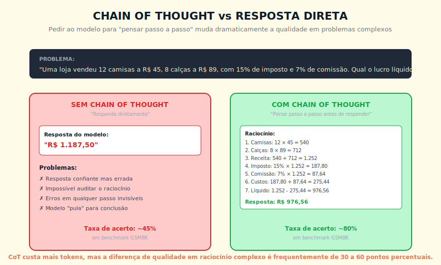
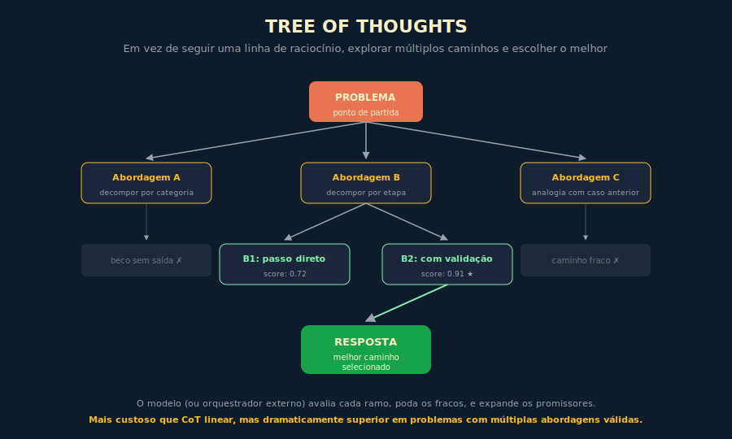

# 10. Chain of Thought e Raciocínio

---

> *"Modelos que respondem rápido erram muito. Modelos que pensam antes de responder erram menos, e essa diferença custa apenas alguns tokens a mais."*

---
## 10.1 — O CONCEITO INTUITIVO

Existe uma característica curiosa dos modelos modernos de linguagem que demorou para ser descoberta, e que mudou profundamente a forma como se trabalha com eles em tarefas que exigem qualquer raciocínio não trivial. Quando você pede ao modelo a resposta direta de um problema complexo, ele frequentemente responde com confiança e erra. Quando você pede ao modelo para "pensar passo a passo antes de dar a resposta final", a taxa de acerto sobe de forma dramática, em muitos benchmarks dobrando ou triplicando a performance no mesmo problema, com o mesmo modelo, sem qualquer outra alteração além dessa instrução simples.

Esse fenômeno foi batizado de Chain of Thought, ou CoT, em um paper de 2022 publicado por pesquisadores da Google, e desde então virou uma das técnicas mais importantes em engenharia de prompt. A descoberta tem implicações que vão além de matemática escolar, que era o domínio em que o paper original demonstrou os ganhos mais visíveis. Praticamente qualquer tarefa que envolva raciocínio multipasso, planejamento, análise sequencial de evidências, comparação entre alternativas com restrições, se beneficia significativamente quando você instrui o modelo a externalizar o raciocínio em vez de pular para a conclusão.

A explicação técnica para por que isso funciona é interessante e merece atenção, porque conecta com o que vimos no Capítulo 2 sobre como modelos realmente operam. Quando o modelo gera token por token, cada novo token recebe como contexto tudo que já foi gerado antes. Se a primeira coisa que o modelo gerou foi diretamente a resposta, ele teve uma única chance, em uma única passada, de chegar ao resultado correto. Se a primeira coisa que o modelo gerou foi o raciocínio passo a passo, cada passo intermediário entra no contexto dos próximos passos, e a resposta final é gerada com a vantagem de ter todos os passos anteriores como apoio. É, em essência, o modelo dando a si mesmo a oportunidade de "pensar em voz alta", e essa externalização melhora a qualidade do resultado de forma mensurável.

---

## 10.2 — ANALOGIA: O CONTADOR QUE MOSTRA O CÁLCULO

Para tornar tangível o que CoT faz, imagine o seguinte arranjo profissional. Você contrata dois contadores para fazer a mesma análise financeira complexa, envolvendo cálculos sequenciais com várias variáveis, alíquotas, deduções e ajustes. O primeiro entrega apenas o número final, dizendo "o lucro líquido é tal, tal valor", sem mostrar como chegou ali. O segundo entrega o número final acompanhado de cada passo intermediário, com cada cálculo justificado, cada decisão de método explicitada.

Os dois podem ter chegado ao mesmo número, mas o trabalho do segundo é qualitativamente superior por três razões que valem destacar. A primeira é que erros ficam visíveis e corrigíveis, porque se houver um deslize em algum passo intermediário, você consegue identificar onde e por que aconteceu, e corrigir cirurgicamente em vez de refazer tudo. A segunda é que o próprio contador, ao escrever cada passo, está se forçando a explicitar suas suposições, e essa explicitação reduz a chance de pular etapas mentalmente e errar por omissão. A terceira é que o trabalho fica auditável, em sentido pleno, com terceiros conseguindo validar a análise sem precisar refazer do zero.

CoT é exatamente esse segundo modo de trabalho aplicado a um LLM. Quando você instrui o modelo a mostrar o cálculo, e não apenas a resposta, você ativa um modo de processamento mais cuidadoso, que reduz erros e produz saída auditável. O custo é alguns tokens a mais na resposta, o que se traduz em fração de centavo. O ganho em qualidade, em qualquer tarefa que exija raciocínio multipasso, é tipicamente desproporcional ao custo adicional.

---

## 10.3 — EXPLICAÇÃO TÉCNICA

### 10.3.1 — As formas de invocar CoT

Existem três maneiras principais de provocar Chain of Thought em modelos modernos, e cada uma tem seu lugar.

A primeira e mais simples é o **zero-shot CoT**, em que você simplesmente adiciona uma instrução genérica como "pense passo a passo antes de responder" ou "raciocine cuidadosamente antes de chegar à conclusão final". Essa instrução, apesar de parecer banal, ativa o comportamento de externalização em modelos modernos, e em muitos casos é tudo que você precisa para colher o benefício. Funciona surpreendentemente bem em modelos frontier modernos, que foram treinados com técnicas que reforçam essa resposta.

A segunda é o **few-shot CoT**, em que você inclui exemplos no prompt mostrando explicitamente o tipo de raciocínio passo a passo que espera. Em vez de exemplos do tipo "pergunta → resposta", você usa exemplos do tipo "pergunta → raciocínio detalhado → resposta". Esse padrão calibra o modelo de forma muito mais precisa, especialmente quando o domínio é específico e exige certo tipo de estrutura de raciocínio que o modelo não adotaria espontaneamente.

A terceira é o uso de **modelos com raciocínio nativo**, classe de modelos que surgiu em 2024 e 2025, em que o raciocínio passo a passo está embutido na própria arquitetura ou no processo de treinamento. OpenAI o1 e o3, Claude com modo de raciocínio estendido, DeepSeek R1, são exemplos dessa classe. Esses modelos internalizam o equivalente a CoT durante a inferência, sem que você precise instruí-los explicitamente, e tipicamente entregam ganhos ainda maiores em tarefas complexas, ao custo de latência e tokens significativamente maiores.

> 📊 **Diagrama 10.1 — CoT versus Resposta Direta**
>
> 
>
> *Em benchmarks de raciocínio matemático, Wei et al. (2022) reportam ganhos de 20 a 60 pontos percentuais. Em tarefas simples, o ganho é marginal ou inexistente.*

### 10.3.2 — Quando CoT ajuda e quando não muda nada

Vale ser preciso sobre onde CoT entrega ganho real e onde é desperdício de tokens, porque a tendência inicial de aplicar a técnica em tudo costuma vir junto com decepção sobre alguns dos resultados.

CoT ajuda significativamente em tarefas com **raciocínio multipasso**, sejam problemas matemáticos não triviais, lógica formal, planejamento sequencial, análises com várias restrições simultâneas, comparações entre alternativas que exigem ponderação. Também ajuda em **tarefas com dependências causais**, em que a resposta depende de seguir uma cadeia de implicações em sequência. E ajuda em **decisões que exigem consideração de trade-offs**, em que avaliar prós e contras antes de concluir produz resposta mais ponderada.

CoT muda pouco em tarefas **simples e diretas**, como classificação de sentimento, tradução curta, extração de dado específico de texto, perguntas factuais bem estabelecidas. Nesses casos, o modelo já sabe a resposta sem precisar elaborar, e forçar CoT só consome tokens adicionais sem ganho mensurável. Também muda pouco em **tarefas criativas livres**, como gerar uma história curta ou escrever um poema, em que não há "resposta certa" que dependa de raciocínio rigoroso.

Existe ainda uma categoria intermediária, em que CoT ajuda parcialmente, que são tarefas em que o modelo já estaria correto na maioria dos casos mas ocasionalmente erra de forma fácil de detectar com CoT. Nesses casos, a decisão de usar ou não CoT vira balanço entre custo de tokens adicionais e custo de erros não detectados em produção.

### 10.3.3 — Técnicas avançadas além de CoT linear

CoT na sua forma básica é linear, com o modelo seguindo uma única sequência de pensamento do início ao fim. Pesquisadores logo perceberam que essa linearidade limita o método em problemas que admitem múltiplas abordagens válidas, e surgiram variantes mais sofisticadas.

A primeira variante é **Self-Consistency**, em que você gera várias respostas com CoT independente, e escolhe a resposta que aparece com mais frequência entre as gerações. Funciona porque erros tendem a ser idiossincráticos e diferentes entre cadeias de raciocínio, enquanto acertos tendem a convergir para a mesma resposta. O custo é gerar várias respostas em paralelo, o ganho é robustez significativa em problemas com múltiplos caminhos.

A segunda é **Tree of Thoughts**, ou ToT, em que o modelo explora explicitamente múltiplas abordagens diferentes em forma de árvore, avalia cada ramo, e expande os ramos promissores enquanto poda os fracos. É mais custosa que CoT linear, mas dramaticamente superior em problemas combinatórios, jogos, planejamento complexo. Pode ser implementada com o próprio modelo gerando os ramos e avaliando, ou com orquestração externa controlando a busca.

> 📊 **Diagrama 10.2 — Tree of Thoughts**
>
> 
>
> *Explorar múltiplos caminhos em vez de seguir um único, e escolher o melhor com base em avaliação.*

A terceira é **Self-Critique** ou **Reflection**, em que depois de gerar uma resposta inicial, o modelo é instruído a criticar a própria resposta, identificar possíveis falhas, e produzir uma versão corrigida. Pode ser implementado em uma única chamada com instruções estruturadas, ou em múltiplas chamadas separadas. Funciona especialmente bem em tarefas como revisão de código, análise de textos, validação de planos.

A quarta é **Plan-and-Solve**, em que você instrui o modelo primeiro a produzir um plano de como vai abordar o problema, e só depois a executar o plano passo a passo. Separa a fase de planejamento da fase de execução, e em problemas complexos isso reduz a chance de o modelo se perder no meio do raciocínio.

A quinta, mais recente, é o uso de **reasoning models** mencionados antes, em que o modelo executa internamente um processo de raciocínio prolongado, com geração de "thinking tokens" que ficam ocultos do usuário, antes de produzir a resposta final. Esses modelos podem usar centenas de milhares de tokens internos para pensar sobre um único problema, e em problemas extremamente difíceis entregam performance qualitativamente diferente.

Como escolher entre as variantes:

| Variante | Use quando | Custo relativo |
|---|---|---|
| **CoT linear** | Tarefa com raciocínio sequencial claro, uma abordagem correta | Baixo |
| **Self-Consistency** | Múltiplas abordagens válidas, problema com risco de erro por caminho único | Médio (3x a 5x) |
| **Tree of Thoughts** | Problema combinatório ou que exige busca — jogos, planejamento complexo, otimização | Alto |
| **Self-Critique** | Qualidade da primeira geração está incerta; revisão de código, textos, planos | Baixo a médio |
| **Plan-and-Solve** | Problema com fases distintas em que planejamento e execução são separáveis | Baixo |
| **Reasoning models** | Tarefa extremamente complexa e latência não é crítica | Muito alto |

A regra prática: comece com CoT linear. Suba a sofisticação apenas quando a qualidade da cadeia linear não for suficiente em amostra representativa.

---

## 10.4 — EXEMPLO MEMORÁVEL: O DIAGNÓSTICO QUE FALHAVA EM SILÊNCIO

> Cenário ilustrativo, composto a partir de casos recorrentes.

Uma empresa brasileira de telemedicina, operando em escala nacional, usava IA para apoiar médicos em diagnóstico diferencial, com casos clínicos sendo analisados por Claude e o modelo sugerindo hipóteses diagnósticas a partir dos sintomas relatados. O sistema funcionava razoavelmente bem em casos típicos, com taxa de concordância com médicos sêniors de cerca de 78%. O problema era que, em casos atípicos ou complexos, o sistema às vezes pulava direto para um diagnóstico óbvio sem considerar alternativas relevantes, e em situações específicas, a primeira hipótese errada virava âncora que o médico atendente acabava seguindo, o que gerou alguns near-misses preocupantes em revisão posterior.

A equipe técnica, ao investigar, descobriu que o prompt original pedia simplesmente "qual o diagnóstico mais provável dados estes sintomas?". O modelo respondia diretamente com a hipótese mais alta, e raramente articulava por que outras hipóteses tinham sido descartadas, em parte porque a pergunta não pedia esse desdobramento. Decidiram reescrever o prompt aplicando técnicas estruturadas de CoT, e mediram o efeito em uma amostra controlada de casos retrospectivos.

O novo prompt instruía o modelo a, primeiro, listar todas as hipóteses diagnósticas plausíveis dado o quadro, sem ainda comprometer com uma resposta. Segundo, para cada hipótese, listar quais sintomas reforçam e quais sintomas conflitam. Terceiro, identificar quais informações adicionais ajudariam a discriminar entre as hipóteses. Quarto, propor a hipótese mais provável com nível de confiança explícito. Quinto, alertar especificamente para hipóteses menos prováveis mas com consequências graves se ignoradas.

O resultado foi notável em três dimensões. A concordância com médicos sêniors subiu de 78% para 91% no conjunto avaliado, principalmente porque o modelo passou a sugerir investigação adicional em casos antes apressados. A taxa de near-misses identificados em revisão caiu pela metade, porque hipóteses raras com gravidade alta passaram a ser sinalizadas explicitamente. E talvez o mais valioso, a confiança dos médicos atendentes na ferramenta cresceu, porque agora eles conseguiam ver o raciocínio do modelo e discordar ou complementar de forma fundamentada, em vez de aceitar ou rejeitar um diagnóstico opaco.

A lição que essa equipe aprendeu, e que vale generalizar, é dura mas reveladora. **Em domínios com consequências sérias, fazer o modelo "pensar em voz alta" não é só técnica de qualidade, é prática de segurança.** Quando o raciocínio fica visível, ele fica auditável. Quando fica auditável, erros viram aprendizado em vez de incidente. Quando o raciocínio é opaco, erros viram surpresa, e em domínios sensíveis surpresa é o que você quer evitar a qualquer custo.

> 🎯 **PARA EXECUTIVOS**
> Em qualquer aplicação de IA em domínio crítico, exigir raciocínio explícito como parte do design da solução não é luxo, é controle. O custo em tokens é marginal, o benefício em auditabilidade é estrutural. Equipes que ignoram isso constroem aplicações que funcionam bem em demonstração e falham silenciosamente em produção.

---

## 10.5 — LIMITAÇÕES E ARMADILHAS DE CoT

CoT é uma técnica poderosa, mas como toda técnica tem limites que vale conhecer com honestidade antes de adotá-la indiscriminadamente.

A primeira limitação é que **raciocínio articulado não é garantia de raciocínio correto**. O modelo pode produzir uma cadeia de passos que parece sólida mas contém erro sutil em algum lugar, especialmente em problemas com armadilhas conhecidas. CoT melhora a média, mas não elimina erros, e em domínios críticos validação externa continua sendo necessária.

A segunda é o **viés de convergência**. Quando o modelo articula um caminho de raciocínio, ele tende a fortalecer essa direção nos passos seguintes, mesmo quando uma reavaliação produziria conclusão diferente. Por isso técnicas como Self-Consistency, em que múltiplas cadeias independentes são comparadas, agregam valor adicional sobre CoT simples.

A terceira é o **custo em tokens e latência**. CoT triplica ou quadruplica o tamanho típico da resposta, com impacto em custo e em tempo de resposta. Em aplicações com SLA apertado — atendimento ao cliente em tempo real, assistentes de voz, interfaces que exigem resposta em menos de dois a três segundos — CoT pode ser inviável mesmo onde entregaria ganho de qualidade. Para esses casos, reasoning models nativos costumam ser mais eficientes que CoT explícito, pois otimizam o raciocínio internamente sem multiplicar o output visível ao usuário. Se latência é crítica, teste CoT apenas nos fluxos onde a tarefa é claramente complexa e o tempo de resposta pode ser maior. Aplicar CoT seletivamente, apenas onde o ganho de qualidade compensa o custo e a latência, é parte da disciplina madura.

A quarta é a **falsa sensação de explicabilidade**. CoT produz uma narrativa do raciocínio, mas essa narrativa não é necessariamente fiel ao processo interno do modelo. Pesquisas recentes mostram que modelos às vezes produzem raciocínios pós-hoc que justificam uma conclusão à qual chegaram por outros caminhos. CoT melhora a interface com humanos, mas não deve ser confundida com transparência total sobre a "mente" do modelo.

A quinta é a **dependência do tamanho do modelo**. CoT funciona muito melhor em modelos grandes (centenas de bilhões de parâmetros) que em modelos pequenos. Modelos abaixo de certo limiar de capacidade não conseguem manter coerência ao longo de cadeias longas, e CoT acaba degradando em vez de melhorar. Saber se seu modelo é grande o suficiente para CoT robusto é parte da decisão de arquitetura.

---

## 10.6 — CONEXÕES COM OUTROS CAPÍTULOS
- **Como modelos geram texto token por token**: Capítulo 2
- **Engenharia de prompt como base**: Capítulo 9
- **Context Engineering, evolução natural**: Capítulo 11
- **Agentes que usam CoT para planejar**: Capítulo 12
- **Modelos com raciocínio nativo**: Capítulo 14B
- **Modo de raciocínio estendido**: Capítulo 14B
- **Segurança e auditabilidade**: Capítulo 19

---

## 10.7 — RESUMO EXECUTIVO

| Conceito | Síntese |
|----------|---------|
| **Chain of Thought** | Instruir o modelo a externalizar raciocínio passo a passo antes da resposta |
| **Zero-shot CoT** | Adicionar instrução genérica como "pense passo a passo" |
| **Few-shot CoT** | Incluir exemplos com raciocínio explícito como template |
| **Reasoning models** | Modelos com raciocínio internalizado por arquitetura ou treino |
| **Self-Consistency** | Gerar múltiplas cadeias e escolher resposta mais frequente |
| **Tree of Thoughts** | Explorar múltiplas abordagens em árvore com avaliação por ramo |
| **Self-Critique / Reflection** | Modelo critica e refina a própria resposta inicial |
| **Plan-and-Solve** | Separar fase de planejamento da fase de execução |
| **Limitações** | Não garante correção, viés de convergência, custo em tokens, dependência de tamanho de modelo |

---

## 10.8 — CHECKLIST DO CAPÍTULO

- [ ] Explicar por que CoT melhora qualidade em raciocínio multipasso, do ponto de vista da geração token a token
- [ ] Distinguir zero-shot CoT de few-shot CoT, com exemplo de cada
- [ ] Identificar em quais tipos de tarefa CoT entrega ganho real e em quais é desperdício
- [ ] Listar pelo menos quatro variantes avançadas além de CoT linear
- [ ] Reconhecer as cinco limitações principais de CoT
- [ ] Defender, em uma reunião, o uso de CoT como prática de segurança em domínios críticos

---

## 10.9 — PERGUNTAS DE REVISÃO

1. Por que CoT melhora qualidade em problemas multipasso, mesmo sem mudar o modelo?
2. Em que situação Self-Consistency agrega valor sobre CoT simples?
3. Por que CoT pode produzir raciocínio articulado mas conclusão errada?
4. Quando você usaria Tree of Thoughts em vez de CoT linear?
5. Por que CoT funciona muito melhor em modelos grandes do que em pequenos?

---

## 10.10 — EXERCÍCIOS PRÁTICOS

### Exercício 1 — Teste comparativo
Pegue uma tarefa real da sua organização que envolva raciocínio (cálculo, análise comparativa, decisão com restrições). Faça duas versões do prompt, uma sem CoT e outra com CoT. Compare em vinte casos. Documente a diferença em taxa de acerto.

### Exercício 2 — Self-critique aplicado
Pegue uma resposta gerada por um modelo a uma análise sua. Em uma segunda chamada, instrua o modelo a criticar a própria resposta apontando falhas. Compare a resposta refinada com a original.

### Exercício 3 — Plan-and-solve em projeto
Para uma tarefa complexa em que você costuma pedir tudo de uma vez, divida em duas chamadas, uma para planejamento e outra para execução. Compare a qualidade final.

### Exercício 4 — Identificação de casos
Liste cinco tarefas em que sua organização usa IA, e classifique cada uma quanto ao ganho esperado de CoT, sendo eles alto, médio ou baixo. Justifique a classificação para cada.

---

## 10.11 — PROJETO DO CAPÍTULO

**Implemente CoT estruturado em uma aplicação real.**

Escolha um caso de uso em sua organização que envolva raciocínio multipasso ou consequência relevante de erro. Aplique CoT estruturado, com prompt que pede explicitamente ao modelo para articular o raciocínio em fases definidas. Para domínios críticos, considere também aplicar Self-Critique como segunda chamada. Meça três métricas ao longo de pelo menos duas semanas de operação: taxa de acerto, tempo de revisão por usuário humano, taxa de concordância com sêniors. Documente os resultados. Esse projeto é provavelmente o que vai te convencer, mais que qualquer leitura, de que CoT é técnica subutilizada na maioria das organizações.

---

## 10.12 — REFERÊNCIAS PRINCIPAIS

📚 **Papers fundamentais**

- Wei et al. *"Chain-of-Thought Prompting Elicits Reasoning in Large Language Models"*. 2022. → arxiv.org/abs/2201.11903
- Kojima et al. *"Large Language Models are Zero-Shot Reasoners"*. 2022. → arxiv.org/abs/2205.11916
- Wang et al. *"Self-Consistency Improves Chain of Thought Reasoning"*. 2022.
- Yao et al. *"Tree of Thoughts: Deliberate Problem Solving with Large Language Models"*. 2023.
- Shinn et al. *"Reflexion: Language Agents with Verbal Reinforcement Learning"*. 2023.

📚 **Recursos**

- [Anthropic — Let Claude think](https://docs.claude.com/en/docs/build-with-claude/prompt-engineering/chain-of-thought)
- [Prompt Engineering Guide — CoT](https://www.promptingguide.ai/techniques/cot)

---

## 10.13 — Autoavaliação

| # | Critério | Você consegue? |
|---|----------|----------------|
| 1 | **Clareza** — Explicar o que CoT faz para alguém leigo, em 90 segundos, usando analogia | ☐ |
| 2 | **Profundidade** — Defender, em discussão técnica, por que CoT melhora qualidade e quais suas limitações reais | ☐ |
| 3 | **Aplicação** — Identificar, na sua organização, três aplicações onde CoT estruturado renderia ganho significativo | ☐ |
| 4 | **Conexão** — Articular como CoT se conecta com engenharia de prompt (Cap 9), context engineering (Cap 11), agentes (Cap 12) | ☐ |
| 5 | **Curiosidade** — Está com vontade de aprender as técnicas avançadas de orquestração de contexto para sistemas maduros | ☐ |

---

> *"Modelos que pensam antes de responder produzem trabalho auditável. Em domínios sérios, auditabilidade não é luxo, é controle."*
