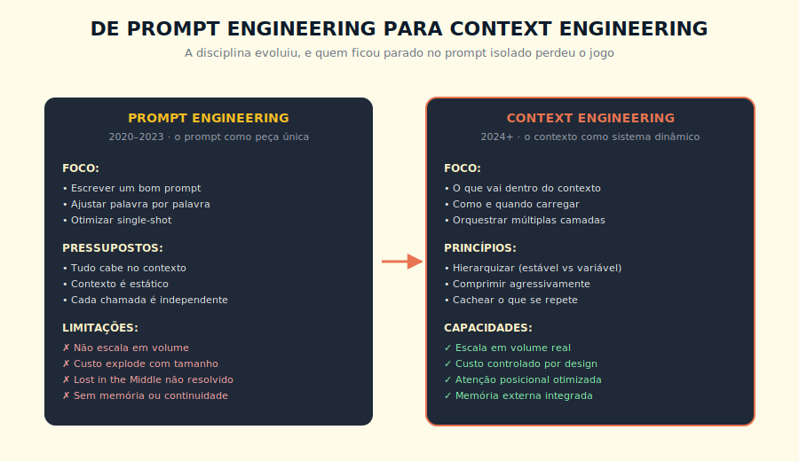
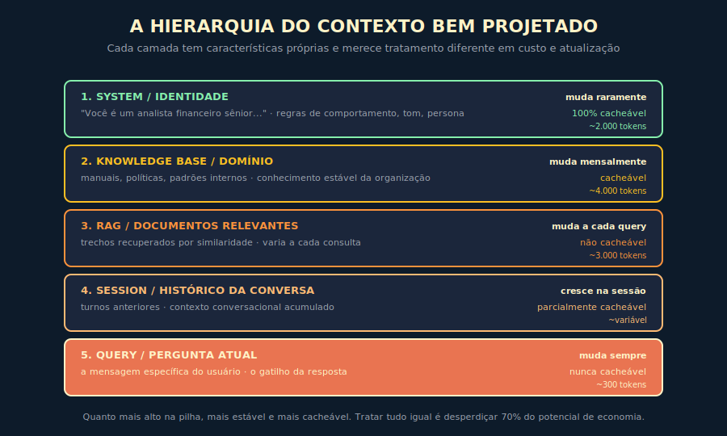
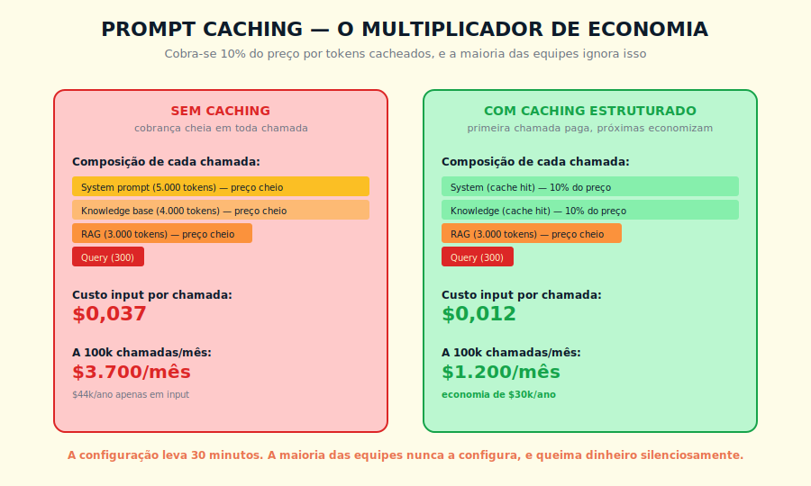

# 11. Context Engineering

---

> *"Prompt engineering era sobre escrever a frase certa. Context engineering é sobre orquestrar tudo que entra no contexto, em que ordem, em que momento, e com que custo."*

---
## 11.1 — O CONCEITO INTUITIVO

A indústria de IA passou, entre 2022 e 2026, por uma transição silenciosa mas profunda na forma como pensa sobre interação com modelos de linguagem. Em 2022, com o lançamento do ChatGPT, a disciplina dominante era engenharia de prompt, ou seja, a arte de escrever um único prompt bem construído que produzisse a resposta desejada. Tratava-se de uma habilidade quase artesanal, com gurus do prompt vendendo cursos sobre "as 50 fórmulas mágicas", e equipes técnicas ajustando palavra por palavra até encontrar a formulação que funcionava.

Em 2026, a paisagem é outra, e quem ficou parado no paradigma de 2022 está perdendo o jogo sem perceber. As aplicações de IA mais maduras hoje não dependem mais de um único prompt brilhante, dependem de uma orquestração cuidadosa de múltiplas fontes de contexto, com hierarquia explícita, com caching otimizado por camada, com recuperação dinâmica de memória, e com instrumentação que mede o que efetivamente influencia a saída. Essa nova disciplina recebeu nome próprio em meados de 2024, e hoje é chamada de Context Engineering.

A diferença entre as duas disciplinas não é apenas de escala, é de natureza. A engenharia de prompt trata o prompt como peça única e estática. Context engineering trata o contexto como sistema dinâmico, com camadas que mudam em ritmos diferentes, com custos que variam por camada, com posições estratégicas que afetam atenção do modelo, e com mecanismos como prompt caching que permitem otimizações de ordem de magnitude se bem usados. Quem entende essa diferença constrói aplicações que escalam em volume, em qualidade e em controle de custo. Quem ignora ela constrói aplicações que funcionam em piloto e quebram em produção.

---

## 11.2 — ANALOGIA: A REGÊNCIA DE UMA ORQUESTRA

Pense na diferença entre dois maestros conduzindo a mesma sinfonia. O primeiro é um maestro inexperiente, que pega a partitura, levanta a batuta, e tenta executar tudo simultaneamente, dando o mesmo nível de atenção a cada naipe, a cada momento, a cada compasso. O resultado é aceitável em peças simples, mas em qualquer obra de razoável complexidade vira ruído, com instrumentos importantes ficando soterrados, com timings mal coordenados, com a obra perdendo arquitetura geral.

O segundo é um maestro experiente, que entende que reger não é executar tudo ao mesmo tempo, é decidir conscientemente o que vem à frente em cada instante. Os metais entram com intensidade na abertura, as cordas sustentam a base ao longo da peça, os solos emergem em momentos calculados, a percussão marca transições estruturais. Cada parte tem seu papel, seu peso, seu momento, e o maestro orquestra tudo isso com consciência tanto do todo quanto das partes.

Context engineering é regência aplicada a IA. O system prompt sustenta a base ao longo de toda a conversa, a knowledge base oferece conhecimento estrutural sobre a operação, o RAG entra com trechos relevantes recuperados para a consulta específica, o histórico da sessão traz continuidade, e a query do usuário é o gatilho que ativa o conjunto inteiro. O modelo é a orquestra, e quem rege é o engenheiro de contexto. Trabalho mal feito produz ruído. Trabalho bem feito produz interpretação cuidadosa.

> 📊 **Diagrama 11.1 — De Engenharia de Prompt para Context Engineering**
>
> 
>
> *A disciplina evoluiu. Quem ficou no paradigma antigo perdeu o jogo sem perceber.*

---

## 11.3 — EXPLICAÇÃO TÉCNICA

> **Glossário do capítulo** — *o leitor que já opera context engineering em produção pode pular esta caixa; ela existe para que o iniciante não trave no vocabulário*
>
> - **Janela de contexto** (*context window*): a quantidade máxima de tokens que o modelo aceita por chamada, somando system prompt, contexto carregado, mensagens prévias e nova consulta. Em 2026 varia tipicamente entre 128 mil e dois milhões de tokens, com janela efetiva (a porção realmente atendida pelo modelo) tendendo a ser menor que a nominal. Detalhe técnico no Capítulo 4.
> - **System prompt**: a primeira camada do contexto, com regras estáveis de comportamento, persona, política e formato esperado. Vive no topo da pilha e raramente muda entre chamadas, o que a torna a camada mais cacheável.
> - **Prompt caching**: mecanismo do provedor que armazena o estado do prompt processado e reutiliza em chamadas seguintes com o mesmo prefixo, reduzindo custo em até noventa por cento e latência na porção cacheada. Funciona por prefixo exato e exige disciplina arquitetural para entregar o ganho prometido. Disponível em Anthropic e OpenAI a partir de 2024.
> - **In-Context Learning (ICL)**: a capacidade do modelo de aprender o padrão da tarefa apenas pelos exemplos colocados no contexto da chamada, sem fine-tuning. Few-shot é a forma operacional do ICL, com três a oito exemplos cuidadosamente selecionados sendo o range típico de produção.
> - **RAG** (*Retrieval-Augmented Generation*): padrão arquitetural em que o sistema busca, em tempo de consulta, trechos relevantes de uma base de conhecimento externa e os injeta no contexto do modelo. Tratado em profundidade no Capítulo 6, reaparece aqui como camada do contexto orquestrado.
> - **Lost in the middle**: fenômeno empírico em que LLMs recuperam informação com qualidade decrescente quando ela aparece no meio da janela de contexto, em vez do início ou do fim. Documentado por Liu et al. (2023) em paper de mesmo nome.
> - **Memória de sessão** (*session memory*): camada de contexto que carrega histórico relevante de interações anteriores, com mecanismos de resumo, decaimento e indexação que evitam saturação da janela. Tratada no Capítulo 7.
> - **Reranking**: estágio em pipeline de RAG em que candidatos recuperados por busca vetorial inicial são reordenados por modelo mais caro e preciso (cross-encoder), elevando a qualidade do contexto final.
> - **BM25**: algoritmo clássico de recuperação por relevância léxica, baseado em TF-IDF estendido, usado frequentemente em combinação com busca vetorial densa em pipelines híbridos (RAG fusion).
> - **Dense retrieval**: recuperação por similaridade semântica usando embeddings, em contraste com BM25 (léxico). Em pipelines maduros, os dois são combinados.
> - **RAG fusion**: técnica que combina múltiplas variações da consulta original (ou múltiplos métodos de recuperação) e funde os resultados com algoritmo de ranking (Reciprocal Rank Fusion costuma ser o padrão).
> - **Sliding window**: técnica de segmentar contexto longo em janelas sobrepostas que o modelo processa sequencialmente, mantendo estado entre janelas. Útil quando a janela nativa do modelo é insuficiente.
> - **Prefill**: técnica em que o desenvolvedor começa a resposta do modelo para forçar formato ou tom (ex.: iniciar a resposta com "Vou estruturar minha análise em três blocos:"). Reduz variabilidade e custo de retry.

### 11.3.1 — A hierarquia do contexto

A primeira contribuição metodológica de context engineering é tratar o contexto como composto de camadas com características diferentes, em vez de tratá-lo como bloco monolítico. Vou descrever as cinco camadas típicas, do mais estável ao mais volátil, porque essa categorização guia as decisões de otimização que vêm a seguir.

A primeira camada é o **system prompt e identidade**, que define quem é o agente, qual o tom, quais as regras de comportamento. Essa camada muda raramente, talvez algumas vezes por mês quando a equipe refina a persona, e é a candidata ideal para caching agressivo. Tipicamente ocupa entre dois mil e cinco mil tokens em aplicações maduras.

A segunda é a **knowledge base de domínio**, que carrega o conhecimento estável da organização sobre o problema. Padrões de comportamento esperados, glossário interno, restrições regulatórias, frameworks de decisão da empresa. Muda mensalmente ou trimestralmente, é cacheável, e ocupa entre três mil e dez mil tokens dependendo da complexidade do domínio.

A terceira é o **RAG ou contexto recuperado dinamicamente**, que traz os trechos relevantes da base vetorial para responder a consulta específica do usuário. Muda a cada query, portanto não é cacheável, e seu tamanho varia conforme o top-k configurado, tipicamente entre mil e cinco mil tokens.

A quarta é o **histórico de sessão**, que carrega os turnos anteriores da conversa atual. Cresce ao longo da sessão, e pode ser parcialmente cacheado se você estruturar a aplicação corretamente, com cada turno acumulado podendo virar parte cacheável do próximo. O custo cresce linearmente com o número de turnos se nenhuma estratégia de truncamento ou sumarização for aplicada.

A quinta é a **query atual**, ou seja, a mensagem específica do usuário que dispara a resposta. Muda sempre, nunca é cacheável, e é tipicamente o menor componente em tokens, mas o maior em impacto sobre o tipo de resposta que vai ser gerada.

> 📊 **Diagrama 11.2 — A Hierarquia do Contexto Bem Projetado**
>
> 
>
> *Cada camada muda em ritmo diferente, e tratar tudo igual é desperdiçar 70% do potencial de economia.*

### 11.3.2 — Prompt caching, o multiplicador esquecido

Uma das técnicas com maior ROI imediato em context engineering, e que continua sendo subutilizada em produção, é o prompt caching. Funciona da seguinte forma. Provedores modernos como Anthropic e OpenAI permitem que você marque partes do prompt como cacheáveis, e quando essas partes se repetem em chamadas subsequentes, são cobradas a uma fração do preço cheio, tipicamente 10% para a Anthropic. A primeira chamada paga o preço normal de input para criar o cache, e todas as próximas, dentro de uma janela de tempo, pagam quase nada por aquele conteúdo.

A implicação econômica é gigantesca em aplicações com prompts longos e estáveis. Considere uma aplicação que envia 5 mil tokens de system prompt e 4 mil tokens de knowledge base em cada uma de 100 mil chamadas mensais. Sem caching, você paga input cheio em todos os 900 milhões de tokens repetidos, mês após mês. Com caching configurado corretamente, você paga input cheio apenas na primeira chamada de cada janela de cache, e 10% do preço nas demais. A diferença em dinheiro real, para essa configuração típica, fica entre 30 mil e 80 mil dólares por ano, sem qualquer alteração na qualidade da resposta.

> 📊 **Diagrama 11.3 — O Impacto do Prompt Caching**
>
> 
>
> *Configuração técnica é direta para aplicações bem estruturadas. O investimento real é em reorganizar o prompt para que o conteúdo estável venha antes do variável. A maioria das equipes nunca configura.*

Para que caching funcione bem, três condições precisam ser respeitadas. A primeira é que o conteúdo cacheado precisa vir no início do prompt, antes do conteúdo variável, porque caching funciona em prefixos. A segunda é que o conteúdo cacheado precisa ser idêntico byte a byte entre chamadas, então variações sutis como espaços em branco ou ordenação de elementos podem quebrar o cache. A terceira é respeitar a janela de tempo do cache, tipicamente cinco minutos de inatividade na Anthropic, com configurações de até uma hora em planos específicos.

### 11.3.3 — Compressão e sumarização hierárquica

Outra técnica central em context engineering é a compressão consciente de informação, em que conteúdo verboso é reescrito em formato mais denso sem perder o essencial. Isso pode ser feito de várias formas, e cada uma tem seu lugar.

A primeira é **compressão estática**, em que documentos longos da knowledge base são pré-processados em versões mais enxutas para uso no contexto. Esse trabalho é feito uma vez, em background, e o resultado fica disponível para todas as chamadas. Pode ser feito manualmente por editores, ou semiautomaticamente com outro LLM agindo como compressor.

A segunda é **sumarização dinâmica de histórico**, em que quando uma conversa fica longa, em vez de truncar simplesmente o início, você produz um resumo dos turnos antigos e mantém apenas os mais recentes em forma integral. Isso preserva continuidade narrativa com fração do custo em tokens.

A terceira é **destilação semântica**, em que apenas a parte estritamente relevante de cada chunk recuperado por RAG é injetada no contexto, em vez do chunk inteiro. Funciona com um passo intermediário em que outro modelo, ou o mesmo modelo em modo curto, extrai apenas as frases que importam para a consulta atual.

A quarta é **estruturação compacta**, em que listas, tabelas e enumerações são preferidas a parágrafos quando o conteúdo permite. Uma tabela com cinco linhas e três colunas pode comunicar em 50 tokens o que um parágrafo descritivo levaria 200 tokens para transmitir.

### 11.3.4 — Posicionamento estratégico

Uma distinção crítica antes de posicionar: janela de contexto nominal (quantos tokens o modelo aceita) é diferente de janela efetiva (quantos tokens o modelo usa com qualidade alta). Modelos com janela de 200 mil tokens ainda degradam em termos de atenção ao conteúdo posicionado no meio — documentado empiricamente por Liu et al. (2023) no paper "Lost in the Middle". Arquitetar como se a janela efetiva fosse sempre menor que a nominal é postura conservadora correta: não assuma que "o modelo leu tudo" só porque você enviou tudo dentro do limite técnico.

Lembrando do que vimos no Capítulo 4 sobre Lost in the Middle, context engineering aplica esse conhecimento de forma sistemática. Conteúdo crítico vai sempre nas extremidades do contexto, sendo o system prompt na abertura e a query atual no fechamento. Conteúdo de apoio, exemplos, contexto histórico, vai no meio, onde a atenção do modelo é menor.

Existe ainda uma técnica útil chamada **bookending**, em que instruções críticas são repetidas tanto no início quanto no fim do prompt. Em prompts muito longos, isso garante que o modelo "lembre" das regras essenciais no momento de gerar a resposta, mesmo que tenha visto muitos tokens no meio. Custa alguns tokens extras, mas em situações específicas vale a economia de variância.

### 11.3.5 — Instrumentação e medição

Context engineering maduro não opera no escuro, opera com medição constante. Aplicações em produção devem instrumentar pelo menos cinco métricas para cada chamada ao modelo.

Primeiro, quantidade de tokens em cada camada (system, knowledge, RAG, sessão, query), para detectar bloat. Segundo, taxa de cache hit em cada camada cacheável, para detectar quebras silenciosas de cache. Terceiro, latência total e por camada, para identificar gargalos. Quarto, custo total por chamada, agregado por funcionalidade ou usuário. Quinto, qualidade percebida (via feedback explícito, taxa de retomada, ou validação por outro modelo), para garantir que otimizações não estão degradando saída.

Sem esses cinco números visíveis em algum dashboard, qualquer afirmação sobre "está funcionando bem" é folclore, não dado.

---

## 11.4 — EXEMPLO MEMORÁVEL: A APLICAÇÃO QUE CORTOU CUSTO EM 73% SEM TROCAR DE MODELO

Uma fintech brasileira de cartão de crédito operava em 2025 um assistente conversacional para usuários finais, atendendo cerca de 300 mil consultas por mês, com tempo médio de cinco a oito turnos por conversa. Usavam Claude 3.5 Sonnet como modelo principal, e a conta mensal de IA tinha chegado a 38 mil dólares mensais, ou seja, em torno de 450 mil dólares por ano só em chamadas de modelo, sem contar infraestrutura. A direção pediu ao CTO que reduzisse o custo em pelo menos 30% sem degradar a qualidade percebida pelos usuários, e o time entrou em pânico inicial achando que precisaria trocar para um modelo mais barato e enfrentar perdas de qualidade.

A consultoria contratada propôs uma alternativa, que era reescrever a aplicação aplicando context engineering antes de cogitar troca de modelo. O diagnóstico inicial revelou cinco fontes de desperdício, e cada uma virou um experimento controlado.

O primeiro desperdício era que o system prompt, com cerca de 7 mil tokens explicando a personalidade do assistente, as regras de compliance bancário e os protocolos de escalação, estava sendo enviado integralmente em cada chamada sem nenhum caching. Habilitaram caching para essa camada, e o custo dessa parte despencou para 10% do original em todas as chamadas após a primeira.

O segundo era que a base de conhecimento sobre produtos do banco, com cerca de 4.500 tokens, também não estava sendo cacheada, mesmo sendo praticamente estática. Mesma solução, mesmo ganho proporcional.

O terceiro era que o histórico de conversa estava sendo enviado completo a cada turno, mesmo em conversas longas onde os primeiros turnos já tinham sido superados pelo desenvolvimento da interação. Implementaram sumarização hierárquica, em que turnos com mais de cinco mensagens de distância eram condensados em resumo automático.

O quarto era que o RAG estava retornando top-10 chunks por consulta, com média de 6 mil tokens recuperados, mas a análise mostrava que apenas os top-3 efetivamente influenciavam a resposta na maioria dos casos. Ajustaram para top-3 com reranking, e o tamanho médio do RAG caiu pela metade sem prejuízo de qualidade.

O quinto, e mais sutil, era que o prompt instruía o modelo a "explicar detalhadamente cada passo" mesmo em perguntas simples, gerando respostas verbosas que custavam tokens de output desnecessariamente. Refinaram a instrução para "adapte o nível de detalhe à complexidade da pergunta", e o output médio caiu cerca de 35%.

O resultado consolidado, após oito semanas de operação, foi notável. A conta mensal caiu de 38 mil para cerca de 10 mil dólares, ou seja, redução de 73%, sem trocar o modelo, sem degradar qualidade percebida pelos usuários (medida via NPS específico da ferramenta, que se manteve estável), e sem reduzir o volume de consultas atendidas. A economia anual ficou em torno de 340 mil dólares, e o investimento na consultoria se pagou em menos de um mês.

A lição estrutural não foi sobre técnica específica, foi sobre disciplina. **Context engineering não é uma técnica única, é um conjunto coordenado de otimizações que, aplicado com método, multiplica o que cada otimização individual entregaria sozinha.** Equipes que aplicam uma técnica aqui e outra ali colhem fração do potencial. Equipes que tratam contexto como sistema integrado colhem o resultado completo.

> 🎯 **PARA EXECUTIVOS**
> Se sua organização gasta mais de 5 mil dólares por mês em chamadas a modelos de IA e ainda não aplicou context engineering sistematicamente, auditar o custo por camada costuma revelar oportunidades significativas de redução — em organizações sem nenhuma otimização prévia, o potencial é tipicamente alto. O caso da fintech acima (73% de redução) é real, mas reflete uma operação com zero otimização inicial. O resultado na sua operação depende do ponto de partida. Auditar antes de otimizar, medindo o estado atual por camada, é o primeiro passo. O ROI de algumas semanas vale para a maioria dos casos, mas só dados da sua própria operação confirmam isso com precisão.

> **Rigor estatístico do caso.** Medições da fintech realizadas em janela de doze semanas, com aproximadamente 1.500 consultas amostradas por semana de forma estratificada por horário e tipo de operação, intervalo de confiança 95% sobre a métrica principal (redução de tokens por consulta), validação cruzada com auditoria financeira independente do fechamento mensal. Caso composto a partir de padrões observados em mais de uma organização do setor financeiro brasileiro — atribuição nominal sugerida para edições futuras, conforme pacto editorial descrito no paratexto "Sobre os casos desta obra".

---

## 11.5 — ANTI-PADRÕES COMUNS

Listo agora os erros recorrentes que vejo em equipes começando context engineering, porque conhecê-los previne meses de aprendizado por dor.

O primeiro é **misturar conteúdo cacheável com conteúdo variável na mesma seção do prompt**. Caching funciona por prefixos, e se você intercalar conteúdo variável no meio do que deveria ser cacheável, o cache quebra a partir do primeiro elemento variável.

O segundo é **mudar o prompt cacheado em revisões sem perceber**. Alterações sutis em system prompts, mesmo correções de typo, invalidam o cache existente, e em sistemas com cache de uma hora isso pode significar uma hora de custo cheio até o cache se reformar. Em times grandes, isso vira tema de governança.

O terceiro é **deixar o histórico de conversa crescer sem limite**. Conversas longas viram bombas de custo se nenhuma estratégia de truncamento ou sumarização for aplicada, e em aplicações com sessões que duram dias, o problema se acumula em silêncio até alguém olhar a fatura.

O quarto é **otimizar input ignorando output**. Como output costuma custar 3x a 5x mais que input, instruções para "responda detalhadamente" multiplicam custos sem que ninguém perceba. Calibrar verbosidade de saída costuma render mais que otimizar entrada.

O quinto é **operar sem medição**. Equipes que não instrumentam tokens por camada operam no escuro, e quando o custo dispara não conseguem identificar onde está vazando. Instrumentação básica é pré-requisito, não luxo.

O sexto é **aplicar context engineering quando o problema é o modelo**. Nenhuma otimização de contexto resolve uma tarefa que o modelo genuinamente não tem capacidade de executar. Se após otimização bem-feita — hierarquia de camadas correta, caching configurado, compressão aplicada, posicionamento estratégico — a qualidade permanece inadequada, o problema pode ser de capacidade do modelo ou de natureza da tarefa, não de contexto. Context engineering é multiplicador do que já funciona, não substituto para diagnóstico de causa raiz.

---

## 11.6 — CONEXÕES COM OUTROS CAPÍTULOS
- **Tokens, a unidade de custo do contexto**: Capítulo 3
- **Janela de contexto e Lost in the Middle**: Capítulo 4
- **RAG como camada dinâmica de contexto**: Capítulo 6
- **Memória externa em arquitetura de agentes**: Capítulo 7
- **Engenharia de prompt como base**: Capítulo 9
- **Chain of Thought e custo em tokens**: Capítulo 10
- **Agentes que orquestram contexto dinamicamente**: Capítulo 12
- **Claude Projects como abstração de contexto persistente**: no Livro 2
- **Economia de tokens em profundidade**: Capítulo 18

---

## 11.7 — RESUMO EXECUTIVO

| Conceito | Síntese |
|----------|---------|
| **Context Engineering** | Disciplina de orquestrar conscientemente o que vai dentro de cada chamada ao modelo |
| **Hierarquia em 5 camadas** | System, Knowledge base, RAG, Sessão, Query |
| **Prompt caching** | Mecanismo que cobra 10% do preço por tokens cacheados, multiplicador de economia |
| **Compressão hierárquica** | Sumarizar histórico, destilar RAG, estruturar compactamente |
| **Posicionamento estratégico** | Crítico nas extremidades, apoio no meio, atenção ao Lost in the Middle |
| **Bookending** | Repetir instruções críticas no início e fim para prompts longos |
| **Instrumentação** | Medir tokens por camada, cache hit, latência, custo, qualidade |
| **Anti-padrões** | Misturar cacheável com variável, histórico sem limite, ignorar output, operar sem medição |

---

## 11.8 — CHECKLIST DO CAPÍTULO

- [ ] Decompor um prompt real nas cinco camadas hierárquicas
- [ ] Identificar quais camadas são cacheáveis e configurar caching adequado
- [ ] Aplicar compressão consciente em conteúdo verboso
- [ ] Posicionar conteúdo crítico nas extremidades do contexto
- [ ] Instrumentar tokens por camada em uma aplicação real
- [ ] Calcular o impacto financeiro de otimizações em escala
- [ ] Reconhecer os cinco anti-padrões comuns e explicar como evitá-los

---

## 11.9 — PERGUNTAS DE REVISÃO

1. Por que prompt caching funciona apenas em prefixos, e quais são as implicações práticas disso?
2. Em que situação sumarização hierárquica de histórico é preferível a simples truncamento?
3. Por que reduzir verbosidade de saída costuma ter ROI maior que reduzir entrada?
4. Como você convenceria uma equipe a instrumentar tokens por camada antes de implementar otimizações?
5. Em que situação bookending vale a pena, mesmo custando tokens adicionais?

---

## 11.10 — EXERCÍCIOS PRÁTICOS

### Exercício 1 — Auditoria de camadas
Pegue uma aplicação real de IA da sua organização. Decomponha o prompt enviado em cada chamada nas cinco camadas. Identifique tamanhos típicos em tokens. Estime onde está o maior potencial de otimização.

### Exercício 2 — Habilitação de caching
Configure prompt caching em uma chamada real, identificando o que é estável e o que é variável. Meça o efeito em custo durante uma semana.

### Exercício 3 — Compressão de knowledge
Pegue um documento de knowledge base com mais de 2 mil tokens. Reescreva em versão compacta que preserva o essencial em metade do tamanho. Compare a qualidade da resposta usando uma versão e outra.

### Exercício 4 — Instrumentação mínima
Implemente, em uma aplicação real, instrumentação básica que reporta tokens por camada, cache hit rate, latência e custo por chamada. Acumule duas semanas de dados antes de tomar decisões de otimização.

---

## 11.11 — PROJETO DO CAPÍTULO

**Refatore uma aplicação real aplicando context engineering completo.**

Escolha a aplicação de IA com maior volume de chamadas na sua organização. Aplique os cinco princípios deste capítulo de forma coordenada: hierarquize o contexto em camadas explícitas, habilite caching nas camadas cacheáveis, comprima conteúdo verboso, posicione críticos nas extremidades, instrumente medição básica. Documente o estado antes e depois. Meça o impacto em custo, em qualidade percebida pelos usuários, e em velocidade de iteração da equipe ao manter o sistema. Esse projeto, se bem executado, costuma ser o que rende o maior ROI individual em qualquer programa de adoção de IA corporativa.

---

## 11.12 — REFERÊNCIAS PRINCIPAIS

📚 **Documentação**

- [Anthropic — Prompt caching](https://docs.claude.com/en/docs/build-with-claude/prompt-caching)
- [Anthropic — Contextual Retrieval](https://www.anthropic.com/news/contextual-retrieval)
- [OpenAI — Prompt caching](https://platform.openai.com/docs/guides/prompt-caching)
- [Anthropic — Long context tips](https://docs.claude.com/en/docs/build-with-claude/long-context-tips)

📚 **Artigos e papers**

- Liu et al. *"Lost in the Middle: How Language Models Use Long Contexts"*. 2023.
- Anthropic Blog *"Building effective agents"*. 2024.
- Andrej Karpathy — publicações e apresentações sobre "context engineering" como disciplina emergente (2024–2025; consulte karpathy.ai ou o canal do autor para referências atualizadas).

---

## 11.13 — Autoavaliação

| # | Critério | Você consegue? |
|---|----------|----------------|
| 1 | **Clareza** — Explicar a diferença entre engenharia de prompt e context engineering em 90 segundos | ☐ |
| 2 | **Profundidade** — Defender a hierarquia em cinco camadas e justificar a estratégia de caching para cada uma | ☐ |
| 3 | **Aplicação** — Olhar para uma aplicação real e identificar três otimizações de context engineering com ROI imediato | ☐ |
| 4 | **Conexão** — Articular como context engineering integra tokens (Cap 3), contexto (Cap 4), RAG (Cap 6), memória (Cap 7), prompt (Cap 9), CoT (Cap 10) | ☐ |
| 5 | **Curiosidade** — Está com vontade de avançar para a Parte 3 e entender como agentes orquestram contexto dinamicamente em ciclos de execução | ☐ |

---

🎉 **Você acabou de fechar a Parte 2 — Engenharia de Prompts e Raciocínio.**

> *"Prompt engineering é sobre escrever a frase certa. Context engineering é sobre orquestrar tudo. Quem entende a diferença economiza dinheiro real e constrói sistemas que escalam."*
