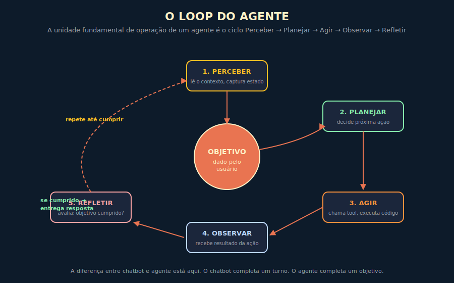
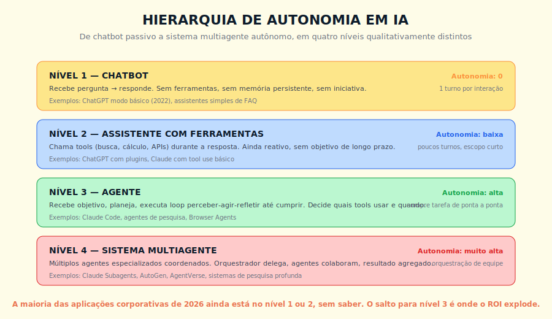
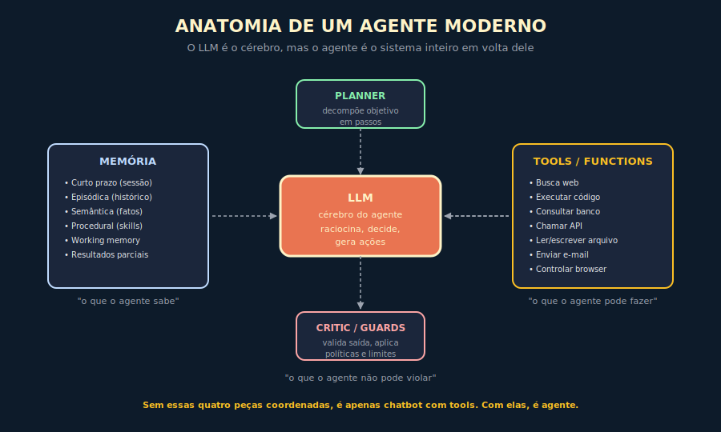

# 12. Agentes de IA

---

> *"Um chatbot completa um turno. Um agente completa um objetivo. A diferença parece sutil, mas ela é a fronteira onde reside a maior parte da disrupção econômica da IA nos próximos anos."*

---
## 12.1 — O CONCEITO INTUITIVO

Existe uma confusão semântica grave no mercado em 2026, que vale dissolver logo no início deste capítulo, porque ela está custando milhões a organizações que confundem termos sem perceber. A palavra "agente" virou buzzword, e está sendo aplicada a qualquer aplicação de IA que pareça minimamente sofisticada, desde chatbots tradicionais com nome novo até integrações simples chamando uma API externa. Essa banalização do termo esconde uma distinção técnica que, quando bem compreendida, separa quem constrói brinquedos de quem constrói ferramentas que entregam valor real.

Um agente, em sentido técnico preciso, é um sistema de IA que recebe um objetivo, e a partir dele executa um ciclo iterativo de percepção, planejamento, ação e reflexão, usando ferramentas externas conforme necessário, até cumprir o objetivo ou determinar que não consegue cumprir. A unidade básica de operação não é a resposta a uma pergunta, é a tarefa concluída de ponta a ponta. Isso muda fundamentalmente a natureza da interação, e muda também a natureza do que se espera do sistema em termos de competência, robustez e segurança.

Para tornar concreto o que está em jogo, considere a diferença entre estes dois pedidos. No primeiro, você diz a um chatbot, "como faço para comparar preços de passagens entre Brasília e Lisboa em maio?". O chatbot responde com uma lista de sites onde você pode pesquisar, talvez com algumas dicas gerais sobre melhores dias da semana. No segundo, você diz a um agente, "compre a passagem mais barata Brasília-Lisboa em maio, ida 10/05 volta 25/05, classe econômica, evitando escalas em Madri". O agente, se realmente for um agente, vai consultar múltiplos sites, comparar opções, validar restrições, talvez pedir confirmação em pontos críticos, e cumprir a tarefa concluída de fato. Não é apenas mais útil, é qualitativamente diferente, e a diferença está em quem carrega a responsabilidade de transformar intenção em resultado.

---

## 12.2 — ANALOGIA: O ESTAGIÁRIO QUE EXECUTA, NÃO O QUE EXPLICA

Pense em duas pessoas que poderiam estar trabalhando ao seu lado neste momento, com diferenças sutis mas determinantes em como você as usaria.

A primeira é um estagiário recém-formado em uma boa universidade, que sabe muito sobre vários assuntos, e que responde com competência impressionante quando você pergunta algo. Você pergunta "como organizo este relatório financeiro?", e ele te explica em detalhes a estrutura recomendada, os capítulos, os anexos, os cuidados a tomar. Você sai da conversa mais informado, mas o relatório ainda precisa ser escrito por você. Esse estagiário é equivalente a um chatbot competente.

A segunda é um assistente executivo experiente, que tem o mesmo conhecimento mas com uma diferença crítica, ele opera por objetivo, não por pergunta. Você diz a ele "preciso de um relatório financeiro do trimestre, com foco em margem por produto, até quinta-feira". O assistente entende o objetivo, identifica que dados precisa, busca esses dados nos sistemas certos, organiza em uma estrutura coerente, valida com você os pontos ambíguos, ajusta o que precisa ser ajustado, e te entrega o relatório pronto na quinta de manhã. Esse assistente é equivalente a um agente.

A diferença prática entre os dois não está em quão inteligentes eles são, está em quem está carregando a responsabilidade de execução. Com o primeiro, você é o executor, ele é a fonte de informação que apoia sua execução. Com o segundo, ele é o executor, você é o cliente do trabalho dele. Essa transferência de responsabilidade é o que muda a economia da relação, e é exatamente isso que agentes de IA estão fazendo nas organizações que conseguem implementá-los corretamente.

---

## 12.3 — EXPLICAÇÃO TÉCNICA

### 12.3.1 — O loop fundamental

Todo agente, independente da sofisticação específica, opera em uma versão do mesmo loop básico, que vale internalizar antes de qualquer detalhe arquitetural. O loop tem cinco fases, e cada uma cumpre função distinta.

A primeira fase é **perceber**, em que o agente lê o contexto disponível, captura o estado atual do mundo relevante para a tarefa, e identifica o que ainda falta para cumprir o objetivo. No primeiro ciclo, isso significa entender o objetivo recém-recebido. Em ciclos posteriores, significa avaliar o que mudou desde a ação anterior.

A segunda fase é **planejar**, em que o agente decide qual a próxima ação a tomar. Pode ser uma chamada a uma ferramenta externa, uma consulta a memória, uma geração de subobjetivo, um pedido de confirmação ao usuário. Essa decisão é frequentemente onde mora a inteligência do agente, porque escolhas ruins de planejamento levam a loops infrutíferos.

A terceira fase é **agir**, em que o agente executa a ação decidida. Pode ser invocar uma API, executar código, escrever em arquivo, enviar mensagem, qualquer operação concreta que altera o mundo ou produz informação nova.

A quarta fase é **observar**, em que o agente captura o resultado da ação tomada. A API retornou dados, o código produziu saída, a mensagem foi enviada com sucesso ou erro. Essa observação alimenta o ciclo seguinte.

A quinta fase é **refletir**, em que o agente avalia se o objetivo foi cumprido, se está progredindo, se precisa mudar de abordagem, se deve pedir ajuda. Essa avaliação determina se o loop continua ou se o agente entrega o resultado e encerra.

> 📊 **Diagrama 12.1 — O Loop do Agente**
>
> 
>
> *Perceber, planejar, agir, observar, refletir. Um agente é, no fundo, esse ciclo executado até cumprir o objetivo.*

### 12.3.2 — A hierarquia de autonomia

Vale categorizar com precisão os níveis de autonomia que aparecem no mercado, porque essa categorização ajuda a evitar a confusão de chamar tudo de "agente".

O **nível 1** é o chatbot puro, que recebe pergunta e responde sem nenhuma ferramenta, sem memória persistente, sem capacidade de tomar iniciativa. O ChatGPT em sua versão básica de 2022, e a maioria dos assistentes virtuais de FAQ corporativos, ainda operam nesse nível. Não há iteração, há uma única passada de pergunta para resposta.

O **nível 2** é o assistente com ferramentas, que durante a resposta pode chamar tools externas como busca web, cálculo, consulta a banco, e usar o resultado dessas tools para compor a resposta final. Ainda é reativo, ainda opera em escopo curto, mas já consegue cumprir tarefas que dependem de dados externos. Plugins do ChatGPT, function calling em Claude e Gemini, são exemplos típicos.

O **nível 3** é o agente propriamente dito, que recebe um objetivo e executa o loop perceber-agir-refletir até cumprir. Decide quais tools usar, em que ordem, e com base em que critério. Agentes de pesquisa profunda, agentes de codificação, browser agents, são representantes dessa categoria — os produtos correntes que exemplificam cada classe estão no Apêndice J.

O **nível 4** é o sistema multiagente, em que múltiplos agentes especializados coordenam-se para cumprir objetivos complexos. Um orquestrador delega subtarefas a agentes especializados, cada um com sua expertise e suas tools próprias, e o resultado é agregado em uma saída final coerente. Frameworks de orquestração multiagente e arquiteturas de pesquisa profunda dos principais laboratórios operam nesse nível — referências correntes no Apêndice J.

> 📊 **Diagrama 12.2 — Hierarquia de Autonomia em IA**
>
> 
>
> *A maioria das aplicações corporativas em 2026 ainda está nos níveis 1 e 2, sem saber.*

### 12.3.3 — A anatomia de um agente moderno

Tecnicamente, um agente bem construído tem quatro componentes coordenados, e cada um cumpre função insubstituível.

O **LLM como cérebro** é o componente central, que faz raciocínio, toma decisões, gera as ações em formato estruturado. Quanto mais capaz o modelo, melhor o agente raciocina em situações ambíguas, mas o modelo sozinho não é o agente.

O **planner** é o componente que decompõe objetivo em passos, mantém estado sobre o progresso, e decide o que vem depois. Pode ser implementado de várias formas, desde um system prompt elaborado que instrui o LLM a planejar, até estruturas externas mais sofisticadas com árvore de objetivos explícita.

As **tools** são as extensões de capacidade do agente, ou seja, o que ele consegue fazer no mundo. Busca, executar código, consultar banco, chamar API, ler arquivo, enviar e-mail, controlar browser. Cada tool é uma função registrada que o agente pode invocar com argumentos, e cuja saída entra no contexto da próxima decisão. A qualidade das tools determina a fronteira de capacidade do agente.

A **memória** é o repositório de tudo que o agente precisa lembrar além do contexto imediato, organizada conforme vimos no Capítulo 7, com curto prazo, episódica, semântica e procedural coexistindo.

O **critic** ou camada de guardas é o componente que valida saídas, aplica políticas e impede o agente de tomar ações destrutivas ou fora do escopo permitido. Em domínios sensíveis, esse componente não é opcional, é estrutural. Um critic pode ser tão simples quanto uma lista de ações proibidas que o agente verifica antes de executar — deletar registros, transferir valores, publicar conteúdo — ou tão sofisticado quanto um segundo LLM que avalia o plano de ação completo contra uma política explícita antes de autorizar cada passo. O ponto crítico é que o critic precisa ser definido antes de o agente entrar em produção, não adicionado depois que o primeiro incidente acontecer. O Capítulo 19 detalha como implementar salvaguardas em agentes que operam em domínios regulados.

> 📊 **Diagrama 12.3 — Anatomia de um Agente Moderno**
>
> 
>
> *Sem esses quatro componentes coordenados, é apenas chatbot com tools.*

### 12.3.4 — Function calling e tool use

A peça técnica que viabilizou a explosão de agentes em 2024 e 2025 foi a padronização do que se chama function calling ou tool use. Modelos modernos são treinados para, quando recebem uma lista estruturada de funções disponíveis (com nome, descrição, parâmetros esperados), gerar não apenas texto mas também chamadas estruturadas a essas funções, em formato JSON parseável. Isso permite que aplicações registrem programaticamente as capacidades disponíveis ao agente, e que o agente decida sozinho qual chamar com quais argumentos.

Vale entender a mecânica básica, porque ela é o que dá ao agente sua capacidade de agir. Você define uma função em sua aplicação, digamos `buscar_voo(origem, destino, data)`, e expõe essa função ao LLM como tool disponível, com schema bem definido. O LLM, ao raciocinar sobre o problema, pode emitir uma resposta que não é texto livre mas uma instrução estruturada como `{"tool": "buscar_voo", "args": {"origem": "Brasília", "destino": "Lisboa", "data": "2026-05-10"}}`. Sua aplicação interpreta essa instrução, executa a função de verdade, captura o resultado, e devolve ao LLM como contexto para a próxima decisão. Esse ciclo, repetido com fluidez, é o que faz o agente funcionar.

A qualidade do tool use em um agente depende de três fatores que vale conhecer. Primeiro, o modelo precisa ter sido treinado para entender e respeitar schemas de função, o que modelos modernos da Anthropic, OpenAI e Google fazem bem. Segundo, as descrições das tools precisam ser claras e específicas, porque o modelo decide quando usar cada uma com base no que leu sobre elas. Terceiro, o sistema precisa lidar bem com erros e respostas inesperadas das tools, porque agentes que travam quando uma tool falha são frágeis em produção.

---

## 12.4 — EXEMPLO MEMORÁVEL: O AGENTE QUE FAZ O TRABALHO DE TRÊS DIAS EM TRINTA MINUTOS

> Cenário ilustrativo, composto a partir de casos recorrentes.

Uma empresa brasileira de consultoria estratégica em fusões e aquisições, com cerca de cinquenta consultores sêniors, tinha um processo crítico chamado "due diligence preliminar". Antes de propor a um cliente que invista em uma empresa-alvo, a consultoria fazia uma análise estruturada da alvo, incluindo perfil financeiro, posição competitiva, histórico de litígios, exposição regulatória, qualidade da liderança, presença em mídia. Esse trabalho, feito por um analista experiente, levava entre dois e três dias por empresa-alvo, e era o gargalo principal do pipeline comercial, com cerca de duzentas due diligences preliminares pendentes por ano.

A direção decidiu testar uma abordagem com agentes, em um piloto de três meses. Contrataram uma consultoria especializada que construiu um sistema multiagente customizado, e o resultado, mesmo com expectativas controladas, surpreendeu a todos.

A arquitetura final tinha um orquestrador central e quatro agentes especializados, cada um com tools próprias. O **agente financeiro** consultava bancos de dados como Bloomberg, Capital IQ e Refinitiv, extraía indicadores chave, calculava múltiplos e variações, comparava com benchmarks setoriais. O **agente jurídico** consultava bases de processos como JusBrasil, identificava litígios em andamento, mapeava exposição regulatória usando bases especializadas, sinalizava red flags. O **agente competitivo** fazia varredura de mercado, analisava posicionamento via dados de market share quando disponíveis, identificava principais concorrentes e seus diferenciais. O **agente de reputação** monitorava cobertura de mídia recente, redes sociais, registros de eventos públicos da liderança, sinalizava controvérsias ou riscos reputacionais.

O orquestrador recebia o nome da empresa-alvo, delegava aos quatro agentes em paralelo, agregava os resultados em um relatório estruturado de cerca de quinze páginas, e entregava ao analista humano para revisão e refinamento final.

O que antes levava entre dois e três dias passou a levar entre vinte e cinco e quarenta e cinco minutos de processamento automatizado, mais cerca de duas horas de revisão humana especializada. **O ciclo total caiu de cerca de vinte horas para três horas, com qualidade igual ou superior em testes cegos comparativos.** A vazão de due diligences preliminares por consultor saltou em torno de seis vezes, e o pipeline comercial deixou de ser limitado pela capacidade de análise, passando a ser limitado pela capacidade de prospecção, problema bem mais agradável de ter.

A lição mais reveladora não foi o ganho de produtividade direto, foi o que aconteceu com o trabalho dos consultores humanos. Liberados do trabalho mais mecânico de coleta e organização inicial de dados, eles passaram a focar onde realmente agregavam valor, na análise estratégica e na construção de tese de investimento. A satisfação no trabalho subiu, a qualidade do output final melhorou, e em onze meses os consultores começaram a propor expansões do sistema para outras fases do processo. **O agente não substituiu o consultor, ele liberou o consultor para fazer o trabalho de consultor.**

> 🎯 **PARA EXECUTIVOS**
> O ROI de agentes em processos analíticos estruturados varia amplamente. Os fatores que determinam onde você cai nessa faixa são o redesenho do processo em torno do agente e a qualidade da validação humana nos pontos críticos. Sem os dois, o número desce; com os dois, sobe além do que a maioria dos gestores espera antes do piloto. O risco principal não é técnico, é organizacional: a maior parte dos fracassos vem de redesenho insuficiente ou de validação humana ausente.

---

## 12.5 — DECISÕES ARQUITETURAIS QUE FAZEM OU QUEBRAM AGENTES

Vou descrever as decisões mais críticas em construção de agentes, porque são onde a maior parte dos projetos naufragam ou prosperam.

A primeira é **quão autônomo o agente deve ser em cada momento**. Agentes totalmente autônomos, que executam de ponta a ponta sem intervenção humana, têm mais ROI em tarefas reversíveis e de baixo risco. Agentes com pontos de confirmação humana, em que o agente pausa e pede aprovação antes de ações sensíveis, são essenciais em domínios com consequências sérias. A decisão de onde colocar esses pontos de pausa é tão importante quanto a arquitetura técnica.

A segunda é **como lidar com erros e situações inesperadas**. Tools falham, APIs ficam indisponíveis, dados vêm em formato inesperado, e agentes precisam responder com graça em vez de travar ou alucinar. Implementar retry com backoff, fallback para alternativas, e escalonamento para humano quando apropriado, separa agentes de demonstração de agentes de produção.

A terceira é **como instrumentar e observar o comportamento**. Agentes operam em loops com decisões internas, e sem instrumentação adequada você não sabe por que ele tomou cada decisão, onde gastou tokens, quanto tempo cada fase consumiu, em que ponto falhou. Logging estruturado de cada chamada de tool, cada decisão de planejamento, cada reflexão, é parte do design, não acessório posterior.

A quarta é **como definir o critério de sucesso da tarefa**. Agentes precisam saber quando parar, e definir esse critério explicitamente é mais difícil do que parece. Muitos agentes ineficientes ficam em loops fazendo passos marginais porque o critério de parada está mal definido, e o agente não percebe que já cumpriu o suficiente.

A quinta é **quais tools dar e quais reter**. A tentação inicial é dar acesso a tudo, mas isso aumenta complexidade, custo em tokens e risco de uso indevido. Agentes mais eficazes têm conjuntos focados de tools, escolhidos para o domínio específico, em vez de buffets genéricos.

---

## 12.6 — SISTEMAS MULTIAGENTE

Quando uma tarefa é complexa demais para um único agente, ou quando ela se beneficia de especialização explícita, surgem sistemas multiagente. Vale conhecer os padrões principais.

O padrão **orquestrador e especialistas**, como vimos no caso da consultoria, tem um agente coordenador que recebe o objetivo, decompõe em subtarefas, delega a agentes especialistas, e agrega resultados. É o padrão mais usado em produção em 2026, porque é simples de raciocinar sobre, simples de debugar, e tem responsabilidades bem definidas.

O padrão **debate** tem múltiplos agentes que discutem uma questão entre si, frequentemente com papéis adversariais (defensor, crítico, juiz), e produzem uma conclusão a partir do diálogo. Útil em decisões com trade-offs complexos, mas custoso em tokens e difícil de prever em runtime.

O padrão **pipeline** tem agentes em sequência, cada um especializado em uma etapa do trabalho, com saída de um virando entrada do próximo. Útil em fluxos lineares bem definidos, como geração de relatório com etapas claras (pesquisa, estruturação, redação, revisão).

O padrão **swarm** tem múltiplos agentes paralelos atacando o mesmo problema de ângulos diferentes, com agregação final. Útil quando o problema admite múltiplas abordagens válidas e você quer diversidade de soluções.

Para escolher entre os quatro padrões, use a heurística: quando o fluxo é linear e as etapas têm ordem definida, pipeline; quando há especialização paralela com um coordenador reunindo os resultados, orquestrador; quando o problema admite múltiplas abordagens válidas e você quer diversidade antes de agregar, swarm; quando a decisão tem trade-offs genuinamente complexos e latência alta é tolerável, debate. Cada padrão tem custo de complexidade maior que o anterior — escolha o mais simples que cobre o problema.

Independente do padrão, sistemas multiagente compartilham desafios próprios. O custo em tokens multiplica rapidamente, porque cada agente tem seu próprio contexto e seus próprios passos. O debug fica mais complexo, porque o erro pode estar em qualquer um dos agentes ou na coordenação entre eles. E a governança fica mais delicada, porque políticas precisam ser aplicadas em pontos certos sem sufocar a capacidade do sistema.

---

## 12.7 — CONEXÕES COM OUTROS CAPÍTULOS
- **Memória em IA, fundação para agentes com continuidade**: Capítulo 7
- **Chain of Thought, base para planejamento de agentes**: Capítulo 10
- **Context Engineering, orquestração do contexto do agente**: Capítulo 11
- **MCP, padrão de integração de tools**: Capítulo 13
- **AI Engineering, disciplina de operar agentes em produção**: Capítulo 14
- **Claude Code como agente de codificação**: no Livro 2
- **Claude Subagents para arquiteturas multiagente**: no Livro 2
- **Segurança em agentes autônomos**: Capítulo 19

---

## 12.8 — RESUMO EXECUTIVO

| Conceito | Síntese |
|----------|---------|
| **Agente** | Sistema de IA que cumpre objetivo via loop perceber-planejar-agir-observar-refletir |
| **Loop fundamental** | As cinco fases do ciclo de operação, executadas até cumprir ou desistir |
| **Hierarquia de autonomia** | Chatbot → Assistente com tools → Agente → Multiagente |
| **Anatomia** | LLM + Planner + Tools + Memória + Critic |
| **Function calling** | Mecanismo pelo qual o LLM gera chamadas estruturadas a funções registradas |
| **Padrões multiagente** | Orquestrador, debate, pipeline, swarm |
| **Decisões críticas** | Autonomia, tratamento de erro, instrumentação, critério de parada, escolha de tools |

---

## 12.9 — CHECKLIST DO CAPÍTULO

- [ ] Explicar a diferença entre chatbot, assistente com tools e agente, para um diretor não-técnico
- [ ] Descrever o loop fundamental do agente em cinco fases
- [ ] Distinguir os quatro componentes da anatomia de um agente moderno
- [ ] Reconhecer em que nível de autonomia uma aplicação está
- [ ] Listar os quatro padrões principais de sistemas multiagente
- [ ] Identificar as cinco decisões arquiteturais mais críticas em construção de agentes
- [ ] Defender, em uma reunião, em que processos da sua organização agentes entregariam ROI claro

---

## 12.10 — PERGUNTAS DE REVISÃO

1. Por que um chatbot com plugins não é tecnicamente um agente?
2. Em que momento do loop o agente decide se cumpriu o objetivo, e por que esse momento é crítico?
3. Por que dar muitas tools a um agente pode reduzir sua eficácia, e não aumentar?
4. Quando o padrão multiagente debate é preferível ao orquestrador-especialistas?
5. Em domínios sensíveis, onde devem ficar os pontos de confirmação humana?

---

## 12.11 — EXERCÍCIOS PRÁTICOS

### Exercício 1 — Classificação de aplicações
Liste cinco aplicações de IA que sua organização usa ou está construindo. Classifique cada uma no nível de autonomia (1 a 4). Identifique quais teriam ROI claro se promovidas para nível superior.

### Exercício 2 — Decomposição de tarefa
Pegue uma tarefa real do seu trabalho que leve algumas horas e seja repetitiva. Decomponha-a em subobjetivos que um agente poderia executar. Identifique quais tools seriam necessárias.

### Exercício 3 — Esboço de critério de sucesso
Para um agente hipotético, escreva o critério explícito de sucesso da tarefa. Quando ele deve parar? Como ele sabe que cumpriu? O que ele faz se não consegue progredir?

### Exercício 4 — Mapeamento de risco
Para um agente que faria sentido na sua organização, mapeie as ações que merecem confirmação humana antes de execução. Justifique cada ponto de pausa proposto.

---

## 12.12 — PROJETO DO CAPÍTULO

**Construa um agente simples para uma tarefa real.**

Escolha uma tarefa que envolva pelo menos três passos sequenciais, com uso de dados externos. Pode ser pesquisa estruturada, geração de relatório a partir de fontes, automação de fluxo administrativo. Use o modelo de IA e o framework de orquestração que sua organização já opera — ou os que constam no Apêndice J para a data de leitura. O que importa não é a ferramenta, é executar o ciclo completo de definição de objetivo, tools e critério de parada com casos reais. Defina explicitamente o objetivo, as tools disponíveis, o critério de sucesso, e os pontos de validação humana. Execute em uma dúzia de casos reais. Documente onde o agente brilhou, onde falhou, e o que aprendeu sobre o trabalho. Esse projeto vai te ensinar mais sobre agentes em uma semana que dez horas de teoria.

---

## 12.13 — REFERÊNCIAS PRINCIPAIS

📚 **Papers e blog posts fundamentais**

- Anthropic. *"Building effective agents"*. 2024. → anthropic.com/research/building-effective-agents
- Yao et al. *"ReAct: Synergizing Reasoning and Acting in Language Models"*. 2022.
- Park et al. *"Generative Agents"*. 2023.
- Significant-Gravitas. *AutoGPT — first widely public autonomous agent*. 2023.

📚 **Frameworks**

- [LangGraph](https://www.langchain.com/langgraph) — orquestração de agentes em grafo
- [CrewAI](https://www.crewai.com/) — sistemas multiagente
- [Microsoft AutoGen](https://microsoft.github.io/autogen/) — conversational multiagent
- [Anthropic Claude with tools](https://docs.claude.com/en/docs/build-with-claude/tool-use)

📚 **Recursos**

- [Lilian Weng — LLM Powered Autonomous Agents](https://lilianweng.github.io/posts/2023-06-23-agent/)
- [Andrew Ng — The Batch, sobre agentes](https://www.deeplearning.ai/the-batch/)

---

## 12.14 — Autoavaliação

| # | Critério | Você consegue? |
|---|----------|----------------|
| 1 | **Clareza** — Explicar a diferença entre chatbot e agente para um diretor não-técnico em 90 segundos, com analogia | ☐ |
| 2 | **Profundidade** — Defender, em discussão técnica, os quatro componentes anatômicos de um agente moderno e por que cada um importa | ☐ |
| 3 | **Aplicação** — Olhar para os processos da sua organização e identificar três candidatos a agente com ROI claro | ☐ |
| 4 | **Conexão** — Articular como agentes integram memória (Cap 7), CoT (Cap 10), context engineering (Cap 11), MCP (Cap 13) | ☐ |
| 5 | **Curiosidade** — Está com vontade de entender o padrão MCP que está mudando como tools são integradas em sistemas de IA modernos | ☐ |

---

> *"Chatbots respondem perguntas. Agentes cumprem objetivos. A maior parte da disrupção econômica da IA dos próximos anos vai estar do lado dos agentes."*
