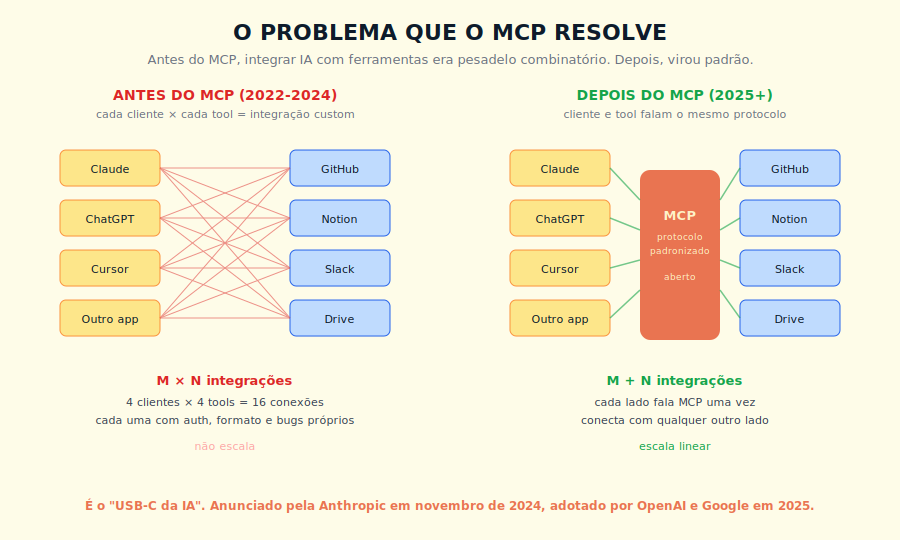
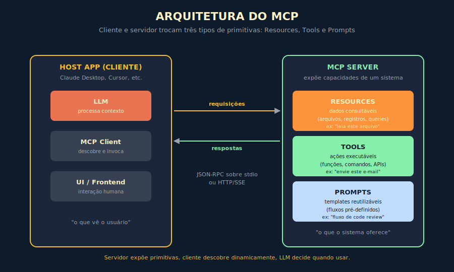

# 13. MCP — Model Context Protocol

---

> *"Toda revolução tecnológica precisa, em algum momento, de um padrão que substitui a fragmentação. O profissional que entende por que padrões emergem está sempre um passo à frente do que apenas aprende qual padrão está em uso hoje."*

---
## 13.1 — O CONCEITO INTUITIVO

> **Nota de método.** Este capítulo ensina o *princípio* — por que padrões de integração emergem em fragmentação M×N, quais primitivas eles precisam oferecer, e como avaliar e adotar um padrão aberto com critério. O MCP (Model Context Protocol) serve como caso de estudo corrente e concreto desse princípio, relevante em 2026. Padrões evoluem; o método de avaliá-los não. Produtos e versões correntes estão no Apêndice J.

Existe um padrão repetitivo na história da tecnologia, que vale ter em mente para entender o que está acontecendo com IA agora. Sempre que uma nova classe de software emerge, ela passa por uma fase inicial de fragmentação, com cada vendor tentando criar seu próprio protocolo proprietário para integração com o ecossistema em volta. Em algum momento, alguém propõe um padrão aberto, vencendo a guerra pela compatibilidade, e a indústria inteira muda de marcha. Foi o USB para periféricos, foi o HTTP para a web, foi o LSP para integrar editores de código com servidores de linguagem. Em IA moderna, com o boom de agentes precisando se conectar a bancos, APIs, sistemas internos e ferramentas externas, esse problema estrutural exige uma camada de padronização de integração — e em 2026 o candidato mais adotado para essa função recebeu o nome de MCP, sigla para Model Context Protocol, anunciado pela Anthropic em novembro de 2024 e adotado em ritmo notável pela indústria ao longo de 2025 e 2026.

O problema que o MCP resolve é simples de descrever e doloroso para quem viveu. Antes do MCP, se você quisesse conectar Claude ao GitHub para que o modelo pudesse ler issues e criar pull requests, precisava escrever uma integração custom para isso. Se quisesse conectar Claude ao Notion, outra integração custom. ChatGPT precisava de uma versão completamente diferente dessas mesmas integrações. Cursor outra. Cada cliente de IA × cada ferramenta = uma integração específica, com seu próprio formato de autenticação, seu próprio protocolo de chamada, seus próprios bugs. Isso é o que engenheiros chamam de problema M × N, ou seja, M clientes vezes N ferramentas igual a uma explosão combinatória de trabalho que não escala.

O MCP propõe a solução clássica para problemas M × N, que é introduzir um padrão intermediário. Cada cliente de IA implementa MCP uma vez, cada ferramenta expõe um servidor MCP uma vez, e a partir daí qualquer cliente conversa com qualquer ferramenta sem trabalho adicional. O problema vira M + N, escalando linearmente, e a indústria inteira ganha velocidade ao reaproveitar conexões em vez de reinventá-las.

> 📊 **Diagrama 13.1 — O Problema que o MCP Resolve**
>
> 
>
> *De integrações combinatórias M × N para integrações lineares M + N.*

---

## 13.2 — ANALOGIA: O USB-C DA INTELIGÊNCIA ARTIFICIAL

Para tornar concreto o que está em jogo, lembre da última vez que você comprou um celular novo. Provavelmente, a partir de 2024, o cabo de carregar foi USB-C, e esse mesmo cabo funciona no seu notebook, no fone de ouvido, no monitor externo, no leitor de cartão. Você não precisa de um cabo proprietário por marca, não precisa de adaptadores, não precisa pensar em compatibilidade. O USB-C virou o substrato comum que sustenta dezenas de tipos de dispositivos, e essa padronização libera energia mental e econômica que antes era consumida em coordenação.

O MCP cumpre função análoga no ecossistema de IA. Em vez de cada modelo conversar com cada ferramenta via protocolo próprio, todos falam o mesmo MCP, e a partir disso construir novas integrações vira trabalho de horas em vez de semanas. Isso pode soar como detalhe técnico, mas tem implicação econômica enorme. Quando o custo marginal de conectar um modelo a uma ferramenta nova cai em ordem de grandeza, novas aplicações ficam viáveis, novos casos de uso emergem, e o ritmo de inovação acelera de forma agregada. A história do software corporativo já viu esse filme algumas vezes, e quem ignorou o filme em outras épocas ficou para trás.

A analogia tem um detalhe que vale puxar. USB-C funciona porque ele padroniza não apenas o conector físico mas também os modos de operação, os protocolos de negociação, as capacidades anunciadas pelos dispositivos. MCP funciona porque padroniza não apenas a comunicação básica, mas as três primitivas que sistemas de IA precisam, que são Resources, Tools e Prompts. Vamos detalhar cada uma a seguir.

---

## 13.3 — Function calling, tool use, MCP e os clássicos: as diferenças que importam

A confusão entre os termos *function calling*, *tool use*, *MCP*, *gRPC*, *REST* e *webhooks* é a principal fonte de erro arquitetural em projetos de agente. Cada termo descreve uma camada diferente, e o profissional que opera os quatro com vocabulário trocado paga preço alto em retrabalho.

**Function calling**, no vocabulário do mercado a partir de 2023 (introduzido como interface comercial pela OpenAI em junho daquele ano), é a interface de modelo único em que o LLM recebe um schema JSON de funções disponíveis e devolve qual função deve ser chamada com quais argumentos. É *feature de provedor*, não protocolo. A cola entre LLM e função fica no código da aplicação, e a portabilidade entre provedores depende de adaptadores. Quando o desenvolvedor diz "function calling", costuma estar falando do mecanismo da OpenAI Assistants API ou de equivalentes do Claude e do Gemini.

**Tool use**, no vocabulário Anthropic a partir de 2024, é abstração mais ampla que inclui function calling e padroniza o tratamento de múltiplas ferramentas, ferramentas com efeito colateral, ferramentas que retornam estruturas complexas (imagens, código, blobs). Continua sendo *feature de provedor*, sem padronização cross-vendor obrigatória, ainda que a convergência prática entre provedores faça com que adaptadores funcionem com fricção menor a cada trimestre.

**MCP — Model Context Protocol**, publicado pela Anthropic em novembro de 2024 como protocolo aberto, padroniza como qualquer LLM descobre, autentica e invoca ferramentas externas. É equivalente, no mundo de agentes, ao que o Language Server Protocol fez para IDEs e ferramentas de desenvolvimento. Servidor MCP expõe ferramentas para qualquer cliente MCP compatível, independente de quem é o provedor do modelo. O protocolo é o que diferencia MCP de function calling e de tool use: enquanto os dois primeiros vivem dentro do mundo de um provedor, MCP é a camada de interoperabilidade que cruza provedores.

A comparação com protocolos clássicos é o que falta a quem chega ao MCP vindo de arquitetura tradicional:

| Critério | MCP | gRPC | REST | Webhooks | Event-driven (Kafka, EventBridge) |
|---|---|---|---|---|---|
| Discoverability dinâmica | Sim, nativa | Não, schema em build time | Não, depende de OpenAPI | Não | Não |
| Padrão de schema | JSON-RPC, com primitivas Resources / Tools / Prompts | Protobuf binário | OpenAPI / JSON Schema | Variado, definido pelo emissor | Variado, definido por contrato |
| Streaming | Sim, via SSE | Sim, nativo | Limitado, SSE opcional | Não, é push pontual | Sim, eventos contínuos |
| Bidirecionalidade | Sim | Sim, via streaming | Não nativa | Não, unidirecional | Sim |
| Maturidade do ecossistema em 2026 | Inicial, em crescimento rápido | Madura, indústria consolidada | Madura, padrão de facto | Madura | Madura |
| Curva de adoção | Baixa para quem já fez API REST | Média a alta, exige codegen | Baixa | Baixa | Média a alta |
| Quando escolher | Agentes com múltiplas ferramentas, integração plural, descoberta dinâmica | Integração interna de alta performance, contratos estáveis, latência crítica | Integração já consolidada em REST, ecossistema instalado, time sem capacidade de operar MCP | Notificação assíncrona de evento pontual entre sistemas | Orquestração desacoplada em escala, agentes assíncronos |

A regra prática para o arquiteto é simples: *function calling* para protótipo rápido em modelo único; *tool use* para operação consolidada em provedor único com múltiplas ferramentas; *MCP* para arquitetura plural de ferramentas com discoverability dinâmica, sobretudo quando há expectativa de mudar de provedor de LLM no futuro; *REST* e *gRPC* para integrações fora do escopo de agente; *webhooks* e *event-driven* para fluxos assíncronos onde o LLM não está no caminho síncrono da decisão.

Cinco cenários em que MCP **não** é a escolha certa, mesmo quando a moda sugere o contrário: primeiro, latência crítica abaixo de 50 milissegundos por chamada, onde o overhead de JSON-RPC pesa contra gRPC; segundo, ecossistema REST já consolidado dentro da organização com SDKs internos maduros, onde o custo de migração não se paga; terceiro, time de engenharia sem capacidade ou banda para operar e manter servidores MCP, em organização ainda sem prática de protocolos; quarto, integração one-off de baixa complexidade, em que MCP é overengineering; quinto, conformidade regulatória que exige protocolo específico (gRPC mTLS em saúde, REST com certificados em pagamentos PIX, eventos com criptografia em ponta em segurança financeira). Reconhecer esses cenários protege o arquiteto contra adoção cosmética do protocolo.

A escolha entre as quatro camadas raramente é mutuamente exclusiva. A arquitetura madura em 2026 combina MCP para integração plural com discoverability, REST para sistemas legados ainda em operação, webhooks para notificação assíncrona pontual, e event-driven para escala desacoplada. O Capítulo 14 sobre AI Engineering aprofunda como essas camadas convivem em stack real.

### 13.3.1 — Os quatro eixos que decidem a escolha em produção

Para o arquiteto que precisa defender a decisão em comitê técnico, vale separar os quatro eixos que efetivamente diferenciam os protocolos quando o produto entra em escala, porque a tabela comparativa anterior, ainda que correta, não captura o que importa em conversa de capacity planning.

**Eixo 1 — Latência típica por chamada.** Em medição empírica de produção em 2026, a janela razoável é: gRPC entre dois e dez milissegundos por chamada interna em datacenter, com overhead de binário Protocol Buffers reduzindo serialização em fator de até dez vezes em relação a JSON; REST entre dez e cinquenta milissegundos em chamada interna típica, com overhead de JSON e HTTP/1.1 ou HTTP/2; MCP entre vinte e cento e cinquenta milissegundos por chamada, com overhead de JSON-RPC sobre stdio ou SSE; webhooks de poucos milissegundos no lado do emissor (push e esquece), mas sem garantia sobre quando o destinatário processa. Quando a latência percebida pelo usuário é gargalo do produto, e o agente precisa orquestrar dezenas de chamadas em uma sessão, a soma do overhead MCP × número de chamadas pode comprometer experiência. Para o decisor, a regra prática é: medir antes de adotar, jamais aceitar número de marketing genérico.

**Eixo 2 — Tipo de schema e contrato.** gRPC força contrato estrito via Protocol Buffers, com versionamento explícito, com codegen automático em N linguagens, e com quebra de compatibilidade detectável em build time. REST aceita contrato implícito via documentação informal, ou explícito via OpenAPI, mas o contrato fica fora do payload e quebra-se silenciosamente em runtime se o produtor evoluir sem comunicar. MCP carrega schema dinâmico, declarado pelo servidor a cada conexão, o que dá ao cliente a chance de adaptar sua chamada conforme o que está disponível agora — propriedade necessária para o agente, mas estranha ao arquiteto vindo de gRPC. Webhooks são contrato pelo produtor, frequentemente sem schema formal, frequentemente sujeito a evolução silenciosa que quebra integrações no consumidor. Para o decisor, a regra prática é: quanto mais crítico o produto, mais rigor de contrato; gRPC ganha quando a integração é alvo de SLA contratual com penalidade, MCP ganha quando a integração precisa adaptar-se a capacidades anunciadas pelo servidor que muda entre versões.

**Eixo 3 — Modelo de segurança e auth.** REST tem três décadas de práticas estabelecidas — OAuth 2.0 com escopos por endpoint, JWT por chamada, mTLS para integrações enterprise, gateways API com WAF, rate limiting maduro. gRPC herda da pilha HTTP/2 e adiciona mTLS em padrão, com biblioteca consolidada em todas as linguagens principais. MCP em 2026 ainda está consolidando o modelo de auth, com algumas implementações usando token bearer simples, outras adotando OAuth 2.0 com escopos por Tool, e implementações enterprise exigindo gateways MCP dedicados que adicionam mTLS, auditoria e rate limiting no caminho. Webhooks têm padrão de auth tipicamente fraco, com signed payload por HMAC compartilhada como mínimo defensável. Para o decisor em domínio regulado, a regra prática é: MCP em produção sensível exige avaliação específica do modelo de auth do servidor MCP escolhido, com revisão de segurança formal antes do go-live; aceitar o default do servidor MCP é negligência em domínio que importa.

**Eixo 4 — Composição em camadas.** A leitura mais sofisticada da pergunta "MCP versus gRPC" reconhece que a oposição é falsa, e que a arquitetura madura em 2026 compõe as duas camadas em vez de escolher entre elas. O Google Cloud publicou em 2025 uma proposta formal de usar gRPC como transporte nativo do MCP em ambientes onde latência é gargalo crítico, com a camada MCP entregando descoberta dinâmica, primitivas semânticas e composição entre múltiplos servidores, e a camada gRPC entregando o transporte binário rápido sob o capô. A leitura prática é: REST e gRPC permanecem como a camada de transporte e integração com sistemas legados; MCP cresce como camada de orquestração de capacidades para o agente, agnóstica do transporte. Tentar substituir gRPC por MCP em integração interna de alta performance é erro arquitetural; tentar substituir MCP por gRPC em orquestração de agente com múltiplas ferramentas heterogêneas também é. Os dois resolvem problemas diferentes, e a maturidade do arquiteto está em ler o problema antes de escolher a camada.

### 13.3.2 — Matriz de decisão por padrão de carga

Para fechar a discussão arquitetural em forma operacional, segue a matriz que o arquiteto pode levar à reunião de design.

| Padrão de carga | Protocolo dominante | Justificativa |
|---|---|---|
| Integração interna de alta performance, contrato estável, latência abaixo de 10ms | gRPC | Binário compacto, codegen, contrato rígido com versionamento |
| Integração com sistema externo via API pública, ecossistema instalado | REST | Padrão de facto, ferramentas consolidadas, conhecido por todo time |
| Notificação assíncrona de evento pontual (pagamento aprovado, webhook do GitHub) | Webhooks | Push simples, baixo custo, sem necessidade de pull contínuo |
| Orquestração de agente com múltiplas ferramentas plurais e descoberta dinâmica | MCP | Discoverability, primitivas semânticas, troca de modelo sem refazer integração |
| Pipeline de eventos em escala, consumidores múltiplos, replay temporal | Event-driven (Kafka, EventBridge) | Desacoplamento, throughput, durabilidade |
| Agente que precisa de latência crítica E ferramentas plurais | MCP sobre gRPC | Composição: MCP entrega a camada semântica, gRPC o transporte binário |

A matriz acima é o ponto de partida, não a resposta final. O arquiteto maduro lê o produto, mede a carga, dimensiona o time, e escolhe a combinação que respeita os quatro eixos do critério anterior. Adotar MCP por moda em arquitetura onde gRPC resolve melhor é o erro caro mais comum em 2026, e adotar gRPC em arquitetura onde a flexibilidade do MCP renderia composição plural é o erro simétrico do arquiteto que confunde rigor com adequação ao problema.

---

## 13.3 — EXPLICAÇÃO TÉCNICA

### 13.3.1 — A arquitetura cliente-servidor

O MCP segue uma arquitetura cliente-servidor clássica, com papéis bem definidos para cada lado da comunicação.

O **cliente MCP** é o lado que consome capacidades, tipicamente um aplicativo onde o usuário interage com um LLM. Claude Desktop, ChatGPT, Cursor, Continue, Zed e dezenas de outros aplicativos modernos implementam clientes MCP. O cliente é responsável por descobrir quais servidores estão disponíveis, conectar-se a eles, listar suas capacidades, traduzir essas capacidades em formato que o LLM consegue usar, e mediar a invocação durante a conversa.

O **servidor MCP** é o lado que oferece capacidades, expondo acesso a um sistema específico. Um servidor MCP do GitHub expõe operações como listar repositórios, ler issues, criar pull requests. Um servidor MCP do PostgreSQL expõe operações como executar queries, listar tabelas, ler schemas. Cada servidor encapsula a complexidade de um sistema externo e oferece uma interface padronizada que qualquer cliente MCP consegue usar.

A comunicação entre os dois acontece via JSON-RPC, com suporte a múltiplos transportes incluindo standard I/O para servidores locais e HTTP com Server-Sent Events para servidores remotos. Essa flexibilidade de transporte permite que MCP funcione bem tanto em cenários locais, em que o servidor roda na máquina do usuário e tem acesso direto a arquivos e ferramentas, quanto em cenários remotos, em que o servidor é hospedado em algum lugar e exposto via rede.

> 📊 **Diagrama 13.2 — Arquitetura do MCP**
>
> 
>
> *Cliente e servidor trocam três tipos de primitivas, com transporte flexível.*

### 13.3.2 — As três primitivas

A elegância conceitual do MCP está na escolha de três primitivas que cobrem praticamente todas as necessidades de integração entre IA e ferramentas externas. Vou descrever cada uma com cuidado, porque entendê-las é o que separa quem opera MCP de quem só ouve falar.

A primeira primitiva é **Resources**, que representa dados consultáveis pelo modelo. Resources são fontes de informação que o LLM pode ler para enriquecer seu contexto, como arquivos no disco, registros em banco de dados, documentos em sistemas como Notion ou Confluence, resultados de queries pré-definidas. Quando o LLM precisa entender algo sobre o mundo do usuário, ele pode pedir ao cliente MCP que recupere Resources relevantes. A natureza Resources é predominantemente leitura, e essa restrição é deliberada por motivos de segurança.

A segunda primitiva é **Tools**, que representa ações executáveis pelo modelo. Tools são funções com efeitos no mundo, como criar uma issue no GitHub, enviar um e-mail via Gmail, executar uma query SQL, criar um arquivo. Diferente de Resources, Tools podem causar mudanças, e por isso clientes MCP frequentemente exigem confirmação humana antes de invocar Tools sensíveis. A semântica de Tools é a mesma de function calling que vimos no Capítulo 12, mas com a vantagem de ser exposta dinamicamente pelo servidor em vez de precisar ser hardcoded na aplicação cliente.

A terceira primitiva é **Prompts**, que representa templates reutilizáveis de fluxos. Prompts encapsulam padrões comuns de interação, como "fluxo de code review", "análise de pull request", "geração de relatório semanal", oferecidos pelo servidor MCP como fluxos pré-construídos que o usuário pode invocar com argumentos próprios. Essa primitiva é menos usada que as outras duas em 2026, mas tem ganhado tração à medida que organizações descobrem o valor de bibliotecas internas de prompts versionados.

Para tornar concreto como as três primitivas se declaram em um servidor MCP real, considere um servidor para um sistema interno de RH. Um **Resource** seria declarado com nome (`lista_cargos`), descrição ("Retorna todos os cargos ativos com nível e faixa salarial") e tipo de resposta (JSON com campos `cargo`, `nivel`, `faixa`). Uma **Tool** seria declarada com nome (`criar_solicitacao_vaga`), descrição ("Abre uma solicitação formal de vaga no sistema de RH"), parâmetros de entrada (`cargo`, `departamento`, `justificativa`) e comportamento em erro (retorna código de status e mensagem legível). A diferença operacional é imediata: Resource não muda estado no sistema; Tool pode. Esse é o critério que determina quando cada uma é usada e, principalmente, quando exigir confirmação humana antes de invocar.

### 13.3.3 — O fluxo típico de uma interação

Para tornar tangível o que acontece quando um sistema MCP opera, vou descrever o fluxo típico passo a passo, considerando o cenário em que um usuário pergunta ao Claude algo que exige consultar um sistema externo via MCP.

Primeiro, no início da sessão, o cliente MCP (Claude Desktop por exemplo) se conecta aos servidores MCP configurados, recebe a lista de capacidades de cada um, e injeta essas capacidades como tools disponíveis ao LLM. O modelo agora sabe que existem ferramentas para consultar GitHub, ler documentos no Notion, executar queries no banco interno.

Em seguida, o usuário digita uma pergunta como "qual o status dos issues abertos no repositório X criados nas últimas duas semanas?". O LLM, ao processar o pedido, identifica que precisa consultar o GitHub para responder, e gera uma chamada estruturada à tool apropriada com os argumentos extraídos do pedido.

O cliente MCP recebe essa chamada, encaminha ao servidor MCP do GitHub via JSON-RPC, e o servidor executa a operação contra a API real do GitHub, devolvendo o resultado em formato padronizado.

O cliente injeta o resultado no contexto da conversa, o LLM agora tem os dados que precisava, e gera a resposta final ao usuário com base no que recuperou. Em muitos casos, esse ciclo se repete várias vezes em uma única conversa, com o modelo encadeando consultas a múltiplos servidores conforme a complexidade do pedido.

A parte importante desse fluxo é que, do ponto de vista do usuário, tudo isso é transparente. Do ponto de vista do desenvolvedor que construiu o servidor MCP, ele só precisou expor as capacidades do GitHub uma vez, e agora qualquer cliente MCP no ecossistema pode usar. Essa é a alavanca de escala que torna o MCP relevante.

---

## 13.4 — EXEMPLO MEMORÁVEL: A INTEGRAÇÃO QUE LEVAVA SEMANAS E PASSOU A LEVAR HORAS

> Cenário ilustrativo, composto a partir de casos recorrentes.

Uma empresa brasileira de telecom, com cerca de 5 mil funcionários e dezenas de sistemas internos legados, queria usar Claude para apoiar atendimento ao cliente. O escopo inicial parecia simples, dar ao atendente um copiloto que conseguisse, durante a conversa com o cliente, consultar o histórico de chamados, verificar status de pagamentos, validar planos contratados, e abrir tickets internos quando necessário.

O problema era que cada um desses sistemas, construídos ao longo de quinze anos, tinha uma API própria, com autenticações diferentes, formatos diferentes, semânticas diferentes. A primeira estimativa, feita em fevereiro de 2025, calculou que construir integrações custom para os doze sistemas relevantes levaria entre oito e doze semanas de desenvolvimento — esforço que, a valores de mercado em 2025, representava dezenas de milhares de reais apenas na fase inicial, sem contar manutenção contínua.

A equipe técnica decidiu testar uma abordagem alternativa baseada em MCP, ainda recém-lançado, e a história mudou de natureza. Em vez de construir doze integrações custom contra Claude, construíram doze servidores MCP, um para cada sistema interno. Cada servidor MCP encapsulava o sistema interno e o expunha em formato padronizado, com Resources para consultas e Tools para ações.

O trabalho de cada servidor MCP, individualmente, foi mais simples do que o trabalho de uma integração custom equivalente teria sido, porque o protocolo já estava definido e bem documentado pela Anthropic. Em cerca de três semanas, os doze servidores MCP estavam funcionando, e a partir desse ponto qualquer ferramenta de IA que falasse MCP poderia usá-los, não apenas Claude.

O benefício foi imediato e múltiplo. O atendente humano ganhou um copiloto via Claude Desktop, que conseguia consultar todos os sistemas relevantes durante a conversa com o cliente, com qualidade percebida muito alta. Mas o benefício mais durável surgiu seis meses depois. Quando o departamento jurídico quis usar Cursor para análise de contratos com Claude, os mesmos servidores MCP já estavam disponíveis e funcionaram sem trabalho adicional. Quando a equipe de produto começou a experimentar com agentes autônomos baseados em GPT, os mesmos servidores MCP foram aproveitados. **O investimento em padronização rendeu três vezes em menos de um ano, e vai continuar rendendo por anos.**

A lição estrutural não foi sobre tempo ou dinheiro economizado em um projeto específico. Foi sobre o que acontece quando organizações tratam integração como ativo reutilizável em vez de tarefa pontual. **Construir contra um padrão aberto é decisão arquitetural com retorno composto, e a maioria das empresas só descobre isso depois de já ter pagado caro por integrações que vão ser jogadas fora.**

> 🎯 **PARA EXECUTIVOS**
> Se sua organização está planejando integrações de IA com múltiplos sistemas internos, o critério decisivo é: você precisa de descoberta dinâmica de capacidades e quer flexibilidade para trocar de provedor de LLM no futuro? Se sim, invista em padrão aberto de integração — a lógica econômica do M+N se aplica independente do protocolo específico. Em 2026, o MCP é o candidato mais adotado para essa função. Avalie o ecossistema corrente antes de comprometer; o que conta como padrão dominante na data de leitura está no Apêndice J.

---

## 13.5 — O ECOSSISTEMA EM 2026

Vale entender o estado do ecossistema MCP em 2026, porque isso afeta decisões práticas que sua organização pode tomar nos próximos meses.

A Anthropic continua sendo a mantenedora principal do protocolo, com especificação aberta hospedada no GitHub e SDKs oficiais em várias linguagens, incluindo TypeScript, Python, Java, Kotlin, C#, Rust e Go. A adoção pela indústria foi notavelmente rápida, com OpenAI anunciando suporte nativo em ChatGPT em 2025, Google Gemini adicionando suporte na sequência, e dezenas de aplicações de IA de menor porte adotando o padrão sem fricção.

O catálogo de servidores MCP disponíveis cresceu de algumas dezenas em 2024 para milhares em 2026, cobrindo praticamente todos os sistemas populares como GitHub, GitLab, Slack, Notion, Linear, Jira, Confluence, PostgreSQL, MongoDB, Stripe, AWS, Azure, GCP, Salesforce, HubSpot, e centenas de outros. Para sistemas internos corporativos, a prática crescente é cada empresa construir seus próprios servidores MCP e mantê-los como infraestrutura interna, similar ao que se fez com APIs internas nos anos 2010.

Existem três classes principais de servidores MCP que vale conhecer. Os **servidores oficiais**, mantidos pelos próprios fornecedores dos sistemas integrados ou pela Anthropic como referência — lista corrente no repositório oficial, Apêndice J — com qualidade alta e atualização regular. Os **servidores comunitários**, mantidos por terceiros e disponibilizados via repositórios públicos, com qualidade variável mas frequentemente cobrindo nichos não atendidos pelos oficiais. E os **servidores corporativos**, internos a cada organização, expondo sistemas próprios da casa.

Para uma organização adotando MCP em 2026, a sequência recomendada é primeiro experimentar com servidores oficiais para sistemas populares, depois avaliar servidores comunitários para nichos específicos, e por último investir em servidores internos para sistemas legados ou proprietários que justifiquem o trabalho.

---

## 13.6 — RISCOS E CUIDADOS

MCP é poderoso, mas como toda tecnologia que dá capacidade nova vem com riscos próprios que vale conhecer antes de adotar amplamente.

O primeiro risco é **segurança em servidores externos**. Quando você conecta seu cliente MCP a um servidor de terceiros, está dando a esse servidor acesso a parte da sua conversa e potencialmente a dados sensíveis. Servidores comunitários sem auditoria adequada podem ser vetor de vazamento ou ataque. Tratar servidores MCP como qualquer outra dependência de terceiro, com auditoria de código e revisão de permissões, é prática essencial.

O segundo é **execução não intencional de tools destrutivas**. Quando o modelo tem acesso a Tools que podem deletar dados, enviar e-mails em massa, ou fazer transações financeiras, um erro de raciocínio ou um prompt injection podem causar dano real. Configurar confirmação humana obrigatória para ações sensíveis, e limitar escopo de permissões de cada servidor MCP, é parte do design responsável.

O terceiro é **explosão de superfície de ataque**. Cada servidor MCP adicionado expande o que o modelo pode fazer, e portanto o que um atacante pode tentar manipular. Em organizações com governança madura, há revisão explícita antes de adicionar novos servidores ao ambiente produtivo.

O quarto é **dependência de qualidade do servidor**. Um servidor MCP mal escrito pode retornar dados em formato errado, falhar silenciosamente, ou expor capacidades de forma confusa para o modelo. Isso degrada qualidade da interação sem que o usuário entenda a causa, e debugar problemas em camadas profundas do MCP exige instrumentação que muitos times não têm.

---

## 13.7 — CONEXÕES COM OUTROS CAPÍTULOS
- **Function calling como base técnica do tool use**: Capítulo 12
- **Context Engineering, gestão do que entra no contexto**: Capítulo 11
- **AI Engineering, operação de sistemas com MCP**: Capítulo 14
- **Claude Desktop como cliente MCP de referência**: no Livro 2
- **Claude + MCP em arquiteturas corporativas**: no Livro 2
- **Repositórios GitHub para MCP**: Capítulo 17
- **Segurança em sistemas integrados**: Capítulo 19

---

## 13.8 — RESUMO EXECUTIVO

| Conceito | Síntese |
|----------|---------|
| **MCP** | Model Context Protocol, padrão aberto para conectar LLMs a ferramentas e dados |
| **Origem** | Anunciado pela Anthropic em novembro de 2024 |
| **Problema resolvido** | Integrações M × N viram M + N, escalando linearmente |
| **Arquitetura** | Cliente-servidor via JSON-RPC sobre stdio ou HTTP/SSE |
| **Resources** | Dados consultáveis pelo modelo (leitura) |
| **Tools** | Ações executáveis pelo modelo (escrita / efeitos colaterais) |
| **Prompts** | Templates reutilizáveis de fluxos de interação |
| **Adoção** | OpenAI, Google e dezenas de outros adotaram entre 2025 e 2026 |
| **Riscos** | Segurança em servidores externos, ações destrutivas, superfície de ataque, qualidade variável |

---

## 13.9 — CHECKLIST DO CAPÍTULO

- [ ] Explicar o problema M × N e como o MCP transforma em M + N
- [ ] Diferenciar as três primitivas (Resources, Tools, Prompts) com exemplos próprios
- [ ] Descrever o fluxo típico de uma interação com servidor MCP
- [ ] Identificar quais sistemas da sua organização se beneficiariam de servidor MCP próprio
- [ ] Reconhecer os quatro riscos principais e propor mitigação para cada
- [ ] Defender, em uma reunião arquitetural, por que padrões abertos de integração entregam retorno composto — e com que critério avaliar qual padrão adotar na data de leitura

---

## 13.10 — PERGUNTAS DE REVISÃO

1. Por que o MCP usa JSON-RPC e suporta tanto stdio quanto HTTP/SSE como transporte?
2. Qual a diferença prática entre Resources e Tools, e por que essa separação importa para segurança?
3. Por que servidores MCP corporativos internos são tendência crescente em organizações maduras?
4. Em que situação adotar um servidor comunitário em produção exige cuidados adicionais?
5. Como você convenceria um time de segurança a aprovar MCP em ambiente corporativo?

---

## 13.11 — EXERCÍCIOS PRÁTICOS

### Exercício 1 — Mapeamento de oportunidade
Liste cinco sistemas internos da sua organização que se beneficiariam de servidor MCP. Para cada um, identifique os Resources que faria sentido expor e as Tools que valeria oferecer.

### Exercício 2 — Instalação prática
Configure um cliente MCP (Claude Desktop é o caminho mais simples) e conecte um servidor oficial (GitHub, Filesystem, ou similar). Faça uma sessão real usando essas tools. Documente onde funcionou bem e onde encontrou atrito.

### Exercício 3 — Esboço de servidor próprio
Esboce o design de um servidor MCP para um sistema interno da sua organização. Defina os endpoints, os Resources, as Tools, e os Prompts. Estime esforço de implementação.

### Exercício 4 — Análise de risco
Para um servidor MCP hipotético que sua organização poderia construir, faça uma análise de risco. Quais Tools merecem confirmação humana obrigatória? Que escopos de permissão fazem sentido? Que limites de uso impor?

---

## 13.12 — PROJETO DO CAPÍTULO

**Implemente um servidor MCP funcional para um sistema interno.**

Escolha um sistema com API estável da sua organização. Use o SDK oficial em TypeScript ou Python para construir um servidor MCP que expõe pelo menos três Resources e duas Tools desse sistema. Conecte ao Claude Desktop como cliente. Faça testes reais, com instrumentação básica de logging. Documente o esforço, os pontos de fricção, e o resultado em uma página. Esse projeto, embora pequeno, costuma ser o ponto de virada em que MCP deixa de ser conceito e vira ferramenta prática no seu repertório.

---

## 13.13 — REFERÊNCIAS PRINCIPAIS

📚 **Documentação oficial**

- [Anthropic — Introducing the Model Context Protocol](https://www.anthropic.com/news/model-context-protocol) (novembro 2024)
- [MCP — Specification](https://spec.modelcontextprotocol.io/)
- [MCP — Documentation](https://modelcontextprotocol.io/)

📚 **Repositórios e SDKs**

- [Reference servers (oficiais Anthropic)](https://github.com/modelcontextprotocol/servers)
- [TypeScript SDK](https://github.com/modelcontextprotocol/typescript-sdk)
- [Python SDK](https://github.com/modelcontextprotocol/python-sdk)

📚 **Ecossistema**

- [awesome-mcp-servers](https://github.com/punkpeye/awesome-mcp-servers)
- [Anthropic Cookbook — MCP examples](https://github.com/anthropics/anthropic-cookbook)

---

## 13.14 — Autoavaliação

| # | Critério | Você consegue? |
|---|----------|----------------|
| 1 | **Clareza** — Explicar o que é MCP para um diretor de TI em 90 segundos, com a analogia do USB-C | ☐ |
| 2 | **Profundidade** — Defender, em discussão técnica, a separação entre Resources, Tools e Prompts, e por que ela importa | ☐ |
| 3 | **Aplicação** — Identificar três sistemas da sua organização onde construir servidor MCP renderia ROI nos próximos 12 meses | ☐ |
| 4 | **Conexão** — Articular como MCP se conecta com agentes (Cap 12), AI Engineering (Cap 14), Claude Desktop (no Livro 2) | ☐ |
| 5 | **Curiosidade** — Está com vontade de aprender como sistemas reais de IA são construídos, mantidos e governados em produção corporativa | ☐ |

---

> *"O custo de integrar cada cliente com cada ferramenta sem padrão comum não escala. A história do software diz que em algum momento um padrão vence. O profissional que entende por que padrões emergem — e com que critério avaliá-los — está sempre um passo à frente do que apenas aprende qual padrão está em uso hoje."*
