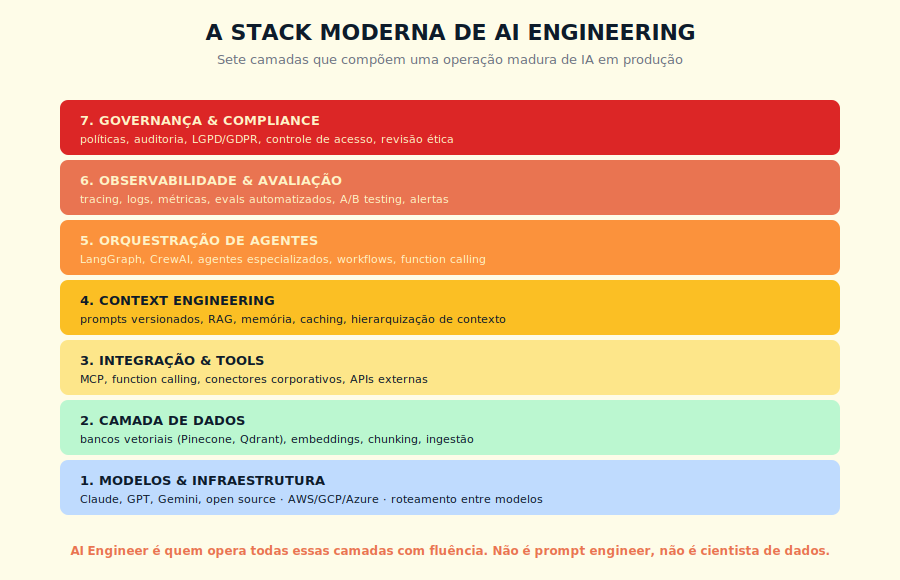
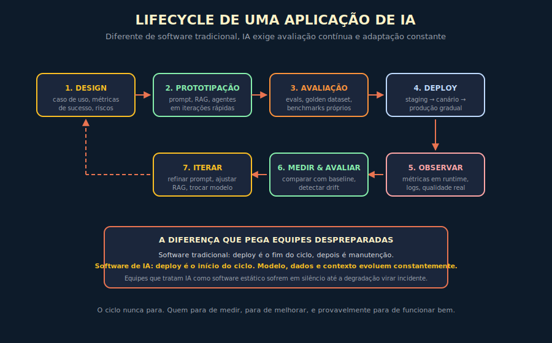

# 14. AI Engineering

---

> *"AI Engineer não é prompt engineer com nome bonito, nem cientista de dados com mais responsabilidade. É uma profissão nova, com disciplina própria, que está sendo criada ao mesmo tempo em que é exercida."*

---
## 14.1 — O CONCEITO INTUITIVO

Existe uma confusão de nomenclatura no mercado de tecnologia em 2026 que vale ser dissolvida logo no início, porque ela está custando contratações erradas e expectativas mal calibradas em organizações pelo mundo todo. As empresas estão buscando "AI Engineers" sem saber direito o que isso significa, e os profissionais estão se chamando de AI Engineers vindos de origens muito diferentes, com lacunas técnicas que só aparecem quando o projeto começa a falhar. A maior parte desse problema vem de uma sobreposição com profissões mais antigas, sendo elas o cientista de dados, o engenheiro de machine learning, e o engenheiro de software, com cada uma cobrindo parte do território mas nenhuma cobrindo tudo.

AI Engineering é a disciplina que emergiu entre 2023 e 2026 para preencher uma lacuna específica, ou seja, a engenharia de sistemas que usam LLMs e modelos de fundação em produção, com tudo que isso implica em termos de arquitetura, observabilidade, avaliação, governança e operação. Não é cientista de dados, porque o foco não está em treinar modelos do zero. Não é engenheiro de ML clássico, porque o material de trabalho é predominantemente LLMs prontos da Anthropic, OpenAI, Google ou open source. Não é engenheiro de software tradicional, porque o sistema tem características que software determinístico não tem, como saída probabilística, drift de qualidade, custo variável por chamada, e necessidade de avaliação contínua.

A profissão tem corpo próprio, ferramentas próprias, padrões próprios, comunidade própria. Quem entende isso constrói times maduros que entregam valor. Quem confunde com profissões adjacentes contrata mal, organiza mal o trabalho, e chega depois ao destino.

---

## 14.2 — ANALOGIA: O ENGENHEIRO DE PONTES E O CONSTRUTOR DE PRÉDIOS

Para entender por que AI Engineering merece nome próprio, considere uma analogia da engenharia civil. Engenheiros civis cobrem um campo amplo, mas dentro desse campo existem especialidades com corpo próprio de conhecimento. Engenheiros de pontes lidam com cargas dinâmicas, vibração de longa duração, exposição a intempéries, custos catastróficos de falha. Engenheiros de prédios lidam com cargas predominantemente estáticas, conforto humano, instalações prediais, custos sérios mas distribuídos no tempo. Os dois usam matemática estrutural, os dois lidam com concreto e aço, mas a forma de pensar, os modelos de simulação, os critérios de segurança e a economia subjacente são distintos o suficiente para justificar especialização formal.

AI Engineering tem essa relação com as disciplinas adjacentes. Compartilha bases com engenharia de software e com ciência de dados, mas as características do material de trabalho são diferentes o suficiente para que ignorar a especialização cause falhas. O sistema produz saída probabilística em vez de determinística. A qualidade pode degradar ao longo do tempo sem que o código mude (drift). O custo por chamada é variável e potencialmente alto. A latência depende de tokens gerados, não apenas de processamento. O comportamento é difícil de testar com testes unitários tradicionais. Cada uma dessas características exige reflexos profissionais próprios, e construir sistemas de IA achando que é só "software com um modelo no meio" produz resultados frágeis e caros.

---

## 14.3 — EXPLICAÇÃO TÉCNICA

> **Glossário do capítulo** — *para o leitor que pode pular esta caixa se já operou AI Engineering em produção*
>
> - **OpenTelemetry GenAI**: extensão do padrão OpenTelemetry para instrumentação específica de aplicações generativas, com convenções semânticas para spans, atributos e eventos de LLM. Em consolidação no W3C desde 2024.
> - **Span de tracing**: unidade de medição de uma operação dentro de um trace distribuído, com duração, atributos e relações de pai-filho. Em pipelines de LLM, cada chamada a modelo, ferramenta ou retrieval costuma virar um span.
> - **Drift silencioso**: degradação de qualidade da aplicação ao longo do tempo, sem alerta explícito do sistema, normalmente causada por mudança no padrão de uso, atualização de modelo subjacente, ou shift na distribuição dos dados de entrada.
> - **Golden set**: conjunto curado de pares input/output esperado, usado como verdade de referência para evals automatizados. Tamanho típico em produção: 100 a 500 entradas, com revisão humana periódica.
> - **Eval harness**: infraestrutura de testes automatizados específica para aplicações de IA, com execução do golden set contra a aplicação real, comparação automatizada e dashboard de regressão. Equivalente, em IA, ao que o test runner é em desenvolvimento clássico.
> - **Sandbox de evals**: ambiente de execução isolado para evals, com dados sintéticos ou mascarados, sem contaminação do ambiente de produção.
> - **Tier de modelo**: classificação interna do portfólio de modelos (econômico, padrão, premium) por custo e capacidade, usada para roteamento de chamadas conforme criticidade da tarefa.

### 14.3.1 — A stack moderna em sete camadas

Uma operação madura de AI Engineering em 2026 envolve sete camadas técnicas que precisam ser dominadas em conjunto. Vou descrever cada uma, em ordem crescente, porque cada camada depende das anteriores estarem bem.

A primeira é a camada de **modelos e infraestrutura**, em que ficam os LLMs propriamente ditos, seja via API de provedores como Anthropic, OpenAI e Google, seja via deploy próprio em AWS, Azure ou GCP. Decisões importantes aqui incluem qual modelo usar para cada tarefa, como rotear entre modelos diferentes conforme complexidade, como gerenciar quotas e fallbacks, e como lidar com indisponibilidade.

A segunda é a camada de **dados**, em que vivem os bancos vetoriais como Pinecone, Qdrant, Weaviate, ChromaDB, junto com os pipelines de ingestão, embedding e chunking que alimentam esses bancos. Sem essa camada bem construída, RAG é fantasia.

A terceira é a camada de **integração e tools**, em que entram as conexões com sistemas externos, idealmente via MCP conforme vimos no Capítulo 13. Function calling, conectores corporativos, APIs externas, tudo que dá ao modelo acesso ao mundo real.

A quarta é a camada de **context engineering**, em que ficam os prompts versionados, a hierarquia de contexto, o caching, as estratégias de compressão e recuperação dinâmica, conforme vimos no Capítulo 11. Sem disciplina aqui, custos explodem e qualidade degrada.

A quinta é a camada de **orquestração de agentes**, com frameworks como LangGraph, CrewAI, AutoGen, gerenciando agentes especializados, workflows complexos, e fluxos multiagente como vimos no Capítulo 12.

A sexta é a camada de **observabilidade e avaliação**, com tracing detalhado de cada chamada, logs estruturados, métricas em tempo real, evals automatizados, A/B testing entre versões, alertas para degradação. Essa camada é onde a maior parte das operações imaturas falha, e vou aprofundar em 14.3.3.

A sétima é a camada de **governança e compliance**, com políticas explícitas, auditoria de uso, controle de acesso, conformidade com LGPD, GDPR e regulações setoriais, revisão ética de aplicações sensíveis. Sem governança madura, IA em escala vira passivo legal e reputacional.

> 📊 **Diagrama 14.1 — A Stack Moderna de AI Engineering**
>
> 
>
> *Sete camadas que precisam funcionar em conjunto. AI Engineer é quem opera todas com fluência.*

### 14.3.2 — O lifecycle de uma aplicação de IA

Diferente de software tradicional, em que o ciclo de vida tem deploy como evento de virada para manutenção, aplicações de IA têm ciclo contínuo em que avaliação e iteração nunca param. Vale descrever esse ciclo com detalhe.

A fase de **design** começa com definição clara do caso de uso, métricas de sucesso mensuráveis, e mapeamento explícito de riscos. Sem critério objetivo de sucesso, é impossível saber se a aplicação está funcionando ou não. Sem mapeamento de risco, decisões de validação humana e de safeguards ficam ad hoc.

A fase de **prototipação** explora rapidamente diferentes abordagens, testando prompt, RAG, agentes em iterações curtas. O ciclo característico aqui é de horas a dias, não de semanas. A intenção é descobrir o que funciona antes de investir em infraestrutura.

A fase de **avaliação** estabelece um conjunto de casos de teste, idealmente um golden dataset com casos representativos rotulados, e benchmarks próprios da organização. Avaliação em IA tem peculiaridades, conforme vou detalhar adiante.

A fase de **deploy** acontece em estágios, com staging primeiro, depois lançamento canário para fração pequena do tráfego, depois rollout gradual conforme métricas se mostram saudáveis. Lançamento abrupto em IA é arriscado, porque o modelo pode se comportar diferente em volume.

A fase de **observação** é passiva: métricas são coletadas em runtime, logs estruturados acumulam, o sistema registra o que acontece. Nada é decidido aqui — o trabalho é garantir que os dados estão chegando e que estão ricos o suficiente para a fase seguinte.

A fase de **medir e avaliar** é ativa: o time compara o que observou contra a baseline esperada, detecta drift de qualidade (degradação ao longo do tempo), e decide o que isso significa para a operação. A distinção importa porque equipes que confundem as duas fases frequentemente têm dashboards impressionantes e degradação silenciosa acumulando — coletam dados mas não interpretam, e descobrem o problema no incidente.

A fase de **iterar** alimenta de volta o ciclo, com refinamentos de prompt, ajustes de RAG, mudanças de modelo, atualizações de tools. O ciclo nunca para, e equipes que param de iterar param de melhorar, com a aplicação degradando silenciosamente até virar incidente.

> 📊 **Diagrama 14.2 — Lifecycle de uma Aplicação de IA**
>
> 
>
> *Software tradicional para depois do deploy. Software de IA acelera depois do deploy.*

### 14.3.3 — Observabilidade e avaliação, o coração da operação

Vou aprofundar essa camada, porque é onde a maior parte das operações imaturas falha, e onde AI Engineer competente faz a maior diferença visível.

**Observabilidade em IA** vai além de logs de erro. Requer tracing distribuído de cada chamada, com cada turno da conversa, cada chamada a tool, cada query a RAG, cada resposta do modelo sendo registrada com metadados ricos. Ferramentas como LangSmith, Helicone, Phoenix Arize, Langfuse, e Datadog com integração IA estão consolidando esse espaço (exemplos correntes — Apêndice J para lista atualizada).

As métricas que importam em runtime incluem latência total e por componente, custo por chamada agregado por funcionalidade, tokens consumidos por camada de contexto, taxa de erro por tool, taxa de fallback entre modelos. Sem esses números visíveis em algum dashboard, qualquer afirmação sobre o sistema funcionar é folclore.

**Avaliação em IA**, ou evals como o termo se consolidou, é outra disciplina que merece atenção. Em software determinístico, testes unitários verificam se entrada X produz saída Y exata. Em IA, a mesma entrada pode produzir saídas válidas em formulações diferentes, e o que importa é se a saída é "boa" segundo critérios mais semânticos que sintáticos.

Existem três grandes famílias de evals em uso em 2026.

A primeira é **evals heurísticos**, em que regras explícitas validam saídas. O JSON está bem formado? A resposta contém os campos esperados? O número está na faixa válida? Funcionam bem para verificações estruturais.

A segunda é **evals com modelo como juiz**, em que outro LLM (frequentemente um modelo menor e mais barato) avalia a qualidade da saída segundo critérios definidos. "Esta resposta aborda a pergunta do usuário? Sim ou não?". Tem boa correlação com avaliação humana quando bem calibrado, custa fração do humano, escala para grandes volumes.

A terceira é **evals com gold standard humano**, em que avaliadores especialistas rotulam um conjunto de casos representativos como referência, e cada nova versão é avaliada contra esses gold standards. É o mais caro, mas o mais confiável para domínios sensíveis.

Operações maduras combinam as três, com heurísticos rodando continuamente, judge model em amostragem regular, e gold standard humano em pontos críticos do ciclo. Sem essa cobertura tripla, mudanças em prompts e modelos viram apostas em vez de decisões informadas.

---

## 14.4 — EXEMPLO MEMORÁVEL: A APLICAÇÃO QUE DEGRADOU EM SILÊNCIO

Uma empresa brasileira de seguros usava, desde 2024, um sistema baseado em Claude para classificar e roteirizar pedidos de sinistro entrantes. O sistema tinha sido construído por uma equipe competente, com prompt bem desenhado, RAG sobre histórico de sinistros, e integração com sistemas internos. Funcionou bem nos primeiros meses, com taxa de roteirização correta acima de 92%, e a equipe celebrou o sucesso e migrou para outros projetos.

Em meados de 2025, em torno de quatorze meses depois do deploy, o time de operações começou a notar reclamações crescentes de clientes sobre demora em resolução de sinistros. Inicialmente atribuíram a problemas operacionais downstream, e levaram cerca de dois meses investigando os processos manuais. Quando finalmente investigaram o sistema de IA, descobriram algo que ninguém estava monitorando, a taxa de roteirização correta tinha caído de 92% para 67% sem que ninguém percebesse.

A investigação revelou três fontes simultâneas de degradação que vale conhecer, porque cada uma é representativa.

A primeira foi **drift de dados**. O perfil de sinistros que entrava em 2025 era diferente do perfil de 2024, com novos tipos de cobertura, novos termos no vocabulário interno, novos padrões de fraude. O prompt e o RAG, congelados em 2024, não acompanharam essa evolução.

A segunda foi **drift de modelo**. A Anthropic havia lançado novas versões de Claude no período, e a equipe tinha mantido apontamento estático para a versão original, que continuava funcionando mas não capturava melhorias significativas que as versões mais recentes traziam para tarefas similares.

A terceira foi **drift silencioso de qualidade**. Sem evals rodando em produção, sem amostragem aleatória sendo avaliada por humanos ou por modelo juiz, o sistema operou por quase um ano sem que ninguém verificasse se a qualidade estava se mantendo. Tudo parecia bem porque ninguém estava medindo.

A solução envolveu três frentes coordenadas. Primeiro, atualização do RAG com sinistros recentes, refinamento do prompt para incorporar vocabulário novo, e migração para a versão atual de Claude. Segundo, implementação de evals automatizados rodando diariamente sobre amostra aleatória da produção, com alertas se a taxa de acerto cair abaixo de threshold. Terceiro, instituição de revisão trimestral formal do sistema, com painel humano avaliando casos selecionados e comparando com baseline.

Após oito semanas dessas correções, a taxa de roteirização voltou para 94%, ligeiramente acima do original. Mas o aprendizado mais valioso foi cultural. **A empresa adotou como princípio que aplicações de IA em produção sem observabilidade contínua não estão em produção, estão em risco operacional latente.** Esse princípio foi internalizado, e nos anos seguintes nenhuma aplicação foi promovida sem instrumentação de evals desde o primeiro dia.

> 🎯 **PARA EXECUTIVOS**
> Aplicações de IA degradam em silêncio se não forem monitoradas, e em organizações com escala, essa degradação se converte em incidentes operacionais que custam muito mais do que custaria manter o sistema bem instrumentado. Observabilidade não é luxo, é controle. Aprovar projetos de IA sem orçamento explícito para evals e monitoring contínuo é entrar em dívida técnica que vai cobrar juros caros.

> **Rigor estatístico do caso.** Medições da seguradora realizadas em janela de seis meses pós-degradação, com aproximadamente 4.000 sinistros analisados retrospectivamente em revisão por par sênior independente, taxa de falso-positivo confirmada por auditoria atuarial, intervalo de confiança 95% sobre a métrica de precisão de triagem, validação cruzada com base do sistema legado em uso simultâneo nos primeiros noventa dias do plano de remediação. Caso composto a partir de padrões observados em mais de uma seguradora do mercado brasileiro — atribuição nominal sugerida para edições futuras, conforme pacto editorial descrito no paratexto "Sobre os casos desta obra".

---

## 14.5 — LLMOPS, A DISCIPLINA OPERACIONAL

Análogo ao MLOps que se consolidou para machine learning clássico, o termo LLMOps emergiu para nomear a disciplina operacional específica para sistemas baseados em LLMs. Vale conhecer os princípios principais.

O primeiro é **versionamento integrado**. Prompts, configurações de RAG, modelos utilizados, parâmetros de geração, tudo deve estar versionado em repositório com histórico rastreável. Mudança em qualquer um desses afeta o comportamento do sistema, e sem versionamento integrado debugar problemas vira arqueologia.

O segundo é **canary e rollout gradual**. Mudanças significativas vão primeiro para fração pequena do tráfego, com métricas comparadas em tempo real entre versão antiga e nova, antes de rollout completo. Cada mudança é uma hipótese sendo testada, não decreto.

O terceiro é **fallback estruturado**. Quando o modelo principal falha ou está indisponível, o sistema deve degradar graciosamente, com modelos alternativos, com respostas padrão, ou com encaminhamento para humano. Sistemas que travam quando o LLM cai são frágeis demais para produção séria.

O quarto é **gestão de custo em runtime**. Aplicações de IA podem ter custo variável significativo, e operações maduras instrumentam controle por usuário, por funcionalidade, por dia, com alertas e cortes automatizados se algo dispara. Receber fatura de surpresa é um luxo que poucas organizações podem absorver duas vezes.

O quinto é **incident response específico de IA**. Quando algo dá errado, qual o playbook? Quem é acionado? Como o problema é diagnosticado? Quanto tempo até resolução esperado? Organizações maduras têm runbooks formais para incidentes de IA, da mesma forma que têm para banco, rede, ou aplicação tradicional.

---

## 14.6 — A NOVA PROFISSÃO, EM PERFIL

Vale terminar com um esboço do que caracteriza um AI Engineer competente, porque isso ajuda em decisões de contratação, de carreira, e de organização de times.

Tecnicamente, AI Engineer combina três fundamentos. Conhecimento sólido de fundamentos da IA moderna, ou seja, o material da Parte 1 deste livro com profundidade real. Habilidade prática de engenharia de software em pelo menos uma linguagem moderna, idealmente Python ou TypeScript. Fluência em pelo menos uma stack de orquestração de agentes e em pelo menos uma plataforma de observabilidade específica para LLMs — as opções correntes em ambas as categorias estão no Apêndice J, porque esse mercado é o que muda mais rápido em todo o ecossistema de IA.

Operacionalmente, AI Engineer pensa em sistemas, não em prompts isolados. Constrói com instrumentação desde o primeiro dia. Versiona prompts e configurações como código. Implementa evals antes de considerar produção. Trata custo como métrica de primeira ordem. Entende governança não como obstáculo mas como parte do design.

Estrategicamente, AI Engineer participa de decisões arquiteturais sobre quando construir versus comprar, quando usar modelo grande versus pequeno, quando vale fine-tuning versus RAG, quando MCP versus integração custom. Não é executor isolado, é arquiteto envolvido em decisões de produto e de tecnologia.

Para quem está em tecnologia e quer se posicionar para os próximos cinco a dez anos, AI Engineering é a especialização mais diretamente alinhada com onde o valor está sendo criado agora. O argumento não é de mercado de trabalho — esse dado envelhece — é estrutural: toda organização que opera IA em produção vai precisar de alguém com esse perfil, e a disciplina ainda é mais escassa que a demanda na maior parte dos mercados.

---

## 14.7 — CONEXÕES COM OUTROS CAPÍTULOS
- **Tokens e gestão de custo**: Capítulo 3
- **RAG, peça central da stack**: Capítulo 6
- **Memória em arquitetura de agentes**: Capítulo 7
- **Context engineering em produção**: Capítulo 11
- **Agentes como abstração principal**: Capítulo 12
- **MCP como padrão de integração**: Capítulo 13
- **Repositórios e ferramentas**: Capítulo 17
- **Economia de tokens em produção**: Capítulo 18
- **Segurança e riscos em aplicações IA**: Capítulo 19

---

## 14.8 — RESUMO EXECUTIVO

| Conceito | Síntese |
|----------|---------|
| **AI Engineering** | Disciplina de engenharia de sistemas baseados em LLMs em produção |
| **Stack em 7 camadas** | Modelos, dados, integração, contexto, orquestração, observabilidade, governança |
| **Lifecycle contínuo** | Design, prototipação, avaliação, deploy, observação, medição, iteração, repete |
| **Drift** | Degradação silenciosa de qualidade ao longo do tempo, sem mudança de código |
| **Evals** | Heurísticos + modelo como juiz + gold standard humano |
| **LLMOps** | Versionamento, canary, fallback, custo, incident response específicos de IA |
| **Perfil profissional** | Fundamentos de IA + engenharia de software + stack de orquestração e observabilidade |

---

## 14.9 — CHECKLIST DO CAPÍTULO

- [ ] Descrever as sete camadas da stack moderna de AI Engineering
- [ ] Distinguir o lifecycle de IA do lifecycle de software tradicional
- [ ] Listar três famílias de evals e quando usar cada uma
- [ ] Reconhecer os cinco princípios de LLMOps
- [ ] Identificar drift de dados, drift de modelo e drift silencioso de qualidade
- [ ] Defender, em uma reunião, por que observabilidade contínua é pré-requisito para aplicações de IA em produção
- [ ] Esboçar o perfil ideal de um AI Engineer para sua organização

---

## 14.10 — PERGUNTAS DE REVISÃO

1. Por que AI Engineer não é o mesmo que cientista de dados nem que engenheiro de ML clássico?
2. O que é drift silencioso de qualidade, e por que ele é especialmente perigoso?
3. Em que situação um evaluador modelo-como-juiz é preferível a um gold standard humano?
4. Por que canary deployment é especialmente importante em IA, comparado a software determinístico?
5. Como você convenceria a diretoria a aprovar orçamento para observabilidade de IA em uma aplicação já em produção?

---

## 14.11 — EXERCÍCIOS PRÁTICOS

### Exercício 1 — Inventário da stack
Para uma aplicação de IA da sua organização, mapeie em qual estado está cada uma das sete camadas. Onde está madura? Onde tem dívida técnica? Onde simplesmente não existe?

### Exercício 2 — Eval mínimo
Para uma aplicação real, construa um eval básico com pelo menos vinte casos rotulados como gold standard. Rode contra a versão atual. Documente o resultado e estabeleça baseline.

### Exercício 3 — Diagnóstico de drift
Investigue uma aplicação de IA da sua organização que esteja em produção há mais de seis meses. Há indícios de drift de qualidade? Como você sabe? Que instrumentação está faltando?

### Exercício 4 — Plano de instrumentação
Esboce um plano para instrumentar uma aplicação de IA atual com observabilidade adequada. Que métricas? Que ferramentas? Que alertas? Estime esforço e benefício.

---

## 14.12 — PROJETO DO CAPÍTULO

**Profissionalize a operação de uma aplicação de IA da sua organização.**

Escolha uma aplicação relevante que sua organização opere hoje. Aplique sistematicamente os princípios deste capítulo. Implemente versionamento de prompts e configurações. Configure observabilidade básica com tracing por chamada. Construa eval mínimo com gold standard. Estabeleça canary e fallback para mudanças futuras. Documente políticas de governança aplicáveis. Esse projeto, se bem executado, costuma ser o que transforma uma aplicação experimental em ativo profissional confiável.

---

## 14.13 — REFERÊNCIAS PRINCIPAIS

📚 **Livros e artigos seminais**

- Chip Huyen. *AI Engineering*. O'Reilly, 2025.
- Andrej Karpathy — palestras e threads sobre disciplina de AI Engineering (2023-2026).
- Hamel Husain. *"What we've learned from a year of building with LLMs"*. 2024.

📚 **Ferramentas**

- [LangSmith](https://www.langchain.com/langsmith) — observabilidade
- [Helicone](https://www.helicone.ai/) — observabilidade
- [Langfuse](https://langfuse.com/) — open source
- [Phoenix Arize](https://phoenix.arize.com/) — open source
- [Braintrust](https://www.braintrust.dev/) — evals

📚 **Comunidades e blogs**

- [Eugene Yan — Patterns for Building LLM-based Systems](https://eugeneyan.com/writing/llm-patterns/)
- [Hamel Husain — blog](https://hamel.dev/)
- [Latent Space podcast](https://www.latent.space/)

---

## 14.14 — Autoavaliação

| # | Critério | Você consegue? |
|---|----------|----------------|
| 1 | **Clareza** — Explicar o que é AI Engineering para um diretor de tecnologia em 90 segundos, diferenciando de profissões adjacentes | ☐ |
| 2 | **Profundidade** — Defender, em discussão técnica, as sete camadas da stack e por que cada uma importa | ☐ |
| 3 | **Aplicação** — Olhar para uma aplicação de IA da sua organização e diagnosticar exatamente em que camadas está madura ou imatura | ☐ |
| 4 | **Conexão** — Articular como AI Engineering integra todos os capítulos anteriores em prática operacional unificada | ☐ |
| 5 | **Curiosidade** — Está com vontade de comparar os principais modelos do mercado para escolher o certo para cada caso de uso | ☐ |

---

> *"Aplicações de IA em produção sem observabilidade não estão em produção, estão em risco operacional latente."*
