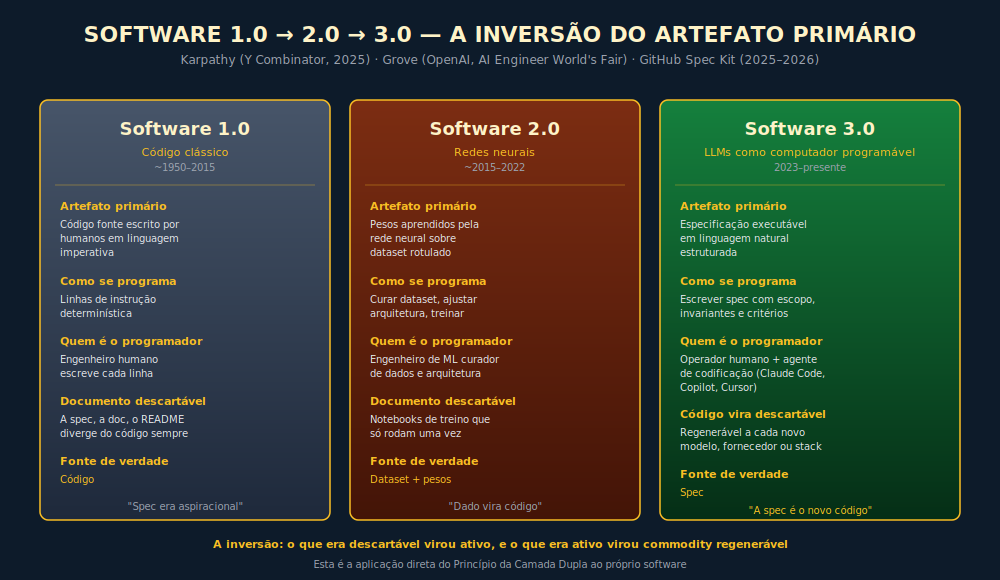
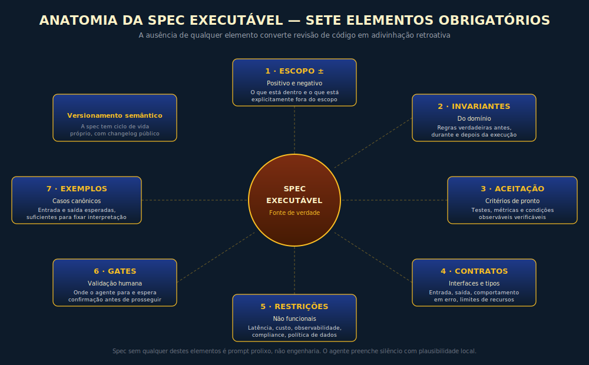
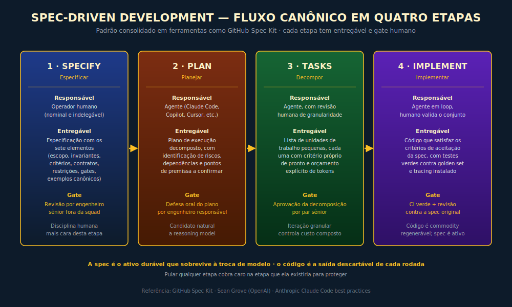

# 14C. Spec-Driven Development — Quando a Especificação Vira o Novo Código

---

> *"Por décadas o código foi a fonte da verdade e a especificação foi documentação descartável. Quando o agente passa a implementar a partir da spec, a relação se inverte: a especificação vira o ativo durável e o código vira a saída descartável de um compilador probabilístico."*

---

A pergunta que toda liderança de engenharia precisa responder em 2026 não é mais "vamos adotar IA na produtividade do time?". A pergunta é "se o agente passa a escrever a maior parte do código, o que continua sendo trabalho humano de fato?". A resposta que está se consolidando, na prática de equipes maduras, é simples e desconfortável: o trabalho humano sobe um nível, e desce do "como construir" para o "o que exatamente construir, com que critério de aceitação, e com que limites de comportamento". Esse novo trabalho tem nome: **Spec-Driven Development**, abreviado SDD, e este capítulo é sobre por que ele importa, como funciona e onde quebra.

> 🧭 **Invariante-mãe:** **Inv. 9 — Operador** — *"A IA multiplica competência e incompetência pelo mesmo fator."*
> Invariantes secundários: **Inv. 3 — Camada Dupla** *(a spec é a camada estável; o código gerado é a volátil)*; **Inv. 6 — Autonomia Proporcional** *(implementação por agente sem gates é dívida latente)*; **Inv. 8 — Responsabilidade Indelegável** *(quem assina a spec assina o resultado)*.
> Framework relacionado: F4 — PROMPT-EX (engenharia de prompt estendida) e F7 — CUSTO-3 (custo composto), instanciados na escrita disciplinada de especificação executável.

---

## 14C.1 — CONCEITO INTUITIVO

> 📊 **Diagrama 14C.1** — Andrej Karpathy formalizou em 2025 a leitura de três eras do software — 1.0 sendo código clássico imperativo, 2.0 sendo redes neurais com pesos aprendidos sobre dataset rotulado, e 3.0 sendo a era em que o LLM funciona como computador programável em linguagem natural, com a especificação assumindo o papel que o código tinha em 1.0 [ver referências para palestra específica]. Sean Grove, pesquisador da OpenAI, propôs em "The New Code" que entre oitenta e noventa por cento do valor de um programador hoje está na "comunicação estruturada" — a proporção é contestável como dado mensurável, mas o argumento direcional é corroborado pela observação de times que adotam SDD: o gargalo migra de "quem escreve código mais rápido" para "quem especifica com mais clareza". Spec-Driven Development é o nome operacional que o mercado deu a essa transição. O diagrama acima é o mapa mental que vale carregar para todo o capítulo.

Spec-Driven Development é a prática de tratar a **especificação executável** como artefato primário de engenharia, com o código como saída secundária gerada por agente a partir dela. Em vez de escrever código que outro humano vai ler, o operador escreve uma especificação que descreve, com precisão suficiente, o comportamento esperado, os invariantes do domínio, os critérios de aceitação, as restrições de segurança e os pontos de validação. O agente então gera a implementação que satisfaz a especificação, e a equipe revisa o conjunto spec mais código contra o critério de aceitação que ela própria definiu.

A inversão é importante e merece nome. No regime anterior, código era a verdade e a documentação era a aproximação que sempre divergia. No regime SDD, a especificação é a verdade e o código é a aproximação que pode ser regenerada quando o modelo, o framework ou a stack mudarem. Essa inversão tem três consequências práticas que aparecem repetidamente em equipes que adotam o método com seriedade: a disciplina de redação da spec passa a ser o gargalo do projeto, o teste de aceitação passa a ser parte da spec e não artefato separado, e o controle de versão da spec ganha o mesmo rigor que o código tinha antes.

Quem trata SDD apenas como "prompt mais longo para o Claude Code" perde o ponto inteiro. SDD é disciplina de engenharia, não técnica de prompt. A spec é onde o operador codifica intenção, critério, restrição e teste, e a qualidade do agente que implementa é a multiplicação da qualidade da spec pela qualidade do modelo. Como o multiplicador do operador é constante por sessão, a única alavanca real é a spec.

> **Por que agora, se isso já foi tentado antes?** A inversão spec/código já foi tentada em décadas anteriores — Design by Contract de Meyer, BDD (Behavior-Driven Development), Literate Programming de Knuth. Nenhuma escalou além de nichos porque o custo de manter a spec sincronizada com o código era maior que o benefício: as duas tinham que coexistir e divergiam continuamente. O que muda com SDD em era de agentes é estrutural: o código é *regenerado* a partir da spec, não coexiste com ela. O custo de sincronização cai a zero porque não há sincronização — há geração. Essa é a diferença que torna a inversão viável pela primeira vez na história da engenharia de software.

---

## 14C.2 — ANALOGIA

Compare com a construção civil. No regime anterior à era do CAD paramétrico, o projeto arquitetônico era desenhado à mão e a obra interpretava, no canteiro, o que cabia em cada esquadro real. Diferenças entre projeto e obra eram absorvidas pelo mestre de obras com discrição. O projeto era referência aspiracional; a obra construída era o que sobrava depois das adaptações. Com o CAD paramétrico, e mais ainda com BIM, o projeto passou a ser executável: cada componente carrega especificação suficiente para que a fabricação seja automática e a montagem siga critério explícito. Mudou o papel do arquiteto — passou de desenhista a especificador — e mudou o papel do engenheiro de obra — passou de improvisador a verificador. A obra ficou mais previsível, e o projeto virou ativo durável que sobrevive ao construtor específico que executou cada edifício.

Spec-Driven Development é a mesma transição na construção de software. A spec é o projeto paramétrico; o agente é a fábrica que monta os componentes; o engenheiro humano é o arquiteto que especifica e o verificador que aprova. O código gerado é o edifício específico daquela rodada; a spec é o projeto que sobrevive ao construtor.

---

## 14C.3 — EXPLICAÇÃO TÉCNICA

### 14C.3.1 — A anatomia de uma spec executável

> 📊 **Diagrama 14C.2** — Os sete elementos não são lista decorativa. Cada um existe porque a ausência específica dele degrada o output do agente em padrão identificável.

Uma especificação digna de servir como fonte de verdade para implementação por agente tem, no mínimo, sete elementos. A ausência de qualquer um dos sete reduz a probabilidade de o agente entregar algo aproveitável, e converte o trabalho de revisão em adivinhação retroativa.

Primeiro, **escopo positivo e negativo**: o que está dentro do escopo desta unidade e o que está explicitamente fora. A negação importa tanto quanto a afirmação, porque o agente preenche silêncio com plausibilidade, e plausibilidade fora de escopo é exatamente a fonte mais comum de retrabalho. Segundo, **invariantes do domínio**: regras que precisam ser verdadeiras antes, durante e depois da execução, expressas como predicados verificáveis. Terceiro, **critérios de aceitação**: como o time saberá que a unidade está pronta, em forma de testes, métricas ou condições observáveis. Quarto, **interfaces e contratos**: tipos de entrada, tipos de saída, comportamento em erro, limites de uso de recursos. Quinto, **restrições não funcionais**: latência, custo, observabilidade, conformidade regulatória, política de dados. Sexto, **pontos de validação humana**: onde o agente para e espera confirmação antes de prosseguir, com gate explícito. Sétimo, **exemplos canônicos**: casos representativos com entrada e saída esperadas, suficientes para fixar interpretação sem virar prescrição de implementação.

A spec não é prosa livre. É artefato estruturado, frequentemente em Markdown disciplinado ou em DSL própria do time, com seções padronizadas e versionamento semântico. A maturidade do time é medida, em parte, pela consistência com que cada spec encaixa nas sete seções.

### 14C.3.2 — O fluxo canônico em quatro etapas

> 📊 **Diagrama 14C.3** — O fluxo das quatro etapas é o que o GitHub Spec Kit, projeto open source lançado pela GitHub em meados de 2025 com integração nativa a trinta plataformas de agente de codificação [estado atual do ecossistema em Apêndice J], materializa em comandos `/specify`, `/plan`, `/tasks` e `/implement`. Cada comando produz um artefato em Markdown que alimenta o próximo, o que dá ao agente contexto estruturado em vez de prompt ad hoc, e que dá à equipe artefato auditável a cada etapa.

O fluxo que consolidou em ferramentas de mercado, exemplificado pelo Spec Kit do GitHub e por padrões adotados em times que usam Claude Code e equivalentes, segue quatro etapas com função distinta. Cada etapa tem entregável próprio, cada uma serve a um propósito específico, e pular qualquer uma costuma cobrar caro adiante.

A primeira etapa é **especificar**: o operador escreve a spec, em linguagem natural estruturada, com os sete elementos acima. Esta é a etapa onde a disciplina humana é mais cara e mais valiosa, porque define todo o resto. Ferramentas que oferecem "geração automática de spec a partir de descrição vaga" são úteis como acelerador, mas a responsabilidade pela spec final é, e tem que continuar sendo, humana e nominal. A segunda etapa é **planejar**: o agente lê a spec e produz um plano de execução decomposto em passos verificáveis, com identificação de riscos, dependências externas e pontos onde precisará confirmar premissa. O plano é revisado pelo humano antes da próxima etapa. A terceira etapa é **decompor em tarefas**: o plano vira lista de unidades de trabalho pequenas o suficiente para que cada uma caiba em um turno de execução do agente, com critério próprio de pronto. A quarta etapa é **implementar**: o agente executa cada tarefa, frequentemente em loop com auto-revisão e teste contra os critérios da spec, e o operador aprova o conjunto contra o critério de aceitação global.

Equipes que tentam saltar etapas — pular para implementação a partir de descrição vaga, ou aprovar plano sem revisão, ou aceitar a implementação sem rodar os critérios da spec — costumam tropeçar exatamente nos pontos que a etapa pulada existiria para proteger.

### 14C.3.3 — Por que a spec sobrevive ao modelo

Uma spec bem escrita é instrumento durável precisamente porque o que ela codifica — intenção, invariante, critério, restrição, teste — não depende de qual modelo a implementa. Quando o agente que hoje é a geração atual da família Claude (versão pontual no Apêndice J) for substituído pelo agente que dois anos adiante será uma família diferente de fornecedor diferente, a spec continua válida e a implementação pode ser regenerada com o novo agente. O esforço cognitivo investido na spec é amortizado por toda a vida útil do sistema, não apenas pela versão do modelo do trimestre. Esta é a aplicação direta do princípio da Camada Dupla: spec é padrão durável; código gerado é número volátil.

A consequência operacional é importante. Times que tratam o código gerado como ativo e a spec como acessório descartável estão otimizando o item errado, e vão pagar a próxima migração de modelo com retrabalho proporcional ao volume de código sob manutenção. Times que tratam a spec como ativo e o código como saída descartável têm caminho de migração razoável: trocar o modelo, regenerar a implementação contra a mesma spec, validar pelo mesmo critério de aceitação. A primeira disciplina escala; a segunda é prisão.

### 14C.3.4 — A relação entre spec, teste e prompt

Em SDD maduro, os três artefatos que pareciam separados começam a se fundir. A spec contém, em si, os testes de aceitação que validam a implementação. O prompt enviado ao agente é, em essência, a spec reformatada para o protocolo de tool calling do modelo escolhido. Em ferramentas como o Spec Kit, o operador escreve a spec em formato canônico, e a ferramenta cuida da tradução para o prompt específico do agente em uso. A consequência é que o trabalho intelectual concentra na spec, e a engenharia de prompt se torna camada de tradução automatizável, não atividade artesanal por sessão.

Isso libera o operador para investir tempo onde ele rende: na clareza do critério, na completude do invariante, na honestidade do escopo negativo. O ganho de produtividade não vem de "o agente escreve código mais rápido", vem de "o operador deixou de escrever código e passou a escrever spec, e a spec rende em todas as próximas regenerações".

### 14C.3.5 — Os três modos de falha mais comuns

Equipes que adotam SDD com superficialidade costumam tropeçar em três pontos previsíveis. Vale nomear cada um e o que faz na prática.

O primeiro é **spec ambígua com aparência de completa**, em que o documento parece detalhado mas deixa decisões críticas implícitas — comportamento em erro, política de retry, ordem de evento concorrente, semântica de null. O agente preenche o silêncio com a interpretação plausível para o modelo, e a interpretação plausível raramente coincide com a intenção do operador em domínio específico. O sintoma é "funcionou nos casos óbvios e quebrou nos casos de borda", e a causa é spec sem invariante explicitado e sem escopo negativo declarado.

O segundo é **ausência de critério de aceitação verificável**, em que a spec descreve comportamento mas não fornece teste que permita ao agente saber quando parou. O agente entrega algo, o humano revisa em modo ad hoc, e o ciclo de retrabalho começa porque cada revisor tem critério implícito diferente. A correção é construir, dentro da spec, os testes que ela exige. SDD sem teste de aceitação na spec é prompt prolixo, não engenharia.

O terceiro é **promoção do agente para autonomia maior do que a observabilidade permite**, em que o operador, animado com o ritmo de entrega, abre permissão de escrita, execução e deploy sem instalar tracing por tarefa, sem versionamento de spec, sem rollback testado. Quando algo falha, ninguém consegue reconstruir o que aconteceu. Esta falha é exatamente a violação do princípio da Autonomia Proporcional aplicada ao novo contexto: o agente SDD funciona com a autonomia que o operador consegue medir e desfazer.

### 14C.3.6 — Onde SDD não cabe

O método tem limite, e operador maduro reconhece os limites antes do mercado os reconhecer por ele. SDD funciona mal em três famílias de tarefa. A primeira é **exploração genuína**, em que o operador não sabe ainda o que quer construir e usa o código como instrumento de descoberta — protótipo de viabilidade, prova de conceito conceitual, experimentação com novo paradigma. Escrever spec antes de saber o que se quer é cerimônia vazia que atrasa o aprendizado real. A segunda é **mudança trivial em código existente**, em que a alteração é tão pequena que a spec custaria mais do que a edição direta. A terceira é **domínio em que o agente já demonstrou, por eval contra golden set específico, que erra mais do que acerta**; ali, SDD não compensa o custo de revisão, e a tarefa pertence a humano até que o eval mude.

Reconhecer onde o método não cabe é parte do método. SDD não é dogma; é ferramenta com perfil próprio, e o operador disciplinado escolhe quando aplicá-la com a mesma seriedade com que escolhe quando aplicar fine-tuning, agente autônomo ou RAG.

### 14C.3.7 — Três peças públicas que materializam o método

Para que o leitor saia desta seção com referências verificáveis, e não apenas com construção conceitual, vale ancorar SDD em três artefatos públicos que materializam o método sob ângulos distintos, e que continuam disponíveis para inspeção independente do leitor.

**GitHub Spec Kit (toolkit).** Lançado em código aberto pela GitHub em meados de 2025, o Spec Kit operacionaliza o fluxo das quatro etapas em comandos `/specify`, `/plan`, `/tasks` e `/implement`, com templates de Markdown que alimentam o próximo passo, com checklists de qualidade embutidos, e com trinta integrações nativas (Copilot, Claude Code, Cursor, Codex, Gemini, Windsurf, Kiro da AWS, Forge e outras), o que permite trocar o agente sem trocar a spec. A escolha editorial relevante do projeto é tratar a spec como artefato versionável no mesmo repositório do código, sob `/specs/<feature>/`, com cada etapa produzindo um arquivo separado que sobrevive ao código gerado. A Microsoft passou a documentar publicamente o uso do Spec Kit em times internos a partir de 2026, com post oficial em `developer.microsoft.com/blog/spec-driven-development-spec-kit` descrevendo a curva de adoção, os anti-padrões observados e as métricas de produtividade colhidas. Ler esse material é o caminho mais curto para o operador brasileiro entender o que de fato muda no dia a dia da squad que adota o método.

**OpenAI Model Spec (espécie viva de spec).** Em 8 de maio de 2024 a OpenAI publicou o primeiro Model Spec, documento em linguagem natural que descreve, em forma de Markdown estruturado, o comportamento esperado dos modelos da casa em situações sensíveis — recusa, política de conteúdo, hierarquia entre regras do sistema e do usuário, interpretação de ambiguidade. O documento é mantido como espécie viva, com versionamento público no GitHub e contribuição de áreas internas distintas (produto, jurídico, segurança, pesquisa, política). O ponto que vale grifar para o operador é que a OpenAI usou o próprio Model Spec como evidência da tese de Sean Grove em "The New Code": a especificação não é só artefato de desenvolvimento, é artefato organizacional que permite que áreas não-técnicas (compliance, jurídico, segurança) participem da definição do comportamento de um sistema crítico, sem precisar escrever código. O Model Spec é, ele próprio, a prova de conceito de que spec em linguagem natural pode ser fonte de verdade para sistema de produção em escala.

**Anthropic Claude Code best practices (workflow).** A Anthropic publicou em 2025 e atualizou ao longo de 2026 um conjunto de práticas recomendadas para uso disciplinado de Claude Code em fluxo profissional, com ênfase em três pontos que convergem com SDD: a importância do `CLAUDE.md` no topo do repositório como arquivo de contexto persistente (que é, em essência, uma spec organizacional aplicada ao próprio repositório), o uso de planos explícitos antes de aceitar mudanças (`/plan` antes de `/edit`), e a disciplina de auditoria do diff gerado contra critério da spec. Para o operador que vai pilotar SDD com Claude Code, esse documento é leitura mandatória antes do primeiro ciclo, e voltar a ele a cada três meses costuma render mais do que ler novo paper conceitual sobre o tema.

A leitura conjunta dos três artefatos entrega ao operador algo que nenhum sozinho entrega: a triangulação entre toolkit (Spec Kit), exemplo organizacional vivo (Model Spec) e padrão de uso disciplinado (Anthropic best practices). Quem adotar SDD em sua organização sem passar por essa triangulação está reinventando a roda em pública desvantagem competitiva.

---

## 14C.4 — EXEMPLO MEMORÁVEL

> ⚠️ **Cenário ilustrativo** — composto pedagógico calibrado a partir de padrões observados em times brasileiros de engenharia em fintech, healthtech e B2B SaaS durante 2025 e 2026. Não identifica empresa específica.

Uma fintech brasileira de cerca de trezentos colaboradores, com uma diretoria técnica recém-reorganizada, decidiu acelerar a entrega de uma reformulação inteira do módulo de cobrança recorrente, com migração para arquitetura nova de eventos, novos pontos de integração com PSP, e mudança na política de tentativa de retry para cartões com falha temporária. O escopo era grande, o prazo era apertado, e o head de engenharia tomou uma decisão arquitetural que custaria caro adiante: iria pilotar Spec-Driven Development na squad de quatro engenheiros designada ao módulo, e usaria a velocidade ganha como argumento para escalar a prática.

Nas três primeiras semanas, o ritmo foi eufórico. A squad gerou cerca de quatro vezes o volume de código que entregaria sem agente, e o time de produto ficou impressionado com a velocidade. O head de engenharia preparou apresentação para o conselho técnico interno mostrando "produtividade quadruplicada via SDD". O CTO, mais cético, pediu que a apresentação esperasse um ciclo de eval contra a carga real do módulo antigo.

O eval mostrou três coisas. Primeiro, dos sete fluxos críticos do módulo, dois tinham regressão silenciosa em casos de borda específicos — exatamente os casos em que a spec original não havia declarado invariante explícito sobre concorrência entre webhooks duplicados do PSP. Segundo, o consumo de tokens no ciclo de iteração havia subido sete vezes em relação à estimativa inicial, porque a squad havia caído no padrão de "regenerar a implementação inteira a cada ajuste pequeno" em vez de versionar a spec em incrementos isolados. Terceiro, dois dos quatro engenheiros tinham começado a aceitar o plano do agente sem revisão crítica, com o argumento de que "o plano parecia razoável", e isso havia introduzido decisões arquiteturais em dois pontos que ninguém na squad seria capaz de defender em discussão técnica com um arquiteto sênior.

O CTO interrompeu o piloto, e fez três coisas em sequência. Primeiro, instituiu revisão obrigatória da spec por engenheiro sênior fora da squad antes de qualquer geração de código, com critério explícito para os sete elementos da anatomia. Segundo, definiu que a granularidade de iteração seria por tarefa decomposta, nunca por regeneração inteira, e estabeleceu orçamento de tokens por unidade. Terceiro, instituiu que o plano gerado pelo agente teria que ser defendido oralmente pelo engenheiro responsável antes de aprovação, em sessão curta de cinco minutos por plano. As três medidas reduziram o ritmo de entrega para cerca de duas vezes o baseline anterior, em vez das quatro vezes iniciais, mas eliminaram a regressão silenciosa, derrubaram o custo de token pela metade, e devolveram a competência arquitetural ao time.

A lição estrutural não está em "SDD não funciona" nem em "SDD é o futuro". A lição é que **SDD multiplica a competência operacional pelo mesmo fator que multiplica a incompetência**, e a única alavanca durável é a disciplina do operador na escrita da spec, na revisão do plano e na instalação dos gates de observabilidade. O time da fintech havia caído na ilusão clássica do operador que confunde velocidade com produtividade, e quase pagou em incidente o que estava ganhando em ritmo. A intervenção do CTO foi, em essência, a aplicação simultânea do princípio do Operador, da Autonomia Proporcional e do Termômetro a uma prática nova que os três princípios já cobriam.

> 🎯 **PARA EXECUTIVOS**
> A pergunta "estamos adotando SDD?" é menos importante do que "instalamos a disciplina de spec antes de soltar o agente?". Líderes técnicos que confundem velocidade de entrega com produtividade institucional vão repetir o piloto desta fintech em escala maior. O retorno real do método aparece quando a spec passa a ser ativo versionado e revisado, e o código gerado passa a ser saída descartável regenerável a cada modelo novo.

---

## 14C.5 — QUANDO USAR E QUANDO EVITAR

| Situação | Adoção recomendada |
|---|---|
| Construção nova de módulo com escopo razoavelmente fechado | Sim, em modo piloto com revisão sênior obrigatória |
| Refatoração ampla com critério de aceitação claro | Sim, com spec construída a partir do comportamento existente codificado |
| Sistema crítico em produção com SLA apertado | Sim, mas com promoção gradual de autonomia e gates múltiplos |
| Domínio regulado (financeiro, saúde, jurídico) | Sim, com revisor de domínio na cadeia obrigatória |
| Exploração genuína / prova de conceito | Não, custo da cerimônia supera o ganho |
| Mudança trivial em código existente | Não, edição direta é mais barata |
| Time sem disciplina de revisão de código pré-existente | Não, instalar a disciplina primeiro, adotar SDD depois |
| Domínio onde o eval do agente mostrou erro recorrente | Não, até o eval mudar |

---

## 14C.6 — VANTAGENS E LIMITAÇÕES

| Vantagem | Limitação |
|---|---|
| Spec sobrevive à troca de modelo e fornecedor | Curva de adoção exige redesenho do processo de engenharia |
| Volume de código gerado libera tempo do engenheiro sênior | Risco real de promoção de autonomia além da observabilidade |
| Critério de aceitação codificado reduz ambiguidade na revisão | Custo de token cresce rápido sem disciplina de iteração granular |
| Documentação e código deixam de divergir, porque a spec é a fonte | Spec mal escrita gera implementação plausível mas errada com confiança |
| Acelera entrada de júnior em código complexo via leitura de spec | Pode reduzir aprendizado profundo se o júnior pular a etapa de implementar |
| Compatível com pipeline de CI tradicional, com gates por critério | Em times sem cultura de teste, o método amplifica a falha em vez de corrigir |
| Versionamento da spec permite arqueologia de decisão arquitetural | Spec ambígua é difícil de auditar e o agente preenche com plausibilidade local |

---

## 14C.7 — CONEXÕES

- 🔗 **AI Engineering como disciplina operacional** → Capítulo 14 — AI Engineering. SDD é a prática que mais transforma a stack de AI Engineering em ativo durável de produto.
- 🔗 **Reasoning Models para etapas de planejamento** → Capítulo 14B — Reasoning Models. A etapa de planejamento em SDD é candidato natural a reasoning model dedicado, com auditoria de faithfulness no plano antes da execução.
- 🔗 **Agentes e autonomia** → Capítulo 12 — Agentes de IA. SDD é, em essência, a forma disciplinada de operar agente de codificação em ambiente que importa.
- 🔗 **Engenharia de prompt como tradução** → Capítulo 9 — Engenharia de Prompt. Em SDD maduro, o prompt vira camada de tradução da spec, não artefato artesanal por sessão.
- 🔗 **Engenharia de contexto como infraestrutura** → Capítulo 11 — Context Engineering. A spec é o item de contexto mais carregado da sessão de codificação por agente.
- 🔗 **Evals como cláusula da spec** → Capítulo 21 — Evals. Os critérios de aceitação da spec são exatamente o que o golden set do eval mede.
- 🔗 **LLMOps e versionamento** → Capítulo 22 — LLMOps. A spec entra no ciclo de versionamento, observabilidade e deploy junto com o prompt.
- 🔗 **Economia de tokens em iteração granular** → Capítulo 18 — Economia de Tokens. A disciplina de regenerar por tarefa, e não por módulo inteiro, é a alavanca de custo composto mais negligenciada.

---

## 14C.8 — RESUMO EXECUTIVO

| Eixo | Síntese de 30 segundos |
|---|---|
| **O que é** | Prática de engenharia que trata a especificação executável como artefato primário, com código como saída regenerável pelo agente a partir dela |
| **Por que importa** | Inverte a relação spec/código: spec vira ativo durável que sobrevive à troca de modelo; código vira commodity da rodada |
| **Como funciona** | Quatro etapas — especificar, planejar, decompor, implementar — com revisão humana em pontos de gate explícitos |
| **Quando usar** | Construção nova com escopo fechado; refatoração com critério claro; sistemas críticos com gates instalados |
| **Quando evitar** | Exploração genuína; mudança trivial; time sem disciplina de revisão; domínio com eval ruim do agente |
| **Riscos** | Spec ambígua com aparência de completa; ausência de critério de aceitação verificável; promoção de autonomia além da observabilidade |
| **Lei do método** | A spec multiplica a competência do operador pelo mesmo fator que multiplica a incompetência. Disciplina é a única alavanca |

---

## 14C.9 — CHECKLIST DO CAPÍTULO

- [ ] Diferenciar Spec-Driven Development de "prompt mais longo para o agente", com critério estrutural
- [ ] Listar os sete elementos obrigatórios de uma spec executável e justificar cada um
- [ ] Descrever as quatro etapas do fluxo canônico e o que cada uma protege
- [ ] Identificar, em um projeto atual da sua organização, três pontos onde SDD reduziria retrabalho e três onde introduziria fricção
- [ ] Mapear os três modos de falha mais comuns e os contraindicadores para cada um
- [ ] Defender, em uma reunião arquitetural, por que a spec é o ativo durável e o código é a saída descartável
- [ ] *(Avançado)* Articular como SDD instancia os Invariantes 9 (Operador), 3 (Camada Dupla), 6 (Autonomia Proporcional) e 8 (Responsabilidade Indelegável), e esboçar um piloto de quatro semanas com critério de sucesso explícito antes de começar

---

## 14C.10 — PERGUNTAS DE REVISÃO

1. Por que a inversão entre código e spec como fonte de verdade é uma decisão arquitetural, e não apenas uma escolha de ferramenta?
2. Quais são os sete elementos mínimos de uma spec executável, e o que acontece quando cada um está ausente?
3. Em que situações o escopo negativo é mais importante que o escopo positivo, e por quê?
4. Como a etapa de planejamento, intermediada por agente, se relaciona com o uso de reasoning model dedicado?
5. Por que tratar o código gerado como ativo, e não como saída descartável, é uma forma de violar a Camada Dupla?
6. Em que três famílias de tarefa SDD não compensa o custo da cerimônia, e como o operador maduro reconhece cada uma antes de começar?
7. Que disciplinas operacionais um time precisa ter instaladas antes de SDD render, em vez de amplificar problemas existentes?

---

## 14C.11 — EXERCÍCIOS PRÁTICOS

### Exercício 1 — Reescrita de spec
Pegue um documento de requisitos recente da sua organização — PRD, ticket grande, escopo de epic — e reescreva-o no formato dos sete elementos da seção 14C.3.1. Identifique, em revisão própria, em quais dos sete a versão original era ambígua, omissa ou contraditória. Documente o que mudou na sua percepção do escopo após a reescrita.

### Exercício 2 — Spec com critério de aceitação executável
Para uma feature pequena que vá entrar no roadmap próximo, escreva spec completa com critérios de aceitação na forma de testes verificáveis. Submeta a spec, sem o código, a um par de engenharia, e peça que descreva o que entenderia que deveria ser construído. Mensure a distância entre a sua intenção e a interpretação dele. Onde houver distância maior, ajuste a spec até a distância cair para zero.

### Exercício 3 — Piloto controlado
Desenhe um piloto de quatro semanas em uma squad pequena, com escopo realista. Defina, antes de começar, os critérios de sucesso, os tetos de orçamento de token, os gates de revisão obrigatórios, e os indicadores que vão ser comparados com o baseline anterior. Conduza o piloto. Ao fim, produza relatório de decisão articulando, com dados, se a prática escala para o restante da engenharia.

### Exercício 4 — Auditoria de promoção de autonomia
Em uma aplicação atual em que sua organização usa agente para gerar código, audite o nível de autonomia concedido contra a observabilidade existente. Identifique pelo menos um ponto em que a autonomia excede a capacidade de medir ou desfazer. Proponha o gate correspondente, com proprietário nominal e prazo de implementação.

---

## 14C.12 — PROJETO DO CAPÍTULO

**Institua Spec-Driven Development em uma squad piloto, com instrumentação completa e relatório de decisão pós-piloto.**

Escolha uma squad com maturidade de engenharia razoável e um módulo com escopo bem delimitado. Estabeleça o template de spec a partir dos sete elementos da seção 14C.3.1, adaptado à linguagem da sua organização. Instale, antes de começar, a revisão de spec por engenheiro sênior fora da squad, o controle de versão da spec com o mesmo rigor do código, o orçamento explícito de token por unidade de iteração, e o gate de defesa oral do plano por engenheiro responsável. Conduza o piloto por seis a oito semanas, em paralelo com a operação tradicional em uma squad de baseline comparável. Instrumente: tempo entre spec aprovada e código aceito, volume e custo de token por entrega, taxa de regressão em eval contra golden set, número de revisões necessárias por entrega, satisfação técnica do time após cinco semanas. Ao fim, produza relatório de decisão para a liderança técnica articulando se a prática escala, em que escopo, com que disciplina prévia, e quais são os contraindicadores específicos do contexto da sua organização. Esse projeto vai te ensinar mais sobre SDD em duas semanas do que cinco horas de leitura, e vai produzir, como subproduto, o template de spec que sua engenharia precisará nos próximos anos.

---

## 14C.13 — REFERÊNCIAS PRINCIPAIS

📚 **Fontes primárias**

- GitHub. *Spec Kit — Toolkit for Spec-Driven Development*. → github.com/github/spec-kit. Toolkit de referência que materializa o fluxo canônico em quatro etapas (specify, plan, tasks, implement) com integração nativa a Claude Code, Cursor, Copilot, Gemini, Codex, Windsurf, Kiro, Forge e outros agentes (trinta integrações no fim de 2026). Aberto pela GitHub em meados de 2025, ultrapassou noventa mil estrelas no GitHub em 2026.
- Microsoft for Developers. *Diving Into Spec-Driven Development With GitHub Spec Kit*. → developer.microsoft.com/blog/spec-driven-development-spec-kit. Post oficial Microsoft com curva de adoção interna, anti-padrões observados e métricas de produtividade.
- Sean Grove (OpenAI). *"The New Code"* — palestra pública na AI Engineer World's Fair (2025), com tese de que oitenta a noventa por cento do valor do programador está em comunicação estruturada (entender, distilar, planejar, validar) e dez a vinte por cento em código. Vídeo público em YouTube com transcrição disponível.
- OpenAI. *Model Spec* (2024–presente). → github.com/openai/model_spec. Documento vivo em Markdown estruturado descrevendo comportamento esperado dos modelos OpenAI, mantido por áreas múltiplas (produto, jurídico, segurança, pesquisa, política). Materializa em escala a tese de spec como artefato organizacional.
- Andrej Karpathy. *"Software is Changing (Again)"* — keynote no Y Combinator AI Startup School, junho de 2025, com a formalização das três eras Software 1.0 / 2.0 / 3.0 e do conceito de "vibe coding". Disponível em vídeo e transcrição.
- Anthropic. *Claude Code — Best practices for engineering teams*. Documentação oficial sobre uso disciplinado de agentes de codificação em fluxo profissional, com ênfase em `CLAUDE.md` como spec organizacional, planos explícitos antes de mudanças e auditoria do diff contra critério.

📚 **Fundamentação conceitual**

- Knuth, D. *Literate Programming* (1984). Predecessor conceitual fundamental: a ideia de que o programa é, antes de tudo, um documento legível para humanos, com o código como artefato derivado.
- Meyer, B. *Object-Oriented Software Construction* (2ª ed., 1997), seções sobre Design by Contract. Predecessor metodológico: pré-condições, pós-condições e invariantes como cláusulas executáveis embutidas no código.
- Karpathy, A. *Software 3.0*. Conjunto de palestras públicas (2023–2025) sobre a transição do código humano para o código gerado por LLM e o papel emergente do operador como especificador.

📚 **Práticas e ferramental**

- Anthropic Cookbook — exemplos práticos de pipelines com Claude e tool use em fluxos próximos a SDD.
- Plataformas de revisão automatizada de PR geradas por agente (CodeRabbit, Greptile, Graphite e similares) — instrumentação complementar ao critério de aceitação codificado na spec.

📚 **Apêndice Vivo**

- Apêndice J — Trilha do Número, seção Ferramentas de SDD, com versões correntes, integrações suportadas e benchmarks comparativos atualizados. Tudo o que envolve versão específica de ferramenta, custo unitário ou comparação de modelo mora lá, não neste capítulo.

---

## 14C.14 — Autoavaliação

| # | Critério | Você consegue? |
|---|----------|----------------|
| 1 | **Clareza** — Explicar Spec-Driven Development para um CTO em três minutos, usando a analogia do projeto paramétrico em construção civil, e diferenciando do uso ad hoc de agente de codificação | ☐ |
| 2 | **Profundidade** — Defender, em discussão técnica, por que a spec é o ativo durável e o código é a saída descartável, e como essa inversão se ancora no princípio da Camada Dupla | ☐ |
| 3 | **Aplicação** — Identificar, na sua organização, uma squad e um módulo onde um piloto de SDD de quatro a oito semanas teria condição realista de sucesso, com critério explícito antes de começar | ☐ |
| 4 | **Conexão** — Articular como SDD instancia simultaneamente os Invariantes 9 (Operador), 3 (Camada Dupla), 6 (Autonomia Proporcional) e 8 (Responsabilidade Indelegável), e como se conecta com Caps 9, 11, 12, 14, 14B, 21 e 22 | ☐ |
| 5 | **Curiosidade ativa** — Está com vontade de redesenhar o template de spec da sua engenharia a partir dos sete elementos, ou de propor o piloto controlado para sua liderança técnica nos próximos catorze dias | ☐ |

**5 de 5?** Avance para o Capítulo 15 sobre comparação de modelos, onde a escolha do modelo certo para cada tarefa ganha critério estruturado.
**3 ou 4?** Releia a seção 14C.3 inteira. É onde a mecânica do método se ancora.
**Menos de 3?** O capítulo merece releitura completa, especialmente se sua organização está prestes a adotar agente de codificação em escala sem instalar a disciplina antes.

---

🎉 **Você acabou de fechar a Parte 3 — Agentes e IA Moderna.**

---

> *"O código deixou de ser onde a competência mora. Passou a ser onde ela aparece. A competência mora agora na spec, e quem entender essa inversão lidera a próxima década de engenharia de software."*
