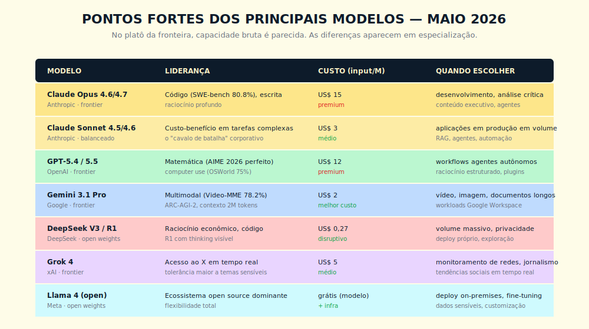
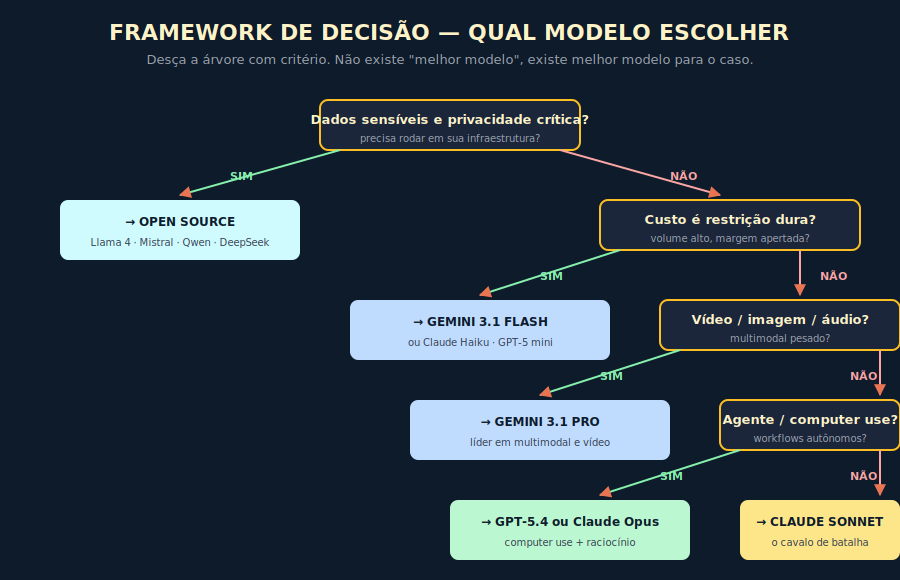

# 15. Comparação dos Principais Modelos

---

> *"No platô da fronteira, a pergunta não é mais qual modelo é o melhor. É qual modelo é o certo para esta tarefa específica, com este orçamento, com estas restrições."*

---
## 15.1 — O CONCEITO INTUITIVO

Existe uma pergunta que aparece em quase toda reunião executiva sobre IA, e que tem variações sutis mas todas erradas pelo mesmo motivo. Alguém pergunta "qual o melhor modelo?", esperando uma resposta direta e definitiva, como se houvesse um vencedor universal que dispensa análise específica. Em 2022, essa pergunta ainda tinha sentido, porque havia clara hierarquia de capacidade entre os modelos disponíveis. No regime atual, descrito no Capítulo 1 como "platô da fronteira", a pergunta deixou de ser produtiva, e quem ainda a faz nessa forma está olhando para o problema com lente desatualizada.

A realidade técnica que precisa ser internalizada é que os melhores modelos do mundo convergem em capacidade bruta para uma faixa relativamente próxima, com diferenças entre as famílias premium dos três grandes laboratórios proprietários sendo marginais em benchmarks gerais e significativas apenas em especializações específicas. Isso muda a natureza da decisão. Em vez de buscar o "campeão", o trabalho passou a ser mapear forças e fraquezas relativas de cada família, conhecer as características de cada tarefa, e escolher com critério em vez de fanatismo.

A boa notícia para quem está começando agora é que essa escolha bem feita rende muito. Mesmo organizações com volume modesto, ao adotar roteamento inteligente entre modelos em vez de usar um único modelo para tudo, costumam reduzir custo de forma expressiva mantendo ou melhorando qualidade. A má notícia é que a maioria das organizações ainda opera com escolha intuitiva, frequentemente herdada do primeiro modelo que alguém testou, e paga preço alto por essa inércia.

---

## 15.2 — ANALOGIA: A FROTA DE VEÍCULOS DA EMPRESA

Pense em como uma empresa logística pensa sobre sua frota de veículos. Ela não compra apenas um tipo de caminhão e usa para tudo. Para entregas urbanas pequenas, usa vans leves. Para cargas pesadas em longas distâncias, usa carretas. Para entregas em última milha em vielas estreitas, usa motos ou triciclos. Para cargas refrigeradas, usa frota especializada. Cada veículo é otimizado para um tipo de tarefa, e a operação madura sabe roteirizar a carga certa para o veículo certo, em tempo real.

Modelos de IA seguem lógica similar. Existe um modelo grande e premium ideal para tarefas que exigem raciocínio profundo, análise crítica ou escrita executiva, em que o custo por chamada é justificado pela qualidade da saída. Existe um modelo balanceado ideal para o grosso da operação, em que custo e qualidade precisam se equilibrar. Existe um modelo pequeno e barato ideal para tarefas simples em altíssimo volume, em que economia escala dramaticamente. Existe um modelo multimodal nativo ideal para vídeo e imagem. Existe um modelo open source ideal para dados sensíveis que não podem sair da infraestrutura. Cada um tem seu lugar, e a maturidade está em saber rotear, não em escolher um único.

A mentalidade que produz desperdício é tratar o modelo como commodity, comprando um único e usando indiscriminadamente. A mentalidade que produz vantagem é tratar o modelo como ferramenta especializada, com frota gerenciada em volta de critérios técnicos e econômicos claros.

---

## 15.3 — EXPLICAÇÃO TÉCNICA

### 15.3.1 — O panorama por padrão de especialização

Os grandes laboratórios proprietários — Anthropic, OpenAI e Google DeepMind — operam famílias de modelos em pelo menos três tiers: premium (raciocínio profundo, tarefas de fronteira), balanceado (produção corporativa no grosso) e compacto (volume, latência, custo). Cada família tende a exibir força relativa em um eixo dominante: código e escrita executiva, raciocínio matemático e agência, multimodalidade e contexto longo. No campo open source, laboratórios como Meta, DeepSeek, Mistral, Alibaba e outros mantêm famílias com licenças variadas (MIT, Apache 2.0, licenças proprietárias com restrição) e forças específicas em custo-benefício, soberania de dado e fine-tuning — detalhados no Capítulo 16.

Os nomes de modelos, versões, estrutura de tiers e forças relativas mudam a cada lançamento e não pertencem ao papel.

> **Camada viva.** Esta seção ensina o método; os números que mudam (modelos, versões, forças relativas por benchmark) vivem no **Apêndice Vivo da série**, atualizado mensalmente no repositório de recursos da obra (github.com/falercia/inteligencia-aumentada-recursos → `apendice-vivo`). Consulte lá a versão corrente antes de decidir.

> 📊 **Diagrama 15.1 — Eixos de Especialização por Família**
>
> 
>
> *No platô da fronteira, capacidade bruta é parecida. As diferenças aparecem em especialização por eixo.*

### 15.3.2 — As três grandes dimensões de comparação

Para comparar modelos com critério, vale separar três dimensões que costumam ser confundidas em discussões superficiais.

A primeira é **capacidade**, que é o quanto o modelo consegue executar tarefas complexas com qualidade. No regime de platô, os frontier proprietários operam em faixa próxima, com cada família exibindo força relativa em um eixo diferente. Modelos open source variam por domínio e geração — a distância para o frontier proprietário encolhe a cada ciclo de lançamento. Para casos que exigem raciocínio de fronteira, o premium proprietário frequentemente ainda vale o preço; para casos mais comuns, a diferença começa a não justificar custo. Os números específicos de cada rodada envelhecem em meses e devem ser consultados nas fichas técnicas atuais dos fornecedores e no Apêndice Vivo.

A segunda é **economia**, que envolve custo por token, latência média, e escalabilidade de quota. O frontier premium costuma operar em faixa significativamente mais cara que os modelos balanceados, e estes, por sua vez, em faixa significativamente mais cara que os modelos pequenos e os open source rodando em infraestrutura própria. A regra de bolso, em vez de decorar preço por milhão (que muda em meses), é desenhar o stack assumindo três tiers e rotear cada chamada ao mais barato suficiente, conforme o **Framework Custo Composto em Três Tempos** (Cap 18).

A terceira é **alinhamento e segurança**, que cobre como o modelo responde a pedidos problemáticos, o quanto ele é manipulável via prompt injection, e o cuidado do laboratório com riscos sistêmicos. Anthropic se posiciona explicitamente como líder em alinhamento via Constitutional AI, com filosofia pública e investimento massivo em interpretabilidade. OpenAI tem práticas de segurança maduras com posicionamento público menos centrado em segurança. Google segue padrões corporativos sólidos. Modelos open source variam enormemente, com alguns tendo menos restrição que os frontier proprietários, o que pode ser vantagem ou desvantagem dependendo do caso. Para domínio sensível (saúde, jurídico, financeiro, educação), a filosofia de alignment do vendor pesa mais do que o benchmark do mês, conforme se aprofunda no Capítulo 23 — Alignment.

### 15.3.3 — Os benchmarks que importam, lidos como padrão

A era em que um único número resumia capacidade do modelo já passou. MMLU, que era a referência em 2023, saturou e perdeu poder discriminatório. O benchmark sucessor seguirá o mesmo destino. O exercício útil não é decorar a liderança atual — é entender **o que cada categoria de benchmark mede**, para saber quais são relevantes ao seu caso.

As categorias duráveis de benchmark e o que medem:

**Raciocínio científico de fronteira** — perguntas de nível doutorado em física, química, biologia. Mede até onde o modelo vai sem memorização. Exemplo de referência: GPQA Diamond.

**Engenharia de software em ambiente real** — capacidade de resolver issues reais de repositório público, com testes que passam. O mais próximo do trabalho de engenharia cotidiano. Exemplos de referência: SWE-bench Verified, SWE-bench Pro.

**Raciocínio matemático formal** — matemática competitiva avançada, com raciocínio em múltiplas etapas. Exemplos de referência: AIME, MATH.

**Raciocínio abstrato visual** — padrões que resistem à memorização porque dependem de inferência sobre forma, não de conteúdo treinado. Exemplo de referência: ARC-AGI.

**Agência em software (computer use)** — capacidade de operar um sistema operacional como humano faria. Mede agência aplicada a software de terceiros. Exemplo de referência: OSWorld.

**Multimodalidade temporal** — compreensão de vídeo. Exemplo de referência: Video-MME.

**Fronteira geral de expert** — benchmarks compostos que exigem expertise de ponta em múltiplos domínios. Costumam ser os mais discriminatórios em janelas curtas antes de saturar.

A lição prática: olhar para um único número é miopia. Olhar para a combinação de categorias relevantes ao seu caso de uso é o caminho. Modelos diferentes brilham em categorias diferentes, e essa heterogeneidade é o que justifica roteamento — princípio operacional do **Framework Diagnóstico de Encaixe entre Tarefa e Modelo** (Invariante 4).

> **Camada viva.** Os benchmarks específicos, líderes correntes por categoria e scores numerados vivem no **Apêndice Vivo da série** (github.com/falercia/inteligencia-aumentada-recursos → `apendice-vivo`). Consulte lá antes de citar um número em reunião.

---

## 15.4 — FRAMEWORK DE DECISÃO — Diagnóstico de Encaixe entre Tarefa e Modelo

O framework opera em árvore de perguntas, descendo conforme critérios concretos. Em cada nó, a resposta é sobre **padrão de tarefa**, não sobre o lançamento da semana.

**Pergunta 1 — Dados sensíveis exigem rodar em sua infraestrutura?** Se sim, modelos open source são o caminho. As famílias candidatas e seus comparativos correntes estão no Capítulo 16 e no Apêndice Vivo.

**Pergunta 2 — Custo é restrição dura, com volume alto e margem apertada?** Se sim, considere as variantes compactas e econômicas dos frontier proprietários, ou open source self-hosted. A escolha entre elas depende do eixo dominante (latência, qualidade em volume, custo-benefício multimodal). O ranking corrente está no Apêndice Vivo.

**Pergunta 3 — A tarefa envolve vídeo, imagem ou áudio em volume significativo?** Se sim, identifique o frontier com força em multimodalidade nativa no momento da decisão — essa categoria tende a ser dominada por uma família específica a cada ciclo. Consulte o Apêndice Vivo para o líder corrente.

**Pergunta 4 — O sistema vai operar como agente autônomo, com computer use ou workflows complexos de várias etapas?** Se sim, identifique qual família demonstra força em benchmarks de agência (computer use, resolução de issues de software) no momento. A decisão passa pelo tipo de ferramenta que o agente vai operar e pelas integrações nativas disponíveis.

**Pergunta 5 — Nenhuma das anteriores cravou?** A variante balanceada da família frontier escolhida (não premium, não compacta) costuma ser o ponto de partida padrão para aplicações corporativas em produção. Cada grande família tem seu tier de equilíbrio entre capacidade, custo, latência e ecossistema.

| Eixo | O que pontuar | Como identificar o líder |
|------|---------------|--------------------------|
| **Raciocínio complexo** | Tarefas que exigem múltiplas etapas com auditoria do percurso | Benchmarks de raciocínio científico e formal |
| **Código** | Edição de código real, com testes e contexto longo | Benchmarks de engenharia em repositório real (SWE-bench e equivalentes) |
| **Contexto longo** | Análise de documentos extensos ou bases volumosas | Tamanho de janela de contexto declarado pelo provedor |
| **Multimodal** | Vídeo, imagem, áudio nativos | Benchmarks de multimodalidade temporal (Video-MME e equivalentes) |
| **Custo crítico** | Volume altíssimo, margem apertada | Preço por milhão de tokens dos tiers compactos e open source — Apêndice Vivo |

> **Camada viva.** Os nomes específicos de modelos, versões e famílias que lideram cada eixo mudam a cada ciclo de lançamento. Consulte o **Apêndice Vivo da série** (github.com/falercia/inteligencia-aumentada-recursos → `apendice-vivo`) para o mapeamento corrente antes de decidir.

Esses padrões de eixo mudam pouco entre gerações. Os líderes concretos de cada eixo mudam toda rodada e devem ser consultados separadamente.

> 📊 **Diagrama 15.2 — Framework de Decisão**
>
> 
>
> *Desça a árvore com critério. Não existe "melhor modelo", existe melhor modelo para o caso.*

Esse framework tem uma virtude que vale destacar. Ele torna a decisão articulável e auditável, em vez de ser intuição mascarada de análise técnica. Quando alguém propõe migrar para o lançamento da semana, você consegue perguntar "passamos pelas perguntas anteriores?" e exigir justificativa de cada decisão. Isso muda a qualidade da conversa em organizações em que escolhas de modelo costumavam ser orientadas por preferência pessoal de quem propôs.

---

## 15.5 — EXEMPLO MEMORÁVEL: A EMPRESA QUE ECONOMIZOU US$ 380 MIL COM ROTEAMENTO

> ⚠️ **Cenário ilustrativo** — composto a partir de padrões observados em operações reais de fintech brasileira; números e nomes são realistas mas não identificam empresa específica.

Uma fintech brasileira de cartão de crédito operava toda sua infraestrutura de IA com o modelo premium do frontier proprietário disponível na época, escolhido inicialmente por entregar a melhor qualidade em testes iniciais. O sistema tinha cerca de meio milhão de chamadas mensais, cobrindo desde análise de risco de crédito até suporte ao cliente, passando por classificação automática de transações suspeitas e redação de comunicados regulatórios. A conta mensal estava em torno de US$ 47 mil dólares, com tendência de crescimento conforme o produto escalava.

Uma consultoria foi contratada para auditar a operação de IA e identificar oportunidades de economia. A descoberta principal não foi sobre prompts ou caching, foi sobre roteamento. A empresa estava usando o modelo mais caro do mercado para tarefas que poderiam rodar em modelos significativamente mais baratos sem perda de qualidade.

A análise classificou as chamadas em quatro categorias de complexidade.

A **categoria 1**, com cerca de 60% do volume, era composta de tarefas simples estruturadas como classificação de transações ("essa compra é categoria alimentação ou transporte?"), extração de dados de mensagens curtas, validação de campos em formulários. Para essas, testes mostraram que o modelo compacto da mesma família entregava qualidade praticamente idêntica ao premium, ao custo de fração baixa do preço.

A **categoria 2**, com cerca de 25% do volume, era composta de tarefas moderadas como redação de respostas padrão a clientes, sumarização de tickets, análise inicial de fraude. Para essas, o modelo balanceado da mesma família entregava qualidade equivalente ao premium em testes cegos com avaliadores humanos, ao custo significativamente menor.

A **categoria 3**, com cerca de 12% do volume, era composta de tarefas complexas como análise de risco crítico, redação de comunicados regulatórios para o Banco Central, e investigação aprofundada de fraude. Para essas, o premium continuava sendo a melhor escolha, e o custo se justificava pela qualidade.

A **categoria 4**, com cerca de 3% do volume, era composta de tarefas com vídeo ou imagem (verificação de documentos com foto). Para essas, migrar para o frontier com força em multimodalidade entregou qualidade superior a custo menor.

A implementação do roteamento levou cerca de três semanas. Construíram um classificador leve no início do pipeline — ele próprio rodando no tier compacto mais barato — que olhava cada chamada e decidia para qual modelo encaminhar. O classificador em si rodava por uma fração de centavo, e o roteamento decidia onde gastar.

O resultado, três meses após estabilização, foi reducão de US$ 47 mil para cerca de US$ 15,5 mil mensais, ou seja, economia de US$ 380 mil anualizada, mantendo a qualidade percebida pelos usuários em todas as categorias. Mais importante, a empresa ganhou flexibilidade arquitetural, podendo trocar modelos em cada categoria conforme novas versões aparecem, sem refazer a aplicação inteira.

A lição estrutural não foi sobre escolher o modelo certo no momento zero, foi sobre arquitetura. **Sistemas maduros de IA tratam modelo como configuração, não como decisão de fundação. Quando você consegue trocar modelos por categoria sem reescrever a aplicação, ganha capacidade de otimizar continuamente conforme o mercado evolui.** Em uma indústria que lança modelos novos a cada três meses, essa flexibilidade vira vantagem competitiva real.

> 🎯 **PARA EXECUTIVOS**
> Se sua organização usa um único modelo para tudo, é altamente provável que esteja pagando entre 3x e 8x mais do que precisaria para a qualidade que entrega. Implementar roteamento entre modelos por categoria de tarefa é um dos investimentos com maior ROI imediato em qualquer operação de IA em escala.

---

## 15.6 — TENDÊNCIAS QUE VALEM ACOMPANHAR

Vale terminar com três tendências em curso que vão afetar decisões de modelo nos próximos dois ou três anos.

A primeira é a **comoditização gradual da capacidade frontier**. Modelos open source estão fechando o gap com frontier proprietários em ritmo acelerado, e a cada ciclo há paridade em mais tarefas comuns. O que hoje é frontier tende a virar commodity acessível em hardware modesto dentro de alguns anos, enquanto o frontier do momento se desloca para um patamar qualitativamente diferente. Decisões arquiteturais que assumem dependência permanente de um provedor específico provavelmente vão envelhecer mal.

A segunda é a **proliferação de modelos especializados**. Em vez de um modelo gigante que faz tudo, cresce o número de modelos menores otimizados para domínios específicos — código, medicina, direito, biologia. Em muitos casos, esses modelos especializados superam frontier generalistas em seus domínios, ao custo de fração do preço. Organizações que operam em domínios específicos se beneficiam de avaliar essas alternativas verticais.

A terceira é a **integração com hardware específico**. NPUs em laptops, GPUs especializadas em data centers e chips dedicados de provedores de nuvem estão mudando a economia de inferência. Modelos que rodam bem em hardware específico podem ter custo radicalmente diferente em produção, e essa dimensão entrou definitivamente no critério de decisão. Os chips e provedores relevantes mudam a cada ciclo de hardware — consulte o Apêndice Vivo para o mapeamento corrente.

---

## 15.7 — CONEXÕES COM OUTROS CAPÍTULOS
- **Como modelos funcionam por dentro**: Capítulo 2
- **Tokens e custo de operação**: Capítulo 3
- **Fine-tuning como alternativa a trocar de modelo**: Capítulo 8
- **AI Engineering e roteamento entre modelos**: Capítulo 14
- **Modelos open source em profundidade**: Capítulo 16
- **Todos os modelos Claude e como escolher**: no Livro 2
- **Economia de tokens em produção**: Capítulo 18

---

## 15.8 — RESUMO EXECUTIVO

| Conceito | Síntese |
|----------|---------|
| **Platô da fronteira** | Capacidade bruta dos frontier converge; diferenças aparecem em especialização por eixo |
| **Frontier proprietários** | Grandes laboratórios operam famílias em três tiers; líderes e versões correntes no Apêndice Vivo |
| **Frontier open source** | Famílias com licenças variadas (MIT, Apache, restrita); comparativo corrente no Apêndice Vivo |
| **Eixos de especialização** | Código/escrita, matemática/agência, multimodal/contexto longo — cada família tende a liderar em um |
| **Forças relativas** | Mudam a cada ciclo de lançamento — consultar Apêndice Vivo antes de decidir |
| **Framework de decisão** | Diagnóstico de Encaixe entre Tarefa e Modelo: sensibilidade → custo → multimodal → agência → default balanceado |
| **Roteamento inteligente** | Reduz custo de forma expressiva sem perda de qualidade; arquitetural, não de prompt |
| **Onde estão os números** | Versões, preços, benchmarks e rankings no Apêndice Vivo (github.com/falercia/inteligencia-aumentada-recursos → `apendice-vivo`) |

---

## 15.9 — CHECKLIST DO CAPÍTULO

- [ ] Aplicar o Diagnóstico de Encaixe entre Tarefa e Modelo a um caso real, descendo a árvore pelas cinco perguntas sem depender de memorização de rankings correntes
- [ ] Distinguir as três dimensões de comparação (capacidade, economia, alinhamento)
- [ ] Reconhecer as categorias de benchmark que diferenciam frontier e mapear quais são relevantes para o seu caso de uso
- [ ] Aplicar o framework de decisão para um caso real
- [ ] Defender, em uma reunião, por que usar um único modelo para tudo é desperdício
- [ ] Identificar três tendências em curso que vão afetar escolhas nos próximos anos

---

## 15.10 — PERGUNTAS DE REVISÃO

1. Por que MMLU perdeu poder discriminatório como benchmark, e que padrão se repete com benchmarks sucessores?
2. Em que situação um modelo Gemini Pro é a escolha mais clara, e por quê o eixo "multimodal" tende a manter essa força entre gerações?
3. Como você decidiria entre o frontier premium centrado em código e o frontier com força em agência para um sistema de agentes autônomos? Quais perguntas do Diagnóstico de Encaixe entre Tarefa e Modelo você usaria?
4. Por que roteamento entre modelos costuma render mais que negociar desconto com um único provedor?
5. Que tendência você acompanha mais de perto, e como ela afeta decisões de longo prazo da sua organização?

---

## 15.11 — EXERCÍCIOS PRÁTICOS

### Exercício 1 — Inventário e classificação
Liste as chamadas de IA da sua organização nos últimos 30 dias, agregadas por funcionalidade. Classifique cada uma em uma de quatro categorias de complexidade. Estime potencial de economia se aplicar roteamento.

### Exercício 2 — Comparação de saída
Pegue cinco prompts representativos da sua operação. Rode cada um em três modelos diferentes de famílias distintas — um de cada grande laboratório, no tier balanceado. Versões pontuais no Apêndice Vivo (github.com/falercia/inteligencia-aumentada-recursos → `apendice-vivo`). Compare qualidade às cegas, sem saber qual produziu qual. Documente o resultado.

### Exercício 3 — Análise de benchmark relevante
Identifique qual categoria de benchmark melhor representa o tipo de tarefa que sua organização executa em IA. Pesquise como cada frontier se sai nessa categoria (Apêndice Vivo para ranking corrente). Use isso como input para decisões de roteamento.

### Exercício 4 — Esboço de roteador
Para uma aplicação real, esboce a lógica de um roteador. Que sinais usar para classificar a chamada? Que mapeamento de categoria para modelo aplicar? Estime ganho potencial.

---

## 15.12 — PROJETO DO CAPÍTULO

**Implemente roteamento entre modelos em uma aplicação real.**

Escolha a aplicação de IA com maior volume da sua organização. Implemente um roteador simples no início do pipeline, classificando cada chamada em três a quatro categorias de complexidade. Mapeie cada categoria para um modelo apropriado. Execute em paralelo com a configuração antiga por duas semanas, comparando custo, latência e qualidade. Documente o resultado. Esse projeto, mesmo em escala modesta, costuma render entre 30% e 70% de economia mantendo qualidade, e prepara terreno conceitual para todas as decisões de modelo futuras.

---

## 15.13 — REFERÊNCIAS PRINCIPAIS

📚 **Leaderboards e benchmarks**

- [Vellum LLM Leaderboard](https://www.vellum.ai/llm-leaderboard)
- [Artificial Analysis](https://artificialanalysis.ai/leaderboards/models)
- [LM Council Benchmarks](https://lmcouncil.ai/benchmarks)
- [LMSYS Chatbot Arena](https://lmarena.ai/)

📚 **Papers sobre benchmarks atuais**

- *"GPQA: A Graduate-Level Google-Proof Q&A Benchmark"*. 2023.
- *"SWE-bench: Can Language Models Resolve Real-World GitHub Issues?"*. 2023.
- *"ARC-AGI-2: Abstract Reasoning Corpus, second generation"*. 2024.
- *"OSWorld: Benchmarking Multimodal Agents for Open-Ended Tasks in Real Computer Environments"*. 2024.

📚 **Documentação dos provedores**

- [Anthropic Models](https://docs.claude.com/en/docs/about-claude/models)
- [OpenAI Models](https://platform.openai.com/docs/models)
- [Google Gemini](https://ai.google.dev/gemini-api/docs/models/gemini)
- [DeepSeek API](https://api-docs.deepseek.com/)

---

## 15.14 — Autoavaliação

| # | Critério | Você consegue? |
|---|----------|----------------|
| 1 | **Clareza** — Explicar por que não existe "melhor modelo" para um executivo em 90 segundos, usando a analogia da frota | ☐ |
| 2 | **Profundidade** — Defender, em discussão técnica, escolha de modelo para um caso real, citando benchmarks relevantes | ☐ |
| 3 | **Aplicação** — Aplicar o framework de decisão a três casos reais da sua organização | ☐ |
| 4 | **Conexão** — Articular como escolha de modelo se conecta com tokens (Cap 3), fine-tuning (Cap 8), AI Engineering (Cap 14), open source (Cap 16) | ☐ |
| 5 | **Curiosidade** — Está com vontade de entender em profundidade o ecossistema open source, suas vantagens reais e suas armadilhas | ☐ |

---

---

> *"Em 2026, escolher modelo não é decisão de fundação, é decisão de roteamento. Quem entende isso opera com flexibilidade. Quem ignora, paga conta de quem opera."*
