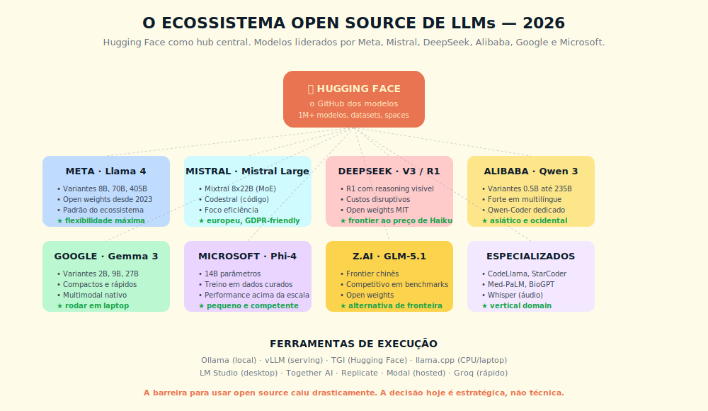
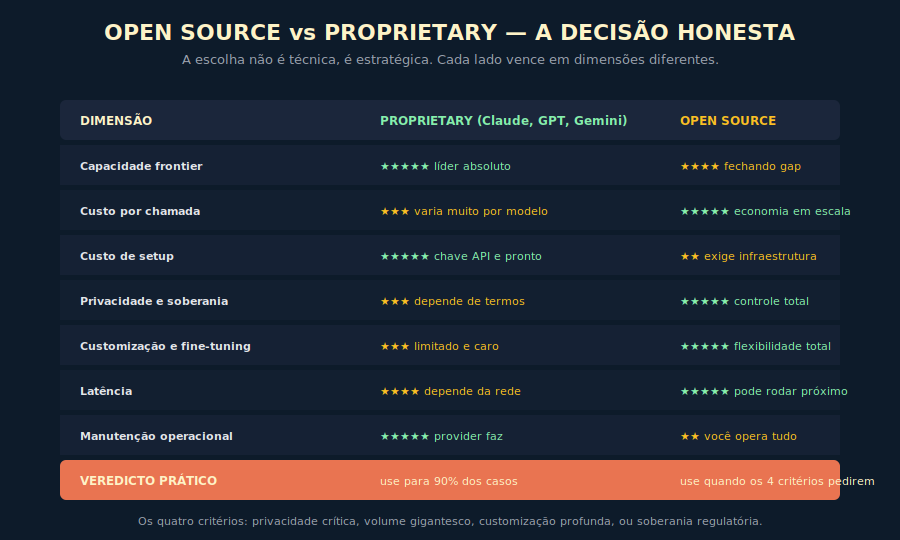

# 16. Open Source em IA
*A virada de 2024-2026 e a rota dupla que evita tanto lock-in quanto teatro de soberania*

---

> *"Open source em IA deixou de ser alternativa barata de qualidade inferior e virou fronteira competitiva. Quem o trata como bandeira ideológica perde o cliente; quem opera com rota dupla calibrada por trade-off mensurado chega ao fim do ano com TCO honesto e soberania efetiva."*

---

## 16.1 — Conceito intuitivo: a virada de 2024-2026

Existe uma narrativa pública sobre open source em IA que precisa ser atualizada com honestidade, e a forma de atualizar é distinguir o discurso de três janelas temporais sucessivas. Na janela de 2020 a 2022, open source em modelos de linguagem era alternativa de qualidade marcadamente inferior, com gap visível em qualquer benchmark sério, com o uso justificando-se apenas em pesquisa acadêmica, em prototipação leve, em casos em que o requisito de soberania era tão crítico que o gap de qualidade entrava como custo aceito. Na janela de 2023, o Llama 2 e o Mistral abriram o caminho para que open source virasse alternativa viável em casos específicos, com qualidade próxima da fronteira proprietária em tarefas particulares, ainda com gap em capacidades complexas. Na janela de 2024 a 2026, três eventos compostos reescreveram a relação. Primeiro, o DeepSeek V3 chegou em dezembro de 2024 com arquitetura Mixture of Experts (671 bilhões de parâmetros totais, 37 bilhões ativos por token), com qualidade próxima do GPT-4o em benchmarks centrais, com custo de treino que a comunidade técnica considerou ordem de grandeza menor do que o esperado, com pesos liberados em licença MIT que permite uso comercial irrestrito. Segundo, o DeepSeek R1 (DeepSeek-AI, 2025; publicado na Nature, vol. 645, pp. 633–638, e como arXiv:2501.12948), em janeiro de 2025, demonstrou que raciocínio em janela longa, com chain-of-thought visível, podia ser entregue em modelo open weights com qualidade comparável à do o1 da OpenAI. Terceiro, a família Llama 3.3 da Meta, o Mistral Large 2, o Qwen 2.5 da Alibaba e a evolução da família Phi da Microsoft consolidaram o campo, com pelo menos quatro famílias open source em 2026 entregando qualidade aceitável para uso corporativo sério.

A consequência estrutural dessa virada não foi anunciada pelos provedores proprietários por razões óbvias de incentivo, e ainda não foi totalmente internalizada por parte do mercado brasileiro, que opera com mapas de 2023. Em 2026 open source é, com critério explícito, fronteira de qualidade em pelo menos três categorias de tarefa (raciocínio matemático, geração de código, multilíngue incluindo português), com gap mensurável apenas em tarefas de fronteira específica em que o investimento massivo dos laboratórios proprietários ainda entrega vantagem, e com custo de inferência self-hosted que, em volumes saturados, é fração do custo de API proprietária equivalente.

Este capítulo é a transposição dessa virada em decisão operacional. Não é exercício de bandeira, com pregação de adoção universal de open source que ignora os custos compostos do self-hosting, nem é exercício de conservadorismo, com defesa de API exclusiva que ignora a soberania, a regulação e o ponto de virada econômico. É a entrega do critério, com a matriz de quando faz sentido cada rota, com a aritmética honesta do TCO em contexto brasileiro, com a arquitetura híbrida que materializa a Rota Dupla em produção.

## 16.2 — Analogia: a frota de carros corporativa em 2026

Pense em como uma empresa brasileira decide a frota corporativa em 2026, e perceba que a discussão evoluiu radicalmente nos últimos cinco anos. Em 2020, frota própria significava carro de combustão com manutenção previsível em concessionária, com curva de custo conhecida, e aplicativo de transporte significava Uber em estágio inicial com confiabilidade variável. Em 2026, frota própria pode significar carro elétrico, com bateria, com posto de recarga corporativo, com vida útil que justifica o capex inicial, com economia operacional brutal em volume saturado mas com complexidade técnica nova que o time de operações não dominava; e aplicativo de transporte significa serviço maduro, com previsibilidade alta, com cobertura nacional, com custo unitário que em volume baixo é claramente menor que o TCO da frota própria. A discussão deixou de ser "frota é melhor" ou "Uber é melhor", e virou "qual mistura faz sentido para nosso volume, nossa rota, nossa janela de operação, nosso requisito regulatório".

A analogia com open source × API em IA é direta em quatro pontos. Primeiro, a virada tecnológica reorganizou a matriz, com open source em 2026 sendo competitivo em qualidade da forma como carro elétrico em 2026 é competitivo em desempenho, e a decisão precisa partir do mapa atual, não do mapa de 2022. Segundo, o ponto de virada econômico depende do volume saturado, com a fronteira sendo, em ordem de grandeza, "usuário com menos de cem requisições por dia" claramente em API e "usuário com mais de dez mil requisições por dia" justificando análise séria de self-hosting, e a zona intermediária exigindo arquitetura híbrida. Terceiro, o requisito regulatório, em 2026 com LGPD em maturação e com as orientações da ANPD sobre IA generativa (versão corrente a verificar em fonte oficial — Apêndice J), desloca a fronteira em favor de open source self-hosted em território nacional para classes específicas de dado pessoal sensível. Quarto, a maturidade do time é variável estrutural, com a operação de self-hosting exigindo competência específica em inferência, em quantização, em observabilidade de GPU, em otimização de batching, e essa competência tem custo de aquisição que entra no TCO honesto.

A próxima seção desce ao detalhe técnico da matriz.

## 16.3 — Explicação técnica

### 16.3.1 — A família competitiva de modelos open source

O ecossistema de modelos open weights é mais denso do que a maioria do mercado brasileiro percebe. O operador profissional precisa conhecer os critérios de avaliação, não a lista estática.

Os **critérios duráveis para avaliar qualquer família open source** são:

**Licença.** O tipo de licença determina o que é permitido em uso comercial. Licenças permissivas (MIT, Apache 2.0) autorizam uso irrestrito incluindo produto comercial. Licenças com restrição (Meta Llama Community License, Gemma Terms, outras) impõem condições específicas que exigem leitura jurídica antes da adoção. Licença ausente significa, na prática, "todos os direitos reservados". A pergunta de licença é a primeira pergunta técnica e não pode ser delegada ao engenheiro sem revisão do jurídico interno.

**Origem e jurisdição.** Modelos de laboratórios em diferentes jurisdições geográficas trazem discussões distintas sobre confiança institucional e viés no dado de treino. Modelo rodando em infraestrutura própria não transmite dado de inferência ao laboratório de origem — a discussão é sobre confiança no modelo treinado, não sobre canal de dado ativo.

**Qualidade por eixo e força em português.** Famílias diferentes exibem força relativa em raciocínio, em código, em multilíngue incluindo português brasileiro. Benchmarks em PT-BR são o melhor indicador para o operador nacional.

**Integração com ferramentas de inferência.** Compatibilidade com vLLM, SGLang, HuggingFace TGI e equivalentes é prerrequisito para operação séria. A ausência de integração madura multiplica o custo de adoção.

**Variantes de tamanho disponíveis.** Famílias que oferecem variantes de 7B a 70B+ permitem calibrar qualidade, hardware e custo para cada caso. Família com apenas modelo gigante é inviável para PME com hardware modesto.

As famílias open source relevantes e seus comparativos correntes — versões, benchmarks, licenças, hardware mínimo recomendado — mudam a cada ciclo de lançamento.

> **Camada viva.** Esta seção ensina o método de avaliar famílias open source; a lista corrente de famílias competitivas (versões, licenças, benchmarks, forças relativas) vive no **Apêndice Vivo da série**, atualizado mensalmente no repositório de recursos da obra (github.com/falercia/inteligencia-aumentada-recursos → `apendice-vivo`). Consulte lá a versão corrente antes de decidir sobre adoção.

### 16.3.2 — Open weights × open source de verdade

A distinção que o mercado brasileiro frequentemente confunde, com custo composto em decisão jurídica e em comunicação corporativa, é entre **open weights** e **open source no sentido estrito**. A diferença não é semântica, é operacional.

**Open source no sentido estrito da OSI.** A definição da Open Source Initiative exige que o software seja livre para uso, estudo, modificação e redistribuição, em qualquer propósito incluindo comercial, sem discriminação por campo de aplicação, sem restrição contratual oculta. Em modelos de IA, a definição estrita exigiria liberação não apenas dos pesos, mas também do código de treino, dos dados de treino, dos parâmetros de hiperparâmetros, do processo de fine-tuning, com licença que permita reprodução integral do modelo. Pelos critérios estritos, quase nenhum modelo grande atual é open source verdadeiro, porque os dados de treino raramente são liberados na íntegra, e o custo de treino do zero é proibitivo mesmo com tudo liberado.

**Open weights.** A definição prática que se consolidou no mercado é a liberação dos pesos do modelo treinado, em formato consumível, com licença que permite uso comercial, com ou sem liberação do código de treino, sem liberação completa dos dados. Esta é a categoria em que DeepSeek, Llama, Mistral e Qwen operam.

**Licenças específicas com restrição.** Algumas famílias adicionam restrição contratual que limita uso comercial em condições específicas. Llama tem o piso de 700 milhões de usuários ativos mensais que aciona licença separada. Algumas licenças proíbem uso em treinamento de modelos competidores. Algumas exigem atribuição visível. A verificação de cada licença, antes da adoção, é obrigatória.

A regra prática para a organização brasileira: tratar a categoria "open weights com licença permissiva" (MIT, Apache 2.0) como categoria útil para uso corporativo sem fricção jurídica significativa, tratar a categoria "open weights com restrição" como categoria que exige leitura jurídica caso a caso, e tratar a expectativa de "open source no sentido estrito" como expectativa que quase nunca se materializa em modelo de fronteira em 2026, com a única exceção parcial sendo projetos de pesquisa acadêmica com dados públicos.

### 16.3.3 — Quantização: a alavanca que permite PME brasileira rodar modelo grande em uma única GPU

A barreira histórica para self-hosting de modelo grande era a necessidade de hardware massivo, com modelos de 70B parâmetros em precisão FP16 exigindo ao menos 140 GB de VRAM, com o que significava múltiplas GPUs H100 ou variantes equivalentes, com custo de capex ou de cloud que excluía a maioria das PMEs. A virada técnica que reorganizou esse mapa é a quantização, com técnicas que reduzem a precisão dos pesos do modelo com perda de qualidade controlada, com o efeito de tornar o modelo executável em hardware significativamente menor.

**INT8 (quantização para 8 bits).** A precisão dos pesos é reduzida de FP16 (16 bits por parâmetro) para INT8, com redução do footprint de memória pela metade. Em modelo de 70B, isso significa cerca de 70 GB, que cabe em uma única H100 de 80 GB. A perda de qualidade em benchmarks típicos é da ordem de 1% a 3%, em geral imperceptível na operação corrente. A técnica é madura, com suporte nativo em vLLM, em Hugging Face Transformers, em SGLang.

**INT4 (quantização para 4 bits).** A precisão é reduzida a INT4, com redução do footprint para um quarto do original. Em modelo de 70B, isso significa cerca de 35 GB, que cabe em uma única RTX 4090 (24 GB com offload) ou em uma A100 de 40 GB com folga. A perda de qualidade é maior, da ordem de 3% a 8% dependendo do benchmark, em geral aceitável em tarefa típica de chatbot, em geração de código, em RAG. A técnica exige calibração mais cuidadosa, com escolha de método (GPTQ, AWQ, GGUF) impactando o resultado.

**AWQ (Activation-aware Weight Quantization).** Variante que considera a distribuição de ativações durante a quantização, com qualidade superior em INT4 comparada com métodos genéricos. Padrão atual em produção séria.

**GPTQ.** Método clássico de quantização pós-treino, com boa qualidade, com tempo de quantização maior, com suporte amplo em ferramentas.

A consequência operacional para a PME brasileira é estrutural. Um modelo de fronteira open source em quantização INT4 com AWQ roda em uma única GPU de classe H100 com folga para batching, com throughput suficiente para atender operação de PME com centenas a poucos milhares de requisições por hora. A barreira de entrada caiu, e a aritmética do TCO precisa ser refeita com o mapa de hardware e preços correntes.

> **Camada viva.** O custo de aluguel de GPU por hora em provedores brasileiros e internacionais muda com frequência. Consulte o **Apêndice Vivo** (github.com/falercia/inteligencia-aumentada-recursos → `apendice-vivo`) para a tabela de preços correntes de hardware antes de montar a planilha de TCO.

### 16.3.4 — Distilação como caminho prático

Para a organização que precisa de modelo específico, com custo de inferência baixíssimo, e que tem volume justificando o esforço, a distilação é a técnica que materializa o trade-off de forma elegante. O método tem duas variantes principais.

**Distilação clássica.** Um modelo grande (professor) gera um dataset de exemplos resolvidos, e um modelo pequeno (aluno) é treinado sobre esse dataset com objetivo de imitar o comportamento do professor. O aluno fica menor (em geral, ordem de grandeza menor), mais rápido, mais barato de operar, com qualidade na tarefa específica próxima da do professor. A técnica é madura, com aplicação em produção desde 2020 em ML clássico, com adaptação direta para LLM.

**Distilação de raciocínio.** Variante específica para modelos de raciocínio (DeepSeek R1, OpenAI o1), em que o professor gera não apenas a resposta mas também o raciocínio explícito, e o aluno é treinado para reproduzir o raciocínio em modelo menor. O DeepSeek publicou em 2025 variantes destiladas do R1 em tamanhos de 1.5B a 70B, com qualidade impressionante para o footprint, e a técnica virou referência para distilação de raciocínio.

A regra prática: distilação faz sentido quando a organização tem (a) volume de inferência justificando o esforço de treino e operação, (b) tarefa suficientemente específica para que o aluno especializado entregue qualidade aceitável, (c) competência de ML para conduzir o treino com qualidade. Para a maioria das PMEs brasileiras em 2026, distilação é projeto de oportunidade, não de necessidade, com o caminho mais comum sendo adoção de modelo open weights já existente em variante de tamanho adequado.

### 16.3.5 — Soberania de dados como driver brasileiro

A LGPD, em vigor desde 2020 e em maturação contínua, e as orientações da ANPD sobre IA generativa (segundo o divulgado, com versão corrente a verificar em www.gov.br/anpd conforme Apêndice J — Trilha do Número), criaram um vetor de decisão que é estruturalmente diferente do vetor de custo, e que importa especificamente para organizações brasileiras que processam dado pessoal sensível.

**LGPD e tratamento de dado pessoal.** A LGPD exige base legal para tratamento de dado pessoal, exige finalidade específica declarada, exige medidas técnicas e organizacionais que protejam o dado, exige direito do titular ao acesso, à portabilidade, à eliminação. Em arquitetura de IA que envia dado de cliente para API de provedor estrangeiro, o tratamento inclui transferência internacional de dado, com a exigência adicional de adequação do país de destino conforme o Art. 33 da LGPD, ou de cláusulas contratuais específicas, ou de consentimento específico do titular. A complexidade jurídica de operar com API estrangeira para dado pessoal sensível, em 2026, é significativa e crescente.

**Nota Técnica da ANPD sobre IA generativa.** A ANPD publicou orientação em 2026 sobre uso de IA generativa em tratamento de dado pessoal, com exigência de avaliação de impacto à proteção de dados (RIPD) específica para sistemas com IA generativa, com transparência ao titular, com base legal documentada. A versão corrente do documento precisa ser consultada na fonte oficial, conforme o método da Camada Dupla, e o padrão estrutural durável é a expectativa de tratamento em território nacional sempre que tecnicamente viável.

**Dado em território nacional como driver de adoção.** A consequência prática é que organizações brasileiras que processam dado pessoal sensível (saúde, financeiro, educacional, dado de criança e adolescente) têm incentivo crescente para operar o modelo em território nacional, com o uso de provedores de nuvem com presença local (AWS São Paulo, Google Cloud São Paulo, Azure Brasil, Magalu Cloud, Locaweb com GPU) e com self-hosting de modelo open weights virando, em vários casos, caminho de menor fricção jurídica do que API de provedor estrangeiro.

A regra prática: a decisão de open source × API, em organização que processa dado sensível em volume, não é apenas decisão de custo, é decisão de soberania jurídica, com peso crescente em 2026 e com expectativa de peso ainda maior em 2027 quando o PL 2338 (Marco Legal da IA brasileiro) avançar em tramitação.

### 16.3.6 — Custo de inferência self-hosted × API: a matriz aritmética

A aritmética honesta do TCO de self-hosting em 2026, em contexto brasileiro, opera com cinco componentes que precisam aparecer juntos para que a comparação com API seja honesta.

**Hardware.** Uma GPU de classe H100 de 80 GB em provedor de nuvem com presença brasileira opera com custo mensal variável conforme provedor, modalidade de contrato e instância específica. Para alta disponibilidade, com pelo menos uma GPU redundante, o custo dobra. Para operação 24×7 com pelo menos duas GPUs ativas e uma stand-by, o custo triplica. Consulte o Apêndice Vivo para preços correntes por provedor.

**Time especializado.** A operação de self-hosting exige pelo menos um engenheiro com competência específica em inferência, em quantização, em observabilidade de GPU. O custo de mercado no Brasil varia com o ciclo da economia de IA. A regra prática é que pelo menos meio FTE é dedicação realista, com risco de bus factor obrigando a manter o conhecimento em pelo menos duas pessoas.

**Energia e infraestrutura.** Em uso de provedor de nuvem, está incluso na taxa horária. Em data center próprio, soma de 30% a 50% ao custo do hardware. Para a maioria das PMEs brasileiras, provedor de nuvem é o caminho dominante, com data center próprio sendo opção apenas em organização com escala e regulação que justifique.

**Atualização contínua.** O ecossistema open source produz modelo novo a cada três a seis meses, com adoção exigindo trabalho de migração, de calibração, de validação. Custo de manutenção em janela de 12 meses é equivalente, em ordem de grandeza, a pelo menos 20% do tempo do engenheiro especializado.

**Risco operacional.** Incidente em produção é responsabilidade integral da equipe. Não há suporte de provedor para acionar, e a maturidade de SRE precisa estar instalada. Custo composto em incidente sério pode chegar a dezenas de horas de engenharia por evento.

A matriz estrutural de decisão por volume:

| Volume mensal | Recomendação primária | Lógica |
|--------------|------------------------|--------|
| Baixo (poucos milhares de requisições) | API exclusiva | Custo de self-hosting excede largamente o custo de API; complexidade não se justifica |
| Médio | API com avaliação contínua de migração | Zona intermediária; depende de tipo de tarefa, requisito de soberania, maturidade do time |
| Alto | Híbrido ou self-hosting | Ponto de virada econômico aparece; arquitetura híbrida com classificador roteando entre rotas é o padrão maduro |
| Muito alto (escala industrial) | Self-hosting prioritário | Volume saturado justifica investimento; API para tarefas residuais de fronteira |

> **Camada viva.** Os limiares de volume em número de requisições e os valores nominais de TCO em reais mudam com preço de GPU, preço de API e salário de mercado. A aritmética corrente — com valores nominais por componente — vive no **Apêndice Vivo** (github.com/falercia/inteligencia-aumentada-recursos → `apendice-vivo`). Refaça o cálculo com os números do trimestre antes de qualquer decisão de migração.

A regra prática: a faixa intermediária é onde a maioria das PMEs brasileiras opera, e onde a arquitetura híbrida (open source para tarefas em volume saturado, API para tarefas de fronteira ou em baixo volume) entrega o ótimo. A discussão "open source ou API" virou pergunta errada, substituída pela pergunta "qual mistura, com qual classificador".

---

## Quadro 16.A — Matriz de TCO em 12 meses para PME brasileira

A estrutura de componentes do TCO é durável; os valores nominais mudam com preço de GPU, preço de API e salário de mercado.

**Componentes que sempre entram no TCO honesto:**

| Componente | API exclusiva | Self-hosting | Híbrido |
|------------|---------------|--------------|---------|
| Custo de API/inferência | Custo principal — escala com volume | Próximo de zero (incluso na GPU) | Parcial — volume residual em API |
| Custo de GPU dedicada | Zero | Principal custo de capex/cloud | Mesmo que self-hosting |
| Time especializado (inferência, quantização, SRE) | Mínimo — operação trivial | Mínimo de meio FTE sênior | Igual ao self-hosting |
| DevOps e observabilidade | Básico | Mais robusto (SRE de GPU) | Igual ao self-hosting |
| Atualização de modelo e migração | Zero (provedor atualiza) | Esforço recorrente a cada ciclo | Igual ao self-hosting |
| Reserva de contingência | ~15% do total | ~15% do total | ~15% do total |

**Lógica estrutural:** em volume baixo, a API é claramente mais barata porque o custo de hardware e time especializado não dilui. Em volume alto, o self-hosting dilui esses custos fixos sobre base maior e inverte a margem. O híbrido entrega benefícios não-monetários independentes do volume — soberania de dado sensível em rota self-hosted, capacidade de fine-tuning sob controle próprio, resiliência ao lock-in — que justificam o modelo na maioria dos casos mesmo quando o argumento econômico puro favorece API.

> **Camada viva.** Esta seção ensina o método; os valores nominais em reais por componente (preço de API por token, custo de GPU por hora, salário de engenheiro de inferência) mudam com frequência e vivem no **Apêndice Vivo da série**, atualizado mensalmente no repositório de recursos da obra (github.com/falercia/inteligencia-aumentada-recursos → `apendice-vivo`). Consulte lá a versão corrente antes de construir a planilha de TCO.

---

## 16.4 — Exemplo memorável

> ⚠️ **Cenário composto a partir de padrões observados** — composição realista de operação plausível em healthtech brasileira de porte PME entre 2025 e 2026; números são críveis ao setor, não identificam organização específica.

Healthtech brasileira em Florianópolis, cerca de quarenta funcionários, equipe de tecnologia de oito pessoas, operando uma plataforma de prontuário eletrônico com IA conversacional para apoio a clínicas pequenas (médico de família, pediatria, ginecologia), com integração com dados de paciente, com sugestão de hipótese diagnóstica como apoio (sempre com decisão final humana), com geração de minuta de prontuário, com volume mensal de cerca de 800.000 interações com modelo. A operação inicial era totalmente em API de provedor proprietário como modelo principal, com fatura crescendo a taxa de 8% ao mês conforme a base de clínicas crescia — projetando duplicação em menos de um ano.

A decisão de migração começou com pressão composta de três frentes simultâneas. Primeiro, a fatura crescente comprimia a margem do produto de forma material. Segundo, a discussão jurídica interna sobre transferência internacional de dado pessoal de saúde, com as orientações da ANPD sobre IA generativa (versão corrente a verificar em fonte oficial — Apêndice Vivo) elevando a barra de compliance, com o jurídico interno e o DPO contratado recomendando avaliação séria de operar o modelo em território nacional. Terceiro, a maturação do ecossistema open source, com benchmarks internos demonstrando qualidade competitiva em tarefas centrais (geração de prontuário em português, sugestão diagnóstica conservadora, conversação clínica), autorizando piloto sério.

A migração foi conduzida em janela de quatro meses, com a equipe técnica investindo cerca de oitocentas horas de engenharia. A arquitetura final adotou modelo open source de fronteira em quantização AWQ INT4, rodando em duas GPUs H100 alugadas em data center brasileiro de provedor com presença nacional (com a terceira contratada como stand-by em janela de pico), com vLLM como engine de inferência, com Langfuse como observabilidade, com classificador interno simples decidindo entre o modelo self-hosted e API residual para tarefas raras de complexidade alta (consulta com hipótese diagnóstica em paciente com sintomatologia complexa, em cerca de 3% do volume total).

Os resultados, computados em janela de 90 dias após a migração, com auditoria interna validada por terceiro independente: custo total de inferência caiu em torno de 73% no acumulado, com a curva de crescimento radicalmente menor (a expansão de volume não escala custo de API, apenas a utilização das GPUs já contratadas). Latência média subiu cerca de 200 ms em função do roundtrip para o data center brasileiro e da operação em quantização, com o impacto na experiência do usuário sendo avaliado como "imperceptível" em pesquisa com 200 médicos usuários. Qualidade medida em suite de avaliação interna, com 450 casos curados, manteve nota composta próxima do baseline, com a queda concentrada em consultas de complexidade alta que foram roteadas para a API residual.

A viabilidade regulatória LGPD melhorou de forma material, com o dado de paciente permanecendo em território nacional em 97% do volume, com a transferência internacional restrita a 3% das interações em que a API residual era acionada (e com aviso explícito ao médico de que aquela consulta envolvia processamento internacional, com opção de recusa), com a RIPD revisada e aprovada pelo DPO, com a postura de compliance virando ativo comercial em conversas com clínicas que tinham preocupação ativa com dado sensível.

A lição estrutural, registrada pelo CTO em apresentação ao conselho em janeiro de 2026, foi a transcrição direta da Camada Dupla e da Rota Dupla. *A virada do DeepSeek em 2024 não foi apenas tecnológica, foi reorganização estrutural do mapa de decisão; a operação que estava confortável em API exclusiva em 2023 precisava refazer a aritmética em 2026 com os números atuais, com a soberania regulatória em maturação, com a quantização tornando viável o que era inviável dois anos antes. A decisão final não foi binária, foi arquitetura híbrida com classificador, com 97% do volume em rota self-hosted brasileira e 3% em API residual para fronteira de qualidade; e o resultado foi economia composta de 73%, soberania regulatória material e qualidade preservada na média.*

> 🎯 **PARA EXECUTIVOS**
> Faça três perguntas ao time esta semana. (1) Qual é o nosso TCO honesto de IA em 12 meses, com hardware, time, energia, atualização e contingência somados, comparado com a fatura de API que pagamos hoje? (2) Quanto do nosso volume é dado pessoal sensível que faria sentido manter em território nacional sob as orientações da ANPD sobre IA generativa (versão corrente: Apêndice J — Trilha do Número)? (3) Qual seria a arquitetura híbrida mínima viável que captura 80% do benefício com 20% do esforço de migração total?

---

## 16.5 — Quando faz sentido cada rota: o critério explícito

A regra prática que sintetiza a decisão em 2026 opera com seis critérios, com cada um deslocando o ponteiro entre as rotas. A leitura conjunta entrega a recomendação operacional.

**Critério 1 — Volume mensal.** Abaixo de 3.000 requisições, API é claro. Acima de 1 milhão, self-hosting é claro. Entre, depende dos outros critérios.

**Critério 2 — Sensibilidade do dado.** Dado pessoal sensível (saúde, financeiro com identificação, criança e adolescente, dado biométrico) desloca em favor de self-hosted em território nacional, com peso crescente em 2026.

**Critério 3 — Fronteira de qualidade exigida.** Tarefa que exige modelo de fronteira específica (raciocínio de profundidade alta em domínio complexo, multimodal de ponta, contexto extremamente longo) ainda favorece API em 2026, com a fronteira proprietária mantendo vantagem em casos específicos.

**Critério 4 — Maturidade do time.** Time sem competência em inferência de LLM, em quantização, em observabilidade de GPU, não opera self-hosting com qualidade. Antes de migrar, instalar a competência.

**Critério 5 — Capacidade de fine-tuning customizado.** Necessidade real de fine-tuning (rara mas existente) favorece open weights, com a operação em API sendo limitada pelos contratos do provedor.

**Critério 6 — Estratégia de portfolio.** A própria opção pela arquitetura híbrida, com classificador roteando entre rotas, é estratégia de portfolio que captura o ótimo composto.

A síntese: a decisão de 2026 não é "open source ou API", é "qual mistura, com qual classificador, com qual cadência de revisão". O operador profissional opera com matriz, não com bandeira.

---

## 16.6 — Resumo executivo

| Conceito | Síntese |
|----------|---------|
| **Virada estrutural** | Open source fechou o gap com frontier proprietário em categorias importantes; passou de alternativa barata a fronteira de qualidade competitiva |
| **Família competitiva corrente** | Múltiplas famílias com licenças variadas (MIT, Apache, restrita); lista e comparativo correntes no Apêndice Vivo |
| **Open weights × open source estrito** | Distinção operacional importa; quase nenhum modelo grande é open source estrito; open weights com licença permissiva é o útil |
| **Quantização** | INT8 (sem dor), INT4 com AWQ (PME roda 70B em uma GPU); a alavanca que reorganizou o mapa em 2026 |
| **Distilação** | Caminho de oportunidade quando há volume, tarefa específica, competência de ML |
| **Soberania LGPD** | Driver estrutural brasileiro; dado pessoal sensível em território nacional vira menor fricção jurídica |
| **TCO em 12 meses** | Híbrido é o padrão maduro; API < 3k req/dia, self-hosting > 1M, híbrido no meio |
| **Decisão final** | Não é binária; é arquitetura híbrida com classificador, com cadência semestral de revisão |
| **Conexões** | Arquitetura Transformer (C2), fine-tuning (C8), economia (C18), LLMOps (C22), trilha do número (Apêndice J) |

---

## 16.7 — Checklist do capítulo

- [ ] Reconhecer a virada estrutural do ecossistema open source e o que a tornou possível (arquitetura MoE, quantização, abertura de pesos)
- [ ] Distinguir open weights de open source no sentido estrito da OSI
- [ ] Aplicar os critérios de avaliação de famílias open source (licença, origem, qualidade por eixo, integração, variantes de tamanho) a qualquer candidato — lista corrente no Apêndice Vivo
- [ ] Explicar como quantização INT4 com AWQ reorganizou a barreira de entrada para PME
- [ ] Aplicar a matriz de TCO em 12 meses ao volume real da organização
- [ ] Identificar quanto do volume é dado pessoal sensível com implicação LGPD
- [ ] Defender arquitetura híbrida com classificador como padrão maduro
- [ ] Estabelecer cadência de revisão semestral da decisão conforme o ecossistema evolui
- [ ] Conectar o capítulo com Cap 2 (Transformer), Cap 8 (fine-tuning), Cap 18 (custo), Cap 22 (LLMOps), Apêndice J

---

## 16.8 — Perguntas de revisão

1. Por que a virada estrutural do ecossistema open source mudou a discussão de open source × API, e quais são os fatores técnicos (arquitetura, quantização, abertura de pesos) que tornaram essa virada possível?
2. Qual é a diferença operacional entre open weights e open source no sentido estrito, e por que ela importa para o jurídico interno?
3. Como quantização INT4 com AWQ permite que PME brasileira rode modelo de 70B em uma única H100, e qual é o trade-off de qualidade?
4. Qual é o ponto de virada econômico, em ordem de grandeza, em que self-hosting começa a justificar economicamente o esforço, e quais são os componentes do TCO que precisam aparecer juntos?
5. Como a regulação de privacidade brasileira (LGPD e as orientações da ANPD sobre IA generativa — verificar versão corrente em fonte oficial, Apêndice J) desloca a fronteira em favor de operação em território nacional, e em que tipo de dado essa pressão é mais aguda?
6. Por que a decisão de 2026 não é binária (open source ou API), e qual é a arquitetura híbrida com classificador que captura o ótimo composto?
7. Em que tarefa específica a API proprietária ainda mantém vantagem de fronteira em 2026, e como isso entra na arquitetura híbrida?
8. Como o Cap 16 amarra Cap 2 (Transformer), Cap 8 (fine-tuning), Cap 18 (custo), Cap 22 (LLMOps) e o Apêndice J (trilha do número) em decisão estratégica integrada?

---

## 16.9 — Exercícios práticos

**Exercício 1 — Refazer a aritmética do TCO honesto.** Para a sua organização, com os números reais de volume mensal, de custo de API atual, de capacidade de time, refaça a matriz de TCO em 12 meses para três cenários (API exclusiva, self-hosting, híbrido) com valores correntes de provedor brasileiro escolhido. Documente as premissas. O entregável é a planilha com os três cenários.

**Exercício 2 — Avaliar a sensibilidade do dado e a implicação LGPD.** Para cada feature de IA em produção na organização, classifique o tipo de dado processado (público, pessoal não-sensível, pessoal sensível, dado de criança e adolescente) e a implicação LGPD correspondente. Identifique quais features se beneficiariam de operação em território nacional. O entregável é a matriz de features com classificação e recomendação.

**Exercício 3 — Piloto controlado de modelo open source.** Em janela de seis semanas, conduza piloto de um modelo open source de fronteira (família e versão corrente no Apêndice Vivo) em ambiente isolado, com suite de avaliação interna de pelo menos 100 casos representativos da operação real, com comparação de qualidade contra o modelo proprietário em uso. O entregável é o relatório com decisão de avanço ou abandono baseada em dados.

**Exercício 4 — Esboçar a arquitetura híbrida.** Para a sua operação, projete a arquitetura híbrida mínima viável, com classificador roteando entre rota self-hosted e rota API, com regra explícita de roteamento, com observabilidade nas duas rotas, com gate de fallback. O entregável é o diagrama de arquitetura com a regra do classificador.

---

## 16.10 — Projeto do capítulo

**Construir o Caderno de Decisão Open Source × API v0 da organização.** Entregável em quatro a seis páginas, integrado à governança técnica interna. Conteúdo:

1. Matriz de TCO honesto em 12 meses para a operação real, com três cenários (API exclusiva, self-hosting, híbrido).
2. Classificação de features de IA em produção por sensibilidade de dado e implicação LGPD.
3. Decisão por feature, com justificativa documentada (rota recomendada, racional do critério dominante).
4. Arquitetura híbrida proposta, com diagrama, com regra do classificador, com observabilidade nas duas rotas.
5. Plano de migração faseada, com piloto em uma feature de baixo risco, com critério de avanço explícito.
6. Política de cadência de revisão, com regra semestral de reavaliação conforme o ecossistema evolui.

**Critério de qualidade.** Outro CTO sênior, sem contexto, lê o caderno e responde sem ambiguidade: "qual é o TCO real da operação atual, e qual seria o TCO da arquitetura híbrida proposta?", "qual feature seria migrada primeiro, e qual é o critério de avanço?", "qual é a cadência de revisão da decisão?".

---

## 16.11 — Referências principais

📚 **Famílias de modelo (fontes oficiais)**

- [DeepSeek](https://www.deepseek.com/) e papers técnicos do DeepSeek V3 e R1 — DeepSeek-AI. "DeepSeek-R1: Incentivizing Reasoning Capability in LLMs via Reinforcement Learning". *Nature*, vol. 645, pp. 633–638, 2025. DOI: 10.1038/s41586-025-09422-z. Pré-print: arXiv:2501.12948
- [Meta Llama](https://www.llama.com/)
- [Mistral AI](https://mistral.ai/)
- [Qwen (Alibaba)](https://qwen.ai/)
- [Microsoft Phi](https://azure.microsoft.com/en-us/products/phi-3)
- [Google Gemma](https://blog.google/technology/developers/gemma-3/)

📚 **Infraestrutura de inferência**

- [vLLM](https://github.com/vllm-project/vllm) — engine de inferência otimizada para produção
- [SGLang](https://github.com/sgl-project/sglang) — alternativa madura com foco em throughput
- [Hugging Face Text Generation Inference](https://github.com/huggingface/text-generation-inference) — TGI da Hugging Face

📚 **Quantização e otimização**

- AWQ paper (Activation-aware Weight Quantization, MIT HAN Lab)
- GPTQ paper (Generative Pre-trained Transformer Quantization)
- GGUF format spec (llama.cpp)

📚 **Regulação brasileira (verificar versão corrente)**

- LGPD (Lei 13.709/2018), especialmente Arts. 7, 11, 18, 33
- Nota Técnica da ANPD sobre IA generativa (versão corrente em fonte oficial datada)
- PL 2338/2023 — Marco Legal da IA brasileiro (em tramitação)

📚 **Hubs e curadoria**

- [Hugging Face](https://huggingface.co/) — hub central de modelos open weights
- [Open LLM Leaderboard](https://huggingface.co/spaces/HuggingFaceH4/open_llm_leaderboard) — benchmark público
- [LMSYS Chatbot Arena](https://chat.lmsys.org/) — avaliação por usuário humano

A versão corrente de cada modelo e de cada documento regulatório precisa ser verificada em fonte oficial datada conforme o método do Apêndice J — Trilha do Número (deste livro).

---

## 16.12 — Conexões com outros capítulos

- 🔗 **Arquitetura Transformer e MoE** como base técnica do que viabiliza DeepSeek V3 → Cap 2 e capítulos de arquitetura
- 🔗 **Fine-tuning** como caso em que open weights vira prerrequisito → Cap 8
- 🔗 **Economia de IA e atribuição de custo** que sustenta a matriz de TCO honesta → Cap 18
- 🔗 **LLMOps e observabilidade** que sustenta operação séria de self-hosting → Cap 22
- 🔗 **Segurança em IA** que se beneficia do controle ampliado em self-hosting → Cap 19
- 🔗 **Repositórios e auditoria** que sustentam a escolha do modelo e da infra → Cap 17
- 🔗 **Apêndice J — trilha do número** com método de verificação datada dos números deste capítulo → Apêndice J
- 🔗 **Framework F9 — Rota Dupla** que sintetiza a arquitetura híbrida → ver Frameworks
- 🔗 **Invariante 3 — Camada Dupla** e **Invariante 5 — Custo Composto** como base epistêmica → ver Manifesto

---

## 16.13 — Autoavaliação

| # | Critério | Você consegue? |
|---|----------|----------------|
| 1 | **Clareza** — Explicar em 90 segundos a um CFO por que a virada estrutural do ecossistema open source reorganizou o mapa de decisão, e por que a discussão "open source ou API" virou pergunta errada | ☐ |
| 2 | **Profundidade** — Defender, em mesa técnica com CTO experiente, a arquitetura híbrida com classificador como padrão maduro, com argumento que combina TCO honesto, soberania LGPD e fronteira de qualidade | ☐ |
| 3 | **Aplicação** — Refazer a matriz de TCO em 12 meses para a sua operação, com os números correntes de provedor brasileiro, e identificar a rota recomendada para a feature de IA com maior volume | ☐ |
| 4 | **Conexão** — Articular como o Cap 16 amarra Cap 2 (Transformer), Cap 8 (fine-tuning), Cap 17 (auditoria), Cap 18 (custo), Cap 19 (segurança), Cap 22 (LLMOps) e o Apêndice J em decisão estratégica integrada | ☐ |
| 5 | **Curiosidade** — Está com vontade de conduzir piloto controlado de um modelo open source de fronteira (família corrente no Apêndice Vivo) na operação real nas próximas seis semanas, com suite de avaliação interna | ☐ |

---

---

> *"Open source virou fronteira de qualidade competitiva, não alternativa barata de qualidade inferior. Quem opera com o mapa de dois anos atrás está deixando dinheiro, soberania regulatória e qualidade de produto na mesa. A decisão não é binária, é arquitetura híbrida com classificador, com cadência semestral de revisão; e quem chega no fim do ano com TCO honesto e com soberania efetiva é o operador, não o entusiasta nem o conservador."*
