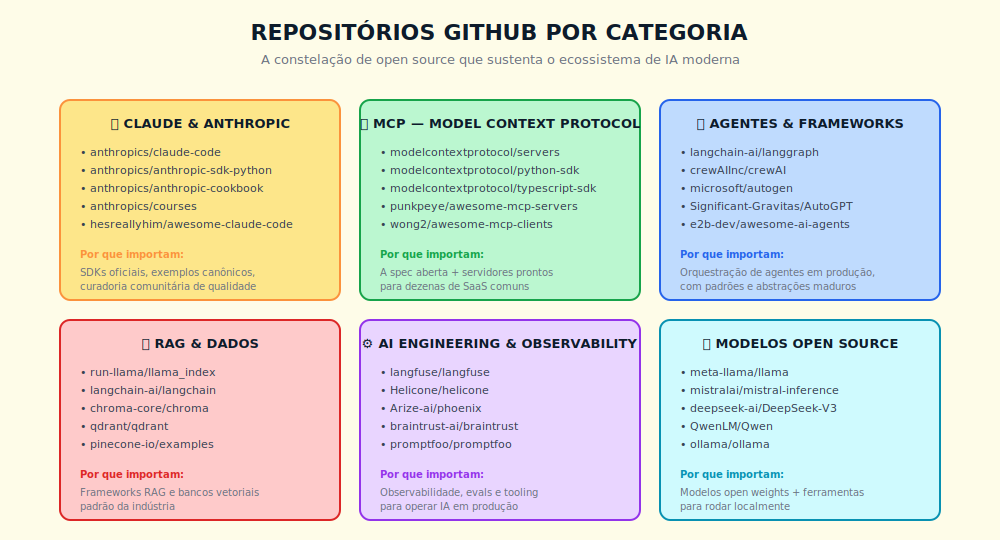

# 17. Auditoria de Repositório GitHub em 30 Minutos
*Método durável contra inventário que envelhece*

---

> *"Inventário de repositórios envelhece em seis meses, método de auditoria dura uma carreira; e a diferença entre o profissional que opera com vantagem e o que opera com hype é o método, não a lista."*

---

## 17.1 — Conceito intuitivo: por que inventário envelhece, método dura

Existe uma assimetria estrutural na forma como o profissional brasileiro se aproxima do ecossistema open source de IA, e essa assimetria é a fonte de boa parte da frustração silenciosa de quem operou três anos de hype sem operar três anos de produto. O caminho recorrente é o seguinte. O leitor descobre, em conferência, em newsletter, em fio de rede social, uma lista de repositórios obrigatórios, vinte itens, trinta itens, em formato que promete consolidação do estado da arte; o leitor estrela cada um, salva em pasta de favoritos, deixa para revisitar quando tiver tempo, e seis meses depois descobre que metade da lista perdeu cadência de release, um quarto virou abandono silencioso, e que três projetos novos, ausentes da lista original, viraram padrão de fato do ecossistema. A lista envelheceu, e o leitor que confiou na lista opera com mapa que não reflete o terreno.

O problema da lista não é a lista; é a postura epistêmica de quem confia em lista. Em ecossistema com taxa de inovação trimestral, com churn de repositório anual, com hype de conferência mensal, qualquer inventário publicado é, no momento da publicação, um snapshot que começa a deteriorar; e a única defesa estrutural é o operador trocar o consumo de lista por aplicação de método, com a lista funcionando como exercício de aplicação do método, não como entrega final. A diferença é a mesma diferença entre o leitor que decora a tabela periódica e o químico que entende a regra que organiza a tabela; o primeiro fica obsoleto, o segundo entende o próximo elemento descoberto no momento em que ele aparece.

Este capítulo é a transposição dessa lógica para a auditoria de repositório GitHub. A entrega central não é a lista de repositórios atuais, é o método de auditar qualquer repositório em trinta minutos, com seis critérios duráveis que sobrevivem a qualquer rotação do ecossistema, com leitura de ciclo de vida que separa o que está em adoção real do que está em hype performático, com anti-padrões explícitos que evitam as armadilhas clássicas de quem confunde visibilidade com viabilidade. A lista corrente de oito repositórios em 2026 entra apenas como exercício de aplicação, com cada repositório acompanhado de uma linha sobre o estado observado no momento da auditoria; a lista vai envelhecer, o método não.

## 17.2 — Analogia: a auditoria de imóvel comercial em trinta minutos

Pense em como um corretor experiente de imóveis comerciais avalia uma sala em trinta minutos, e perceba que ele não chega com uma lista de salas obrigatórias da cidade, ele chega com método de leitura. Os primeiros cinco minutos são sinais de vida, com observação direta de se o prédio tem zelador presente, se a portaria está ocupada, se há cheiro de mofo, se há rachadura visível em parede estrutural; sinal trivial de coletar, definitivo para descartar candidato impossível. Os próximos cinco minutos são leitura de governança do condomínio, com perguntas sobre síndico, sobre ata da última assembleia, sobre inadimplência, sobre fundo de reserva; informações que separam prédio operado de prédio em colapso silencioso. Os próximos cinco minutos são leitura de instalação técnica, com olhada em quadro elétrico, em rede hidráulica, em ar condicionado, em telhado; o corretor não precisa virar engenheiro para reconhecer instalação amadora, sem padrão, sem manutenção. Os próximos cinco minutos são leitura de documentação, com escritura, com habite-se, com IPTU em dia, com matrícula atualizada; o que parece detalhe burocrático é exatamente o que separa transação fechada de transação travada. Os próximos cinco minutos são leitura de comunidade local, com observação do entorno, da segurança, do comércio, da circulação; o ativo isolado sem ecossistema vale menos que o ativo medíocre em região viva. Os últimos cinco minutos são leitura de encaixe, com avaliação honesta de se o imóvel serve ao cliente específico, com sua operação específica, com seu orçamento específico, com sua janela de mudança específica; e essa última leitura é a que evita o corretor amador de empurrar imóvel bom para cliente errado.

A analogia tem três lições que importam para o resto do capítulo. A primeira é que cada um dos seis blocos é trivialmente auditável em cinco minutos, e que a soma dos seis dá uma leitura suficientemente robusta para decisão de avançar ou descartar, sem necessidade de inspeção exaustiva. A segunda é que o método é durável, com o corretor que aprendeu a olhar quadro elétrico em 2015 aplicando o mesmo método em 2026 com a mesma eficácia, enquanto a lista de imóveis recomendados de 2015 está obsoleta há sete anos. A terceira é que o último bloco, o encaixe, é o que distingue o profissional sério do entusiasta, porque é exatamente onde a lista falha em servir, com o melhor imóvel da cidade sendo o imóvel errado para o cliente que precisa de outra coisa. Auditoria de repositório GitHub segue exatamente a mesma estrutura.

A próxima seção desce ao detalhe técnico dos seis critérios.

## 17.3 — Explicação técnica

### 17.3.1 — Critério 1: sinais de vida

Sinal de vida é o termômetro de primeiro grau, e separa repositório operado de repositório abandonado em segundos. Três indicadores compõem o sinal mínimo viável, todos visíveis na página inicial do repositório, todos auditáveis sem clique adicional.

**Último commit na branch principal.** A janela aceitável depende da categoria do projeto, com framework de SDK aceitando até trinta dias, com biblioteca madura aceitando até noventa dias, com projeto de fronteira ativa exigindo até quinze dias. Commit em branch que não é a principal não conta, com a observação de que projetos sérios protegem a branch principal e merge é o evento que importa. Repositório com último commit há mais de cento e oitenta dias entra automaticamente em quarentena, com necessidade de justificativa pública (versão LTS estabilizada, projeto em modo de manutenção declarado) ou descarte direto.

**Frequência mensal de commits nos últimos noventa dias.** A página de Insights do GitHub entrega o gráfico em um clique, com leitura imediata da cadência. Cadência saudável em projeto de fronteira é de dezenas a centenas de commits por mês, com cadência saudável em biblioteca madura sendo de unidades a dezenas por mês. Cadência zero por mais de dois meses consecutivos é sinal de pausa que merece investigação na aba Issues, com leitura específica de se a comunidade está pedindo retomada e de qual é a resposta do mantenedor.

**Contribuidores ativos nos últimos noventa dias.** A página de Contributors entrega a contagem, com leitura específica de quantos contribuidores distintos commitaram na janela. Projeto com um único contribuidor ativo é projeto de risco estrutural, independentemente da qualidade do código, com bus factor de um significando que a saída desse contribuidor (mudança de emprego, conflito com empregador, exaustão) extingue o projeto em um ciclo. Projeto saudável tem ao menos três a cinco contribuidores ativos, com o mantenedor principal recebendo contribuição externa que é aceita em PR aprovado.

A regra prática para sinais de vida: cinco minutos é o orçamento total, com o critério passando se os três indicadores estão verdes, com o critério falhando se qualquer dos três está em zona crítica sem justificativa pública verificável.

### 17.3.2 — Critério 2: maturidade de release

Release é o evento em que o projeto promete contrato ao usuário, e a maturidade do processo de release separa software profissional de experimento que acidentalmente virou dependência de produção. Quatro indicadores compõem o critério.

**Versionamento semântico.** A presença de versão no formato MAJOR.MINOR.PATCH, com regra documentada de quando cada componente avança, é o piso mínimo. Projeto sério em 2026 segue SemVer ou variante explicitamente declarada, com mudança incompatível bumpando MAJOR, com nova capacidade bumpando MINOR, com correção bumpando PATCH. Projeto sem versionamento semântico, com tags arbitrárias ou com numeração caótica, é projeto que vai te surpreender em produção, em janela em que a surpresa custa caro.

**Changelog público versionado.** A presença de arquivo CHANGELOG.md ou de release notes detalhadas em cada release, com a lista do que mudou em cada versão, é o segundo piso. O changelog não é cortesia, é contrato; o time de produção que vai atualizar a dependência precisa ler o changelog para decidir se a atualização é segura. Projeto sem changelog é projeto que terceiriza o trabalho de descobrir a mudança para o usuário, com custo composto em incidente.

**Breaking changes documentadas.** A regra mais estrita é que toda mudança incompatível com a versão anterior vem documentada com migration guide, com exemplo de código antigo e código novo, com prazo de transição quando aplicável. Projeto que muda comportamento sem documentar, que renomeia API sem aviso, que remove campo sem ciclo de depreciação, é projeto que assume que a operação dos seus usuários é descartável, e essa postura aparece em tudo o mais que o projeto faz.

**Política de suporte de versões.** A presença de declaração explícita de quais versões recebem patch de segurança, de qual é o prazo de manutenção da versão LTS quando existe, de qual é a cadência de fim de vida das versões antigas, é o piso de maturidade para uso corporativo. Projeto sem essa política em 2026 não tem maturidade para sustentar dependência de produção em organização que opera com janela de manutenção planejada.

A regra prática para maturidade de release: cinco minutos navegando na aba Releases, na página de tags, no arquivo CHANGELOG e na seção de documentação correspondente; passa se os quatro estão presentes, falha se qualquer dos quatro está ausente sem justificativa de fase (projeto deliberadamente em pré-1.0 com aviso claro).

### 17.3.3 — Critério 3: qualidade de código

Qualidade de código é o critério em que o operador pode, em cinco minutos, separar projeto que internalizou disciplina de engenharia de projeto que opera no improviso. Quatro indicadores, todos visíveis sem clonar o repositório.

**Testes automatizados.** A presença de diretório de testes, com proporção razoável entre código de produção e código de teste, é o piso. Projeto sério tem suite de testes, com cobertura declarada de unitário, integração e end-to-end conforme a natureza do projeto. A leitura do operador é, em cinco minutos, abrir a árvore do repositório e identificar onde estão os testes, com qual frequência são adicionados (commits recentes que mudam código sem mudar teste são red flag), com qual estrutura organizam o que testam.

**CI/CD ativo.** A ausência de pipeline de integração contínua é red flag imediata para qualquer projeto que se apresenta como pronto para produção — projeto sem CI não tem como garantir que o código na branch principal funciona. A presença de CI com status vermelho na branch principal é igualmente red flag: indica quebra ativa ou descuido deliberado. O critério de aprovação é CI presente, com histórico verde nos commits recentes, com badges visíveis no README e execução via GitHub Actions ou equivalente.

**Cobertura de testes declarada.** A presença de relatório de cobertura, em geral via Codecov ou ferramenta equivalente integrada ao CI, com badge no README, com tendência observável ao longo dos commits, é o piso para uso corporativo. Cobertura de oitenta por cento é, em projeto de qualidade industrial, o piso confortável; cobertura de cinquenta por cento ou menos é red flag a menos que a categoria do projeto (biblioteca de UI, projeto experimental declarado) justifique. O número absoluto importa menos que a presença do indicador e a tendência ao longo do tempo.

**Linter e type checking ativos.** A presença de configuração de linter no repositório (ESLint, Ruff, Pylint, Clippy, dependendo da linguagem), com regra rodando em CI, com bloqueio de merge em violação, é o piso de disciplina. Em projetos em linguagem com sistema de tipos opcional (Python, JavaScript), a presença de checagem de tipo estática (mypy, pyright, TypeScript) é o piso de seriedade para uso em produção. Projeto sem linter ou sem type checking ativo é projeto que aceita ambiguidade em produção, com custo composto em manutenção e onboarding.

A regra prática para qualidade de código: cinco minutos navegando na árvore, no README, na aba Actions, no arquivo de configuração de CI; passa se os quatro estão presentes, falha se mais de um está ausente.

### 17.3.4 — Critério 4: documentação operacional

Documentação operacional é o critério em que o projeto demonstra, na prática, se respeita o tempo do usuário ou se assume que o usuário vai investir horas em descoberta. Quatro indicadores duráveis.

**README com quickstart em menos de cinco minutos.** O leitor que chega ao README precisa identificar, em segundos, o que o projeto faz, para quem serve, como rodar o exemplo mínimo. O quickstart precisa caber em uma tela, com comando de instalação, com exemplo de uso, com resultado esperado, com link para próximo passo. README que abre com história institucional, com lista de patrocinadores, com manifesto filosófico, é README que terceiriza o trabalho de orientação para o leitor; o operador profissional descarta o repositório nesse ponto e procura alternativa.

**Guia de produção.** A presença de documentação específica para uso em produção, com seção sobre observabilidade, sobre deployment, sobre configuração de escala, sobre limitação conhecida, é o piso para qualquer dependência crítica. Projeto que documenta apenas o "como rodar localmente" deixa o operador desamparado exatamente no momento em que o suporte importa. A documentação séria assume que o usuário vai operar em produção e entrega o material que sustenta essa operação.

**Exemplos versionados.** A presença de diretório de exemplos no repositório, com código que efetivamente roda na versão corrente, com cobertura dos casos canônicos de uso, é o piso para curva de adoção razoável. Exemplo desatualizado, com import que não existe mais, com API que mudou de assinatura, é pior que exemplo ausente, porque consome tempo do operador em debugar artefato de versão errada. Projeto sério mantém os exemplos como parte do CI, com falha de exemplo bloqueando merge.

**Troubleshooting documentado.** A presença de seção de problemas conhecidos, de FAQ derivada das issues recorrentes, de guia de debugging quando aplicável, é o piso para autonomia do operador. Projeto que envia toda dúvida para o canal de Discord, para a fila de issues, é projeto que escala mal e que penaliza o usuário que opera em janela em que o time de mantenedor não está acordado. Troubleshooting documentado é, na prática, a entrega que separa projeto que vai sustentar produção de projeto que vai gerar dependência humana no canal de comunidade.

A regra prática para documentação operacional: cinco minutos navegando no README, no diretório docs, na pasta examples; passa se o quickstart funciona em cinco minutos, se há guia de produção, se os exemplos rodam, se troubleshooting existe; falha se o quickstart consome mais de cinco minutos do operador antes de produzir resultado.

### 17.3.5 — Critério 5: padrão de governança

Governança é o critério que separa projeto operado com seriedade institucional de projeto que opera no improviso de mantenedor único. Quatro artefatos compõem o piso.

**CONTRIBUTING.md.** A presença de guia de contribuição, com explicação do processo de PR, com convenção de commit, com critério de aceitação, com canal de comunicação para discussão de proposta, é o piso para projeto que aceita comunidade. Projeto sem CONTRIBUTING.md é, em geral, projeto que rejeita contribuição na prática, com PRs externos ficando sem resposta, com o mantenedor único acumulando débito.

**CODE_OF_CONDUCT.md.** A presença de código de conduta, em geral baseado no Contributor Covenant ou em variante equivalente, com canal de report de violação, com mantenedor responsável pelo cumprimento, é o piso para projeto que opera com comunidade saudável. A ausência é red flag não por moralismo, é red flag porque projetos com comunidade tóxica perdem contribuidores sérios e aceleram o ciclo de abandono.

**Política de segurança.** A presença de arquivo SECURITY.md, com canal de report de vulnerabilidade, com prazo de resposta declarado, com política de divulgação coordenada, é o piso para uso em organização que precisa documentar a sua própria postura de segurança. Projeto sem política de segurança é projeto que assume que o report de vulnerabilidade vai chegar por canal informal, com risco de o report virar disclosure público antes da correção.

**Política de releases.** A presença de declaração explícita de cadência de release, de quem decide o que entra em release, de qual é o processo de aprovação, é o piso de previsibilidade para o usuário corporativo. Projeto que faz release por impulso de mantenedor é projeto que entrega surpresa em janela de manutenção planejada.

A regra prática para governança: cinco minutos navegando na raiz do repositório, na pasta .github, na seção de community profile; passa se os quatro artefatos estão presentes e atualizados, falha se mais de um está ausente em projeto que se apresenta como pronto para produção.

### 17.3.6 — Critério 6: encaixe com o seu contexto

Encaixe é o critério em que o operador profissional separa-se do entusiasta, porque é o critério que assume que qualidade absoluta não decide adoção, contexto decide. Quatro dimensões compõem o encaixe.

**Licença compatível com uso comercial.** A presença de licença explícita, em geral MIT, Apache 2.0, BSD ou variante permissiva, é o piso para uso em produto comercial. Licenças copyleft estritas (GPL, AGPL) impõem restrição que pode ser incompatível com o modelo de produto da organização, e a leitura jurídica precisa acontecer antes da adoção, não depois. Licença ausente é, na prática, default de "todos os direitos reservados", com uso comercial sem autorização sendo violação de direito autoral; projeto sem LICENSE é projeto fora de uso corporativo até que o mantenedor publique a licença.

**Stack alinhada com a empresa.** A linguagem, o gerenciador de pacotes, a infraestrutura de dependência precisam encaixar na stack que a organização opera. Projeto excelente em linguagem que a equipe não domina vira projeto de risco operacional, com manutenção dependendo de contratação ou de aprendizado que pode não materializar. Stack alinhada não significa stack idêntica, significa stack que a equipe consegue operar, manter, debugar em janela de incidente.

**Comunidade acessível em português ou em inglês operacional.** O canal de comunicação primário do projeto (Discord, fórum, GitHub Discussions) precisa operar em idioma em que a equipe consegue participar com fluência funcional. Projeto excelente com comunidade exclusivamente em chinês, em japonês ou em russo, é projeto em que a equipe brasileira vai operar em desvantagem permanente, com janela de resposta degradada, com perda de nuance em discussão técnica.

**Custo de manter fork.** A pergunta estrutural, em qualquer adoção séria, é qual é o custo de manter um fork interno se o projeto for abandonado amanhã. Projeto com código compreensível, com documentação que sustenta onboarding, com arquitetura modular, tem custo de fork aceitável. Projeto com código opaco, com dependência massiva, com arquitetura monolítica, tem custo de fork que pode tornar a adoção uma armadilha estrutural. A leitura do custo de fork é exercício de honestidade sobre o que aconteceria no pior cenário.

A regra prática para encaixe: cinco minutos lendo a licença, navegando na lista de dependências, observando o canal de comunidade, estimando a complexidade do projeto; passa se as quatro dimensões fecham, falha se qualquer das quatro tem incompatibilidade estrutural com o contexto da organização.

### 17.3.7 — O ciclo de vida do repositório

Repositórios em ecossistema de fronteira seguem ciclo de vida observável, e a competência do operador de auditoria inclui reconhecer em qual fase o projeto está. Cinco fases, com quatro sinais cada que permitem a leitura em segundos.

**Hype.** O projeto explode em conferência, em fio viral, em newsletter, com curva de stars vertical em janela curta. Os quatro sinais são: gráfico de stars com inflexão recente, README escrito como pitch de produto, demonstração impressionante em vídeo, ausência de uso corporativo documentado. A leitura para o operador é descartar o consumo na fase de hype, com retorno em três a seis meses para verificar se sobreviveu à adoção real.

**Adoção real.** O projeto começa a aparecer em case de organização verificável, com integração em produto de empresa que importa, com discussão técnica em fórum profissional sério. Os quatro sinais são: posts técnicos detalhados em blog de empresa séria, integração documentada em projeto popular adjacente, presença em pesquisa de adoção de ferramentas corporativas, primeiras issues sofisticadas de uso em escala. A leitura para o operador é ativar avaliação séria, com piloto controlado.

**Maturidade.** O projeto consolida API estável, comunidade ativa, ecossistema de extensões, documentação completa, política de governança formal. Os quatro sinais são: cadência regular de release com SemVer estrito, comunidade com múltiplos contribuidores ativos, presença de variante hospedada ou de empresa comercial dedicada, integrações oficiais com ferramentas adjacentes do ecossistema. A leitura para o operador é adoção em produção com confiança calibrada.

**Manutenção.** O projeto entra em janela em que mudanças incompatíveis são raras, em que o foco é estabilidade, em que a inovação se desloca para projetos derivados. Os quatro sinais são: cadência de release reduzida com foco em patch e em segurança, declaração explícita de fase de manutenção, comunidade discutindo "qual é o próximo X" em substituição, queda gradual de issues novas. A leitura para o operador é manter em produção com planejamento de sucessão observado.

**Abandono.** O projeto perde mantenedor ativo, com PRs em fila sem resposta, com issues abertas sem triagem, com a última release há mais de seis meses sem justificativa. Os quatro sinais são: último commit há mais de cento e oitenta dias, mantenedor principal anunciando saída ou silenciando, comunidade migrando publicamente para alternativa, repositório sendo arquivado pelo dono. A leitura para o operador é migração planejada, com prazo definido, com investigação ativa da alternativa que a comunidade está adotando.

A regra de leitura: a curva de stars combinada com a cadência de release e a vivacidade da aba Issues entrega a fase em menos de dois minutos. O operador maduro adota apenas em adoção real e em maturidade, com piloto em hype apenas em janela de aprendizado, com migração planejada a partir da fase de manutenção.

---

## Quadro 17.A — Protocolo "30 minutos por repositório"

A tabela abaixo é o protocolo operacional que o leitor leva para a próxima sessão de avaliação de repositório. Trinta minutos totais, seis blocos de cinco minutos, sem extensão. O orçamento de tempo é parte do método; sessão que ultrapassa cinquenta por cento do orçamento sem decisão é sessão que precisa virar avaliação séria com piloto, não auditoria de triagem.

| Bloco | Duração | Onde olhar | Sinal de passa | Sinal de falha |
|-------|---------|------------|----------------|----------------|
| 1. Sinais de vida | 5 min | Página inicial, Insights, Contributors | Commit recente, cadência mensal saudável, ≥3 contribuidores ativos | Sem commit há 180+ dias, contribuidor único, gráfico zerado |
| 2. Maturidade de release | 5 min | Releases, tags, CHANGELOG.md | SemVer estrito, changelog detalhado, breaking documentadas | Versionamento caótico, sem changelog, breaking sem aviso |
| 3. Qualidade de código | 5 min | Árvore do repo, README badges, aba Actions | Testes, CI verde, cobertura declarada, linter ativo | CI vermelho, sem testes, sem type checking |
| 4. Documentação operacional | 5 min | README, docs/, examples/ | Quickstart < 5 min, guia de produção, exemplos rodam | README marketing, sem guia de produção, exemplos quebrados |
| 5. Padrão de governança | 5 min | Raiz, .github/, Community profile | CONTRIBUTING, CODE_OF_CONDUCT, SECURITY, política de release | Mantenedor único sem CONTRIBUTING, sem política de segurança |
| 6. Encaixe com seu contexto | 5 min | LICENSE, dependências, canal de comunidade | Licença compatível, stack alinhada, comunidade acessível, fork viável | Licença incompatível, stack estranha, comunidade em idioma inacessível |

A decisão final é binária e tem três saídas. **Adoção em produção** quando os seis blocos passam; **piloto controlado em sandbox** quando cinco passam e o sexto é encaixe parcial recuperável; **descarte** quando dois ou mais blocos falham, ou quando qualquer dos quatro primeiros falha em projeto que se apresenta como pronto para produção.

---

## 17.4 — Anti-padrões: as quatro armadilhas clássicas

A indústria de hype em torno de repositório GitHub produz quatro armadilhas que o operador profissional precisa reconhecer com a mesma clareza com que reconhece o método. Cada uma é, em si, exemplo do Invariante 7, com sinal performático sequestrando a leitura do sinal real.

**Confiar em estrelas.** A contagem de stars mede atenção em janela, e atenção em janela mede campanha de marketing, viralização, conferência recente, não viabilidade técnica. Projetos com cem mil estrelas e mantenedor único existem, projetos com mil estrelas e governança institucional impecável existem; o operador que decide por stars está consumindo sinal que o mantenedor sério não otimiza e que o mantenedor de marketing otimiza ativamente. A regra é tratar a contagem de stars como sinal de visibilidade, não de viabilidade.

**Confiar em README de marketing.** O README escrito como pitch de produto, com hero shot, com lista de logos de empresas que dizem usar, com chamada para ação para Discord, é o README que assume que o leitor é prospect, não operador. O operador profissional descarta o README de marketing como sinal e procura a documentação técnica, o CHANGELOG, o protocolo de contribuição, a presença de versão LTS. A regra é tratar README como vitrine, não como contrato.

**Confiar em demonstração.** O vídeo de demonstração de noventa segundos, o GIF animado, a demo interativa online, são artefatos de comunicação de capacidade em condição ideal, com dados curados, com prompt curado, com janela curada. A operação real introduz variabilidade que a demonstração não captura, com a curva de adoção sendo, sistematicamente, mais íngreme do que a demonstração sugere. A regra é tratar demonstração como prova de existência de capacidade, não como prova de viabilidade operacional.

**Confiar em post de blog.** O post de blog que recomenda repositório é, em geral, post de pessoa que rodou o exemplo do README, com a entusiasmo de quem acabou de descobrir, sem a calibração de quem operou em produção por seis meses. A leitura do post de blog é sinal de exploração, não de validação; o operador profissional procura post de empresa que opera em produção, com volume, com tempo de operação documentado, com aprendizado estrutural. A regra é separar entusiasmo de prática.

A armadilha estrutural comum às quatro é a substituição do método pela confiança em sinal performático, e a defesa é a aplicação disciplinada dos seis critérios com o orçamento de trinta minutos, com a decisão sendo tomada com base no sinal real, não com base no ruído.

---

## 17.5 — Exemplo memorável

Diretor de tecnologia em fintech brasileira em São Paulo, cerca de duzentos funcionários, equipe de tecnologia de cinquenta pessoas, operando em ecossistema de IA desde 2024, voltou de evento internacional em fevereiro de 2026 com lista de "vinte repositórios imperdíveis de IA para fintech" entregue em sessão patrocinada por integrador, com cada repositório acompanhado de pitch de noventa segundos, com chamada implícita para adoção rápida em janela competitiva. A lista incluía sete projetos de framework de agente, cinco de orquestração de pipeline, quatro de observabilidade, três de gateway de modelo, um de avaliação. Vários repositórios da lista tinham mais de vinte mil estrelas, presença em conferência, post de blog em veículo técnico sério, e a primeira reação interna do time foi de pressão para começar piloto em três deles em paralelo na semana seguinte.

O diretor, em vez de autorizar os pilotos, aplicou o protocolo de trinta minutos por repositório em sessão de bloqueio de calendário com dois engenheiros sêniores e o tech lead da plataforma de IA, dez horas totais distribuídas em três tardes. Em cada repositório, os três aplicaram os seis critérios em ordem, com a decisão de avançar ou descartar registrada em planilha estruturada, com a leitura de fase do ciclo de vida explicitada, com a aplicação do critério de encaixe ao contexto específico da fintech (stack em Python e TypeScript, infraestrutura em AWS, requisito de conformidade com LGPD, equipe de cinco AI engineers em janela de capacidade saturada).

Os resultados foram brutais e instrutivos. Catorze dos vinte repositórios foram descartados, com seis dos catorze sendo descartados em menos de dez minutos por falha em sinais de vida (último commit há mais de seis meses, mantenedor único sem sucessão declarada, comunidade em silêncio na aba Issues por noventa dias). Quatro dos catorze foram descartados em falha de maturidade de release, com versionamento caótico, com breaking changes sem aviso, com ausência total de política de suporte. Três dos catorze foram descartados em falha de encaixe, com a stack do projeto sendo incompatível com a operação da fintech (linguagens não dominadas pelo time, dependências que entravam em conflito com infraestrutura corporativa, licença AGPL que o jurídico interno bloqueia em produto comercial). Um dos catorze foi descartado em falha de governança, com ausência total de política de segurança em projeto que processaria dado sensível.

Os seis sobreviventes passaram a piloto controlado em sandbox, com critério de avanço explícito, com calendário de revisão em quarenta e cinco dias. Três deles foram adotados em produção em janela de noventa dias, com integração documentada, com observabilidade conforme padrão da casa, com plano de migração documentado caso o quadrante mudasse. Três deles foram descartados em piloto, com aprendizado registrado em documento interno, com a postura de retornar em seis meses para reavaliar caso o projeto evoluísse.

O impacto estrutural, computado em janela de doze meses pelo time, soma três componentes. Custo evitado de adoção precipitada em catorze projetos descartados, com estimativa interna de pelo menos duzentas horas de engenharia poupadas por projeto que seria abandonado em seis meses, totalizando perto de duas mil e oitocentas horas de engenharia preservadas. Risco reputacional evitado em três projetos que, em retrospecto observado pelo time em outubro de 2026, foram arquivados pelos próprios mantenedores em janela inferior a oito meses após o evento original, e que estariam em produção da fintech caso o piloto cego tivesse acontecido. Maturidade institucional do time, com o protocolo de trinta minutos virando padrão da casa, com cada novo repositório recebendo a auditoria antes de qualquer piloto, com a planilha estruturada virando ativo de conhecimento compartilhado.

A lição estrutural, registrada em ata pelo diretor em reunião de revisão trimestral, foi a transcrição direta do Invariante 7. *O ecossistema mente sobre si mesmo em estrelas, em conferência, em blog post, e a única defesa estrutural é o método que separa sinal real de sinal performático. A diferença entre o operador que opera com vantagem e o operador que opera com hype não é a velocidade de adoção, é a disciplina da auditoria que precede a adoção; e essa disciplina cabe em trinta minutos por repositório, com seis critérios duráveis que vão sobreviver a qualquer rotação do ecossistema.*

> 🎯 **PARA EXECUTIVOS**
> Faça três perguntas ao time esta semana. (1) Qual foi o último repositório open source que adotamos em produção, e qual foi o método de auditoria aplicado antes da adoção? (2) Quantos dos repositórios que adotamos nos últimos dezoito meses ainda têm cadência saudável de release hoje, e quantos foram abandonados? (3) Posso ver a planilha estruturada com a auditoria do próximo candidato a entrar em produção?

---

## 17.6 — Lista corrente como exercício de aplicação (não como inventário)

O propósito desta seção é fornecer candidatos reais para praticar o protocolo de trinta minutos — não um inventário a ser consumido passivamente. Qualquer lista publicada no papel começa a deteriorar no momento da publicação: repositórios mudam de fase, surgem competidores, governanças se reorganizam.

> **Camada viva.** Esta seção ensina o método; a lista corrente de repositórios recomendados como exercício de aplicação — com fase do ciclo de vida observada, nota por critério e encaixe típico — vive no repositório de recursos da obra, atualizado regularmente (github.com/falercia/inteligencia-aumentada-recursos → `repos-curados`). Consulte lá a versão corrente antes de aplicar o protocolo.

**Como usar a lista do repositório de recursos:**
1. Acesse `repos-curados` e escolha dois ou três repositórios de categorias distintas (framework de orquestração, engine de inferência, observabilidade, gateway de modelo).
2. Antes de ler as notas da camada viva, aplique você mesmo o protocolo de trinta minutos em cada um.
3. Compare sua leitura com o estado anotado na camada viva. As divergências são o aprendizado mais valioso — elas calibram seu método.
4. Repita o exercício em seis meses com os mesmos repositórios para observar transição de fase.

A regra explícita: qualquer lista vai envelhecer. O exercício de aplicação é, exatamente, ler os candidatos da camada viva contra o estado observado pelo próprio leitor na data da leitura — o método continua válido independentemente da rotação dos itens.

---

## 17.7 — Resumo executivo

| Conceito | Síntese |
|----------|---------|
| **Inventário envelhece, método dura** | Lista de seis meses está obsoleta; método de auditoria sobrevive ao ciclo do ecossistema |
| **Seis critérios duráveis** | Sinais de vida, maturidade de release, qualidade de código, documentação operacional, governança, encaixe |
| **Protocolo 30 minutos** | Cinco minutos por critério; decisão binária com três saídas (produção, piloto, descarte) |
| **Ciclo de vida** | Hype, adoção real, maturidade, manutenção, abandono; cada fase com quatro sinais visíveis |
| **Anti-padrões** | Estrelas, README de marketing, demonstração, post de blog; substituição de método por sinal performático |
| **Encaixe é crítico** | Qualidade absoluta não decide; licença, stack, comunidade, custo de fork decidem |
| **Lista como exercício** | Oito repositórios atuais como aplicação, não como inventário; vão envelhecer, método continua |
| **Conexões** | MCP (Cap 13), AI Engineering (Cap 14), custo (Cap 18), Apêndice D (ferramentas) |

---

## 17.8 — Checklist do capítulo

- [ ] Explicar em uma frase por que inventário envelhece e método dura
- [ ] Listar os seis critérios duráveis na ordem do protocolo
- [ ] Aplicar o protocolo de trinta minutos em um repositório novo, com decisão registrada
- [ ] Identificar a fase do ciclo de vida de três repositórios em produção na organização
- [ ] Reconhecer as quatro armadilhas clássicas e quando elas operaram em decisão recente
- [ ] Estabelecer planilha estruturada de auditoria como padrão da casa
- [ ] Validar que adoção em produção da organização tem auditoria documentada
- [ ] Calibrar critério de revisão periódica dos repositórios já em produção
- [ ] Conectar o capítulo com Cap 13 (MCP), Cap 14 (AI Engineering), Cap 18 (custo), Apêndice D

---

## 17.9 — Perguntas de revisão

1. Por que inventário de repositórios envelhece em seis meses, e por que método de auditoria sobrevive ao ciclo?
2. Quais são os seis critérios duráveis, e por que a ordem importa na execução do protocolo?
3. Em que se diferencia a fase de hype da fase de adoção real, e quais são os quatro sinais de cada uma?
4. Por que confiar em estrelas é a armadilha estrutural mais comum, e qual é a defesa?
5. Em que critério especificamente o operador profissional se separa do entusiasta, e por quê?
6. Como o protocolo de trinta minutos decide entre adoção, piloto e descarte, e qual é a regra de saída?
7. Em que situação um repositório aprovado nos cinco primeiros critérios deve ser descartado pelo sexto, e o que isso ensina sobre encaixe?
8. Como o capítulo amarra o Cap 13 (MCP), Cap 14 (AI Engineering), Cap 18 (custo) e o Apêndice D em sistema integrado de avaliação técnica?

---

## 17.10 — Exercícios práticos

**Exercício 1 — Aplicar o protocolo em sessão de trinta minutos.** Escolha um repositório que a sua organização cogitou adotar nos últimos seis meses, ou um repositório que apareceu em conferência recente. Bloqueie trinta minutos no calendário, aplique os seis critérios em ordem, registre a decisão em planilha estruturada com justificativa por critério. O entregável é a planilha com a auditoria completa.

**Exercício 2 — Auditar repositórios em produção.** Para cada repositório open source crítico em produção na organização, aplique o protocolo retroativo, identifique a fase do ciclo de vida em que está, identifique sinais de manutenção ou de abandono, proponha plano de sucessão para os que estão em fase de manutenção avançada. O entregável é a tabela de repositórios em produção com fase observada e plano por item.

**Exercício 3 — Mapear armadilhas em decisões passadas.** Em sessão com o time técnico, identifique três decisões de adoção de open source dos últimos dezoito meses em que pelo menos uma das quatro armadilhas operou (estrela, README de marketing, demonstração, post de blog). Documente o aprendizado estrutural por decisão. O entregável é o documento de retrospectiva com lições aplicáveis ao próximo ciclo.

**Exercício 4 — Estabelecer planilha estruturada como padrão.** Crie a planilha modelo da casa, com os seis critérios em colunas, com campo de decisão, com campo de fase do ciclo de vida, com campo de calendário de revisão. Publique em ferramenta corporativa de documentação. O entregável é a planilha modelo publicada com instrução de uso e com primeiro caso aplicado.

---

## 17.11 — Projeto do capítulo

**Construir o Caderno de Auditoria de Repositório v0 da organização.** Entregável em três a cinco páginas, integrado ao guia técnico interno. Conteúdo:

1. Protocolo de trinta minutos formalizado, com os seis critérios e a regra de saída.
2. Planilha modelo da casa com campos estruturados.
3. Lista corrente de repositórios em produção, com fase do ciclo de vida observada e calendário de revisão.
4. Política de adoção, com regra de quem autoriza, com critério de bloqueio (CI vermelho, licença incompatível, mantenedor único sem sucessão).
5. Política de revisão periódica, com cadência semestral, com regra de migração planejada quando a fase muda para manutenção avançada.
6. Calendário do próximo trimestre com sessões de auditoria de repositórios candidatos.

**Critério de qualidade.** Outro tech lead, sem contexto, lê o caderno e responde sem ambiguidade: "qual é o protocolo da casa para auditar um repositório novo?", "quais são os repositórios em produção em fase de manutenção avançada, com plano de sucessão?", "quem autoriza adoção em produção, e qual é o critério de bloqueio?".

---

## 17.12 — Referências principais

📚 **Hubs de descoberta e curadoria**

- [GitHub Trending](https://github.com/trending) — sinal de visibilidade, não de viabilidade
- [Hugging Face](https://huggingface.co/) — hub central de modelos e datasets do ecossistema
- [Papers with Code](https://paperswithcode.com/) — papers com implementação verificável

📚 **Frameworks de avaliação institucional**

- CHAOSS — Community Health Analytics for Open Source Software, com métricas de saúde de projeto open source
- OpenSSF Scorecard — Open Source Security Foundation, com automação de avaliação de postura de segurança
- Contributor Covenant — padrão de código de conduta para projetos open source

📚 **Repositórios para exercício de aplicação (lista viva)**

- Lista corrente com fase do ciclo de vida e nota por critério: github.com/falercia/inteligencia-aumentada-recursos → `repos-curados`

📚 **Padrões de governança e release**

- SemVer 2.0 — Semantic Versioning Specification
- Keep a Changelog — padrão de changelog
- OpenSSF Best Practices Badge — autocertificação de práticas

A fase do ciclo de vida de qualquer projeto precisa ser auditada pelo leitor na data da leitura conforme o protocolo de trinta minutos. A lista vai envelhecer, o método não.

---

## 17.13 — Conexões com outros capítulos

- 🔗 **MCP como camada de integração** que aparece em vários dos repositórios auditados → Cap 13
- 🔗 **AI Engineering como disciplina** que sustenta a operação dos repositórios em produção → Cap 14
- 🔗 **Custo composto** que aparece quando a adoção precipitada gera abandono em seis meses → Cap 18
- 🔗 **Open source como camada estratégica** que decide quando adoção em produção faz sentido → Cap 16
- 🔗 **Segurança em IA** que exige política de segurança em qualquer repositório que processa dado sensível → Cap 19
- 🔗 **Apêndice D — ferramentas e plataformas** como mapa complementar do ecossistema → Apêndice D
- 🔗 **Framework F2 — Encaixe** que sustenta o sexto critério da auditoria → ver Frameworks
- 🔗 **Invariante 7 — Termômetro** como base epistêmica do método contra hype → ver Manifesto

---

## 17.14 — Autoavaliação

| # | Critério | Você consegue? |
|---|----------|----------------|
| 1 | **Clareza** — Explicar em 90 segundos a um diretor não-técnico por que inventário envelhece em seis meses e por que o método de trinta minutos resolve o problema, com a analogia da auditoria de imóvel | ☐ |
| 2 | **Profundidade** — Defender, em mesa técnica com tech lead experiente, por que o critério de encaixe (sexto) é o que separa operador profissional de entusiasta, com exemplo aplicado ao contexto da organização | ☐ |
| 3 | **Aplicação** — Aplicar o protocolo de trinta minutos em um repositório candidato à adoção na sua organização, agora, com decisão registrada em planilha estruturada | ☐ |
| 4 | **Conexão** — Articular como o Cap 17 amarra o Cap 13 (MCP), Cap 14 (AI Engineering), Cap 16 (open source), Cap 18 (custo) e o Apêndice D em sistema integrado de avaliação técnica | ☐ |
| 5 | **Curiosidade** — Está com vontade de aplicar o método em todos os repositórios em produção da organização nas próximas duas semanas para identificar os que estão em fase de manutenção avançada | ☐ |

---

> *"Inventário envelhece em seis meses. Método dura uma carreira. A diferença entre o operador que vai operar com vantagem em 2030 e o que vai operar com hype em 2030 é o método, não a lista; e o método cabe em trinta minutos por repositório, com seis critérios duráveis e a coragem de descartar quatorze de cada vinte."*
