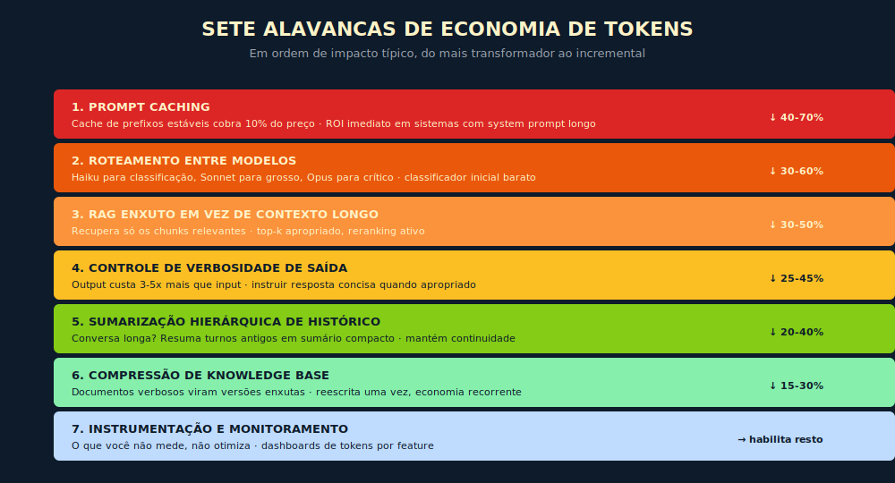

# 18. Economia de Tokens em Profundidade

> *"Em qualquer operação de IA em escala, parte relevante do orçamento é desperdício otimizável sem perda de qualidade. Esse desperdício existe porque ninguém mede e ninguém otimiza sistematicamente."*

## 18.1 — O conceito intuitivo

As reduções percentuais apresentadas adiante, de 40 a 70%, 30 a 60% e assim por diante, são ordens de grandeza observadas em operações típicas de IA generativa corporativa, não médias estatísticas de pesquisa peer-reviewed. Vêm de auditorias operacionais conduzidas em organizações brasileiras de médio porte e da documentação pública de práticas de otimização dos principais fornecedores. Resultado real depende fortemente da arquitetura de partida: operações maduras ganham menos; operações que nunca otimizaram ganham mais.

Vimos no Capítulo 3 o conceito básico de tokens e no Capítulo 11 a evolução para Context Engineering. Este capítulo consolida o que aprendemos em um método operacional de redução de custos para organizações com volume significativo de uso de IA. Ele é, em termos de princípio, a aplicação direta do **Invariante 5 (Custo Composto)**, e em termos de framework, a leitura executiva que precede o **F7 — Custo Composto em Três Tempos**, onde as três alavancas viram plano operável com metas, riscos e ordem de execução.

A realidade econômica observável é que organizações brasileiras de médio e grande porte gastam tipicamente entre US$ 5 mil e US$ 200 mil mensais em chamadas a LLMs, dependendo do volume e da maturidade da operação. Em quase todos esses casos, otimização sistemática de tokens reduz custo entre 40% e 70% sem perda de qualidade percebida. A economia anualizada vira recurso que pode financiar outras iniciativas de IA, expansão de uso ou retorno direto ao caixa.

## 18.1b — Analogia: a conta de energia da empresa

Pense na conta de energia elétrica de um escritório. A fatura mensal traz um número central — o preço do kWh — e a reação imediata do gestor é negociar desconto com a distribuidora. Mas a distribuidora já pratica tarifa de mercado. Um desconto de 5% no kWh reduz a conta em 5%.

Enquanto isso, os equipamentos que ninguém desligou no fim do dia, os servidores em stand-by esquecidos no rack, o ar-condicionado do salão vazio rodando no fim de semana — esses são os multiplicadores silenciosos. Não aparecem no preço por kWh; aparecem na quantidade de horas ligados, na quantidade de equipamentos simultâneos, na categoria de energia que cada um consome. Cortar esses multiplicadores entrega economia de 40 a 60% sem tocar no kWh.

Tokens funcionam da mesma forma. O preço por token é o kWh: visível na fatura unitária, fixo por contrato, marginal no efeito. O que explode a fatura são os multiplicadores compostos: número de chamadas (quantos equipamentos), redundância interna (quantas horas desnecessárias), e tier de modelo (qual categoria de energia por equipamento). A seção seguinte torna essa lógica explícita em fórmula.

## 18.2 — A fórmula do custo composto

A intuição financeira que destrói orçamento de IA é tratar "preço por token" como a variável principal. Em organizações maduras, o preço por token é o termo trivial da fórmula. O que escala é a multiplicação composta com chamadas, redundância e tier.

### 18.2.1 — A fórmula explícita

```
Custo Total = Σ (tokens_in × preço_in + tokens_out × preço_out)
              × chamadas
              × redundância
              × tier
```

Cada termo merece desempacotamento.

Tokens (in/out) × preço (in/out) é o termo que aparece na conta do fornecedor por chamada. Em volumes baixos, é onde a maior parte da economia parece estar. Em volumes corporativos, é o termo menos transformador. Output costuma custar de 3 a 5 vezes mais que input, dependendo do vendor.

Chamadas é a multiplicação por número de usuários, número de sessões por usuário, número de turnos por sessão, e, quando há agentes, número de chamadas internas por turno, que pode ser dezenas em workflow encadeado. Este termo escala em ordem de grandeza com o produto.

Redundância é o multiplicador silencioso que ninguém audita. Chamadas que poderiam ter sido cacheadas e não foram. Loops de agente que reconsultam a mesma informação. Reranking que recupera contextos duplicados. Tool poll em sequência quando uma única consulta cobriria tudo. Em operações jovens, redundância tipicamente multiplica o custo por 2 a 5 vezes sem que ninguém perceba.

Tier é o multiplicador de modelo. Usar o modelo premium para classificação binária paga 30 a 50 vezes o preço do modelo pequeno para entregar a mesma qualidade (magnitude observada em 2026; confirmar razão atual nas fichas dos fornecedores — Apêndice J). Tier mal escolhido é, em volume, o erro mais caro do início ao fim.

> **Quadro 18.A — Os quatro termos, em uma linha cada**
>
> | Termo | O que é | Por que escala | Onde mexer |
> |-------|---------|----------------|------------|
> | **Preço por token** | Tarifa do vendor por chamada | Linear, fixo por contrato | Negociação/vendor — termo trivial |
> | **Chamadas** | Usuários × sessões × turnos × chamadas internas | Cresce com o produto e com agentes | Topologia (T2) |
> | **Redundância** | Caching perdido, loops, reconsultas | Multiplica 2-5× silenciosamente | Topologia (T2) |
> | **Tier** | Modelo premium onde o pequeno bastaria | 30-50× por chamada mal roteada (2026 — Apêndice J) | Roteamento (T1) |
>
> *Regra de bolso: o termo que mais escala não é o que aparece na fatura unitária. É o produto dos três multiplicadores à direita.*

### 18.2.2 — As três alavancas arquiteturais

Atacar o custo composto exige três alavancas operadas em ordem de impacto. Mexer no termo trivial, o preço por token, sem mexer nestas três é otimização errada. Estas são as mesmas três alavancas que o F7 formaliza como T1, T2 e T3.

A primeira alavanca é o tier de modelo (T1). Rotear cada chamada ao modelo mais barato suficiente para a qualidade exigida. Padrão de ouro: um classificador leve na entrada da pipeline decide se a chamada vai para tier pequeno, médio ou premium. Implementação leva uma a três semanas para a primeira versão sólida. Economia típica observada em operações que migram para roteamento: 30% a 60% do gasto total, mantendo qualidade.

A segunda alavanca é a topologia de chamada (T2). Reduzir redundância dentro do fluxo. Inclui prompt caching para prefixos estáveis, batching de chamadas independentes, eliminação de loops de agente que reconsultam o mesmo dado, circuit breaker contra runaway loops, e tool design que devolve o contexto que o próximo passo precisa em uma só chamada. Economia típica observada: 20% a 50% adicional, sem mexer em tier nem em prompt.

A terceira alavanca é o tamanho de contexto (T3). Podar RAG agressivamente, com top-k baixo após reranking, comprimir histórico via sumarização hierárquica, expirar memória que perdeu relevância, descartar bibliografia inflada. Cada token desperdiçado paga juro composto porque entra em cada chamada subsequente da mesma sessão. Economia típica observada: 15% a 40% adicional.

A regra prática é atacar a primeira alavanca primeiro, por entregar maior efeito com menor risco, depois a segunda, que é estrutural e exige redesenho de fluxo, depois a terceira, mais sutil e que exige medição fina.

### 18.2.3 — O erro típico

Otimizar o tamanho do prompt enquanto um loop de agente dispara 40 chamadas redundantes ao modelo premium. O esforço se concentra no termo trivial. A fatura continua subindo porque o termo composto não foi tocado. É a forma mais comum de esforço de otimização desperdiçado.

Outro erro frequente é usar o modelo premium para tarefas que o modelo pequeno cobre, por princípio de "qualidade não pode arriscar". Sem golden set para mostrar que o pequeno entrega a mesma qualidade, a decisão fica em fé, exatamente o que o Invariante 7 combate. Sem o termômetro, o roteamento por tier não acontece.

Um terceiro erro é começar pela poda de contexto, por ser o mais visível. Visível e marginal. Em operações desafinadas, a poda entrega 5 a 10% enquanto o roteamento por tier entrega 50%. Ordem importa.

Para executivos: a pergunta "como reduzimos o custo de IA em 30 dias?" tem resposta arquitetural, não textual. Se o time técnico responde "vamos refinar os prompts", peça para também olhar tier e topologia. A maior parte da economia está lá. Quem otimiza só prompt está mexendo no termo trivial.

## 18.3 — Sete alavancas em ordem de impacto



*Do mais transformador ao incremental, com economia típica esperada por alavanca.*

Prompt caching é a alavanca com maior ROI imediato. Em sistemas com system prompt longo e estável, com variações pequenas por chamada, caching pode reduzir custo de input em 80 a 90% das chamadas após a primeira. Economia típica esperada de 40 a 70% do gasto total. Configuração leva uma tarde de trabalho de engenharia.

Roteamento entre modelos divide chamadas por complexidade. Classificador barato na entrada decide se o trabalho real vai para o modelo médio ou o premium. Em vez de pagar o premium por tudo, paga conforme necessário. Economia típica de 30 a 60% mantendo qualidade.

RAG enxuto em vez de contexto longo recupera só o relevante. Top-k apropriado, com 3 a 5 chunks após reranking, não 20, chunks compactos, descarte ativo de ruído. Reduz tokens de input em 30 a 50% sem perda na qualidade da resposta.

Controle de verbosidade de saída importa muito porque output custa de 3 a 5 vezes mais que input. Instruções claras como "resposta concisa em até 200 palavras", "responda apenas o solicitado, sem preâmbulo", "vá direto ao ponto". Economia típica de 25 a 45%.

Sumarização hierárquica de histórico em conversas longas. Turnos antigos viram sumários compactos, turnos recentes ficam in extenso. Para chatbots e assistentes com sessões longas, é diferencial significativo.

Compressão de Knowledge Base reescreve documentos verbosos em versões enxutas mantendo a informação essencial. Trabalho feito uma vez, economia recorrente em todas as chamadas que consultam aquele conteúdo.

Instrumentação e monitoramento não economiza diretamente, mas habilita todas as outras. Sem dashboard de tokens por feature, por usuário, por modelo, você está dirigindo no escuro. Implementar instrumentação básica é prerrequisito de qualquer programa sério de otimização.

## 18.4 — Processo de otimização estruturada

Para organizações começando programa de otimização, vale seguir sequência testada.

Na primeira semana, implemente dashboards básicos que reportam tokens por chamada, agregados por feature e por usuário, com custo associado. Sem isso, você não tem baseline.

Na segunda semana, identifique as cinco features que consomem mais tokens. Geralmente são poucos casos respondendo por maioria do custo, em padrão clássico de Pareto.

Nas semanas três e quatro, aplique prompt caching. Maior ROI imediato, configuração relativamente simples. Comece pelas features de maior volume.

Nas semanas cinco e seis, implemente roteamento. Classificador inicial leve, mapeamento de complexidade para modelo apropriado. Teste A/B contra baseline para validar qualidade.

Nas semanas sete e oito, otimize RAG e verbosidade. Ajustar top-k, reranking, instruções de saída. Validar qualidade comparativa.

Nas semanas seguintes, refinamento contínuo. Otimização vira disciplina, não projeto. Revisão mensal das métricas, ajustes conforme padrões mudam.

Em três meses bem executados, redução de 50 a 70% do custo total mantendo qualidade é resultado típico.

Este capítulo conversa especialmente com os capítulos sobre tokens, Context Engineering, AI Engineering e modelos comerciais atuais.

## 18.5 — Exemplo memorável: o SaaS que pagava premium por classificação

> **Cenário ilustrativo** composto a partir de padrões observados em empresas brasileiras de software durante a primeira fase de adoção de IA generativa. Os números são realistas em ordem de grandeza, mas não identificam empresa específica.

Uma SaaS de atendimento ao cliente, cerca de cento e vinte colaboradores, embarcou IA em três pontos do produto: classificação automática de tickets por assunto e urgência, sugestão de resposta para o agente humano, e um resumo da conversa ao fechar o chamado. Subiu tudo apontando para o modelo premium do fornecedor, com a justificativa, registrada em ata, de que "qualidade no atendimento não pode arriscar".

No primeiro mês, a fatura de IA fechou em cerca de R$ 70 mil. Aceitável, dado o volume. No quarto mês, com a base de clientes crescendo, a fatura cruzou R$ 180 mil, e a margem do produto começou a incomodar o financeiro. A leitura inicial do time foi a mais comum: "vamos enxugar os prompts". Reduziram preâmbulos, cortaram instruções, economizaram alguns por cento. A fatura continuou subindo.

A virada veio quando alguém instrumentou tokens por feature, coisa que não existia. O dashboard mostrou que a classificação de tickets, tarefa de saída curtíssima (uma categoria e um nível de urgência), respondia por mais da metade do custo, porque rodava o premium milhões de vezes por mês. Era classificação binária e categórica disfarçada de tarefa cara. Migrada para o tier pequeno do mesmo fornecedor, com um golden set de algumas centenas de tickets rotulados validando que a qualidade não caía, a classificação passou a custar uma fração: o tier pequeno entregava a mesma acurácia por trinta a cinquenta vezes menos.

Em seguida, prompt caching no system prompt da sugestão de resposta (estável, longo, repetido em toda chamada) cortou o input recorrente. Por fim, o resumo de fechamento, que reinjetava a conversa inteira a cada turno, foi reescrito para sumarização hierárquica. Em pouco mais de dois meses, a fatura de R$ 180 mil projetada para R$ 250 mil caiu para cerca de R$ 60 mil, com volume maior servido e sem queda de qualidade percebida pelos clientes.

A lição não é "use modelo barato". É que o esforço inicial atacou o termo trivial (texto do prompt) enquanto a sangria estava no termo composto (tier errado, multiplicado por volume). Sem instrumentação, o time otimizou no escuro por semanas. Com instrumentação, o diagnóstico levou uma tarde. O Invariante 7 (o termômetro antes do remédio) e o Invariante 5 (custo composto) estão os dois inteiros nesta história.

## 18.6 — Quando aprofundar e quando parar

Otimização de tokens tem retorno decrescente. Vale aprofundar enquanto a fatura é material para a margem do produto, enquanto há features de alto volume ainda no tier premium sem golden set que justifique, e enquanto não há instrumentação que permita atribuir custo por feature. Vale parar de aprofundar quando o ganho marginal da próxima alavanca não paga o tempo de engenharia que consome, quando a poda de contexto começa a ameaçar qualidade medida em eval, e quando a operação já roteia por tier com golden set, já cacheia prefixos estáveis e já tem teto de gasto por sessão. A partir daí, otimização vira disciplina mensal de revisão, não projeto dedicado.

## 18.7 — Resumo

| # | Alavanca | Economia |
|---|----------|----------|
| 1 | Prompt caching | 40-70% |
| 2 | Roteamento entre modelos | 30-60% |
| 3 | RAG enxuto | 30-50% |
| 4 | Controle de verbosidade | 25-45% |
| 5 | Sumarização hierárquica | 20-40% |
| 6 | Compressão de KB | 15-30% |
| 7 | Instrumentação | habilita o resto |

> ⚠️ **Os percentuais não somam.** Cada alavanca é aplicada sobre o custo residual após as anteriores — não são ganhos aditivos sobre a fatura original. Prompt caching de 40–70% reduz a base; roteamento de 30–60% incide sobre o que sobrou; RAG enxuto de 30–50% incide sobre o resíduo seguinte. A economia composta realista com todas as sete alavancas bem executadas é de 60 a 75% da fatura original, não a soma dos intervalos acima. Operações já otimizadas ganharão menos; operações sem qualquer otimização prévia podem ganhar mais.

## 18.8 — Checklist do capítulo

- [ ] Decompor a fatura de IA da organização nos quatro termos da fórmula (tokens×preço, chamadas, redundância, tier) e identificar qual está sangrando
- [ ] Aplicar as três alavancas (T1 roteamento, T2 topologia, T3 contexto) na ordem correta — tier antes de contexto
- [ ] Implementar instrumentação básica de tokens por feature antes de qualquer programa de otimização
- [ ] Identificar a feature de maior volume e avaliar se está no tier correto com golden set que sustente a migração
- [ ] Aplicar prompt caching em pelo menos um system prompt estável e de alto volume
- [ ] Estabelecer cadência mensal de revisão de custo por feature (otimização vira disciplina, não projeto)

---

## 18.9 — Perguntas de revisão

1. Por que o "preço por token" é o termo trivial da fórmula de custo composto, e quais são os três multiplicadores que de fato escalam a fatura?
2. Em que ordem as três alavancas arquiteturais devem ser atacadas, e por que começar pela poda de contexto é o erro mais comum?
3. Por que roteamento por tier exige golden set, e o que o Invariante 7 tem a ver com isso?
4. Por que output costuma ser o token mais caro, e como isso muda a prioridade de controle de verbosidade?
5. Como o Capítulo 18 se conecta com o Invariante 5 (Custo Composto) e com o Framework F7?

## 18.10 — Exercícios práticos

**Exercício 1 — Decompor a própria fatura.** Pegue a fatura mensal de IA da sua operação e estime, mesmo que grosseiramente, quanto de cada um dos quatro termos da fórmula (tokens×preço, chamadas, redundância, tier) está dentro dela. O entregável é uma decomposição honesta que identifique qual termo está sangrando.

**Exercício 2 — Caçar a feature mais cara.** Sem instrumentação fina, levante por amostragem qual feature de IA consome mais tokens por mês. Pergunte se ela está no tier certo para a tarefa que executa. O entregável é o nome da feature, o tier atual e o tier suficiente, com uma hipótese de economia.

**Exercício 3 — Candidato a tier pequeno.** Identifique uma tarefa hoje no premium que pareça classificação, extração de campo ou roteamento (saída curta e estruturada). Defina o golden set mínimo que validaria a migração para o tier pequeno. O entregável é a especificação do golden set e o critério de aprovação.

## 18.11 — Projeto do capítulo

Conduza, em quatro a oito semanas, um piloto de otimização de custo em uma única feature de IA de alto volume da sua operação. Passos: (1) instrumente tokens e custo por chamada para a feature, estabelecendo baseline; (2) monte um golden set representativo que defina o que é "qualidade aceitável"; (3) aplique, nesta ordem, roteamento de tier, prompt caching e poda de contexto, medindo economia e qualidade a cada passo contra o baseline; (4) produza um relatório executivo com economia capturada, qualidade preservada (com evidência do golden set) e o plano de extensão para as demais features. O subproduto durável é o método de otimização da casa, reaplicável a cada nova feature.

## 18.12 — Referências principais

- Documentação oficial de prompt caching e tiers de modelo dos principais fornecedores — fonte primária para preços e mecânica de caching, que mudam com frequência; conferir versões pontuais no Apêndice J e no **Apêndice Vivo da série** (github.com/falercia/inteligencia-aumentada-recursos → `apendice-vivo`), onde a tabela de preços por tier e por provedor é atualizada mensalmente.
- Capítulo 3 — Tokens (base conceitual do que é cobrado).
- Capítulo 11 — Context Engineering (o que entra no contexto e por que cada token paga juro composto).
- Framework F7 — Custo Composto em Três Tempos (o plano operável das três alavancas, com metas, riscos e ordem).
- Capítulo 22 — LLMOps, Pilar 5 (atribuição de custo por feature, que sustenta toda decisão de corte).

## 18.13 — Autoavaliação

| # | Critério | ☐ |
|---|----------|---|
| 1 | Listar as 7 alavancas em ordem de impacto | ☐ |
| 2 | Defender ordem de implementação para sua organização | ☐ |
| 3 | Estimar economia potencial em sua operação | ☐ |
| 4 | Conectar com Context Engineering, AI Engineering e o Framework F7 | ☐ |
| 5 | **Curiosidade** — Está motivado a instrumentar tokens por feature na próxima semana para ter baseline real e iniciar o programa de otimização com diagnóstico honesto? | ☐ |
