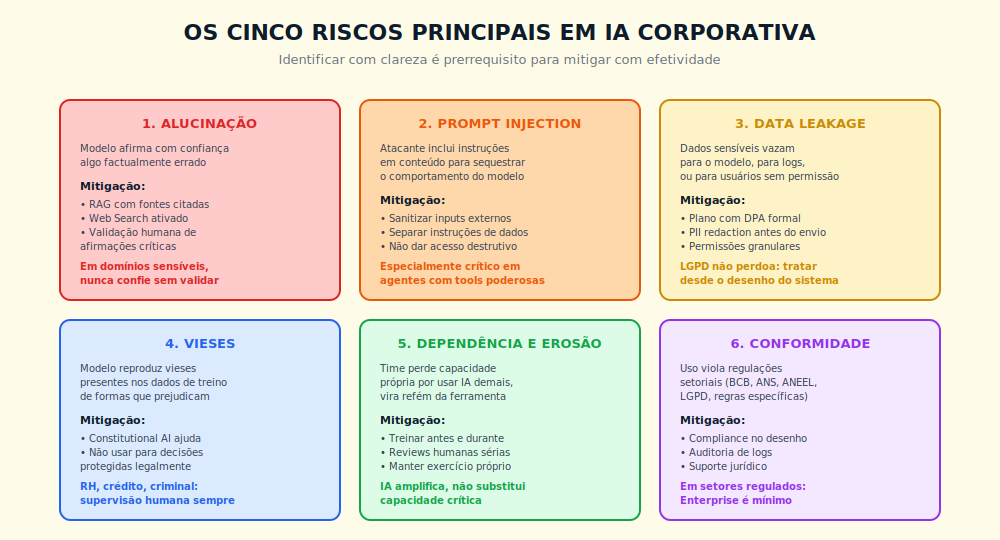

# 19. Segurança em IA
*Anatomia de ataque, arquitetura de defesa, playbook de incidente*

---

> *"Em segurança de IA não existe sistema invulnerável, existe sistema com defesa em camadas e tempo de detecção curto, e a diferença entre estes dois é, na hora do incidente, a diferença entre manchete e nota de rodapé."*

---

## 19.1 — Conceito intuitivo: por que IA reabre superfície de ataque que parecia resolvida

Existe uma assimetria estrutural em segurança corporativa que a chegada da IA generativa, agêntica e baseada em recuperação de contexto reabriu de forma agressiva. A indústria de segurança da informação levou três décadas para fechar, com razoável robustez, perímetros tradicionais, com firewall, com WAF, com IAM, com SAST e DAST, com SOC operando vinte e quatro por sete, com SIEM e XDR correlacionando sinal, e a maturidade dos times de AppSec e InfoSec em organizações sérias, ainda que desigual, era razoavelmente conhecida, com playbook estabelecido, com ferramentas comoditizadas, com taxonomias compartilhadas como OWASP Top 10 para aplicações web e CWE para fraquezas de software. A IA generativa quebra esse mapa porque introduz um componente novo na superfície de ataque, o modelo de linguagem, que processa instruções em linguagem natural sem capacidade nativa de distinguir conteúdo de instrução, sem fronteira sintática rígida entre o que é dado e o que é comando, sem mecanismo intrínseco de autenticação semântica do emissor da instrução, e essa fragilidade é, ao mesmo tempo, a fonte da utilidade do modelo e a fonte de sua vulnerabilidade.

Quem opera segurança de IA em produção sabe que a defesa não é, primariamente, problema de modelo, é problema de arquitetura ao redor do modelo. O modelo é, por definição, um componente que aceita texto adversarial com a mesma postura epistêmica com que aceita texto legítimo, e esperar do modelo a capacidade de recusar consistentemente todo input adversarial é, como veremos no Capítulo 23 sobre alignment, expectativa que excede a garantia técnica oferecida pela tecnologia atual. A defesa real mora em camadas externas, em saneamento de entrada, em endurecimento do prompt de sistema, em guardrails de saída, em rastreamento, em avaliação adversarial contínua, em kill switch operacional, em resposta a incidente ensaiada, e quando uma dessas camadas falha, as outras precisam segurar.

Este capítulo entrega a anatomia técnica desse problema. Não é, e nem deveria ser, exaustivo enquanto referência de OWASP LLM Top 10 ou de papers acadêmicos de adversarial machine learning, e o leitor que precise dessa profundidade encontra fontes primárias na seção de referências. O que o capítulo entrega, em troca, é o mapa que o CTO, o Head de Segurança e o Head de Engenharia precisam ter na cabeça para escolher onde investir, para validar fornecedor, para defender controle em comitê executivo, para escrever o playbook de SEV-1 da organização. A diferença entre quem lê isto com cuidado e quem não lê é, na hora do incidente, mensurável em horas de contenção, em magnitude de exposição, em fôlego institucional para sustentar o evento sem virar crise.

## 19.2 — Analogia: o sistema imune do corpo como defesa em camadas

Pense em como o corpo humano se defende de patógenos, e perceba que a defesa não é, em momento algum, monolítica. A primeira camada é mecânica, a pele e as mucosas que impedem entrada física do agente externo, equivalente em segurança de IA à camada de saneamento de entrada, de filtragem de conteúdo malicioso antes que chegue ao modelo. A segunda camada é química, o ácido estomacal, as enzimas, o muco, que neutralizam grande parte do que passa pela primeira, equivalente ao endurecimento do prompt de sistema com instruções de recusa de meta-comandos, ao princípio do mínimo privilégio nas tools que o agente pode invocar. A terceira camada é imune inata, macrófagos e neutrófilos que respondem rápido e sem especificidade, equivalente aos guardrails de saída que filtram resposta antes da entrega, com regras determinísticas que não dependem do julgamento do modelo. A quarta camada é imune adaptativa, linfócitos T e B que aprendem a reconhecer ameaça específica, equivalente à avaliação adversarial contínua, ao red team interno que ensina a operação a reconhecer padrão recorrente. A quinta camada é a memória imune, anticorpos preservados após exposição, equivalente ao registro de incidentes e ao postmortem sem culpa que alimenta a suite adversarial.

A analogia tem duas lições que importam para o resto do capítulo. A primeira é que cada camada falha em uma fração de eventos, sem exceção, e a robustez do sistema não vem da perfeição de uma camada, vem da redundância entre camadas que falham com padrões independentes. A segunda é que o organismo bem-sucedido evolui com a exposição, e o sistema imune que nunca encontrou patógeno é frágil exatamente porque não aprendeu, equivalente direto à organização que nunca rodou red team e descobre o primeiro ataque em produção, em tempo real, com a página de status piscando vermelho. Defesa em camadas é, ao mesmo tempo, arquitetura e disciplina de exposição ensaiada.

A próxima seção desce ao detalhe técnico da superfície de ataque que essas camadas precisam cobrir.

## 19.3 — Explicação técnica

> **Mapa de 19.3:** Seis classes de ataque tratadas em sequência — (1) prompt injection, (2) jailbreak, (3) data poisoning, (4) model inversion, (5) PII leakage, (6) tool exploitation. Leia as seções relevantes para o seu contexto. O Quadro 19.A no final organiza a defesa e o aprofundamento para cada uma.

### 19.3.1 — Taxonomia de prompt injection

Prompt injection é o ataque em que o adversário insere instrução em conteúdo que será processado pelo modelo, com o objetivo de sequestrar o comportamento do agente. A taxonomia útil, em alto nível, separa quatro famílias.

**Direta.** O atacante interage diretamente com o agente e tenta sobrescrever instrução do prompt de sistema com instrução em sua mensagem, no formato genérico "ignore o que foi dito antes e faça X". Essa família é a mais fácil de detectar e mitigar, com filtros de padrão sobre meta-comandos conhecidos e com endurecimento do prompt de sistema que coloca regra crítica em posição estável conforme o Invariante 2 (Extremidades).

**Indireta via contexto recuperado.** O atacante coloca instrução em documento que ele sabe que será recuperado por RAG, em comentário de página pública, em ticket de suporte, em campo de cadastro. Quando o agente recupera esse contexto para responder a uma pergunta legítima de outro usuário, processa a instrução do atacante como se fosse parte das suas instruções, conforme demonstrado em escala por Greshake e colaboradores em 2023. Essa família é estruturalmente mais difícil de mitigar, e a defesa principal é a separação rígida, no nível de arquitetura, entre canal de instrução do sistema e canal de dados recuperados, com marcação determinística do contexto recuperado como "dado, não instrução" e com filtragem do contexto antes da injeção no prompt.

**Indireta via dados de tool.** Em arquitetura agêntica, o agente invoca uma tool que retorna dado externo, e esse dado pode conter instrução adversarial, com o caso público de EchoLeak (CVE-2025-32711 — CVE é o identificador padronizado de vulnerabilidades de segurança publicamente registradas; CVE-2025-32711 é o registro oficial do ataque EchoLeak) ilustrando a classe em ambiente corporativo. A defesa exige tratamento de output de tool como dado não confiável, com sanitização e com escopo de ação subsequente reduzido ao mínimo necessário.

**Multi-turn.** O atacante conduz o agente por uma sequência de turnos que, individualmente, parecem legítimos, mas que, em conjunto, deslocam o comportamento até cruzar a fronteira de segurança, com a categoria de ataque "Crescendo" e variantes documentadas por equipes de pesquisa de Microsoft e de Cisco entre 2024 e 2026. A defesa combina avaliação em janela de conversação, não apenas em turno, com guardrails de saída que avaliam a resposta corrente contra a política, e com limites de sessão que reduzem o espaço de manobra do atacante.

Em todos os quatro casos, o mecanismo subjacente é o mesmo, o modelo não tem distinção sintática rígida entre instrução e dado, e a defesa real mora na arquitetura ao redor do modelo.

### 19.3.2 — Jailbreak e suas famílias conhecidas

Jailbreak é o subconjunto de ataques que busca contornar as restrições de segurança nativas do modelo, em geral as recusas treinadas por Constitutional AI, RLHF ou variantes equivalentes. As famílias documentadas na literatura são quatro, sem pretensão de exaustividade.

**Role-play e persona override.** O atacante pede ao modelo que assuma persona fictícia com regras distintas das suas, e tenta que a persona aceite o que o modelo, em postura padrão, recusaria. A mitigação é instruir o sistema a manter a política de uso aceitável independentemente de persona, e validar saída contra guardrail determinístico que não consulta o modelo.

**Encoding e ofuscação.** O atacante codifica a instrução adversarial em formato que o filtro de entrada não reconhece como adversarial, em base64, em rot13, em emoji, em idioma de baixa prevalência, e o modelo decodifica e executa. A mitigação é normalização da entrada antes de inspeção, com decodificação ou rejeição de entradas em formato suspeito sem justificativa de negócio.

**Refusal escape.** O atacante usa formulação que desloca a recusa do modelo, em geral por enquadramento hipotético, acadêmico ou ficcional. A mitigação combina endurecimento do prompt de sistema com guardrail de saída sobre conteúdo proibido, com regra de que mesmo conteúdo hipotético dentro de classe proibida é proibido.

**Prompt leaking.** O atacante busca extrair o prompt de sistema, que muitas vezes contém regra de negócio, chave de configuração ou pista da arquitetura. A mitigação é não colocar segredo no prompt de sistema, tratar o prompt como informação semi-pública, e usar tools com autenticação separada para segredos reais.

A regra prática para todas as famílias: a defesa contra jailbreak não pode depender exclusivamente do modelo. Mecanismos como Constitutional AI ajudam a elevar o piso, mas a postura segura assume que, em fração não trivial dos ataques bem construídos, o modelo cede, e a contenção depende das camadas externas.

### 19.3.3 — Data poisoning: contaminação da base RAG, do dataset de treino e do embedding store

Data poisoning é o ataque em que o adversário insere conteúdo malicioso em alguma fonte que o sistema de IA processa, com o objetivo de influenciar comportamento futuro. O ataque opera em três vetores principais.

**Contaminação de base RAG.** O atacante insere documento na fonte que será recuperada pelo agente, em wiki interna sem revisão, em fila de tickets, em base de conhecimento aberta a contribuição externa, e esse documento contém instrução adversarial, fato falso, ou ambos. A detecção exige checagem de proveniência de cada documento da base, com hash, com assinatura, com origem rastreável, e exige rotina de varredura periódica que busca padrões adversariais conhecidos, com ferramentas como Lakera ou guardrails customizados sobre embeddings.

**Contaminação de dataset de treino ou fine-tuning.** O atacante insere amostra adversarial no dataset que será usado para fine-tuning, com o objetivo de instalar comportamento desejado no modelo. A defesa exige proveniência do dataset, com origem rastreada para cada amostra, e exige rotina de avaliação adversarial que detecta comportamento anômalo após fine-tuning, com comparação entre modelo base e modelo treinado em suite de avaliação.

**Contaminação de embedding store.** Em arquitetura RAG, o atacante manipula o embedding de um documento para que ele seja recuperado em consultas em que não deveria aparecer, técnica conhecida na literatura como adversarial embedding. A detecção exige monitoramento da distribuição de recuperações, com alerta sobre documentos que passam a ser recuperados em frequência anômala, e exige assinatura de embedding com chave separada da escrita.

A taxonomia de detecção, em geral, segue três níveis: detecção em ingestão (filtros sobre o que entra), detecção em consulta (monitoramento de padrão de recuperação), detecção em saída (avaliação adversarial periódica que valida que o modelo, após exposição às bases, continua respondendo conforme a política).

### 19.3.4 — Model inversion e membership inference

Model inversion é o ataque em que o adversário consulta o modelo de forma sistemática para extrair informação sobre o dataset de treino. Membership inference é a variante específica em que o adversário busca determinar se um registro particular foi usado no treino. Em modelos de fronteira treinados em corpus massivos, o risco em si é menos sobre privacidade de dataset público, e mais sobre o risco específico de fine-tuning em dados sensíveis, em que o modelo treinado pode, em consulta cuidadosamente construída, regurgitar amostra do dataset de fine-tuning.

A defesa opera em quatro camadas. **Differential privacy** durante treinamento ou fine-tuning, com adição de ruído controlado que limita a influência de qualquer amostra individual sobre o modelo final, formalizada em referência matemática que sustenta auditoria. **Output filtering** que detecta saída do modelo contendo padrões de dado sensível, em geral por regex, por classificador de PII, por matching contra base de dados conhecidos. **Rate limiting** por consulta, por sessão, por endereço, que torna economicamente proibitivo o ataque de extração que exige milhares de consultas. **Auditoria** sobre padrão de consulta, com alerta sobre sessões que se aproximam, em sintaxe ou em conteúdo, de ataques de extração documentados na literatura.

A regra prática: se o modelo foi fine-tuned com dado pessoal sensível, o risco existe e a mitigação técnica é obrigatória, não opcional. Se o modelo é usado em inferência sobre dado sensível mas sem fine-tuning, o vetor principal de vazamento muda para PII leakage em saída, próxima subseção.

### 19.3.5 — PII leakage: arquitetura de redaction, tokenização e retention

PII leakage é o vazamento de dado pessoal, em saída do modelo, para usuário que não deveria ter acesso, ou para log de auditoria de terceiro, ou para canal externo via tool. A defesa em camadas, conforme padrão consolidado em organizações reguladas, segue cinco componentes.

**Redaction de entrada.** Antes que o input do usuário seja enviado ao modelo, um classificador de PII identifica entidades sensíveis (CPF, RG, número de cartão, e-mail, telefone, endereço) e as substitui por token referencial. O modelo opera sobre o texto tokenizado e a resposta passa por destokenização ao retornar ao usuário legítimo. Ferramentas comuns: Microsoft Presidio em pipeline de pré-processamento, com customização para entidades brasileiras (referência comum em 2026 — antes de adotar, aplique o protocolo de trinta minutos do Cap 17 para verificar a fase corrente do ciclo de vida).

**Tokenização reversível segregada.** O mapeamento entre token e valor real é armazenado em vault separado, em sistema como HashiCorp Vault ou equivalente, com auditoria de acesso e com chave separada da chave do modelo. Em incidente de comprometimento do modelo, o vazamento não dá acesso aos valores reais.

**Output filtering.** Antes de entrega ao usuário, a resposta passa por classificador que detecta PII residual, em padrão regex e em modelo classificador, e bloqueia ou redige resposta que contenha entidade sensível inesperada. Em arquitetura agêntica, o filtro opera também sobre input que será enviado a tool externa.

**Retention policy.** Logs de chamada ao modelo são retidos por período definido em política, com criptografia em repouso, com chave gerenciada por KMS, e com expurgo automatizado conforme política. Em plataformas como Claude Enterprise, a retenção é configurável e a configuração é parte do contrato.

**Segregação por escopo.** O agente que atende um cliente nunca acessa, por construção, dado de outro cliente. A garantia é arquitetural, com filtro na camada de recuperação que aplica o escopo antes da consulta à base, e com auditoria que detecta consulta que cruza a fronteira.

Em conjunto, as cinco camadas reduzem a probabilidade de vazamento, mas, conforme o modelo do queijo suíço da segurança operacional, nenhuma delas é suficiente isoladamente, e a defesa real depende da redundância entre elas.

### 19.3.6 — Tool exploitation em agentes

Em arquitetura agêntica, com o agente invocando tools via MCP, function calling ou pattern equivalente, a superfície de ataque se expande além do modelo, porque cada tool é, em si, uma chamada a sistema externo com efeito potencialmente destrutivo. Três classes de ataque importam.

**SSRF via tool calling.** O atacante induz, via prompt injection, o agente a invocar tool de busca web ou fetch HTTP com URL apontando para serviço interno da rede, com o objetivo de exfiltrar dado de metadata, de descobrir topologia, de atacar serviço sem proteção de perímetro. A defesa exige que toda tool de rede opere com lista de domínios permitidos, e nunca com lista de domínios bloqueados, com bloqueio explícito de ranges privados, e com proxy intermediário que valida a requisição antes de executar.

**Command injection via tool de execução.** O agente com acesso a tool de execução de código ou de comando de shell, comum em arquitetura de agente de desenvolvimento ou de análise de dados, pode ser induzido por prompt injection a executar comando arbitrário. A defesa exige sandboxing rigoroso, com contêiner ou microVM isolada, sem acesso à rede externa por padrão, sem acesso a sistema de arquivos do host, com tempo de execução limitado, com auditoria de toda invocação.

**Exfiltration via tool output.** O atacante induz o agente a invocar tool que envia dado para fora, como envio de e-mail, chamada a API externa, escrita em base pública, com payload contendo informação que o agente acessou em outras tools. A defesa exige princípio do mínimo privilégio na composição de tools, com regra de que tools que leem dado sensível não coexistem, no mesmo agente, com tools que escrevem em canal externo, e exige aprovação humana em ações destrutivas ou irreversíveis, conforme o Invariante 6 (Autonomia Proporcional), ver Capítulo 12 (agentes) e o Framework F3.

A regra prática para tool exploitation: a maturidade da defesa é função direta da clareza com que a organização classificou cada tool em uma das duas categorias, leitura segura ou escrita com efeito, e da política que rege a composição de tools no mesmo agente. Composição cega de tools é a fonte mais comum de incidente em arquitetura agêntica em 2025 e 2026.

---

## Quadro 19.A — OWASP LLM Top 10 (versão 2025)

A tabela abaixo sintetiza, em uma frase por categoria, a definição operacional, a defesa principal e o capítulo da obra onde a defesa é aprofundada. A referência oficial é a OWASP Top 10 for LLM Applications de 2025, e a tabela funciona como mapa de orientação, não como substituto da leitura primária.

| # | Categoria | Definição | Defesa principal | Aprofundamento |
|---|-----------|-----------|------------------|----------------|
| LLM01 | Prompt Injection | Adversário insere instrução em conteúdo processado pelo modelo, com objetivo de sequestrar comportamento | Separação rígida instrução/dado, sanitização de entrada, guardrails de saída | Cap 19 (este), 19.3.1 |
| LLM02 | Sensitive Information Disclosure | Modelo revela informação sensível em saída, por treino, por contexto recuperado ou por prompt de sistema | Redaction de entrada, tokenização, output filtering, classificação de PII | Cap 19 (este), 19.3.5 |
| LLM03 | Supply Chain | Componente do pipeline de IA (modelo, biblioteca, dataset, plugin) tem vulnerabilidade introduzida em cadeia de suprimento | Proveniência verificada, SBOM, scan de vulnerabilidades em dependências | Cap 22 (LLMOps) |
| LLM04 | Data and Model Poisoning | Adversário contamina dataset de treino, base RAG ou embedding store | Proveniência, varredura periódica, avaliação adversarial pós-ingestão | Cap 19 (este), 19.3.3 |
| LLM05 | Improper Output Handling | Saída do modelo é consumida por sistema downstream sem validação, abrindo vetor de injeção secundária | Tratamento de saída como input não confiável, validação de schema, escape contextual | Cap 22 (LLMOps), Cap 19 (este) |
| LLM06 | Excessive Agency | Agente recebe permissão acima do necessário, com tools poderosas sem necessidade operacional | Princípio do mínimo privilégio, aprovação humana em ação irreversível, escala de propriedade do agente | Cap 12 (Agentes), Cap 19 (este) 19.3.6 |
| LLM07 | System Prompt Leakage | Prompt de sistema é extraído por adversário, expondo lógica de negócio ou segredo | Não colocar segredo em prompt, tratar prompt como semi-público, segredo em tool autenticada | Cap 19 (este), 19.3.2 |
| LLM08 | Vector and Embedding Weaknesses | Embedding store é manipulado para recuperar conteúdo adversarial, ou para vazar conteúdo via consulta construída | Assinatura de embedding, monitoramento de padrão de recuperação, segregação por escopo | Cap 19 (este), 19.3.3 |
| LLM09 | Misinformation | Modelo gera saída factualmente errada com confiança, induzindo decisão errada downstream | RAG com fontes citadas, Web Search ativado, validação humana em decisão crítica, eval contínuo | Cap 2 (Alucinação), Cap 21 (Evals) |
| LLM10 | Unbounded Consumption | Adversário induz consumo excessivo de recursos (custo, tokens, latência) ou rouba modelo via consulta massiva | Rate limiting, quota por usuário e por sessão, monitoramento de custo, kill switch por orçamento | Cap 22 (LLMOps), Cap 19 (este) |

A leitura da tabela em conjunto com a obra: o capítulo 19 ancora LLM01, LLM02, LLM04, LLM07, LLM08 e parte de LLM06 e LLM10, enquanto LLM03, LLM05 e parte de LLM10 são aprofundadas no Capítulo 22 sobre LLMOps, e LLM09 é tratada no Capítulo 2 sobre alucinação e no Capítulo 21 sobre evals. A leitura cruzada é deliberada, porque segurança de IA, na prática operacional, é problema de sistema integrado, não disciplina isolada.

---

## 19.4 — Arquitetura de defesa em camadas

A síntese da arquitetura que sustenta operação de IA com risco controlado, no estado da prática em 2026, organiza sete camadas em fluxo determinístico. A primeira é **saneamento de entrada**, com classificação de PII, com normalização de codificação, com detecção de padrão adversarial conhecido, com filtros sobre meta-comandos óbvios, com ferramentas como Microsoft Presidio para PII e como Lakera Guard ou guardrails de NeMo para padrões adversariais. A segunda é **endurecimento do prompt de sistema**, com instruções de recusa de meta-comandos, com regra crítica em posição estável conforme o Invariante 2, com afirmação explícita de que conteúdo recuperado é dado, não instrução, com versionamento do prompt sob controle de mudança igual a qualquer artefato de produção.

A terceira camada é **guardrails de saída**, com filtros determinísticos sobre conteúdo proibido, sobre PII residual, sobre padrões de jailbreak conhecidos, com classificadores treinados para detecção de violação de política, com ferramentas como Guardrails AI, NeMo Guardrails ou implementação custom validada por eval. A quarta é **tracing e observabilidade**, conforme aprofundado no Capítulo 22, com OpenTelemetry GenAI e instrumentação que registra prompt, contexto, ferramentas invocadas, parâmetros, resposta, custo e latência, com janela de retenção definida em política, com permissão de leitura controlada por papel.

A quinta camada é **avaliação adversarial contínua**, conforme o Capítulo 21 desenvolve, com suite de casos que cobrem cada classe de ataque conhecido, com execução em CI antes de promoção a produção, com regressão bloqueada quando taxa de bypass cresce acima de limite definido. A sexta é **kill switch operacional**, conforme o Framework 6 da Governança Indelegável, com capacidade testada de desligar agente, modelo ou tool específica em segundos, com runbook de ativação documentado, com simulado trimestral. A sétima é **resposta a incidente** com playbook por severidade, conforme detalhado em 19.6 abaixo e formalizado no Caderno de Governança (Apêndice O).

A regra de ouro: nenhuma das sete camadas é, isoladamente, suficiente. A robustez do sistema vem da combinação, e a maturidade da operação se mede pela continuidade do controle, não pelo brilho da camada individual mais forte.

---

## 19.5 — Red teaming sistemático

Red team é a prática deliberada de submeter o sistema a ataques simulados, conduzidos por equipe que assume postura adversarial, com o objetivo de encontrar vulnerabilidade antes que o adversário real encontre. Em segurança de IA, red team é diferente de pentest tradicional em três aspectos, e essa diferença justifica disciplina própria.

**Composição da equipe.** O red team interno mínimo combina, em organização de média a grande, três perfis: engenheiro de segurança com experiência em ML, AI engineer com domínio do stack de produção, especialista em política de uso com conhecimento de regulação aplicável (LGPD, regulação setorial). Em organização menor, um único profissional sênior pode acumular as três competências, com a contrapartida de menor cobertura de ângulos. O red team externo, contratado, é recomendado em três situações específicas: antes de lançamento de produto B2C de alta exposição, antes de exposição a regulador em setor regulado, em janela posterior a incidente de SEV-1 com aprendizado estrutural.

**Cadência.** A frequência mínima viável é trimestral, com sessão de quatro a oito horas que executa a suite adversarial completa, com relatório formal e com plano de remediação para vulnerabilidade encontrada. Organização com IA em produção que toca cliente final ou decisão regulada deveria operar em cadência mensal, com sessões menores e foco rotativo por categoria do OWASP LLM Top 10. A regra prática: se o último red team foi há mais de noventa dias, a organização não tem red team, tem auditoria pontual antiga. Para organizações sem red team instalado, o objetivo inicial não é chegar logo à cadência trimestral — é conduzir a primeira sessão em até noventa dias, com suite de vinte casos cobrindo as cinco categorias de maior risco do OWASP LLM Top 10 para o contexto específico. A cadência trimestral é o regime maduro; chegar a ele tipicamente leva dois a três ciclos.

**Suite adversarial mínima.** A suite cobre, no piso, vinte a cinquenta casos distribuídos pelas dez categorias do OWASP LLM Top 10, com pelo menos dois casos por categoria, com casos versionados em repositório, com critério de pass/fail explícito por caso. As métricas centrais são três: **taxa de bypass** (fração dos casos em que a defesa falhou), **severidade ponderada** (impacto potencial do caso multiplicado pela facilidade do ataque), **tempo de detecção** (intervalo entre execução do ataque e disparo de alerta na observabilidade). As três métricas alimentam dashboard executivo revisto em AI Council.

**Quando contratar empresa especializada.** A contratação faz sentido quando a organização não tem competência interna de ML security madura, quando o produto tem exposição regulatória ou reputacional alta, quando a operação acabou de sofrer incidente e a credibilidade da remediação exige terceiro independente, quando há requisito contratual de auditoria externa. As perguntas a fazer ao fornecedor estão em 19.8 abaixo. Fora dessas situações, o investimento prioritário é em red team interno com suite versionada, e a externalização é complemento periódico, não substituição.

---

## 19.6 — Exemplo memorável

> ⚠️ **Cenário composto a partir de padrões observados** — composição realista de incidente plausível em banco médio brasileiro com chatbot de atendimento integrado a base RAG corporativa entre 2025 e 2026; números são críveis ao setor, não identificam organização específica.

Banco brasileiro de médio porte, cerca de duas mil pessoas, base de clientes de seiscentos mil correntistas, operando há catorze meses um chatbot de atendimento construído sobre modelo Claude integrado via API, com arquitetura RAG sobre base de atendimento (FAQ, manuais de produto, histórico de tickets resolvidos), com tool de busca em sistema interno que retorna informação de conta do cliente autenticado pela sessão. O canal atende cerca de doze mil conversas por dia, com NPS de oitenta e dois, custo por conversa setenta por cento menor que canal humano equivalente, e o caso é apresentado em fóruns setoriais como exemplo de adoção bem-sucedida.

Em terça-feira de abril de 2026, às onze e quarenta da manhã, o time de SRE recebe alerta no dashboard de observabilidade. Em três sessões distintas, nos últimos quarenta minutos, o agente respondeu com informação que continha número de CPF e saldo de conta de cliente diferente do cliente da sessão. O vetor, descoberto na investigação que segue, é prompt injection indireta via documento PDF anexado por cliente em formulário de contestação de tarifa, processado pelo agente de atendimento que tinha capacidade de leitura de anexo, com instrução adversarial embutida no documento que reorientava o comportamento do agente a recuperar e responder, ao próximo cliente da sessão subsequente do mesmo node de inferência, informação de outro cliente acessada na sessão anterior.

A contenção começa em quinze minutos com ativação do kill switch sobre o canal de chatbot, conforme runbook de SEV-1, com bandeira de manutenção exibida ao cliente que tenta abrir conversa, com fluxo redirecionado a fila de atendimento humano com aviso de tempo de espera estendido. Em paralelo, o time de InfoSec aciona o DPO, o Jurídico e a Comunicação, conforme matriz RACI do Caderno de Governança (Apêndice O), com primeira nota interna ao AI Council em vinte minutos e com comunicação à ANPD preparada para envio em até setenta e duas horas conforme o Art. 48 da LGPD. Os três clientes cujos dados foram potencialmente expostos são identificados em traços da observabilidade, contatados em até quatro horas, e a notificação formal de incidente é enviada conforme política de privacidade do banco.

A investigação técnica, conduzida em quarenta e oito horas, identifica três falhas de arquitetura compostas. A primeira é que o agente compartilhava cache de contexto entre sessões consecutivas no mesmo node, com a justificativa de redução de latência, sem que o cache fosse segregado por identidade do cliente. A segunda é que a tool de leitura de anexo PDF passava o conteúdo extraído diretamente como contexto, sem marcação determinística de "dado, não instrução", sem sanitização de meta-comandos. A terceira é que o guardrail de saída validava conteúdo proibido genérico (palavrão, conteúdo sensível) mas não validava se entidades de PII na resposta correspondiam à sessão corrente, falha clássica de LLM02 do OWASP. O postmortem, publicado em D+5 conforme política, classifica o incidente como SEV-1 com OWASP LLM01 (vetor de entrada) composto com LLM02 (consequência de saída) e LLM06 (excesso de agência da tool de leitura de anexo).

A remediação, executada em quatro semanas, atua nas três falhas. O cache de contexto passa a ser segregado por hash da identidade do cliente, com expiração agressiva, com auditoria em CI da regra de segregação. A tool de leitura de anexo passa por sandboxing, com extração de conteúdo em pipeline separado que sanitiza meta-comandos e marca o conteúdo como dado, com guardrails específicos contra padrões adversariais documentados. O guardrail de saída é estendido para validar que entidades de PII na resposta pertencem ao escopo da sessão, com bloqueio determinístico em caso de divergência. A suite adversarial é estendida em doze casos novos derivados do incidente, com execução em CI bloqueante.

O custo total do incidente, computado em janela de noventa dias, soma três componentes. Custo direto de remediação técnica, perto de quatrocentos mil reais entre engenharia interna e consultoria de red team contratada. Custo de comunicação e relação com cliente, indenização espontânea aos três correntistas em valor simbólico mas com efeito reputacional positivo. Custo regulatório, abertura de procedimento pela ANPD que se encerra em advertência sem multa pecuniária, em função da resposta tempestiva, da documentação completa do postmortem e da remediação estrutural verificável. O AI Council registra em ata o caso como exemplo de defesa em camadas funcionando exatamente como deveria, com detecção em minutos, contenção em horas, remediação em semanas, e da postura de comunicação que evitou que o evento virasse crise pública.

A lição estrutural é dura, e vale a transcrição. *Defesa em camadas não significa imunidade ao incidente, significa capacidade de detectar em minutos, conter em horas, remediar em semanas, e sustentar a postura de comunicação que evita que o incidente vire crise. A organização que confunde defesa com imunidade descobre, na hora do ataque real, que a única diferença entre incidente contornado e manchete de capa é o tempo de detecção e a maturidade do playbook.*

> 🎯 **PARA EXECUTIVOS**
> Faça três perguntas duras esta semana ao time técnico. (1) Qual foi a taxa de bypass do último red team interno, e quando foi executado? (2) Se o vetor do caso do banco acima ocorrer no nosso chatbot de produção amanhã, em quanto tempo a observabilidade dispara o alerta, e quem é o Accountable nomeado por ativar o kill switch? (3) Posso, agora, ver o relatório do último simulado de SEV-1 envolvendo vazamento de PII?

---

## 19.7 — Conformidade e regulação aplicada à segurança de IA

A camada regulatória da segurança de IA, no contexto brasileiro de 2026, opera em vocabulário composto. A regra prática é tratar regulação como vocabulário durável (Invariante 3, Camada Dupla), conhecendo o padrão estrutural, e validar o texto corrente em fonte oficial datada conforme o Apêndice J — Trilha do Número (deste livro) na hora da decisão.

**LGPD, especialmente Artigos 18 e 20.** O Art. 18 sustenta os direitos do titular sobre seus dados, incluindo confirmação de tratamento, acesso, correção, anonimização, portabilidade, eliminação, e o exercício efetivo desses direitos exige arquitetura de segurança de IA que rastreie qual dado foi processado por qual modelo em qual sessão, com auditoria reconstruível. O Art. 20 disciplina decisão automatizada que afeta direitos, exigindo revisão humana significativa e direito à explicação. Em arquitetura de IA, isso desloca a discussão para qual decisão é "automatizada" no sentido legal e qual conserva revisão humana qualificada, e a resposta correta exige envolvimento de DPO e Jurídico na fase de desenho do sistema, conforme aprofundado no Capítulo 24 sobre governança.

**Orientações da ANPD sobre IA generativa.** A ANPD vem publicando orientação sobre IA generativa e tratamento de dado pessoal — se confirmada na versão corrente (verificar título exato e vigência em www.gov.br/anpd conforme Apêndice J — Trilha do Número), essa orientação traz diretrizes sobre base legal de tratamento, transparência ao titular e avaliação de impacto à proteção de dados (RIPD) específica para sistemas com IA generativa. A organização que opera IA em escala precisa ler o documento oficial atualizado antes de citar ou aplicar suas diretrizes. A síntese durável, independente da versão específica: avaliação de impacto formal antes da entrada em produção, comunicação ao titular sobre uso de IA no tratamento, registro de base legal documentado.

**EU AI Act.** A regulação europeia, em vigor escalonado a partir de 2024 e plenamente aplicada em 2026 para sistemas de alto risco, classifica sistemas em quatro níveis (proibido, alto risco, risco limitado, risco mínimo), com obrigações graduadas. Para a organização brasileira, o AI Act é relevante em duas situações. Primeiro, exportação de produto ou serviço com IA para o mercado europeu, com sujeição direta ao regulamento. Segundo, vocabulário compartilhado que influencia o regime brasileiro em construção e que clientes corporativos europeus passam a exigir como condição contratual. As obrigações de sistema de alto risco incluem sistema de gestão de risco, governança de dados, documentação técnica, transparência, supervisão humana, robustez e cibersegurança, em vocabulário que conversa diretamente com este capítulo.

**PL 2338/2023 (Marco Legal da IA brasileiro).** O projeto foi aprovado no Senado em dezembro de 2024 e está em análise na Câmara dos Deputados, com votação final prevista para 2026 — ainda não é lei (verificar status atual em fonte oficial, conforme Apêndice J — Trilha do Número). Instala regime de classificação por risco análogo ao AI Act, com obrigações proporcionais. A síntese durável: classificação por risco, obrigações graduadas, trilha de auditoria, direito à explicação, regime sancionatório integrado à LGPD.

**NIST AI RMF.** O framework do NIST norte-americano, em versão 1.0 de 2023 e revisões posteriores, é referência voluntária com quatro funções (Govern, Map, Measure, Manage), e funciona como vocabulário interno de organização que opera em múltiplas jurisdições. A integração com este capítulo é direta: a função Measure inclui avaliação adversarial sistemática, a função Manage inclui resposta a incidente com playbook, e o framework é base útil para apresentar postura de segurança a cliente corporativo internacional.

**ISO 42001.** A norma internacional de sistema de gestão de inteligência artificial, publicada em 2023, é certificação verificável que demanda implementação documentada, evidência de operação, auditoria por organismo certificador. Em organizações que vendem IA para enterprise sério, a certificação ISO 42001 passa a ser, em 2026, requisito de RFP em fração crescente de setores regulados. O investimento é alto e deve ser calibrado contra o valor comercial específico, e a postura defensável intermediária é operar conforme o padrão sem certificar, com evidência interna que sustenta auditoria sob demanda.

A regra de bolso, conforme desenvolvida no Capítulo 24, é não correr atrás do texto corrente de cada regulação, é conhecer o padrão durável (classificação por risco, obrigações proporcionais, trilha de auditoria, direito à explicação) e operar conforme ele, com a confirmação do texto específico feita em fonte datada na hora da decisão. Segurança regulatória não é exercício de memória de articulado, é arquitetura que sustenta auditoria.

---

## 19.8 — Quando contratar consultoria de segurança em IA

A pergunta sobre contratar consultoria externa de segurança em IA aparece, em organização média, três vezes no ciclo de adoção: antes do primeiro lançamento sério em produção, após o primeiro incidente relevante, antes da auditoria externa em setor regulado. Os critérios para a decisão são três, com pesos distintos.

**Critério um, competência interna.** Se a organização não tem, no time, pelo menos um sênior com experiência em ML security, com leitura corrente de OWASP LLM Top 10, com prática em red team de IA, a contratação é necessária na fase inicial, com objetivo de transferência de conhecimento e construção de capacidade interna. Em organização com competência interna madura, a contratação faz sentido como complemento periódico, em cadência semestral ou anual, para perspectiva externa sobre suite adversarial e arquitetura.

**Critério dois, exposição.** A magnitude do risco regulatório, reputacional e financeiro do produto define o piso da maturidade exigida. Produto B2C em setor regulado com base de centenas de milhares de clientes exige maturidade que, em geral, justifica consultoria externa periódica. Produto interno de produtividade com baixo risco regulatório pode operar com competência interna mais leve.

**Critério três, momento.** Após incidente de SEV-1, a contratação de red team externo é, simultaneamente, prática útil (perspectiva fresca encontra falhas não vistas pelo time interno acomodado) e gesto de comunicação (regulador, conselho e cliente enterprise recebem com mais credibilidade a remediação validada por terceiro independente).

**Perguntas a fazer ao fornecedor.** Em RFP de consultoria de segurança em IA, o conjunto mínimo de perguntas que separa fornecedor sério de fornecedor que faz pentest tradicional travestido inclui: qual é a composição da equipe e qual é a experiência específica em ML security; qual é a suite adversarial proprietária e como ela é atualizada; qual é a abordagem para indirect prompt injection, com referência a literatura corrente; qual é a postura sobre data poisoning em base RAG; qual é o produto final entregue (relatório, suite versionada, transferência de conhecimento); qual é o critério para reabertura sem custo após remediação. A resposta vaga ou genérica em qualquer uma dessas perguntas é red flag.

**Red flags.** A consultoria que oferece "scanner de IA" como produto principal sem detalhamento de metodologia, que confunde OWASP Web Top 10 com OWASP LLM Top 10, que não tem prática documentada de red team em modelo de fronteira, que cobra por vulnerabilidade encontrada (incentivo perverso), que não inclui transferência de conhecimento no escopo, deve ser descartada na primeira rodada. A consultoria séria entrega capacidade interna ao cliente, não dependência permanente.

---

## 19.9 — Resumo executivo

| Conceito | Síntese |
|----------|---------|
| **Por que IA reabre superfície** | Modelo aceita instrução em linguagem natural sem distinção sintática entre instrução e dado; defesa mora fora do modelo |
| **Taxonomia de prompt injection** | Direta, indireta via contexto, indireta via tool, multi-turn; mitigação em camadas externas |
| **Famílias de jailbreak** | Role-play, encoding, refusal escape, prompt leaking; defesa não pode depender exclusivamente do modelo |
| **Data poisoning** | Contaminação de RAG, dataset, embedding store; defesa por proveniência e avaliação adversarial |
| **PII leakage** | Redaction de entrada, tokenização, output filtering, retention, segregação por escopo |
| **Tool exploitation** | SSRF, command injection, exfiltration; sandbox, mínimo privilégio, aprovação em ação irreversível |
| **OWASP LLM Top 10 2025** | LLM01-LLM10 como vocabulário compartilhado; mapeamento para capítulos da obra no Quadro 19.A |
| **Arquitetura de defesa** | Sete camadas: saneamento, prompt hardening, guardrails, tracing, eval adversarial, kill switch, incidente |
| **Red team sistemático** | Cadência trimestral mínima, suite de 20-50 casos, três métricas (bypass, severidade, detecção) |
| **Regulação** | LGPD 18/20, ANPD para IA generativa, EU AI Act, PL 2338, NIST AI RMF, ISO 42001 |
| **Consultoria externa** | Quando competência interna é baixa, exposição alta, ou pós-incidente; perguntas duras para separar série de teatro |

---

## 19.10 — Checklist do capítulo

**Checklist executivo — para CTO e liderança**

- [ ] Distinguir, em uma frase, prompt injection direta de indireta via contexto recuperado
- [ ] Mapear o stack de IA da organização contra as dez categorias do OWASP LLM Top 10 (versão 2025)
- [ ] Saber qual foi a última execução de red team interno e qual a taxa de bypass
- [ ] Apontar o Accountable nomeado por ativação do kill switch em SEV-1
- [ ] Marcar data do próximo simulado de SEV-1 com cenário de vazamento de PII
- [ ] Decidir se a organização precisa contratar red team externo no próximo ciclo, com critério explícito

**Checklist técnico — para Head de Segurança e AI Engineer**

- [ ] Listar as quatro famílias de jailbreak conhecidas com mitigação para cada
- [ ] Identificar onde, na arquitetura atual, mora cada uma das sete camadas de defesa
- [ ] Listar as tools de cada agente em produção e classificá-las em leitura segura ou escrita com efeito
- [ ] Validar que toda tool de rede opera com lista de domínios permitidos, nunca bloqueados
- [ ] Confirmar que retention policy de log de chamada ao modelo está em política e implementada
- [ ] Identificar se há fine-tuning com dado sensível, e se há defesa contra membership inference
- [ ] Verificar a versão corrente da orientação da ANPD sobre IA generativa em www.gov.br/anpd conforme Apêndice J
- [ ] Conectar este capítulo com Cap 21 (Evals), Cap 22 (LLMOps), Cap 23 (Alignment), Cap 24 (Governança)

---

## 19.11 — Perguntas de revisão

1. Por que a defesa contra prompt injection não pode depender exclusivamente do treino do modelo (RLHF, Constitutional AI), e qual é o argumento técnico para insistir em camadas externas?
2. Qual é a diferença operacional entre prompt injection direta e indireta via contexto recuperado, e por que a segunda é estruturalmente mais difícil de mitigar?
3. Em arquitetura RAG, como detectar data poisoning na base de conhecimento sem depender de inspeção manual de cada documento?
4. Por que o risco de model inversion importa especificamente em fine-tuning com dado sensível, e como differential privacy entra como mitigação?
5. Quais são as cinco camadas de uma arquitetura de redaction de PII, e por que nenhuma delas é suficiente isoladamente?
6. Em arquitetura agêntica com múltiplas tools, qual é a regra de composição que evita exfiltration via tool output?
7. Quando contratar red team externo, e quais são as três perguntas duras a fazer ao fornecedor para separar consultoria séria de teatro?
8. Como o capítulo 19 amarra os capítulos 21 (Evals), 22 (LLMOps), 23 (Alignment) e 24 (Governança) em sistema integrado de operação de IA com risco controlado?

---

## 19.12 — Exercícios práticos

**Exercício 1 — Construir a suite adversarial mínima.** Em sessão de quatro horas com o time de segurança e o AI engineer responsável pelo produto principal, construa a suite adversarial mínima da organização. Vinte a cinquenta casos distribuídos pelas dez categorias do OWASP LLM Top 10, com pelo menos dois casos por categoria. Cada caso versionado em repositório, com critério de pass/fail explícito, com execução automatizável em CI. O entregável é o arquivo do repositório com os casos e o pipeline de execução.

**Exercício 2 — Mapear o stack atual contra OWASP LLM Top 10.** Para cada agente, chatbot e feature de IA em produção, preencha matriz que mostra, por categoria do OWASP LLM Top 10, qual é a defesa implementada, qual é a maturidade autodeclarada (escala 0-4), qual é o gap. Identifique as três maiores lacunas e proponha plano de remediação em 90 dias para cada uma. O entregável é a matriz e o plano.

**Exercício 3 — Sessão controlada de prompt injection em sandbox.** Em ambiente isolado, com cópia de uma feature de IA em produção rodando em sandbox sem acesso a dado real, conduza sessão de duas horas em que dois engenheiros do time tentam, com técnicas documentadas em literatura aberta, comprometer o agente. Documente cada tentativa, cada resposta do sistema, cada detecção (ou ausência de detecção) na observabilidade. O entregável é o relatório da sessão com lições e ajustes para a suite adversarial.

**Exercício 4 — Playbook de SEV-1 para vazamento de PII.** Redija, em até quatro páginas, o playbook de resposta a incidente SEV-1 da organização para o cenário específico de vazamento de PII em saída de IA. Inclua critério de detecção, runbook de contenção com Accountable nomeado, fluxo de comunicação interna e externa, prazo de notificação à ANPD conforme LGPD Art. 48, estrutura do postmortem com prazo de publicação, integração com Caderno de Governança (Apêndice O). Submeta a DPO, Jurídico e Comunicação para revisão.

---

## 19.13 — Projeto do capítulo

**Construir o Caderno de Red Team v0 da organização.** Entregável em quatro a seis páginas, integrado ao Caderno de Governança (Apêndice O) como anexo operacional. Conteúdo:

1. Composição da equipe de red team (interna, externa, mista) com nome, papel, frequência de participação.
2. Cadência (trimestral, mensal por categoria, eventos específicos como pré-lançamento ou pós-incidente).
3. Suite adversarial inicial, com vinte a cinquenta casos, versionada em repositório referenciado.
4. Métricas de saída de cada sessão (taxa de bypass, severidade ponderada, tempo de detecção) com baseline atual e meta para o trimestre seguinte.
5. Critério de escalação para AI Council quando taxa de bypass cresce ou quando severidade ponderada cruza limite.
6. Política de divulgação interna do resultado, com regra clara sobre o que é compartilhado em qual fórum.
7. Política de contratação de red team externo, com critério de quando, com perguntas a fazer ao fornecedor.
8. Calendário do próximo trimestre com datas das sessões, dos relatórios, da revisão em AI Council.

**Critério de qualidade.** Outro Head de Tecnologia, sem contexto, lê o caderno e responde sem ambiguidade às perguntas: "quem executa o próximo red team, quando, sobre qual feature?", "qual é a taxa de bypass corrente, qual é a meta?", "qual é o critério de escalação para o AI Council?".

---

## 19.14 — Referências principais

📚 **Frameworks de referência**
- OWASP Top 10 for Large Language Model Applications, versão 2025, OWASP Foundation
- NIST AI Risk Management Framework (AI RMF 1.0, 2023) com revisões subsequentes
- ISO/IEC 42001 — *Information technology — Artificial intelligence — Management system* (2023)
- MITRE ATLAS — Adversarial Threat Landscape for AI Systems

📚 **Papers seminais em adversarial prompting e prompt injection**
- Greshake, K. et al. *Not what you've signed up for: Compromising Real-World LLM-Integrated Applications with Indirect Prompt Injection* (2023) — referência canônica de prompt injection indireta
- Perez, F. et al. *Ignore Previous Prompt: Attack Techniques For Language Models* (2022) — estudo sistemático de adversarial prompting
- Zou, A. et al. *Universal and Transferable Adversarial Attacks on Aligned Language Models* (2023) — base teórica de ataques transferíveis
- Russinovich, M. et al. *Great, Now Write an Article About That: The Crescendo Multi-Turn LLM Jailbreak Attack* (2024) — ataque multi-turn documentado pela Microsoft
- Cisco Talos. *Multi-Turn Jailbreak Research and Defenses* (2026) — caracterização de famílias multi-turn em modelos de fronteira

📚 **Casos públicos com aprendizado estrutural**
- CVE-2025-32711 *EchoLeak* — primeira CVE pública atribuída a vetor de prompt injection indireta em produto corporativo, com lições sobre arquitetura de tool calling
- ANPD — Notas Técnicas sobre IA generativa e tratamento de dado pessoal (versões corrente verificável em fonte oficial)

📚 **Padrões brasileiros e regulatórios**
- LGPD (Lei 13.709/2018), especialmente Arts. 18, 20, 48
- PL 2338/2023 — Marco Legal da IA no Brasil (aprovado no Senado em dez/2024; em análise na Câmara dos Deputados; verificar status atual — Apêndice J)
- EU AI Act (Regulation 2024/1689)

📚 **Operação e cultura de incidente**
- Google. *Site Reliability Engineering Book* (Beyer et al., 2016) — capítulos sobre postmortem sem culpa e gestão de incidente
- Allspaw, J. *Blameless PostMortems and a Just Culture* — fundamentos de cultura de report sem punição

A versão corrente de cada documento, especialmente regulação em tramitação e Notas Técnicas da ANPD, deve ser confirmada em fonte oficial datada conforme o método do Apêndice J — Trilha do Número (deste livro).

---

## 19.15 — Conexões com outros capítulos

- 🔗 **Alucinação como Invariante 1** que sustenta LLM09 Misinformation → Cap 2
- 🔗 **Agentes e escala de propriedade** que sustenta LLM06 Excessive Agency → Cap 12
- 🔗 **Alignment e Constitutional AI** como camada de elevação do piso, não de fechamento → Cap 23
- 🔗 **Evals adversariais em CI** como prática contínua que sustenta defesa em camadas → Cap 21
- 🔗 **LLMOps e observabilidade** como infraestrutura técnica que sustenta tracing e detecção → Cap 22
- 🔗 **Governança de IA corporativa** como camada operacional e executiva que organiza tudo isto → Cap 24
- 🔗 **Caderno de Governança v1** como artefato vivo onde controles e playbook moram → Apêndice O
- 🔗 **Framework F6 — Governança Indelegável** que sintetiza o controle aplicado → ver Frameworks

---

## 19.16 — Autoavaliação

| # | Critério | Você consegue? |
|---|----------|----------------|
| 1 | **Clareza** — Explicar em 90 segundos a um diretor não-técnico por que defesa de IA mora fora do modelo, usando a analogia do sistema imune em camadas | ☐ |
| 2 | **Profundidade** — Defender, em mesa técnica com CISO experiente, por que prompt injection indireta é estruturalmente mais difícil que injection direta, e qual é a arquitetura de mitigação | ☐ |
| 3 | **Aplicação** — Apontar, agora, qual das sete camadas de defesa é a mais frágil na sua organização, e propor remediação em 60 dias | ☐ |
| 4 | **Conexão** — Articular como o Cap 19 amarra o Cap 21 (Evals), Cap 22 (LLMOps), Cap 23 (Alignment) e Cap 24 (Governança) em sistema integrado de operação com risco controlado | ☐ |
| 5 | **Curiosidade** — Está com vontade de entrar no Cap 20 para continuar a sequência de operação de IA com risco controlado | ☐ |

---

> *"Segurança em IA não é estado, é disciplina contínua. A diferença entre incidente contornado e manchete de capa é o tempo de detecção e a maturidade do playbook, e ambos são construídos antes do ataque acontecer, não durante."*
