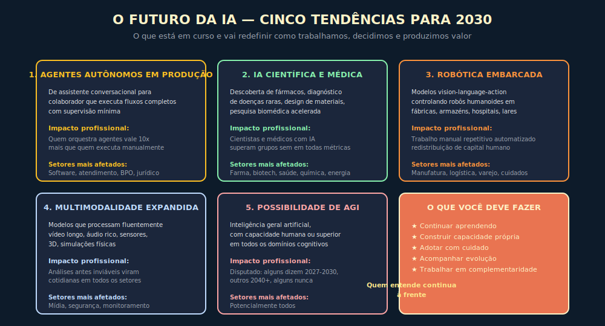

# 20. O Futuro Da IA Em Cenários Estruturados

---

> *"Previsão é especulação travestida de número, e número falso engana o orçamento. Cenário estruturado é o instrumento que o executivo usa quando assume que não sabe o que vai acontecer, mas precisa decidir como agir nos três caminhos possíveis."*

---

## Abertura

Quem assina o orçamento de tecnologia para os próximos três anos descobre, na primeira reunião de Conselho, que ninguém quer ouvir "depende". A pergunta vem direta, vinda do CEO, do CFO ou do investidor de fundo, e cobra resposta firme: o que vai acontecer com IA, em quanto tempo, e quanto a empresa deve investir agora para não ficar para trás. A tentação é responder com profecia, escolhendo o cenário que parece mais provável, pintando o futuro com tinta forte, e levando o orçamento aprovado em cima de uma única hipótese. Essa é a forma mais comum de queimar capital em tecnologia, porque profecia única é a mais frágil forma de pensar, ainda mais em campo cuja taxa de progresso oscila entre desaceleração e salto a cada dois ou três trimestres.

O método deste capítulo é o oposto da profecia, e é o que separa o executivo que pensa o futuro do entusiasta que torce por ele. Em vez de prever, mapeamos vetores de mudança observáveis, e em vez de escolher um único caminho, construímos três caminhos plausíveis em dois horizontes, e em vez de adivinhar números, declaramos probabilidade subjetiva qualitativa, com critério articulado para mover a empresa entre cenários quando os sinais mudam. Este capítulo entrega o instrumento que o leitor vai precisar para responder à pergunta do Conselho sem mentir nem se omitir.

---

## 20.1 — Conceito Intuitivo: Por Que Cenários Vencem Previsões

A diferença entre previsão e cenário não é semântica, é metodológica e operacional, e quem confunde paga caro porque a previsão induz a decisão única, e a decisão única tem uma probabilidade de errar igual à probabilidade do cenário previsto não se realizar, que em campo turbulento costuma passar de cinquenta por cento. Cenário, ao contrário, é estrutura mental que assume incerteza como entrada do problema, oferece três (às vezes quatro) caminhos plausíveis, e cobra do executivo plano para cada um, com gatilhos explícitos de transição. Quando a realidade se move, o executivo não descobre que errou, ele descobre em qual cenário a empresa está, e ativa o plano correspondente.

A indústria de petróleo refinou esse método ao longo das últimas décadas, em larga parte porque uma única previsão errada sobre preço de barril pode atrasar dez bilhões de dólares de investimento em campo offshore. A Shell tornou o método clássico ainda nos anos 1970, durante a crise do petróleo (Wack, 1985), e o que ficou na literatura corporativa é que cenários não são apostas, são lentes pelas quais a organização lê os sinais do ambiente, e quanto antes a organização identifica em qual cenário está, mais cedo ela ajusta capital, talento e produto. IA tem hoje, para a empresa que aposta nela com seriedade, o mesmo perfil de risco que petróleo teve naquela época, com a diferença de que o ciclo não é de uma década, é de dezoito meses.

A consequência prática é simples. Quem leu este capítulo e ainda assim apresenta ao Conselho uma única projeção de futuro de IA está praticando irresponsabilidade técnica, porque desconhece um instrumento básico de planejamento sob incerteza, ou está praticando teatro político, porque acha que o Conselho prefere falsa certeza a verdadeira humildade. O CTO competente apresenta sempre três cenários, e usa o terceiro slide para explicar qual sinal o vai mover entre eles.

---

## 20.2 — Analogia: O Piloto Que Prepara Três Aproximações

O piloto comercial que se aproxima de aeroporto em condição meteorológica adversa não decide a estratégia de pouso quando avista a pista; decide a estratégia ainda na cabine, antes do briefing inicial, listando três planos de aproximação alternativos com critério explícito para escolher entre eles em função do que o instrumento mostrar. O primeiro plano é a aproximação por instrumentos completa, com pouso na pista principal e taxiamento direto, e ele é usado se a visibilidade estiver dentro da margem regulatória e os ventos cruzados forem aceitáveis. O segundo é a aproximação circular, com pouso em pista secundária e taxiamento mais longo, e ele é usado se o vento mudar de direção ou se a pista principal estiver bloqueada por aeronave em emergência. O terceiro é a arremetida com diversão para aeroporto alternativo, e ele é usado se a visibilidade cair abaixo do mínimo ou se o piloto sentir, por instinto treinado, que a aproximação não está estabilizada.

A virtude do método não está em adivinhar qual dos três vai ser usado, está em ter os três prontos antes de precisar, com critério explícito de transição entre eles, e em treinar a tripulação no reconhecimento dos sinais. Cenários estratégicos de IA operam pela mesma lógica. O CTO prepara três planos de produto, três planos de orçamento, três planos de talento, e o que faz a empresa pousar bem é a velocidade com que ela identifica o cenário em que está e ativa o plano correspondente, não a sorte de ter previsto o cenário certo. A diferença é que o piloto checa instrumento a cada cinco segundos, e o CTO checa sinais a cada trimestre, mas a estrutura mental é idêntica.

---

## 20.3 — Método de Cenários

A construção de cenário disciplinado tem três componentes, e omitir qualquer um deles deixa o método incompleto, porque cenário sem vetor é narrativa solta, cenário sem horizonte é literatura, e cenário sem probabilidade subjetiva é equivalente a três opiniões igualmente plausíveis, o que paralisa a decisão. Os parágrafos abaixo apresentam os componentes na ordem em que devem ser construídos.

### 20.3.1 — Quatro Vetores de Mudança Que Importam

Em planejamento de cenário, vetor é uma força observável que move o ambiente em direção mensurável, ainda que a velocidade e a magnitude permaneçam incertas. Quatro vetores sustentam os cenários de IA, e qualquer outro fator (geopolítica, oferta de energia, evolução de hardware) acaba refletido em um deles. O primeiro vetor é a capacidade do modelo, medida em qualidade de raciocínio em tarefas longas, contexto efetivo utilizável e taxa de alucinação em domínios verificáveis; é o vetor que mais oscila em ciclo curto, porque cada release de laboratório frontier o move, em direção que ora acelera ora desacelera conforme o esgotamento de técnicas atuais. Indicadores observáveis para o rito trimestral: benchmark interno no golden set próprio (ex.: taxa de acerto em tarefas de domínio), taxa de alucinação em tarefa verificável, proporção de tarefas que passaram de prompt detalhado para one-shot. O segundo é a autonomia do agente, medida em proporção de tarefas que podem ser completadas sem intervenção humana ponto a ponto, e é o vetor que tem mais impacto operacional, porque define qual fatia da carga repetível de back-office pode ser substituída por orquestração. Indicadores observáveis: taxa de conclusão de tarefa end-to-end sem intervenção humana, número de steps médios por tarefa completada, taxa de escalação para humano por categoria de tarefa. O terceiro é o custo da inferência, medido em valor pago por milhão de tokens entregues em qualidade aceitável para a tarefa, e é o vetor que mais cai em ciclo longo, com tendência observada de queda exponencial ao longo de três a quatro anos. Indicadores observáveis: custo por resolução (CPR) rastreado mensalmente por feature, razão entre custo de modelo premium e modelo médio para a mesma tarefa. O quarto é a postura regulatória, medida pela coerência internacional entre regimes (EU AI Act, framework chinês, NIST nos Estados Unidos, PL 2338 no Brasil, regulação setorial em finanças e saúde) e pelo grau de fricção que cria em deploy cross-border. Indicadores observáveis: número de jurisdições onde o produto opera sem reengenharia jurídica, meses restantes até próxima revisão de compliance, status de tramitação de PL 2338 conforme acompanhamento trimestral.

Cada vetor tem dinâmica própria, e essa é a parte que costuma escapar do executivo apressado. Capacidade pode saltar enquanto custo permanece estável, e nesse mundo o que ganha é qualidade premium; custo pode despencar enquanto capacidade estagna, e nesse mundo o que ganha é volume operacional; regulação pode endurecer enquanto autonomia avança, e nesse mundo o que ganha é a empresa que tem governança madura; autonomia pode atingir patamar útil enquanto regulação se fragmenta, e nesse mundo o que ganha é a empresa que opera por geografia. O cenário é o cruzamento desses quatro vetores em estado coerente, e o exercício honesto é admitir que apenas algumas combinações são plausíveis, porque os vetores se acoplam parcialmente (custo cai mais rápido quando capacidade estagna, por exemplo, porque o esforço vai para eficiência).

### 20.3.2 — Três Horizontes Temporais

Horizonte de doze meses é o de planejamento orçamentário, é onde o ciclo de release dos laboratórios frontier dá tempo de ser observado, e onde o que conta é a calibração da hipótese atual; cenário a doze meses é, em essência, refinamento do plano corrente. Horizonte de trinta e seis meses é o de planejamento estratégico de produto, é onde os contratos de longo prazo entram, e onde o investimento em arquitetura, plataforma e talento precisa estar coerente com a leitura predominante; é também o horizonte em que cenários divergem de forma material. Horizonte de sessenta meses é o de planejamento de capital de longo prazo, é onde investimentos pesados em infraestrutura, parcerias estratégicas e posicionamento de mercado são decididos, e onde a variância entre cenários cresce ao ponto de incluir a possibilidade de descontinuidades qualitativas, com AGI ou platô estendido como polos extremos.

Este capítulo apresenta cenários detalhados em trinta e seis meses, porque é o horizonte em que o método paga mais retorno (decisões orçamentárias maiores, ainda dentro da janela em que a empresa pode reagir), e cenário sumário em sessenta meses, porque é o horizonte em que o método entrega humildade calibrada (decisões estruturais grandes, com reconhecimento de que a variância é alta). Cenário em doze meses é deixado ao processo de planejamento anual, com o método aplicado em ciclos trimestrais de revisão. Para aplicar o método nesse horizonte, a orientação mínima é: (a) dos quatro vetores, capacidade e custo são os mais observáveis em doze meses (releases de laboratório e fatura mensal fornecem leitura direta); (b) autonomia e regulação têm sinal ruidoso em doze meses — monitore eventos discretos (lançamento de framework de agente, publicação de ato normativo) em vez de tendência; (c) o entregável do ciclo de doze meses é a confirmação ou atualização da leitura predominante de cenário, não a construção de novo cenário; (d) a cadência recomendada é revisão trimestral com o AI Council e ajuste orçamentário semestral.

### 20.3.3 — Como Ler Probabilidade Subjetiva Qualitativa

A tentação do executivo treinado em finanças é exigir probabilidade numérica para cada cenário (vinte por cento otimista, sessenta por cento mediano, vinte por cento pessimista), e a recusa em fornecer esse número costuma ser interpretada como falta de coragem técnica. O argumento a sustentar com o Conselho é o inverso, e tem base sólida na literatura de previsão calibrada: número falso engana mais do que admissão honesta de incerteza, especialmente em campo em que o histórico de previsões pontuais é catastrófico (a indústria de IA está repleta de previsões de pesquisadores e CEOs que erraram por ordem de magnitude em janela de dois anos). A alternativa madura é probabilidade subjetiva qualitativa, em três níveis: provável (o cenário em que a empresa deve planejar como caso base), possível (o cenário em que a empresa deve manter plano de contingência ativo) e improvável (o cenário em que a empresa deve manter monitoramento de sinais sem investir em plano elaborado).

Cada cenário deste capítulo será classificado nessas três faixas, com explicação dos sinais que justificariam a reclassificação. O leitor é convidado a discordar das classificações, e a discordância produtiva está na identificação de sinais diferentes, não em mudança de adjetivo sem critério.

---

## 20.4 — Cenário Otimista a Trinta e Seis Meses

> **Probabilidade subjetiva:** possível (no patamar superior do plausível, mas não a leitura mais provável).
> **Sinais que sustentariam reclassificação como provável:** dois releases consecutivos de laboratório frontier com saltos mensuráveis em benchmarks de raciocínio longo, redução observada de custo de inferência em ordem de magnitude no horizonte de doze meses, convergência regulatória explícita entre Estados Unidos e União Europeia.

No cenário otimista, a capacidade do modelo continua avançando em ciclo regular, com reasoning models tornando-se padrão de produto (não mais a categoria premium que são hoje), contexto efetivo utilizável passando a casa dos milhões de tokens com fidelidade preservada, e taxa de alucinação caindo a níveis em que o uso em domínio verificável (jurídico, financeiro, médico) passa a exigir menos camadas de verificação do que hoje. A consequência imediata é que tarefas que hoje precisam de prompts longos, exemplos cuidadosamente selecionados e cadeias de validação multietapa, passam a ser resolvidas com prompts curtos e uma única passagem do modelo, o que reduz o custo de engenharia de cada feature de IA e amplia o leque de tarefas em que IA passa o limiar de ROI.

Autonomia do agente, neste cenário, atinge maturidade em verticais específicos, com agentes especializados por função operacional (vendas, atendimento, RH operacional, jurídico contratual, finanças contábeis, recrutamento de primeiro filtro) cobrindo fatia material da carga repetível em cada domínio — estimativas setoriais variam amplamente por tipo de tarefa e por grau de padronização, e não há consenso de mercado verificável que sustente número único; o Apêndice J traz fontes datadas para o leitor que quiser ancorar a leitura em dado primário — e com humanos passando a operar como supervisores de exceção em vez de executores ponto a ponto. O ponto crítico, que distingue o cenário otimista da fantasia, é que essa transição não é instantânea, ela exige investimento sustentado em context engineering, em evals, em observabilidade e em governança, e a empresa que não construiu esses pilares (que são justamente os capítulos centrais desta obra) recebe os agentes como caixa-preta cara e instável, sem capturar a produtividade que os agentes prometem.

Custo da inferência cai na ordem de magnitude (uma redução de aproximadamente dez vezes em três anos), o que reabre a equação econômica para casos de uso hoje proibitivos por volume, como atendimento massivo de varejo brasileiro, processamento contínuo de vídeo de segurança, análise contínua de telemetria industrial. O segundo efeito é que o custo da inferência deixa de ser o fator dominante na escolha de modelo, e o que passa a importar é o ajuste fino entre tarefa, modelo e arquitetura de prompt, o que devolve protagonismo à disciplina de engenharia e tira protagonismo da escolha de vendor.

Regulação, no cenário otimista, converge internacionalmente, com EU AI Act como referência operacional global, framework chinês mantendo sua particularidade mas com pontos de interoperabilidade, e NIST nos Estados Unidos consolidando um padrão técnico que serve de ponte. No Brasil, o marco regulatório de IA amadurece — se o PL 2338 for sancionado com texto próximo ao debatido em 2026, a ANPD instala diretoria especializada e o sandbox regulatório passa a funcionar como instrumento real para fintechs e healthtechs; se a tramitação atrasar, o cenário otimista ainda é possível com regulação setorial consolidada (BACEN, ANS, CFM). A consequência para a empresa brasileira é que o custo de compliance se estabiliza em patamar previsível, e que o deploy cross-border (especialmente para América Latina) deixa de exigir reengenharia jurídica por país.

A implicação executiva para o CTO neste cenário é de oportunidade assimétrica. A organização que tiver chegado a este horizonte com context engineering maduro, com Pirâmide de Evals operante, com LLMOps em seus sete pilares e com Caderno de Governança vivo (todos os instrumentos que esta obra desenvolve), multiplica produtividade por fator entre três e cinco, captura mercado em verticais especializadas onde a tradição é fragmentada, e ganha vantagem de retenção de talento ao oferecer ambiente onde os profissionais operam IA com seriedade, não com aventura. A organização que chegou sem essas fundações enfrenta o pior dos mundos, com pressão de mercado para adotar agentes, com fornecedores apresentando suites de IA aparentemente prontas, e com governança imatura para escolher entre elas, o que tende a custar caro em retrabalho e em incidentes públicos.

A leitura financeira do cenário otimista é que TCO de IA por receita cai em termos absolutos, mas a competição empurra produtividade marginal, e o que captura o ganho é quem tem disciplina, não quem tem mais capital. O cenário não favorece, portanto, o late mover paciente nem o early mover desorganizado; favorece o disciplinado, e este é o lugar onde o método da obra paga retorno máximo.

---

## 20.5 — Cenário Mediano a Trinta e Seis Meses

> **Probabilidade subjetiva:** provável (a leitura base, em que o CTO deve construir o plano principal de tecnologia).
> **Sinais que sustentariam reclassificação para outro cenário:** desaceleração observada em dois trimestres consecutivos sem novidade qualitativa moveria a leitura para pessimista; salto qualitativo em raciocínio matemático ou em autonomia de agente em domínio aberto moveria para otimista.

No cenário mediano, a capacidade do modelo avança por refinamento incremental, sem saltos disruptivos, com cada release trazendo melhoria mensurável em alinhamento, em modos de raciocínio especializados (matemática, código, ciência), em qualidade multimodal e em fidelidade em contextos longos, mas sem a sensação de descontinuidade qualitativa que marcou a passagem de ChatGPT 3.5 para 4. O ritmo de release dos laboratórios frontier permanece regular, com ciclo de seis a dezoito meses por geração maior, e com a disputa entre laboratórios continuando intensa, o que mantém a pressão competitiva e o investimento em pesquisa, ainda que com retornos marginais decrescentes em algumas dimensões.

Autonomia do agente atinge maturidade em domínios estreitos, com agentes verticais ganhando espaço em tarefas bem delimitadas (atendimento de primeira linha, classificação de pedidos, monitoramento de KPIs com geração de alerta, redação de minutas contratuais padronizadas), mas com a fronteira de domínio aberto (agentes que operam em ambientes ricos, com objetivos amplos e ferramentas heterogêneas) avançando mais devagar do que o discurso do mercado promete. Em termos operacionais, isso significa que o investimento em frameworks de orquestração de agente continua exigindo cuidado, com risco real de o framework escolhido virar débito técnico ao longo de dezoito meses, e com a Escala de Propriedade do Agente (que esta obra detalha no Framework F3) continuando como instrumento indispensável de governança.

Custo da inferência cai de forma mais modesta do que no cenário otimista, na ordem de três a cinco vezes em três anos, com a queda concentrada em modelos médios (que se aproximam da qualidade dos modelos grandes da geração anterior) e com o custo dos modelos frontier mantendo-se em patamar premium. A consequência prática é que a equação de escolha de modelo permanece sendo um exercício de Encaixe entre Tarefa e Modelo (F2), com o operador disciplinado optando por modelo médio na maior parte das tarefas, e reservando frontier para a fatia da carga em que o ganho marginal justifica o gasto.

Regulação, no cenário mediano, segue trajetória de implementação prática do que já está em vigência, com EU AI Act passando da fase de transposição para a fase de fiscalização ativa, com primeiras multas materiais publicadas e com construção de jurisprudência prática. No Brasil, o marco regulatório avança — o PL 2338, se sancionado com texto próximo do que está em discussão no Congresso, instala o regime de classificação por risco; mesmo que a sanção atrase, a ANPD passa a aplicar penalidades em casos emblemáticos com base na LGPD, e o setor financeiro consolida regulação setorial específica para IA. A consequência para a empresa brasileira é que o custo de compliance sobe de forma controlada, com investimento crescente em Caderno de Governança, em DPO especializado em IA e em controles internos auditáveis, e a vantagem vai para quem instalou essa estrutura antes da fiscalização chegar.

A implicação executiva no cenário mediano é a mais relevante para o planejamento, porque é a base mais provável e porque captura a essência do que o método desta obra entrega. Produtividade sobe em fatia mensurável — a variação por setor e por maturidade de implementação é tão ampla que qualquer número único aqui seria cenário ilustrativo, não dado planejável; a evidência disponível sugere ganhos relevantes em funções repetíveis, e o Apêndice J traz estudos setoriais datados para quem precisar de ancora quantitativa em apresentação ao Conselho — e a vantagem competitiva não vai para a empresa que tem modelo melhor (porque o acesso a modelo é commodity), vai para a empresa que opera disciplina, que executou os capítulos centrais da obra com seriedade, que tem evals que pegam regressão, que tem tracing que mostra onde o custo está, que tem AI Council que aprova roadmap de adoção com critério, e que tem cultura institucional de tratar IA como sistema de produção, não como brinquedo experimental.

O CTO que planeja para este cenário entrega ao Conselho um plano de orçamento que cresce em IA de forma controlada (de cinco a quinze por cento do orçamento de tecnologia, com variação por setor), um plano de talento que investe em context engineering e em governança em vez de apenas em data science, e um plano de produto que prioriza features de IA com Método de Decisão (F1) aplicado com rigor, evitando o erro comum de adotar IA em features de baixo ROI. A pergunta de teste para identificar se a empresa está operando neste cenário é simples e brutalmente honesta: a fatia da fatura mensal de IA que gera valor mensurável é maior do que a fatia que financia exploração? Se sim, a empresa está no cenário mediano com competência; se não, está no cenário pessimista sem perceber.

---

## 20.6 — Cenário Pessimista a Trinta e Seis Meses

> **Probabilidade subjetiva:** possível (não a leitura mais provável, mas com sinais suficientes para exigir plano de contingência ativo).
> **Sinais que sustentariam reclassificação como provável:** três releases consecutivos de laboratório frontier sem ganho mensurável em benchmarks centrais, desinvestimento público de fundos relevantes, crise de confiança em qualidade de agentes em produção, fragmentação regulatória aguda com fricção de deploy cross-border.

No cenário pessimista, a capacidade do modelo entra em platô confirmado, com cada release trazendo ganho marginal em benchmarks centrais (raciocínio em tarefas longas, fidelidade em contexto longo, taxa de alucinação em domínio verificável), com a pesquisa migrando para refinamentos de eficiência e de modos especializados, e com a comunidade científica reconhecendo, em literatura, que a arquitetura predominante (transformers em variações) atingiu o limite do que escalas atuais permitem, e que o próximo salto exige inovação arquitetural não trivial. A consequência operacional é que o investimento das empresas em "esperar o próximo modelo melhor" deixa de pagar, porque o próximo modelo é apenas marginalmente melhor, e o que distingue as empresas passa a ser a engenharia em torno do modelo, não o modelo em si.

Autonomia do agente decepciona em produção, com casos de implantação ambiciosa mostrando custos de manutenção altos (operadores humanos necessários para corrigir trajetória, retrabalho em cascata, ciclos longos de iteração em evals), com frameworks de orquestração de agente lançados nos últimos dois anos virando débito técnico (porque cada laboratório frontier sugere padrões diferentes, e a empresa que adotou o framework errado paga a migração), e com a literatura corporativa começando a publicar casos de fracasso, no padrão clássico em que toda onda tecnológica passa pelo Vale da Desilusão antes de retomar trajetória sustentada. A Escala de Propriedade do Agente (F3) torna-se ainda mais central, com a maioria dos agentes em produção sendo operada nos níveis baixos da escala (assistente, copiloto), e com agentes plenamente autônomos sendo restritos a domínios estreitos e bem auditados.

Custo da inferência cai pouco, na ordem de duas a três vezes em três anos, com a queda concentrada em modelos médios e com modelos frontier mantendo preço premium em razão do esforço de pesquisa que continua, ainda que com retornos decrescentes. A consequência prática é que o ROI de IA passa a ser mais sensível à disciplina de engenharia do que à evolução do modelo, e que a empresa que apostou em escalar volume sem otimizar arquitetura paga uma fatura crescente sem o ganho de produtividade correspondente. O Custo Composto em Três Tempos (F7) torna-se a ferramenta diária do CTO, com revisão mensal do custo por feature e com decisões duras de descontinuar features cujo ROI não se sustenta.

Regulação, no cenário pessimista, fragmenta-se por jurisdição, com EU AI Act, NIST, framework chinês e regulação brasileira divergindo em pontos centrais (categorização de risco, exigências de transparência, requisitos de auditoria), com o deploy cross-border passando a exigir arquiteturas diferenciadas por geografia, e com o custo de compliance subindo em proporção que dificulta a operação de empresa global de médio porte. No Brasil, o ambiente regulatório oscila entre rigidez excessiva e leniência casuística, e a empresa brasileira que opera no exterior precisa de squad jurídico especializado em IA por geografia, o que é caro e que tende a favorecer os incumbentes em detrimento de novos entrantes.

A implicação executiva no cenário pessimista é, paradoxalmente, a que mais valida o método desta obra, e isso porque a economia conservadora é quem ganha. A empresa que manteve arquitetura modular (em vez de se acoplar a um vendor único), que investiu em governança e evals antes da pressão de fiscalização, que tratou cada feature com Método de Decisão (F1) em vez de adotar IA por euforia, e que cultivou cultura institucional de prudência calibrada, sobrevive à fase difícil em posição de vantagem, e captura a retomada quando ela vem. A empresa que queimou capital em frameworks da moda, que adotou IA em features de baixo ROI por pressão de mercado, e que não construiu governança a tempo, paga juros compostos em retrabalho, em migração e em incidentes públicos, e algumas dessas empresas saem do cenário pessimista enfraquecidas o suficiente para perderem participação de mercado de forma estrutural.

O CTO que planeja para este cenário entrega ao Conselho um plano de orçamento conservador (manter investimento em IA em patamar estável, sem cortes que comprometam a base, mas sem expansão acelerada que aposte em capacidade que não vai chegar), um plano de talento que privilegia profissionais maduros sobre contratações em volume, e um plano de produto que prioriza estabilização das features existentes em detrimento de lançamento acelerado de novas. A pergunta de teste é: se o próximo modelo for apenas dez por cento melhor do que o atual, o orçamento ainda faz sentido? Se sim, o plano está calibrado para o cenário pessimista; se não, há fragilidade que precisa ser endereçada antes da próxima janela de revisão.

---

## 20.7 — Cenário a Sessenta Meses: Variância Alta e a Questão AGI

O horizonte de sessenta meses exige humildade adicional, porque a variância entre cenários cresce ao ponto de incluir descontinuidades qualitativas, e porque o exercício de previsão pontual aqui não tem qualquer pretensão de acurácia, ele serve apenas para acordar a organização para as possibilidades extremas e para alinhar o plano de capital de longo prazo com a realidade da incerteza. Apresento três pontos de fundo, sem detalhar três cenários completos, porque o exercício detalhado em sessenta meses tem retorno marginal baixo (a organização vai revisar a leitura a cada doze meses, e os detalhes mudam).

O primeiro ponto é que, em qualquer cenário a sessenta meses, o ambiente regulatório estará consolidado em fase de fiscalização ativa, com jurisprudência publicada, com penalidades materiais, e com requisitos de auditoria que se aproximam dos padrões de segurança bancária. A empresa que chegar a este horizonte sem governança madura paga preço dramático, porque os controles que esta obra detalha (Caderno de Governança, AI Council, AUP, sete pilares de LLMOps) deixam de ser opcionais e passam a ser exigência de mercado, exigência de cliente enterprise e exigência regulatória. Em todos os três cenários do horizonte de trinta e seis meses, a trajetória de cinco anos converge nesse ponto, e isso reduz a variância da decisão de investir em governança hoje: é investimento que paga em qualquer futuro plausível.

O segundo ponto é que, em qualquer cenário a sessenta meses, a vantagem competitiva sustentável não está na escolha de modelo ou de vendor, está na competência institucional de operar IA com disciplina. O acesso aos modelos frontier será commodity (com variação de preço, com diferenciação por contrato, mas sem o nível de exclusividade que existe hoje), e o que distinguirá empresas será a profundidade do context engineering, a maturidade dos evals, a qualidade da observabilidade e a robustez da governança. Esta é a tese central da obra, e o horizonte de cinco anos a confirma com mais força do que o horizonte de três anos, porque ao longo de cinco anos a comoditização da capacidade frontier se consolida.

O terceiro ponto é a questão de AGI, e aqui o método de cenário exige tratar AGI como pergunta legitimamente em aberto, sem tomar partido apressado em qualquer direção. Os argumentos pró-aceleração apontam que a trajetória recente de capacidade em raciocínio, em uso de ferramentas e em planejamento se aproxima de marcas que foram propostas como teste de generalidade, que laboratórios frontier publicam metas explícitas de chegar a sistemas com generalidade comparável à humana em janela de três a sete anos, e que o investimento global em IA ultrapassou patamares históricos que justificam expectativa de salto. Os argumentos contra-aceleração apontam que a generalidade observada em modelos atuais ainda é frágil em tarefas longas e em raciocínio causal profundo, que a literatura técnica registra limitações arquiteturais que escalonamento puro não resolve, que os benchmarks de generalidade são objetos contestados (e o consenso sobre o que constitui AGI é tudo menos consensual), e que a história da IA está marcada por previsões de generalidade que erraram por décadas.

A posição executiva responsável combina três afirmações modestas. Primeira: o investimento em governança, arquitetura modular e disciplina paga em qualquer cenário plausível a cinco anos — AGI iminente ou platô estendido, a empresa com essas fundações absorve a mudança; a empresa sem elas é arrastada. Segunda: a questão AGI permanece legitimamente em aberto, com argumentos sérios em ambas as direções, e não há consenso verificável entre laboratórios frontier, pesquisadores acadêmicos e operadores corporativos. Terceira: a probabilidade que você atribui à AGI iminente deve ser tratada como hipótese de trabalho revisável anualmente, não como convicção fechada — e o plano de capital de longo prazo deve ser robusto em ambos os polos, não dependente da aposta correta.

A implicação prática para o CTO é que o plano de capital de longo prazo deve evitar tanto a leitura de que IA atual é teto, quanto a leitura de que AGI iminente reorganiza tudo. O caminho do meio é o investimento sustentado em fundamentos institucionais, com revisão anual da leitura de cenário e com flexibilidade orçamentária para acelerar ou desacelerar conforme os sinais se materializam.

---

## 20.8 — Como o CTO Usa Cenários Na Prática

A construção de cenário não tem qualquer utilidade se ficar restrita a documento ornamental, e por isso o método precisa virar prática gerencial recorrente, com três usos concretos que o CTO deve instituir em sua organização. O primeiro uso é a construção paralela de três planos por dimensão crítica do orçamento e do produto, com plano otimista (que se ativa se a empresa entrar no cenário otimista), plano mediano (que é o plano-base, sob o qual a empresa opera por padrão) e plano pessimista (que se ativa se sinais indicarem deterioração do ambiente). O exercício é trabalhoso na primeira execução, porque exige construir três versões de orçamento, três versões de roadmap de produto, três versões de plano de talento, mas é leve nas execuções subsequentes, porque o que muda é o ajuste incremental sobre planos pré-existentes.

O segundo uso é a revisão trimestral da leitura predominante de cenário, em rito formal do AI Council, com lista explícita de sinais que justificariam mover a leitura entre cenários, e com decisão documentada sobre permanência ou mudança. A revisão precisa ser conduzida com rigor, com agenda preparada, com dados (releases de laboratório frontier, custo observado, sinais regulatórios, sinais de adoção de mercado), e com decisão registrada em ata, porque o risco de degenerar para conversa informal é alto. A boa prática é que a revisão seja conduzida pelo CTO (ou pelo Head de IA), com participação do CFO (para conexão orçamentária) e de pelo menos um membro do Conselho com mandato sobre tecnologia.

O terceiro uso é a comunicação com partes externas (Conselho, investidores, clientes enterprise) por meio de cenários em vez de previsões pontuais. A organização que comunica seu plano de IA por cenários sinaliza maturidade institucional, e isso costuma ser interpretado positivamente por investidores sofisticados e por clientes enterprise que avaliam fornecedores em maturidade técnica, não apenas em preço. A apresentação típica tem três slides (um por cenário, com vetores, implicações e plano correspondente) e um quarto slide que mostra os sinais que estão sendo monitorados e o gatilho explícito de transição. A frase-âncora que essa apresentação encerra, e que o CTO deve memorizar, é simples: "operamos hoje no cenário mediano, e os sinais que nos moveriam para o cenário pessimista ou otimista estão listados no monitoramento, com plano ativo para cada possibilidade".

A combinação dos três usos transforma a função do CTO. Em vez de adivinhar o futuro, ele opera o presente com plano calibrado para três futuros plausíveis, ajustando o plano em ciclo trimestral conforme os sinais se materializam, e comunicando à organização e ao Conselho com humildade calibrada que substitui falsa certeza por preparo real. Esta é, talvez, a habilidade executiva mais importante que esta obra entrega, e a habilidade que mais distingue o CTO competente do CTO entusiasmado.

---

## 20.9 — Resumo Executivo

| Cenário | Capacidade | Autonomia | Custo | Regulação | Implicação executiva |
|---------|------------|-----------|-------|-----------|----------------------|
| **Otimista (possível)** | Reasoning padrão; contexto efetivo amplo; alucinação cai | Agentes verticais cobrem fatia material da carga repetível em domínios específicos (estimativas variam por setor — ver Apêndice J) | Cai ~10x em 3 anos | Convergência internacional; sandbox BR funcional | Ganho de produtividade relevante para quem tem governança e evals; sem fundação, vira fragilidade |
| **Mediano (provável — base)** | Refinamento incremental; ganhos por modos especializados | Maturidade em domínios estreitos; framework continua exigindo cuidado | Cai 3-5x em 3 anos | EU AI Act em fiscalização; PL 2338 sancionado | Ganhos de produtividade em funções repetíveis com variação alta por setor (ver Apêndice J para fontes datadas); vantagem para quem opera disciplina, não para quem compra modelo melhor |
| **Pessimista (possível)** | Platô confirmado; ganhos marginais | Decepção em produção; framework vira débito técnico | Cai 2-3x em 3 anos | Fragmentação por jurisdição; deploy cross-border caro | Economia conservadora ganha; quem queimou capital paga juros; arquitetura modular sobrevive |

| Horizonte | Foco da decisão | Cadência de revisão |
|-----------|-----------------|---------------------|
| 12 meses | Refinamento do plano corrente; orçamento anual | Trimestral |
| 36 meses | Estratégia de produto, plataforma, talento | Semestral |
| 60 meses | Capital de longo prazo, parcerias estruturais; AGI em aberto | Anual |

---

## 20.10 — Checklist Do Capítulo

- [ ] Construir três planos de orçamento, três planos de roadmap de produto e três planos de talento, com mapeamento explícito dos cenários otimista, mediano e pessimista
- [ ] Listar quatro vetores de mudança (capacidade, autonomia, custo, regulação) com leitura atual de cada vetor
- [ ] Definir, para cada vetor, três sinais observáveis que justificariam mover a leitura predominante entre cenários
- [ ] Atribuir probabilidade subjetiva qualitativa (provável, possível, improvável) para cada cenário, com critério articulado
- [ ] Instituir rito trimestral do AI Council para revisão da leitura predominante, com agenda preparada e ata formal
- [ ] Construir slide-padrão de comunicação por cenários para Conselho, investidores e clientes enterprise
- [ ] Manter plano de capital de longo prazo com investimento sustentado em fundamentos institucionais (governança, evals, observabilidade), robusto em ambos os polos da questão AGI
- [ ] Documentar, em formato vivo, a leitura predominante atual, com data, autor e sinais que poderiam mudá-la
- [ ] Revisar conexão entre Método de Decisão para Adotar IA (F1) e leitura predominante de cenário, garantindo coerência

---

## 20.11 — Perguntas De Revisão

1. Em qual cenário a sua organização opera hoje, e quais três sinais o moveriam para o cenário adjacente?
2. Os três planos (orçamento, produto, talento) estão construídos para os três cenários, ou a organização tem apenas o plano-base?
3. Quem é o Accountable institucional pela leitura de cenário, e com qual cadência ela é revisada?
4. Como você explicaria, em três frases, para um membro do Conselho que exige número único, a razão de o método operar com probabilidade subjetiva qualitativa em vez de probabilidade numérica?
5. Qual investimento, hoje, paga em todos os três cenários a trinta e seis meses, e por quê?
6. Em que ponto a questão AGI muda materialmente seu plano de capital de longo prazo, e em que ponto não muda?

---

## 20.12 — Exercícios Práticos

**Exercício 1 — Construa seu próprio cenário.** Para o seu setor (não para IA em geral), descreva o cenário mediano a trinta e seis meses, com leitura dos quatro vetores aplicada ao seu setor (capacidade que importa para você, autonomia que importa para você, custo que importa para você, regulação setorial que importa para você). Identifique três sinais que moveriam a leitura para cenário pessimista e três que moveriam para otimista.

**Exercício 2 — Mapeie o movimento atual.** Identifique, com base em sinais observados nos últimos seis meses, em qual cenário a sua organização está hoje. Justifique a leitura com pelo menos cinco sinais concretos (releases, custo observado, sinais regulatórios, sinais de mercado, sinais internos), e documente em formato que possa ser revisado em trimestre.

**Exercício 3 — Plano triplo para uma decisão concreta.** Escolha uma decisão de IA pendente em sua organização (escolha de modelo, adoção de framework, contratação de squad, investimento em LLMOps). Construa três versões do plano correspondente, uma para cada cenário, com gatilho explícito de ativação de cada uma.

**Exercício 4 — Apresentação por cenários.** Construa apresentação de quinze minutos para o Conselho (ou para investidores) que comunique o plano de IA por cenários, com slide por cenário, slide de sinais monitorados e slide de gatilhos de transição. Submeta a apresentação à crítica de pelo menos um par sênior antes de levar ao Conselho.

---

## 20.13 — Projeto Do Capítulo

**Documento de Cenários Estratégicos da Organização.** Produzir documento formal de cenários estratégicos de IA da sua organização, com:

1. Leitura atual dos quatro vetores (capacidade, autonomia, custo, regulação), com fontes e data
2. Três cenários (otimista, mediano, pessimista) em horizonte de trinta e seis meses, com narrativa de uma página por cenário
3. Cenário sumário a sessenta meses, com posição declarada sobre AGI (sem tomar partido absoluto, com argumentos pró e contra)
4. Probabilidade subjetiva qualitativa atribuída a cada cenário, com critério articulado
5. Plano triplo para três dimensões críticas (orçamento, produto, talento) por cenário
6. Lista de sinais monitorados, com responsável nominal e cadência
7. Calendário de revisão trimestral, semestral e anual, com Accountables
8. Slide-padrão de comunicação para Conselho e investidores

**Critério de qualidade.** O documento é aprovado em uma reunião do AI Council e usado como insumo principal da próxima rodada de planejamento orçamentário.

---

## 20.14 — Referências Principais

📚 **Sobre planejamento por cenários**

- Wack, P. *Scenarios: Uncoupled and Uncharted Waters Ahead* (Harvard Business Review, 1985) — a fundação metodológica do planejamento por cenários, aplicada à crise do petróleo na Shell.
- Schoemaker, P. *Scenario Planning: A Tool for Strategic Thinking* (MIT Sloan Management Review, 1995) — o método aplicado em ambiente corporativo.
- Tetlock, P. *Superforecasting: The Art and Science of Prediction* (2015) — a literatura empírica sobre por que previsões pontuais erram e por que probabilidade subjetiva calibrada vence.

📚 **Sobre trajetória de capacidade em IA**

- Epoch AI — relatórios públicos sobre escala de modelos, custo de treinamento e custo de inferência, com dados primários verificáveis.
- Statements públicos de Anthropic, OpenAI, Google DeepMind, sobre roadmap de modelos (a serem lidos com hermenêutica corporativa, sabendo que comunicação executiva tem viés).
- Papers sobre platô e sobre limites arquiteturais de transformers (a literatura é abundante, com vozes em ambas as direções; ler em conjunto, não isoladamente).

📚 **Sobre regulação de IA**

- EU AI Act (texto consolidado) e materiais de transposição.
- NIST AI Risk Management Framework.
- Brasil: PL 2338/2023 e materiais da ANPD sobre IA.

📚 **Inteligência Aumentada — sistema da obra**

- Manifesto dos Invariantes — Introdução.
- Framework F1 — Método de Decisão para Adotar IA (alimenta cada cenário).
- Framework F3 — Escala de Propriedade do Agente (central no vetor autonomia).
- Apêndice J — Trilha do Número (deste livro), com números atualizados e fontes datadas.

---

## 20.15 — Autoavaliação

| # | Critério | Você consegue? |
|---|----------|----------------|
| 1 | **Clareza** — Explicar a um membro do Conselho, em cinco minutos, a diferença entre previsão pontual e cenário estruturado, com analogia do piloto | ☐ |
| 2 | **Profundidade** — Defender em discussão técnica por que probabilidade subjetiva qualitativa é mais responsável que probabilidade numérica em campo de alta turbulência | ☐ |
| 3 | **Aplicação** — Construir, nas próximas duas semanas, os três planos (orçamento, produto, talento) para os três cenários a trinta e seis meses na sua organização | ☐ |
| 4 | **Conexão** — Articular como o método de cenários se conecta com o Método de Decisão para Adotar IA (F1), com a Escala de Propriedade do Agente (F3), com o Custo Composto em Três Tempos (F7) e com a Camada Dupla (Princípio 3) | ☐ |
| 5 | **Curiosidade ativa** — Está com vontade de instituir o rito trimestral do AI Council para revisão da leitura de cenário, ainda nesta semana | ☐ |

---

> *"O futuro da IA não se prevê, se planeja em três caminhos, e a empresa que vence é a que tem plano ativo para os três e a que ajusta o curso conforme os sinais. Profecia é luxo de quem não responde ao Conselho."*
