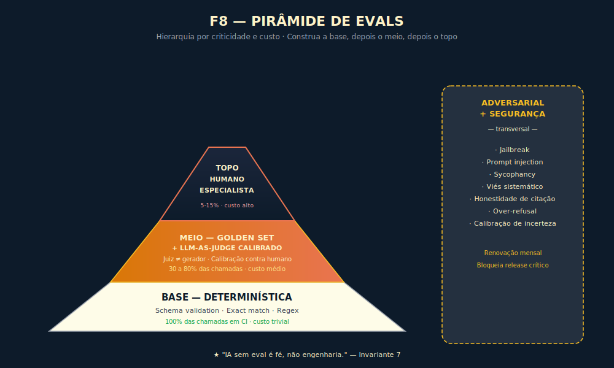
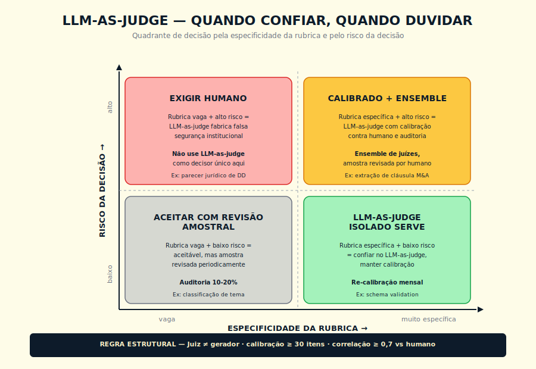

# 21. Evals — A Engenharia de Medir IA

> *"Trocar prompt 'porque ficou melhor' sem golden set é torcida, não decisão. Eval é o que separa engenharia de fé."*

## 21.1 — O conceito intuitivo

Há uma cena que se repete em times que adotaram IA generativa em produção sem ter passado pela disciplina de medi-la. O Product Manager pergunta "como está a qualidade do nosso copiloto?", e a resposta vem em três versões. A primeira é "está boa, os usuários têm gostado", baseada em algumas conversas no Slack e em duas reuniões com clientes. A segunda é "passou na nossa bateria de testes da semana", baseada em vinte casos rodados manualmente por um engenheiro. A terceira é "o LLM que avalia diz que melhorou", baseada em um juiz que ninguém calibrou contra humano. Nenhuma das três é eval, e essa confusão custa caro porque mascara regressão até ela virar incidente.

Eval, em sentido técnico preciso, é a disciplina de medir sistematicamente a qualidade de saídas de IA contra critérios definidos, com dados representativos, em ciclos que rodam tanto em desenvolvimento quanto em produção, com critério de bloqueio explícito e auditoria do que cada release entregou. Não é teste manual, não é vibe, não é demonstração de cliente, não é benchmark público. É a infraestrutura cognitiva que transforma operação de IA em disciplina engenheirável.

A diferença entre quem tem eval real e quem não tem aparece em dois lugares. No deploy, porque quem tem eval consegue dizer "rodou contra 200 casos do golden set e melhorou em 92% deles, regrediu em 3% que estamos investigando, manteve em 5%". Quem não tem só consegue dizer "ficou melhor". No incidente, porque quem tem eval consegue rastrear a regressão até a mudança específica de prompt, modelo ou tool que a causou. Quem não tem entra em pânico, tenta voltar a uma versão "que parecia boa", e descobre que perdeu o registro do que era.

A boa notícia é que eval não exige investimento absurdo. A pirâmide canônica desta disciplina, que apresentaremos formalmente como a Pirâmide da Avaliação, tem base barata e topo caro, e a maioria dos times consegue valor real começando pela base. A má notícia é que a maior parte das organizações ainda não começou, e está tomando decisão de modelo, de prompt e de fornecedor sem instrumento para medir o que efetivamente entrega.

## 21.2 — Analogia: o laboratório clínico que nunca fecha

Pense numa rede hospitalar séria, com cobertura nacional, plantão 24 horas, complexidade real. Imagine que essa rede operasse sem laboratório clínico próprio, sem exame de sangue regular, sem protocolo de checagem cruzada entre diagnósticos. A rede ainda atenderia pacientes — médicos competentes conseguem chegar em boas conclusões com anamnese, exame físico e bom senso. Mas quando algo desse errado, ninguém saberia identificar a causa. Quando um protocolo precisasse ser ajustado, a decisão seria por intuição. Quando o resultado de um departamento começasse a cair, a regressão seria descoberta tarde, quando já tivesse virado óbito.

Nenhuma rede hospitalar séria opera assim. Existe laboratório, existe protocolo de exame regular para cada classe de paciente, existe controle de qualidade dos próprios exames (sim, o laboratório precisa medir a si mesmo), existe trilha de auditoria por amostra. O laboratório não substitui o médico, e nem entrega o diagnóstico final. O laboratório dá ao médico o termômetro sem o qual a decisão fica no escuro.

Em IA, eval é o laboratório clínico do sistema. Não substitui o engenheiro, não decide pelo Product Manager, não escolhe o modelo. Dá ao time o termômetro com que se decide, se itera, se governa. E exige a mesma disciplina de qualidade que o laboratório clínico exige: golden set bem construído é o equivalente a amostras de controle calibradas, LLM-as-judge sem calibração é o equivalente a exame sem padrão de referência, regressão por subgrupo é o equivalente a olhar apenas a média sem ver o que aconteceu com a UTI pediátrica. Quem opera IA sem laboratório opera no escuro, e descobre as falhas pelo paciente, quer dizer, pelo cliente, que reclama tarde demais.

## 21.3 — Explicação técnica

### 21.3.1 — Os dois eixos: offline e online

Eval é organizado em dois grandes eixos.

Eval offline acontece antes do deploy, sobre dataset controlado, com gabarito conhecido. É o que roda em pull request, em CI/CD, em release candidate. Sua função é detectar regressão antes que ela chegue ao usuário. Inclui golden set, adversarial set, drift set, testes determinísticos, LLM-as-judge calibrado, rubrica humana.

Eval online acontece em produção, sobre tráfego real, sem gabarito predefinido. Sua função é detectar problemas que escaparam ao offline e mapear lacunas do golden set. Inclui sampling de produção para rotulagem contínua, feedback de usuário, monitoramento de drift de distribuição, monitoramento de custo e latência, monitoramento de segurança contra jailbreak, prompt injection e conteúdo proibido.

Os dois se alimentam mutuamente em ciclo. Falha em produção que não foi capturada offline indica buraco no golden set, que entra no próximo ciclo de eval offline. Caso de teste novo que aparece no adversarial set é incluído no monitoramento de produção. Essa retroalimentação é o que mantém o laboratório vivo.

### 21.3.2 — A pirâmide canônica

A pirâmide da avaliação organiza os evals por criticidade e custo, em três camadas verticais e uma transversal.

A base é composta por testes determinísticos. Schema validation, em que a saída obedece ao formato esperado, exact match para campos críticos contra gabarito, regex para padrões obrigatórios, validações estruturais como JSON parseável e citação no formato exigido. Cobertura de 100% das chamadas em CI, custo muito baixo. Detecta a maior parte das regressões grosseiras, com formato quebrado, campo faltante, alucinação estrutural, antes que cheguem a camadas mais caras.

O meio é golden set com LLM-as-judge calibrado. Conjunto fixo de casos com gabarito de qualidade, julgado por LLM seguindo rubrica explícita, com calibração regular contra humano sênior. Cobertura de 30% a 80% das chamadas conforme criticidade. Custo médio. Detecta regressão de qualidade que escapa da base e cobre casos de geração aberta onde exact match não funciona.

O topo é rubrica humana especialista. Revisão de amostra por especialista do domínio em release crítico, em auditoria mensal ou trimestral, em incidente sob investigação. Cobertura de 5% a 15% da carga, por amostra. Custo alto. Detecta nuances que LLM-as-judge não capta e calibra o juiz LLM contra o critério humano.

A camada transversal é adversarial e segurança. Casos que sabidamente quebram o sistema, como jailbreak, prompt injection, conteúdo proibido, sycophancy, viés, mantidos em conjunto separado, rodados a cada release crítico e em cadência mensal. Não substitui a pirâmide vertical, complementa.

A regra de bolso é construir a base primeiro, depois o meio, depois o topo. Quase todo time tem condição de subir a base em uma semana de trabalho. O meio leva entre uma e quatro semanas para a primeira versão sólida. O topo entra quando o produto cresce e a auditoria humana vira parte do contrato com o usuário ou do regime regulatório.

### 21.3.3 — Os seis tipos canônicos de eval

| Tipo | O que mede | Quando funciona | Armadilha clássica |
|------|------------|-----------------|---------------------|
| **Determinística** | Estrutura, campo crítico, padrão obrigatório | Saídas estruturadas (JSON, classificação, extração) | Saídas abertas; precisa combinar com outros tipos |
| **Por similaridade** | Embedding, BLEU, ROUGE, BERTScore (BERTScore exige modelo de embedding — mais custoso que BLEU, mas semanticamente superior; avaliar viabilidade de infraestrutura antes de adotar em equipe pequena) | Geração aberta com gabarito de "resposta canônica" | Mede forma, não semântica; texto certo com paráfrase diferente pode pontuar mal |
| **Rubrica humana** | Critério de qualidade definido por especialista | Domínio específico, casos críticos | Lento, caro, baixo throughput; serve só no topo |
| **LLM-as-judge** | Rubrica explícita aplicada por outro LLM | Cobertura de volume com critério padronizado | Viés de auto-validação se juiz = gerador; precisa calibração contra humano |
| **Comportamental** | Resposta a casos de segurança, viés, jailbreak | Compliance, alignment, governança | Conjunto fica desatualizado se não for renovado |
| **Econômica** | Custo por resolução, latência, retentativa | Decisão de roteamento, otimização de stack | Ignorar pode mascarar regressão de qualidade que veio com troca de modelo "mais barato" |

### 21.3.4 — Golden set: o ativo central da operação de eval

O golden set é o conjunto fixo de casos com gabarito que serve de referência estável para detectar regressão. É o ativo mais importante de qualquer operação madura de IA, e também o mais negligenciado.

Para construção, comece com 30 a 50 casos representativos da carga real, não de casos teóricos, cobrindo as classes principais de uso. Para cada caso, defina o gabarito junto com especialista do domínio: não é trivial decidir o que é "resposta certa" para uma pergunta aberta, e a definição precisa ser explícita. Documente o porquê de cada caso estar no golden, porque sem isso o conjunto vira manutenção opaca em seis meses. Mantenha proporção entre classes alinhada à distribuição real de produção.

Sobre tamanho mínimo, não há número universal. A regra prática é que 30 casos por classe crítica é o mínimo para começar a detectar regressão significativa, 100 a 200 por classe é confortável para a maioria dos times de tamanho médio, 500 ou mais aparece em times maduros com cobertura larga. O golden set cresce com a operação, e o que importa é ser representativo e versionado, não enorme.

Sobre manutenção, o golden set precisa ser revisado periodicamente. Casos que perderam relevância são aposentados. Casos novos que aparecem em produção, especialmente os que falharam, são incluídos. Distribuição é recalibrada se a carga de produção mudou. Sem manutenção, o golden vira folclore que não bate com a realidade do sistema.

Sobre versionamento, cada release que muda o golden set documenta a mudança. Cada decisão de eval que usa o golden registra a versão. Sem versionamento, "passou no eval" perde significado porque ninguém sabe contra o que passou.

### 21.3.5 — LLM-as-judge: quando confiar, quando duvidar

Usar um LLM para julgar a saída de outro LLM é técnica poderosa de escala, e é também uma das fontes mais comuns de eval enganoso. Vale entender em que condições funciona e em que condições produz ilusão.

Funciona quando a rubrica é explícita e separa claramente bom de ruim, o juiz é modelo diferente do gerador, o que mitiga viés de auto-validação, a rubrica foi calibrada contra avaliadores humanos seniores em pelo menos 30 a 50 casos, com correlação alvo acima de 0,7 (Zheng et al., 2023; para domínios de alto risco como saúde e jurídico, considerar limiar 0,8 ou mais, pois o limiar operacional varia por domínio e por consequência do erro), o juiz é re-calibrado mensalmente para detectar drift, ensemble de juízes é usado em decisões críticas, e a saída do juiz inclui justificativa estruturada para amostragem auditável.

Não funciona quando a rubrica é vaga, algo como "diga se ficou bom", o juiz é o próprio gerador ou da mesma família, com auto-validação inflada, não houve calibração contra humano, o juiz é tratado como verdade absoluta em decisão de produção sem cross-check, ou o adversarial set não inclui casos em que o juiz sabidamente erra.

O quadrante de decisão cruza dois eixos. Especificidade da rubrica, de vaga a muito específica, e risco da decisão, de baixo a alto. Rubrica vaga e baixo risco aceitam LLM-as-judge com revisão amostral. Rubrica vaga e alto risco exigem humano. Rubrica específica e baixo risco permitem LLM-as-judge isolado. Rubrica específica e alto risco demandam LLM-as-judge calibrado, com ensemble e auditoria humana de amostra.

### 21.3.6 — Métricas por tipo de tarefa

Não existe métrica universal. Cada tipo de tarefa tem métricas primária e secundária:

| Tipo de tarefa | Métrica primária | Métricas secundárias |
|----------------|------------------|----------------------|
| **Classificação** | F1 ponderada por classe | Precision/recall por classe, matriz de confusão |
| **Extração estruturada** | F1 por campo | Cobertura (% de chamadas com extração válida) |
| **Geração aberta** | Rubrica humana ou LLM-as-judge calibrado | Faithfulness (não inventou), relevância, completude, estilo |
| **Resposta ancorada (RAG)** | Faithfulness + answer relevance | Context precision, recall do retriever, citação correta |
| **Agente** | Taxa de sucesso de tarefa end-to-end | Passos, custo, regressão por subtarefa |
| **Segurança** | Taxa de rejeição correta | Over-refusal (recusas indevidas), taxa de jailbreak bem-sucedido |
| **Robustez** | Variância em N execuções | Consistência semântica |
| **Custo/latência** | CPR (cost per resolution) | CAA (custo agregado por agente), p50/p95 de latência |

Sobre acurácia agregada, uma regra dura: ela esconde regressão por subgrupo. Toda métrica de qualidade deve ter cortes, por classe, por segmento, por persona, por idioma, por região, por canal. Times que olham só a média perdem regressão silenciosa que aparece em produção como reclamação concentrada de uma classe específica.

### 21.3.7 — Regressão em CI/CD: o gate que separa engenharia de fé

Toda mudança que afeta o comportamento do sistema, com prompt, modelo, tool, system prompt, dataset de RAG, política de classificação, deve passar por eval automatizado antes de chegar à produção. A arquitetura canônica segue oito passos.

Primeiro, branch. Engenheiro abre branch com a mudança proposta.

Segundo, eval offline em CI. Pipeline roda golden set e adversarial set automaticamente.

Terceiro, scorecard gerado. Comparação automática com baseline da main, com delta por métrica e por subgrupo.

Quarto, gate de bloqueio. Política explícita do que bloqueia merge. Tipicamente, regressão acima de um limite na métrica primária bloqueia automaticamente, regressão intermediária gera alerta para revisão humana, melhoria ou estabilidade permite merge.

Quinto, code review. Revisor olha código e scorecard. Mudança que melhora métrica mas piora subgrupo crítico não passa.

Sexto, merge. Após aprovação, mudança vai para staging.

Sétimo, canário em produção. Deploy progressivo, de 1% a 10%, 50% e 100%, com eval online medindo qualidade real.

Oitavo, promoção ou rollback. Critério explícito de promoção, com scorecard verde por horas determinadas, ou de rollback ao detectar regressão.

Changelog de prompt é obrigatório a cada release. Documenta o que mudou, o motivo, o delta de scorecard, o subgrupo mais afetado. Sem changelog, troubleshooting de regressão em três meses vira arqueologia.

### 21.3.8 — Eval em produção: o ciclo que mantém o laboratório vivo

O eval offline detecta o que sabe procurar. O eval em produção descobre o que ninguém esperava. A arquitetura mínima envolve telemetria, sampling, feedback e loop fechado.

Telemetria: cada chamada loga input completo sanitizado de PII conforme política de LGPD, output completo, latência por passo, tokens in/out, custo computado, versão de prompt, versão de tool, modelo usado, ID de sessão, ID de usuário anonimizado conforme política. Sem telemetria, eval em produção não existe.

Sampling para rotulagem: subconjunto representativo da carga é separado para rotulagem humana contínua. Tipicamente 0,5% a 2% do volume, distribuído por classe. Esses casos viram a próxima geração do golden set.

Feedback de usuário: thumbs up/down, correção explícita, abandono, retentativa, escalonamento para humano. Cada sinal é proxy imperfeito de qualidade, mas a combinação informa onde olhar.

Loop fechado: casos que falharam em produção e foram rotulados entram no próximo ciclo de eval offline. Casos novos no adversarial vêm de produção, não da cabeça do time. Sem esse loop, o golden set congela e o eval vira ritual.

### 21.3.9 — Os sete erros típicos mais frequentes, com antídoto

| Erro típico | Por que mata | Antídoto |
|-------------|--------------|----------|
| Vibe-eval, com "rodei 5 casos e ficou bom" | Ruído pessoal vira norma; viés do testador inflado | Golden set fixo, versionado, mínimo 30 casos por classe |
| Métrica única agregada, com "acurácia subiu 2%" | Esconde regressão por subgrupo crítico | Cortes por classe, segmento, persona |
| LLM-as-judge sem calibração | Auto-validação enviesa; juiz e gerador da mesma família correlacionam erros | Juiz diferente do gerador, calibração contra humano em 30 ou mais casos, ensemble em decisões críticas |
| "Passou no MMLU" | Benchmark público não reflete a carga da empresa | Golden set próprio e adversarial sobre carga real |
| "Vamos medir depois" | Depois nunca chega; quando precisa, vira incidente | Gate de CI desde o primeiro deploy, mesmo que mínimo |
| "Eval é caro" | Regressão silenciosa é mais cara, e detectada tarde | Pirâmide com base barata; topo só onde justifica |
| Happy path only | Adversarial fica fora; sycophancy, jailbreak e viés passam | Conjunto adversarial separado, renovado por trimestre |

## 21.4 — Exemplo memorável: a consultoria que quase quebrou pela ausência de golden set

Cenário ilustrativo composto a partir de padrões observados em consultorias estratégicas brasileiras durante adoção de IA generativa. Números são realistas mas não identificam empresa específica.

Atlas Strategy, consultoria brasileira de estratégia com cerca de 120 consultores. Implementou um agente de redação de relatórios para clientes corporativos, com o objetivo de reduzir o tempo médio de produção de relatório mensal de 18 horas para algo entre 6 e 8 horas por consultor. O sistema integrava um modelo de linguagem moderno para a redação, skills proprietárias com voz autoral da Atlas, projetos por cliente com histórico, e RAG sobre base de cases anteriores.

Nas primeiras quatro semanas, o entusiasmo foi alto. Consultores entregavam mais relatórios em menos tempo. Sócios viam ganho de margem. A diretoria da Atlas considerou o projeto sucesso e direcionou investimento para expandir. Não havia golden set, não havia LLM-as-judge calibrado, não havia regressão em CI. A validação se resumia a três sócios lendo quatro relatórios na sexta-feira, e dando sinal verde se "tivessem soado certo".

Na sétima semana, um cliente do setor industrial recebeu um relatório com três parágrafos que continham números trocados. As fórmulas eram corretas. Os valores de entrada estavam errados, copiados de outro caso do trimestre anterior. O cliente pegou o erro porque era ele quem produzia os números originais. Mandou e-mail. A sócia-fundadora abriu o e-mail, leu, e em quinze minutos sabia que tinha problema sério. Em dois dias, mapearam outros três relatórios entregues no mês com erros numéricos similares. Em uma semana, dois clientes adicionais reportaram inconsistências.

A investigação revelou o que sempre revela: duas mudanças de prompt feitas em sequência por engenheiros diferentes, ambas com boa intenção. A primeira para "tornar mais conciso", a segunda para "soar mais executivo". Cada mudança, isoladamente, melhorou a percepção de qualidade dos sócios na sexta de validação. Combinadas, corromperam o passo de extração numérica em silêncio. Não havia como saber que tinham corrompido, porque ninguém estava medindo faithfulness numérico contra um conjunto fixo de casos.

A Atlas fez três mudanças permanentes, todas alinhadas ao Princípio 7 — o Termômetro: o sistema de IA precisa de instrumentação para ser gerenciável; sem ela, opera como caixa-preta e o incidente aparece pelo cliente, não pelo dashboard. Primeira, construiu golden set de 80 relatórios reais com gabarito de números e tese, anotado pelos três sócios em sessões dedicadas. Toda mudança de prompt passa a rodar contra esse conjunto antes de merge. Segunda, implementou LLM-as-judge com rubrica explícita para faithfulness numérico, calibrado contra os três sócios em 30 itens de calibração, com correlação alvo acima de 0,8. Terceira, criou scorecard versionado por release de prompt, com bloqueio automático se faithfulness numérico cair acima de 1 ponto contra o baseline.

Em seis meses, regressões silenciosas zeraram. O tempo de revisão humana por relatório caiu pela metade, porque o gate filtrava o ruído antes do humano ver. A Atlas perdeu dois clientes durante o incidente, recuperou um, e usa o caso internamente como exemplo do que custa não medir. A lição estrutural não está na escolha do modelo, da skill ou do RAG. Está na ausência inicial do termômetro. Eval não é luxo de big tech, é a diferença entre engenharia e fé. Quem não tem golden set não tem produto de IA, tem aposta documentada.

Para executivos: se sua organização tem IA em produção tocando cliente, faça uma pergunta direta ao time técnico hoje. Qual é o golden set do nosso sistema, e quando foi a última vez que rodamos regressão contra ele? Se a resposta envolver hesitação ou referência a "testes manuais", você está em risco. Eval é decisão de governança técnica, e exige investimento proporcional ao risco. Times maduros tratam golden set como ativo organizacional, com versionamento, dono nominal, e revisão trimestral.

> **Rigor estatístico do caso.** Medições da Atlas Strategy realizadas em janela de seis meses pós-incidente, com aproximadamente 480 relatórios analisados retrospectivamente em revisão por dois consultores sêniores independentes, golden set final estabilizado em 215 casos representativos, intervalo de confiança 95% sobre taxa de detecção de regressão, validação cruzada com revisão humana cega nos primeiros sessenta dias do gate de qualidade implantado. Caso composto a partir de padrões observados em mais de uma consultoria estratégica do mercado brasileiro — atribuição nominal sugerida para edições futuras, conforme pacto editorial descrito no paratexto "Sobre os casos desta obra".

## 21.5 — Quando usar e quando evitar

Implantar eval formal, com golden set, CI e telemetria de produção, sempre que a IA toca cliente externo, a saída entra em decisão financeira, jurídica, regulatória ou clínica, a equipe muda prompt ou modelo mais de uma vez por mês, existe SLA explícito ou implícito de qualidade, há caso regulado, como LGPD com decisão automatizada, AI Act, ISO 42001, ou múltiplos engenheiros mexem no mesmo prompt.

Subset mínimo viável, sem overhead completo, quando há piloto interno de baixo risco, com um usuário, por uma semana, teste de ideia descartável que não vai à produção, ou demo única para conselho ou prospect.

Em todo caso intermediário, comece pela base da pirâmide. Suba camadas conforme o produto crescer.

## 21.6 — Vantagens e limitações

| Vantagem | Limitação |
|----------|-----------|
| Transforma IA de fé em engenharia | Custo inicial alto: construir golden set é trabalho lento e demanda especialista do domínio |
| Permite migração de modelo e troca de prompt sem medo | Risco de overfit ao golden set, exigindo adversarial e produção rotulada como contrapesos |
| Cria scorecard auditável para governança e compliance | LLM-as-judge tem viés sistemático sem calibração; manutenção do juiz é trabalho recorrente |
| Detecta regressão silenciosa antes do usuário | Acurácia agregada engana; exige cortes por subgrupo que custam mais para reportar |
| Reduz MTTR (tempo de recuperação de incidente) | Cultura de eval demanda mudança organizacional; em times resistentes, vira teatro de compliance |
| Permite decisão de modelo em sua própria carga | Versão de modelo desatualizada no golden set distorce comparação; renovação periódica é obrigatória |

Este capítulo conversa especialmente com os capítulos sobre tokens, RAG, fine-tuning, agentes, AI Engineering, comparação de modelos, economia de tokens, LLMOps, alignment e governança.

## 21.7 — Resumo

| Conceito | Síntese |
|----------|---------|
| Definição | Disciplina de medir sistematicamente qualidade de IA, com dados representativos, em ciclos automatizados, com critério de bloqueio explícito |
| Eixos | Offline antes do deploy e online em produção, com ciclo de retroalimentação |
| Pirâmide | Base determinística (100%), meio com golden e LLM-as-judge (30-80%), topo humano (5-15%) e adversarial transversal |
| Seis tipos | Determinística, similaridade, rubrica humana, LLM-as-judge, comportamental, econômica |
| Golden set | 30 a 50 casos para começar, crescimento orgânico, versionamento obrigatório, manutenção trimestral |
| LLM-as-judge | Funciona com rubrica específica, juiz diferente do gerador e calibração contra humano em 30 ou mais casos; duvidoso sem isso |
| Métricas | Variam por tipo de tarefa; acurácia agregada esconde regressão por subgrupo |
| CI | Gate explícito de bloqueio, scorecard com delta, canário em produção, rollback testado |
| Erros típicos | Vibe-eval, métrica única, juiz não calibrado, dependência de benchmark público, postergação, alegação de custo, happy path |

## 21.8 — Checklist do capítulo

**O que construir** (ações verificáveis com entregável concreto)

- [ ] Construir um golden set inicial de 30 a 50 casos do seu produto, com gabarito anotado por especialista do domínio
- [ ] Escrever a rubrica de LLM-as-judge para um caso real, com 4 a 6 critérios objetivos
- [ ] Definir, no seu time, qual delta de métrica bloqueia merge e qual gera alerta, em documento de política de CI
- [ ] Identificar três cortes ou subgrupos que sua acurácia agregada está escondendo hoje
- [ ] Mapear, no seu produto, qual tipo de eval cobriria qual classe de falha

**O que dominar** (proficiências — verificar nas perguntas de revisão)

- [ ] Distinguir, em uma frase, eval offline de eval online
- [ ] Descrever as três camadas da pirâmide e a faixa de cobertura típica de cada
- [ ] Citar os seis tipos canônicos de eval e quando cada um funciona
- [ ] Defender a regra de juiz diferente do gerador para LLM-as-judge em mesa técnica
- [ ] Apresentar a Pirâmide da Avaliação em reunião executiva em até 5 minutos
- [ ] Reconhecer, em três frases recentes do seu time, qual erro típico elas correspondem

## 21.9 — Perguntas de revisão

1. Por que "ficou melhor" não é critério, e o que precisa entrar no lugar?
2. Em que situação LLM-as-judge é viés institucionalizado, e como você detecta?
3. Por que adversarial set importa mais que golden set no longo prazo?
4. O que muda na decisão de migração de modelo quando há golden set, e o que muda quando não há?
5. Por que a regra de juiz diferente do gerador é estrutural, não preferência?
6. Como o ciclo offline para online e de volta mantém o eval vivo?
7. Qual a relação entre o Princípio 7 (Termômetro — o sistema de IA precisa de instrumentação para ser gerenciável) e o Princípio 8 (Responsabilidade Indelegável — a responsabilidade por decisão de IA nunca pode ser delegada à máquina; há sempre um nome humano na cadeira de quem responde)?
8. Por que acurácia agregada esconde regressão silenciosa, e que método combate?
9. Em qual classe de produto faz sentido começar pelo topo da pirâmide?

## 21.10 — Exercícios práticos

Exercício 1, classificação de falhas reais. Liste 5 falhas reais, próprias ou do mercado, que sua operação enfrentou nos últimos 6 meses. Para cada uma, classifique: teria sido capturada por golden set? Por LLM-as-judge? Por adversarial? Por humano? Mapeie quais camadas da pirâmide faltam hoje na sua operação.

Exercício 2, pirâmide do seu produto. Desenhe a Pirâmide da Avaliação para o seu produto ou operação. Atribua percentual de cobertura atual em cada camada. Identifique a camada mais frágil e proponha plano de remediação em 30 dias.

Exercício 3, rubrica de LLM-as-judge. Para um caso real do seu produto, escreva rubrica de LLM-as-judge com 4 a 6 critérios objetivos. Defina o que é resposta máxima e o que é resposta mínima em cada critério. Calibre contra você mesmo em 10 casos. Em seguida, calibre contra um par. Compare. O que aprendeu?

Exercício 4, adversarial set inicial. Projete o adversarial set de 20 casos para o seu sistema. Inclua pedidos potencialmente perigosos, pedidos com indução de sycophancy, casos com viés conhecido, jailbreak via instrução, prompt injection via dado de entrada. Rode contra o sistema atual e documente o resultado.

## 21.11 — Projeto do capítulo

Construa o Caderno de Evals do seu produto ou operação, em 8 a 12 páginas e opcionalmente um repositório, contendo definição explícita do que é resposta certa para a sua classe de tarefa, golden set inicial de 30 a 50 casos com gabarito anotado, rubrica de LLM-as-judge calibrada contra humano em pelo menos 30 itens, política de bloqueio em CI, adversarial set de pelo menos 20 casos, telemetria mínima de produção, plano de revisão trimestral do golden set e mensal do adversarial, e dono nominal do caderno designado por escrito.

Critério de qualidade do projeto: outro engenheiro, sem contexto, consegue ler o caderno e rodar o eval contra uma nova mudança de prompt. Se precisar perguntar mais de três coisas, o caderno está incompleto.

## 21.12 — Referências principais

Frameworks e padrões: OpenAI Evals, inspect-ai, HELM da Stanford CRFM (Liang et al., 2022), BIG-bench (Srivastava et al., 2022).

LLM-as-judge: Zheng et al., Judging LLM-as-a-Judge with MT-Bench and Chatbot Arena (2023); Liu et al., G-Eval (2023).

RAG e métricas específicas: RAGAS (Es et al., 2023); Faithfulness in NLG (literatura desde 2020).

Adversarial e segurança: HarmBench (Mazeika et al., 2024); JailbreakBench (Chao et al., 2024); BBQ (Parrish et al., 2022).

Sobre as dificuldades genuínas de avaliar LLMs: Narayanan, A. & Kapoor, S., "Evaluating LLMs is a minefield" (Princeton, 2023); Karpathy, comentários públicos sobre limitações de benchmarks.

## 21.13 — Autoavaliação

| # | Critério | Você consegue? |
|---|----------|----------------|
| 1 | **Clareza** — Explicar para um diretor não-técnico em 90 segundos por que "ficou melhor" não é critério, usando a metáfora do laboratório clínico | ☐ |
| 2 | **Profundidade** — Defender em reunião técnica por que LLM-as-judge sem calibração contra humano é viés institucionalizado, citando o quadrante de decisão e a regra de juiz diferente do gerador | ☐ |
| 3 | **Aplicação** — Iniciar a primeira versão do golden set do seu produto esta semana, com pelo menos 30 casos representativos | ☐ |
| 4 | **Conexão** — Articular como o capítulo amarra o Princípio 7, RAG, LLMOps, alignment e governança | ☐ |
| 5 | **Curiosidade** — Está com vontade de entrar no próximo capítulo para entender como esse eval roda em produção, com tracing, versionamento e rollback proporcionais | ☐ |
