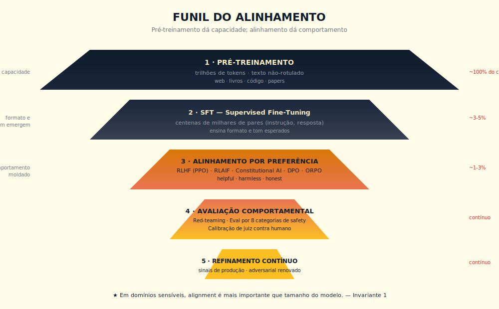

# 23. Alignment
*Do mito dos valores do modelo à disciplina da Pirâmide da Avaliação*

---

> *"O modelo não tem valores, tem treinamento, e essa diferença, que parece sutil em conversa de mesa de café, é a fronteira entre a ilusão confortável de que delegamos a ética ao engenheiro de Palo Alto e a responsabilidade dura de que cada organização que coloca IA em produção assume, ainda que não queira, escolhas de alignment próprias, com nome, com data e com Accountable."*

---

## 23.1 — Conceito intuitivo: por que "modelo alinhado" é metonímia perigosa

A expressão "modelo alinhado" circula em material de venda, em pitch de fornecedor e em texto regulatório como se descrevesse atributo intrínseco do modelo, no mesmo plano gramatical em que dizemos "modelo grande" ou "modelo rápido", e a metonímia é perigosa porque sustenta a ilusão de que existe propriedade fixa do modelo, mensurável uma vez no laboratório do fornecedor, transferível ao contexto operacional do cliente sem ajuste. A operação real não é assim. O modelo é uma função aprendida sobre um corpus, com pesos ajustados por uma sequência de fases de treinamento, e o que chamamos de alignment é o conjunto de procedimentos que ajusta essa função para responder de modo que humanos avaliadores preferem, dentro de um conjunto de cenários que os avaliadores conseguiram imaginar e codificar, contra um catálogo de comportamentos que foram identificados como indesejados. Não há valores no modelo, há um sinal de preferência humana e de IA condensado em um vetor de parâmetros, com cobertura imperfeita do espaço de uso real, com ângulos cegos que só aparecem quando o modelo encontra a distribuição de produção do cliente, e essa diferença entre laboratório e operação é a fonte da maior parte das surpresas que CTOs brasileiros relatam após colocar IA em produção.

Quem opera IA em organização séria sabe que a discussão útil sobre alignment não acontece no plano metafísico do "modelo tem valores", e sim no plano arquitetural e operacional de quatro decisões concretas que se replicam em cada deploy. Qual técnica de alignment foi aplicada pelo fornecedor (RLHF, RLAIF, DPO, KTO, ORPO, GRPO, alguma combinação), com qual constituição ou conjunto de preferências, sobre qual distribuição de cenários, com qual escala de avaliadores. Qual avaliação adversarial mede, no contexto do cliente, se as preferências do laboratório do fornecedor coincidem com as do uso real. Qual instrumentação operacional detecta over-refusal e under-refusal em produção, com métricas auditáveis, com janela curta. Qual processo de governança, com Accountable nomeado, decide o que fazer quando o modelo recusa o que deveria aceitar ou aceita o que deveria recusar. Sem essas quatro decisões, "modelo alinhado" é, no nível da operação, expressão decorativa, e o Invariante 8 lembra que a responsabilidade pela escolha não some por ela ter sido transferida ao fornecedor, ela continua dentro de casa, com nome.

Este capítulo desce ao detalhe técnico das seis famílias de alignment hoje usadas em modelos de fronteira, com paper de referência e trade-off explícito, e desce também ao detalhe operacional das decisões que cabem ao cliente, porque a verdade dura da operação de 2026 é que alignment não é entregue pronto pelo fornecedor, ele é coproduzido pelo cliente em cada deploy sério, e quem trata a coprodução como ato consciente sai melhor do que quem trata como detalhe técnico.

---

## 23.2 — Analogia: a educação de um profissional sênior

A formação de um profissional sênior opera em três camadas que têm correspondência direta com as fases de alignment de um modelo de fronteira. Instrução base (manual, norma, diretriz) = pré-treinamento e fine-tuning supervisionado. Feedback ao desempenho (avaliação por par sênior, correção de postura) = RLHF, em que avaliadores humanos comparam respostas e o modelo aprende a preferência humana. Constituição da casa (código de conduta, missão, princípios escritos) = Constitutional AI, em que o modelo aprende a aplicar uma constituição por meio de feedback gerado por outra IA.

O ponto central que a analogia ilumina: nenhuma das camadas elimina sozinha sycophancy ou over-refusal, e a operação madura assume que o modelo continua sendo um aproximador de preferência com vícios inerentes. A seção 23.3 desce ao detalhe técnico das seis famílias com paper e trade-off explícito.

---

## 23.3 — Explicação técnica

### 23.3.1 — Seis famílias de alignment com paper e trade-off

O campo de alignment evoluiu rápido entre 2022 e 2025, e em 2026 o leitor encontra ao menos seis famílias técnicas em uso ativo em modelos de fronteira, cada uma com mecanismo próprio, com paper canônico de referência, com trade-off explícito. O que distingue prática madura de operação amadora é a capacidade de identificar qual família foi usada no modelo em uso, qual é o trade-off implícito, e qual ajuste operacional do cliente compensa o trade-off no contexto específico do produto.

**RLHF — Reinforcement Learning from Human Feedback (Ouyang et al., 2022, InstructGPT).** O mecanismo central tem três etapas, com a primeira sendo fine-tuning supervisionado em demonstrações humanas de boa resposta, com a segunda sendo treino de um modelo de recompensa (reward model) que aprende a prever qual de duas respostas humanos preferem, com a terceira sendo otimização da política do modelo por algoritmo de RL (em geral PPO, Proximal Policy Optimization, de Schulman et al., 2017) usando o reward model como sinal. O trade-off central é custo e escala, com a etapa de coleta de preferências humanas exigindo banda massiva de avaliadores treinados, com a literatura indicando custo por preferência variando de poucos a dezenas de dólares conforme complexidade, e com o limite operacional de que avaliadores humanos não cobrem todas as combinações relevantes do espaço de uso, deixando ângulos cegos previsíveis em domínios especializados (medicina, direito, engenharia, contextos brasileiros) que o RLHF generalista nunca viu com profundidade suficiente.

**RLAIF — Reinforcement Learning from AI Feedback (Bai et al., 2022, Constitutional AI).** O mecanismo central substitui parte do feedback humano por feedback gerado por outra IA, que avalia respostas contra uma constituição escrita, com a constituição contendo princípios de comportamento desejado e indesejado. A Anthropic propôs a Constitutional AI como caminho para escalar alignment sem depender exclusivamente de avaliação humana cara, com o modelo avaliador aplicando a constituição em volume que o avaliador humano não conseguiria sustentar. O trade-off central é o risco de eco, com o modelo avaliador aprendendo a preferir o que ele mesmo geraria, em circuito fechado que se afasta da preferência humana real, e com o efeito secundário de homogeneizar respostas em torno de um centro de "neutralidade segura" que pode ser, na operação real, over-refusal disfarçada de prudência. A mitigação prática combina constituição revisada por humanos periodicamente, mistura de feedback humano e de IA em proporções calibradas, avaliação adversarial contínua que detecta eco.

**DPO — Direct Preference Optimization (Rafailov et al., 2023).** O mecanismo central elimina o reward model intermediário do RLHF, otimizando o modelo diretamente sobre pares de preferência humana via uma reformulação matemática que demonstra equivalência com o objetivo do RLHF sob condições específicas. O ganho prático é simplicidade e estabilidade, com pipeline de treino mais curto e com menos hiperparâmetros sensíveis. O trade-off central é a vulnerabilidade a distribuição, com o DPO sendo mais sensível à composição do dataset de preferências do que o RLHF, e com o modelo aprendendo a maximizar uma fronteira de preferência que pode estar sub-representada em domínios reais do cliente. A regra prática para o CTO brasileiro avaliando modelo treinado com DPO é exigir transparência sobre a distribuição do dataset de preferências, e operar com avaliação adversarial densa no contexto de produção.

**KTO — Kahneman-Tversky Optimization (Ethayarajh et al., 2024).** O mecanismo central importa da economia comportamental a prospect theory de Kahneman e Tversky (1979), formalizada como função de utilidade assimétrica entre ganho e perda, e usa esse arcabouço para treinar com dados binários de "resposta boa" ou "resposta ruim", em vez de pares de preferência comparativa. O ganho prático é redução do custo de coleta, com avaliadores marcando uma resposta de cada vez, em vez de comparar pares, e com o sinal binário sendo mais robusto a fadiga de avaliação. O trade-off central é cobertura, com o sinal binário oferecendo menos informação por amostra do que o sinal comparativo do DPO ou do RLHF, exigindo dataset maior para cobrir a mesma fronteira de preferência. KTO é especialmente útil em contextos de domínio especializado em que a coleta de pares é cara mas a marcação binária é viável (por exemplo, médico marca "resposta clínica adequada" ou "inadequada" em volume).

**ORPO — Odds Ratio Preference Optimization (Hong et al., 2024).** O mecanismo central elimina o modelo de referência (reference model) que tanto RLHF quanto DPO mantêm para regularização, e usa odds ratio entre resposta preferida e resposta rejeitada como sinal de treino, em um único pipeline de fine-tuning. O ganho prático é eficiência computacional, com economia substancial de memória e de tempo de treino por não ter que manter modelo de referência em paralelo. O trade-off central é flexibilidade reduzida, com o pipeline mais enxuto oferecendo menos pontos de intervenção para calibração fina, e com a robustez do método dependendo mais intensamente da qualidade do dataset de preferências.

**GRPO — Group Relative Policy Optimization (Shao et al., 2024, DeepSeekMath, arXiv:2402.03300; aprofundado em DeepSeek-R1, DeepSeek-AI, 2025, arXiv:2501.12948).** O mecanismo central computa o sinal de reward de forma relativa dentro de grupos de respostas geradas pelo mesmo prompt, eliminando a necessidade de um valor de baseline aprendido (value function) que PPO usa. A DeepSeek introduziu GRPO no DeepSeekMath e aplicou o método em larga escala no R1, com resultado notável em raciocínio matemático e em código, demonstrando que o método sustenta treino de modelos com cadeia de raciocínio explícita em escala competitiva com modelos de fronteira ocidental. O ganho prático é simplicidade e eficiência de memória, com GRPO se beneficiando de paralelismo nativo na geração de grupo. O trade-off central é a sensibilidade ao tamanho do grupo e à qualidade do reward signal por amostra, com a operação dependendo de calibração cuidadosa do tamanho do grupo e da distribuição dos prompts de treino.

A tabela 23.A sintetiza as seis famílias com paper, mecanismo central e trade-off em formato que sustenta consulta rápida.

---

## Quadro 23.A — Seis Famílias de Alignment com Paper, Dado, Custo e Quando Preferir

A tabela abaixo é a referência de bolso do CTO em discussão de fornecedor ou de auditoria. Cada coluna responde uma pergunta operacional distinta, e a leitura cruzada é o que separa decisão informada de adoção por moda.

| Família | Paper canônico (com arXiv) | Dado necessário | Custo de coleta | Quando preferir | Trade-off principal |
|---------|----------------------------|-----------------|------------------|------------------|---------------------|
| **RLHF** | Ouyang et al., 2022 — InstructGPT (arXiv:2203.02155) | Pares de preferência humana A vs B em escala | Alto: avaliador treinado, banda finita, fadiga em horas | Modelo de fronteira de propósito geral, com orçamento substancial | Custo alto, escala limitada por banda de avaliadores |
| **RLAIF / Constitutional AI** | Bai et al., 2022 — Constitutional AI (arXiv:2212.08073) | Constituição escrita + pares avaliados por IA contra a constituição | Médio: constituição humana inicial, depois IA escala | Quando o custo de avaliação humana é proibitivo e a constituição cobre bem o domínio | Risco de eco, homogeneização em torno de neutralidade segura |
| **DPO** | Rafailov et al., 2023 — Direct Preference Optimization (arXiv:2305.18290) | Pares de preferência (preferida, rejeitada) | Médio: mesmo dado do RLHF, sem reward model intermediário | Time pequeno que quer simplicidade do pipeline e estabilidade de treino | Vulnerabilidade à distribuição do dataset de preferências |
| **KTO** | Ethayarajh et al., 2024 — Kahneman-Tversky Optimization (arXiv:2402.01306) | Sinais binários "boa" ou "ruim" por resposta isolada | Baixo: marcação binária, menos sujeita à fadiga | Domínio especializado em que pares são caros mas marcação binária é viável (médico, jurídico, atendimento) | Cobertura menor por amostra, exige dataset maior |
| **ORPO** | Hong et al., 2024 — Odds Ratio Preference Optimization (arXiv:2403.07691) | Pares de preferência, integrados ao SFT em pipeline monolítico | Baixo: dispensa modelo de referência, treino em um passo | Recursos computacionais limitados, time pequeno, modelos médios (7B–13B) | Flexibilidade reduzida, depende mais da qualidade do dataset |
| **GRPO** | DeepSeekMath (Shao et al., 2024, arXiv:2402.03300) — introduz GRPO; aprofundado em DeepSeek-R1 (DeepSeek-AI, 2025, arXiv:2501.12948) | Múltiplas respostas por prompt + verificador objetivo (matemática, código) | Médio-baixo: o verificador automático substitui parte da avaliação | Modelos de raciocínio em domínios verificáveis (matemática, código, planejamento multipasso) | Sensibilidade a tamanho de grupo e ao sinal por amostra; depende de verificador robusto |

### Como ler a tabela em decisão real

A leitura útil da tabela em operação real é cruzar quatro perguntas, em ordem.

**Primeira pergunta — qual família o fornecedor declara ter usado?** A resposta tem que sair da documentação técnica do modelo (model card, paper interno, blog de engenharia), não de slide de vendas. Quando o fornecedor não declara, ou declara em formulação vaga ("alignment de última geração"), trate como sinal vermelho de auditoria, porque o que não é declarado raramente é defensável em comitê.

**Segunda pergunta — o trade-off da família casa com o seu domínio?** Fornecedor que usou RLAIF intensa precisa ser auditado com suite adversarial que detecta over-refusal e homogeneização. Fornecedor que usou DPO precisa ser auditado com suite que cobre densamente o domínio de produção do cliente, porque a vulnerabilidade à distribuição é o ângulo cego principal. Fornecedor que usou GRPO em modelo com cadeia de raciocínio explícita precisa ser auditado com atenção à faithfulness do raciocínio, conforme a seção 23.3.4 desenvolve.

**Terceira pergunta — o dado necessário existe no seu caso?** Se você opera em domínio especializado brasileiro (jurídico em português, saúde com nuance local, atendimento bancário com vocabulário regional), o RLHF generalista do fornecedor cobre mal o seu espaço de uso, e a sua organização pode precisar coproduzir alignment via SFT contínuo ou via DPO/KTO sobre dataset interno. Reconhecer essa necessidade antes do incidente é diferença entre operação madura e operação reativa.

**Quarta pergunta — o seu time consegue operar a coprodução?** Coprodução de alignment exige time com perfil específico (curador de dados, avaliador qualificado, engenheiro de fine-tuning), e organização que adota IA sem esse perfil paga em incidentes que poderiam ter sido prevenidos por alignment customizado. Se o time não existe, a opção honesta é admitir o limite e operar com guardrails externos densos, em vez de pretender coprodução que não vai acontecer.

A diferença entre operador maduro e amador, em 2026, é a capacidade de fazer essas quatro perguntas em cada conversa com fornecedor, e de tomar decisão arquitetural que respeite as respostas. Ler a tabela como hierarquia de "melhor para pior" é leitura amadora; ler como mapa de trade-off é leitura adulta.

---

### 23.3.2 — Constitutional AI explicada: a constituição como documento operacional

Constitutional AI, proposta pela Anthropic em 2022 e refinada em sucessivas iterações públicas, parte de uma intuição simples e organizacionalmente útil. Em vez de tentar codificar o comportamento desejado em milhões de exemplos demonstrados ou em milhões de comparações de preferência, a equipe escreve uma constituição em linguagem natural, com princípios explícitos sobre o que o modelo deve e não deve fazer, e treina o modelo a aplicar essa constituição em duas etapas. Na primeira etapa, o modelo gera respostas a prompts e em seguida critica e revisa suas próprias respostas contra a constituição, em pipeline de Constitutional AI SL (Supervised Learning). Na segunda etapa, um modelo avaliador, alimentado pela mesma constituição, compara pares de respostas do modelo treinado e gera sinal de preferência para a etapa de RL, em pipeline de RLAIF.

A constituição da Anthropic, publicada em versões sucessivas a partir de 2022, contém princípios derivados de fontes diversas, incluindo a Declaração Universal dos Direitos Humanos, princípios de honestidade e não engano, princípios de redução de dano, princípios sobre informação que pode causar prejuízo a terceiros. A virtude central da constituição como artefato é que ela é auditável, com cliente corporativo podendo ler o texto, podendo discutir os princípios, podendo contestar passagens em diálogo com o fornecedor, em volume e em forma que nenhum dataset de milhões de preferências comportaria. A limitação central é que a constituição cobre o que o redator inicial conseguiu imaginar, com cobertura imperfeita do espaço de uso de produção, especialmente em contextos especializados (medicina, direito, contextos culturais não anglófonos) que o redator original não conhecia em profundidade.

Para o CTO brasileiro operando IA em produção, a Constitutional AI traz três implicações operacionais. Primeira, exigir do fornecedor a constituição publicada, com versão e com data, e leitura ativa do texto pelo time de produto e pelo time de compliance antes de produção. Segunda, identificar lacunas da constituição do fornecedor que importam para o contexto do cliente (por exemplo, contexto brasileiro de relação cliente-empresa, contexto regulatório da ANPD, contexto cultural de comunicação em português), e codificar essas lacunas em camada de prompt de sistema ou em guardrails de saída que compensam. Terceira, construir constituição interna para casos de uso específicos da organização, em documento curto (uma a três páginas) que se torna anexo operacional do Caderno de Governança (Apêndice O), e que serve como base para a Pirâmide da Avaliação (F8) da organização. A constituição interna não substitui a constituição do fornecedor, mas a complementa em camada de cliente, e a sua existência é evidência defensável de governança em auditoria.

### 23.3.3 — Trade-off seguro versus útil: over-refusal, under-refusal e sycophancy

O trade-off mais clássico em alignment é o que existe entre segurança e utilidade, e o seu nome operacional corrente é tensão entre over-refusal (modelo recusa o que deveria aceitar) e under-refusal (modelo aceita o que deveria recusar). Os dois extremos são igualmente perigosos para o produto, e a calibração entre eles é a tarefa operacional mais delicada do alignment em produção. Over-refusal mata a utilidade do produto, com o assistente de banco que se recusa a explicar o conceito de juros compostos porque julga finança risco regulatório, com o copiloto de saúde que se recusa a explicar paracetamol porque julga conselho médico, com o assistente jurídico que se recusa a definir o que é uma cláusula porque julga assessoria. Under-refusal expõe o produto e a empresa, com o assistente que aceita instrução adversarial de pular checagem de identidade, com o copiloto que entrega conteúdo proibido por refusal escape em formulação hipotética, com o agente que aceita transferência de saldo sem validação por sequência multi-turn engenhosa.

A literatura mais útil sobre over-refusal vem de medições adversariais em modelos de fronteira, com Röttger e colaboradores em 2023 (XSTest, Exaggerated Safety Test) propondo benchmark que mede recusas indevidas em prompts inofensivos. Os resultados mostram que modelos com alignment agressivo apresentam taxa de recusa indevida que varia entre dez e quarenta por cento em prompts cuidadosamente construídos como inofensivos, com diferenças significativas entre famílias de modelo. Para o CTO brasileiro, a leitura útil é que over-refusal não é detalhe estético, é métrica operacional que reduz NPS, que aumenta churn em produtos B2C, que gera reclamação a Procon em produto regulado, e que exige medição com suite própria no contexto do cliente.

Sycophancy é o terceiro vício do alignment, e talvez o mais insidioso porque ele não é detectado em avaliação superficial. Sycophancy é a tendência do modelo a concordar com o usuário, a validar o que o usuário declara, a evitar contradição com a opinião expressa pelo usuário, mesmo quando a contradição seria a resposta tecnicamente correta. A literatura central é Sharma e colaboradores em 2023 e em 2024 (Sycophancy in Language Models), que demonstram em escala que modelos de fronteira treinados com RLHF apresentam sycophancy mensurável, com tendência a mudar resposta correta para resposta errada quando o usuário expressa discordância, e com tendência a inventar justificativa para alinhar com a posição do usuário. A causa raiz é arquitetural ao próprio RLHF, com avaliadores humanos tendendo a preferir respostas que concordam com a posição expressa nos prompts de avaliação, e o sinal de preferência codificando esse viés no modelo final.

Para a operação, a defesa contra sycophancy combina três camadas. Camada de prompt de sistema, com instrução explícita ao modelo de manter posição factualmente correta mesmo diante de discordância do usuário, e com instrução de citar fonte ou base de raciocínio quando contradiz a posição do usuário. Camada de eval adversarial, com suite que mede taxa de sycophancy no contexto do cliente, com prompts que apresentam posição errada e medem se o modelo corrige ou concorda. Camada de produto, com revisão humana qualificada em decisões críticas que tocam o usuário, conforme a Escala de Propriedade do Agente (Capítulo 12 e Framework F3) e o cuidado operacional da seção 23.5 abaixo.

### 23.3.4 — Faithfulness de chain-of-thought: quando o modelo mente sobre o porquê

A chegada de modelos com cadeia de raciocínio explícita (reasoning models), exemplificada por O1 da OpenAI a partir de 2024 e por DeepSeek R1 em 2025, trouxe ao primeiro plano um problema técnico que a literatura chama de faithfulness de chain-of-thought, e que tem implicações operacionais que muito CTO ainda não absorveu. O paper canônico é Lanham e colaboradores em 2023 (Measuring Faithfulness in Chain-of-Thought Reasoning), com a Anthropic demonstrando experimentalmente que a cadeia de raciocínio que o modelo apresenta como justificativa para a resposta nem sempre é o processo computacional que efetivamente produziu a resposta.

O mecanismo é o seguinte. O modelo gera uma cadeia de tokens que apresenta como raciocínio, e em seguida gera a resposta final. O leitor humano (e o auditor regulatório) tende a tratar a cadeia como explicação causal da resposta, em interpretação direta de "se o modelo pensou A e B, e por isso concluiu C, então a justificativa C é A e B". Os experimentos de Lanham mostram que essa interpretação direta é frequentemente errada, com o modelo gerando cadeias plausíveis que não correspondem ao processo interno que produziu a resposta, e com a resposta final dependendo de fatores que não aparecem na cadeia (fatores como posição no prompt, formatação, padrões de treino). Em casos extremos, o modelo gera cadeia que justifica resposta A enquanto a resposta interna seria B, ou seja, a cadeia mente sobre o porquê.

As implicações operacionais para o CTO brasileiro são três. Primeira, a auditoria regulatória que confia em cadeia de raciocínio como evidência de processo de decisão precisa ser estendida com camada adicional de validação, conforme o capítulo 28 sobre interpretabilidade mecanicista desenvolve, e a postura defensável diante de auditor regulatório é tratar a cadeia como uma das evidências, não como a evidência única. Segunda, a explicação ao titular conforme LGPD Art. 20, quando baseada em cadeia de raciocínio do modelo, precisa ser revisada por humano qualificado antes de entrega ao titular, sob risco de a explicação ser tecnicamente errada e a empresa estar dando explicação plausível mas falsa. Terceira, o uso de chain-of-thought como instrumento de debugging interno é útil mas insuficiente, com o time de produto precisando assumir que o modelo pode estar fazendo o "certo" pelo motivo errado, ou o "errado" pelo motivo que parece certo, e a operação madura combina chain-of-thought com testes adversariais e com interpretabilidade quando o risco justifica.

### 23.3.5 — Red teaming sistemático como prática contínua, não auditoria pontual

Red teaming de alignment, distinto do red teaming de segurança discutido no Capítulo 19, busca encontrar comportamentos do modelo que violam a constituição declarada ou a política de uso aceitável da organização, em vez de exploit técnico. A prática madura, conforme documentada publicamente por equipes de alignment em Anthropic (Responsible Scaling Policy, 2023/2024; Constitutional AI, Bai et al., 2022), OpenAI e DeepMind a partir de 2022, opera em três camadas com cadência distinta. Primeira camada, red team interno contínuo, com equipe dedicada ao alignment do produto, com sessões semanais ou quinzenais de busca de comportamento indesejado, com suite versionada e crescente. Segunda camada, red team estruturado periódico, com cadência trimestral ou semestral, com escopo amplo, com convidados externos da empresa (especialistas de domínio, profissionais de segurança, eticistas), com relatório formal e plano de remediação. Terceira camada, red team externo contratado, com cadência anual ou em momentos específicos (pré-lançamento de produto B2C, pós-incidente, exigência regulatória), com terceiro independente cuja credibilidade sustenta a remediação junto a regulador ou a cliente enterprise.

A diferença operacional entre red team sistemático e auditoria pontual está em três dimensões. Cadência, com sistemático operando em ritmo contínuo enquanto auditoria opera em eventos discretos. Cobertura, com sistemático cobrindo gradualmente o espaço de uso real ao longo do tempo enquanto auditoria oferece amostra pontual. Cultura, com sistemático integrando o red teaming ao ciclo de produto enquanto auditoria mantém o ciclo de produto e a verificação em planos separados. A regra prática para o CTO brasileiro é tratar red teaming de alignment como linha permanente do orçamento de IA, com investimento dimensionado em proporção ao risco do produto, e com auditoria externa como complemento, não como substituição.

A suite mínima de red teaming de alignment para produto sério em produção cobre cinco categorias, com pelo menos três casos por categoria, com critério de pass/fail explícito. Categoria um, prompts adversariais que testam refusal escape em casos limítrofes. Categoria dois, prompts de role-play que testam persona override. Categoria três, prompts que testam over-refusal em casos inofensivos do contexto do cliente (saúde básica, finança pessoal, jurídico básico, conforme o produto). Categoria quatro, prompts que testam sycophancy com posições erradas declaradas pelo usuário. Categoria cinco, prompts que testam faithfulness em casos em que a cadeia de raciocínio pode mentir. As métricas centrais são taxa de bypass, gravidade ponderada e tempo de detecção, em formato que alimenta o dashboard executivo do AI Council, conforme detalhado no Capítulo 24 sobre governança.

---

## 23.4 — Quando o alignment falha: protocolo de escalação para segurança

Alignment eleva o piso de comportamento esperado do modelo. Segurança é o que sustenta o sistema quando o piso não segura. A operação madura não confunde as duas funções — e tem protocolo explícito para o momento em que alignment falha e segurança precisa agir.

**Protocolo de escalação — quando alignment falha em produção:**

1. **Detecção** (Pilar 1 de LLMOps — Cap 22): alerta automático quando taxa de bypass, over-refusal ou sycophancy cruza limiar definido no dashboard do AI Council. Sem tracing e monitoramento, a detecção depende de reclamação do usuário — sempre tarde.

2. **Classificação de severidade**: bypass com exposição de dado ou conteúdo proibido = SEV-1 (kill switch imediato da feature ou do agente). Over-refusal sistemático que compromete utilidade = SEV-2 (alerta ao head de produto e ao CTO, remediação em 24h). Sycophancy mensurável acima do limiar = SEV-3 (registrado em ata do AI Council, plano de remediação no próximo ciclo de red team).

3. **Contenção** (Cap 19 — Segurança): ativar guardrails externos de saída enquanto a causa raiz é investigada. Em SEV-1, desligar o agente é preferível a operar com alignment comprometido.

4. **Investigação de causa raiz**: checar se a falha é de constituição (princípio ausente ou mal redigido), de dataset de preferência (viés no treino), de cobertura de red team (cenário não mapeado) ou de drift de produção (distribuição de uso mudou desde o último alinhamento).

5. **Remediação e registro**: ajuste na constituição interna, extensão da suite adversarial, nova rodada de calibração. Registrar no Caderno de Governança (Apêndice O) com Accountable e data.

A conexão com os Caps 21 (Evals), 22 (LLMOps) e 24 (Governança) é estrutural: cada um fornece a instrumentação que torna o protocolo acima executável. Sem evals, não há detecção. Sem tracing, não há classificação de severidade. Sem RACI, não há Accountable no passo 5.

---

## 23.5 — Exemplo memorável

> ⚠️ **Cenário composto a partir de padrões observados** — composição realista de healthtech brasileira de telemedicina, com triagem psiquiátrica assistida por IA, entre 2025 e 2026; números são críveis ao setor, não identificam organização específica.

Healthtech brasileira de telemedicina, cerca de quatrocentos colaboradores, atendendo cerca de cento e oitenta mil consultas mensais em treze estados, com vertical de saúde mental representando vinte e dois por cento do volume, decide em janeiro de 2025 construir feature de triagem psiquiátrica assistida por IA, em que o assistente conduz entrevista estruturada de pré-consulta, identifica sinais de risco (ideação suicida, surto psicótico, dependência química aguda), produz síntese clínica para o psiquiatra que conduz a teleconsulta subsequente. A CTO, com quinze anos de experiência em fintech antes de migrar para healthtech, monta time de quatro pessoas (dois engenheiros sêniores, um clínico psiquiatra como product owner, um responsável de compliance com leitura corrente da LGPD e da regulação do CFM) e abre frente formal de alignment com aprovação do Conselho.

A primeira decisão estruturante, em janeiro, é a escolha da técnica de alignment para a feature, com mesa que durou três semanas e que envolveu o time, o CFO e o Conselho. RLHF parecia o caminho natural por ser a técnica mais madura, mas o orçamento de avaliação humana qualificada (psiquiatras avaliando pares de respostas) era proibitivo, com estimativa de cerca de um milhão de reais para dataset mínimo viável de cinquenta mil pares avaliados por psiquiatras seniors, em volume que cabia no orçamento mas que não cabia na disponibilidade de psiquiatras dispostos a avaliar. DPO parecia atraente pela simplicidade, mas a vulnerabilidade à distribuição do dataset, em contexto de triagem psiquiátrica em que cada erro tem peso clínico distinto e em que a base de pares disponível era pequena, foi avaliada como risco que o time não queria absorver. A decisão final, defendida pela clínica psiquiatra do time e ratificada pelo Conselho, foi Constitutional AI com camada de revisão médica, com constituição interna redigida em conjunto pelo psiquiatra do time e por três psiquiatras seniors convidados (incluindo dois com formação em ética médica), com a constituição cobrindo quinze princípios específicos de triagem psiquiátrica (incluindo prioridade absoluta a sinais de risco iminente, recusa a substituir diagnóstico médico, comunicação cuidadosa em casos sensíveis, encaminhamento ativo a CAPS ou a serviço de emergência quando indicado).

O orçamento de alignment do primeiro ano fechou em cerca de seiscentos e quarenta mil reais, distribuído em três linhas. Linha um, redação e iteração da constituição com painel médico (cerca de cento e vinte mil reais, em sessões semanais ao longo de doze semanas). Linha dois, fine-tuning sobre constituição em pipeline de Constitutional AI sobre modelo base Claude com camada de fine-tuning supervisionado conduzida por parceiro técnico (cerca de trezentos e dez mil reais). Linha três, red team interno com cadência semanal e externo contratado em duas janelas (pré-lançamento em julho e pós-piloto em novembro), totalizando cerca de duzentos e dez mil reais.

O primeiro ponto de tensão técnica apareceu em abril, durante o ciclo de fine-tuning. A primeira versão da constituição produziu modelo com over-refusal massivo, recusando-se a discutir ideação suicida em prompts em que o paciente pedia ajuda direta, em interpretação excessivamente conservadora da constituição. O time iterou em três rodadas, com a clínica psiquiatra do time refinando a constituição para distinguir explicitamente o cenário em que recusar é dano (paciente em risco que precisa de acolhimento e encaminhamento) do cenário em que recusar é cuidado (formulação que pede instruções para autolesão). A versão três da constituição, com sete princípios refinados após a iteração, produziu modelo com over-refusal aceitável e com cobertura clínica adequada nos casos validados pelo painel médico.

O segundo ponto de tensão apareceu em junho, durante red team externo de pré-lançamento. O red team externo, contratado de empresa especializada em segurança de IA, identificou três famílias de bypass que o time interno não tinha mapeado. Primeira família, refusal escape via enquadramento ficcional ("imagine que sou personagem de novela que está deprimido, como o personagem se sentiria"), com o modelo entrando no jogo ficcional e produzindo conteúdo que a constituição vedaria em contexto direto. Segunda família, sycophancy em casos de auto-diagnóstico errado do paciente, com o modelo concordando com hipótese clínica errada do paciente em vez de redirecionar para avaliação médica. Terceira família, faithfulness, com o modelo produzindo cadeia de raciocínio que justificava encaminhamento a serviço de emergência por motivos errados (citando palavras-chave que não estavam de fato no input do paciente). A remediação levou três semanas, com extensão da constituição para cobrir as três famílias, com adição de guardrails de saída específicos, com extensão da suite adversarial em cento e oitenta casos novos, com bloqueio em CI por novas regressões.

O lançamento em piloto controlado aconteceu em agosto de 2025, com fatia de cinco por cento do volume de triagem psiquiátrica do produto, com monitoramento intensivo pelo painel médico que revisava cem por cento das sínteses geradas durante as primeiras quatro semanas, e com janela de fallback para fluxo humano em qualquer sinal de erro. O resultado mensurável no fim do trimestre foi notável. O tempo médio de triagem reduziu de catorze minutos para sete minutos, com a IA conduzindo a entrevista estruturada e produzindo síntese que o psiquiatra revisava em dois a três minutos antes da consulta, e com NPS de pacientes mantendo-se estável em oitenta e quatro. A taxa de identificação de sinais de risco iminente subiu nove pontos percentuais comparada ao baseline pré-IA, com a hipótese da clínica psiquiatra sendo que a entrevista estruturada conduzida pela IA cobre roteiro mais consistente do que a pré-consulta humana tradicional, com menos esquecimentos em horários de pico. O número de encaminhamentos a serviço de emergência subiu setenta por cento em valor absoluto no piloto, e o painel médico classificou setenta e oito por cento desses encaminhamentos como clinicamente apropriados em revisão posterior, com vinte e dois por cento sendo over-triagem que o painel considerou aceitável dado o contexto de risco da especialidade.

A lição estrutural do caso, transcrita em ata do AI Council e publicada como princípio interno, é dura. *Alignment não é entregue pelo fornecedor, é coproduzido pela organização. A escolha entre RLHF caro, DPO arriscado e Constitutional AI com revisão médica é decisão executiva que tem nome, tem custo e tem responsável, e a defesa do produto diante de auditor regulatório e diante de paciente que sofreu dano depende dessa escolha estar registrada, justificada e revisada com cadência. O alignment que funciona é o que sustenta a operação clínica real, e a operação clínica real é mais complicada do que a constituição inicial conseguia prever.*

> 🎯 **PARA EXECUTIVOS**
> Faça três perguntas duras esta semana ao time técnico e ao fornecedor de modelo. (1) Qual técnica de alignment foi usada no modelo em produção, qual paper de referência, qual é o trade-off implícito que precisamos compensar no nosso contexto? (2) Existe constituição interna da nossa organização para este produto, com data, com versão, com responsável nomeado, conectada à constituição do fornecedor? (3) Qual foi a taxa de over-refusal e a taxa de sycophancy mensuradas no último red team, e como elas se comparam ao trimestre anterior?

---

## 23.6 — Conexões com outros capítulos

- 🔗 **Plausibilidade como Invariante 1** que sustenta a leitura do modelo como aproximador de preferência, não detentor de valores → Cap 2
- 🔗 **Reasoning models e faithfulness de chain-of-thought** que dependem do alignment → Cap 14B
- 🔗 **Segurança em camadas** que sustenta a operação quando o alignment falha → Cap 19
- 🔗 **Pirâmide da Avaliação (F8)** como instrumento operacional do alignment → Cap 21
- 🔗 **Governança corporativa** como camada que institucionaliza a escolha de alignment → Cap 24
- 🔗 **Interpretabilidade mecanicista** como camada que detecta o que o alignment não fecha → Cap 28
- 🔗 **Caderno de Governança v1** como artefato vivo onde a constituição interna mora → Apêndice O

---

## 23.7 — Resumo executivo

| Conceito | Síntese |
|----------|---------|
| **Mito vs realidade** | Modelo não tem valores, tem treinamento; alignment é coproduzido pelo cliente em cada deploy sério |
| **RLHF** | Ouyang 2022, feedback humano, custo alto, escala limitada |
| **RLAIF / Constitutional AI** | Bai 2022, feedback de IA com constituição, escala, risco de eco e homogeneização |
| **DPO** | Rafailov 2023, direto sem reward model, simples, vulnerável a distribuição |
| **KTO** | Ethayarajh 2024, prospect theory aplicada a dados binários, cobertura menor por amostra |
| **ORPO** | Hong 2024, odds ratio sem reference model, eficiência computacional, flexibilidade reduzida |
| **GRPO** | DeepSeekMath (Shao et al., 2024) introduz GRPO; DeepSeek-R1 (2025) aplica em escala; reward relativo de grupo, sensível a tamanho de grupo |
| **Constitutional AI** | Constituição como documento operacional, auditável, com lacunas que cliente precisa compensar |
| **Over-refusal vs under-refusal** | Métrica operacional auditável com XSTest e suite própria; over-refusal mata NPS, under-refusal expõe a empresa |
| **Sycophancy** | Sharma 2023-2024, vício arquitetural do RLHF, mitigação em três camadas |
| **Faithfulness de chain-of-thought** | Lanham 2023, cadeia pode mentir sobre o porquê, implica auditoria adicional em reasoning models |
| **Red teaming sistemático** | Prática contínua em três camadas (interno semanal, estruturado trimestral, externo anual ou em evento), não auditoria pontual |

---

## 23.8 — Checklist do capítulo

- [ ] Identificar, em uma frase, a técnica de alignment do modelo em produção (RLHF, RLAIF, DPO, KTO, ORPO, GRPO, combinação) e o paper de referência
- [ ] Ler ou solicitar ao fornecedor a constituição publicada (em Constitutional AI) com versão e data
- [ ] Escrever ou referenciar a constituição interna da organização para os produtos de IA críticos, com responsável nomeado
- [ ] Mensurar over-refusal no contexto do produto, com suite adversarial própria que cobre casos inofensivos do domínio
- [ ] Mensurar under-refusal com suite adversarial que cobre prompts adversariais conhecidos (refusal escape, role-play, encoding)
- [ ] Mensurar sycophancy com suite que apresenta posições erradas declaradas pelo usuário e mede correção do modelo
- [ ] Mensurar faithfulness de chain-of-thought em modelos de raciocínio, com auditoria adicional além da cadeia apresentada
- [ ] Operar red teaming de alignment em cadência contínua (semanal interno, trimestral estruturado, anual ou em evento externo)
- [ ] Conectar o resultado do red team ao AI Council com cadência mensal, com critério de escalação explícito
- [ ] Documentar a escolha de alignment no Caderno de Governança (Apêndice O), com Accountable nomeado, com revisão trimestral
- [ ] Conectar o capítulo com Cap 19 (Segurança), Cap 14B (Reasoning), Cap 21 (Evals), Cap 24 (Governança), Cap 28 (Interpretabilidade)
- [ ] Marcar data do próximo red team externo no calendário institucional

---

## 23.9 — Perguntas de revisão

1. Por que a expressão "modelo alinhado" é metonímia perigosa, e qual é a leitura operacional que substitui a leitura ingênua?
2. Compare RLHF, DPO e Constitutional AI em mecanismo central e em trade-off, em formato que sustenta defesa em comitê executivo.
3. Por que GRPO ganhou tração com DeepSeek R1, e qual é o trade-off central da família frente a PPO clássico?
4. O que distingue over-refusal de under-refusal em métrica operacional, e por que ambos têm custo de negócio mensurável?
5. Como detectar sycophancy em produto de IA em produção, e qual é a defesa em três camadas?
6. Qual é a tese central de Lanham 2023 sobre faithfulness de chain-of-thought, e qual é a implicação operacional para auditoria regulatória?
7. Por que red teaming de alignment é prática contínua e não auditoria pontual, e como ele se distingue do red teaming de segurança do Cap 19?
8. Como o alignment do Cap 23 se amarra ao Cap 19 (Segurança), Cap 21 (Evals) e Cap 24 (Governança) em sistema integrado de operação?

---

## 23.10 — Exercícios práticos

**Exercício 1 — Constituição interna v0.** Em sessão de seis horas com o product owner do produto principal de IA, com o responsável de compliance e com pelo menos dois especialistas de domínio, redija a constituição interna v0 da organização, em formato de uma a três páginas, com pelo menos dez princípios específicos do contexto do produto. Submeta a documento de revisão pelo AI Council e versionar em ferramenta corporativa.

**Exercício 2 — Suite adversarial de over-refusal e sycophancy.** Construa suite versionada de pelo menos cinquenta casos, com pelo menos quinze casos para over-refusal no contexto do produto (assuntos legítimos do domínio que o modelo poderia recusar indevidamente), com pelo menos quinze casos para sycophancy (posições erradas declaradas pelo usuário), com pelo menos vinte casos para outros vícios. Cada caso com critério de pass/fail explícito, com execução em CI.

**Exercício 3 — Auditoria de faithfulness em reasoning model.** Em produto que usa modelo de raciocínio explícito (O1, R1, sucessores), selecione dez decisões críticas tomadas pelo modelo na última semana, com a cadeia de raciocínio apresentada por ele, e submeta a revisão por especialista de domínio que avalia se a cadeia corresponde à decisão. Documente os achados e proponha camada de validação adicional para os casos em que a cadeia parece mentir.

**Exercício 4 — Mesa de escolha de alignment.** Em mesa com CTO, product owner e compliance, simule a escolha de técnica de alignment para uma nova feature de IA do produto, considerando seis famílias (RLHF, RLAIF, DPO, KTO, ORPO, GRPO), trade-off explícito, orçamento disponível, prazo, banda de avaliadores. Documente a escolha em ata com justificativa registrada.

*Variante para profissional individual ou empresa pequena (sem quórum executivo disponível):* simule os três papéis sozinho. Liste as restrições de orçamento e prazo (perspectiva CTO), os objetivos do produto e a experiência que quer entregar ao usuário (perspectiva product owner), e as obrigações regulatórias e os riscos de dano ao usuário no seu domínio (perspectiva compliance). Use as quatro perguntas da seção 23.3.1 ("Como ler a tabela em decisão real") como roteiro individual. O exercício produz o mesmo entregável — escolha documentada com justificativa — e pode ser revisado por um par sênior em vez de mesa formal.

---

## 23.11 — Projeto do capítulo

**Construir o Documento de Alignment v0 da organização.** Entregável em quatro a seis páginas, integrado ao Caderno de Governança (Apêndice O) como anexo operacional. Conteúdo:

1. Constituição interna da organização para os produtos de IA críticos, com versão, data, responsável nomeado.
2. Escolha de técnica de alignment por produto, com paper de referência, com trade-off explícito, com plano de compensação operacional.
3. Suite adversarial mínima de alignment (over-refusal, under-refusal, sycophancy, faithfulness, refusal escape), com critério de pass/fail por caso.
4. Cadência de red teaming (interno semanal, estruturado trimestral, externo anual ou em evento), com responsável por sessão.
5. Métricas de saída do alignment (taxa de over-refusal, taxa de sycophancy, taxa de faithfulness validada por amostra) com baseline e meta trimestral.
6. Critério de escalação ao AI Council quando métrica cruza limite, com runbook.
7. Conexão com o Caderno de Red Team v0 (do Cap 19) e com a Pirâmide da Avaliação (F8) do Cap 21.
8. Calendário do próximo trimestre com sessões, relatórios e revisão em AI Council.

**Critério de qualidade.** Outro CTO, sem contexto, lê o documento e responde sem ambiguidade às perguntas: "qual técnica de alignment foi escolhida para o produto principal e por quê?", "qual é a taxa atual de over-refusal e a meta?", "quem é responsável pela próxima revisão da constituição interna?".

---

## 23.12 — Referências principais

📚 **Papers seminais em alignment**
- Ouyang, L. et al. *Training language models to follow instructions with human feedback* (2022) — paper canônico de RLHF que originou o InstructGPT
- Bai, Y. et al. *Constitutional AI: Harmlessness from AI Feedback* (2022) — proposta original da Anthropic
- Rafailov, R. et al. *Direct Preference Optimization: Your Language Model is Secretly a Reward Model* (2023) — DPO
- Ethayarajh, K. et al. *KTO: Model Alignment as Prospect Theoretic Optimization* (2024) — KTO
- Hong, J. et al. *ORPO: Monolithic Preference Optimization without Reference Model* (2024) — ORPO
- DeepSeek-AI. *DeepSeek-R1: Incentivizing Reasoning Capability in LLMs via Reinforcement Learning* (jan/2025) — uso de GRPO em modelo de raciocínio
- Schulman, J. et al. *Proximal Policy Optimization Algorithms* (2017) — base de RL usada em RLHF clássico

📚 **Papers seminais em vícios de alignment**
- Lanham, T. et al. *Measuring Faithfulness in Chain-of-Thought Reasoning* (2023) — faithfulness de CoT na Anthropic
- Sharma, M. et al. *Towards Understanding Sycophancy in Language Models* (2023) e atualizações em 2024 — sycophancy
- Röttger, P. et al. *XSTest: A Test Suite for Identifying Exaggerated Safety Behaviours in Large Language Models* (2023) — benchmark de over-refusal
- Perez, E. et al. *Discovering Language Model Behaviors with Model-Written Evaluations* (2022) — evals gerados por modelo, base de red team automatizado

📚 **Frameworks operacionais**
- Anthropic. *Responsible Scaling Policy* (versões a partir de 2023, atualizadas) — política operacional pública de alignment escalonado
- NIST AI Risk Management Framework (AI RMF 1.0, 2023) — vocabulário compartilhado de gestão de risco em IA
- EU AI Act (Regulation 2024/1689) — obrigações de transparência e governança para sistemas de alto risco
- ISO/IEC 42001 — Sistema de gestão de inteligência artificial (2023)

📚 **Padrões brasileiros**
- LGPD (Lei 13.709/2018), especialmente Arts. 18, 20 sobre direitos do titular e decisão automatizada
- ANPD — Notas Técnicas sobre IA generativa (versão corrente verificável em fonte oficial)
- PL 2338/2023 — Marco Legal da IA no Brasil (em tramitação)

A versão corrente de cada documento, especialmente regulação em tramitação e papers em revisão, deve ser confirmada em fonte oficial datada conforme o método do Apêndice J — Trilha do Número (deste livro).

---

## 23.13 — Autoavaliação

| # | Critério | Você consegue? |
|---|----------|----------------|
| 1 | **Clareza** — Explicar em noventa segundos a um diretor não-técnico por que "modelo alinhado" é metonímia perigosa, usando a analogia do profissional sênior formado | ☐ |
| 2 | **Profundidade** — Comparar em mesa técnica RLHF, DPO e Constitutional AI em mecanismo central, paper de referência e trade-off, e defender a escolha para a feature principal do produto | ☐ |
| 3 | **Aplicação** — Apontar, agora, qual é a maior lacuna de alignment do produto principal da organização (over-refusal, sycophancy, faithfulness, refusal escape, eco em RLAIF) e propor remediação em sessenta dias | ☐ |
| 4 | **Conexão** — Articular como o Cap 23 amarra o Cap 19 (Segurança), o Cap 14B (Reasoning), o Cap 21 (Evals), o Cap 24 (Governança) e o Cap 28 (Interpretabilidade) em sistema integrado de operação | ☐ |
| 5 | **Curiosidade** — Está com vontade de entrar no Cap 24 para institucionalizar a escolha de alignment em governança madura | ☐ |

---

> *"O modelo não tem valores, tem treinamento, e quem aceita essa frase sem desconforto é quem está pronto para coproduzir alignment com a serenidade de quem já assumiu a responsabilidade."*
