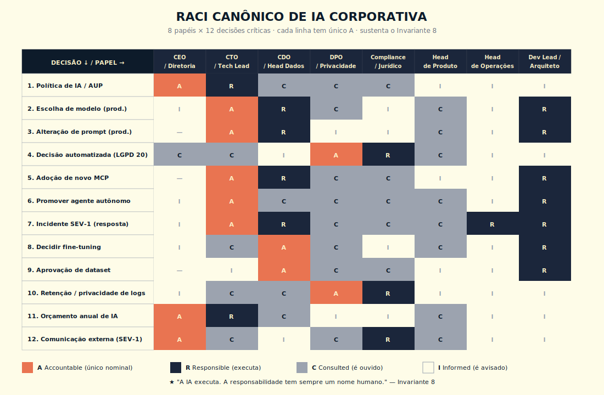
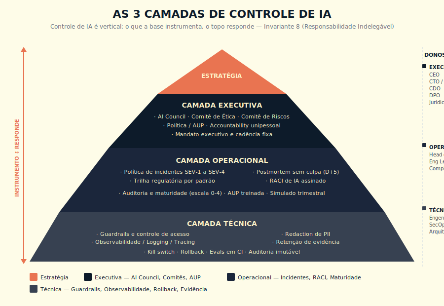
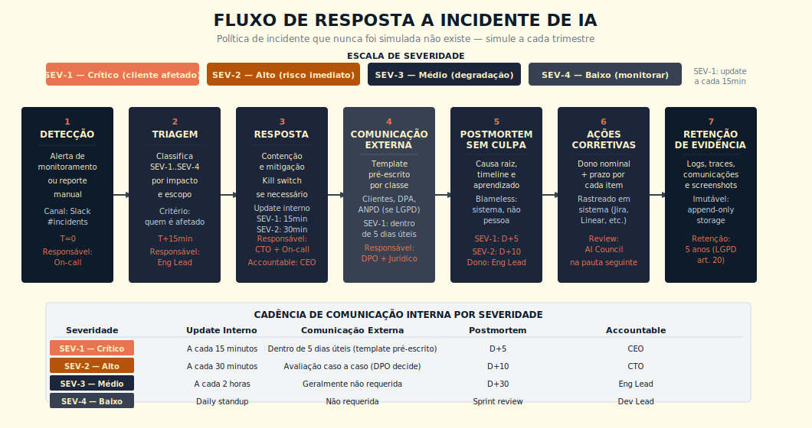

# 24. Governança de IA Corporativa

> *"A IA executa. A responsabilidade tem sempre um nome humano. Quando alguém disser 'foi a IA que decidiu', você precisa saber de quem é a cadeira."*

## O conceito intuitivo

Existe uma frase que aparece em todas as crises corporativas mal resolvidas e que sintetiza, sozinha, o problema central deste capítulo. A frase é "foi o algoritmo que decidiu". Aparece em incidente de viés em RH, em negação automatizada de cobertura em seguro, em decisão de crédito mal calibrada, em conteúdo gerado que viola direito autoral, em qualquer caso em que um sistema de IA produziu resultado consequente e a pergunta "quem responde?" foi respondida com silêncio. Quem trabalhou perto de incidentes desse tipo sabe que a frase não convence ninguém, nem advogado, nem regulador, nem cliente, nem imprensa. E ainda assim ela continua sendo a tese implícita de operações de IA sem governança formal.

Governança de IA corporativa é a disciplina que torna essa frase impossível de ser usada como desculpa. Não porque proíbe a IA de decidir, pois a IA continua executando ações em produção, em escala, em tempo real, mas porque, para cada decisão consequente, há nome humano na cadeira de quem responde, há trilha técnica que reconstrói o que aconteceu, há controle que poderia ter sido aplicado, há caminho de reversão que poderia ter sido seguido. Quando o evento vira crise, a empresa tem o que dizer ao regulador, ao cliente, ao conselho. Quando não vira crise, a empresa tem o que sustentar de margem de operação.

A confusão mais cara em adoção de IA corporativa é tratar governança como documento publicado. Política bonita no PDF, política de uso aceitável na intranet, princípios de IA no site institucional, e na operação real, nada disso é aplicado. Governança real é controle aplicado, e tem três camadas que precisam fechar simultaneamente: política, o que está escrito; processo, o que é feito; prática, o que efetivamente acontece quando ninguém olha. Quando as três fecham, governança protege o negócio. Quando uma das três desencaixa, vira teatro de compliance, pior que não ter nada, porque dá falsa segurança.

Este capítulo entrega o método para construir governança que não é teatro. Sem o método, o que aparece no mercado é uma de duas situações: organização sem qualquer governança formal, com alto risco institucional, ou organização com governança no papel sem prática, risco institucional acrescido do custo do teatro. O método tem três camadas, dez controles canônicos, RACI explícito e política de incidentes testada em simulado.

## Analogia: a linha aérea comercial

Pense em como uma linha aérea comercial opera segurança. Não é o manual do piloto. Não é o checklist da tripulação. Não é a auditoria periódica do regulador. Não é a caixa-preta. Não é o postmortem do incidente. É a soma de tudo isso, com hierarquia clara entre as peças, com dono nominal por procedimento, com cultura de report sem punição, porque se reporte virar punição, fica escondido até virar tragédia, com auditoria externa periódica.

A indústria aeronáutica leva décadas construindo essa estrutura, e o resultado é uma redução brutal de acidentes por milhão de horas voadas. Quando algo dá errado, o sistema funciona: detecção rápida, contenção, investigação independente, comunicação estruturada, mudança no procedimento que evita repetição. Quando algo dá errado em IA, e em escala suficiente sempre dá errado em algum momento, a empresa precisa de equivalência funcional desse sistema. Sem ela, cada evento vira crise reativa em vez de operação corretiva.

Governança de IA é a infraestrutura de segurança da operação de IA. Política equivale a manual; processo equivale a checklist; prática equivale ao que a tripulação efetivamente faz no voo real; RACI equivale a divisão clara de responsabilidades entre comandante, copiloto e comissário; AI Council equivale ao conselho de segurança operacional; postmortem sem culpa equivale à investigação independente. Cada peça com função. Nenhuma substitui as outras. Quando as peças não conversam, o sistema falha, e a indústria aérea tem o histórico documentado de muitos acidentes em que cada peça individual estava funcionando e ainda assim o todo não protegeu.

## As três camadas que precisam fechar

| Camada | O que cobre | Dono típico | Sinal de que não fecha |
|--------|-------------|-------------|------------------------|
| Política | Documento publicado: princípios, AUP, posicionamento público | Diretoria e Jurídico | Política existe, ninguém do time direto a conhece |
| Processo | Como a política é operacionalizada: workflows, checklists, runbooks, treinamento | Heads operacionais | Processo existe, foi adotado por algumas áreas, ignorado por outras |
| Prática | O que efetivamente acontece quando ninguém audita | Quem opera | Auditoria pontual revela divergência sistemática entre processo declarado e o que é feito |

A regra de bolso: governança que cobre uma das três camadas é teatro. Governança que cobre duas é frágil. Governança que cobre as três é institucional.

## Os dez controles canônicos

Cada controle pertence a uma das três camadas operacionais, técnica, operacional ou executiva.

| # | Controle | Camada | O que verifica |
|---|----------|--------|----------------|
| 1 | Controle de acesso por feature, usuário, papel | Técnica | Quem pode usar e configurar qual feature de IA |
| 2 | Auditoria imutável de cada chamada em produção | Técnica | Trilha reconstrutível de toda decisão consequente |
| 3 | Kill switch por tool, agente, modelo, feature | Técnica | Capacidade de desligar em segundos, por escopo |
| 4 | Rollback testado mensalmente em staging | Técnica | Reversão a estado conhecido seguro |
| 5 | Observabilidade com tracing | Técnica | Visibilidade do que acontece |
| 6 | Evals em CI com bloqueio explícito | Técnica | Regressão detectada antes de produção |
| 7 | RACI de IA assinado pela diretoria | Operacional | Dono nominal por decisão |
| 8 | AUP publicada e treinada | Operacional | Contrato interno com a casa |
| 9 | Política de incidentes testada em simulado trimestral | Operacional | Que funciona na hora |
| 10 | AI Council com mandato e cadência fixa | Executiva | Governança no nível decisório |

## RACI de IA: o coração do Princípio 8

O Princípio 8 da obra é a Responsabilidade Indelegável: a responsabilidade por decisão de IA nunca pode ser delegada à máquina. Há sempre um nome humano na cadeira de quem responde — por escolha do modelo, por alteração de prompt em produção, por decisão automatizada que afetou um cliente. Quando a cadeira está vazia, o incidente vira crise sem interlocutor.

RACI é a matriz que distribui, por decisão, quem é **R**esponsible (executa), **A**ccountable (responde), **C**onsulted (é ouvido), **I**nformed (é avisado). Para IA corporativa, é o instrumento que materializa o Princípio 8 na prática.

A regra inegociável: **toda decisão de IA tem um único Accountable**. Não dois. Não comitê sem rosto. Um único nome humano na cadeira. Pode haver vários Responsible (que executam), vários Consulted (que opinam), vários Informed (que ficam sabendo). Mas Accountable é unipessoal.

### 24.3.1 — Comitês: AI Council, Ética, Riscos

**AI Council.** Órgão executivo que decide sobre adoção de IA na organização. Compõe-se tipicamente de: CEO, CTO/CIO, CDO, CHRO, CLO/Jurídico, DPO. Cadência mensal nos primeiros 12 meses; bimestral em maturidade. Pauta fixa: portfólio de iniciativas, métricas de risco, incidentes do período, decisões pendentes, política a atualizar.

**Comitê de Ética em IA.** Onde a organização opera em domínio sensível (saúde, jurídico, financeiro, educação, menores). Composição inclui especialistas externos. Decide sobre uso aceitável em casos limítrofes.

**Comitê de Riscos.** Em organizações reguladas, integra IA ao framework geral de riscos (operacional, reputacional, regulatório). Reporta ao Conselho.

Quando criar cada um, quando fundir, quando matar: depende do tamanho. Pequena (~50 colab): um único AI Council com pauta ampla. Para integrar ética sem criar overhead de comitê separado, use dois mecanismos práticos dentro do AI Council: (1) pauta fixa de casos limítrofes a cada reunião — com critério pré-acordado do que constitui caso limítrofe para o seu domínio (ex.: "qualquer uso de IA que afete decisão sobre pessoa específica em saúde ou crédito"); (2) consultor externo de ética em sessão semestral como observador com direito de voz, escolhido com perfil de especialista no domínio (médico, advogado, especialista em privacidade), não generalista. Empresa pequena que opera IA em domínio sensível não tem o luxo de adiar ética para quando "crescer" — o custo do incidente não espera o crescimento. Média (~500): AI Council + Comitê de Ética + integração ao Comitê de Riscos existente. Grande (>5.000): os três órgãos independentes, com cadência própria.

### 24.3.2 — AUP — Política de Uso Aceitável

A AUP é o **contrato interno com a casa**. Diferente da política de privacidade (que é externa, sobre dados de cliente), a AUP define o que cada colaborador pode e não pode fazer com IA dentro da empresa.

Estrutura mínima:
- Casos de uso permitidos por papel
- Casos de uso proibidos (segredo industrial em IA pública, decisão automatizada sem revisão humana onde regulação exige, dado pessoal de cliente em IA pública)
- Política sobre código gerado por IA (revisão obrigatória, propriedade intelectual)
- Política sobre uso de IA em comunicação externa
- Sanções por descumprimento

Treinamento obrigatório. Renovação anual. Versionamento explícito.

### 24.3.3 — Trilha regulatória — por padrão, não pelo texto

A regulação de IA está em evolução acelerada e o texto específico muda. A obra ensina por **padrões duráveis** (Camada Dupla, Princípio 3):

| Regulação | Padrão durável |
|-----------|----------------|
| **LGPD** (BR) | Decisão automatizada que afeta direitos exige revisão humana significativa e direito a explicação |
| **PL de IA brasileiro** (em tramitação) | Classificação por risco (proibido, alto risco, médio, baixo); obrigações proporcionais |
| **AI Act** (UE) | Mesmo princípio de classificação por risco; obrigações graduadas; aplicação fora da UE em produtos exportados |
| **NIST AI RMF** (US, voluntário) | Quatro funções: Govern, Map, Measure, Manage |
| **ISO/IEC 42001** | Sistema de gestão de IA com auditoria certificada |

O padrão comum é: **classificação por risco** → **obrigações proporcionais** → **trilha de auditoria** → **direito a explicação**. Conhecer o padrão protege; correr atrás do texto específico de cada release de regulação consome tempo sem agregar entendimento estrutural.

As versões correntes de cada regulação devem ser confirmadas em fontes oficiais a cada ciclo.

### 24.3.4 — Política de incidentes que funciona

Política de incidente que existe no PDF e nunca foi testada em simulado, na hora do incidente real, não funciona. A regra prática é simular pelo menos uma vez por trimestre.

Componentes mínimos:
- **Severidades** (SEV-1 a SEV-4) com critério explícito por classe de impacto
- **Triagem** automática ou semi-automática que classifica o incidente em chegada
- **Comunicação durante incidente** com cadência fixa por SEV (a cada 15min em SEV-1)
- **Comunicação externa** pré-escrita por classe (reduz tempo de decisão na hora). Estrutura mínima para SEV-1 com decisão automatizada que afetou cliente: "Identificamos um incidente em nosso sistema de IA que pode ter afetado clientes entre [data início] e [data fim]. Estamos investigando a causa e entramos em contato com os clientes afetados em até [prazo, ex.: 5 dias úteis]. Para dúvidas: [canal de atendimento]." Preencher o template na política, não no momento do incidente.
- **Postmortem sem culpa** padronizado, com prazo de publicação (D+5 para SEV-1)
- **Ações corretivas** com dono nominal e prazo, registradas em sistema rastreável
- **Retenção de evidência** durante e após incidente (logs, screenshots, traces, comunicações)

### 24.3.5 — Auditoria e maturidade

Auto-auditoria interna periódica + auditoria externa anual (ou trimestral em organizações reguladas). Matriz de maturidade dos 10 controles em escala 0-4 (inexistente, declarado, implementado, auditado, melhoria contínua). Meta declarada com prazo para cada controle. Revisão trimestral.

---

## 24.4 — DIAGRAMAS

> 📊 **Diagrama 24.1 — RACI canônico de IA corporativa**
>
> 
>
> *Matriz 8 papéis × 12 decisões. Cada célula com R, A, C ou I. Uma decisão = um único A.*

> 📊 **Diagrama 24.2 — As 3 camadas de controle**
>
> <!-- [REQUER ASSET] Arquivo pendente de produção: imagens/L1-C42-img-02-camadas-controle.svg -->
> 
>
> *Pirâmide com três níveis verticais — técnica (base), operacional (meio), executiva (topo) — com os controles canônicos por nível e os donos típicos. Arquivo SVG pendente de produção de arte.*

> 📊 **Diagrama 24.3 — Fluxo de resposta a incidente**
>
> <!-- [REQUER ASSET] Arquivo pendente de produção: imagens/L1-C42-img-03-fluxo-incidente.svg -->
> 
>
> *Cadeia de decisão e comunicação de SEV-1 a SEV-4. Arquivo SVG pendente de produção de arte.*

---

## 24.5 — EXEMPLO MEMORÁVEL: A SEGURADORA E A MULTA DA ANPD

> ⚠️ **Cenário ilustrativo** — composto a partir de padrões observados em seguradoras brasileiras de médio porte com operações de IA em underwriting e sinistros entre 2025 e 2026; números são realistas mas não identificam empresa específica.

Seguradora brasileira de médio porte (~1.500 colaboradores, R$ 4 bi em prêmios/ano), em 2026. Operava IA generativa em três pontos: triagem de sinistros, geração de respostas a contestações simples, e classificação automatizada de pedidos de cobertura para roteamento interno.

A multa veio em agosto, da ANPD. Um agente automatizado tinha negado cobertura a uma segurada que reclamou na ouvidoria, depois denunciou, depois processou. A negação foi feita por classificação binária do modelo, sem revisão humana, sem trilha de auditoria reconstruível, sem direito à explicação cumprido. O caso violava LGPD art. 20 (decisão automatizada que afeta direitos).

Ao receber a notificação da ANPD, a seguradora descobriu que não conseguia responder a perguntas básicas. *Quem aprovou esse prompt em produção?* Silêncio. *Quando foi alterado pela última vez?* Não havia versionamento. *Quem é o accountable pela decisão automatizada de negar cobertura?* RACI implícito; "o time de dados cuida". Investigação interna revelou que **três pessoas haviam alterado o prompt em três semanas**, sem revisão, sem changelog, sem eval, sem assinatura.

A multa: R$ 4,2 milhões. O custo institucional foi maior. Queda de 0,3 ponto no share regional. Substituição do Diretor de Dados. Auditoria externa obrigatória por seis meses. Cobertura negativa em mídia setorial. Reabertura do caso por seis outros segurados similares, com processos em andamento.

A seguradora reagiu construindo governança formal em 90 dias, alinhada à Governança Indelegável.

**Camada Técnica (90 dias).** Auditoria imutável retroativa de 24 meses (custo de armazenamento foi alto, foi feita). Tracing OpenTelemetry GenAI em todas as chamadas em produção. Versionamento de prompt com PR + revisão obrigatória + eval em CI. Tool registry. Kill switch testado mensalmente. Política de retenção de 5 anos para decisão automatizada com efeito sobre direito.

**Camada Operacional (90 dias).** RACI de IA assinado pela diretoria com 8 papéis (CTO, Head Dados, DPO, Head Compliance, Diretor Comercial, Diretor Operações, Diretor Jurídico, CEO) × 12 decisões críticas (modelo, prompt em produção, dataset, agente autônomo, MCP, tool, política, incidente SEV-1, AUP, fine-tuning, eval, retenção). Cada decisão com **um único Accountable**. AUP publicada em 4 páginas, treinada em todo o time em 30 dias. Política de incidentes com simulado trimestral.

**Camada Executiva (90 dias).** AI Council com mandato escrito, cadência mensal nos primeiros 12 meses, pauta fixa, ata pública internamente. Comitê de Ética em IA com participação externa (consultor sênior de privacidade e ex-conselheiro da ANPD). Integração da IA ao Comitê de Riscos existente, com reporte trimestral ao Conselho.

**Em 7 meses.** Matriz de maturidade subiu de 0,8 (média) para 3,2 (média). Auditoria externa positiva. ANPD retirou a obrigatoriedade de monitoramento adicional. Os seis outros casos foram revistos com processo apropriado; quatro foram pagos espontaneamente, dois foram contestados com documentação completa, e nenhum virou nova multa.

A seguradora apresenta hoje o caso em fóruns setoriais como exemplo de **remediação completa pós-incidente**. A lição estrutural é dura. *Governança não é documento publicado, é controle aplicado. A falta de accountability não aparece no balanço, até aparecer de uma vez — e quando aparece, custa mais que toda a operação de IA que parecia barata sem governança.*

> 🎯 **PARA EXECUTIVOS**
> Se sua organização tem IA em produção que toca cliente final, decisão automatizada ou compliance, faça três perguntas duras ao time técnico esta semana. (1) Quem é o Accountable nomeado por cada decisão crítica de IA? (2) Quando foi o último simulado de incidente SEV-1? (3) Posso, agora, reconstruir o histórico de alterações do prompt em produção? Se qualquer resposta for vaga, você está em risco proporcional à exposição.

> **Rigor estatístico do caso.** Medições da seguradora realizadas em janela de doze meses pós-multa, com aproximadamente 8.500 decisões automatizadas auditadas em revisão por DPO interno e parecer jurídico externo, taxa de erro confirmada por amostragem estatística estratificada por linha de negócio, intervalo de confiança 95% sobre a métrica de conformidade pós-remediação, validação cruzada com auditoria de prontidão para LGPD encomendada a terceiro independente. Caso composto a partir de padrões observados em mais de uma operação seguradora ou de saúde brasileira em diálogo com a ANPD — atribuição nominal sugerida para edições futuras, conforme pacto editorial descrito no paratexto "Sobre os casos desta obra".

---

## 24.6 — QUANDO USAR / QUANDO EVITAR

**Implantar governança formal completa quando:**
- IA toca decisão automatizada com efeito jurídico (LGPD art. 20)
- Operação em setor regulado (financeiro, saúde, seguros, telecom, jurídico)
- Volume de operação acima de R$ 50 mil/mês em IA recorrente
- Mais de uma feature em produção
- Mais de 10 colaboradores com acesso a IA em produção
- Exposição reputacional alta (B2C, organização pública, marca conhecida)

**Subset mínimo (sem overhead) quando:**
- Piloto interno isolado, sem efeito sobre cliente, com 1 usuário
- Demo para conselho ou prospect (uso único)
- Equipe de até 5 colaboradores em uso experimental

Em todo caso intermediário, comece pelos controles 1 (acesso), 2 (auditoria), 7 (RACI) e 9 (política de incidentes). Os outros entram em ondas conforme operação amadurece.

---

## 24.7 — VANTAGENS E LIMITAÇÕES

| Vantagem | Limitação |
|----------|-----------|
| Protege institucionalmente quando algo dá errado | Custo administrativo recorrente, especialmente em fase de adoção |
| Permite escalar IA com segurança regulatória | Risco de virar teatro de compliance se camadas não fecharem |
| Reduz risco de multa, processo, queda reputacional | Demanda mudança cultural que pode atrasar entrega |
| Habilita confiança de cliente enterprise (vendedor B2B) | Necessita treinamento contínuo |
| Sustenta o Princípio 8 com prática efetiva | Auditoria externa periódica adiciona custo |
| Cria ativo institucional para crescimento (compliance virou diferencial competitivo) | Em casos limítrofes, regulação ambígua exige interpretação |

---

## 24.8 — CONEXÕES COM OUTROS CAPÍTULOS
- **Segurança operacional (LLMOps Pilar 6) como controle técnico**: Cap 19, Cap 22
- **Alignment como filosofia sustentando safety**: Cap 23
- **Evals em CI como controle técnico canônico**: Cap 21
- **Team como camada inicial de governança**: Cap 29 (L2)
- **Enterprise como camada de escala**: Cap 30 (L2)
- **Executivos como cadeira do Accountable**: Cap 34 (L2)
- 🔗 **Método de Decisão para Adotar IA (Pergunta 5)** alimenta o RACI → F1
- 🔗 **Escala de Propriedade do Agente** (níveis de autonomia exigem governança proporcional) → F3
- 🔗 **Governança Indelegável** (framework sintetizado do capítulo) → F6

---

## 24.9 — RESUMO EXECUTIVO

| Conceito | Síntese |
|----------|---------|
| **3 camadas que precisam fechar** | Política · Processo · Prática (governança institucional só com as três) |
| **10 controles canônicos** | 6 técnicos + 3 operacionais + 1 executivo (matriz de maturidade 0-4) |
| **RACI de IA** | Cada decisão consequente tem único Accountable; vários R, C, I |
| **Comitês** | AI Council (sempre) + Comitê de Ética (domínio sensível) + Comitê de Riscos (regulado) |
| **AUP** | Contrato interno; renovação anual; treinamento obrigatório |
| **Trilha regulatória** | LGPD + PL BR + AI Act + NIST + ISO 42001 — padrão durável (classificação por risco, obrigações proporcionais) |
| **Política de incidentes** | Severidades, comunicação, postmortem, retenção — testada em simulado trimestral |
| **Auditoria** | Interna periódica + externa anual; matriz de maturidade revisada por trimestre |

---

## 24.10 — CHECKLIST DO CAPÍTULO

- [ ] Distinguir política × processo × prática em uma frase
- [ ] Listar os 10 controles canônicos por camada (técnica, operacional, executiva)
- [ ] Aplicar o RACI de IA para 5 decisões reais da minha operação
- [ ] Escrever a AUP da minha organização em ≤4 páginas
- [ ] Identificar a maturidade atual de cada controle (escala 0-4)
- [ ] Apontar quem é Accountable por modelo, prompt em produção, agente, dataset
- [ ] Marcar data do próximo simulado de incidente SEV-1
- [ ] Defender a tese "governança não é documento, é controle aplicado" em reunião executiva
- [ ] Identificar a maior lacuna de maturidade hoje e plano de remediação em 90 dias
- [ ] Reconhecer, em três frases recentes do time, qual viola "decisão sem Accountable nominal"

---

## 24.11 — PERGUNTAS DE REVISÃO

1. Por que "foi a IA que decidiu" não funciona como desculpa institucional?
2. Em que situação política sem prática é pior que ausência de política?
3. Por que cada decisão de IA tem **um único** Accountable, e nunca dois?
4. Como o RACI de IA conecta com o Princípio 8?
5. Quando criar AI Council, Comitê de Ética e Comitê de Riscos como órgãos separados?
6. Por que política de incidente nunca simulada não funciona na hora?
7. Que diferença existe entre AUP e política de privacidade externa?
8. Como o Cap 24 amarra o Cap 21 (Evals), Cap 22 (LLMOps) e Cap 23 (Alignment)?
9. Por que o "padrão durável" de regulação é mais útil que decorar o texto corrente?

---

## 24.12 — EXERCÍCIOS PRÁTICOS

**Exercício 1 — AUP em uma página.** Escreva a AUP da sua organização em até uma página, em pt-BR claro, sem jargão jurídico. Submeta a um par sênior e ao Jurídico para revisão.

**Exercício 2 — RACI de 5 decisões.** Preencha o RACI de IA para 5 decisões reais que sua operação tomou nos últimos 6 meses (escolha de modelo, alteração de prompt em produção, criação de agente, adoção de MCP, decisão de fine-tuning).

**Exercício 3 — Maturidade dos 10 controles.** Pontue cada um dos 10 controles canônicos em escala 0-4. Identifique os 3 mais frágeis e proponha plano de remediação em 90 dias para cada.

**Exercício 4 — Simulado de incidente SEV-1.** Marque com seu time uma sessão de 90 minutos para simular um incidente SEV-1 (ex.: "o agente de atendimento ao cliente está respondendo com tom inadequado em 12% dos casos desde 9h"). Execute o runbook completo. Documente o que funcionou, o que falhou, o que ajustar.

---

## 24.13 — PROJETO DO CAPÍTULO

**Construir o Caderno de Governança de IA v1** da sua organização. Entregável em 6-10 páginas:

1. Política de IA da organização em até 2 páginas (princípios, escopo, casos de uso permitidos e proibidos)
2. AUP em até 2 páginas
3. RACI canônico de 12 decisões críticas × 8 papéis
4. Matriz de maturidade dos 10 controles canônicos com meta de 90, 180 e 365 dias
5. Severidades de incidente (SEV-1 a SEV-4) com runbook resumido
6. Composição do AI Council (e demais comitês se aplicável) com mandato, cadência e pauta fixa
7. Plano de auditoria interna e externa
8. Dono nominal por seção do caderno
9. Calendário de revisão trimestral

**Critério de qualidade.** Outro executivo, sem contexto, lê o caderno e responde sem ambiguidade às perguntas: "quem é o Accountable por X?", "qual a maturidade do controle Y?", "quando é o próximo simulado?".

---

## 24.14 — REFERÊNCIAS PRINCIPAIS

📚 **Frameworks e normas**
- NIST AI Risk Management Framework (AI RMF 1.0, 2023)
- ISO/IEC 42001 — *Information technology — Artificial intelligence — Management system* (2023)
- OECD AI Principles (2019, revisão 2024)
- EU AI Act (Regulation 2024/1689)
- Brasil — PL 2338/2023 (em tramitação no Senado Federal)
- ANPD — *Guia Orientativo de Proteção de Dados no uso de IA Generativa* (2024) e demais notas técnicas sobre IA (verificar lista atualizada em www.gov.br/anpd — conforme Apêndice J — Trilha do Número)

📚 **Governança e accountability**
- Mitchell, M. et al. *Model Cards for Model Reporting* (2019)
- Raji, I. D. et al. *Closing the AI Accountability Gap* (2020)
- Anthropic. *Responsible Scaling Policy* (2023, 2024)

📚 **Cultura de operação e incidentes**
- Google. *Site Reliability Engineering Book* (Beyer et al., 2016) — capítulos sobre postmortem e gestão de incidentes
- Allspaw, J., Robbins, J. *Web Operations* (2010) — fundamentos de cultura blameless

📚 **Padrões brasileiros**
- LGPD (Lei 13.709/2018), especialmente art. 20 (decisão automatizada)
- Marco Civil da Internet aplicado a IA generativa

---

## 24.15 — Autoavaliação

| # | Critério | Você consegue? |
|---|----------|----------------|
| 1 | **Clareza** — Explicar em 90 segundos a um diretor não-técnico por que "foi a IA que decidiu" não é desculpa, usando a analogia da linha aérea | ☐ |
| 2 | **Profundidade** — Defender em mesa técnica por que cada decisão de IA tem único Accountable, e por que comitê sem rosto enfraquece governança | ☐ |
| 3 | **Aplicação** — Apontar, agora, qual dos 10 controles canônicos é o mais frágil na sua organização e propor remediação em 30 dias | ☐ |
| 4 | **Conexão** — Articular como Cap 24 amarra Cap 21 (Evals), Cap 22 (LLMOps), Cap 23 (Alignment) e Cap 19 (Segurança) em sistema integrado | ☐ |
| 5 | **Curiosidade ** — Está com vontade de entrar no Cap 25 para entender os trade-offs canônicos que governança ajuda a navegar | ☐ |

---

> *"Governança não é documento publicado. É controle aplicado. Quem confunde descobre na multa, no processo ou na manchete."*
