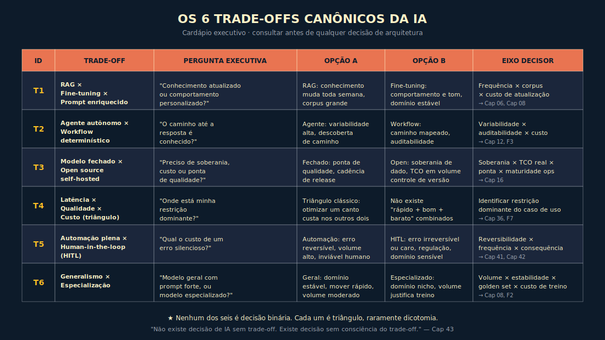

# 25. Trade-offs Canônicos da IA

---

> *"Não existe decisão de IA sem trade-off. Existe decisão sem consciência do trade-off. Quem se acomoda na segunda paga preço pela primeira."*

---
## 25.1 — O CONCEITO INTUITIVO

Toda decisão de IA em ambiente corporativo se reduz, no fim, a uma família pequena de **trade-offs canônicos**. Não são novos, não são exóticos, e não vão mudar nos próximos dez anos. RAG ou fine-tuning, ou nenhum dos dois? Agente autônomo ou workflow determinístico? Modelo fechado ou open source self-hosted? Onde sacrificar latência, qualidade ou custo? Automação plena ou human-in-the-loop? Generalismo ou especialização? Cada trade-off tem três a quatro eixos que decidem o lado certo para uma situação específica. Quem domina os eixos decide rápido e correto; quem decide por intuição refaz a decisão a cada trimestre, com custo crescente.

Este capítulo é o **cardápio executivo** de IA. É a referência consultada antes de qualquer decisão de arquitetura, antes de qualquer aprovação de iniciativa, antes de qualquer migração técnica. Não substitui os capítulos que aprofundam cada trade-off — RAG está no Cap 06, fine-tuning no Cap 08, agentes no Cap 12, open source no Cap 16, custo no Cap 18, autonomia no Cap 22 —, e sim sintetiza, num lugar único, a decisão por eixos que cada capítulo desenvolve.

A regra de ouro é não tratar nenhum dos seis trade-offs como **decisão binária**. Cada um é triângulo, raramente dicotomia. RAG e fine-tuning podem coexistir. Agente e workflow podem alternar. Aberto e fechado podem coabitar no mesmo stack. Generalista e especialista podem ser roteados. Quem encara o trade-off como decisão de A ou B perde a flexibilidade arquitetural que torna a operação sustentável.

---

## 25.1A — CARDÁPIO RÁPIDO — os seis trade-offs em uma página

*Use esta tabela antes de ler o capítulo completo ou ao consultar para uma decisão específica. Os detalhes de cada trade-off estão na seção 25.3.*

| Trade-off | Pergunta executiva | Eixo decisor |
|-----------|-------------------|--------------|
| T1 RAG × Fine-tuning × Prompt | Conhecimento atualizado ou comportamento personalizado? | Frequência de mudança × corpus × custo |
| T2 Agente × Workflow | O caminho até a resposta é conhecido ou descoberto? | Variabilidade × auditabilidade × custo composto |
| T3 Fechado × Open source | Preciso de soberania, custo, qualidade ou independência de vendor? | Soberania × TCO × ponta × ops × lock-in |
| T4 Latência × Qualidade × Custo | Onde está minha restrição dominante? | Triângulo: otimizar dois custa no terceiro |
| T5 Automação × Human-in-the-loop | Qual o custo de um erro silencioso? | Reversibilidade × frequência × consequência |
| T6 Generalismo × Especialização | Modelo geral com prompt forte, ou especializado? | Volume × estabilidade × eval × custo |

**Sequência de decisão sugerida:** comece pelo T4 (identifique a restrição dominante), depois T1 (como entregar o conhecimento), depois T5 (quanto controle humano), depois T2 (agente ou workflow), depois T6 (geral ou especializado), por último T3 (vendor ou self-hosted).

---

## 25.2 — ANALOGIA: A CARTA DO RESTAURANTE

Pense num restaurante sério. Você não chega pedindo "o melhor prato". Você lê a carta, identifica o que combina com sua fome, seu paladar do dia, seu orçamento, o tempo que tem, o vinho que vai pedir. Há ali, sob cada item, um trade-off explícito — proteína vegetal ou animal, técnica longa ou rápida, sazonalidade, fusão ou tradicional. O chef do bom restaurante não decide pelo cliente; oferece o cardápio honesto e deixa a escolha consciente. O cliente bem informado decide rápido, e a refeição faz sentido.

Trade-offs canônicos de IA são o cardápio do CTO. Você lê os seis itens, identifica o que combina com o caso de uso, o orçamento, a regulação, a maturidade do time. Sob cada item, há eixos honestos. Nenhum item é universalmente melhor; cada um tem situações onde brilha e outras onde é desperdício. O CTO maduro consulta o cardápio antes de cada decisão; o imaturo escolhe pelo que está na moda.

A analogia ilumina três pontos. Primeiro, o trade-off é **decisão de adequação**, não de superioridade. Segundo, o trade-off é **consciente**: ser surpreendido pelo eixo que você não considerou é falha de método. Terceiro, o trade-off é **repetível**: a mesma decisão pode ser revisada quando o contexto mudar, sem culpa.

---

## 25.3 — OS SEIS TRADE-OFFS CANÔNICOS

### Trade-off T1 — RAG × Fine-tuning × Prompt enriquecido

**Pergunta executiva:** *"Quero conhecimento atualizado, comportamento personalizado, ou os dois?"*

| Opção | Quando faz sentido | Quando é desperdício |
|-------|--------------------|-----------------------|
| **RAG** | Conhecimento muda toda semana; corpus grande; rastreabilidade exigida; equipe operando sem time de ML | Conhecimento é estável por anos; corpus pequeno |
| **Fine-tuning** | Comportamento específico (tom, formato, terminologia interna); domínio estável; volume alto que paga o custo de treino | Decisão de prestígio sem caso de uso claro; expectativa de "tirar a censura" |
| **Prompt enriquecido** | Caso simples; contexto curto; operação ainda em prototipagem | Conhecimento volumoso; necessidade de rastreabilidade; volume crescente |

**Eixo decisor:** frequência de mudança do conhecimento × tamanho do corpus × custo aceitável de atualização.
Aprofundamento: Cap 06 RAG, Cap 08 Fine-tuning, Cap 11 Context Engineering.

---

### Trade-off T2 — Agente autônomo × Workflow determinístico

**Pergunta executiva:** *"O caminho até a resposta é conhecido, ou descoberto?"*

| Opção | Quando faz sentido | Quando é desperdício |
|-------|--------------------|-----------------------|
| **Agente autônomo** | Variabilidade alta no caminho da resposta; explorar fontes diversas; tarefa de pesquisa ou síntese aberta | Caminho conhecido e padronizado; auditabilidade exigida em cada passo |
| **Workflow determinístico** | Caminho mapeado em 80%+ dos casos; auditoria por passo necessária; reversibilidade exigida; custo composto sob controle | Tarefa exige descoberta; cobertura impossível de exaustivo |

**Eixo decisor:** variabilidade do caminho × auditabilidade exigida × custo composto.

⚠️ **Anti-padrão clássico:** escolher agente autônomo porque "tem N cenários", quando workflow determinístico cobriria os N-1 mais comuns com auditabilidade total a 1/10 do custo composto.
Aprofundamento: Cap 12 Agentes, Cap 22 LLMOps, Escala de Propriedade do Agente.

---

### Trade-off T3 — Modelo fechado × Open source self-hosted

**Pergunta executiva:** *"Preciso de soberania de dados, controle de custo ou ponta de qualidade?"*

| Opção | Quando faz sentido | Quando é desperdício |
|-------|--------------------|-----------------------|
| **Modelo fechado (vendor)** | Ponta de qualidade em capacidade crítica; sem time dedicado de infra/ML; cadência de release importa | Restrição regulatória sobre saída de dado; volume altíssimo com margem apertada; horizonte longo sem cláusula de migração |
| **Open source self-hosted** | Soberania de dado obrigatória; volume permite TCO menor que API; time maduro de ML/ops; independência de vendor como requisito estratégico | Sem time dedicado; sem golden set para sustentar a escolha; cadência de release alta |

**Eixo decisor:** soberania de dado × TCO real × ponta de qualidade × maturidade de ops × risco de lock-in.

O quinto eixo — risco de lock-in — é frequentemente o dominante em decisões de longo prazo e é o mais negligenciado. Lock-in em modelo fechado inclui: dependência de formato de API (migrar de um vendor para outro exige reengenharia de chamadas), política de preço (o vendor pode mudar unilateralmente), descontinuação de modelo (versões são deprecadas com aviso, sem garantia de comportamento idêntico no sucessor), e clausula de dados de treinamento (seus dados podem alimentar o próximo modelo do vendor se a política não for revisada). A pergunta operacional para o T3 em horizonte de 18 meses ou mais: "se este vendor triplicar o preço ou descontinuar este modelo, qual é o plano de migração e qual o custo?" Se a resposta for "não temos plano", o lock-in está sendo aceito implicitamente.

Aprofundamento: Cap 16 Open Source, Cap 15 Comparação de modelos.

---

### Trade-off T4 — Latência × Qualidade × Custo (o triângulo)

**Pergunta executiva:** *"Onde está minha restrição dominante?"*

O triângulo é princípio clássico de engenharia de sistemas: otimizar duas dimensões simultaneamente custa sempre na terceira. O princípio aparece em diversas formas na engenharia (triângulo CAP de Brewer em sistemas distribuídos, triângulo de qualidade em ISO 25010, triângulo de projeto escopo/tempo/custo em engenharia de software). Aplicado a IA, as três dimensões são latência, qualidade e custo. Não existe "rápido, bom e barato" como combinação livre; existe combinação restrita ao envelope possível em um modelo dado.

| Otimizar | Custa em |
|----------|----------|
| **Latência** | Qualidade (modelo menor, menos passos) ou Custo (caching agressivo, pré-computação) |
| **Qualidade** | Latência (modelo maior, mais passos) ou Custo (modelo premium) |
| **Custo** | Latência (cache + batch) ou Qualidade (modelo pequeno) |

**Eixo decisor:** identificação clara da restrição dominante no caso de uso real. Tarefa de conversação síncrona prioriza latência; tarefa de relatório regulatório prioriza qualidade; tarefa de classificação em volume prioriza custo.
Aprofundamento: Cap 18 Economia de Tokens, Custo Composto em Três Tempos.

---

### Trade-off T5 — Automação plena × Human-in-the-loop

**Pergunta executiva:** *"Qual o custo de um erro silencioso?"*

| Opção | Quando faz sentido | Quando é desperdício |
|-------|--------------------|-----------------------|
| **Automação plena** | Erro reversível com custo baixo; volume alto; revisão humana inviável em escala | Erro irreversível ou de altíssimo custo; regulação exige revisão humana; domínio sensível |
| **Human-in-the-loop** | Erro irreversível ou caro; regulação exige (LGPD art. 20, AI Act); domínio sensível; operação ainda em maturação | Volume torna revisão humana inviável; erro reversível e barato |

**Eixo decisor:** reversibilidade × frequência × consequência do erro.

A regra prática: começar com human-in-the-loop e migrar para automação plena conforme o golden set, o adversarial e a operação madurem. Não inverter a ordem.

**Nota sobre volume:** em produtos com milhões de interações mensais, HITL pleno pode ser economicamente inviável mesmo quando a regulação o recomenda. A solução arquitetural é HITL por amostra estatística — auditoria periódica com critério de amostragem explícito e documentado — em vez de revisão universal. LGPD e AI Act permitem essa abordagem para sistemas com histórico de qualidade demonstrado; registrar o critério de amostragem no Caderno de Governança.
Aprofundamento: Cap 21 Evals, Cap 23 Alignment, Cap 24 Governança, Escala de Propriedade do Agente.

---

### Trade-off T6 — Generalismo × Especialização

**Pergunta executiva:** *"Modelo geral com prompt forte, ou modelo especializado?"*

| Opção | Quando faz sentido | Quando é desperdício |
|-------|--------------------|-----------------------|
| **Modelo geral + prompt forte** | Domínio estável; volume moderado; sem tempo para construir golden set robusto; necessidade de mover rápido | Domínio nicho com vocabulário próprio; volume altíssimo com margem apertada |
| **Modelo especializado** | Domínio nicho (jurídico, clínico, código); volume justifica custo de treinamento; golden set robusto disponível | Domínio geral; volume pequeno; cadência alta de mudança no domínio |

**Eixo decisor:** volume × estabilidade do domínio × disponibilidade de golden set × custo de treino vs operação.
Aprofundamento: Cap 08 Fine-tuning, Cap 16 Open Source, Diagnóstico de Encaixe entre Tarefa e Modelo.

---

## 25.4 — DIAGRAMAS

> 📊 **Diagrama 25.1 — Matriz dos 6 trade-offs canônicos**
>
>
> Matriz 6×4 com cada trade-off em uma linha, eixos de decisão nas colunas (pergunta executiva, opção A, opção B, eixo decisor).

> 📊 **Diagrama 25.2 — Árvore de decisão integrada**
>
>
> Fluxograma único que percorre os 6 trade-offs em sequência sugerida (T4 triângulo → T1 → T5 → T2 → T6 → T3), com cada nó conectando ao próximo conforme decisão tomada.

> 📊 **Diagrama 25.3 — Triângulo Latência × Qualidade × Custo**
>
>
> Visualização clássica do triângulo de engenharia aplicada a IA.

---

## 25.5 — EXEMPLO MEMORÁVEL: O E-COMMERCE QUE ESCOLHEU AGENTE QUANDO WORKFLOW BASTAVA

> ⚠️ **Cenário ilustrativo** — composto a partir de padrões observados em e-commerces brasileiros de médio porte durante adoção de IA em atendimento e operação entre 2024 e 2026; números são realistas mas não identificam empresa específica.

E-commerce brasileiro de moda, ~280 colaboradores, ~1,4 milhão de pedidos/ano, operando em 2025. Decisão: automatizar classificação e roteamento de pedidos de reembolso. O time técnico levantou 27 cenários distintos (defeito, tamanho errado, atraso, arrependimento, fraude, troca, devolução parcial, e variações por categoria). A proposta foi um **agente autônomo** que pudesse navegar todos os 27 com flexibilidade e descobrir variantes não previstas.

A diretoria aprovou. Implementação em 8 semanas. Resultado em produção: tempo médio de classificação caiu de 14 minutos (humano) para 3 minutos (agente). Diretoria satisfeita. CFO assinou o investimento.

Três meses depois, três problemas convergiram. Primeiro, **fatura mensal de IA passou de R$ 12 mil para R$ 78 mil**. O agente, em cada classificação, fazia em média 6 chamadas ao modelo, com loops imprevisíveis em casos ambíguos. Segundo, **auditoria do CS revelou inconsistência**: o mesmo cenário, com input ligeiramente diferente, era classificado de formas distintas em 11% dos casos. Terceiro, em uma auditoria regulatória (Procon), o e-commerce não conseguiu reconstruir o caminho exato da decisão em 3 de 5 amostras pedidas, porque o agente não tinha tracing por passo nem rationale explícito.

Uma consultoria foi contratada. A análise revelou o erro estrutural: a empresa tinha caído na armadilha clássica do trade-off T2, escolhendo agente autônomo quando workflow determinístico cobriria a maioria com auditabilidade total. Dos 27 cenários, **24 eram cobertos por regras conhecidas e estáveis** — categoria de produto + motivo declarado + janela de pedido + status atual. Os 3 restantes (ambiguidade, suspeita de fraude, caso multi-categoria) é que justificavam intervenção do agente, sob supervisão humana.

A migração para **workflow determinístico para os 24 cenários estáveis + agente sob supervisão para os 3 ambíguos** levou 6 semanas. Resultado: fatura caiu para R$ 9 mil/mês (abaixo do baseline pré-IA), consistência subiu para 99,2%, tempo médio caiu mais 18% (workflow é mais rápido que agente), auditabilidade ficou total nos 24 cenários e parcial nos 3 restantes (com rationale registrado).

A lição é estrutural. *Em 80%+ dos casos, workflow determinístico bem desenhado é melhor que agente autônomo — mais barato, mais rápido, mais auditável, mais consistente. Agente é a ferramenta certa para descoberta, não para padrão. Quem confunde paga em três frentes ao mesmo tempo: fatura, consistência e auditabilidade.*

> 🎯 **PARA EXECUTIVOS**
> Toda vez que o time técnico propor "agente autônomo" para um caso com N cenários, faça a pergunta: "destes N cenários, quantos são conhecidos e estáveis hoje?". Se a resposta for "80% ou mais", a proposta correta é workflow determinístico para os conhecidos e agente sob supervisão para o restante. Inverter essa ordem custa caro nos três eixos do trade-off T2.

> **Rigor estatístico do caso.** Medições do e-commerce realizadas em janela de cinco meses, com aproximadamente 18.000 interações de atendimento amostradas estatisticamente por tipo de consulta (busca, troca, devolução, informação), taxa de inconsistência mensurada por revisão humana cega de 600 transcrições, intervalo de confiança 95% sobre custo unitário e taxa de resolução em primeiro contato, validação cruzada com NPS pré e pós-migração. Caso composto a partir de padrões observados em mais de um e-commerce brasileiro de moda e varejo digital — atribuição nominal sugerida para edições futuras, conforme pacto editorial descrito no paratexto "Sobre os casos desta obra".

---

## 25.6 — QUANDO USAR / QUANDO EVITAR

**Consultar o cardápio dos 6 trade-offs sempre que:**
- Iniciativa nova de IA está sendo aprovada
- Migração técnica está sendo considerada
- Fornecedor está sendo avaliado
- Arquitetura corrente está sendo revisada
- Decisão de cliente Enterprise depende de defender a arquitetura
- Auditoria interna ou externa está sendo preparada

**Evitar usar como receita rígida** quando o contexto exigir nuance específica. Os trade-offs são bússola, não mapa exato; a decisão final ainda demanda julgamento do operador (Princípio 9).

---

## 25.7 — VANTAGENS E LIMITAÇÕES

| Vantagem | Limitação |
|----------|-----------|
| Acelera decisão de arquitetura com cardápio explícito | Não substitui análise específica do caso de uso |
| Evita decisões por moda e por hype | Requer disciplina de consultar antes de propor |
| Cria vocabulário comum entre tech e diretoria | Em casos limítrofes, eixos não decidem por si só |
| Habilita revisão consciente quando contexto muda | Trade-off lido como dicotomia binária empobrece a decisão |
| Conecta os capítulos anteriores em sistema | Aplicado mecanicamente vira checklist sem força |

---

## 25.8 — CONEXÕES COM OUTROS CAPÍTULOS

- 🔗 Cap 06 RAG (T1), Cap 08 Fine-tuning (T1, T6)
- 🔗 Cap 12 Agentes (T2), Cap 15 Comparação (T3, T6), Cap 16 Open source (T3)
- 🔗 Cap 18 Custo (T4), Cap 22 LLMOps (T2, T5)
- 🔗 Cap 21 Evals (sustenta T5), Cap 23 Alignment (sustenta T5), Cap 24 Governança (regulação no T5)
- 🔗 Diagnóstico de Encaixe entre Tarefa e Modelo, Escala de Propriedade do Agente, Matriz de Cobertura de Integrações, Custo Composto em Três Tempos, Pirâmide da Avaliação

---

## 25.9 — RESUMO EXECUTIVO

| Trade-off | Pergunta | Eixo decisor |
|-----------|----------|--------------|
| T1 RAG × Fine-tuning × Prompt | Conhecimento atualizado ou comportamento personalizado? | Frequência × corpus × custo |
| T2 Agente × Workflow | Caminho é conhecido? | Variabilidade × auditabilidade × custo composto |
| T3 Fechado × Open source | Soberania, custo ou ponta? | Soberania × TCO × ponta × ops |
| T4 Latência × Qualidade × Custo | Onde está minha restrição? | Triângulo: dois às custas do terceiro |
| T5 Automação × HITL | Custo de erro silencioso? | Reversibilidade × frequência × consequência |
| T6 Generalismo × Especialização | Geral + prompt forte ou especializado? | Volume × estabilidade × eval × custo |

---

## 25.10 — CHECKLIST DO CAPÍTULO

- [ ] Recitar os 6 trade-offs em ordem
- [ ] Citar a pergunta executiva de cada
- [ ] Identificar o eixo decisor dominante de cada trade-off
- [ ] Classificar 3 decisões recentes na minha operação pelos trade-offs
- [ ] Defender por que workflow determinístico vence agente autônomo em 80% dos casos típicos
- [ ] Defender por que automação plena sem HITL é desperdício em domínio sensível
- [ ] Mapear quais trade-offs sua arquitetura corrente "ignorou" sem perceber
- [ ] Apresentar o cardápio à diretoria em 10 minutos
- [ ] Reconhecer, em três frases recentes do time, qual trade-off está sendo violado por intuição

---

## 25.11 — PERGUNTAS DE REVISÃO

1. Por que o trade-off não é dicotomia binária?
2. Em que situação RAG e fine-tuning coexistem com proveito?
3. Qual a armadilha clássica do T2 (agente × workflow)?
4. Por que o T4 (triângulo) é regra clássica de engenharia, não específica de IA?
5. Por que começar com HITL e migrar para automação é melhor que o inverso?
6. Em que situação modelo especializado vence o geral, mesmo com custo maior?
7. Como os trade-offs T1, T3 e T6 se entrelaçam?
8. Por que "ignorou o trade-off T5" é violação direta do Princípio 8?

---

## 25.12 — EXERCÍCIOS PRÁTICOS

**Exercício 1 — Auditoria de decisões.** Liste 6 decisões de arquitetura de IA tomadas na sua organização nos últimos 12 meses. Para cada uma, identifique qual dos 6 trade-offs estava em jogo, qual lado foi escolhido, e qual o eixo decisor. Avalie em retrospecto se a decisão sustentaria o cardápio.

**Exercício 2 — Roteamento por trade-off.** Para uma feature do seu produto, percorra os 6 trade-offs em ordem. Documente a decisão de cada um com justificativa em ≤1 parágrafo. Compare com a arquitetura atual; identifique divergências.

**Exercício 3 — Defesa executiva.** Prepare apresentação de 10 minutos para diretoria explicando os 6 trade-offs e como eles se aplicam à arquitetura atual. Defenda a arquitetura ou proponha mudança fundamentada.

**Exercício 4 — Cardápio adaptado.** Reescreva os 6 trade-offs adaptados à linguagem do seu setor (com vocabulário do seu domínio). Submeta a um par sênior.

---

## 25.13 — PROJETO DO CAPÍTULO

**Construir o Cardápio de Trade-offs do seu produto.** Entregável em 4-6 páginas:

1. Os 6 trade-offs canônicos com a decisão tomada em cada um para a feature principal
2. Justificativa em ≤1 parágrafo por trade-off, conectando ao eixo decisor
3. Plano de revisão (trimestral)
4. Critério de gatilho para revisão antecipada (custo cruza X, volume cresce Y, regulação muda)
5. Apresentação em 10 minutos para a diretoria

**Critério de qualidade.** Outro executivo, lendo o cardápio, consegue defender a arquitetura em reunião externa (cliente Enterprise, conselho, auditor) sem perguntar.

---

## 25.14 — REFERÊNCIAS PRINCIPAIS

📚 **Trade-offs canônicos de engenharia**
- Brewer, E. *CAP twelve years later: How the 'rules' have changed* (IEEE Computer, 2012) — triângulo de trade-off em sistemas distribuídos (consistência × disponibilidade × tolerância a partição); o princípio de que otimizar dois lados de um triângulo custa no terceiro precede a IA
- Brooks, F. *The Mythical Man-Month* (1975/1995) — triângulo de projeto escopo/tempo/custo em engenharia de software; aplicável analogicamente ao triângulo T4 de IA, mas não como referência direta
- Beck, K. *Extreme Programming Explained* (2000) — trade-offs em produto

📚 **Aplicação em IA**
- a16z. *The Emerging Architectures for LLM Applications* (Bornstein & Radovanovic, 2023)
- Karpathy, A. *Software 3.0* (palestra, junho de 2025)

📚 **Sobre RAG vs Fine-tuning**
- *RAG vs Fine-Tuning: Pipelines, Tradeoffs, and a Case Study on Agriculture* (Balaguer et al., 2024)

📚 **Sobre agentes vs workflows**
- Anthropic. *Building Effective Agents* (Dezembro 2024) — distinção canônica

---

## 25.15 — Autoavaliação

| # | Critério | Você consegue? |
|---|----------|----------------|
| 1 | **Clareza** — Recitar os 6 trade-offs em ordem, com pergunta executiva de cada, em até 3 minutos | ☐ |
| 2 | **Profundidade** — Defender em mesa técnica por que agente autônomo vence workflow determinístico só em casos específicos, e quais | ☐ |
| 3 | **Aplicação** — Classificar, agora, três decisões recentes da sua operação pelos trade-offs e identificar uma onde houve erro | ☐ |
| 4 | **Conexão** — Articular como o Cap 25 amarra os Caps 06, 08, 12, 15, 16, 18, 21, 22, 23 e 24 em sistema de decisão integrado | ☐ |
| 5 | **Curiosidade ** — Está com vontade de produzir o Cardápio de Trade-offs do próprio produto na próxima semana | ☐ |

---

> *"Não existe decisão de IA sem trade-off. Existe decisão sem consciência. Quem se acomoda paga preço pela primeira."*
