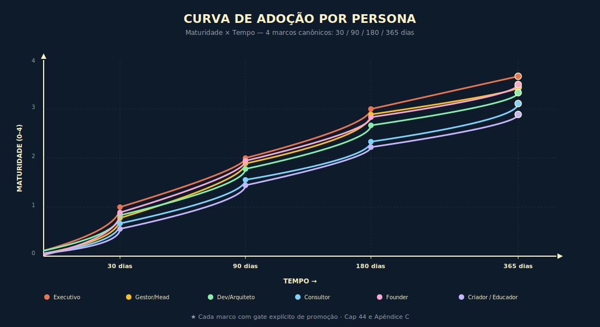

# 26. Roadmap Pessoal de IA

---

> *"Roadmap calibrado vira produto, porque assume as horas reais, os prerrequisitos honestos e o critério explícito de abandono."*

---

## Abertura

A história mais comum do leitor de livro técnico sério é a mesma há trinta anos, e ela tem três atos. No primeiro, o leitor termina o livro com sensação de domínio, marca passagens, anota o roadmap e promete aplicá-lo. No segundo, a agenda real entra em colisão com o roadmap idealizado, porque o livro estimou doze horas semanais de estudo e a semana real tem espaço para três, porque o livro pressupôs sandbox corporativo que a empresa não autorizou, porque o livro pressupôs prerrequisitos que o leitor não tem. No terceiro, em três meses, o roadmap virou desconforto silencioso, com o leitor evitando reabrir o livro porque o roadmap o lembra do que prometeu e não cumpriu, e o livro fecha-se na estante como mais um aprendizado abortado. Esta é a falha clássica de roadmap aspiracional, e ela tem causa única: o roadmap foi escrito para o leitor ideal, não para o leitor real.

O método deste capítulo é o oposto, e o que distingue um do outro são quatro atributos não negociáveis em cada marco. Horas semanais reais, com leitura honesta de quanto o profissional médio de cada persona consegue dedicar, no Brasil, em organização típica. Prerrequisitos explícitos, com lista do que precisa estar pronto antes de iniciar o marco (capítulos lidos, frameworks dominados, marcos anteriores cumpridos). Recursos necessários, com lista do que a organização precisa fornecer (sandbox, orçamento de API mensal, acesso a dados, time mínimo). Critério de abandono, com sinal explícito de que o roadmap não serve para essa pessoa neste contexto e do que fazer no lugar. A última peça é a mais incomum, e a mais importante. Roadmap honesto admite que pode não ser para todo mundo, e a admissão é o que distingue produto sério de promessa entusiasta.

---

## 26.1 — Conceito Intuitivo: Por Que Roadmap Por Persona Com Horas Reais

A diferença entre roadmap genérico (que serve a todos e a ninguém) e roadmap por persona (que serve a um leitor específico em contexto específico) está em três dimensões, e a calibração em cada uma delas faz a diferença entre roadmap que se cumpre e roadmap que se abandona. A primeira dimensão é a persona profissional, com leitura honesta de qual é o eixo dominante do trabalho da pessoa (decisão executiva, gestão de time, construção técnica, consultoria, empreendedorismo, criação de conteúdo); a tarefa de cada persona é diferente, o objetivo de aprendizado é diferente, e o roadmap precisa refletir essa diferença sem tentar servir a todos com o mesmo conteúdo. A segunda dimensão é o contexto organizacional, com leitura honesta de em qual ambiente a pessoa opera (organização regulada, early-stage, late-stage, profissional solo); o mesmo CTO em fintech regulada tem roadmap diferente do CTO em startup early-stage, e ignorar essa diferença é prometer aplicação que o contexto não autoriza. A terceira dimensão é a agenda real, com leitura honesta de quantas horas semanais a pessoa consegue dedicar ao roadmap sem comprometer a operação corrente; o roadmap que pede vinte horas semanais ao CTO que tem três é roadmap que se abandona por incompatibilidade aritmética.

O Apêndice C desta obra apresenta os roadmaps por persona em forma sintética, com marcos a 30, 90, 180 e 365 dias, com ações e critérios de avanço. Este capítulo se diferencia do Apêndice C em três pontos. Primeiro, adiciona horas semanais reais por marco, com base em observação de profissionais de cada persona em contexto brasileiro típico. Segundo, adiciona prerrequisitos explícitos (capítulos da obra, frameworks dominados, marcos anteriores) que precisam estar cumpridos antes de iniciar cada marco, sob pena de o marco virar exercício de teatro. Terceiro, adiciona critério de abandono, com sinais explícitos de que o roadmap não serve para essa pessoa neste contexto, e com orientação sobre o que fazer no lugar. O Apêndice C é referência sintética; este capítulo é o instrumento de aplicação calibrada.

**Nota para profissionais de funções corporativas (financeiro, jurídico, recursos humanos).** Profissionais que atuam em funções de suporte — CFO, CHRO, advogado interno, controller — e que não gerenciam time de IA se classificam, em geral, na persona Gestor (se lideram equipe que usa IA) ou na persona Profissional Solo (se a adoção é individual ou da função). A seção 26.4 apresenta os ajustes por contexto organizacional aplicáveis a ambas as personas.

---

## 26.2 — Como Ler Este Roadmap

A tabela mestra da seção 26.3 apresenta, para cada persona, os quatro marcos com sete atributos, na seguinte ordem de leitura. Primeiro, leia o **objetivo** do marco em uma linha, e pergunte se ele faz sentido para a sua função e o seu contexto; se não fizer, considere outra persona ou outro contexto na seção 26.4. Segundo, leia as **horas semanais** estimadas, e compare com as horas reais que a sua agenda permite; se houver gap de mais de cinquenta por cento, o marco não é para você no formato atual, e a seção 26.7 trata disso. Terceiro, leia os **prerrequisitos**, e verifique honestamente quais estão cumpridos; cada prerrequisito faltante precisa virar marco anterior antes de iniciar este. Quarto, leia os **recursos necessários**, e identifique quais a sua organização autoriza; os recursos faltantes precisam ser endereçados (com solicitação formal, com mudança de contexto, com decisão de fazer marco diferente). Quinto, leia o **entregável verificável**, e confirme que ele é artefato concreto, com critério objetivo de pronto. Sexto, leia o **gate de promoção**, e confirme que o critério é mensurável e auditável por par sênior. Sétimo, leia o **critério de abandono**, e identifique honestamente se já há sinal de que o roadmap não está servindo.

A leitura honesta dos sete atributos antes de iniciar o marco economiza meses de esforço mal direcionado, porque a maioria dos roadmaps abortados é abortada por falha em um dos sete atributos, e a falha costuma ser identificável no momento da leitura, não três meses depois. A regra inegociável é: nenhum marco é iniciado sem leitura dos sete atributos e sem confirmação positiva nos sete; e nenhum marco é considerado concluído sem o entregável verificável e o gate de promoção atingidos.

---

## 26.3 — Tabela Mestra Por Persona

### 26.3.1 — Persona EXECUTIVO (C-Level)

#### Marco 30 dias

| Atributo | Detalhe |
|----------|---------|
| **Objetivo** | Instalar vocabulário institucional dos Invariantes e nomear Accountables das decisões críticas de IA |
| **Horas semanais** | 4-6 horas (1 hora de leitura, 1 hora com primeiro escalão, 2 horas de mapeamento RACI, 1-2 horas de produção do cartaz e do deck) |
| **Prerrequisitos** | Caps. 1 a 9 da obra lidos com atenção; capacidade institucional de convocar primeiro escalão para sessão de IA |
| **Recursos necessários** | Acesso ao primeiro escalão, sala para apresentação, ferramenta de RACI simples (planilha basta), orçamento simbólico para impressão de cartaz |
| **Entregável verificável** | Cartaz dos Invariantes publicado em sala de reuniões; tabela RACI mínima das cinco decisões críticas, assinada pelos Accountables; OKRs de adoção de IA aprovados pela diretoria |
| **Gate de promoção** | Cartaz visível em pelo menos três salas; RACI assinado por cinco Accountables nominados; OKRs publicados em ferramenta corporativa de OKRs |
| **Critério de abandono** | Se o primeiro escalão recusa a sessão de IA duas vezes, ou se nenhum Accountable é identificável para as decisões críticas, o problema é de mandato institucional, não de roadmap; antes de seguir, o executivo precisa renegociar mandato com o CEO ou aceitar que esta não é a hora de adoção institucional |

#### Marco 90 dias

| Atributo | Detalhe |
|----------|---------|
| **Objetivo** | Instituir governança viva, com Caderno de Governança aprovado e AI Council com mandato |
| **Horas semanais** | 6-8 horas (2 horas de construção do Caderno, 2 horas de articulação do AI Council, 2 horas de aplicação do Cardápio dos Seis Trade-offs em iniciativas, 1-2 horas de revisão com pares seniores) |
| **Prerrequisitos** | Marco 30 dias concluído; Caps. 10 a 20 lidos; capacidade de articular AI Council com participação de jurídico, segurança, produto e tecnologia |
| **Recursos necessários** | Acesso a jurídico interno (ou contratado), segurança da informação, head de produto, CTO; orçamento de tempo dos participantes do AI Council; ferramenta de documentação corporativa (Confluence, Notion, equivalente) |
| **Entregável verificável** | Caderno de Governança v1 aprovado pela diretoria; ata da primeira reunião do AI Council; Cardápio dos Seis Trade-offs aplicado a três iniciativas em desenvolvimento, com decisão documentada por iniciativa |
| **Gate de promoção** | Caderno aprovado em ata da diretoria; AI Council com cadência mensal instalada; três iniciativas com Cardápio aplicado e decisão registrada |
| **Critério de abandono** | Se o AI Council não consegue agendar a primeira reunião em sessenta dias, ou se o Caderno é vetado pela diretoria sem alternativa, o roadmap não está servindo; o executivo precisa avaliar se a organização tem condições culturais para adotar governança formal, ou se uma trilha mais informal serve melhor no momento |

#### Marco 180 dias

| Atributo | Detalhe |
|----------|---------|
| **Objetivo** | Instalar instrumentação técnica e financeira (tracing total, atribuição de custo por feature, primeiro simulado de incidente) |
| **Horas semanais** | 4-6 horas (acompanhamento de implementação técnica conduzida pelo CTO, revisão de dashboard de custo, condução do simulado de incidente) |
| **Prerrequisitos** | Marco 90 dias concluído; fundamentos de evals, LLMOps e governança lidos (C21-C24); CTO ou equivalente com bandwidth para conduzir implementação técnica |
| **Recursos necessários** | Squad técnico para implementação de tracing (mínimo de dois engenheiros sêniores); ferramenta de observabilidade contratada (Langfuse, equivalente); dashboard executivo para custo (BI corporativo); calendário do CFO para alinhamento de custo |
| **Entregável verificável** | Tracing em 100% das features de IA em produção, com dashboard verificável; atribuição de custo por feature em painel executivo, com revisão mensal; primeiro simulado de incidente SEV-1 realizado, com ata e ações corretivas registradas |
| **Gate de promoção** | Cobertura de tracing auditada como 100% por pelo menos um par sênior independente; dashboard de custo aprovado pelo CFO; simulado de incidente concluído com aprendizados documentados |
| **Critério de abandono** | Se a implementação técnica não avança após noventa dias por falta de squad, o problema é de capacidade de execução técnica, não de roadmap executivo; o executivo precisa contratar squad ou reduzir escopo (tracing parcial em features mais críticas) e replanejar o marco |

#### Marco 365 dias

| Atributo | Detalhe |
|----------|---------|
| **Objetivo** | Maturidade cultural confirmada, com auditoria externa positiva e Invariantes virando vocabulário institucional |
| **Horas semanais** | 3-5 horas (acompanhamento de auditoria, revisão de cultura, condução de segundo simulado, apresentações setoriais) |
| **Prerrequisitos** | Marcos 30, 90 e 180 concluídos; orçamento aprovado para auditoria externa |
| **Recursos necessários** | Auditor externo contratado (custo típico em mercado brasileiro varia conforme escopo); calendário institucional para apresentações ao Conselho; squad de governança consolidado |
| **Entregável verificável** | Auditoria externa concluída com parecer positivo; maturidade média dos dez controles em nível três ou superior; dois simulados de incidente realizados no ano; Invariantes referenciados em pelo menos três comunicações executivas trimestrais |
| **Gate de promoção** | Parecer de auditoria com nota mínima acordada; maturidade verificada por instrumento de medição (questionário aplicado em pelo menos vinte pessoas); evidência de uso institucional dos Invariantes em atas e comunicações |
| **Critério de abandono** | Se a auditoria identifica fragilidades graves não endereçáveis dentro do trimestre, o caminho não é abandonar o roadmap, é repetir parte dele com correções; mas se a auditoria identifica que a empresa nunca adotou de fato (vocabulário superficial, sem práticas correspondentes), o executivo precisa reconhecer publicamente e reiniciar com escopo menor |

### 26.3.2 — Persona GESTOR / HEAD

#### Marco 30 dias

| Atributo | Detalhe |
|----------|---------|
| **Objetivo** | Selecionar uma feature de IA sob escopo, mapear violações dos Invariantes nela e iniciar golden set |
| **Horas semanais** | 5-7 horas (2 horas de mapeamento da feature, 2 horas de construção do golden set inicial, 1-2 horas de revisão com par sênior, 1 hora de leitura técnica) |
| **Prerrequisitos** | Fundamentos lidos (C01-C08), engenharia de prompt e contexto (C09-C11) e evals (C21); uma feature de IA em produção sob escopo direto |
| **Recursos necessários** | Acesso ao código da feature; acesso a histórico de prompts e respostas (com aprovação de privacidade); planilha ou ferramenta simples para golden set inicial (planilha basta para trinta casos) |
| **Entregável verificável** | Documento de mapeamento de violações dos Invariantes na feature, com pelo menos cinco violações identificadas e classificadas; golden set v0 com trinta casos representativos da feature |
| **Gate de promoção** | Mapeamento revisado por par sênior; golden set v0 com cobertura de pelo menos cinco categorias de caso de uso da feature |
| **Critério de abandono** | Se o gestor não tem feature de IA sob escopo direto, o roadmap dessa persona não é aplicável no contexto atual; o caminho é mudar para persona Executivo (se há mandato) ou Consultor (se há trabalho externo) ou aguardar até que uma feature de IA caia sob seu escopo |

#### Marco 90 dias

| Atributo | Detalhe |
|----------|---------|
| **Objetivo** | Base e meio da Pirâmide de Evals implementados, com eval em CI bloqueando merge; três pilares de LLMOps operantes |
| **Horas semanais** | 8-10 horas (4 horas de construção de evals e CI, 2 horas de pilares de LLMOps, 1-2 horas de runbook de incidente, 1-2 horas de coordenação de time) |
| **Prerrequisitos** | Marco 30 dias concluído; evals e LLMOps lidos (C21-C22); squad técnico disponível para construção dos evals |
| **Recursos necessários** | Squad de pelo menos dois engenheiros para construção de evals e instrumentação de CI; ferramenta de eval contratada ou autoconstruída; orçamento de API para execução de evals (custo típico relevante, deve ser orçado) |
| **Entregável verificável** | Pirâmide de Evals com camadas base e meio implementadas; eval em CI bloqueando merge em pelo menos uma feature; três pilares de LLMOps documentados e operantes (tracing, segurança, governança operacional); runbook de incidente publicado e revisado por par sênior |
| **Gate de promoção** | Pelo menos um merge bloqueado por eval registrado em CI (evidência de que o gate funciona); runbook submetido a teste de mesa por par sênior |
| **Critério de abandono** | Se o squad técnico não pode dedicar bandwidth, o roadmap precisa ser estendido em prazo, não comprimido em escopo; mas se a organização recusa o investimento em squad de eval, o gestor precisa decidir se vale escalar a questão à diretoria (Executivo) ou se vale aceitar contexto de pouca maturidade técnica e ajustar expectativas |

#### Marco 180 dias

| Atributo | Detalhe |
|----------|---------|
| **Objetivo** | Cobertura total de tracing nas features sob responsabilidade, rollback testado mensalmente, orçamento por feature visível |
| **Horas semanais** | 5-7 horas (acompanhamento de implementação, revisão mensal de rollback, condução de revisão de orçamento) |
| **Prerrequisitos** | Marco 90 dias concluído; CTO ou Executivo apoiando a iniciativa em nível institucional |
| **Recursos necessários** | Ferramenta de observabilidade institucional (não apenas em uma feature); dashboard executivo de custo; calendário mensal para teste de rollback |
| **Entregável verificável** | Tracing 100% nas features sob responsabilidade, auditável; teste de rollback executado pelo menos três vezes nos últimos noventa dias; orçamento por feature visível em painel mensal |
| **Gate de promoção** | Maturidade técnica média do time auditada em nível três ou superior por instrumento de medição |
| **Critério de abandono** | Se a cobertura total de tracing exige investimento de infraestrutura que a organização não autoriza, o caminho é cobertura parcial em features de maior risco, com plano explícito de cobertura total no marco seguinte; abandono total do tracing é abandono do roadmap, e o gestor precisa decidir se a função ainda faz sentido nessa organização |

#### Marco 365 dias

| Atributo | Detalhe |
|----------|---------|
| **Objetivo** | Time aplicando Invariantes como norma de revisão de PR; nenhum incidente crítico no último trimestre |
| **Horas semanais** | 3-5 horas (revisão de cultura, condução de retro, mentoria pontual) |
| **Prerrequisitos** | Marcos 30, 90 e 180 concluídos; time consolidado com baixa rotatividade |
| **Recursos necessários** | Calendário institucional para retros trimestrais; instrumento de medição de cultura (questionário aplicado em pelo menos dez pessoas) |
| **Entregável verificável** | Norma de revisão de PR que cita Invariantes, com evidência em pelo menos vinte PRs revisados nos últimos noventa dias; zero incidentes críticos no último trimestre, auditável; questionário de cultura aplicado |
| **Gate de promoção** | Auditoria amostral confirma uso dos Invariantes em PRs; ausência de incidentes verificada por relatório de incidente |
| **Critério de abandono** | Se há incidente crítico no último trimestre, o gate não é atingido e o marco precisa ser repetido com correções; isso não é abandono, é replanejamento; abandono real é o sinal de que a função do gestor mudou em direção que não comporta o roadmap, e o gestor precisa redesenhar com base na nova função |

### 26.3.3 — Persona DESENVOLVEDOR / ARQUITETO

#### Marco 30 dias

| Atributo | Detalhe |
|----------|---------|
| **Objetivo** | Aplicar Engenharia de Prompt Estendida em uma feature e instrumentar tracing em uma feature |
| **Horas semanais** | 6-10 horas (4-6 horas de implementação, 2-3 horas de leitura técnica, 1-2 horas de discussão com pares) |
| **Prerrequisitos** | Engenharia de prompt e contexto lidos (C09-C11), AI engineering (C14) e LLMOps (C22); uma feature de IA sob desenvolvimento ou refatoração |
| **Recursos necessários** | Sandbox de desenvolvimento com acesso a modelos; orçamento de API para experimentação (modesto, no início); ferramenta de tracing (gratuita em camada inicial é suficiente) |
| **Entregável verificável** | Feature com Engenharia de Prompt Estendida aplicada, com prompt documentado em revisão de código; tracing instrumentado em uma feature, com pelo menos uma semana de dados capturados |
| **Gate de promoção** | Revisão técnica do prompt por par sênior; evidência de tracing em dashboard, com pelo menos vinte chamadas registradas com dados completos |
| **Critério de abandono** | Se o desenvolvedor não tem feature de IA sob responsabilidade direta, o roadmap não é aplicável no contexto atual; o caminho é construir feature pessoal (projeto paralelo) ou pleitear feature institucional |

#### Marco 90 dias

| Atributo | Detalhe |
|----------|---------|
| **Objetivo** | PR com eval em CI virou padrão do time; tool registry implementado; Escala de Propriedade aplicada em um agente |
| **Horas semanais** | 8-12 horas (implementação de eval em CI, construção de tool registry, aplicação da Escala em agente) |
| **Prerrequisitos** | Marco 30 dias concluído; Framework F3 (Escala de Propriedade do Agente) dominado; squad ou par sênior para validar adoção |
| **Recursos necessários** | Acesso ao pipeline de CI corporativo; orçamento de API para evals em CI (custo recorrente, deve ser orçado); ferramenta de gerenciamento de ferramentas (registry pode ser interno em estágio inicial) |
| **Entregável verificável** | Pelo menos cinco PRs aprovados com eval em CI; tool registry com pelo menos cinco ferramentas catalogadas; documento de aplicação da Escala de Propriedade em um agente, com decisão registrada |
| **Gate de promoção** | Padrão de PR com eval adotado por outros membros do time (evidência em pelo menos três PRs de outros devs); registry usado em pelo menos uma feature além da do dev |
| **Critério de abandono** | Se o time recusa a adoção do padrão de PR com eval, o problema é de cultura técnica, não de roadmap; o desenvolvedor precisa decidir se vale escalar a questão à liderança (Gestor ou Executivo) ou se aceita operar em time sem maturidade técnica nessa dimensão |

#### Marco 180 dias

| Atributo | Detalhe |
|----------|---------|
| **Objetivo** | Cobertura total de tracing nas features sob responsabilidade; participação no Caderno de LLMOps v1 |
| **Horas semanais** | 6-8 horas (instrumentação remanescente, escrita do Caderno, revisão técnica) |
| **Prerrequisitos** | Marco 90 dias concluído; CTO ou Head conduzindo construção do Caderno de LLMOps em nível institucional |
| **Recursos necessários** | Ferramenta de observabilidade institucional; calendário do CTO ou Head para sessões de Caderno |
| **Entregável verificável** | Tracing 100% nas features sob responsabilidade; pelo menos duas seções do Caderno de LLMOps escritas pelo desenvolvedor |
| **Gate de promoção** | Caderno de LLMOps publicado em ferramenta corporativa; tracing auditado por par sênior |
| **Critério de abandono** | Se o Caderno de LLMOps não está sendo construído em nível institucional, o desenvolvedor pode construir versão pessoal (em formato de blog interno ou de proposta à liderança) e ainda assim atingir o objetivo de domínio técnico, mas o gate institucional fica em aberto |

#### Marco 365 dias

| Atributo | Detalhe |
|----------|---------|
| **Objetivo** | Mentor de outros devs no método dos Invariantes; contribuição a repositório de casos de uso com framework de eval documentado; participação em decisão de arquitetura citando frameworks |
| **Horas semanais** | 4-6 horas (mentoria, documentação de casos de uso, participação em comitês técnicos) |
| **Prerrequisitos** | Marcos 30, 90 e 180 concluídos; reputação técnica interna estabelecida |
| **Recursos necessários** | Repositório institucional de casos de uso (ou construção dele); calendário para sessões de mentoria; participação convidada em comitê de arquitetura |
| **Entregável verificável** | Pelo menos três devs mentorados (com evidência em PRs em que o dev foi revisor); pelo menos cinco casos de uso documentados no repositório com framework de eval aplicado por caso (o que sobrevive é a estrutura de avaliação, não o prompt específico); participação documentada em decisão de arquitetura com referência a frameworks da obra |
| **Gate de promoção** | Feedback positivo de pelo menos dois devs mentorados; casos de uso contribuídos citados em revisões técnicas de features em produção |
| **Critério de abandono** | Se a organização não tem espaço para mentoria estruturada ou para repositório de casos de uso, o desenvolvedor pode levar a contribuição ao externo (comunidade, GitHub público com frameworks de eval), mas o ganho institucional fica em aberto |

### 26.3.4 — Persona CONSULTOR

#### Marco 30 dias

| Atributo | Detalhe |
|----------|---------|
| **Objetivo** | Aplicar Cardápio dos Seis Trade-offs em um cliente; produzir entrega usando os Invariantes como vocabulário |
| **Horas semanais** | 8-12 horas (preparação para cliente, sessão de aplicação, redação de entrega) |
| **Prerrequisitos** | Caps. 1 a 20 da obra dominados; pelo menos um cliente ativo em projeto de IA |
| **Recursos necessários** | Cliente disposto a sessão de Cardápio (pode ser parte do projeto contratado); material de apresentação personalizado |
| **Entregável verificável** | Documento de aplicação do Cardápio para um cliente, com decisão registrada por trade-off; entrega ao cliente que usa Invariantes como vocabulário (presente em pelo menos cinco passagens centrais) |
| **Gate de promoção** | Cliente reconhece o método como diferenciador (evidência em ata ou em feedback escrito) |
| **Critério de abandono** | Se o consultor não tem cliente em projeto de IA, o caminho é construir cliente piloto (gratuito ou com escopo reduzido) para gerar referência; sem cliente, o roadmap não evolui |

#### Marco 90 dias

| Atributo | Detalhe |
|----------|---------|
| **Objetivo** | Três clientes com Cardápio aplicado; um case publicado em mídia setorial |
| **Horas semanais** | 10-15 horas (entregas a clientes, redação de case, articulação com mídia setorial) |
| **Prerrequisitos** | Marco 30 dias concluído; pelo menos três clientes em pipeline ou conversão; canal de mídia setorial identificado |
| **Recursos necessários** | Tempo para entrega a três clientes; tempo para redação de case com qualidade editorial; acesso a canal de publicação setorial |
| **Entregável verificável** | Três documentos de Cardápio aplicado, um por cliente; um case publicado em revista setorial, blog reconhecido, podcast ou similar, com referência à obra ou ao método |
| **Gate de promoção** | Pelo menos um dos clientes refere o consultor para outro cliente; case publicado tem engajamento mínimo verificável |
| **Critério de abandono** | Se a publicação é rejeitada por todos os canais setoriais, o consultor precisa rever qualidade editorial ou ajuste de mensagem; abandono real é o sinal de que a posição de mercado não comporta produção de conteúdo, e o consultor precisa decidir entre investir em criação de canal próprio ou ajustar persona para Executivo interno |

#### Marco 180 dias

| Atributo | Detalhe |
|----------|---------|
| **Objetivo** | Workshop dos Invariantes para clientes; framework próprio adaptado ao nicho |
| **Horas semanais** | 8-12 horas (desenho do workshop, adaptação de framework, primeiras execuções) |
| **Prerrequisitos** | Marco 90 dias concluído; reputação inicial estabelecida em pelo menos um nicho |
| **Recursos necessários** | Material de workshop produzido (slides, exercícios, gabaritos); acesso a clientes que paguem por workshop ou que aceitem workshop como parte de projeto |
| **Entregável verificável** | Workshop entregue pelo menos duas vezes; framework próprio documentado em formato publicável (artigo, white paper) |
| **Gate de promoção** | NPS do workshop em nível alto (medido formalmente); framework citado por pelo menos um cliente como diferencial |
| **Critério de abandono** | Se o workshop não encontra demanda paga, o consultor precisa decidir entre oferecer workshop gratuito como geração de pipeline (estratégia válida) ou aceitar que o nicho escolhido não comporta o modelo de entrega; abandono real é o sinal de redesenho do modelo de negócio |

#### Marco 365 dias

| Atributo | Detalhe |
|----------|---------|
| **Objetivo** | Reputação como referência em método; dez ou mais clientes operando pelo método |
| **Horas semanais** | 6-10 horas (entregas a clientes, manutenção de reputação, palestras e contribuições) |
| **Prerrequisitos** | Marcos 30, 90 e 180 concluídos |
| **Recursos necessários** | Pipeline maduro de clientes; presença em pelo menos um evento setorial relevante por trimestre |
| **Entregável verificável** | Pelo menos dez clientes nos últimos doze meses com aplicação documentada do método; pelo menos duas palestras em eventos setoriais |
| **Gate de promoção** | Marca pessoal reconhecida em pelo menos um nicho (evidência em convites, em referências de mercado, em concorrência por contratação) |
| **Critério de abandono** | Se em doze meses a marca não consolida, o consultor precisa reavaliar nicho, posicionamento ou canal; isso não é falha do método, é sinal de que parte do mix de marca precisa de ajuste estrutural |

### 26.3.5 — Persona EMPREENDEDOR / FOUNDER

#### Marco 30 dias

| Atributo | Detalhe |
|----------|---------|
| **Objetivo** | Aplicar Método de Decisão para Adotar IA em cada feature de IA do produto; auditar custo atual com Custo Composto em Três Tempos |
| **Horas semanais** | 6-10 horas (mapeamento de features, aplicação do método, auditoria de custo) |
| **Prerrequisitos** | Caps. 4 a 9 e Cap. 6 dominados; produto com pelo menos uma feature de IA em produção ou em desenvolvimento avançado |
| **Recursos necessários** | Acesso ao código e às métricas do produto; planilha de custo atual de IA (consolidada das faturas dos provedores); time mínimo de produto e engenharia |
| **Entregável verificável** | Documento de Decisão para cada feature de IA do produto, com decisão de adotar/manter/rever; baseline de custo atual de IA por feature, com revisão mensal projetada |
| **Gate de promoção** | Decisões documentadas e ratificadas por sócios; baseline de custo aprovado em conversa com CFO ou equivalente |
| **Critério de abandono** | Se o founder não tem visibilidade do custo de IA por feature, o problema é de infraestrutura financeira; antes de seguir, o founder precisa instalar visibilidade mínima (mesmo manual) e replanejar o marco |

#### Marco 90 dias

| Atributo | Detalhe |
|----------|---------|
| **Objetivo** | Golden set inicial para feature-chave; canário em produção; eval em CI; circuit breaker de custo |
| **Horas semanais** | 10-15 horas (construção de golden set, deploy de canário, eval em CI, instalação de circuit breaker) |
| **Prerrequisitos** | Marco 30 dias concluído; pelo menos um engenheiro sênior em time; infraestrutura de deploy controlado |
| **Recursos necessários** | Sandbox de produção com canário; ferramenta de eval contratada ou autoconstruída; orçamento de API para evals em CI; alerta de custo configurado em ferramenta de cloud |
| **Entregável verificável** | Golden set com pelo menos cinquenta casos para feature-chave; canário operando com fatia de tráfego controlada; eval em CI bloqueando merge; circuit breaker de custo testado em condição artificial |
| **Gate de promoção** | Pirâmide de Evals operante, com pelo menos uma regressão pega em ambiente de canário; custo sob controle, com alerta verificado por simulação |
| **Critério de abandono** | Se a empresa não tem engenheiro sênior em time, o founder precisa decidir entre contratar (com custo) ou postergar o marco até ter capacidade; abandono real é o sinal de que o founder está sozinho em uma operação que exige time mínimo |

#### Marco 180 dias

| Atributo | Detalhe |
|----------|---------|
| **Objetivo** | Diagnóstico de Encaixe entre Tarefa e Modelo aplicado por feature; LLMOps maduro; AUP publicada |
| **Horas semanais** | 6-10 horas (decisões de modelo, maturação de LLMOps, redação de AUP) |
| **Prerrequisitos** | Marco 90 dias concluído; assessor jurídico ou jurídico contratado para AUP; sócios alinhados sobre TCO desejado |
| **Recursos necessários** | Acesso a múltiplos modelos para teste comparativo (orçamento de API); jurídico para AUP; tempo de sócios para alinhamento de TCO |
| **Entregável verificável** | Decisão de modelo por feature documentada, com base no Encaixe; LLMOps maduro nos sete pilares (ou cinco com plano explícito para os dois remanescentes); AUP publicada e comunicada |
| **Gate de promoção** | TCO de IA sobre receita dentro do envelope acordado com sócios; AUP aceita por pelo menos noventa por cento dos usuários ativos |
| **Critério de abandono** | Se o TCO não consegue ficar dentro do envelope mesmo após otimização, o founder precisa rever o modelo de negócio (preço, escopo de feature, segmento de cliente), não o roadmap; abandono real é o sinal de que o produto, no formato atual, não comporta margem com IA |

#### Marco 365 dias

| Atributo | Detalhe |
|----------|---------|
| **Objetivo** | Crescimento sustentado com margem; cliente Enterprise compra pela arquitetura defendida |
| **Horas semanais** | 5-8 horas (acompanhamento de métricas, conversas com clientes Enterprise, refinamento de arquitetura) |
| **Prerrequisitos** | Marcos 30, 90 e 180 concluídos; pelo menos uma conversa avançada com cliente Enterprise |
| **Recursos necessários** | Pipeline de Enterprise; material técnico de arquitetura defensável; time pronto para responder a auditoria de cliente |
| **Entregável verificável** | Crescimento de receita com margem mensurável; pelo menos um contrato Enterprise com referência à arquitetura como diferencial |
| **Gate de promoção** | Arquitetura citada como diferencial em pelo menos um contrato fechado; margem dentro do envelope acordado |
| **Critério de abandono** | Se em doze meses nenhum Enterprise reconhece arquitetura como diferencial, o founder precisa rever o pitch (talvez a arquitetura é boa, mas o pitch é técnico demais), ou rever segmento (talvez Enterprise não é o cliente certo); isso não é abandono, é replanejamento estratégico |

### 26.3.6 — Persona CRIADOR DE CONTEÚDO / EDUCADOR

#### Marco 30 dias

| Atributo | Detalhe |
|----------|---------|
| **Objetivo** | Quatro posts ou vídeos aplicando um Invariante por semana; cartaz dos Invariantes distribuído à audiência |
| **Horas semanais** | 8-12 horas (preparação de cada peça, gravação ou redação, edição e publicação) |
| **Prerrequisitos** | Caps. 1 a 9 dominados; canal de distribuição ativo (LinkedIn, YouTube, newsletter, podcast) |
| **Recursos necessários** | Equipamento mínimo (microfone, câmera, software de edição) ou ferramenta de redação; calendário editorial; ferramenta de publicação |
| **Entregável verificável** | Quatro peças publicadas, cada uma aplicando um Invariante específico; cartaz distribuído com pelo menos cinquenta downloads ou impressões verificáveis |
| **Gate de promoção** | Engajamento mínimo verificável (variável por canal); pelo menos três comentários qualificados em cada peça |
| **Critério de abandono** | Se o criador não tem canal ativo, o caminho é construir canal mínimo (um post semanal por trinta dias para gerar baseline) antes de seguir o roadmap; sem canal, não há onde publicar |

#### Marco 90 dias

| Atributo | Detalhe |
|----------|---------|
| **Objetivo** | Workshop ou minicurso usando os Invariantes como método de ensino; framework de avaliação de aprendizado baseado nos Invariantes aplicado em pelo menos um curso ou workshop, com rúbrica publicada |
| **Horas semanais** | 10-15 horas (desenho de workshop, construção da rúbrica de avaliação, execução e revisão do método) |
| **Prerrequisitos** | Marco 30 dias concluído; audiência inicial estabelecida (pelo menos algumas centenas de seguidores qualificados) |
| **Recursos necessários** | Plataforma de hospedagem de workshop (Zoom, Hotmart, Udemy, equivalente); instrumento de avaliação de aprendizado (formulário, rúbrica, exercício com gabarito); material gráfico |
| **Entregável verificável** | Workshop ou minicurso entregue pelo menos uma vez, com rúbrica de avaliação de aprendizado aplicada e resultado registrado; framework de avaliação publicado em formato acessível (artigo, repositório, página pública) |
| **Gate de promoção** | NPS do workshop ou minicurso medido formalmente; framework de avaliação citado como diferencial por pelo menos um participante em feedback escrito |
| **Critério de abandono** | Se o workshop tem inscrições muito abaixo do esperado, o criador precisa rever proposta de valor ou ajustar canal de distribuição; abandono real é o sinal de que o nicho ou o formato precisa de redesenho, não de que o método falhou |

#### Marco 180 dias

| Atributo | Detalhe |
|----------|---------|
| **Objetivo** | Iterar e publicar framework de design instrucional baseado nos Invariantes, aplicado em pelo menos duas turmas ou formatos distintos, com evidência de aprendizado transferível |
| **Horas semanais** | 8-12 horas (iteração de método, análise de aprendizado de participantes, documentação do framework) |
| **Prerrequisitos** | Marco 90 dias concluído; rúbrica de avaliação aplicada ao menos uma vez com dados reais |
| **Recursos necessários** | Instrumento de coleta de evidência de aprendizado (pré e pós-teste, rubrica de projeto, feedback estruturado); espaço de publicação do framework (plataforma de conteúdo, repositório, white paper) |
| **Entregável verificável** | Framework de design instrucional documentado em formato publicável, com pelo menos dois ciclos de aplicação, com evidência de aprendizado medida (taxa de acerto em rubrica, qualidade de projeto final, NPS de conteúdo) |
| **Gate de promoção** | Framework citado como referência por pelo menos um educador ou organização em feedback documentado; evidência de aprendizado acima da baseline do primeiro ciclo em segundo ciclo |
| **Critério de abandono** | Se em dois ciclos de aplicação não há evidência de aprendizado transferível acima da baseline, o criador precisa rever o design instrucional ou o público-alvo; isso não é falha do método, é sinal de redesenho necessário |

#### Marco 365 dias

| Atributo | Detalhe |
|----------|---------|
| **Objetivo** | Reconhecimento como referência em IA aplicada em pt-BR; convite a falar em eventos setoriais |
| **Horas semanais** | 6-10 horas (manutenção de conteúdo, presença em eventos, networking) |
| **Prerrequisitos** | Marcos 30, 90 e 180 concluídos |
| **Recursos necessários** | Pipeline de convites de evento; presença em mídia setorial; networking ativo |
| **Entregável verificável** | Pelo menos três convites a eventos setoriais nos últimos doze meses; pelo menos uma menção em mídia setorial relevante |
| **Gate de promoção** | Marca consolidada como referência em pelo menos um nicho |
| **Critério de abandono** | Se em doze meses não há convites, o criador precisa rever posicionamento ou nicho; é replanejamento, não abandono do método |

---

## 26.4 — Customização Por Contexto Organizacional

A tabela mestra da seção 26.3 assume contexto organizacional típico, e a realidade é que cada contexto exige ajustes específicos, sob pena de o roadmap virar exercício de teatro. As subseções abaixo apresentam os ajustes em quatro contextos predominantes, com regra simples: identifique seu contexto e ajuste o roadmap antes de iniciar o marco 30 dias.

### 26.4.1 — Organização Regulada (Financeiro, Saúde, Jurídico, Seguros)

Em contexto regulado, o ritmo institucional é mais lento, a aprovação de cada artefato exige passagem por jurídico e por compliance, e as exigências de evidência de governança são maiores. Os ajustes principais são três. Primeiro, adicionar trinta a sessenta dias em cada marco para tempo de aprovação institucional (o marco 30 dias passa a ser 60 a 90 dias, e assim por diante). Segundo, antecipar a integração com compliance, segurança da informação e jurídico desde o marco 30 dias, em vez de apenas no marco 90 dias. Terceiro, dimensionar o orçamento de governança em patamar significativamente superior ao default, com squad dedicado, com ferramenta de gestão de risco e com auditoria interna periódica desde o marco 180 dias. A regra inegociável em contexto regulado é: nenhum artefato é considerado pronto sem aprovação formal de jurídico, compliance e segurança da informação, e o tempo de aprovação precisa estar reservado no roadmap.

### 26.4.2 — Organização Early-Stage (Startup, Scaleup Inicial)

Em contexto early-stage, o ritmo é mais rápido, a aprovação institucional é leve, e a restrição principal é capital. Os ajustes são três. Primeiro, comprimir os marcos em prazo (o marco 90 dias pode ser executado em 60 dias, o marco 180 em 120 dias), desde que o gate seja atingido com qualidade. Segundo, priorizar features com ROI rápido, evitando investimento prematuro em LLMOps em sete pilares (cinco pilares costumam ser suficientes em estágio inicial, com plano explícito para os outros dois). Terceiro, dimensionar o orçamento de IA como fatia significativa do orçamento de produto, mas com Circuit Breaker de custo ativo desde o primeiro dia, porque o early-stage não comporta surpresa de fatura. A regra inegociável é: cada feature de IA passa pelo Método de Decisão (F1) com viés conservador (em early-stage, o risco de queimar capital em IA mal direcionada é maior do que o risco de não adotar).

### 26.4.3 — Organização Late-Stage (Corporação Estabelecida)

Em contexto late-stage, o ritmo é mais lento do que em early-stage e mais rápido do que em regulada, e a restrição principal é alinhamento entre áreas. Os ajustes são três. Primeiro, antecipar a articulação política, com AI Council instalado já no marco 30 dias (não no 90), porque a aprovação de governança em organização grande exige tempo de articulação. Segundo, dimensionar o investimento em maturidade operacional, com sete pilares de LLMOps em ambição completa desde o marco 90 dias, porque a organização tem escala que justifica o investimento. Terceiro, planejar para auditoria externa desde o marco 90 dias, em vez de só no 365 dias, porque organização grande costuma ter auditoria recorrente que já incorpora IA. A regra inegociável é: o roadmap precisa estar integrado ao processo de planejamento corporativo da organização (orçamento anual, planejamento estratégico), sob pena de virar paralelo invisível.

### 26.4.4 — Profissional Solo (Sem Time)

Em contexto solo, a restrição principal é o tempo do próprio profissional, e a estratégia precisa ser de máxima alavancagem por hora investida. Os ajustes são três. Primeiro, reduzir o escopo de cada marco, focando em entregáveis menores mas concluídos (uma feature pessoal bem instrumentada vale mais do que três features mal instrumentadas). Segundo, priorizar ferramentas SaaS sobre construção própria, porque o solo não comporta manutenção de stack próprio. Terceiro, considerar trilhas híbridas, em que o solo combina elementos de duas personas (por exemplo, Desenvolvedor + Criador de Conteúdo, ou Consultor + Founder). A regra inegociável é: o roadmap solo precisa caber em até oito horas semanais sustentáveis, e qualquer marco que exija mais precisa ser repartido em dois.

---

## 26.5 — Cadência De Revisão Do Roadmap Pessoal

O roadmap pessoal não é documento estático, e o erro mais comum (depois do erro de superestimar horas) é tratá-lo como contrato imutável. O método inegociável é revisão a cada noventa dias, com pauta fixa de cinco perguntas, e revisão antecipada quando algum gatilho de mudança se ativa. As cinco perguntas da revisão trimestral são: o marco atual está sendo cumprido nas horas estimadas, ou houve gap superior a vinte por cento; os prerrequisitos do próximo marco estão atendidos, ou há item pendente; os recursos do próximo marco estão garantidos, ou há lacuna de orçamento ou de squad; o entregável do marco atual está concluído com qualidade auditável por par sênior; algum critério de abandono se manifestou nos últimos noventa dias.

Os gatilhos de revisão antecipada são quatro, e qualquer um deles dispara conversa estruturada antes do trimestre. Primeiro, mudança de função (promoção, troca de área, mudança de organização) muda a persona dominante e o contexto. Segundo, mudança no contexto organizacional (fusão, troca de CEO, mudança regulatória) muda os ajustes necessários. Terceiro, descumprimento de gate em dois marcos consecutivos sinaliza que o roadmap atual não está calibrado. Quarto, oportunidade extraordinária (convite para palestrar, oferta de contratação, lançamento de produto) muda a alocação de horas e exige replanejamento.

A boa prática é registrar a revisão em formato simples (um documento por trimestre, com leitura honesta das cinco perguntas), compartilhar com par sênior ou mentor para crítica externa, e ajustar o roadmap publicamente (em ferramenta de tracking pessoal), porque o ajuste registrado é tratado pelo cérebro como compromisso renovado, enquanto o ajuste tácito é tratado como abandono silencioso.

---

## 26.6 — Exemplo Memorável

> ⚠️ **Cenário composto a partir de padrões observados** — composto a partir de padrões observados em CTOs de redes brasileiras de varejo de médio porte que adotaram IA com método estruturado entre 2024 e 2026; números são realistas mas não identificam empresa específica.

CTO de rede brasileira de varejo (cerca de três mil e quinhentos colaboradores, cento e vinte lojas, vendas online crescendo em ritmo de trinta e cinco por cento ao ano), em 2025, leu o livro, identificou-se na persona Executivo, escolheu cumprir o roadmap de 365 dias com calibração honesta das horas reais. A primeira decisão foi reconhecer que a agenda real comportava entre oito e doze horas semanais para o roadmap (não as quinze que ele havia imaginado inicialmente), com variação por trimestre, e que isso exigia ajuste de algumas ações para escopo menor mas concluído.

O Mês 1 foi mais difícil do que o esperado, porque o primeiro escalão não enxergou prioridade na sessão de IA, e o CTO precisou negociar com o CEO para garantir a primeira sessão. Recitou os Invariantes em apresentação ao Conselho na terceira semana, publicou o cartaz nas salas da diretoria na quarta, nomeou Accountables nas cinco decisões críticas (modelo de recomendação, prompt do assistente do app, política de uso interno, agente de marketing, fine-tuning), e teve OKRs aprovados na última semana do mês. Horas reais: cinco a sete por semana, dentro da estimativa.

O primeiro ponto de quase-abandono foi no Mês 2. O AI Council exigiu participação do jurídico que estava em momento de troca de chefia, e a articulação política consumiu mais tempo do que o esperado. O CTO considerou abandonar o marco 90 dias em sua forma original, mas em vez disso aplicou a regra de revisão antecipada: estendeu o prazo do marco em quarenta e cinco dias, manteve o gate (Caderno aprovado, AI Council com primeira reunião), e renegociou com a diretoria a cadência. A lição é que critério de abandono não é sinônimo de desistência, é instrumento de replanejamento honesto.

O Mês 4 trouxe Caderno de Governança v1 aprovado pela diretoria, AI Council com seis papéis e cadência mensal instalada, Cardápio dos Seis Trade-offs aplicado às três iniciativas em desenvolvimento (agente de atendimento, classificação de SKU, copiloto de gestor de loja). A decisão de não escalar o agente de marketing para autônomo (recusado por trade-offs de segurança e de marca) foi resultado direto do Cardápio, e foi tratada em ata da diretoria. Horas reais: oito a dez por semana, no limite superior da estimativa, com semanas pontuais de doze.

O segundo ponto de quase-abandono foi no Mês 7. A implementação técnica de tracing exigiu squad que a área de engenharia não tinha disponível, e o CFO recusou contratação adicional no trimestre. O CTO considerou empurrar o marco para o trimestre seguinte, mas aplicou a regra de redução de escopo: cobertura de tracing apenas nas três features mais críticas no marco 180 dias, com plano explícito para cobertura total no marco 365 dias. O CFO aceitou. A lição é que adaptar escopo preservando o gate vale mais do que postergar marco inteiro.

O Mês 9 teve Pirâmide de Evals em produção com golden set de oitocentos casos cobrindo as três features, LLMOps Pilar 1 instrumentado em cem por cento das features críticas, Pilar 4 (rollback) testado mensalmente, Pilar 7 (governança operacional) com primeiro simulado de incidente SEV-1 executado. Orçamento de IA atribuído por feature, vivo em dashboard executivo. Horas reais: seis a oito por semana, abaixo da estimativa, porque parte do trabalho já era acompanhamento de squad consolidado.

O terceiro ponto de quase-abandono foi no Mês 10. O simulado de incidente SEV-1 revelou fragilidades em comunicação executiva, e a diretoria reagiu mal, sugerindo desinvestir em IA até a casa estar mais arrumada. O CTO transformou a fragilidade em argumento a favor do método, mostrou que a virtude do simulado é exatamente revelar o que precisa de ajuste antes de incidente real, e propôs aceleração do Caderno de LLMOps em vez de desinvestimento. A diretoria aceitou. A lição é que o critério de abandono institucional é diferente do critério de abandono individual, e o CTO competente sabe distinguir e argumentar.

O Mês 12 trouxe maturidade média dos dez controles em três vírgula quatro (meta era três ou superior), auditoria externa contratada por iniciativa do CTO, recomendada pelo AI Council, com parecer positivo. Dois simulados de incidente realizados no ano, ambos com ações corretivas implementadas. Aplicação dos Invariantes virou vocabulário interno em revisões de PR, em reuniões de diretoria, em apresentações a fornecedores.

O resultado mensurável em ano dois foi redução de quarenta e um por cento no custo de atendimento (substituição parcial de Nível 1 e roteamento melhor por Encaixe entre Tarefa e Modelo), NPS subiu oito pontos (qualidade percebida pelo cliente), nenhum incidente SEV-1 no ano. O CTO foi promovido a Diretor Executivo de Tecnologia em janeiro do ano três, e apresenta hoje o caso em fóruns setoriais como exemplo de adoção estruturada de IA em varejo brasileiro. A lição central não é sobre o resultado (bom, sim, mas variável caso a caso); é sobre o método. O roadmap não foi cumprido por força bruta nem por sorte; foi cumprido por calibração honesta das horas, por antecipação dos prerrequisitos, por gestão ativa dos recursos, por revisão trimestral séria, e por leitura dos três pontos de quase-abandono como sinal de replanejamento, não de desistência. A diferença entre o CTO que aplicou o método e o CTO que opera por intuição vira diferencial competitivo institucional.

---

## 26.7 — Quando O Roadmap Não Serve: Três Sinais Para Abandonar E Refazer

A virtude do método de roadmap calibrado é admitir, com clareza, quando ele não serve, e há três sinais clássicos de que o roadmap atual precisa ser abandonado e refeito, em vez de empurrado com força de vontade. O primeiro sinal é o desencontro estrutural entre persona e função, com o leitor descobrindo, ao longo dos primeiros sessenta dias, que a persona em que se classificou não corresponde à função real (por exemplo, o profissional que se classificou como Executivo descobre que não tem mandato e está, na prática, operando como Gestor com aspirações executivas). Nesse caso, o caminho não é forçar o roadmap do Executivo sem mandato, é reclassificar para a persona Gestor, executar o roadmap correspondente, e construir o mandato como pré-condição para retomar o roadmap do Executivo no futuro.

O segundo sinal é a incompatibilidade aritmética entre horas estimadas e horas reais sustentadas ao longo de noventa dias. Se o profissional consegue dedicar apenas metade das horas estimadas durante um trimestre completo, o roadmap não está calibrado para a sua realidade, e empurrá-lo com força de vontade gera frustração crônica. O caminho é estender o prazo de cada marco (em vez de comprimir o escopo), com reconhecimento honesto de que o ciclo de doze meses vira ciclo de dezoito ou vinte e quatro, e isso continua sendo um bom roadmap, apenas em ritmo diferente.

O terceiro sinal é a ausência sustentada de recursos críticos durante o primeiro semestre. Se a organização não autoriza squad técnico para o Gestor, se o cliente não materializa para o Consultor, se o sandbox não é liberado para o Desenvolvedor, o roadmap está condenado a não evoluir, e o caminho não é empurrar mais; é decidir entre mudar de contexto (organização, cliente, ferramenta) ou aceitar que o roadmap não é viável no contexto atual e fazer roadmap reduzido, com objetivo individual de aprendizado (sem ambição institucional). A admissão é desconfortável, mas é o que distingue o profissional maduro do entusiasta que empurra plano fadado a falhar.

A regra final de honestidade é que abandonar o roadmap original não é abandonar o método; é aplicar o método com lucidez. O método deste capítulo entrega instrumento, não receita rígida, e a aplicação madura do instrumento inclui a decisão consciente de reformatar, redirecionar ou suspender quando os sinais indicarem que o roadmap atual não está servindo.

---

## 26.8 — Resumo Executivo

| Persona | 30 dias (horas) | 90 dias (horas) | 180 dias (horas) | 365 dias (horas) |
|---------|-----------------|-----------------|------------------|------------------|
| **Executivo** | RACI + cartaz + OKRs (4-6h) | Caderno + AI Council (6-8h) | Tracing + custo + simulado (4-6h) | Auditoria + cultura (3-5h) |
| **Gestor** | Feature mapeada + golden v0 (5-7h) | Eval em CI + LLMOps base (8-10h) | Tracing total + rollback (5-7h) | Cultura + zero SEV-1 (3-5h) |
| **Desenvolvedor** | Prompt + tracing em feature (6-10h) | Eval no PR + Escala em agente (8-12h) | Tracing total + Caderno LLMOps (6-8h) | Mentor + casos de uso com eval + arquitetura (4-6h) |
| **Consultor** | Cardápio em 1 cliente (8-12h) | 3 clientes + 1 case (10-15h) | Workshop + framework (8-12h) | 10 clientes + 2 palestras (6-10h) |
| **Founder** | Decisão + custo (6-10h) | Eval + canário + circuit breaker (10-15h) | Encaixe + LLMOps + AUP (6-10h) | Margem + Enterprise (5-8h) |
| **Criador** | 4 peças + cartaz (8-12h) | Workshop + rúbrica de avaliação (10-15h) | Framework instrucional 2 ciclos (8-12h) | 3 convites + referência (6-10h) |

| Atributo | Por que importa |
|----------|-----------------|
| **Horas semanais** | Calibração contra agenda real; se a estimativa é incompatível, marco precisa ser estendido em prazo |
| **Prerrequisitos** | Capítulos, frameworks ou marcos anteriores que precisam estar cumpridos antes de iniciar |
| **Recursos** | Sandbox, orçamento, time mínimo; ausência exige negociação ou ajuste de escopo |
| **Entregável** | Artefato concreto, auditável por par sênior |
| **Gate de promoção** | Critério mensurável para avançar ao próximo marco |
| **Critério de abandono** | Sinal explícito de que o roadmap não serve neste contexto; instrumento de replanejamento honesto |

---

## 26.9 — Aplicação Imediata

*Bloco unificado de checklist e exercícios — itens são ações com entregável concreto, não proficiências abstratas.*

- [ ] **Classificação de persona:** em folha em branco, escreva quanto tempo (em fração da semana) dedica a cada atividade nas seis personas. A persona dominante é a que captura a maior fração; em empate, a que tem mandato institucional e horas mais consistentes.
- [ ] **Calibração de horas:** para os próximos quatro trimestres, estime as horas semanais reais que sua agenda comporta, mês a mês. Identifique trimestres com agenda mais apertada e ajuste o ritmo do roadmap. Valide com gestor ou par.
- [ ] **Identificação de contexto:** identificar contexto organizacional (regulado, early-stage, late-stage, solo) e aplicar ajustes da seção 26.4 antes de iniciar o marco 30 dias.
- [ ] **Prerrequisitos faltantes:** para o marco 30 dias da sua persona, listar todos os prerrequisitos faltantes com data de cumprimento. Mais de três em aberto = postergar o início em 15 a 30 dias.
- [ ] **Recursos a negociar:** identificar recursos críticos que a organização ainda não autorizou, com plano de negociação (com quem, em qual prazo, com qual contrapartida).
- [ ] **Documento de Roadmap Pessoal:** em até quatro páginas, produzir roadmap com persona, contexto, horas estimadas por marco, prerrequisitos, recursos, entregáveis, gates e critérios de abandono. Submeter à revisão de par sênior ou mentor antes de iniciar.
- [ ] **Calendário de revisão trimestral:** marcar revisão em calendário recorrente, com pauta das cinco perguntas, e nomear par sênior ou mentor para critérios de abandono.
- [ ] **Critério de abandono pessoal:** documentar qual sinal concreto levaria a reclassificar persona ou contexto — e combinar com o par sênior quem vai ajudar a observar.

---

## 26.10 — Perguntas De Revisão

1. Qual a sua persona dominante, e como você sabe — medida em fração da semana, não em aspiração?
2. Quantas horas semanais reais a sua agenda comporta, e a estimativa do marco atual cabe nesse envelope?
3. Quais prerrequisitos do próximo marco ainda não estão cumpridos, e qual é o plano dos próximos quinze dias?
4. Qual é o critério de abandono que você se compromete a observar honestamente, e quem (par sênior, mentor) vai ajudá-lo a observar?

---

## 26.11 — Exercício Integrador

**Exercício — Documento de Roadmap Pessoal revisado por par.** Após completar os itens de Aplicação Imediata (26.9), submeta o documento de roadmap a um par sênior ou mentor com os seguintes critérios de revisão: (1) as horas estimadas são compatíveis com a agenda real observada nos últimos três meses? (2) os prerrequisitos estão honestamente verificados? (3) os recursos críticos são realistas para o contexto organizacional? (4) o critério de abandono é específico o suficiente para ser observado por terceiro? A aprovação do par é o gate de promoção para o marco 30 dias.

---

## 26.12 — Projeto Do Capítulo

**Documento de Roadmap Pessoal de IA.** Produzir documento formal de Roadmap Pessoal, com:

1. Capa com persona dominante, contexto organizacional e horas semanais médias estimadas
2. Tabela dos quatro marcos (30, 90, 180, 365 dias), com sete atributos por marco
3. Ajustes de contexto (regulado, early-stage, late-stage, solo) aplicados
4. Lista de prerrequisitos faltantes, com plano de cumprimento
5. Lista de recursos a negociar, com plano de negociação
6. Calendário de revisão trimestral e gatilhos de revisão antecipada
7. Accountables nominais por entregável
8. Identificação de par sênior ou mentor para revisão externa

**Critério de qualidade.** O documento é apresentado a um par sênior ou mentor, que aprova a calibração de horas, a lista de prerrequisitos e a viabilidade dos recursos. A aprovação é registrada em ata simples.

---

## 26.13 — Referências Principais

📚 **Sobre roadmap, OKRs e adoção**

- Doerr, J. *Measure What Matters* (2018) — OKRs como instrumento de adoção, com foco em metas mensuráveis e responsáveis nominais.
- Kotter, J. *Leading Change* (1996) — fundamentos de mudança organizacional, com o ciclo de oito etapas que sustenta a leitura institucional do roadmap.

📚 **Sobre planejamento sob incerteza pessoal**

- Tetlock, P. *Superforecasting: The Art and Science of Prediction* (2015) — a literatura sobre calibração de previsões, aplicada à calibração de horas e prazos pessoais.
- Newport, C. *Deep Work* (2016) — sobre a natureza das horas profundas disponíveis na semana, leitura útil para a calibração honesta de horas reais.

📚 **Sobre adoção corporativa de IA**

- Davenport, T. *The AI Advantage* (2018) — leitura institucional sobre os ciclos de adoção em organizações de médio e grande porte.
- MIT Sloan e BCG. *Building the AI-Powered Organization* (relatórios anuais a partir de 2019) — base empírica para os ajustes por contexto organizacional.

📚 **Inteligência Aumentada — sistema da obra**

- Manifesto dos Invariantes — Introdução.
- Framework F1 — Método de Decisão para Adotar IA (alimenta cada iniciativa do roadmap).
- Cap. 20 — O Futuro da IA em Cenários Estruturados (informa a calibração de horizonte do roadmap).
- Apêndice C — Roadmaps de Aprendizado por Persona (referência sintética, complementar a este capítulo).
- Apêndice K — Gabaritos de aplicação.

---

## 26.14 — Autoavaliação

| # | Critério | Você consegue? |
|---|----------|----------------|
| 1 | **Clareza** — Apresentar seu Roadmap Pessoal a um par sênior em quinze minutos, justificando persona, contexto, horas e prerrequisitos | ☐ |
| 2 | **Profundidade** — Defender em conversa por que cada gate de promoção tem critério mensurável e por que cada marco tem critério de abandono explícito | ☐ |
| 3 | **Aplicação** — Marcar, ainda nesta semana, a primeira ação dos próximos sete dias do seu marco 30 dias | ☐ |
| 4 | **Conexão** — Articular como o Roadmap Pessoal se conecta com o Método de Decisão (F1), com os Cenários Estruturados (Cap. 20) e com a Escala de Propriedade do Agente (F3) | ☐ |
| 5 | **Curiosidade ativa** — Está com vontade de virar a página, avançar para os capítulos finais e os apêndices, e começar | ☐ |

---

> *"A partir daqui, os capítulos finais (C27, C28) e os apêndices aprofundam temas específicos. O método, porém, começa agora. Quem aplicar com horas honestas, prerrequisitos respeitados, recursos negociados e critérios de abandono observados, muda; quem fechar o livro com sensação de domínio sem aplicar, continua igual."*
