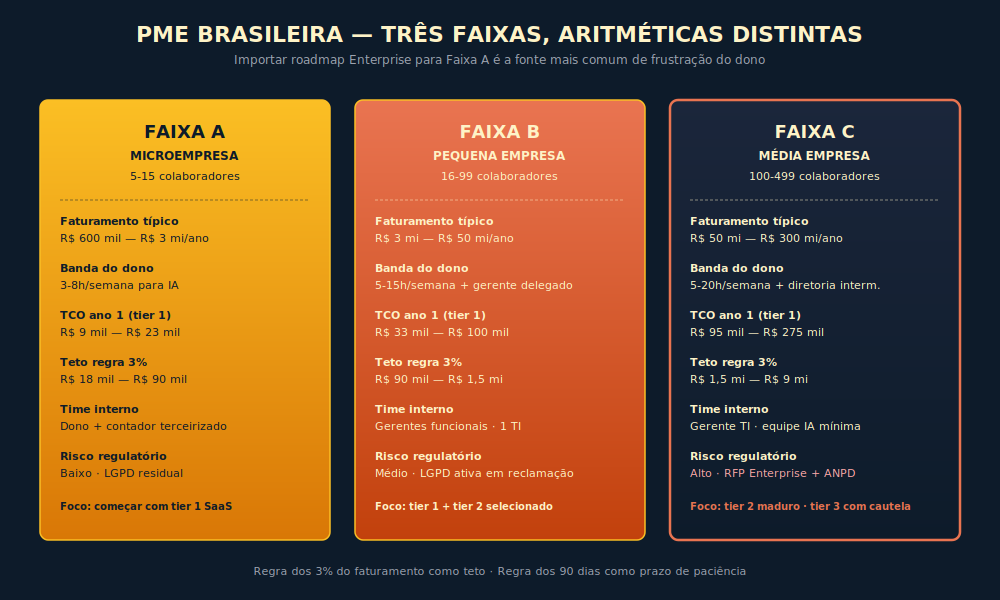

# 27. IA para PME Brasileira
*TCO, consultoria sem armadilha e roadmap de doze meses para quem não tem time de IA*

---

> *"A literatura corrente sobre adoção de IA foi escrita para a empresa que tem CTO, AI engineer, orçamento de seis dígitos em dólar e calendário tranquilo de planejamento, e essa literatura não serve para o dono de indústria de embalagens em Joinville que tem oitenta funcionários, três horas semanais para pensar em IA, medo legítimo do consultor que vende ferramenta, e a obrigação fiscal de fechar mês na quinta-feira; este capítulo escreve para ele."*

---

> **Como usar este capítulo:** Se você tem menos de uma hora, leia nesta ordem: 27.2 (a analogia do contador), 27.3.3 (os três tiers), 27.3.6 (as duas regras), 27.4 (o roadmap de doze meses). Antes de conversar com qualquer consultoria, leia 27.3.4 e 27.3.5. As demais seções — matrix de TCO, faixas de PME, trade-off SaaS vs. build — são referência para usar antes de assinar contrato ou de iniciar a Fase 2.

---

## 27.1 — Conceito intuitivo: por que PME brasileira é caso operacional diferente

A pequena e média empresa brasileira é o agente econômico majoritário do país, com a base de cerca de dezenove milhões de empresas ativas concentrada em microempresas e em pequenas empresas, com a média sendo a fatia menor mas ainda assim significativa, e a operação de cada uma delas tem três características que tornam a adoção de IA caso operacional distinto do caso de Enterprise tratado no resto da obra. A primeira característica é a aritmética da agenda do dono, com a literatura recente sobre microempreendedorismo brasileiro mostrando que o sócio operacional típico tem entre três e quinze horas semanais para o que não é fogo do dia, e que a competição por essa fatia inclui jurídico, fiscal, recursos humanos, comercial, financeiro e relação com cliente difícil, com IA entrando como mais uma demanda que precisa caber ali. A segunda característica é a ausência de time dedicado, com a PME não tendo CTO, AI engineer, head de dados, e em muitos casos nem mesmo o profissional de TI consolidado, e com a contratação de qualquer um desses perfis sendo decisão que muda a estrutura de custo da empresa em proporção que a Enterprise não vivencia. A terceira característica é a regulação a que a PME continua sujeita ainda que com banda reduzida de absorção, com a LGPD aplicável independente do porte, com a regulação setorial (saúde, jurídico, financeiro) aplicável independente do porte, e com o risco regulatório real ainda que a probabilidade de fiscalização por sorteio seja menor do que em Enterprise.

Quem opera PME brasileira sabe que a discussão útil sobre IA não acontece no plano da promessa de transformação ("a IA vai automatizar toda a sua operação"), e sim no plano operacional de cinco decisões duras que se replicam em cada fase de adoção. Em qual processo entrar primeiro, com prioridade definida pelo retorno mensurável em janela curta, não pelo apelo do consultor que vende ferramenta para esse processo. Quanto investir antes de ver resultado mensurável, com teto explícito que protege o caixa de surpresa, com prazo explícito que protege a paciência do dono. Como contratar consultoria sem ser passado para trás, com critério eliminatório que separa consultor sério de consultor que vende ferramenta sob disfarce. Como começar sem time de IA, com tier de adoção que respeita a banda da agenda do dono e dos sócios. Como sair em segurança quando o caminho não funciona, com critério de abandono explícito que evita o sunk cost que paralisa a PME quando o piloto não decolou.

Este capítulo entrega a aritmética dessas decisões, com matriz de TCO de doze meses por faixa de PME, com perguntas eliminatórias para contratação de consultoria, com regra dos três por cento do faturamento como teto de investimento antes de resultado, com regra dos noventa dias como prazo de paciência, com roadmap de doze meses calibrado para o dono que tem três horas semanais e que precisa sobreviver ao mês fiscal. A diferença entre o dono de PME que lê este capítulo com cuidado e o dono que assina contrato de consultoria sem ler é, em vinte e quatro meses, mensurável em caixa preservado, em horas de dono que não foram desperdiçadas, em capacidade de operar IA com método em vez de operar com euforia.

---

## 27.2 — Analogia: a contratação do primeiro contador da empresa, e por que ela explica como contratar consultoria de IA sem armadilha

Pense em como uma PME brasileira contrata o primeiro contador, e perceba que o problema operacional é estruturalmente o mesmo da contratação de consultoria de IA, com lições que migram quase um a um. O contador entra na empresa em momento de assimetria de informação aguda, com o dono não dominando o vocabulário do regime tributário, da escrituração, da obrigação acessória, e com o contador podendo, em má-fé ou em negligência, explorar essa assimetria de duas formas clássicas. Primeira, o contador empurra escopo desnecessário, com obrigação que a empresa não precisa, com regime tributário que beneficia o escritório mas não o cliente, com serviço acessório que infla a fatura sem trazer ganho ao dono. Segunda, o contador esconde transferência de conhecimento, com a operação dele virando caixa-preta para o dono, e com a empresa ficando refém em prazo médio que torna a troca dolorosa.

A PME brasileira que sobreviveu a uma ou duas trocas de contador desenvolveu, ao longo do tempo, um conjunto de critérios que distingue contador sério de contador-armadilha, e esses critérios migram quase intactos para a contratação de consultoria de IA. O contador sério é o que explica o regime tributário em linguagem que o dono entende, o que entrega rotina mensal documentada em ferramenta que o dono acessa, o que aceita ser comparado com proposta de outro escritório sem virar a mesa, o que precifica por trabalho entregue e não por horas vagamente computadas, o que transfere conhecimento ao dono em vez de cultivar dependência. O contador-armadilha é o que se ofende com pergunta sobre regime tributário alternativo, o que mantém escrita em ferramenta que só ele acessa, o que reage ao pedido de proposta concorrente como se fosse traição, o que cobra fee de planilha ininteligível, o que oculta conhecimento como instrumento de retenção.

A analogia tem três lições que organizam o resto do capítulo, e cada uma delas vira critério prático. Primeira lição, a assimetria de informação não some, mas pode ser reduzida com vocabulário básico que o dono adquire em algumas horas de leitura cuidadosa, e este capítulo entrega esse vocabulário no formato que respeita a banda do dono. Segunda lição, a transferência de conhecimento é o sinal mais confiável da consultoria séria, e a operação madura exige transferência registrada em ferramenta que o cliente acessa, com runbook documentado, com treinamento de pelo menos uma pessoa interna que se torna referência mínima após o contrato. Terceira lição, o critério de saída é tão importante quanto o critério de entrada, e o contrato sério inclui cláusula explícita de desengajamento sem fricção, com a empresa podendo, em qualquer momento, encerrar o contrato sem perder o conhecimento que pagou para produzir.

A próxima seção desce ao detalhe técnico das três faixas de PME, da matriz de TCO de doze meses, do tier de adoção, das perguntas eliminatórias para contratação de consultoria, e dos critérios de investimento e de saída que protegem o caixa e a paciência do dono.

---

## 27.3 — Explicação técnica

### 27.3.1 — As três faixas de PME e por que cada uma exige aritmética diferente

A categoria genérica "PME" esconde diferenças operacionais que importam para a aritmética da adoção de IA, e a literatura do SEBRAE e a classificação do BNDES sustentam três faixas que organizam o resto do capítulo, com diferenças relevantes em cada faixa quanto à banda do dono, ao orçamento disponível, à complexidade dos processos e à exposição regulatória.

**Faixa A — Microempresa, cinco a quinze colaboradores.** O dono e um ou dois sócios operacionais cobrem comercial, financeiro, operação e atendimento, com o terceirizado tipicamente sendo contador e, em alguns casos, jurídico ad hoc. O faturamento bruto típico fica entre seiscentos mil e três milhões de reais anuais, com o orçamento de tecnologia (incluindo software de gestão, infraestrutura básica, conta de internet) costumando representar entre meio e dois por cento do faturamento. A banda do dono para IA é a mais apertada das três faixas, com três a oito horas semanais sendo o teto realista, e com a competição contra atividades de fogo sendo a mais intensa. O orçamento disponível para IA em ano um costuma ficar entre seis mil e trinta mil reais, com a regra dos três por cento aplicada sobre faturamento típico produzindo teto entre dezoito mil e noventa mil reais. A exposição regulatória existe (LGPD aplicada a qualquer atendimento ao cliente, regulação setorial específica) mas a probabilidade de fiscalização proativa por sorteio é a menor das três faixas.

**Faixa B — Pequena empresa, dezesseis a noventa e nove colaboradores.** A estrutura interna já comporta gerentes funcionais (comercial, financeiro, operação), com o dono delegando parte da rotina e com a banda do dono se distribuindo entre operação e estratégia. O faturamento bruto típico fica entre três e cinquenta milhões de reais anuais, com o orçamento de tecnologia costumando representar entre um e três por cento do faturamento, e com a empresa frequentemente já tendo profissional de TI dedicado. A banda do dono para IA cresce em comparação à Faixa A, com cinco a quinze horas semanais sendo o teto realista, com possibilidade de delegação parcial a gerente comercial ou financeiro. O orçamento disponível para IA em ano um cresce, com a regra dos três por cento aplicada produzindo teto entre noventa mil e um milhão e quinhentos mil reais. A exposição regulatória cresce, com a empresa entrando em radar de auditoria setorial em alguns casos, e com a LGPD virando preocupação real após primeira reclamação de cliente.

**Faixa C — Média empresa, cem a quatrocentos e noventa e nove colaboradores.** A estrutura interna já comporta diretoria intermediária, com o dono frequentemente operando como CEO e com a empresa tendo, em muitos casos, gerente de TI ou início de área de tecnologia. O faturamento bruto típico fica entre cinquenta e trezentos milhões de reais anuais, com o orçamento de tecnologia costumando representar entre dois e cinco por cento do faturamento. A banda do dono para IA é a maior das três faixas, com cinco a vinte horas semanais sendo realista, e com possibilidade de equipe interna mínima dedicada (uma a três pessoas) em parte do ano. O orçamento disponível para IA em ano um pode chegar a três milhões e meio de reais conforme a empresa e o setor, com a regra dos três por cento produzindo teto entre um milhão e meio e nove milhões. A exposição regulatória é a maior das três, com a empresa frequentemente atendendo clientes Enterprise que exigem postura de fornecedor (resposta a RFP, contrato com cláusula de privacidade, em alguns setores até certificação).

A leitura útil dessas três faixas em operação real é evitar a importação direta do roadmap Enterprise para a PME, e também evitar a importação do roadmap microempresa para a pequena empresa em rota de crescimento. A aritmética da Faixa A é distinta da aritmética da Faixa C, e a confusão entre elas é a fonte mais comum de frustração do dono que assinou contrato calibrado para o porte errado.

### 27.3.2 — A matriz de TCO de doze meses por faixa

A matriz de TCO de doze meses por faixa é a peça central deste capítulo, e a sua leitura honesta antes da decisão de adoção evita a maior parte das surpresas que aparecem em mês oito. O TCO segue o framework F7 do Custo Composto em Três Tempos, com decomposição em custo de aquisição (T1, mês zero ao três), custo recorrente (T2, mês quatro ao doze), e custo de saída (T3, projetado para o cenário em que a adoção não funciona). Para a PME, o T3 importa especialmente porque a probabilidade de a adoção não funcionar na primeira tentativa é estatisticamente alta, e o dono que não orçou T3 descobre o custo de saída no momento em que precisa migrar para outro caminho.

**Faixa A — Microempresa.** Em ano um típico de Faixa A com adoção de IA em tier 1 (uso individual com governança mínima, conforme 27.3.3 detalha), o T1 costuma ficar entre dois mil e oito mil reais (assinatura mensal de ferramenta SaaS, treinamento básico do dono e de um a três colaboradores, redação de política interna mínima), o T2 costuma ficar entre seis mil e quinze mil reais ao longo de nove meses (assinatura SaaS recorrente, consultoria pontual de algumas horas mensais para tirar dúvidas, ajuste de processo), e o T3 projetado para cenário de saída fica entre mil e três mil reais (cancelamento de assinatura, eventual migração de prompt e de conhecimento construído para outra ferramenta). O total de doze meses em cenário de sucesso fica entre nove mil e vinte e três mil reais. Para tier 2 (workflow assistido), o total cresce entre quinze mil e quarenta e cinco mil reais. Para tier 3 (feature embarcada), o total facilmente passa de cem mil reais e na maioria dos casos não cabe na Faixa A.

**Faixa B — Pequena empresa.** Em ano um típico de Faixa B com adoção em tier 1, o T1 costuma ficar entre seis mil e vinte mil reais, o T2 entre vinte e quatro mil e setenta e dois mil reais, o T3 entre três mil e oito mil reais, com total entre trinta e três mil e cem mil reais. Para tier 2, o total fica entre setenta mil e duzentos e cinquenta mil reais conforme o número de workflows assistidos e o nível de consultoria contratada. Para tier 3, o total fica entre trezentos mil e setecentos mil reais, com construção de feature interna que exige consultoria técnica ou contratação de profissional de IA, e essa faixa exige avaliação cuidadosa do Método de Decisão (F1) antes da assinatura.

**Faixa C — Média empresa.** Em ano um típico de Faixa C com adoção em tier 1, o T1 fica entre quinze mil e cinquenta mil reais, o T2 entre setenta mil e duzentos mil reais, o T3 entre dez mil e vinte e cinco mil reais, com total entre noventa e cinco mil e duzentos e setenta e cinco mil reais. Para tier 2, o total fica entre duzentos mil e seiscentos mil reais. Para tier 3, o total fica entre oitocentos mil e três milhões e meio de reais, e nessa faixa a empresa frequentemente caminha para se tornar Enterprise em adoção de IA, com os capítulos do Livro 1 e do Livro 2 voltando a ser aplicáveis em sentido pleno.

A regra prática para o dono de PME é orçar o TCO completo dos doze meses antes da decisão, somando T1, T2 e T3, e comparar o total com o teto definido pela regra dos três por cento do faturamento. Se o TCO completo passa do teto, a decisão sensata é reduzir escopo (tier menor) ou postergar a adoção até que o caixa comporte a aritmética sem comprometer a operação corrente. A pressa do consultor que sugere fechar contrato em janela curta é, com frequência, sinal de que a aritmética não vai sobreviver ao orçamento honesto.

### 27.3.3 — Os três tiers de adoção de IA na PME: começando sem time de IA

Antes de descer aos três tiers, uma distinção que evita confusão frequente. **Automação de regra fixa** (Zapier, Power Automate, RPA tradicional) executa instruções determinísticas sem julgamento: se o e-mail tem "nota fiscal" no assunto, mova para a pasta X. Não há compreensão, só regra. **Workflow assistido por IA generativa** executa julgamento em linguagem natural sobre inputs não estruturados — classifica o e-mail lendo o conteúdo real, mesmo quando o assunto não segue padrão fixo — e inclui revisão humana em ponto de controle. Os tiers deste capítulo tratam de IA generativa, não de automação de regra fixa; a aritmética de TCO e o prazo de noventa dias não se aplicam a projetos de RPA, que têm custo e lógica distintos.

A literatura corrente sobre adoção de IA assume que a empresa tem alguém que pode "construir agente", "operar fine-tuning", "instrumentar RAG", e essa assumpção esquece que a PME brasileira majoritária não tem esse alguém, e que a adoção precisa começar com tier que respeita a ausência de time técnico. A divisão útil para PME, sustentada por padrões observados em adoções bem-sucedidas entre 2024 e 2026, organiza três tiers de adoção em complexidade crescente.

**Tier 1 — Uso individual com governança mínima.** O dono e os colaboradores usam ferramenta SaaS pronta (Claude, ChatGPT, Gemini, conforme escolha) em fluxo individual, com política interna mínima (uma página de política de uso aceitável, definindo o que pode e o que não pode ser colado no chat, regra de não compartilhar dado sensível de cliente, regra de revisão humana antes de envio externo). Os casos de uso típicos são redação de e-mail e proposta comercial, primeiro rascunho de documento jurídico básico, sumarização de reunião, brainstorm de campanha de marketing, pesquisa de mercado em busca exploratória. O ganho é real e mensurável, com a literatura observacional indicando ganho de produtividade entre quinze e trinta por cento em tarefas cobertas pelo tier, e com o custo total ficando dentro do teto de Faixa A. A operação não exige time técnico, exige política mínima e treinamento básico (duas a quatro horas por colaborador no primeiro mês), e é o tier de entrada recomendado para cem por cento das PMEs que ainda não operam IA com método.

**Tier 2 — Workflow assistido.** A PME identifica processo específico em que a IA conduz fluxo estruturado (não apenas conversa livre), com ferramenta configurada para o processo, com inputs e outputs definidos, e com revisão humana em pontos de controle. Os casos de uso típicos para PME brasileira são triagem de currículo em recrutamento, classificação de ticket de atendimento, redação assistida de cotação comercial, conferência de documento fiscal, primeiro passe de revisão jurídica de contrato padrão, classificação de pedido de compra por categoria. A operação exige configuração inicial (cerca de cinco a vinte horas de trabalho de quem configura, que pode ser consultoria contratada ou profissional interno com afinidade técnica), exige integração com ferramenta já em uso (planilha, CRM, sistema de gestão), exige revisão humana definida em ponto crítico do fluxo. O tier 2 é o passo natural após seis a nove meses de operação madura em tier 1, com a PME tendo identificado os processos em que o ganho de tier 1 é maior, e querendo aprofundar nesses processos sem ainda construir feature embarcada.

**Tier 3 — Feature embarcada no produto.** A PME que tem produto digital próprio (software, e-commerce, plataforma) integra IA como feature do produto, com uso voltado ao cliente final ou à operação interna do produto. Os casos típicos são assistente do cliente dentro do produto, recomendação personalizada, classificação automática de demanda. A operação exige profissional técnico (desenvolvedor com afinidade em IA, ou consultoria técnica especializada), exige orçamento de API e de infraestrutura, exige instrumentação mínima de tracing e de eval, exige integração ao Caderno de Governança da empresa em formato adequado ao porte. O tier 3 é o passo apropriado quando a PME já maturou tier 2 em pelo menos dois processos e quando o caso de uso embarcado tem ROI projetado que justifica o investimento, conforme o Método de Decisão (F1) calibrado para a aritmética da PME. A decisão prematura de pular do tier 1 direto para o tier 3 é a fonte mais comum de fracasso de adoção em PME brasileira, com o caixa queimado em projeto que excedeu prazo e orçamento, e com o dono concluindo erroneamente que "IA não é para a minha empresa" quando o problema era de calibração de tier.

### 27.3.4 — Oito perguntas eliminatórias para contratação de consultoria de IA

A contratação de consultoria de IA é, hoje, o ponto de maior risco financeiro e operacional da adoção em PME brasileira, e a literatura do SEBRAE sobre contratação de consultoria, somada à experiência observada de PMEs que sobreviveram a más contratações, sustenta uma lista de oito perguntas eliminatórias que separam consultor sério de consultor que vende ferramenta sob disfarce. A regra prática é fazer as oito perguntas no primeiro encontro, e considerar resposta vaga ou defensiva em qualquer uma delas como sinal de alerta que justifica não fechar contrato com aquele fornecedor.

**Pergunta um.** Qual é o KPI mensurável que o projeto vai entregar em noventa dias, com baseline atual da empresa e meta numérica para o fim do trimestre? Resposta séria: KPI específico (tempo médio de processamento de pedido, redução de erro em conferência fiscal, NPS de atendimento) com baseline medido e meta declarada. Resposta de armadilha: "vamos transformar a sua operação", "vai depender do diagnóstico", "o ROI aparece depois".

**Pergunta dois.** Qual é o entregável documentado em formato que o cliente acessa sem depender do consultor após o fim do contrato? Resposta séria: runbook escrito, política de uso documentada em ferramenta da empresa, treinamento de pelo menos uma pessoa interna gravado e disponível, configuração de ferramenta com acesso administrativo do cliente. Resposta de armadilha: "tudo fica no nosso ambiente", "o conhecimento está na consultoria", "depois do projeto a gente continua mantendo".

**Pergunta três.** Qual é a sua experiência específica com empresa do meu setor e do meu porte? Resposta séria: pelo menos dois casos com descrição do problema, da solução e do resultado, com referência de cliente disposto a falar. Resposta de armadilha: "nossa metodologia se adapta a qualquer setor", silêncio sobre porte ou referência genérica de Enterprise que não cabe na PME.

**Pergunta quatro.** O contrato inclui cláusula de transferência de conhecimento, com treinamento de pelo menos uma pessoa da empresa que se torna referência mínima, e com a saída do contrato podendo acontecer sem que a empresa perca acesso ao que pagou para produzir? Resposta séria: cláusula explícita, com horas de treinamento dimensionadas, com material acessível em ferramenta do cliente. Resposta de armadilha: tergiversação, oferta de "consultoria continuada" como substituto à transferência, contrato em letra que esconde dependência.

**Pergunta cinco.** Como o seu fee é calculado, e quanto disso é fixo, quanto é variável por entregável, quanto é por hora consultada? Resposta séria: composição clara, com valor por entregável dominante, com horas consultadas como variável menor, com teto contratualizado. Resposta de armadilha: "depende do escopo", "horas a definir", "o investimento total se resolve durante o projeto".

**Pergunta seis.** Você vende, de forma direta ou indireta, alguma ferramenta de software que o projeto vai recomendar como parte da solução? Resposta séria: declaração honesta da relação (comissão de parceria, revenda, white label), com escolha da ferramenta justificada por critério técnico, com a empresa cliente podendo escolher ferramenta diferente sem que isso quebre o projeto. Resposta de armadilha: negação inicial seguida de revelação tarde, ou justificativa frágil de "a ferramenta X é a melhor" sem comparativo.

**Pergunta sete.** Qual é o seu critério de saída, e em qual cenário você recomendaria que a empresa abandonasse o projeto antes do fim do contrato? Resposta séria: cenários explícitos (KPI não atingido em janela definida, sinal de que o caso de uso não comporta IA, mudança de prioridade do cliente) com gatilho de revisão contratualizado. Resposta de armadilha: "isso não vai acontecer", "nosso método sempre funciona", desconforto com a pergunta.

**Pergunta oito.** Qual é a sua postura sobre LGPD, sobre segurança da informação e sobre a regulação setorial específica do meu setor? Resposta séria: leitura corrente da LGPD aplicada à arquitetura proposta, atenção à regulação setorial, indicação de quando convém envolver assessor jurídico do cliente. Resposta de armadilha: minimização do risco regulatório, "não vai dar problema", confusão entre LGPD e GDPR sem domínio do regime brasileiro.

### 27.3.5 — Cinco sinais de armadilha de consultoria mal-intencionada

Além das oito perguntas, cinco sinais comportamentais separam consultoria séria de armadilha, e a sua presença em qualquer combinação justifica descartar o fornecedor antes do fechamento. Sinal um, pressa para fechar contrato em janela curta, com argumento de "preço promocional", "vaga limitada" ou "agenda lotando", em desconforto explícito quando o cliente pede prazo para avaliar concorrente. Sinal dois, recusa em apresentar proposta escrita com detalhamento de entregáveis, de horas, de fee, com tudo sendo "alinhado em conversa" e contrato chegando no fim do processo como formalidade. Sinal três, ausência de KPI mensurável, com a proposta sendo construída sobre promessa de transformação genérica, sem baseline definido nem meta numérica. Sinal quatro, conexão dúbia com fornecedor de ferramenta, com o consultor sendo, de fato, vendedor disfarçado, com a ferramenta sendo a solução pré-fabricada que o projeto vai instalar independentemente do diagnóstico. Sinal cinco, postura de "santuário do conhecimento", com o consultor evitando documentação acessível ao cliente, evitando treinamento de pessoa interna, cultivando a dependência como modelo de negócio recorrente.

A regra de bolso é dura, e merece transcrição. *Consultoria séria de IA entrega capacidade interna ao cliente em prazo definido, e a ausência dessa entrega é, por construção, sinal de armadilha. O dono de PME que assina contrato em que o conhecimento mora exclusivamente no consultor está, na prática, alugando dependência por tempo indefinido, e o caixa da empresa vai pagar por isso até o ponto em que a empresa não comportar mais.*

### 27.3.6 — Regra dos três por cento do faturamento e regra dos noventa dias

Duas regras quantitativas organizam o orçamento e a paciência do dono de PME, e a sua aplicação honesta protege o caixa e a operação corrente da empresa. Regra um, o teto de três por cento do faturamento bruto anual como limite máximo de investimento em IA em ano um, antes de resultado mensurável validado. Esta regra não é derivada de estudo estatístico rigoroso — é heurística conservadora baseada em observação de casos de adoção em PME entre 2024 e 2026, calibrada para que o investimento caiba no orçamento de tecnologia sem comprometer a operação corrente. Trate-a como piso de prudência, não como prescrição científica. A sua aplicação cobre a soma de T1, T2 e T3 do TCO de doze meses. Em casos específicos (PME em setor com vantagem competitiva clara de IA, PME em fase de captação que orça IA como parte da rodada), o teto pode subir até cinco por cento, mas a regra geral é três por cento como piso de prudência. Regra dois, o prazo de noventa dias como janela de paciência antes de exigir resultado mensurável validado em métrica predefinida. A janela é calibrada contra a tendência da PME a postergar a avaliação ("vamos dar mais tempo", "está quase saindo do papel") e a dar passe livre ao consultor que não entrega, e a sua aplicação rígida exige que, ao fim de noventa dias, a empresa avalie o KPI definido no fechamento do contrato (pergunta um da seção 27.3.4) e decida por continuar, ajustar ou encerrar.

A combinação das duas regras (teto de três por cento, prazo de noventa dias) é o instrumento de disciplina financeira e de paciência calibrada que separa o dono de PME que opera IA com método do dono que opera com euforia. A regra não substitui o Método de Decisão (F1) calibrado para a aritmética da PME, mas é o piso quantitativo que sustenta a aplicação do método na prática.

### 27.3.7 — Trade-off entre SaaS pronta, build interno e híbrido para PME

A decisão entre SaaS pronta, build interno e arquitetura híbrida é, na PME brasileira, decisão que precisa ser calibrada para a aritmética do porte, e a regra padrão é que SaaS pronta domina nas Faixas A e B, build interno é raro em qualquer faixa, e híbrido aparece na Faixa B avançada e na Faixa C. **SaaS pronta** tem três virtudes para a PME, com escala que o porte não justifica construir, com manutenção contínua absorvida pelo fornecedor, com curva de aprendizado curta para o dono e os colaboradores. As limitações são duas, com customização limitada a parâmetros que o fornecedor expõe, com dependência do fornecedor para roadmap. A regra prática é tratar SaaS pronta como default em PME, com avaliação de fornecedor por critério padrão (LGPD, segurança da informação, posição no mercado, custo previsível, qualidade de suporte). **Build interno** raramente compensa em PME, com o custo de construção excedendo, em quase todos os casos, o custo de assinar SaaS de mercado, e com o custo de manutenção sendo passivo permanente que a PME não tem como absorver. A decisão de build só faz sentido em casos específicos (PME que é desenvolvedora de software e que tem time técnico, PME em setor com requisito regulatório que SaaS de mercado não atende), e a justificativa precisa estar registrada com leitura crítica do Método de Decisão (F1). **Híbrido**, em que a PME usa SaaS pronta no core e constrói camada fina de integração ou de feature, aparece na Faixa B avançada e na Faixa C, com a camada interna sendo o que justifica a contratação de profissional técnico ou de consultoria de tier 2 e tier 3.

A regra final para o dono de PME é resistir à pressão do consultor que vende build customizado prematuro, e exigir defesa explícita da decisão de não usar SaaS pronta, com aritmética do TCO de doze meses comparando as duas opções de forma honesta.

---

## 27.4 — Roadmap de doze meses para CEO de PME que não tem time de IA

O roadmap de doze meses, calibrado para a aritmética da PME e para a banda do dono, organiza a adoção em três fases de quatro meses, com cada fase tendo objetivo, orçamento de tempo e orçamento financeiro, critério de avanço e critério de abandono.

**Fase 1 — Mês 1 ao 3 — Uso individual em tier 1 com governança mínima.** O objetivo é instalar uso individual de ferramenta SaaS pronta pelo dono e por dois a cinco colaboradores escolhidos por afinidade com IA ou por posição em processo com ganho potencial alto (comercial, marketing, financeiro). As horas estimadas do dono são duas a quatro semanais (treinamento próprio, redação de política mínima, observação do uso da equipe). O orçamento da fase fica entre dois mil e dez mil reais para Faixa A, entre cinco mil e vinte mil reais para Faixa B, entre dez mil e cinquenta mil reais para Faixa C. O entregável é política de uso aceitável escrita (uma página), treinamento básico documentado, primeira amostra de tarefas em que a IA foi usada com revisão humana e com leitura de ganho real. O critério de avanço para a Fase 2 é uso recorrente por pelo menos três pessoas durante quatro semanas consecutivas, com ganho mensurável em pelo menos uma tarefa (tempo reduzido, qualidade percebida pelo cliente, redução de erro). O critério de abandono é uso esporádico após oito semanas, com a empresa não conseguindo incorporar a ferramenta ao fluxo, sinal de que tier 1 não está sendo absorvido e que precisa de revisão (treinamento adicional, ajuste de política, mudança de ferramenta) antes de pensar em tier 2.

**Fase 2 — Mês 4 ao 6 — Identificação de processo para workflow assistido em tier 2.** O objetivo é identificar um a dois processos em que tier 2 traria ganho mensurável superior ao tier 1, com diagnóstico participativo da equipe que opera em tier 1 desde a Fase 1. As horas estimadas do dono são três a seis semanais (mesa de identificação, revisão de proposta de configuração, acompanhamento de piloto). O orçamento da fase fica entre cinco mil e vinte mil reais para Faixa A, entre quinze mil e cinquenta mil reais para Faixa B, entre trinta mil e cento e vinte mil reais para Faixa C. O entregável é um a dois workflows configurados, em piloto com fatia controlada do processo, com KPI definido e medido. O critério de avanço para a Fase 3 é ganho mensurável em pelo menos um workflow após oito semanas de operação, com decisão de expansão ou de novo workflow. O critério de abandono é ausência de ganho em ambos os workflows após oito semanas, sinal de que os processos escolhidos não comportam tier 2 ou de que a configuração foi inadequada, com retorno à Fase 1 expandida em mais processos.

**Fase 3 — Mês 7 ao 12 — Expansão de tier 2 e avaliação de tier 3.** O objetivo é expandir tier 2 para três a cinco workflows recorrentes e avaliar, com Método de Decisão (F1) calibrado para a PME, se algum caso de uso justifica tier 3 (feature embarcada). As horas estimadas do dono são três a cinco semanais. O orçamento da fase fica entre quinze mil e cinquenta mil reais para Faixa A, entre cinquenta mil e cento e oitenta mil reais para Faixa B, entre cento e cinquenta mil reais e quinhentos mil reais para Faixa C. O entregável é três a cinco workflows estáveis em produção, com KPI de cada um medido mensalmente, com primeira decisão sobre tier 3 documentada (favor ou contra, com justificativa). O critério de continuidade para ano dois é ganho consolidado em tier 2 e decisão clara sobre tier 3 (se favor, com plano de execução em ano dois; se contra, com plano de aprofundamento em tier 2). O critério de abandono é ausência de consolidação em tier 2 após doze meses, sinal de que a empresa, no momento atual, opera melhor sem ambição de tier 3, e a recomendação é manter tier 1 e tier 2 maduros como prática estável, sem investir em tier 3 enquanto a Fase 2 não estabilizar.

A regra inegociável do roadmap é que nenhuma fase é iniciada sem o critério de avanço da fase anterior atingido, sob pena de o investimento crescer sem base sólida, e que o critério de abandono é instrumento de replanejamento honesto, não desistência. A PME que aplica o roadmap com disciplina e calibra o orçamento contra o teto dos três por cento sai do ano um com prática de IA estável, com aritmética conhecida e com decisão fundamentada sobre o ano dois.

---

## 27.5 — Exemplo memorável

> ⚠️ **Cenário composto a partir de padrões observados** — composição realista de indústria de embalagens em Joinville com oitenta funcionários e adoção estruturada de IA entre 2024 e 2026; números são críveis ao setor, não identificam organização específica.

Indústria de embalagens plásticas em Joinville, oitenta funcionários, faturamento bruto anual de cerca de vinte e dois milhões de reais, dono de cinquenta e oito anos com trinta e dois anos de empresa, sócia minoritária que é a filha de trinta e dois anos com formação em administração e que conduz comercial e marketing, gerente administrativo-financeiro de quarenta e cinco anos com onze anos na empresa, gerente de produção de cinquenta e três anos com dezessete anos na empresa, contador externo. Em janeiro de 2025, o dono recebe três visitas em quinze dias de consultorias que vendem "transformação digital com IA generativa", com proposta de projeto entre duzentos e quinhentos mil reais, e com cronograma de seis a nove meses para "agente inteligente que automatiza a gestão da indústria". A filha lê o livro do qual este capítulo faz parte, conduz mesa interna com o pai, com o gerente administrativo e com o gerente de produção, e propõe roadmap calibrado contra a aritmética real da empresa.

A primeira decisão é a aritmética. O faturamento da empresa, vinte e dois milhões, com teto de três por cento, produz envelope de até seiscentos e sessenta mil reais ao ano. As três propostas de consultoria, ao serem submetidas às oito perguntas eliminatórias de 27.3.4, falham em pelo menos cinco perguntas cada, com a pergunta seis (relação com fornecedor de ferramenta) revelando que duas das três consultorias eram, de fato, revenda de software com camada superficial de implantação, e com a pergunta quatro (transferência de conhecimento) recebendo respostas evasivas em todas as três. A filha apresenta o resultado em mesa, e o dono decide descartar as três propostas e seguir com adoção de tier 1 conduzida internamente, com consultoria pontual apenas se necessária em fase posterior.

A Fase 1 começa em fevereiro de 2025. A filha redige política de uso aceitável em uma página, definindo o que pode ser colado em ferramenta de IA pública (descrição de problema, texto público de fornecedor, e-mail rascunho a cliente) e o que não pode (dado fiscal específico de cliente, dado de funcionário sob LGPD, fórmula de composição química do produto que é segredo industrial). A política é apresentada em reunião de meia hora com os quinze colaboradores que trabalham com computador, com perguntas e ajustes, e é assinada por todos. A ferramenta escolhida é assinatura corporativa de Claude para o dono, para a filha, para o gerente administrativo, para o gerente de produção e para três colaboradores administrativos, em custo total mensal que, na época do cenário, ficava em torno de mil e quatrocentos reais — verifique o preço corrente no site do fornecedor antes de orçar, pois preços de assinatura corporativa de IA mudam com frequência. O treinamento básico ocupa quatro horas por colaborador no primeiro mês, conduzido pela filha e pelo gerente administrativo, com base em material acessível no canal do YouTube de criadores brasileiros de conteúdo sobre IA.

No fim do mês três, a leitura de ganho de tier 1 é clara em três frentes. O gerente administrativo reduz o tempo de redação de cotação comercial de cerca de quarenta minutos para cerca de quinze minutos, com primeiro rascunho gerado por Claude e revisão final humana. O dono usa Claude para preparar reunião com cliente importante e com fornecedor estrangeiro, com tempo de preparação reduzido em cerca de cinquenta por cento e com a sensação subjetiva, validada em conversa com a filha, de chegar mais bem preparado. A filha usa Claude para análise de portfólio de produto e para textos de marketing, com ganho percebido em qualidade dos textos publicados. O orçamento da Fase 1 fechou em cerca de oito mil reais (três meses de assinatura, treinamento interno, tempo do gerente administrativo na configuração), bem abaixo do teto inicial estimado.

A Fase 2 começa em maio de 2025, com mesa de identificação de processos para tier 2. A filha e o gerente administrativo propõem dois processos. Processo um, classificação automática de pedido de compra recebido por e-mail, em que a fornecedora de matéria-prima envia em cerca de cento e vinte e-mails mensais com formatos variados e o time leva cerca de dez minutos por e-mail para classificar e registrar. Processo dois, primeiro passe de revisão de contrato fiscal com cliente novo, em que o gerente administrativo leva cerca de quarenta minutos por contrato para identificar cláusulas atípicas e em que a empresa fecha cerca de seis contratos novos mensais. A configuração dos dois workflows é conduzida pelo gerente administrativo com apoio de consultoria pontual contratada (oito horas a oitocentos reais por hora à época do cenário — o valor de mercado varia por região e especialização; peça orçamento atualizado antes de contratar, com total que no caso ficou em seis mil e quatrocentos reais), com integração ao e-mail corporativo no processo um e com fluxo manual no processo dois (gerente cola o contrato no Claude com prompt estruturado e revisa a saída). Após oito semanas de piloto, o processo um reduz o tempo médio de classificação de dez para três minutos, com taxa de erro abaixo de cinco por cento validada por amostragem do gerente. O processo dois reduz o tempo médio de primeiro passe de quarenta para doze minutos, com identificação de cláusulas atípicas validada pelo gerente em todos os casos do piloto. O orçamento da Fase 2 fechou em cerca de dezoito mil reais.

A Fase 3 começa em agosto de 2025. A empresa expande tier 2 para mais três processos (triagem de currículo em recrutamento, redação assistida de resposta a reclamação de cliente, conferência de nota fiscal contra pedido), com configuração conduzida internamente pelo gerente administrativo e pela filha, com apoio de consultoria pontual em cerca de doze horas no trimestre. O tier 3 é avaliado em mesa com o gerente de produção, com a hipótese de feature embarcada em sistema interno de gestão de pedido de cliente, e a decisão final é negativa, com justificativa de que o ROI projetado (cerca de trezentos mil reais de investimento contra ganho marginal incremental ao que tier 2 já entrega) não justifica a fila de prioridades atual da empresa, e com plano de reavaliar em doze meses. O orçamento da Fase 3 fechou em cerca de trinta mil reais.

O ROI consolidado em sete meses, conforme apurado pela filha em planilha simples submetida ao pai, é de cerca de duzentos e dez mil reais em produtividade liberada, calculados como soma do tempo economizado pelas cinco frentes em tier 2 multiplicado pelo custo médio por hora dos colaboradores envolvidos, contra investimento total acumulado de cerca de cinquenta e seis mil reais. O ROI não é livre de ressalva, com a filha sendo cuidadosa em registrar três ressalvas explícitas. Primeira, parte do tempo economizado virou capacidade para tarefas que antes não eram feitas (acompanhamento mais próximo de cliente, revisão mais cuidadosa de contrato) em vez de redução de quadro, e o ganho real é combinação de produtividade e qualidade. Segunda, o custo de oportunidade do tempo de gestão alocado ao projeto — horas do dono, da filha e do gerente administrativo dedicadas à condução do projeto — não está incluído no denominador acima; com esse custo incluído, o ROI líquido seria menor e ainda positivo, mas o cálculo honesto exige esse ajuste. Terceira, o baseline de produção foi estimado, não medido com instrumento formal antes da Fase 1, o que introduz incerteza na medição do ganho; a lição para quem replica o caso é medir o baseline de pelo menos uma tarefa antes de iniciar o uso de IA, conforme o checklist do capítulo recomenda.

A lição estrutural do caso, registrada em ata da mesa de diretoria e compartilhada com associação setorial em palestra do dono em fórum local em novembro de 2025, é dura e merece transcrição. *A pressa de assinar projeto de IA com consultoria que vende ferramenta é o caminho mais curto para queimar caixa que a PME não tem como repor. O método que protege é a aritmética honesta do TCO, a paciência calibrada de noventa dias por fase, a regra dos três por cento do faturamento como teto, e a coragem de descartar as três primeiras propostas que falham nas oito perguntas. A IA serve à PME brasileira quando ela respeita a banda do dono, o caixa da empresa e o tempo de absorção real do time, e não serve quando o consultor empurra o roadmap Enterprise no porte errado.*

> 🎯 **PARA DONOS DE PME**
> Faça três perguntas duras a você mesmo nesta semana. (1) Qual é o teto de três por cento do meu faturamento bruto, e em quanto isso traduz o envelope que protege o meu caixa em ano um? (2) Quais das oito perguntas eliminatórias eu fiz na última conversa com consultor de IA, e quantas respostas evasivas eu aceitei sem desconforto? (3) Qual processo da minha empresa cabe em tier 1 com revisão humana esta semana, e em quanto tempo eu posso medir o primeiro ganho?

---

## 27.6 — Conexões com outros capítulos

- 🔗 **Método de Decisão para Adotar IA** calibrado para a aritmética da PME → Framework F1
- 🔗 **Open source como caminho de custo para PME**, com DeepSeek e modelos abertos servindo casos de tier 2 e tier 3 em escala compatível com PME → Cap 16
- 🔗 **Custo Composto em Três Tempos (F7)** como instrumento operacional do TCO → Cap 18
- 🔗 **Roadmap pessoal por persona** que oferece personas específicas para o dono de PME (Founder, Executivo, Gestor) → Cap 26
- 🔗 **Segurança em camadas** aplicada em escala compatível com a PME, com LGPD como linha de base e SaaS pronta absorvendo parte da arquitetura → Cap 19
- 🔗 **Governança proporcional ao porte**, com política de uso aceitável como peça inicial e Caderno de Governança simplificado para PME → Cap 24

---

## 27.7 — Resumo executivo

| Conceito | Síntese |
|----------|---------|
| **Por que PME é caso diferente** | Banda do dono de 3 a 15 horas semanais, sem time de IA, orçamento limitado, regulação aplicável independente do porte |
| **Três faixas de PME** | Faixa A (5-15 colaboradores), Faixa B (16-99), Faixa C (100-499), com aritmética distinta em cada |
| **Matriz de TCO 12 meses** | T1 + T2 + T3 por faixa, com totais variando de R$ 9 mil (Faixa A tier 1) a R$ 3,5 milhões (Faixa C tier 3) |
| **Três tiers de adoção** | Tier 1 (uso individual), Tier 2 (workflow assistido), Tier 3 (feature embarcada); pulo prematuro é a falha mais comum |
| **8 perguntas eliminatórias** | KPI mensurável, entregável documentado, experiência setorial, transferência de conhecimento, composição do fee, relação com fornecedor, critério de saída, postura LGPD |
| **5 sinais de armadilha** | Pressa para fechar, ausência de proposta escrita, ausência de KPI, conexão dúbia com ferramenta, santuário do conhecimento |
| **Regra dos 3% do faturamento** | Teto de investimento em ano um antes de resultado validado, soma de T1, T2 e T3 |
| **Regra dos 90 dias** | Janela de paciência antes de exigir resultado mensurável validado em KPI predefinido |
| **SaaS × build × híbrido** | SaaS domina Faixas A e B, build raramente compensa em PME, híbrido aparece em Faixa B avançada e Faixa C |
| **Roadmap 12 meses** | Mês 1-3 tier 1, mês 4-6 tier 2 piloto, mês 7-12 expansão de tier 2 e avaliação de tier 3 |

---

## 27.8 — Checklist do capítulo

- [ ] Classificar a PME na faixa correta (A, B ou C) por número de colaboradores e por faturamento bruto
- [ ] Calcular o teto de três por cento do faturamento como envelope máximo de investimento em ano um
- [ ] Construir matriz de TCO de doze meses para o tier escolhido, somando T1, T2 e T3
- [ ] Redigir política de uso aceitável em uma página, com regra explícita sobre dado sensível e revisão humana
- [ ] Aplicar as oito perguntas eliminatórias antes de qualquer fechamento de contrato com consultoria
- [ ] Identificar os cinco sinais de armadilha em propostas recebidas, e descartar fornecedores que apresentam combinação preocupante
- [ ] Iniciar Fase 1 (tier 1 individual) com dono e dois a cinco colaboradores, com treinamento básico
- [ ] Medir baseline de pelo menos uma tarefa antes de iniciar uso de IA, para sustentar leitura de ganho
- [ ] Marcar revisão de noventa dias no calendário, com pauta de avaliação do KPI definido
- [ ] Identificar gerente interno ou colaborador com afinidade técnica que será referência mínima do projeto
- [ ] Resistir à pressão para pular do tier 1 direto para o tier 3, e exigir consolidação de tier 2 antes
- [ ] Conectar com o Framework F1 (Método de Decisão) e o Cap 26 (Roadmap por persona) para validar a coerência da escolha

---

## 27.9 — Perguntas de revisão

1. Por que a PME brasileira é caso operacional distinto do Enterprise, e quais são as três características que organizam a aritmética da adoção?
2. Como a matriz de TCO de doze meses muda da Faixa A para a Faixa C, e por que o T3 (custo de saída) importa especialmente para a PME?
3. Quais são os três tiers de adoção, e por que o pulo prematuro do tier 1 para o tier 3 é a falha mais comum em PME?
4. Quais são as oito perguntas eliminatórias para contratação de consultoria de IA, e quais respostas separam consultor sério de armadilha?
5. Por que a regra dos três por cento do faturamento e a regra dos noventa dias funcionam juntas como instrumento de disciplina, e o que cada uma protege isoladamente?
6. Em qual situação build interno faz sentido para PME, e qual é a regra padrão de defesa de SaaS pronta?
7. Como o roadmap de doze meses se calibra para a banda real do dono, e qual é o critério de abandono de cada fase?
8. Como o Cap 27 se amarra ao Framework F1 (Decisão), ao Cap 18 (Economia de tokens), ao Cap 26 (Roadmap pessoal) e ao Cap 24 (Governança) em sistema integrado de adoção?

---

## 27.10 — Exercícios práticos

**Exercício 1 — Matriz de TCO da sua PME.** Em folha em branco, construa a matriz de TCO de doze meses para o tier de adoção que você considera realista para o porte e o momento da empresa, somando T1, T2 e T3 com valores defensáveis. Compare o total com o teto de três por cento do faturamento bruto e identifique se o cenário cabe no envelope ou se exige ajuste de tier.

**Exercício 2 — Lista de oito perguntas adaptada ao seu setor.** Adapte as oito perguntas eliminatórias da seção 27.3.4 para o seu setor específico, com ajuste de vocabulário, com inclusão de pergunta setorial (regulação específica, NR, conselho de classe) e com critério de pass/fail para cada pergunta. O entregável é a sua lista personalizada, salva em ferramenta acessível antes da próxima conversa com consultoria.

**Exercício 3 — Política de uso aceitável em uma página.** Redija, em uma página, a política de uso aceitável da sua empresa para ferramenta de IA, definindo o que pode ser colado, o que não pode, qual é a regra de revisão humana, qual é o procedimento em caso de dúvida. Apresente em reunião curta para o time afetado e colete assinatura.

**Exercício 4 — Diário de noventa dias do dono.** Marque no calendário a revisão de noventa dias após o início da Fase 1, com pauta de avaliação do KPI definido, com comparação ao baseline, com decisão sobre seguir, ajustar ou encerrar. Em cada um dos noventa dias, registre em diário simples (cinco minutos por dia) o que você usou de IA, o que ganhou, o que não funcionou, com leitura honesta no fim do período.

---

## 27.11 — Projeto do capítulo

**Construir o Caderno de Adoção de IA para PME v0.** Entregável em três a cinco páginas, no formato adaptado à realidade da empresa, sem jargão Enterprise. Conteúdo:

1. Faixa da PME identificada (A, B ou C) com número de colaboradores e faturamento bruto.
2. Tier de entrada escolhido (1 na quase totalidade dos casos) com justificativa.
3. Matriz de TCO de doze meses, com T1, T2 e T3 detalhados.
4. Política de uso aceitável em uma página, assinada por todos os colaboradores afetados.
5. Lista interna de fornecedores avaliados, com nota nas oito perguntas eliminatórias e com decisão de seguir ou descartar.
6. Calendário das três fases do roadmap, com KPI definido em cada fase e com revisão de noventa dias marcada.
7. Identificação do gerente interno ou colaborador que será referência mínima do projeto.
8. Critério de saída em cada fase, com gatilho explícito de revisão ou encerramento.

**Critério de qualidade.** Outro dono de PME, sem contexto, lê o caderno e responde sem ambiguidade às perguntas: "qual tier essa empresa adotou e por quê?", "qual é o orçamento total de doze meses e o que ele cobre?", "como essa empresa avalia se a IA está dando retorno?".

---

## 27.12 — Referências principais

📚 **Sobre PME brasileira e adoção de tecnologia**
- SEBRAE. Estudos sobre transformação digital em micro e pequena empresa (relatórios anuais com versões atualizadas).
- BNDES. Classificação de porte de empresa e relatórios setoriais sobre adoção de IA em PME (versões atualizadas).
- IBGE. *Demografia das Empresas* (relatórios anuais com base estatística da PME brasileira).
- Confederação Nacional da Indústria. Relatórios sobre adoção de IA em indústria de pequeno e médio porte (a partir de 2024).

📚 **Sobre TCO e decisão de adoção**
- Gartner. *Total Cost of Ownership* (metodologia clássica adaptada para SaaS e IA generativa em relatórios a partir de 2023).
- Christensen, C. *The Innovator's Dilemma* (1997) — base para entender adoção disruptiva sob restrição de recurso.
- Drucker, P. *Management* (1973, com edições posteriores) — fundamentos de decisão executiva em pequena e média empresa.

📚 **Sobre regulação aplicada à PME**
- LGPD (Lei 13.709/2018) e Notas Técnicas da ANPD (versão corrente verificável em fonte oficial)
- Marco Legal da IA no Brasil (PL 2338/2023 ou legislação resultante — status em tramitação na data de fechamento desta edição; verifique situação atual em fonte oficial antes de citar em contexto regulatório, conforme Apêndice J — Trilha do Número)
- Resoluções de conselhos de classe aplicáveis ao setor (CFM, OAB, CRC, CRA, conforme aplicável)

📚 **Sobre contratação de consultoria**
- SEBRAE. Cartilhas sobre contratação de consultoria empresarial (versões atualizadas).
- Maister, D. *Managing the Professional Service Firm* (1993, com edições posteriores) — base para leitura crítica de consultoria.

📚 **Inteligência Aumentada — sistema da obra**
- Manifesto dos Invariantes — Introdução
- Framework F1 — Método de Decisão para Adotar IA (alimenta a decisão de tier e de processo)
- Cap. 16 — Modelos open source (oferece caminho de custo para PME em tier 2 e tier 3)
- Cap. 18 — Economia de tokens (sustenta o T2 da matriz de TCO)
- Cap. 26 — Roadmap pessoal por persona (oferece persona Founder e Executivo aplicáveis ao dono de PME)
- Apêndice O — Caderno de Governança (referência para versão simplificada na PME)

A versão corrente de cada documento regulatório deve ser confirmada em fonte oficial datada conforme o método do Apêndice J — Trilha do Número (deste livro).

---

## 27.13 — Autoavaliação

| # | Critério | Você consegue? |
|---|----------|----------------|
| 1 | **Clareza** — Explicar em noventa segundos a um amigo dono de PME por que a aritmética da adoção é diferente do Enterprise, e qual é a regra dos três por cento e a regra dos noventa dias | ☐ |
| 2 | **Profundidade** — Defender em mesa de diretoria a escolha de tier 1 contra a pressão da consultoria que vende tier 3, com TCO comparado e com leitura honesta da banda do dono | ☐ |
| 3 | **Aplicação** — Aplicar, ainda nesta semana, as oito perguntas eliminatórias à próxima conversa com consultoria, e identificar pelo menos três sinais de armadilha (ou ausência deles) | ☐ |
| 4 | **Conexão** — Articular como o Cap 27 amarra o Framework F1 (Decisão), o Cap 16 (Open source), o Cap 18 (Economia de tokens), o Cap 24 (Governança) e o Cap 26 (Roadmap pessoal) em sistema integrado | ☐ |
| 5 | **Curiosidade** — Está com vontade de iniciar a Fase 1 do roadmap nesta semana, com política de uso aceitável escrita até sexta-feira | ☐ |

---

> *"A IA serve à PME brasileira quando ela respeita a banda do dono, o caixa da empresa e o tempo de absorção real do time, e ela queima caixa quando o dono assina o que o consultor vende sem aplicar as oito perguntas e as duas regras."*
