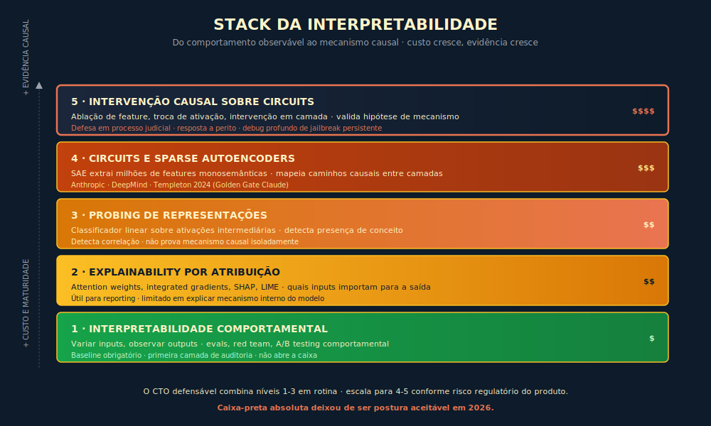

# 28. Interpretabilidade Mecanicista
*A engenharia reversa da rede que sustenta auditoria, debugging de jailbreak e defesa em processo judicial*

---

> *"A pergunta do auditor regulatório não é mais 'o modelo funciona bem', a pergunta é 'como você sabe que o modelo decidiu como decidiu', e a resposta que o CTO brasileiro precisa ter pronta em 2026, diante da ANPD, diante do juiz que avalia ação de discriminação algorítmica e diante do diretor de risco do banco que avalia parceria, depende do quanto a organização internalizou que a rede neural deixou de ser caixa-preta tolerável e passou a ser objeto de engenharia reversa exigida."*

---

## 28.1 — Conceito intuitivo: o que é interpretabilidade mecanicista e por que ela importa para CTO brasileiro

Interpretabilidade mecanicista é a disciplina que tenta fazer engenharia reversa dos circuitos internos de uma rede neural, identificando quais conjuntos de neurônios codificam quais conceitos, como esses conceitos se compõem em camadas para produzir o comportamento observável, e como intervenções causais sobre componentes internos modificam a saída do modelo de forma previsível. Distinta da interpretabilidade comportamental (em que se observa o que o modelo faz com inputs variados, sem abrir a caixa) e da interpretabilidade por probing leve (em que se treina um classificador externo sobre representações intermediárias para detectar a presença de conceito), a interpretabilidade mecanicista opera no nível dos pesos e das ativações, com pretensão de explicar o "porquê" computacional do comportamento em termos de mecanismo interno verificável, com intervenção causal validando a hipótese.

Uma distinção que importa antes de tudo: pedir ao modelo que explique o próprio raciocínio ("decidi assim porque...") não é interpretabilidade. A cadeia de raciocínio (chain-of-thought) que o modelo apresenta pode parecer transparente, mas não é necessariamente fiel ao mecanismo interno que produziu a decisão — a cadeia pode ser racionalização post hoc, construída depois que o resultado já estava determinado pelos pesos. A interpretabilidade mecanicista não se contenta com o relato; ela audita o mecanismo. Esta distinção — entre o que o modelo diz que fez e o que ele realmente computou — é o argumento central para o investimento em interpretabilidade em produtos de alto risco, e é o que separa postura defensável de caixa-preta com comentário.

A maior parte do CTO brasileiro encontra esta disciplina em 2025 e 2026 em três momentos operacionais que importam, e a sua absorção do vocabulário é determinante em cada um deles. Primeiro momento, auditoria regulatória. A ANPD, em fiscalização sobre uso de IA em decisão automatizada, pergunta como a organização sabe que o modelo não está usando atributo protegido (CPF, gênero, cor, religião declarada em cadastro) como feature de risco, e a resposta que sustenta a postura defensável combina probing, intervenção causal e, quando o risco do produto justifica, mapeamento de circuit. Segundo momento, debugging de jailbreak. O time de segurança descobre vetor de jailbreak persistente em produção, e a remediação que apenas patcha o prompt de sistema ou estende o guardrail de saída deixa a causa raiz no modelo intocada, com o vetor reaparecendo em variantes; a interpretabilidade mecanicista permite identificar o circuit que o jailbreak ativa, e intervenções mais profundas (fine-tuning direcionado, sparse autoencoder feature ablation, em alguns casos) atacam a raiz. Terceiro momento, defesa em processo judicial. Em ações de discriminação algorítmica que começaram a aparecer no Judiciário brasileiro a partir de 2024, a defesa que se sustenta exige evidência técnica sobre o que o modelo usa e não usa para decidir, com perito do juiz validando a evidência, e a organização que tem instrumentação de interpretabilidade chega à perícia em postura defensável que a organização que opera com caixa-preta absoluta não consegue sustentar.

Este capítulo entrega o mapa conceitual que o CTO brasileiro precisa ter na cabeça para conversar com o time técnico, para entender as decisões de arquitetura, para defender o investimento (e os limites do investimento) em comitê executivo. Não é, e nem deveria ser, manual técnico exaustivo, com o leitor que precisa dessa profundidade encontrando as fontes primárias nas referências. O que o capítulo entrega, em troca, é o vocabulário durável (Princípio 3, Camada Dupla) que sobrevive à evolução técnica acelerada do campo, e que permite conversar com auditor, com perito judicial, com diretor de risco e com analista de cliente Enterprise em vocabulário compartilhado.

---

## 28.2 — Analogia: a anatomia comparada como engenharia reversa do organismo

Pense em como a anatomia comparada, ciência do século dezenove e vinte que abriu o corpo de animais variados para entender como cada órgão funciona, opera intelectualmente, e perceba que a interpretabilidade mecanicista é, em muito boa medida, anatomia comparada aplicada a redes neurais. A anatomia comparada não se contenta com o comportamento observável do organismo (o leão caça, o elefante caminha, o pássaro voa); ela abre o organismo, identifica os órgãos, mapeia as conexões entre eles, testa hipóteses sobre função por meio de intervenções (lesão controlada, estimulação elétrica, comparação entre espécies em que o órgão é maior ou menor). A interpretabilidade mecanicista opera com a mesma postura aplicada à rede neural, com a diferença de que o "organismo" é matemático e a "intervenção" é ablação de neurônio, supressão de feature em sparse autoencoder, troca de ativação em camada específica, e a comparação é entre modelos treinados em condições controladas.

A analogia tem três lições que importam para o resto do capítulo. Primeira lição, a engenharia reversa é progressiva e nunca termina, com a anatomia comparada de vertebrados tendo levado mais de um século para chegar ao mapa que hoje serve à medicina, e com a interpretabilidade mecanicista, em 2026, sendo equivalente a um campo no estágio em que o microscópio começou a permitir ver a célula, com decisões importantes podendo ser tomadas com o mapa parcial, mas com o mapa completo estando décadas no futuro. Segunda lição, a intervenção causal é a única forma robusta de distinguir correlação de mecanismo, com o probing detectando que um conceito está presente em alguma representação intermediária mas não dizendo se o conceito causa o comportamento, e com a interpretabilidade mecanicista exigindo intervenção que muda a saída de forma previsível para sustentar a afirmação de mecanismo. Terceira lição, a anatomia comparada nunca pretendeu explicar tudo, e a interpretabilidade mecanicista também não pretende, com a postura honesta sendo que algumas decisões do modelo são compreendidas com profundidade suficiente para sustentar auditoria, outras são apenas mapeadas em superfície, e outras permanecem opacas. A maturidade da operação se mede pela calibração dessa honestidade, não pela pretensão de ter mapeado tudo.

A próxima seção desce ao detalhe técnico do campo, com marco zero histórico, com os papers seminais da Anthropic e da DeepMind, com os conceitos centrais explicados em vocabulário durável.

---

## 28.3 — Explicação técnica

### 28.3.1 — Marco zero: Olah, Mordvintsev e Schubert na Distill (2017-2020)

A interpretabilidade mecanicista como disciplina, com método e com vocabulário próprios, nasceu na publicação Distill entre 2017 e 2020, em sequência de artigos liderados por Chris Olah, Alexander Mordvintsev e Ludwig Schubert (entre outros colaboradores), todos na época associados ao Google Brain e em alguns casos ao OpenAI. O trabalho central, sob o título *Zoom In: An Introduction to Circuits* (Olah et al., 2020), propôs que redes neurais convolucionais treinadas em visão computacional podem ser compreendidas como composições de circuits, com unidades elementares (features) sendo neurônios ou pequenos grupos de neurônios que codificam conceitos identificáveis, com circuits sendo padrões de conexão entre essas unidades que computam comportamento mais complexo. O exemplo canônico, que ficou conhecido como o "curve detector", mostrou que existem neurônios em redes treinadas no ImageNet que ativam para curvas em orientações específicas, e que a composição desses detectores em camadas posteriores produz detectores de objetos completos.

O marco zero do campo carrega três contribuições que sobreviveram à transição para redes de linguagem grandes. Primeira contribuição, a tese de que features em redes treinadas correspondem a conceitos interpretáveis em escala bem maior do que se acreditava antes, com a mensagem inicial sendo "se você olhar com cuidado, encontra estrutura", e com essa tese sustentando o investimento contínuo de equipes de pesquisa que continuam a procurar. Segunda contribuição, a metodologia de circuits, com o pesquisador identificando o feature, mapeando a entrada que ativa ele em força máxima, mapeando a saída do feature em camadas posteriores, e validando a hipótese com intervenção causal. Terceira contribuição, a cultura de publicação em formato visual e replicável, com a Distill estabelecendo padrão de demonstração interativa que outras equipes herdaram.

Para o CTO brasileiro, a leitura útil do marco zero é entender que o vocabulário corrente em 2026 (feature, circuit, intervenção causal, monossemanticidade) nasceu nesse momento e que muitas das limitações ainda em aberto (escala, superposição, transferência para linguagem) foram identificadas já naquele trabalho. A história importa porque ela dá perspectiva sobre o ritmo do campo, com a interpretabilidade tendo levado três anos entre marco zero e tradução para linguagem, e com a tradução ainda em curso em 2026.

### 28.3.2 — Anthropic 2022-2025: monossemanticidade, sparse autoencoders e Golden Gate Claude

A tradução da interpretabilidade mecanicista para modelos de linguagem grandes consolidou-se na Anthropic entre 2022 e 2025, em sequência de papers que ficaram conhecidos como a linha *Towards Monosemanticity* e *Scaling Monosemanticity*. O primeiro paper canônico é Bricken e colaboradores em 2023 (*Towards Monosemanticity: Decomposing Language Models with Dictionary Learning*), que mostrou em modelo pequeno que sparse autoencoders (SAEs) conseguem extrair features mais interpretáveis do que neurônios individuais, resolvendo parcialmente o problema de polissemanticidade que vinha bloqueando o avanço do campo. O segundo paper canônico é Templeton e colaboradores em 2024 (*Scaling Monosemanticity: Extracting Interpretable Features from Claude 3 Sonnet*), que estendeu a técnica para modelo de fronteira e identificou milhões de features interpretáveis em Claude 3 Sonnet, incluindo features para conceitos abstratos (decepção, código vulnerável, padrões geográficos específicos), com demonstração interativa que ficou conhecida como Golden Gate Claude.

Os conceitos centrais que esses papers estabilizaram, e que o CTO brasileiro precisa carregar em vocabulário durável, são cinco.

**Feature.** Unidade interpretável da rede, frequentemente representada como direção em um espaço de ativação, que corresponde a um conceito identificável (presença de uma entidade, atributo, padrão sintático, contexto temático). Features podem ser monosemânticas (codificam um conceito) ou polissemânticas (codificam vários conceitos em superposição, conforme 28.3.3 detalha).

**Sparse Autoencoder (SAE).** Arquitetura auxiliar treinada para reconstruir ativações de uma camada do modelo a partir de um dicionário de features esparsamente ativadas, com a esparsidade forçando o aprendizado de unidades mais interpretáveis. O SAE é o instrumento principal de extração de features em modelos de fronteira em 2026, e a literatura sobre arquiteturas de SAE evoluiu rápido entre 2023 e 2025.

**Circuit.** Caminho causal de features através das camadas que computa um comportamento específico. Identificar circuit envolve mapear quais features de camada inicial alimentam quais features de camadas posteriores, e validar a hipótese com intervenção causal.

**Intervenção causal.** Modificação controlada em ativação interna do modelo (ablação de neurônio, supressão de feature, troca de ativação) que produz mudança previsível na saída, sustentando a afirmação de mecanismo causal.

**Probing.** Técnica de treinar classificador externo (em geral linear) sobre representações intermediárias do modelo para detectar a presença de conceito. Probing é instrumento útil mas insuficiente isoladamente, porque ele detecta correlação sem demonstrar mecanismo causal; a integração com intervenção causal é o que distingue interpretabilidade mecanicista madura de probing isolado.

A demonstração pública conhecida como Golden Gate Claude, publicada pela Anthropic em maio de 2024, opera como exemplo didático que merece atenção. A equipe identificou em Claude 3 Sonnet uma feature que codifica o conceito "Golden Gate Bridge" (a ponte de São Francisco), e em demonstração pública aumentou a ativação dessa feature em fator alto, produzindo modelo que insistia em mencionar a ponte em quase qualquer resposta, fosse a pergunta sobre culinária, sobre programação ou sobre filosofia. A demonstração é importante por três motivos. Primeiro, ela mostra que features em modelo de fronteira são identificáveis e manipuláveis em prática. Segundo, ela mostra que intervenção causal funciona como instrumento de validação. Terceiro, ela mostra que o uso operacional de manipulação de feature ainda é embrionário e que o efeito é frequentemente bizarro, com a manipulação produzindo comportamento que não é simplesmente "modelo focado em ponte", e sim modelo que aparenta obsessão patológica, o que é em si lição sobre a complexidade do mecanismo.

### 28.3.3 — Polissemanticidade, superposição e o paradoxo do Johnson-Lindenstrauss

A literatura encontrou cedo um problema que tornou difícil o avanço inicial da interpretabilidade em modelos grandes, e o problema tem nome técnico de superposição. A polissemanticidade é o fenômeno observado em que um neurônio individual da rede ativa para conceitos múltiplos e aparentemente não relacionados, com o exemplo canônico citado em Bricken 2023 sendo neurônios que ativam para "café e gato" simultaneamente, sem que o neurônio codifique um conceito identificável isoladamente. A monossemanticidade, em contraste, é o caso em que o neurônio (ou a feature extraída por SAE) ativa para um conceito específico que o pesquisador consegue caracterizar.

> **Intuição para não-matemáticos:** Imagine que a rede tem mil gavetas mas precisa guardar dez mil conceitos. Em vez de jogar conceitos fora, ela dobra vários em cada gaveta — de formas cuidadosamente escolhidas para que raramente se confundam. O lema de Johnson-Lindenstrauss é apenas a prova matemática de que essa dobradinha funciona. O que importa para o CTO: neurônios individuais são polissemânticos *por construção*, e desentrelaçar essa dobradinha exige o SAE (sparse autoencoder) como instrumento principal.

A causa da polissemanticidade é, conforme a hipótese da Anthropic articulada em Elhage e colaboradores em 2022 (*Toy Models of Superposition*), o fenômeno da superposição. A rede neural, em treino, descobre que ela precisa representar muito mais conceitos do que existem dimensões nas suas camadas, e em vez de ignorar conceitos, ela aprende a sobrepor representações de conceitos diferentes em direções aproximadamente ortogonais em espaço de alta dimensão. A intuição matemática que sustenta a viabilidade dessa estratégia é o lema de Johnson-Lindenstrauss, da literatura de matemática aplicada, que mostra que em espaço de dimensão alta é possível embeber muito mais pontos do que dimensões com pares aproximadamente ortogonais, com erro de ortogonalidade decaindo rapidamente com a dimensão. A rede neural, sem ter sido programada para isso, descobre essa estratégia em treino, e a superposição é a expressão prática dela.

O paradoxo aparente é que o lema de Johnson-Lindenstrauss permite mais features que dimensões, e a rede aproveita essa janela. A consequência operacional é que neurônios individuais são frequentemente polissemânticos por construção, e que extrair features interpretáveis exige instrumento que desentrelace a superposição, com SAEs sendo o instrumento principal em 2026. A consequência teórica é que a interpretabilidade enfrentará tensão estrutural entre cobertura e clareza, com tentativa de cobrir todas as features de modelo grande exigindo dicionário de SAE com escala que cresce rápido, e com a manutenção dessa escala virando problema computacional próprio.

Para o CTO brasileiro, a leitura útil de superposição é entender que a interpretabilidade não vai "abrir a caixa" no sentido de revelar uma estrutura simples por trás de cada saída, e sim no sentido de extrair, com instrumentação cuidadosa, mapa parcial do que importa para o caso de uso específico. A pretensão de transparência total é, por construção matemática, inviável; a pretensão de mapa suficiente para auditoria de casos críticos é viável e crescente, e essa é a postura defensável diante de auditor regulatório, de juiz e de cliente Enterprise.

### 28.3.4 — DeepMind: automated circuit discovery e interpretabilidade de grokking

A DeepMind contribuiu para o campo com linhas paralelas que merecem atenção, e dois trabalhos centrais ilustram o ritmo. Conmy e colaboradores em 2023 (*Towards Automated Circuit Discovery for Mechanistic Interpretability*) propuseram técnica automatizada de descoberta de circuit, em que algoritmo iterativo poda conexões irrelevantes da rede até isolar o subgrafo que computa o comportamento alvo, com validação por intervenção causal. A técnica acelera o trabalho manual de identificação de circuit, e abre caminho para escalar a interpretabilidade para modelos maiores sem exigir investimento proporcional de pesquisador humano por circuit.

Nanda e colaboradores em 2023 (*Progress measures for grokking via mechanistic interpretability*) trabalharam o fenômeno conhecido como grokking, em que rede neural treinada em tarefa específica passa por longa fase de memorização sem generalização, seguida de mudança abrupta para regime de generalização, com a interpretabilidade mecanicista identificando que o que acontece nessa transição é a substituição de circuit memorizador por circuit generalizador, com transição abrupta na arquitetura interna. O trabalho importa para o CTO em sentido específico porque ele mostra que o comportamento aparente do modelo pode esconder transições internas estruturais que a avaliação comportamental padrão não detecta. A implicação operacional é direta: um modelo treinado por mais tempo pode ter mudado de comportamento de forma qualitativa, não apenas quantitativa — e o golden set que cobria comportamento anterior pode não cobrir o comportamento pós-grokking. O sinal de alerta na prática é quando regressões aparecem em casos que o modelo resolvia antes com facilidade, sem mudança de input: é sinal de que a transição interna merece investigação, não apenas ajuste de prompt.

A leitura útil para o CTO brasileiro é que o campo tem múltiplas linhas com fontes complementares, e que a interpretabilidade não é monopólio de um laboratório, com Anthropic, DeepMind, OpenAI, equipes acadêmicas (MIT, Stanford, ETH Zurich, entre outras) contribuindo em paralelo. A escolha de qual linha seguir depende do caso de uso da organização, e a postura defensável é manter leitura ampla do campo, com o time de produto referenciando os trabalhos relevantes na arquitetura de auditoria.

### 28.3.5 — Limitações brutais: a interpretabilidade está atrasada anos atrás da capacidade

A honestidade exige reconhecer que a interpretabilidade, em 2026, está atrasada anos atrás da capacidade dos modelos. O ritmo de crescimento de modelos (de GPT-3 em 2020 para GPT-5 e equivalentes em 2026) supera, em ordem de magnitude, o ritmo de progresso da interpretabilidade, com a equipe de Anthropic chegando a mapear milhões de features em Claude 3 Sonnet em 2024, mas com Claude 4 e sucessores tendo dezenas a centenas de milhões de features potenciais, com a cobertura permanecendo parcial mesmo com investimento crescente. O efeito é estrutural, com a capacidade crescendo em curva acelerada de escala enquanto a interpretabilidade cresce em curva linear ou subexponencial de esforço humano e computacional.

As limitações práticas que o CTO precisa absorver são quatro. Primeira limitação, cobertura. A interpretabilidade mapeia uma fração do que o modelo faz, com cobertura prioritária em casos de interesse (auditoria, debugging) e cobertura ausente em casos não investigados. Segunda limitação, escala de modelo. A técnica de SAE funciona em modelos de fronteira mas exige investimento crescente em compute e em armazenamento de features extraídas, com custo que escala com tamanho do modelo. Terceira limitação, custo de pesquisador. A validação por intervenção causal exige pesquisador qualificado, com a banda de pesquisadores em interpretabilidade sendo escassa em 2026 e com a contratação interna fora do alcance da maior parte das organizações. Quarta limitação, ritmo do campo. O vocabulário e as técnicas evoluem rápido, com o que é estado da arte em 2024 ficando obsoleto em 2026, e com a operação que congela vocabulário em ponto do tempo virando obsoleta antes de absorver o investimento.

A consequência operacional para o CTO brasileiro é que a interpretabilidade é instrumento parcial, em campo em evolução acelerada, e que a estratégia defensável combina três elementos. Primeiro, parceria com fornecedor de modelo que tem time de interpretabilidade investido (Anthropic e equivalentes), em que a interpretabilidade nasce no fornecedor e a organização consome instrumentos progressivamente disponíveis. Segundo, investimento interno proporcional ao risco do produto, com produto B2C de alta exposição justificando investimento maior do que produto interno de baixo risco. Terceiro, leitura ativa do campo, com o time de IA e o time de produto acompanhando publicações e atualizando vocabulário com cadência semestral, conforme o método do Apêndice J — Trilha do Número (deste livro).

### 28.3.6 — Aplicações práticas: red teaming de circuits, auditoria regulatória e Golden Gate como demonstração

A interpretabilidade encontra aplicação prática em três frentes que importam para a operação de IA em organização séria em 2026. Primeira frente, red teaming de circuits. A equipe de segurança do produto, ao descobrir vetor de jailbreak persistente, usa instrumentação de SAE para identificar quais features são ativadas pelo input adversarial, e quais circuits convertem essa ativação em saída indesejada. A intervenção pode ser fine-tuning direcionado que dampens as features problemáticas, ou modificação de prompt de sistema que reduz a ativação inicial, ou guardrail específico que detecta o padrão de ativação. A literatura corrente trata dessa aplicação com cuidado, reconhecendo que ela ainda é em larga medida pesquisa, e que a operação em escala depende de instrumentos que estão sendo construídos.

Segunda frente, auditoria regulatória. A pergunta da ANPD sobre uso de atributo protegido em modelo de risco é endereçada com combinação de probing (detecta se o atributo está presente em representações intermediárias) e intervenção causal (se removermos a feature do atributo, o output muda?). A combinação sustenta evidência defensável que probing isolado não sustenta, e a documentação registrada no Caderno de Governança (Apêndice O) é instrumento de auditoria que dispensa o regulador de exigir acesso aos pesos do modelo. A operação em 2026 ainda é embrionária no mercado brasileiro, com poucas organizações tendo instrumentação madura, mas a tendência regulatória aponta para exigência crescente em três a cinco anos, e a organização que se prepara agora chega à exigência com método.

Terceira frente, defesa em processo judicial. Em ações de discriminação algorítmica, em ações de erro de decisão automatizada, em ações de uso indevido de dado pessoal, a defesa técnica que se sustenta combina cadeia completa de evidência (Cap. 23 sobre alignment, Cap. 19 sobre segurança, este capítulo sobre interpretabilidade), com a interpretabilidade entrando como camada de sustentação probatória. A perícia técnica do juiz, quando bem conduzida, exige evidência de mecanismo, e a organização que tem instrumentação chega ao processo em postura defensável que a organização que opera com caixa-preta absoluta não consegue construir em prazo de prazo judicial.

A demonstração do Golden Gate Claude, descrita em 28.3.2, exemplifica esta frente: a equipe identificou e manipulou feature específica em modelo de fronteira e o comportamento bizarro resultante — obsessão patológica pela ponte — é em si lição operacional sobre o cuidado necessário em intervenção. O material original está disponível em transformer-circuits.pub ou equivalente (verifique URL corrente no site oficial da Anthropic, conforme Apêndice J — Trilha do Número), e a leitura na fonte é recomendada para o CTO que quer formar visão própria sobre o que a interpretabilidade permite hoje e o que ainda está fora de alcance.

---

## 28.4 — Conexões com outros capítulos: Transformer, embeddings, segurança e alignment

A leitura deste capítulo fica suspensa no ar sem conexão com Cap. 2 (Transformer e arquitetura de atenção), com Cap. 5 (embeddings como representação distribuída), com Cap. 19 (segurança), com Cap. 23 (alignment) e com Cap. 24 (governança), e a integração é o que sustenta o sistema operacional completo.

A conexão com o Cap. 2 é estrutural. A interpretabilidade opera sobre a arquitetura Transformer e sobre as camadas de atenção que sustentam o comportamento, com o vocabulário de features e de circuits sendo aplicado às matrizes de atenção e às projeções de camadas MLP. O leitor que não internalizou Cap. 2 vai ter dificuldade com o vocabulário deste capítulo, e o caminho recomendado é releitura de Cap. 2 antes da operação prática de interpretabilidade.

A conexão com o Cap. 5 é direta. Embeddings são a forma mais visível de representação distribuída em redes neurais, e a noção de superposição (28.3.3) é generalização do que acontece em embeddings, com features sendo direções em espaço de alta dimensão que codificam conceitos. O CTO que internalizou embeddings transfere boa parte do vocabulário para interpretabilidade com naturalidade.

A conexão com o Cap. 19 é operacional. O red teaming de circuits, descrito em 28.3.6, é extensão natural do red teaming de segurança discutido no Cap. 19, com a interpretabilidade entrando como instrumento adicional na quinta camada de defesa (avaliação adversarial contínua) e como camada de sustentação probatória em incidentes graves. A organização que opera o Cap. 19 com maturidade encontra na interpretabilidade caminho de aprofundamento.

A conexão com o Cap. 23 é a peça central. A discussão de faithfulness de chain-of-thought (Cap. 23, seção 23.3.4) levanta o problema de que a cadeia apresentada pelo modelo pode mentir sobre o porquê interno, e a interpretabilidade é o instrumento que permite auditar o porquê de forma que a cadeia não permite. A combinação dos dois capítulos é o que sustenta postura defensável diante de auditor regulatório em modelos de raciocínio explícito.

A conexão com o Cap. 24 é institucional. A interpretabilidade entra no Caderno de Governança como instrumento operacional do controle aplicado, com a decisão sobre quando investir em interpretabilidade, quanto investir, qual produto cobrir, sendo decisão de AI Council com Accountable nomeado. A Princípio 8 lembra que a responsabilidade tem nome, e o nome aparece em ata aprovada, em política publicada, em runbook de auditoria.

---

## 28.5 — Exemplo memorável

> ⚠️ **Cenário composto a partir de padrões observados** — composição realista de banco médio brasileiro com modelo de risco de crédito e auditoria regulatória entre 2025 e 2026; números são críveis ao setor, não identificam organização específica.

Banco brasileiro de médio porte, cerca de mil e setecentos colaboradores, base de clientes pessoa física de cerca de quatrocentos mil correntistas, operando há vinte meses um modelo de avaliação de risco de crédito construído internamente sobre Claude com camada de fine-tuning supervisionado em base proprietária de comportamento de inadimplência. O modelo entrega score de risco em cada solicitação de crédito (cartão, empréstimo pessoal, financiamento), com decisão final passando por humano qualificado conforme política do banco, em arquitetura conservadora consciente da LGPD Art. 20. O auditor designado pela ANPD, em rotina de fiscalização que começou em janeiro de 2026, encaminha pedido formal de informação sobre uso do modelo, com pergunta direta no item três do pedido: "demonstre tecnicamente que o modelo não usa CPF, nem proxies do CPF (como sequência específica de dígitos, padrão regional do CPF), como feature de risco que influencie o score além do uso estrito de validação cadastral".

A pergunta da ANPD foge ao escopo de qualquer auditoria que o banco tinha feito até então, e o time interno (CTO, head de dados, head de risco, DPO, jurídico, head de compliance) faz mesa em D+3 do recebimento do ofício. A primeira leitura é que probing isolado não basta, porque o regulador pediu demonstração técnica de não uso, não apenas detecção de presença, e a presença do CPF em representação intermediária do modelo é estatisticamente provável simplesmente porque o CPF aparece no input. O CTO, que tinha lido o material da Anthropic sobre interpretabilidade ao longo de 2025 e tinha contratado consultoria de quatro horas mensais com pesquisador acadêmico brasileiro para tirar dúvidas, propõe abordagem em três camadas.

Primeira camada, probing externo. Treinar classificador linear sobre ativações de camadas selecionadas do modelo, com objetivo de prever o CPF a partir das ativações, e medir a acurácia. A hipótese é que se o CPF for ativamente usado no score, o classificador linear vai conseguir reconstruir CPF a partir das ativações com acurácia bem acima do baseline aleatório. O resultado, após duas semanas de trabalho com cientista de dados sênior do banco e com apoio do consultor acadêmico, é que o classificador consegue reconstruir os primeiros três dígitos do CPF (que indicam a região de emissão) com acurácia de noventa e dois por cento sobre baseline aleatório de onze por cento, sustentando a hipótese de que essa informação está presente em representação intermediária. Os demais dígitos do CPF não são reconstruíveis acima de baseline, sustentando que apenas a parte regional do CPF aparece em representação distinta.

Segunda camada, intervenção causal. Construir intervenção que remove a feature regional do CPF da representação intermediária (técnica conhecida como "concept ablation" na literatura, com referência específica a Belrose e colaboradores em 2023), e medir o efeito sobre o score final do modelo em amostra de cinco mil solicitações de crédito. O resultado, após quatro semanas de trabalho com pipeline customizado, é que a remoção da feature regional muda o score em variação que mede, em média, quatro décimos de ponto na escala de zero a dez, com variação maior em casos específicos (até dois pontos em fração baixa dos casos), com o efeito sendo desigualmente distribuído por região (correntistas do Nordeste e do Norte sendo afetados mais do que do Sul e do Sudeste). A leitura interna é que a feature regional, ainda que não use o CPF como número, codifica padrão de origem regional que influencia o score de forma materialmente relevante em fração baixa mas não negligenciável dos casos.

Terceira camada, governança e remediação. O time leva o resultado ao AI Council em D+38 do ofício da ANPD, com material técnico organizado em três páginas para diretoria e em material detalhado de doze páginas para perícia. A decisão do Council, ratificada por diretoria em D+45, é de execução de fine-tuning direcionado que dampens a feature regional, com revalidação por probing e por intervenção causal após treino. A operação leva mais sete semanas, com o modelo revisado mostrando, em segunda rodada de auditoria interna, que a feature regional ficou abaixo de baseline de detecção em probing, e que a intervenção causal não muda o score em magnitude relevante (variação média de cinco centésimos de ponto, com nenhum caso individual ultrapassando vinte centésimos). O banco fecha resposta à ANPD em D+95 do ofício, com material técnico completo, com runbook de auditoria documentado, com declaração formal de remediação concluída. A ANPD responde em D+120 com aprovação técnica da demonstração, com recomendação de manutenção de auditoria semestral da feature, e sem instalação de processo sancionador.

O custo total da operação, computado em janela de seis meses, soma três componentes. Custo direto de pesquisa interna (cientista de dados sênior dedicado, quatro semanas de outro engenheiro, apoio do head de dados em parcela do tempo) somou cerca de cento e cinquenta mil reais em alocação interna. Custo de consultoria externa (pesquisador acadêmico contratado para apoio quinzenal durante toda a operação, em valor de oito mil reais mensais) somou cerca de cinquenta mil reais. Custo de retreinamento (compute para fine-tuning direcionado, com algumas dezenas de horas de GPU contratadas em provedor de nuvem) somou cerca de trinta mil reais. O total de duzentos e trinta mil reais foi absorvido como custo de operação regulatória, com a justificativa registrada em ata sendo de que a operação produziu, além da resposta à ANPD, instrumento de auditoria reutilizável para futuras solicitações regulatórias e para defesa em eventual ação judicial sobre uso indevido de dado pessoal.

A lição estrutural do caso, transcrita em ata do AI Council e compartilhada com associação setorial em fórum fechado em agosto de 2026, é dura e merece transcrição. *A pergunta do regulador deslocou-se de "o modelo funciona bem" para "como você sabe que o modelo decidiu como decidiu", e a resposta defensável exige instrumentação de interpretabilidade que precisa estar pronta antes do ofício chegar. O banco que opera o modelo como caixa-preta absoluta vai chegar à fiscalização sem instrumento de defesa, e a remediação retroativa em prazo de auditoria é incomparavelmente mais cara do que a instrumentação preventiva. A interpretabilidade não é luxo acadêmico, é hoje camada de auditoria que o regulador, o juiz e o cliente Enterprise começam a exigir.*

> 🎯 **PARA EXECUTIVOS**
> Faça três perguntas duras esta semana ao time técnico e ao DPO. (1) Se a ANPD enviasse hoje pedido formal de demonstração técnica de que o nosso modelo não usa atributo protegido como feature, em quanto tempo conseguiríamos responder e qual seria a qualidade da demonstração? (2) Existe, na nossa arquitetura de modelo crítico, instrumentação mínima de probing e de intervenção causal, ou operamos com caixa-preta absoluta? (3) Em qual cenário de processo judicial nosso pior caso ficaria mais exposto, e a interpretabilidade entraria como camada de sustentação probatória?

---

## 28.6 — Conexões com outros capítulos

- 🔗 **Transformer e atenção** como arquitetura sobre a qual a interpretabilidade opera → Cap 2
- 🔗 **Embeddings como representação distribuída** que sustenta o vocabulário de feature e superposição → Cap 5
- 🔗 **Segurança em camadas** integrada à interpretabilidade no red teaming de circuits → Cap 19
- 🔗 **Alignment e faithfulness de chain-of-thought** que dependem da interpretabilidade para auditoria do mecanismo → Cap 23
- 🔗 **Governança institucional** que organiza investimento e Accountable em interpretabilidade → Cap 24
- 🔗 **Caderno de Governança v1** como artefato vivo onde a auditoria de interpretabilidade é registrada → Apêndice O

---

## 28.7 — Resumo executivo

| Conceito | Síntese |
|----------|---------|
| **O que é** | Engenharia reversa de circuits internos da rede neural, distinta de probing leve e de interpretabilidade comportamental |
| **Por que importa para CTO BR** | Auditoria regulatória, debugging de jailbreak, defesa em processo judicial |
| **Marco zero** | Olah, Mordvintsev e Schubert na Distill (2017-2020), circuits em visão computacional |
| **Anthropic 2022-2025** | Towards Monosemanticity (Bricken 2023), Scaling Monosemanticity (Templeton 2024), sparse autoencoders, Golden Gate Claude |
| **DeepMind 2023** | Conmy (automated circuit discovery), Nanda (grokking interpretability) |
| **Feature** | Unidade interpretável, direção em espaço de ativação que codifica conceito identificável |
| **Sparse Autoencoder (SAE)** | Arquitetura auxiliar que extrai features esparsamente ativadas, instrumento principal de extração em 2026 |
| **Circuit** | Caminho causal de features através das camadas que computa comportamento específico |
| **Polissemanticidade × monossemanticidade** | Neurônios que ativam para conceitos múltiplos × features puras extraídas por SAE |
| **Superposição** | Rede embebe mais features que dimensões, sustentada pelo lema de Johnson-Lindenstrauss |
| **Probing × intervenção causal** | Probing detecta correlação, intervenção causal sustenta afirmação de mecanismo |
| **Limitações brutais** | Cobertura parcial, escala que cresce com modelo, escassez de pesquisador, ritmo acelerado do campo |
| **Aplicações práticas** | Red teaming de circuits, auditoria regulatória, defesa em processo judicial |

---

## 28.8 — Checklist do capítulo

- [ ] Distinguir, em uma frase, interpretabilidade mecanicista de probing leve e de interpretabilidade comportamental
- [ ] Identificar, em vocabulário durável, o que é feature, circuit, sparse autoencoder e intervenção causal
- [ ] Explicar a hipótese de superposição e a sua relação com o lema de Johnson-Lindenstrauss
- [ ] Saber qual paper da Anthropic é referência canônica em monosemanticidade e em sparse autoencoders
- [ ] Identificar limitações brutais da interpretabilidade em 2026, com cobertura parcial e ritmo do campo
- [ ] Mapear na organização quais produtos justificam investimento em interpretabilidade (B2C de alta exposição, decisão regulada, exposição judicial)
- [ ] Conversar com fornecedor de modelo sobre publicações de interpretabilidade do laboratório dele, e absorver instrumentos progressivamente disponíveis
- [ ] Identificar pesquisador acadêmico ou consultoria especializada para apoio em casos críticos
- [ ] Construir instrumentação mínima de probing em produto crítico, com pipeline reutilizável em auditoria
- [ ] Documentar capacidade de intervenção causal em produto crítico, com runbook em Caderno de Governança
- [ ] Marcar cadência de releitura do campo (semestral, conforme método do Apêndice J — Trilha do Número)
- [ ] Conectar o capítulo com Cap 2 (Transformer), Cap 5 (Embeddings), Cap 19 (Segurança), Cap 23 (Alignment), Cap 24 (Governança)

---

## 28.9 — Perguntas de revisão

1. Por que a interpretabilidade mecanicista é distinta de probing leve, e qual é o argumento operacional para insistir em intervenção causal além de probing?
2. Qual é a tese central de Olah et al. 2020 sobre circuits, e como ela sobreviveu à transição para modelos de linguagem grandes?
3. O que são sparse autoencoders, e por que eles resolvem parcialmente o problema de polissemanticidade?
4. Como o lema de Johnson-Lindenstrauss sustenta matematicamente a viabilidade da superposição em redes neurais grandes?
5. Qual é a tese da demonstração Golden Gate Claude da Anthropic, e qual é a lição operacional sobre a complexidade da intervenção em feature isolada?
6. Quais são as quatro limitações brutais da interpretabilidade em 2026, e como elas calibram a expectativa do CTO sobre o que esperar e o que não esperar do investimento?
7. Em qual cenário de auditoria regulatória a interpretabilidade entra como camada de sustentação probatória, e qual é a combinação de probing e intervenção causal que sustenta postura defensável?
8. Como o Cap 28 se amarra ao Cap 2 (Transformer), ao Cap 23 (Alignment) e ao Cap 24 (Governança) em sistema integrado de operação de IA com auditabilidade real?

---

## 28.10 — Exercícios práticos

**Exercício 1 — Mapa de produtos por risco.** Em folha em branco, liste os produtos de IA da organização e classifique cada um em três categorias de risco de auditoria (alto, médio, baixo) conforme exposição regulatória, exposição judicial e exposição reputacional. Para os produtos de risco alto, identifique se a organização tem instrumentação mínima de probing, e construa plano de remediação em noventa dias para os gaps.

**Exercício 2 — Diálogo com fornecedor.** Em conversa com o fornecedor do modelo principal em produção, faça três perguntas: (1) quais publicações de interpretabilidade do laboratório do fornecedor estão disponíveis, e quais instrumentos práticos para o cliente; (2) qual é o roadmap de instrumentos de interpretabilidade para clientes corporativos; (3) qual é a postura do fornecedor sobre auditoria regulatória que exige demonstração técnica de uso ou não uso de atributo. Documente as respostas e leve ao AI Council.

**Exercício 3 — Simulação de pedido regulatório.** Em sessão de quatro horas com CTO, DPO, head de dados e jurídico, simule pedido formal de regulador que pergunte "como vocês demonstram que o modelo X não usa atributo Y como feature de risco". Documente a estrutura da resposta que a organização daria hoje, identifique as lacunas e proponha plano de instrumentação em noventa dias.

**Exercício 4 — Leitura ativa do campo.** Marque calendário semestral de releitura do campo de interpretabilidade, com lista de fontes a verificar (publicações da Anthropic em interpretabilidade — transformer-circuits.pub ou equivalente, verificar URL corrente no site oficial; boletins curados do Alignment Forum e do LessWrong sobre interpretabilidade; sínteses de conferências publicadas por equipes de pesquisa, não os papers brutos de NeurIPS e ICML, que exigem pesquisador treinado para triagem), com responsável nomeado para a leitura e síntese, com apresentação ao AI Council em quinze minutos por trimestre.

---

## 28.11 — Projeto do capítulo

**Construir o Documento de Interpretabilidade v0 da organização.** Entregável em três a cinco páginas, integrado ao Caderno de Governança (Apêndice O) como anexo operacional. Conteúdo:

1. Mapa de produtos de IA da organização, com classificação de risco de auditoria.
2. Posicionamento da organização sobre interpretabilidade, com nível de ambição calibrado ao risco (instrumentação mínima, instrumentação moderada, instrumentação avançada).
3. Identificação de pesquisador acadêmico ou consultoria especializada disponível para casos críticos, com cadência de consulta proposta.
4. Pipeline mínimo de probing em produto crítico, com referência técnica, com runbook documentado.
5. Procedimento de resposta a pedido regulatório que exige demonstração técnica, com prazo e Accountable nomeado.
6. Cadência de releitura do campo, com responsável e apresentação ao AI Council.
7. Conexão com o Caderno de Red Team v0 (Cap. 19) e com o Documento de Alignment v0 (Cap. 23).
8. Orçamento anual proposto, calibrado contra o risco dos produtos cobertos.

**Critério de qualidade.** Outro CTO, sem contexto, lê o documento e responde sem ambiguidade às perguntas: "qual é o nível de ambição da organização em interpretabilidade?", "se o regulador enviar pedido formal amanhã, em quanto tempo a organização responde e com qual qualidade?", "quem é o Accountable nomeado por interpretabilidade dos produtos críticos?".

---

## 28.12 — Referências principais

📚 **Marco zero do campo**
- Olah, C. et al. *Zoom In: An Introduction to Circuits* (Distill, 2020) — paper canônico de circuits em visão computacional
- Olah, C. et al. *Feature Visualization* e *The Building Blocks of Interpretability* (Distill, 2017-2018) — fundamentos visuais e conceituais

📚 **Anthropic 2022-2025**
- Elhage, N. et al. *Toy Models of Superposition* (2022) — hipótese de superposição em modelos pequenos
- Bricken, T. et al. *Towards Monosemanticity: Decomposing Language Models with Dictionary Learning* (2023) — sparse autoencoders em modelos pequenos
- Templeton, A. et al. *Scaling Monosemanticity: Extracting Interpretable Features from Claude 3 Sonnet* (2024) — escala em modelo de fronteira, inclui Golden Gate Claude
- Lindsey, J. et al. *Open Source Replication of Anthropic's Crosscoder Model Diffing* (publicações sucessivas em transformer-circuits.pub) — instrumentos abertos
- Material aberto da Anthropic em transformer-circuits.pub (atualizado em cadência regular)

📚 **DeepMind e equipes complementares**
- Conmy, A. et al. *Towards Automated Circuit Discovery for Mechanistic Interpretability* (2023) — descoberta automatizada
- Nanda, N. et al. *Progress measures for grokking via mechanistic interpretability* (2023) — interpretabilidade aplicada a grokking
- Belrose, N. et al. *LEACE: Perfect Linear Concept Erasure in Closed Form* (2023) — técnica de concept erasure, base para intervenção causal

📚 **Faithfulness e relação com alignment**
- Lanham, T. et al. *Measuring Faithfulness in Chain-of-Thought Reasoning* (2023) — faithfulness de CoT, conexão direta com o Cap 23
- Hendrycks, D. et al. *Aligning AI with Shared Human Values* (2020) — contexto mais amplo de alignment auditável

📚 **Padrões brasileiros**
- LGPD (Lei 13.709/2018), especialmente Arts. 18, 20 sobre direitos do titular e decisão automatizada
- ANPD — Notas Técnicas sobre IA generativa e sobre decisão automatizada (versão corrente verificável em fonte oficial)
- Marco Legal da IA no Brasil (PL 2338/2023 ou legislação resultante — status em tramitação na data de fechamento desta edição; verifique situação atual em fonte oficial antes de citar em contexto regulatório, conforme Apêndice J — Trilha do Número)
- Resolução do Conselho Monetário Nacional sobre uso de IA em decisão de crédito (versões aplicáveis em 2026, verificáveis em fonte oficial)

📚 **Frameworks operacionais de referência**
- NIST AI Risk Management Framework (AI RMF 1.0, 2023) — função Measure inclui interpretabilidade
- EU AI Act (Regulation 2024/1689) — obrigações de transparência para sistemas de alto risco incluem trilha de auditoria
- ISO/IEC 42001 — Sistema de gestão de inteligência artificial (2023) — referência à auditabilidade

A versão corrente de cada documento, especialmente as Notas Técnicas da ANPD e resoluções regulatórias setoriais, deve ser confirmada em fonte oficial datada conforme o método do Apêndice J — Trilha do Número (deste livro).

---

## 28.13 — Autoavaliação

| # | Critério | Você consegue? |
|---|----------|----------------|
| 1 | **Clareza** — Explicar em noventa segundos a um diretor não-técnico o que é interpretabilidade mecanicista, usando a analogia da anatomia comparada, e por que ela importa para auditoria regulatória | ☐ |
| 2 | **Profundidade** — Defender em mesa técnica com auditor regulatório a combinação de probing e intervenção causal como evidência defensável de que atributo protegido não influencia o score do modelo | ☐ |
| 3 | **Aplicação** — Apontar, agora, qual produto da organização justificaria investimento em instrumentação mínima de interpretabilidade nos próximos noventa dias, e qual é o gap atual | ☐ |
| 4 | **Conexão** — Articular como o Cap 28 amarra o Cap 2 (Transformer), o Cap 5 (Embeddings), o Cap 19 (Segurança), o Cap 23 (Alignment) e o Cap 24 (Governança) em sistema integrado de operação com auditabilidade real | ☐ |
| 5 | **Curiosidade** — Está com vontade de ler o paper Scaling Monosemanticity da Anthropic na fonte original e de visitar transformer-circuits.pub | ☐ |

---

> *"A pergunta do auditor deslocou-se de 'o modelo funciona bem' para 'como você sabe que o modelo decidiu como decidiu', e a resposta defensável exige instrumento que precisa estar pronto antes do ofício chegar."*
