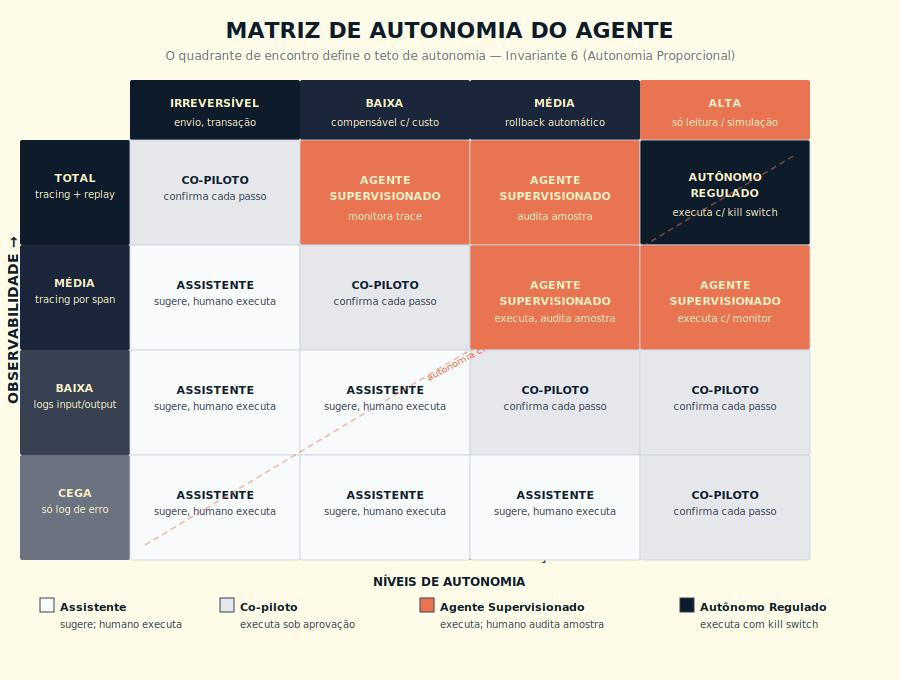

# F3 — Escala de Propriedade do Agente
## Arquitetura de agentes por autonomia proporcional

## 1. OBJETIVO

Decidir o nível de autonomia que um agente pode receber, em função direta de duas capacidades operacionais: **rastrear** (observabilidade) e **reverter** (rollback). Garantir que autonomia delegada nunca exceda a proporção que o time consegue medir e desfazer.

> **Escopo de observabilidade neste framework:** F3 usa observabilidade para medir a capacidade de rastrear o agente (tracing por span, replay). A âncora autoritativa de observabilidade de IA em produção é o Cap 22 — LLMOps; F5 cobre observabilidade de integração; F6 e F7 cobrem observabilidade de governança e custo, respectivamente.

## 2. FUNCIONAMENTO

Matriz 4×4 cruzando observabilidade × reversibilidade. O quadrante de encontro determina o nível máximo de autonomia permitido na iniciativa.

### Eixos da matriz

**Eixo X — Observabilidade disponível:**
1. Nenhuma (só log de erro)
2. Logs estruturados de input/output
3. Tracing por span (registro individual de cada etapa do agente — input, output, latência, tokens e custo por passo — identificado por ID único que permite rastrear a cadeia completa de decisões)
4. Tracing + replay (tracing completo **mais** capacidade de re-executar exatamente a mesma sequência de passos, com o mesmo input, para diagnóstico de incidente sem depender de memória ou reconstituição manual)

**Eixo Y — Reversibilidade da ação:**
1. Nenhuma (irreversível — envio externo, comunicação a cliente, transação financeira)
2. Compensável (existe ação de desfazer com custo)
3. Totalmente reversível (rollback automático, idempotente)
4. Sem efeito externo (só leitura, simulação)

### Os 4 níveis canônicos de autonomia

| Nível | Quando aplicar | Tipo de ação permitida |
|-------|----------------|-------------------------|
| **Assistente** | Observabilidade 1-2 OU reversibilidade 1 sem rollback | Gera proposta; humano executa |
| **Co-piloto** | Observabilidade 2-3 + reversibilidade 2 | Executa com confirmação a cada passo crítico |
| **Agente supervisionado** | Observabilidade 3 + reversibilidade 3 + humano monitora trace em tempo real | Executa em lote; humano interrompe se algo errado |
| **Agente autônomo regulado** | Observabilidade 4 + reversibilidade 3-4 + eval online + kill switch testado | Executa em produção sem supervisão direta, com gates de promoção |

### Gates de promoção entre níveis

Promoção entre níveis exige:
1. **Métrica de qualidade** estável por N dias. **Calibração de N:** 14 dias para ação reversível com impacto interno; 30 dias para ação com efeito externo (e-mail, mensagem, transação); 60 dias ou mais para ação irreversível de alto impacto (financeiro, jurídico, clínico). Justificar explicitamente qualquer N abaixo do padrão para o nível de risco.
2. **Zero incidentes** SEV-1 ou SEV-2 no período
3. **Custo composto** dentro do envelope acordado
4. **Aprovação nominal** do dono operacional (Invariante 8)
5. **Plano de rollback** testado no nível em questão

Rebaixamento é automático: incidente SEV-1 ou SEV-2 desativa promoção até nova análise.

## 3. OUTPUT

| Campo | Conteúdo |
|-------|----------|
| Nível atual autorizado | Assistente / Co-piloto / Supervisionado / Autônomo regulado |
| Tools permitidas no nível | Lista com permissões (read-only, write com confirmação, write livre) |
| Gates de promoção | Condições explícitas e mensuráveis para subir de nível |
| Critérios de rebaixamento | Triggers que retornam o agente a nível anterior |
| Kill switch | Quem aciona, em quantos segundos, e como testar |
| Plano de rollback | Estado anterior em hot standby; teste mensal documentado |

## 4. EXEMPLO DE USO

**Caso:** agente que envia e-mail externo de boas-vindas em onboarding de cliente B2B.

| Dimensão | Avaliação |
|----------|-----------|
| Observabilidade | Tracing por span existe (3); replay não |
| Reversibilidade da ação | Compensável (e-mail de apologia, escalonamento humano) — nível 2 |
| Quadrante de encontro | Observabilidade 3 + reversibilidade 2 → **Co-piloto** |

**Decisão inicial:** agente opera como co-piloto, com confirmação humana a cada e-mail antes do envio nos primeiros 30 dias.

**Gates de promoção a agente supervisionado:** zero reclamação de cliente em 30 dias, taxa de aprovação humana >95%, eval comportamental sem regressão. Após promoção, humano monitora trace em dashboard mas não confirma cada envio.

**Gate de promoção a agente autônomo regulado:** após mais 60 dias de operação supervisionada sem incidente, implementação de replay completo (atinge observabilidade 4), kill switch testado em simulado mensal.

**Kill switch:** desliga via feature flag em ≤30 segundos. Testado mensalmente em staging com rollback simulado. Dono: VP de Customer Success.

## 5. ANTI-PADRÕES

| Anti-padrão | Por que mata |
|-------------|--------------|
| Agente autônomo com escrita em produção sem tracing | Passivo, não ativo; incidente vira investigação de semanas |
| "A IA é boa, podemos confiar" como justificativa de pular níveis | Quando ela falhar (e vai), não há observabilidade para reconstruir |
| Kill switch teórico (existe no roadmap, nunca foi testado) | Na hora do incidente, descobre-se que não funciona |
| Rollback documentado, nunca exercitado | Rollback que não é testado, na hora não funciona |
| Tratar todos os agentes da empresa no mesmo nível | Ignora variação real de risco entre casos de uso |

## 6. CONEXÕES

- 🔗 Manifesto dos Invariantes
- 🔗 Cap 12 — Agentes
- 🔗 Cap 22 — LLMOps (os 7 pilares operacionais sustentam o framework)
- 🔗 Cap 24 — Claude Code (L2)
- 🔗 Cap 32 — Subagents (L2)
- 🔗 Método de Decisão para Adotar IA (passo 3 do F1: define o risco; F3 decide o nível)
- 🔗 Pirâmide da Avaliação (eval suporta promoção entre níveis)
- 🔗 Governança Indelegável (Invariante 8 sustenta o "dono" de cada nível)

---

> *"Autonomia sem rollback testado é passivo no balanço. Não importa que esteja funcionando hoje."*
